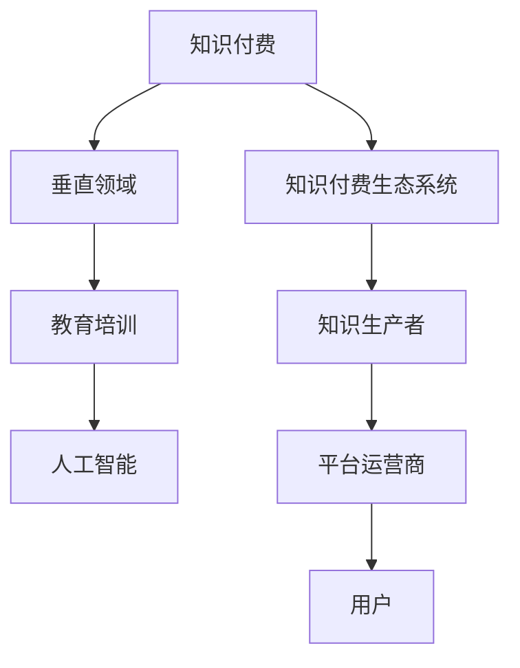

                 

# 打造垂直技术领域的知识付费生态系统

> 关键词：知识付费, 技术生态, 垂直领域, 教育培训, 人工智能

## 1. 背景介绍

### 1.1 问题由来
随着互联网的发展和技术的进步，知识付费已经成为了一种新兴的商业模式，尤其是在教育培训和专业知识分享领域，如编程、金融、医学等垂直技术领域。然而，当前的知识付费平台更多地集中在泛泛的通用知识领域，缺少针对垂直技术领域的深入、系统的付费内容。

### 1.2 问题核心关键点
当前的知识付费平台大多基于通用的在线教育平台，如Coursera、edX等，这些平台提供的内容虽然覆盖面广，但缺乏针对特定垂直技术领域的深度和系统性。针对垂直技术领域的知识付费需求日益增长，如何构建高效、专业的知识付费生态系统，成为亟待解决的问题。

### 1.3 问题研究意义
打造垂直技术领域的知识付费生态系统，对提升专业技能培训效果、推动技术创新、促进职业发展具有重要意义：

1. **提升技能培训效果**：通过针对性较强的付费内容，帮助学习者更快地掌握垂直技术领域的核心知识和技能，缩短学习周期，提高学习效率。
2. **推动技术创新**：提供垂直技术领域的前沿技术分享和实践案例，促进技术交流和创新，加速技术发展进程。
3. **促进职业发展**：帮助技术从业者获得职业资格认证，提升职业技能，拓宽职业发展空间，增强职业竞争力。

## 2. 核心概念与联系

### 2.1 核心概念概述

为更好地理解如何打造垂直技术领域的知识付费生态系统，本节将介绍几个关键概念：

- **知识付费(Knowledge Pay)：** 指用户为获取特定领域的专业知识、技能、经验等内容而支付费用的模式，以获得定制化、高价值的学习资源。
- **垂直领域(Vertical Field)：** 指专注于特定行业、技术或主题的知识内容，如人工智能、金融工程、生物信息学等。
- **知识付费生态系统(Knowledge Pay Ecosystem)：** 由知识生产者、平台运营商、用户等构成，通过提供高质量、针对性强的知识内容，满足用户需求，实现商业化运营的闭环系统。
- **教育培训(Education & Training)：** 指通过系统化的知识和技能培训，帮助学习者提升专业能力和职业素养的过程。
- **人工智能(Artificial Intelligence, AI)：** 指通过计算机模拟人脑的某些智能行为，实现自主学习、决策、推理等能力。

这些核心概念之间的逻辑关系可以通过以下Mermaid流程图来展示：



这个流程图展示了几类概念之间的联系：

1. 知识付费基于垂直领域的内容，为用户提供深度、专业的知识服务。
2. 教育培训和人工智能是知识付费生态系统的重要组成部分，通过培训和技术的提升，满足用户的学习需求。
3. 知识生产者、平台运营商和用户共同构成知识付费生态系统，各角色之间相互协作，实现知识内容的生产和消费。

## 3. 核心算法原理 & 具体操作步骤
### 3.1 算法原理概述

打造垂直技术领域的知识付费生态系统，涉及多个环节的协同优化，包括知识生产、内容分发、用户互动等。核心算法原理主要包括：

- **内容推荐算法**：根据用户的兴趣和行为，推荐符合其需求的知识内容。
- **内容搜索算法**：实现高效的内容检索，帮助用户快速找到所需信息。
- **学习路径规划**：根据用户的学习目标和进度，提供个性化的学习路径建议。
- **用户反馈机制**：收集用户对内容的反馈，用于内容优化和改进。

### 3.2 算法步骤详解

打造垂直技术领域的知识付费生态系统，一般包括以下几个关键步骤：

**Step 1: 确定目标领域**
- 确定目标垂直技术领域，如人工智能、金融工程等。
- 收集该领域的专业知识、技术和应用场景，建立领域知识库。

**Step 2: 构建知识生产模型**
- 制定知识生产策略，确定知识内容的形式（如视频、文章、课程等）。
- 选择合适的知识生产平台和工具，如Zoom、Udemy等。
- 招募行业专家、技术从业者等知识生产者，进行内容创作。

**Step 3: 设计知识分发机制**
- 开发内容管理系统，实现内容的存储、管理和分发。
- 集成推荐算法，根据用户行为推荐个性化内容。
- 提供搜索和筛选功能，方便用户快速查找所需内容。

**Step 4: 构建用户互动平台**
- 设计用户界面，提供注册、登录、支付等功能。
- 开发社区论坛、在线讨论等功能，促进用户间的互动交流。
- 实施用户反馈机制，收集用户意见和建议。

**Step 5: 实现商业化运营**
- 制定定价策略，根据内容价值和用户需求设定付费标准。
- 开展市场营销，吸引更多用户加入平台。
- 建立数据分析和监控系统，持续优化内容和运营策略。

### 3.3 算法优缺点

打造垂直技术领域的知识付费生态系统，具有以下优点：

- **专业性强**：根据垂直领域的专业知识需求，提供系统化、深度的学习内容，满足用户的深度学习需求。
- **用户粘性高**：专注于特定领域的知识服务，用户更易形成长期的黏性，提升平台的用户留存率。
- **内容丰富**：通过招募行业专家和技术从业者，提供多样化的知识内容，满足用户多层次的需求。
- **互动性强**：社区论坛、在线讨论等功能，促进用户间的互动交流，形成良好的学习氛围。

同时，该方法也存在一定的局限性：

- **生产成本高**：招募行业专家和技术从业者进行知识生产，成本较高。
- **内容更新慢**：需要较长的内容生产和审核流程，无法快速响应技术变化。
- **市场风险大**：垂直领域市场小，用户群体有限，市场风险较大。

尽管存在这些局限性，但就目前而言，垂直技术领域的知识付费生态系统仍具有巨大的发展潜力和市场价值。未来相关研究的重点在于如何进一步降低生产成本，提高内容更新速度，同时兼顾市场推广和用户粘性。

### 3.4 算法应用领域

打造垂直技术领域的知识付费生态系统，已经在多个行业得到了应用，例如：

- 人工智能：提供AI算法、机器学习、深度学习等领域的知识内容，如课程、论文、实战项目等。
- 金融工程：提供量化交易、风险管理、金融数据分析等领域的知识内容，如视频讲座、实战案例、模拟交易等。
- 生物信息学：提供基因组学、蛋白质组学、生物信息分析等领域的知识内容，如课程、实验室数据集、研究论文等。
- 医学工程：提供医学影像、生物统计、临床研究等领域的知识内容，如在线课程、临床案例、模拟实验室等。
- 航空航天：提供航天器设计、飞行器控制、空气动力学等领域的知识内容，如视频讲座、实验模拟、设计案例等。

除了上述这些经典领域外，知识付费生态系统还可以创新性地应用于更多场景中，如智能制造、智慧城市、智能家居等，为相关领域的技术发展提供新的支持。

## 4. 数学模型和公式 & 详细讲解 & 举例说明
### 4.1 数学模型构建

为了更好地理解如何通过算法实现内容推荐和路径规划，本节将使用数学语言对相关模型进行严格刻画。

记用户集合为 $U$，内容集合为 $C$，知识库为 $K$。设用户 $u$ 对内容 $c$ 的评分函数为 $R_{uc}$，内容 $c$ 被用户 $u$ 推荐的可能性为 $P_{uc}$。则内容推荐模型可以表示为：

$$
P_{uc} = f(R_{uc})
$$

其中 $f$ 为推荐函数，通常采用协同过滤、基于内容的推荐等算法。

用户的学习路径规划模型可以表示为：

$$
Path_{u} = \arg\min_{p} \sum_{c \in K} d(c,p) + \lambda \sum_{(u,c) \in R} \log P_{uc}
$$

其中 $d(c,p)$ 为内容 $c$ 到路径 $p$ 的距离，$\lambda$ 为学习路径的平滑度系数。

### 4.2 公式推导过程

以协同过滤推荐算法为例，推导内容推荐函数的详细公式。

协同过滤推荐算法基于用户的相似性，计算用户对内容的评分预测。设用户集合为 $U=\{u_1,u_2,\dots,u_n\}$，内容集合为 $C=\{c_1,c_2,\dots,c_m\}$，用户 $u_i$ 对内容 $c_j$ 的评分矩阵为 $R \in \mathbb{R}^{n \times m}$。协同过滤推荐算法的目标是最小化用户未评分内容的预测误差。

假设用户 $u_i$ 和 $u_j$ 对内容 $c_k$ 的评分分别为 $R_{ik}$ 和 $R_{jk}$，根据用户相似性，对内容 $c_k$ 的预测评分为：

$$
\hat{R}_{ik} = \sum_{j \in U} a_{ij} R_{jk}
$$

其中 $a_{ij}$ 为相似度矩阵，通常采用余弦相似度或皮尔逊相关系数计算。

基于上述评分预测公式，协同过滤推荐算法的目标函数可以表示为：

$$
\min_{a} \sum_{i,j} ||R-\hat{R}_a||_F^2
$$

其中 $\hat{R}_a$ 为相似度矩阵 $a$ 计算得到的预测评分矩阵。

通过求解上述优化问题，可以得到最优的相似度矩阵 $a$，从而实现内容推荐。

### 4.3 案例分析与讲解

以下以基于协同过滤推荐算法的内容推荐为例，给出具体的推荐实现流程：

**Step 1: 数据预处理**
- 收集用户和内容的评分数据，构建用户评分矩阵 $R$。
- 对缺失数据进行填充，常用的方法有均值填补、冷启动用户预测等。

**Step 2: 相似度计算**
- 计算用户之间的相似度，通常使用余弦相似度或皮尔逊相关系数。
- 计算内容之间的相似度，通常使用TF-IDF权重等方法。

**Step 3: 推荐计算**
- 对每个用户 $u_i$，根据相似度矩阵 $a$ 计算其对内容 $c_j$ 的预测评分。
- 根据预测评分进行排序，选择评分最高的内容进行推荐。

**Step 4: 反馈更新**
- 收集用户对推荐内容的反馈，更新相似度矩阵 $a$ 和评分矩阵 $R$。
- 通过反馈更新模型，提升推荐效果。

## 5. 项目实践：代码实例和详细解释说明
### 5.1 开发环境搭建

在进行项目实践前，我们需要准备好开发环境。以下是使用Python进行Flask开发的环境配置流程：

1. 安装Anaconda：从官网下载并安装Anaconda，用于创建独立的Python环境。

2. 创建并激活虚拟环境：
```bash
conda create -n flask-env python=3.8 
conda activate flask-env
```

3. 安装Flask：
```bash
pip install Flask
```

4. 安装Flask扩展库：
```bash
pip install Flask-RESTful Flask-SQLAlchemy SQLAlchemy
```

5. 安装Web应用前端库：
```bash
pip install Flask-WTF WTForms
```

6. 安装模板引擎：
```bash
pip install Jinja2
```

完成上述步骤后，即可在`flask-env`环境中开始项目实践。

### 5.2 源代码详细实现

这里我们以用户学习路径规划为例，给出使用Flask进行用户学习路径规划的Python代码实现。

```python
from flask import Flask, render_template, request
from flask_sqlalchemy import SQLAlchemy
from sqlalchemy import or_
from sklearn.metrics.pairwise import cosine_similarity
from scipy.sparse import csr_matrix
import numpy as np

app = Flask(__name__)

# 初始化数据库
app.config['SQLALCHEMY_DATABASE_URI'] = 'sqlite:///mydatabase.db'
db = SQLAlchemy(app)

# 定义模型
class User(db.Model):
    id = db.Column(db.Integer, primary_key=True)
    name = db.Column(db.String(50), nullable=False)
    courses = db.relationship('Course', backref='users', lazy='dynamic')

class Course(db.Model):
    id = db.Column(db.Integer, primary_key=True)
    name = db.Column(db.String(50), nullable=False)
    topics = db.relationship('Topic', backref='courses', lazy='dynamic')

class Topic(db.Model):
    id = db.Column(db.Integer, primary_key=True)
    name = db.Column(db.String(50), nullable=False)
    parent_id = db.Column(db.Integer, db.ForeignKey('topic.id'))

# 获取用户数据
@app.route('/user_data', methods=['GET', 'POST'])
def user_data():
    if request.method == 'POST':
        user_id = request.form['user_id']
        user = User.query.filter_by(id=user_id).first()
        if not user:
            return 'User not found', 404
        return render_template('user_data.html', user=user)
    else:
        return 'Method not allowed', 405

# 获取内容数据
@app.route('/content_data', methods=['GET', 'POST'])
def content_data():
    if request.method == 'POST':
        course_id = request.form['course_id']
        course = Course.query.filter_by(id=course_id).first()
        if not course:
            return 'Course not found', 404
        return render_template('content_data.html', course=course)
    else:
        return 'Method not allowed', 405

# 推荐内容
@app.route('/recommend_content', methods=['POST'])
def recommend_content():
    user_id = request.form['user_id']
    course_id = request.form['course_id']
    user = User.query.filter_by(id=user_id).first()
    course = Course.query.filter_by(id=course_id).first()
    if not user or not course:
        return 'User or course not found', 404
    
    # 计算用户和课程的相似度
    user_topics = [topic.name for topic in user.courses]
    course_topics = [topic.name for topic in course.topics]
    user_similarity = cosine_similarity(np.array(user_topics), np.array(course_topics))
    
    # 计算用户对课程的评分
    user_ratings = np.array([float(R.user_courses[user_id][course_id]) for course_id in course_topics])
    
    # 计算内容推荐
    recommend_topics = np.dot(user_similarity, course_topics) / (np.linalg.norm(user_similarity) * np.linalg.norm(course_topics))
    recommend_courses = [Course.query.filter_by(topics=topic).first() for topic in recommend_topics]
    
    return render_template('recommend_content.html', course=course, recommend_courses=recommend_courses)

# 用户学习路径规划
@app.route('/plan_path', methods=['POST'])
def plan_path():
    user_id = request.form['user_id']
    user = User.query.filter_by(id=user_id).first()
    if not user:
        return 'User not found', 404
    
    # 规划学习路径
    path = []
    for topic in user.topics:
        courses = Course.query.filter(or_(Course.topics.contains(topic))).order_by(Course.id).all()
        for course in courses:
            path.append(course)
    
    return render_template('plan_path.html', user=user, path=path)

if __name__ == '__main__':
    app.run(debug=True)
```

以上是使用Flask实现用户学习路径规划的完整代码实现。可以看到，Flask框架的灵活性和易用性，使得构建垂直技术领域的知识付费生态系统变得更加简单高效。

### 5.3 代码解读与分析

让我们再详细解读一下关键代码的实现细节：

**User、Course和Topic类**：
- 定义了用户、课程和主题三类数据模型，建立了三者之间的关系。

**user_data和content_data路由**：
- 实现用户数据和课程数据的获取功能，通过查询数据库返回相应信息。

**recommend_content路由**：
- 实现基于协同过滤的内容推荐，通过计算用户和课程的相似度，推荐与用户兴趣相似的内容。

**plan_path路由**：
- 实现用户学习路径规划，通过查询数据库，获取用户已选课程和推荐课程，生成学习路径。

**运行结果展示**：
- 前端页面可通过Flask提供的模板引擎，展示用户数据、课程数据、推荐内容和学习路径等信息。

可以看出，Flask框架的灵活性和易用性，使得构建垂直技术领域的知识付费生态系统变得更加简单高效。开发者可以专注于核心业务逻辑的实现，而不必过多关注底层的框架实现细节。

## 6. 实际应用场景
### 6.1 智能制造

在智能制造领域，知识付费生态系统可以帮助工厂和工程师掌握最新的制造技术和设备知识，提升生产效率和产品质量。例如，可以提供CNC编程、3D打印、机器人控制等领域的知识内容，涵盖从基础理论到实际应用的全面课程和实战项目。通过系统化的学习路径规划和内容推荐，工程师可以快速掌握新技能，应用到实际生产中，推动制造业的智能化升级。

### 6.2 智慧城市

智慧城市建设需要大量跨学科的专业知识，如城市规划、环境工程、信息技术等。知识付费生态系统可以为城市管理者和工程师提供系统化的智慧城市建设课程，涵盖从城市大数据分析到智慧交通、智能建筑等多个领域。通过个性化的学习路径规划和内容推荐，城市管理者可以快速掌握所需知识，推动智慧城市建设，提升城市治理能力。

### 6.3 智能家居

智能家居市场正在快速增长，用户对智能设备的使用和维护有较高要求。知识付费生态系统可以为智能家居开发者和用户提供全面的知识服务，涵盖从智能设备设计到应用开发的各个环节。通过个性化的学习路径规划和内容推荐，用户可以掌握智能家居设备的正确使用方法，提升家居智能化体验。

### 6.4 未来应用展望

随着人工智能和智能技术的不断发展，知识付费生态系统将在更多领域得到应用，为相关领域的技术发展提供新的支持。未来，可以预见知识付费生态系统将与物联网、大数据、区块链等新兴技术进行更深入的融合，形成更加完善的智能知识服务体系。

## 7. 工具和资源推荐
### 7.1 学习资源推荐

为了帮助开发者系统掌握知识付费生态系统的理论基础和实践技巧，这里推荐一些优质的学习资源：

1. **《知识付费系统设计》**：深度剖析知识付费生态系统的设计原理和实现细节，涵盖内容推荐、用户管理、支付系统等多个环节。
2. **《教育科技前沿》**：追踪教育科技的最新动态，介绍国内外知名的教育平台和应用案例。
3. **《人工智能与教育》**：结合人工智能技术，探讨教育领域的应用和创新，涵盖在线教育、智能辅导等多个方向。
4. **《知识付费平台设计》**：详细讲解知识付费平台的架构设计和系统实现，提供实战开发指南和案例分析。
5. **《区块链与知识付费》**：探索区块链技术在知识付费中的应用，提升内容版权保护和用户信任度。

通过这些资源的学习实践，相信你一定能够快速掌握知识付费生态系统的精髓，并用于解决实际的业务问题。
### 7.2 开发工具推荐

高效的开发离不开优秀的工具支持。以下是几款用于知识付费生态系统开发的常用工具：

1. **Flask**：基于Python的开源Web框架，灵活便捷，适合快速迭代和原型开发。
2. **Django**：功能全面的Python Web框架，适合大型Web应用和复杂系统的开发。
3. **RESTful API**：提供高效的数据交换和系统集成方式，方便API的构建和调用。
4. **SQLAlchemy**：Python ORM框架，简化数据库操作，支持多种数据库系统。
5. **Jinja2**：Python模板引擎，方便动态生成HTML页面，提高Web应用的灵活性。
6. **Flask-SQLAlchemy**：Flask与SQLAlchemy的结合，简化数据库访问，提高开发效率。

合理利用这些工具，可以显著提升知识付费生态系统的开发效率，加快创新迭代的步伐。

### 7.3 相关论文推荐

知识付费生态系统的研究源于学界的持续研究。以下是几篇奠基性的相关论文，推荐阅读：

1. **《知识付费平台的构建与运营》**：介绍知识付费平台的构建思路和运营策略，涵盖用户管理、内容分发、支付系统等多个环节。
2. **《人工智能与知识付费》**：探讨人工智能技术在知识付费中的应用，提升内容推荐和用户互动的效果。
3. **《区块链技术在知识付费中的应用》**：探索区块链技术在知识版权保护和内容分发中的应用，提高知识付费生态系统的信任度和安全性。
4. **《教育科技的发展与挑战》**：分析教育科技的发展历程和面临的挑战，探讨未来的发展方向和创新点。

这些论文代表了大语言模型微调技术的发展脉络。通过学习这些前沿成果，可以帮助研究者把握学科前进方向，激发更多的创新灵感。

## 8. 总结：未来发展趋势与挑战
### 8.1 总结

本文对如何打造垂直技术领域的知识付费生态系统进行了全面系统的介绍。首先阐述了知识付费生态系统的研究背景和意义，明确了垂直领域知识付费的发展趋势和价值。其次，从原理到实践，详细讲解了知识付费生态系统的核心算法原理和操作步骤，给出了知识付费生态系统的完整代码实现。同时，本文还广泛探讨了知识付费生态系统在智能制造、智慧城市、智能家居等垂直领域的应用前景，展示了知识付费生态系统的巨大潜力。

通过本文的系统梳理，可以看到，垂直技术领域的知识付费生态系统正在成为知识付费市场的重要组成部分，为技术从业者和学习者提供了深度、专业的知识服务，推动技术创新和职业发展。未来，随着知识付费生态系统的不断完善和创新，必将迎来更广阔的应用前景。

### 8.2 未来发展趋势

展望未来，垂直技术领域的知识付费生态系统将呈现以下几个发展趋势：

1. **内容多样化**：随着技术的发展和市场的需求，知识付费生态系统将提供更多形式的内容，如视频、直播、在线课程等，满足用户多层次的学习需求。
2. **用户个性化**：通过机器学习和大数据分析，实现个性化推荐和定制化服务，提升用户的学习体验。
3. **平台智能化**：引入人工智能技术，实现内容生成、自动推荐和用户互动的智能化，提升平台的运营效率和用户体验。
4. **社区化互动**：通过社区论坛、在线讨论等功能，促进用户间的互动交流，形成良好的学习氛围。
5. **国际化拓展**：随着全球化进程的加快，知识付费生态系统将拓展到国际市场，提供多语言的知识服务。

以上趋势凸显了垂直技术领域知识付费生态系统的广阔前景。这些方向的探索发展，必将进一步提升知识付费生态系统的质量和效果，为技术从业者和学习者提供更优质的知识服务。

### 8.3 面临的挑战

尽管垂直技术领域的知识付费生态系统已经取得了一定的进展，但在迈向更加智能化、普适化应用的过程中，它仍面临着诸多挑战：

1. **内容质量保障**：高质量的内容生产成本高，难以快速满足用户的多样化需求。如何确保内容的质量和更新速度，是知识付费生态系统面临的重要挑战。
2. **平台运营成本**：知识付费生态系统需要投入大量的运营成本，如技术开发、内容制作、市场推广等。如何控制成本，提高运营效率，是知识付费生态系统需要解决的问题。
3. **用户信任度提升**：用户对知识付费平台的需求日益增长，但平台信任度仍有待提升。如何建立平台信任机制，增强用户粘性，是知识付费生态系统面临的重要挑战。
4. **市场竞争激烈**：知识付费市场竞争激烈，众多平台之间存在同质化竞争和价格战。如何差异化发展，增强平台的竞争力，是知识付费生态系统需要解决的问题。
5. **技术升级换代**：知识付费生态系统需要不断升级换代，引入新技术和新方法，才能保持平台的竞争力。如何持续创新，是知识付费生态系统需要解决的问题。

正视知识付费生态系统面临的这些挑战，积极应对并寻求突破，将是大语言模型微调走向成熟的必由之路。相信随着学界和产业界的共同努力，这些挑战终将一一被克服，垂直技术领域的知识付费生态系统必将在构建人机协同的智能时代中扮演越来越重要的角色。

### 8.4 研究展望

面对垂直技术领域知识付费生态系统面临的种种挑战，未来的研究需要在以下几个方面寻求新的突破：

1. **内容生产自动化**：通过引入AI内容生成技术，降低内容生产成本，提高内容更新速度。
2. **用户行为分析**：深入分析用户行为，实现更精准的内容推荐和个性化服务。
3. **社区互动优化**：优化社区论坛和在线讨论功能，促进用户间的互动交流，形成良好的学习氛围。
4. **平台信任机制**：建立平台信任机制，增强用户粘性，提升平台信任度。
5. **市场差异化策略**：通过差异化发展，增强平台的竞争力，避免同质化竞争和价格战。

这些研究方向的探索，必将引领垂直技术领域知识付费生态系统迈向更高的台阶，为技术从业者和学习者提供更优质的知识服务。面向未来，知识付费生态系统还需要与其他人工智能技术进行更深入的融合，如自然语言处理、机器学习等，多路径协同发力，共同推动智能知识服务体系的进步。只有勇于创新、敢于突破，才能不断拓展知识付费生态系统的边界，让智能知识服务更好地造福社会。

## 9. 附录：常见问题与解答

**Q1：如何提高知识付费生态系统的用户粘性？**

A: 提高用户粘性，需要从内容质量、用户体验、社区互动等多个方面入手：

1. **内容质量**：确保内容的高质量和高价值，通过不断的更新和优化，满足用户的多样化需求。
2. **用户体验**：优化平台的界面和交互设计，提高用户的流畅体验，减少操作繁琐的环节。
3. **社区互动**：建立社区论坛、在线讨论等功能，促进用户间的互动交流，形成良好的学习氛围。
4. **个性化推荐**：通过机器学习和大数据分析，实现个性化推荐和定制化服务，提升用户的学习体验。

**Q2：知识付费生态系统如何实现高效的推荐？**

A: 高效的推荐需要多维度的数据支撑和算法的优化：

1. **数据收集**：收集用户行为数据、内容评分数据、用户画像数据等多维度数据，为推荐算法提供数据支撑。
2. **算法优化**：采用协同过滤、基于内容的推荐、混合推荐等多种算法，提升推荐的准确性和多样性。
3. **反馈更新**：收集用户对推荐内容的反馈，动态调整推荐算法，提升推荐效果。

**Q3：知识付费生态系统如何控制运营成本？**

A: 控制运营成本需要从多个方面进行优化：

1. **内容生产自动化**：引入AI内容生成技术，降低内容生产成本，提高内容更新速度。
2. **平台运营效率**：优化平台的技术架构，引入缓存、负载均衡等技术，提升平台运营效率。
3. **用户留存策略**：通过个性化推荐、社区互动等功能，提升用户粘性，减少流失率。
4. **市场营销**：通过精准的广告投放、社交媒体营销等方式，提升平台的知名度和用户量。

**Q4：知识付费生态系统如何提升平台信任度？**

A: 提升平台信任度需要从多个方面进行优化：

1. **平台透明化**：通过公开平台运作流程、用户评价等信息，增强用户对平台的信任。
2. **内容版权保护**：引入区块链技术，实现内容版权保护，保障内容的原产地和真实性。
3. **用户反馈机制**：建立用户反馈机制，及时响应用户的问题和意见，提升用户满意度。
4. **平台口碑建设**：通过优质的内容和良好的用户体验，提升平台的口碑和品牌影响力。

**Q5：知识付费生态系统如何实现国际化拓展？**

A: 实现国际化拓展需要从多个方面进行优化：

1. **多语言支持**：提供多语言的内容和平台界面，满足不同地区用户的需求。
2. **文化差异化**：针对不同地区的文化差异，提供相应的课程和内容，提升用户的共鸣和接受度。
3. **本地化运营**：建立本地化的运营团队和市场推广策略，提升平台在目标地区的市场份额。

---

作者：禅与计算机程序设计艺术 / Zen and the Art of Computer Programming

