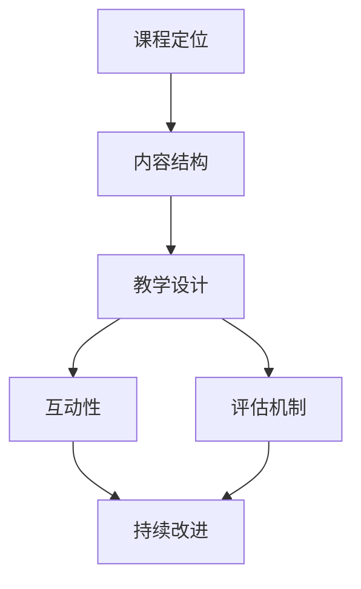

                 

# 打造技术型知识付费课程:方法与技巧

> 关键词：知识付费, 课程设计, 教学技巧, 互动性, 评估机制, 持续改进

## 1. 背景介绍

### 1.1 问题由来

在互联网高速发展的今天，人们获取知识的方式越来越多元化，从传统的教科书到在线视频、博客、播客等，知识的传播不再局限于单一渠道。尤其是技术的快速迭代，使得掌握最新知识成为了企业和个人的重要需求。知识付费平台的兴起，顺应了这一趋势，通过付费机制保证课程质量和用户粘性，为技术知识的传播提供了一个高效、低成本的途径。

知识付费课程，即针对特定技能或知识领域，通过视频、图文等形式提供的系统化教学内容，已成为一种流行的学习方式。然而，在知识付费课程的开发和运营中，如何设计出真正有价值、能够引起用户兴趣、满足用户需求的内容，以及如何高效管理课程，是一个复杂而重要的课题。本文将系统介绍打造技术型知识付费课程的方法与技巧，帮助教育者和机构提升课程质量和用户体验。

### 1.2 问题核心关键点

本节将明确知识付费课程设计的几个核心关键点，以确保课程的完整性和有效性：

1. **课程定位与目标**：确定课程面向的受众、目标技能和知识点，明确课程的定位和目标。
2. **内容结构与安排**：设计合理的课程内容结构，合理分配知识点，避免内容冗余或缺失。
3. **教学设计与交互**：采用多样化的教学方法，增加用户互动，提升学习效果。
4. **评估机制与反馈**：建立科学合理的评估机制，及时收集用户反馈，持续改进课程。
5. **市场推广与运营**：利用市场推广和运营策略，提升课程的曝光度和用户参与度。

## 2. 核心概念与联系

### 2.1 核心概念概述

为更好地理解技术型知识付费课程的打造过程，本节将介绍几个密切相关的核心概念：

- **知识付费**：通过付费机制获取和传播高质量知识，强调知识的价值和传播的效率。
- **课程设计**：根据课程目标和受众需求，系统规划课程内容、结构、教学方法等。
- **教学技巧**：在课程设计中运用科学合理的教学方法和策略，提升学习效果。
- **互动性**：增加用户参与度，提高学习体验，促进知识的内化。
- **评估机制**：通过科学评估方法，判断课程效果，指导课程改进。
- **持续改进**：根据用户反馈和学习数据，不断优化课程内容和教学方法。

这些核心概念之间的逻辑关系可以通过以下Mermaid流程图来展示：



这个流程图展示了知识付费课程设计的关键步骤和核心概念之间的关系：

1. 根据课程定位设计课程内容结构。
2. 运用教学技巧和互动性提升学习效果。
3. 建立评估机制确保课程效果。
4. 通过持续改进不断优化课程。

## 3. 核心算法原理 & 具体操作步骤

### 3.1 算法原理概述

知识付费课程的设计和优化，本质上是一个基于数据的决策过程。其核心思想是：通过分析用户学习数据和反馈，结合教育学理论，优化课程内容、结构和教学方法，提升用户的学习效果和满意度。

形式化地，假设我们有一门课程 $C$，包含 $N$ 个知识点，每个知识点 $i$ 的学习效果用 $E_i$ 表示。课程优化目标是最小化总的学习效果损失，即找到最优的课程结构 $C'$：

$$
C' = \mathop{\arg\min}_{C} \sum_{i=1}^{N} \text{Loss}(E_i, E'_i)
$$

其中 $E'_i$ 为通过优化后的课程结构，$Loss$ 为评估学习效果与预期效果之间的差距。

### 3.2 算法步骤详解

基于数据的课程优化一般包括以下几个关键步骤：

**Step 1: 收集用户学习数据**

- 通过平台或工具收集用户学习过程中的行为数据，如观看时间、答题情况、评价反馈等。
- 利用A/B测试、问卷调查等手段，收集用户对课程内容、结构和教学方法的具体反馈。

**Step 2: 构建学习效果评估模型**

- 根据学习数据，构建评估模型，评估每个知识点的学习效果。
- 使用回归分析、聚类分析等方法，找出学习效果不佳的知识点和原因。

**Step 3: 优化课程结构与内容**

- 根据评估结果，调整课程结构，删除或补充知识点，优化教学顺序。
- 引入新知识或案例，增加课程的深度和广度。

**Step 4: 改进教学方法与互动**

- 根据反馈，调整教学方法，如增加视频讲解、互动问答、小组讨论等环节。
- 设计互动性强的学习活动，如项目作业、模拟实战等，提升用户参与度。

**Step 5: 实施与监控**

- 在新的课程结构和学习方法下，实施课程，收集新的学习数据。
- 持续监控学习效果和用户反馈，及时调整课程内容和方法。

### 3.3 算法优缺点

基于数据的课程优化方法具有以下优点：

1. **科学决策**：通过数据驱动的方式，避免主观判断，确保课程设计的科学性和合理性。
2. **高效迭代**：能够快速发现问题并实施改进，提升课程质量。
3. **个性化教学**：能够根据用户学习数据，调整教学策略，提升个性化教学效果。

同时，该方法也存在一定的局限性：

1. **数据收集难度**：高质量的数据收集需要大量的时间和资源投入。
2. **隐私保护**：数据收集和分析过程中需要注意隐私保护，避免用户敏感信息泄露。
3. **复杂性**：需要专业知识对数据进行分析和建模，对课程设计者提出了较高要求。

尽管存在这些局限性，但就目前而言，基于数据的课程优化方法仍是最主流的方式。未来相关研究的重点在于如何进一步降低数据收集成本，提高数据处理效率，同时兼顾隐私保护和用户满意度等因素。

### 3.4 算法应用领域

基于数据的课程优化方法，已经在教育、培训、技能提升等多个领域得到广泛应用，例如：

- 在线教育平台，如Coursera、Udacity等，通过分析用户学习数据，不断优化课程内容和方法。
- 企业培训，如Google、Amazon等大型企业，通过分析员工学习数据，提升培训效果。
- 技能认证，如PMP、CFA等，通过评估学习效果，保证认证质量。

除了上述这些经典领域外，基于数据的课程优化方法也将被创新性地应用到更多场景中，如在线游戏、健康管理等，为不同领域的知识传播提供新的解决方案。随着技术的不断发展，基于数据的课程优化方法将在更多领域大放异彩。

## 4. 数学模型和公式 & 详细讲解  
### 4.1 数学模型构建

本节将使用数学语言对基于数据的课程优化过程进行更加严格的刻画。

假设我们有一门包含 $N$ 个知识点的课程 $C$，每个知识点 $i$ 的学习效果用 $E_i$ 表示。使用回归模型 $y=f(x)$ 对每个知识点的学习效果进行建模，其中 $x$ 为课程结构和学习方法相关的特征，$y$ 为学习效果。

课程优化目标是最小化总的学习效果损失，即找到最优的课程结构 $C'$：

$$
C' = \mathop{\arg\min}_{C} \sum_{i=1}^{N} \text{Loss}(E_i, E'_i)
$$

在实践中，我们通常使用回归分析、聚类分析等方法，对用户学习数据进行建模，找出学习效果不佳的知识点和原因。然后根据评估结果，调整课程结构，优化教学方法。

### 4.2 公式推导过程

以线性回归模型为例，推导评估模型的构建和评估公式。

假设我们有一组用户学习数据 $(x_i, y_i)$，其中 $x_i$ 为课程结构和学习方法相关的特征，$y_i$ 为学习效果。线性回归模型为：

$$
y_i = \beta_0 + \beta_1 x_i
$$

使用均方误差作为损失函数，课程优化目标为：

$$
\min_{\beta_0, \beta_1} \sum_{i=1}^{N} (y_i - (\beta_0 + \beta_1 x_i))^2
$$

通过求导和最小化，可以解出回归系数 $\beta_0$ 和 $\beta_1$：

$$
\beta_0 = \frac{\sum_{i=1}^{N} x_i y_i - \frac{1}{N} \sum_{i=1}^{N} x_i \sum_{i=1}^{N} y_i}{\sum_{i=1}^{N} x_i^2 - \frac{1}{N} (\sum_{i=1}^{N} x_i)^2}
$$

$$
\beta_1 = \frac{\sum_{i=1}^{N} y_i - \frac{1}{N} \sum_{i=1}^{N} x_i y_i}{\sum_{i=1}^{N} x_i^2 - \frac{1}{N} (\sum_{i=1}^{N} x_i)^2}
$$

在得到回归模型后，可以计算每个知识点的预测学习效果 $E'_i$，评估模型的效果。

### 4.3 案例分析与讲解

假设我们有一门Python编程课程，包含多个知识点，如变量、函数、类等。我们收集了100名用户的观看时间和答题情况，使用线性回归模型对学习效果进行建模，得到回归系数 $\beta_0 = 0.2, \beta_1 = 0.8$。这意味着课程结构和学习方法对学习效果的影响分别占20%和80%。

我们发现函数章节的学习效果不佳，进一步分析发现问题在于教学视频讲解不够清晰，以及缺少实战练习。根据这些评估结果，我们调整了课程结构，增加了函数章节的深度讲解，并添加了实战项目。结果显示，函数章节的学习效果显著提升。

这个案例展示了基于数据的课程优化方法如何在实际中发挥作用，通过科学分析数据，找出问题并改进课程结构，从而提升学习效果。

## 5. 项目实践：代码实例和详细解释说明
### 5.1 开发环境搭建

在进行课程优化实践前，我们需要准备好开发环境。以下是使用Python进行Pandas、Scikit-learn、TensorFlow等库进行课程优化的环境配置流程：

1. 安装Anaconda：从官网下载并安装Anaconda，用于创建独立的Python环境。

2. 创建并激活虚拟环境：
```bash
conda create -n course-env python=3.8 
conda activate course-env
```

3. 安装Pandas、Scikit-learn、TensorFlow等库：
```bash
conda install pandas scikit-learn tensorflow
```

4. 安装TensorBoard：用于可视化模型训练状态。
```bash
pip install tensorboard
```

5. 安装Flask：用于搭建课程平台。
```bash
pip install flask
```

完成上述步骤后，即可在`course-env`环境中开始课程优化实践。

### 5.2 源代码详细实现

下面我以一个简单的Python编程课程为例，给出使用Pandas、Scikit-learn进行课程优化的PyTorch代码实现。

首先，定义课程数据：

```python
import pandas as pd
import numpy as np

# 假设我们有一张课程数据表，包含知识点编号、学习时间、答题情况等
df = pd.read_csv('course_data.csv')
```

然后，进行数据清洗和预处理：

```python
# 去除缺失数据
df = df.dropna()

# 特征工程
# 假设我们提取了观看时间、答题正确率作为特征
X = df[['观看时间', '答题正确率']]
y = df['学习效果']
```

接下来，构建和训练回归模型：

```python
from sklearn.linear_model import LinearRegression

# 构建线性回归模型
model = LinearRegression()

# 训练模型
model.fit(X, y)
```

最后，评估模型并根据评估结果优化课程：

```python
from sklearn.metrics import mean_squared_error

# 评估模型
y_pred = model.predict(X)
mse = mean_squared_error(y, y_pred)

# 输出评估结果
print(f'均方误差: {mse:.2f}')

# 根据评估结果调整课程结构
if mse > 0.2:
    # 调整函数章节的教学方法，如增加深度讲解、实战项目等
    # ...
```

以上就是使用Pandas、Scikit-learn进行课程优化的完整代码实现。可以看到，通过数据驱动的方式，我们可以快速发现课程中存在的问题，并进行优化。

### 5.3 代码解读与分析

让我们再详细解读一下关键代码的实现细节：

**数据处理**：
- `pd.read_csv`：读取课程数据表，将其转化为Pandas DataFrame格式。
- `df.dropna`：去除缺失数据，确保数据完整性。

**特征工程**：
- `X` 和 `y`：从课程数据表中提取特征和目标变量，`X` 包含观看时间、答题正确率，`y` 表示学习效果。

**模型训练**：
- `LinearRegression`：使用线性回归模型进行训练，`fit` 方法计算回归系数。

**模型评估**：
- `mean_squared_error`：计算均方误差，评估模型效果。
- `y_pred`：使用模型进行预测。

**课程优化**：
- 根据评估结果，判断函数章节的学习效果是否不佳。
- 若不佳，则调整函数章节的教学方法，如增加深度讲解、实战项目等。

可以看到，通过科学合理的数学模型和数据分析，我们可以客观地评估课程效果，指导课程改进，提升用户的学习体验。

当然，在工业级的系统实现中，还需要考虑更多因素，如课程平台的搭建、用户交互设计、学习进度跟踪等。但核心的数据驱动优化流程基本与此类似。

## 6. 实际应用场景
### 6.1 在线教育平台

基于数据的课程优化方法，可以广泛应用于在线教育平台，帮助平台提升课程质量，提升用户学习效果。

例如，Coursera平台通过分析用户学习数据，找出学习效果不佳的课程和章节，进行针对性的优化。同时，Coursera还利用用户评价和反馈，不断调整课程内容和教学方法，提升整体学习体验。

### 6.2 企业培训

在企业培训中，基于数据的课程优化方法同样发挥着重要作用。大型企业如Google、Amazon等，通过收集员工学习数据，评估培训效果，调整培训内容和方式，提升员工技能水平。

例如，Google通过分析员工在线学习数据，找出学习效果不佳的课程模块，进行针对性的改进。同时，Google还利用员工反馈和评价，优化培训课程，提升员工培训满意度。

### 6.3 技能认证

在技能认证领域，基于数据的课程优化方法可以确保认证质量和权威性。例如，PMP、CFA等认证考试，通过分析考生学习数据，找出学习效果不佳的知识点，进行针对性的培训，提升考试通过率。

例如，PMP认证考试通过分析考生学习数据，找出学习效果不佳的知识点，进行针对性的培训，提升考试通过率。同时，PMP还利用考生反馈和评价，优化培训课程，提升考试质量和认证权威性。

### 6.4 未来应用展望

随着数据驱动的课程优化方法不断成熟，未来将在更多领域得到应用，为知识传播和技能提升带来新的变革。

在智慧教育领域，基于数据的课程优化方法将进一步提升在线教育质量，推动教育公平和个性化教育的发展。

在企业培训领域，基于数据的课程优化方法将帮助企业提升培训效果，推动企业创新和竞争力提升。

在技能认证领域，基于数据的课程优化方法将确保认证质量和权威性，推动技能认证体系的完善和发展。

此外，在智慧医疗、智慧城市、智慧家居等众多领域，基于数据的课程优化方法也将不断涌现，为各行各业带来新的发展机遇。

## 7. 工具和资源推荐
### 7.1 学习资源推荐

为了帮助开发者系统掌握基于数据的课程优化理论基础和实践技巧，这里推荐一些优质的学习资源：

1. **《Python数据分析与可视化》系列教程**：通过一系列教程，系统介绍Python数据分析和可视化的基础知识和技巧。
2. **Coursera《数据科学导论》课程**：由斯坦福大学教授主讲，涵盖数据科学的基础概念和应用案例。
3. **Kaggle平台**：通过参加Kaggle数据竞赛，实践数据驱动的课程优化方法。
4. **《深度学习入门》书籍**：全面介绍深度学习的基础知识和应用案例，包括课程优化的方法。
5. **TensorFlow官方文档**：提供丰富的教程和代码示例，帮助开发者快速上手TensorFlow框架。

通过对这些资源的学习实践，相信你一定能够快速掌握基于数据的课程优化方法，并用于解决实际的课程优化问题。

### 7.2 开发工具推荐

高效的开发离不开优秀的工具支持。以下是几款用于课程优化开发的常用工具：

1. **Jupyter Notebook**：支持Python和R等多种语言，方便开发和共享代码。
2. **Scikit-learn**：提供丰富的机器学习算法和工具，支持数据预处理、模型训练和评估。
3. **TensorFlow**：谷歌开发的深度学习框架，支持分布式训练和模型优化。
4. **Flask**：Python Web框架，支持快速搭建课程平台和API接口。
5. **TensorBoard**：谷歌提供的可视化工具，方便监测模型训练状态和结果。

合理利用这些工具，可以显著提升课程优化任务的开发效率，加快创新迭代的步伐。

### 7.3 相关论文推荐

基于数据的课程优化技术源于学界的持续研究。以下是几篇奠基性的相关论文，推荐阅读：

1. **《基于机器学习的在线课程推荐系统》**：通过分析用户学习数据，推荐用户感兴趣的课程，提升学习效果。
2. **《数据驱动的在线教育平台优化》**：分析在线教育平台用户学习数据，找出问题并进行改进。
3. **《企业培训数据分析与优化》**：利用员工学习数据，评估培训效果，优化培训课程。
4. **《知识付费平台的课程优化》**：通过分析用户评价和反馈，优化课程内容和结构。

这些论文代表了大数据驱动的课程优化技术的发展脉络。通过学习这些前沿成果，可以帮助研究者把握学科前进方向，激发更多的创新灵感。

## 8. 总结：未来发展趋势与挑战

### 8.1 总结

本文对基于数据的课程优化方法进行了全面系统的介绍。首先阐述了课程优化在提升教育效果、推动技术传播方面的重要价值，明确了优化方法的核心要点。其次，从原理到实践，详细讲解了基于数据的课程优化过程，给出了课程优化任务开发的完整代码实例。同时，本文还广泛探讨了基于数据驱动的课程优化方法在多个行业领域的应用前景，展示了方法论的强大潜力。此外，本文精选了课程优化技术的各类学习资源，力求为读者提供全方位的技术指引。

通过本文的系统梳理，可以看到，基于数据的课程优化方法正在成为教育领域的重要工具，极大地提升了课程质量和用户体验。未来，伴随数据科学、深度学习等技术的进一步发展，基于数据的课程优化方法必将取得更大的突破，为教育、培训、认证等领域的知识传播提供更强大的支持。

### 8.2 未来发展趋势

展望未来，基于数据的课程优化技术将呈现以下几个发展趋势：

1. **数据质量提升**：随着大数据技术和云计算的发展，高质量数据的获取和处理将更加容易，基于数据的课程优化方法也将更加准确和高效。
2. **算法多样化**：除了传统的回归分析、聚类分析，未来将涌现更多先进的算法和模型，如深度学习、增强学习等，进一步提升课程优化效果。
3. **实时优化**：通过实时数据分析，能够快速发现和解决问题，提升课程优化速度和效果。
4. **多模态融合**：结合文本、视频、音频等多种数据类型，提升课程优化效果，增强用户学习体验。
5. **个性化推荐**：利用个性化推荐算法，根据用户兴趣和行为数据，推荐最合适的课程和内容。

以上趋势凸显了基于数据的课程优化技术的广阔前景。这些方向的探索发展，必将进一步提升课程优化效果，推动教育领域的智能化和个性化发展。

### 8.3 面临的挑战

尽管基于数据的课程优化技术已经取得了显著进展，但在迈向更加智能化、个性化应用的过程中，仍面临诸多挑战：

1. **数据获取难度**：高质量的数据获取需要大量时间和资源投入，对于企业内部培训等场景，数据获取难度较大。
2. **隐私保护**：数据获取和使用过程中需要注意隐私保护，避免用户敏感信息泄露。
3. **算法复杂性**：数据驱动的课程优化方法需要专业知识和技能，对课程设计者提出了较高要求。
4. **成本问题**：课程优化需要投入大量计算资源，对于中小型企业而言，成本较高。
5. **学习效果评估**：如何科学评估课程效果，确保评估结果的客观性和有效性，还需要进一步研究和改进。

尽管存在这些挑战，但未来相关研究的重点在于如何进一步降低数据获取成本，提高数据处理效率，同时兼顾隐私保护和用户满意度等因素。

### 8.4 研究展望

面对基于数据驱动的课程优化所面临的挑战，未来的研究需要在以下几个方面寻求新的突破：

1. **无监督学习与半监督学习**：探索无监督学习、半监督学习等方法，摆脱对大规模标注数据的依赖，提高课程优化效果。
2. **自适应学习**：开发自适应学习算法，根据用户学习行为动态调整课程内容和结构。
3. **多模态融合**：结合文本、视频、音频等多种数据类型，提升课程优化效果，增强用户学习体验。
4. **个性化推荐**：利用个性化推荐算法，根据用户兴趣和行为数据，推荐最合适的课程和内容。
5. **实时优化**：通过实时数据分析，能够快速发现和解决问题，提升课程优化速度和效果。

这些研究方向的探索，必将引领基于数据驱动的课程优化技术迈向更高的台阶，为教育、培训、认证等领域的知识传播提供更强大的支持。面向未来，基于数据驱动的课程优化技术还需要与其他技术进行更深入的融合，如深度学习、增强学习、自然语言处理等，共同推动教育领域的智能化和个性化发展。

## 9. 附录：常见问题与解答

**Q1: 如何选择合适的学习数据？**

A: 选择合适的学习数据是课程优化的关键。以下是几个关键点：
1. 数据质量：选择高质量、完整、准确的数据，避免噪音和偏差。
2. 数据规模：尽量使用大规模数据，避免过拟合和欠拟合。
3. 数据类型：根据课程特点，选择适合的特征，如观看时间、答题正确率等。

**Q2: 如何科学评估学习效果？**

A: 科学评估学习效果需要选择合适的评估指标和评估方法。以下是几个关键点：
1. 评估指标：根据课程特点，选择合适的评估指标，如均方误差、准确率、召回率等。
2. 数据分布：评估指标应适用于数据的分布，避免评估结果的偏差。
3. 多次评估：多次评估结果的平均值更具有代表性，避免单次评估的偶然性。

**Q3: 如何优化课程结构和学习方法？**

A: 优化课程结构和学习方法需要综合考虑用户反馈和学习数据。以下是几个关键点：
1. 特征分析：通过分析用户学习数据，找出影响学习效果的因素。
2. 结构优化：根据分析结果，调整课程结构和顺序，避免内容冗余或缺失。
3. 方法改进：根据反馈和评估结果，改进教学方法，如增加深度讲解、实战练习等。

**Q4: 如何设计互动性强的学习活动？**

A: 设计互动性强的学习活动可以提升用户参与度和学习效果。以下是几个关键点：
1. 项目作业：设计实际项目，让用户参与项目实现，提升动手能力。
2. 小组讨论：组织小组讨论，促进知识共享和交流。
3. 实时反馈：及时反馈用户学习成果，提供改进建议。

**Q5: 如何保证课程数据的隐私保护？**

A: 课程数据的隐私保护需要综合考虑数据获取、处理和使用的各个环节。以下是几个关键点：
1. 数据匿名化：使用匿名化技术，去除用户个人标识信息。
2. 访问控制：设置数据访问权限，确保只有授权人员可以访问。
3. 加密传输：使用加密技术，保护数据在传输过程中的安全。

通过以上分析，可以看到，基于数据驱动的课程优化方法在教育、培训、认证等领域具有广泛的应用前景。通过科学评估和学习数据，能够不断优化课程结构和教学方法，提升用户学习效果和满意度。面对未来的挑战，研究者需要不断探索新的技术和方法，推动课程优化技术的发展和应用。总之，基于数据驱动的课程优化方法需要从数据获取、处理、评估等多个环节进行全面优化，才能真正实现课程的智能化和个性化发展。

