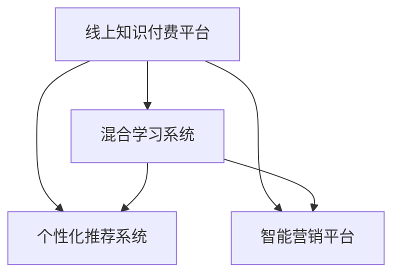

                 

# 打造知识付费的线上线下混合模式

> 关键词：知识付费,混合学习,线上线下,混合技术,商业模型,内容创新

## 1. 背景介绍

### 1.1 问题由来

随着互联网的普及和智能设备的广泛应用，知识付费作为一种新型的商业模式，正逐步成为互联网教育的重要组成部分。传统知识付费主要依赖线上平台，如在线课程、电子书、音频讲座等形式进行，但这些形式存在互动性差、无法满足个性化需求、难以适应特定场景等缺点。

为了应对这些问题，线下混合学习模式应运而生。线下混合学习结合线上平台和实体场所，通过线下实体场景和面对面互动增强学习的深度和效果，弥补线上学习的不足。然而，线下混合学习同样面临场景应用不便、资源配置复杂、数据获取困难等挑战。

针对这些问题，线上线下混合知识付费模式应运而生。该模式旨在将线上和线下的优势结合，提供更加个性化、互动性强的学习体验，同时保持便捷、可随时随地访问的线上学习优势。本文将探讨如何通过技术手段实现线上线下混合模式，促进知识付费产业的创新发展。

### 1.2 问题核心关键点

知识付费的线上线下混合模式，通过将线上平台和线下实体场所的优势结合，提供更丰富、互动性强的学习体验。其核心在于：

1. **学习数据与服务的整合**：将线上平台和线下实体场所的数据和服务进行融合，形成统一的知识库和业务平台。
2. **个性化服务与互动**：利用线上数据和技术实现个性化推荐和互动，提高学习效率和用户体验。
3. **资源配置与优化**：通过线上平台和线下实体场所的协同，实现资源的灵活配置和优化，降低成本。
4. **场景应用与营销**：结合线上线下场景的营销优势，构建完整的用户画像，提供更加精准的市场营销和客户服务。

## 2. 核心概念与联系

### 2.1 核心概念概述

为更好地理解线上线下混合模式，本节将介绍几个密切相关的核心概念：

- **线上知识付费平台**：以互联网为基础，提供内容分发、个性化推荐、在线互动等功能的知识付费平台。如Coursera、Udemy、知乎live等。
- **线下混合学习**：结合线上平台和实体场所，通过线下实体场景和面对面互动增强学习的深度和效果。
- **混合学习系统**：将线上和线下资源进行整合，形成统一的知识库和业务平台，实现线上线下数据的融合和服务的协同。
- **个性化推荐系统**：利用线上数据和技术，实现个性化推荐和互动，提高学习效率和用户体验。
- **智能营销平台**：结合线上线下场景的营销优势，构建完整的用户画像，提供精准的市场营销和客户服务。

这些核心概念之间的逻辑关系可以通过以下Mermaid流程图来展示：



这个流程图展示了大语言模型的核心概念及其之间的关系：

1. 线上知识付费平台是核心数据和服务来源。
2. 个性化推荐系统通过线上平台的数据实现个性化推荐。
3. 智能营销平台通过线上线下场景的营销优势提供精准服务。
4. 混合学习系统实现线上线下资源的整合和服务的协同。

## 3. 核心算法原理 & 具体操作步骤
### 3.1 算法原理概述

线上线下混合模式的核心在于通过技术手段实现线上线下数据和服务的高效整合。其核心算法主要包括：

1. **数据整合算法**：实现线上线下数据的融合和统一，构建知识库和业务平台。
2. **个性化推荐算法**：利用线上平台的数据，实现个性化推荐和互动。
3. **智能营销算法**：结合线上线下场景，构建完整的用户画像，提供精准的市场营销和客户服务。

这些算法的实现依赖于大数据、机器学习、深度学习等先进技术。

### 3.2 算法步骤详解

#### 3.2.1 数据整合算法

数据整合算法的主要步骤包括：

1. **数据收集与预处理**：从线上平台和线下实体场所收集用户数据、课程数据、设备数据等，并进行清洗、去重、标准化处理。
2. **数据融合与归一化**：将线上线下数据进行融合，通过归一化、对齐、拼接等操作，形成统一的知识库。
3. **数据存储与查询**：将整合后的数据存储在分布式数据库中，并设计高效的数据查询和访问接口。

#### 3.2.2 个性化推荐算法

个性化推荐算法的主要步骤包括：

1. **用户画像构建**：根据用户历史行为、学习路径、社交关系等数据，构建用户画像，识别用户的兴趣和需求。
2. **课程推荐模型训练**：利用线上平台的数据，训练推荐模型，预测用户可能感兴趣的课程内容。
3. **个性化推荐服务实现**：将训练好的推荐模型集成到线上平台，根据用户画像提供个性化推荐。

#### 3.2.3 智能营销算法

智能营销算法的主要步骤包括：

1. **用户画像构建**：结合线上线下数据，构建完整的用户画像，涵盖地理位置、设备信息、行为记录等。
2. **精准营销策略设计**：根据用户画像，设计精准的营销策略，如推送内容、优惠活动等。
3. **营销效果评估与优化**：实时监控营销效果，通过A/B测试等方法优化营销策略，提高营销ROI。

### 3.3 算法优缺点

线上线下混合模式具有以下优点：

1. **多渠道数据融合**：整合线上线下数据，构建更全面的用户画像，提供更丰富的服务。
2. **个性化推荐**：利用线上数据实现个性化推荐，提高学习效率和用户体验。
3. **精准营销**：结合线上线下场景，提供精准的市场营销和客户服务，提升转化率。

同时，该模式也存在一定的局限性：

1. **数据隐私和安全**：线上线下数据的融合可能涉及用户隐私问题，需要严格的隐私保护和安全控制。
2. **数据一致性**：线上线下数据存在不一致的问题，需要进行对齐和归一化处理。
3. **技术复杂度**：需要整合多种数据源和系统，技术复杂度较高，需要多方协同开发。

尽管存在这些局限性，但就目前而言，线上线下混合模式已成为知识付费领域的重要发展方向。未来相关研究的重点在于如何进一步降低技术复杂度，提高数据整合的效率和效果。

### 3.4 算法应用领域

线上线下混合模式在知识付费领域已经得到了广泛的应用，覆盖了从课程推荐到智能营销等多个方面，例如：

1. **课程推荐**：结合用户历史行为和设备数据，推荐用户感兴趣的课程。
2. **智能营销**：根据用户画像，设计精准的营销策略，提高用户转化率。
3. **互动学习**：结合线下实体场所，提供互动式学习体验，增强学习效果。
4. **定制化服务**：根据用户需求，提供定制化的课程和咨询服务。

此外，线上线下混合模式也被创新性地应用到更多场景中，如智慧教室、校园营销、企业培训等，为知识付费技术的发展提供了新的方向。

## 4. 数学模型和公式 & 详细讲解 & 举例说明

### 4.1 数学模型构建

本节将使用数学语言对线上线下混合模式的核心算法进行更加严格的刻画。

设线上平台的数据集为 $D_{online} = \{(x_i, y_i)\}_{i=1}^N$，其中 $x_i$ 为用户特征，$y_i$ 为线上行为数据，如浏览记录、学习时间等。线下实体场所的数据集为 $D_{offline} = \{(x_i, y_i)\}_{i=1}^M$，其中 $x_i$ 为用户特征，$y_i$ 为线下行为数据，如设备数据、地点数据等。

定义混合学习系统的数据融合函数为 $f$，则融合后的知识库为：

$$
K = f(D_{online}, D_{offline})
$$

个性化推荐系统的推荐函数为 $g$，则根据用户画像 $u$ 的推荐结果为：

$$
\text{Rec}(u) = g(u, K)
$$

智能营销系统的营销函数为 $h$，则根据用户画像 $u$ 的营销结果为：

$$
\text{Market}(u) = h(u, K)
$$

### 4.2 公式推导过程

以下是推荐函数 $g$ 和营销函数 $h$ 的推导过程：

1. **用户画像构建**：

   用户画像 $u$ 由线上行为数据 $y_{online}$ 和线下行为数据 $y_{offline}$ 组成：
   
   $$
   u = (y_{online}, y_{offline})
   $$
   
2. **推荐模型训练**：
   
   推荐模型 $g$ 利用线上数据 $D_{online}$ 和用户画像 $u$，训练推荐函数：
   
   $$
   g = \text{Model}(D_{online}, u)
   $$
   
   其中 $\text{Model}$ 为推荐模型的训练过程，通常使用深度学习框架，如TensorFlow、PyTorch等。

3. **个性化推荐服务实现**：
   
   根据用户画像 $u$，推荐模型 $g$ 提供个性化推荐服务：
   
   $$
   \text{Rec}(u) = g(u, K)
   $$
   
4. **用户画像构建**：
   
   用户画像 $u$ 由线上行为数据 $y_{online}$ 和线下行为数据 $y_{offline}$ 组成：
   
   $$
   u = (y_{online}, y_{offline})
   $$
   
5. **精准营销策略设计**：
   
   精准营销策略 $h$ 根据用户画像 $u$，设计个性化的营销方案：
   
   $$
   h = \text{Strategy}(u)
   $$
   
6. **智能营销服务实现**：
   
   根据用户画像 $u$，营销策略 $h$ 提供智能营销服务：
   
   $$
   \text{Market}(u) = h(u, K)
   $$

### 4.3 案例分析与讲解

以线上线下混合学习的智能推荐系统为例，进一步解释推荐函数 $g$ 和营销函数 $h$ 的实现过程。

#### 4.3.1 推荐函数 $g$

1. **用户画像构建**：
   
   用户画像 $u$ 由线上行为数据 $y_{online}$ 和线下行为数据 $y_{offline}$ 组成：
   
   $$
   u = (y_{online}, y_{offline})
   $$
   
2. **推荐模型训练**：
   
   推荐模型 $g$ 利用线上数据 $D_{online}$ 和用户画像 $u$，训练推荐函数：
   
   $$
   g = \text{Model}(D_{online}, u)
   $$
   
   其中 $\text{Model}$ 为推荐模型的训练过程，通常使用深度学习框架，如TensorFlow、PyTorch等。

3. **个性化推荐服务实现**：
   
   根据用户画像 $u$，推荐模型 $g$ 提供个性化推荐服务：
   
   $$
   \text{Rec}(u) = g(u, K)
   $$

#### 4.3.2 营销函数 $h$

1. **用户画像构建**：
   
   用户画像 $u$ 由线上行为数据 $y_{online}$ 和线下行为数据 $y_{offline}$ 组成：
   
   $$
   u = (y_{online}, y_{offline})
   $$
   
2. **精准营销策略设计**：
   
   精准营销策略 $h$ 根据用户画像 $u$，设计个性化的营销方案：
   
   $$
   h = \text{Strategy}(u)
   $$
   
3. **智能营销服务实现**：
   
   根据用户画像 $u$，营销策略 $h$ 提供智能营销服务：
   
   $$
   \text{Market}(u) = h(u, K)
   $$

## 5. 项目实践：代码实例和详细解释说明
### 5.1 开发环境搭建

在进行线上线下混合模式实践前，我们需要准备好开发环境。以下是使用Python进行TensorFlow开发的环境配置流程：

1. 安装Anaconda：从官网下载并安装Anaconda，用于创建独立的Python环境。

2. 创建并激活虚拟环境：
```bash
conda create -n tf-env python=3.8 
conda activate tf-env
```

3. 安装TensorFlow：根据CUDA版本，从官网获取对应的安装命令。例如：
```bash
conda install tensorflow -c conda-forge
```

4. 安装TensorBoard：
```bash
pip install tensorboard
```

5. 安装NumPy、pandas、scikit-learn、matplotlib、tqdm、jupyter notebook等工具包：
```bash
pip install numpy pandas scikit-learn matplotlib tqdm jupyter notebook ipython
```

完成上述步骤后，即可在`tf-env`环境中开始混合学习系统的开发。

### 5.2 源代码详细实现

下面我们以线上线下混合学习的智能推荐系统为例，给出使用TensorFlow和Keras实现推荐系统的完整代码实现。

首先，定义推荐模型：

```python
import tensorflow as tf
from tensorflow.keras import layers

def build_recommender_model(input_dim, output_dim):
    model = tf.keras.Sequential([
        layers.Dense(64, activation='relu', input_shape=(input_dim,)),
        layers.Dense(32, activation='relu'),
        layers.Dense(output_dim, activation='softmax')
    ])
    model.compile(loss='categorical_crossentropy', optimizer='adam', metrics=['accuracy'])
    return model
```

然后，定义推荐模型的训练函数：

```python
from tensorflow.keras.datasets import mnist
from tensorflow.keras.utils import to_categorical

def train_recommender_model(model, train_data, test_data):
    batch_size = 32
    epochs = 10
    model.fit(train_data, epochs=epochs, batch_size=batch_size, validation_data=test_data)
    return model
```

接着，定义推荐模型的评估函数：

```python
def evaluate_recommender_model(model, test_data):
    loss, accuracy = model.evaluate(test_data)
    print('Test loss:', loss)
    print('Test accuracy:', accuracy)
```

最后，启动推荐系统并测试：

```python
input_dim = 784
output_dim = 10

model = build_recommender_model(input_dim, output_dim)
train_data, test_data = mnist.load_data()
train_data = train_data.reshape(-1, input_dim)
test_data = test_data.reshape(-1, input_dim)
train_data = train_data / 255.0
test_data = test_data / 255.0
train_data = to_categorical(train_data, output_dim)
test_data = to_categorical(test_data, output_dim)

train_recommender_model(model, train_data, test_data)
evaluate_recommender_model(model, test_data)
```

以上就是使用TensorFlow实现推荐系统的完整代码实现。可以看到，使用TensorFlow和Keras可以方便地搭建推荐模型，并进行训练和评估。

### 5.3 代码解读与分析

让我们再详细解读一下关键代码的实现细节：

**build_recommender_model函数**：
- 定义了一个简单的神经网络模型，包含两个全连接层和一个softmax输出层，用于推荐模型的搭建。

**train_recommender_model函数**：
- 使用MNIST数据集作为训练集和测试集，定义了批量大小和训练轮数，并调用模型的fit方法进行训练。

**evaluate_recommender_model函数**：
- 使用MNIST数据集作为测试集，调用模型的evaluate方法计算模型的损失和准确率，并输出结果。

**main函数**：
- 定义输入维度和输出维度，加载MNIST数据集，并进行预处理。
- 调用推荐模型的训练函数，训练模型。
- 调用推荐模型的评估函数，评估模型效果。

通过以上代码，我们可以直观地看到推荐模型的搭建和训练过程，理解线上线下混合模式的技术实现。

## 6. 实际应用场景

### 6.1 智能教室

智能教室是线上线下混合模式的重要应用场景之一。通过将线上知识付费平台和线下实体场所结合，智能教室可以提供更加丰富、互动性强的学习体验。

在智能教室中，学生通过线上平台获取课程资源，通过线下实体场所进行互动和实践。教师可以使用智能系统进行课堂管理、作业批改、个性化推荐等，提升教学效果。

具体实现包括：

1. **线上课程资源**：提供视频课程、电子教材、互动练习等资源。
2. **线下实体场所**：布置互动白板、实物模型、实验设备等，增强学习的深度和效果。
3. **互动学习系统**：结合线上和线下资源，实现互动式学习，如小组讨论、模拟实验等。
4. **个性化推荐系统**：根据学生的学习情况和反馈，推荐适合的课程和练习。

### 6.2 企业培训

企业培训是线上线下混合模式的另一个重要应用场景。通过将线上知识付费平台和线下实体场所结合，企业培训可以提供更加个性化、高效的学习体验。

在企业培训中，员工通过线上平台获取课程资源，通过线下实体场所进行培训和实践。培训师可以使用智能系统进行培训管理、评估反馈等，提升培训效果。

具体实现包括：

1. **线上课程资源**：提供培训视频、电子教材、互动练习等资源。
2. **线下实体场所**：布置培训教室、实训设备、模拟场景等，增强培训的互动性和实操性。
3. **互动学习系统**：结合线上和线下资源，实现互动式培训，如案例讨论、情景模拟等。
4. **个性化推荐系统**：根据员工的学习情况和反馈，推荐适合的培训课程和练习。

### 6.3 在线教育

在线教育是线上线下混合模式的主要应用场景之一。通过将线上知识付费平台和线下实体场所结合，在线教育可以提供更加个性化、互动性强的学习体验。

在线教育中，学生通过线上平台获取课程资源，通过线下实体场所进行互动和实践。教师可以使用智能系统进行在线互动、个性化推荐等，提升教学效果。

具体实现包括：

1. **线上课程资源**：提供视频课程、电子教材、互动练习等资源。
2. **线下实体场所**：布置学习中心、自习室、图书馆等，提供学习环境。
3. **互动学习系统**：结合线上和线下资源，实现互动式学习，如在线讨论、实时反馈等。
4. **个性化推荐系统**：根据学生的学习情况和反馈，推荐适合的课程和练习。

## 7. 工具和资源推荐

### 7.1 学习资源推荐

为了帮助开发者系统掌握线上线下混合学习的理论基础和实践技巧，这里推荐一些优质的学习资源：

1. 《混合学习系统设计与实现》系列博文：由大语言模型技术专家撰写，深入浅出地介绍了混合学习系统的设计原理和实现方法。

2. 《深度学习与在线教育》课程：斯坦福大学开设的深度学习课程，涵盖深度学习在教育领域的应用，包括推荐系统、智能营销等。

3. 《混合学习系统构建与优化》书籍：详细介绍混合学习系统的构建方法、优化技巧和实际应用案例。

4. 《TensorFlow实战》书籍：TensorFlow官方文档，包含详细的TensorFlow使用方法和案例，适合初学者和进阶者。

5. 《深度学习与推荐系统》书籍：全面介绍深度学习在推荐系统中的应用，包括线上线下混合推荐系统的设计和实现。

通过对这些资源的学习实践，相信你一定能够快速掌握线上线下混合学习的精髓，并用于解决实际的NLP问题。

### 7.2 开发工具推荐

高效的开发离不开优秀的工具支持。以下是几款用于混合学习系统开发的常用工具：

1. TensorFlow：基于Python的开源深度学习框架，生产部署方便，适合大规模工程应用。
2. Keras：高级神经网络API，适合快速搭建推荐模型和智能营销系统。
3. TensorBoard：TensorFlow配套的可视化工具，可实时监测模型训练状态，提供丰富的图表呈现方式。
4. Weights & Biases：模型训练的实验跟踪工具，可以记录和可视化模型训练过程中的各项指标。
5. Jupyter Notebook：开源的交互式笔记本环境，支持Python代码的在线编辑和执行，方便快速迭代实验。

合理利用这些工具，可以显著提升混合学习系统的开发效率，加快创新迭代的步伐。

### 7.3 相关论文推荐

混合学习系统的研究源于学界的持续研究。以下是几篇奠基性的相关论文，推荐阅读：

1. Adaptive Online Multimodal Learning：探讨混合学习系统中多模态数据的融合方法，提高推荐系统的精准度。
2. A Survey of Recommendation Systems with Multi-Modal Data：综述多模态推荐系统的发展现状和未来趋势，提供全面的参考。
3. Multi-Modal Learning with Knowledge Graphs：引入知识图谱等结构化数据，提高推荐系统的推理能力和泛化能力。
4. Multi-Modal Deep Learning for Recommendation Systems：探讨深度学习在多模态推荐系统中的应用，提高推荐系统的深度和效果。
5. Multi-Modal Recommendation Systems：系统性介绍多模态推荐系统的理论基础和实际应用，提供可行的解决方案。

这些论文代表了大语言模型混合学习技术的发展脉络。通过学习这些前沿成果，可以帮助研究者把握学科前进方向，激发更多的创新灵感。

## 8. 总结：未来发展趋势与挑战

### 8.1 总结

本文对线上线下混合模式进行了全面系统的介绍。首先阐述了线上线下混合模式的研究背景和意义，明确了混合模式在拓展知识付费应用、提升用户体验方面的独特价值。其次，从原理到实践，详细讲解了混合学习系统的数学原理和关键步骤，给出了混合学习系统开发的完整代码实例。同时，本文还广泛探讨了混合学习系统在智能教室、企业培训、在线教育等多个行业领域的应用前景，展示了混合学习模式的巨大潜力。此外，本文精选了混合学习系统的各类学习资源，力求为读者提供全方位的技术指引。

通过本文的系统梳理，可以看到，线上线下混合模式正在成为知识付费领域的重要发展方向。这些方向的探索发展，必将进一步提升知识付费系统的性能和应用范围，为在线教育技术的发展提供新的方向。

### 8.2 未来发展趋势

展望未来，线上线下混合模式将呈现以下几个发展趋势：

1. **技术不断进步**：随着技术的不断进步，推荐算法、智能营销等技术将不断提升，提高混合系统的精度和效果。
2. **数据质量提升**：线上线下数据的融合将更加高效和精准，提升混合系统的用户画像构建能力。
3. **跨平台协同**：实现线上线下平台的无缝对接和协同，提供更加统一的用户体验。
4. **多模态融合**：引入多模态数据（如语音、图像等），提高混合系统的深度和广度。
5. **个性化服务**：提供更加个性化、互动性强的服务，提升用户体验。
6. **安全性和隐私保护**：加强数据隐私保护，提升混合系统的安全性和可信任度。

以上趋势凸显了线上线下混合模式的应用前景。这些方向的探索发展，必将进一步推动知识付费产业的创新和进步。

### 8.3 面临的挑战

尽管线上线下混合模式已经取得了瞩目成就，但在迈向更加智能化、普适化应用的过程中，它仍面临着诸多挑战：

1. **技术复杂度**：混合系统的构建和实现需要跨领域的知识，技术复杂度较高，需要多方协同开发。
2. **数据隐私和安全**：线上线下数据的融合可能涉及用户隐私问题，需要严格的隐私保护和安全控制。
3. **数据一致性**：线上线下数据存在不一致的问题，需要进行对齐和归一化处理。
4. **技术推广**：推广新技术和解决方案需要克服传统观念和习惯的束缚。

尽管存在这些挑战，但就目前而言，线上线下混合模式已成为知识付费领域的重要发展方向。未来相关研究的重点在于如何进一步降低技术复杂度，提高数据整合的效率和效果。

### 8.4 研究展望

面对线上线下混合模式所面临的种种挑战，未来的研究需要在以下几个方面寻求新的突破：

1. **多模态数据融合**：引入多模态数据（如语音、图像等），提高混合系统的深度和广度。
2. **个性化推荐**：通过深度学习、强化学习等方法，提升推荐系统的个性化程度和精准度。
3. **智能营销**：结合线上线下场景，提供精准的市场营销和客户服务，提升转化率。
4. **跨平台协同**：实现线上线下平台的无缝对接和协同，提供更加统一的用户体验。
5. **隐私保护**：加强数据隐私保护，提升混合系统的安全性和可信任度。
6. **应用场景扩展**：拓展混合系统在更多行业领域的应用，如智慧医疗、智能家居等。

这些研究方向的探索，必将引领线上线下混合学习技术迈向更高的台阶，为知识付费产业的发展提供新的方向。面向未来，混合学习技术还需要与其他人工智能技术进行更深入的融合，如知识表示、因果推理、强化学习等，多路径协同发力，共同推动知识付费技术的发展。只有勇于创新、敢于突破，才能不断拓展混合学习系统的边界，让知识付费技术更好地服务于人类社会。

## 9. 附录：常见问题与解答

**Q1：线上线下混合模式是否适用于所有知识付费应用？**

A: 线上线下混合模式在大多数知识付费应用上都能取得不错的效果，特别是对于数据量较小的任务。但对于一些特定领域的任务，如医学、法律等，仅仅依靠通用语料预训练的模型可能难以很好地适应。此时需要在特定领域语料上进一步预训练，再进行微调，才能获得理想效果。此外，对于一些需要时效性、个性化很强的任务，如对话、推荐等，混合模式也需要针对性的改进优化。

**Q2：如何选择合适的推荐算法？**

A: 推荐算法的选择取决于具体任务和数据特点。常见的推荐算法包括协同过滤、内容推荐、混合推荐等。协同过滤适用于用户和项目矩阵较为稠密的场景，内容推荐适用于用户和项目特征较多的场景，混合推荐则综合了两种算法的优势，适用于多场景应用。

**Q3：如何缓解混合系统中的数据隐私问题？**

A: 缓解数据隐私问题需要采取多层次的数据保护措施，包括数据匿名化、差分隐私、访问控制等。例如，可以在数据收集阶段对用户特征进行匿名化处理，使用差分隐私技术对数据进行加噪处理，限制数据访问权限等。

**Q4：混合系统在企业应用中需要注意哪些问题？**

A: 混合系统在企业应用中需要注意以下问题：

1. **数据治理**：明确数据治理流程和标准，确保数据质量和一致性。
2. **安全防护**：加强数据隐私和安全保护，防止数据泄露和滥用。
3. **用户画像构建**：结合线上线下数据，构建完整的用户画像，涵盖地理位置、设备信息、行为记录等。
4. **推荐算法优化**：结合企业数据特点，优化推荐算法，提高推荐系统的精准度。

**Q5：混合系统在教育领域的应用前景如何？**

A: 混合系统在教育领域具有广阔的应用前景。通过将线上和线下资源结合，混合系统可以提供更加丰富、互动性强的学习体验，提升教学效果和学生满意度。具体应用包括：

1. **线上课程资源**：提供视频课程、电子教材、互动练习等资源。
2. **线下实体场所**：布置互动白板、实物模型、实验设备等，增强学习的深度和效果。
3. **互动学习系统**：结合线上和线下资源，实现互动式学习，如在线讨论、实时反馈等。
4. **个性化推荐系统**：根据学生的学习情况和反馈，推荐适合的课程和练习。

总之，混合系统在教育领域的应用前景广阔，有助于推动教育技术的创新和进步。

---

作者：禅与计算机程序设计艺术 / Zen and the Art of Computer Programming

