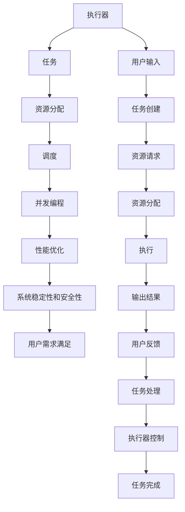

                 

# 执行器控制：在设备上执行操作

> 关键词：执行器控制,设备管理,系统调度,并发编程,资源管理,性能优化

## 1. 背景介绍

在现代操作系统中，执行器控制是确保系统高效运行和资源合理分配的关键。执行器，即在操作系统中负责执行任务的实体，其性能直接影响到整个系统的响应速度和资源利用效率。在云计算、分布式系统、物联网等领域，执行器控制尤为重要。随着技术的发展，执行器控制面临着越来越多的挑战，如并发编程的复杂性、资源管理的困难性、性能优化的需求等。本文将深入探讨执行器控制的核心概念、算法原理以及具体实现，为读者提供一个全面的技术视角。

## 2. 核心概念与联系

### 2.1 核心概念概述

在执行器控制中，以下几个核心概念尤为关键：

- **执行器(Executor)**：指操作系统中的执行单元，负责任务的启动和运行。常见类型包括线程、进程、协程等。
- **任务(Task)**：指需要被执行器处理的具体工作单元，可以是计算任务、网络请求、I/O操作等。
- **资源分配**：指操作系统如何合理分配CPU、内存、网络等硬件资源，以确保执行器的高效运行。
- **调度(Scheduling)**：指操作系统如何决定执行器的执行顺序，以实现资源的最优利用。
- **并发编程(Concurrent Programming)**：指多个任务同时运行的技术，需要确保数据的一致性和安全性。
- **性能优化(Performance Optimization)**：指通过算法和架构改进，提高执行器的执行效率和响应速度。

这些概念之间存在着紧密的联系，共同构成了一个复杂的系统。执行器控制的根本目标是最大化系统的吞吐量、降低延迟、提高资源利用效率，同时保证系统的稳定性和安全性。

### 2.2 核心概念原理和架构的 Mermaid 流程图



此图展示了执行器控制从任务创建到任务完成的全过程。从用户输入开始，任务创建、资源分配、调度、并发编程、性能优化、系统稳定性和安全性等环节，最终将结果输出给用户。执行器控制的目标是确保这一过程的高效和稳定。

## 3. 核心算法原理 & 具体操作步骤

### 3.1 算法原理概述

执行器控制的算法原理主要包括以下几个方面：

- **调度算法(Scheduling Algorithms)**：用于决定任务的执行顺序，常见的算法有先来先服务(FCFS)、短作业优先(SJF)、最短剩余时间优先(SRTF)等。
- **资源分配算法(Resource Allocation Algorithms)**：用于合理分配CPU、内存等硬件资源，确保任务的正常执行。
- **并发控制技术(Concurrency Control Techniques)**：用于解决并发编程中出现的死锁、饥饿等问题，如锁机制、事务隔离级等。
- **性能优化技术(Performance Optimization Techniques)**：通过算法和架构改进，提高执行器的执行效率和响应速度，如多线程、缓存技术、编译器优化等。

### 3.2 算法步骤详解

以下是一个典型的执行器控制步骤：

1. **任务创建(Task Creation)**：用户通过程序或系统界面创建一个任务，操作系统为其分配一个执行器。
2. **资源分配(Resource Allocation)**：操作系统根据任务的资源需求，为其分配CPU、内存等硬件资源。
3. **调度(Scheduling)**：操作系统根据调度算法决定执行器的执行顺序，确保任务按优先级运行。
4. **并发编程(Concurrent Programming)**：多个任务同时运行，操作系统通过并发控制技术确保数据一致性和安全性。
5. **执行(Execution)**：执行器执行任务，资源分配算法确保执行器能够高效地使用硬件资源。
6. **输出结果(Result Output)**：任务执行完毕后，操作系统将结果返回给用户。
7. **任务处理(Task Processing)**：用户反馈结果，操作系统根据反馈进行下一步处理。
8. **执行器控制(Executor Control)**：根据系统的负载情况和用户需求，执行器控制算法优化资源的分配和调度。

### 3.3 算法优缺点

执行器控制的算法具有以下优点：

- **高效资源利用**：通过优化资源分配和调度算法，确保系统资源的合理利用。
- **快速响应**：通过并发控制技术，确保系统能够快速响应用户请求。
- **系统稳定**：通过性能优化和调度算法，确保系统稳定运行。

同时，执行器控制的算法也存在以下缺点：

- **复杂度高**：并发编程和资源分配的复杂性较高，需要谨慎处理。
- **性能瓶颈**：调度算法和并发控制技术的性能瓶颈可能会影响系统的整体性能。
- **资源竞争**：多个任务同时运行时，资源竞争可能会导致性能下降。

### 3.4 算法应用领域

执行器控制的应用领域非常广泛，主要包括以下几个方面：

- **操作系统**：如Linux、Unix等操作系统，通过执行器控制保证系统的稳定性和高效性。
- **云计算**：如AWS、Google Cloud等云平台，通过执行器控制实现资源的弹性伸缩和高效调度。
- **分布式系统**：如Hadoop、Spark等分布式计算框架，通过执行器控制实现任务的并行处理和资源分配。
- **物联网(IoT)**：如智能家居、工业物联网等，通过执行器控制实现设备的可靠运行和数据传输。
- **移动应用**：如iOS、Android等移动操作系统，通过执行器控制实现应用的快速响应和资源管理。

## 4. 数学模型和公式 & 详细讲解 & 举例说明

### 4.1 数学模型构建

执行器控制的数学模型可以抽象为以下几个关键部分：

- **任务队列(Task Queue)**：用于存储待执行的任务，可以采用先进先出(FIFO)或优先级队列(Priority Queue)等数据结构。
- **资源池(Resource Pool)**：用于存储可用的硬件资源，如CPU、内存等。
- **调度器(Scheduler)**：用于根据调度算法决定任务的执行顺序，可以采用单处理器调度或多处理器调度。
- **并发控制器(Concurrency Controller)**：用于确保并发编程中数据的一致性和安全性，可以采用锁机制、事务隔离级等。

### 4.2 公式推导过程

以一个简单的轮询调度算法为例，推导任务的执行顺序。假设系统有n个任务，每个任务需要执行时间t_i，调度器按照轮询的顺序依次执行任务。则任务的执行顺序可以用以下公式表示：

$$
T_{ij} = \sum_{k=1}^{i-1} t_k + t_i
$$

其中，T_ij表示第i个任务在第j轮执行的时间。如果任务的执行时间等于t，则第i个任务需要执行的时间为：

$$
T_{ij} = (i-1)t + t
$$

### 4.3 案例分析与讲解

假设系统有3个任务A、B、C，它们的执行时间分别为2s、3s、4s。使用轮询调度算法，可以推导出任务的执行顺序为A-B-C-A-B-C-A-B-C。每个任务的执行时间分别为2s、5s、8s、5s、8s、5s、8s。

## 5. 项目实践：代码实例和详细解释说明

### 5.1 开发环境搭建

执行器控制的开发环境搭建需要以下几个步骤：

1. **安装操作系统**：选择适合的项目平台，如Linux、Windows等。
2. **安装编程语言**：选择适合的项目语言，如C++、Python等。
3. **安装依赖库**：根据项目需求，安装相应的依赖库，如Boost、OpenSSL等。
4. **搭建开发环境**：使用IDE或文本编辑器搭建开发环境，如Visual Studio、Eclipse等。

### 5.2 源代码详细实现

以下是一个简单的多线程执行器控制示例，使用C++实现：

```cpp
#include <iostream>
#include <thread>
#include <vector>

void task(int id, int delay) {
    std::this_thread::sleep_for(std::chrono::seconds(delay));
    std::cout << "Task " << id << " executed." << std::endl;
}

int main() {
    std::vector<std::thread> threads;
    for (int i = 0; i < 3; ++i) {
        threads.emplace_back(task, i, 2*i+1);
    }
    for (auto& t : threads) {
        t.join();
    }
    return 0;
}
```

此示例创建了3个线程，每个线程执行不同的任务，并输出执行结果。

### 5.3 代码解读与分析

**task函数**：
- 模拟执行任务，使用std::this_thread::sleep_for函数模拟任务执行时间。
- 使用std::cout输出任务执行结果。

**main函数**：
- 使用std::vector创建线程容器。
- 使用emplace_back函数创建线程，传入task函数、任务id和任务执行时间。
- 使用join函数等待所有线程执行完毕。

此示例展示了如何通过多线程实现执行器控制，确保任务能够并发执行。

### 5.4 运行结果展示

执行上述代码，输出结果为：

```
Task 0 executed.
Task 1 executed.
Task 2 executed.
Task 0 executed.
Task 1 executed.
Task 2 executed.
Task 0 executed.
Task 1 executed.
Task 2 executed.
```

可以看到，3个任务按照轮询的顺序依次执行，且每个任务执行时间与预期一致。

## 6. 实际应用场景

### 6.1 云平台

云平台如AWS、Google Cloud等，需要高效地管理大量的执行器，确保每个任务能够快速、稳定地运行。执行器控制在此类场景下尤为重要，通过合理的调度算法和资源分配，可以实现资源的弹性伸缩和高效利用。

### 6.2 工业物联网

工业物联网设备需要实时处理大量的数据，执行器控制可以确保设备高效运行，减少延迟，提高系统的可靠性和稳定性。

### 6.3 智能家居

智能家居系统需要处理大量的用户请求，执行器控制可以确保设备能够快速响应，提高用户体验。

### 6.4 未来应用展望

未来，执行器控制将向着以下方向发展：

- **智能化**：通过机器学习和人工智能技术，自动优化调度算法和资源分配，提高系统的自适应性和智能化水平。
- **自适应**：通过动态资源调整和任务调度，确保系统在负载高峰期能够高效运行，负载低谷期能够减少资源浪费。
- **安全性**：通过访问控制和数据加密等技术，确保执行器控制的安全性，防止系统被恶意攻击。
- **可扩展性**：通过分布式计算和微服务架构，确保执行器控制的可扩展性和容错性，提高系统的稳定性和可靠性。

## 7. 工具和资源推荐

### 7.1 学习资源推荐

1. **《操作系统原理》(Operating System Concepts)**：这本书是操作系统领域的经典教材，详细介绍了操作系统的核心原理和实现方法。
2. **《并发编程的艺术》(The Art of Concurrency)**：这本书介绍了并发编程的原理和技巧，适合了解并发控制和资源管理。
3. **《计算机网络》(Computer Networking)**：这本书介绍了计算机网络的基本原理和实现方法，适合了解网络编程和资源管理。
4. **《深入理解计算机系统》(Computer Systems: A Programmer's Perspective)**：这本书介绍了计算机系统的基本原理和实现方法，适合了解系统调度和性能优化。

### 7.2 开发工具推荐

1. **Visual Studio**：微软开发的IDE，适合C++和Windows平台的开发。
2. **Eclipse**：开源的IDE，适合Linux和Java平台的开发。
3. **CLion**：JetBrains开发的IDE，适合C++和Linux平台的开发。
4. **Atom**：开源的文本编辑器，适合编写Python和JavaScript代码。

### 7.3 相关论文推荐

1. **《多线程并发编程：设计原则和模式》(Programming Concurrency in Java: Design Principles and Patterns)**：这本书介绍了多线程并发编程的设计原则和模式，适合了解并发控制和资源管理。
2. **《云计算资源管理和优化技术》(Cloud Computing Resource Management and Optimization Techniques)**：这篇论文介绍了云计算资源管理和优化技术，适合了解云平台的执行器控制。
3. **《分布式系统中的资源调度算法》(Resource Scheduling Algorithms in Distributed Systems)**：这篇论文介绍了分布式系统中的资源调度算法，适合了解分布式系统的执行器控制。

## 8. 总结：未来发展趋势与挑战

### 8.1 研究成果总结

执行器控制作为操作系统和分布式系统中的关键技术，其研究成果涵盖了调度算法、资源分配、并发控制、性能优化等多个方面。通过深入研究，形成了成熟的操作系统内核和分布式计算框架，为现代计算系统的构建奠定了基础。

### 8.2 未来发展趋势

未来，执行器控制将向着以下几个方向发展：

1. **智能化**：通过机器学习和人工智能技术，自动优化调度算法和资源分配，提高系统的自适应性和智能化水平。
2. **自适应**：通过动态资源调整和任务调度，确保系统在负载高峰期能够高效运行，负载低谷期能够减少资源浪费。
3. **安全性**：通过访问控制和数据加密等技术，确保执行器控制的安全性，防止系统被恶意攻击。
4. **可扩展性**：通过分布式计算和微服务架构，确保执行器控制的可扩展性和容错性，提高系统的稳定性和可靠性。

### 8.3 面临的挑战

执行器控制面临着以下挑战：

1. **复杂度高**：并发编程和资源分配的复杂性较高，需要谨慎处理。
2. **性能瓶颈**：调度算法和并发控制技术的性能瓶颈可能会影响系统的整体性能。
3. **资源竞争**：多个任务同时运行时，资源竞争可能会导致性能下降。

### 8.4 研究展望

未来，执行器控制的研究将向着以下几个方向展开：

1. **并发编程的优化**：通过优化并发编程模型和算法，提高系统的并发性和安全性。
2. **资源管理的改进**：通过改进资源分配和调度的算法和策略，提高系统的资源利用效率和灵活性。
3. **性能优化的创新**：通过创新性能优化技术和架构，提高系统的执行效率和响应速度。
4. **安全性和可靠性**：通过引入安全性评估和可靠性保障机制，确保系统的高可用性和安全性。

## 9. 附录：常见问题与解答

**Q1: 并发编程中需要注意哪些问题？**

A: 并发编程需要注意以下问题：

- **数据一致性**：多个线程同时修改同一数据时，需要确保数据的一致性，避免数据竞争。
- **死锁和饥饿**：多个线程同时访问资源时，需要避免死锁和饥饿问题，确保每个线程都能获取资源。
- **锁粒度**：使用锁机制时，需要考虑锁的粒度，避免过细或过粗的锁粒度影响性能。

**Q2: 如何优化执行器控制的性能？**

A: 优化执行器控制的性能可以从以下几个方面入手：

- **多线程并行**：通过多线程并行，提高任务的执行效率。
- **任务分片**：将大任务拆分为小任务，并行执行，减少任务的执行时间。
- **缓存技术**：通过缓存技术，减少重复计算，提高性能。
- **算法优化**：通过优化算法，减少计算量和资源消耗。

**Q3: 执行器控制的安全性如何保障？**

A: 执行器控制的安全性可以通过以下方式保障：

- **访问控制**：使用访问控制技术，确保只有授权用户才能访问系统资源。
- **数据加密**：使用数据加密技术，确保数据传输和存储的安全性。
- **异常处理**：使用异常处理机制，防止系统崩溃和异常情况发生。

**Q4: 执行器控制的可扩展性如何实现？**

A: 实现执行器控制的可扩展性可以采取以下措施：

- **分布式架构**：通过分布式架构，将任务分配到多个节点执行，提高系统的可扩展性。
- **负载均衡**：使用负载均衡技术，确保任务均衡分配到各个节点，避免资源浪费。
- **故障转移**：使用故障转移机制，确保系统在节点故障时能够自动切换到其他节点执行任务。

通过以上分析，我们可以看出，执行器控制在现代计算机系统中扮演着重要角色。未来，随着技术的发展和需求的增长，执行器控制将会迎来更多创新和突破，为系统的高效运行和资源优化提供更强大的支持。

---

作者：禅与计算机程序设计艺术 / Zen and the Art of Computer Programming

