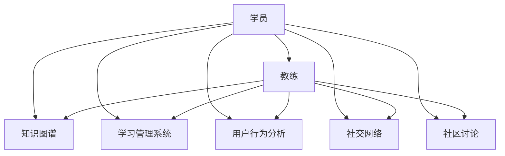

                 

# 技术mentoring：线上平台的搭建与运营

## 1. 背景介绍

### 1.1 问题由来
随着技术的迅猛发展，企业对于技术人才的需求日益增长。然而，招聘和培养顶级工程师仍然面临诸多挑战，如成本高、周期长、人才流失等问题。此时，企业需要一种更加高效、低成本的方式来吸引和培养技术人才。技术mentoring（技术辅导）应运而生，成为企业培养技术人才的重要手段。

### 1.2 问题核心关键点
技术mentoring的核心在于建立一种“教练-学员”的关系，通过一对一的指导和反馈，帮助学员快速提升技术水平和职业素养。这种“传帮带”的方式能够快速将行业经验、技术细节、软技能等传递给学员，促进其职业成长。

技术mentoring不仅适用于企业内部培养，还可以通过线上平台推广到更广泛的范围。通过构建技术在线 mentoring平台，企业能够更有效地吸引优秀人才，提高人才竞争力，加速技术传播和创新。

### 1.3 问题研究意义
技术 mentoring 的线上平台，能够为企业提供一种高效、灵活的人才培养解决方案。其研究意义主要体现在：
- 降低人才获取成本：无需大额薪酬，通过线上平台吸引和培养顶级技术人才。
- 加速人才培养：一对一的辅导方式能够更快提升学员技能，缩短成长周期。
- 提升团队协作能力：线上平台促进知识共享，提高团队整体技术水平。
- 推动技术传播：企业可以将内部技术经验推广到更广泛的社会层面，促进技术进步。

## 2. 核心概念与联系

### 2.1 核心概念概述

为更好地理解技术 mentoring 在线平台的构建与运营，本节将介绍几个密切相关的核心概念：

- 技术 mentoring（技术辅导）：指通过一对一的辅导和反馈，帮助学员提升技术水平和职业素养的过程。
- 在线 mentoring 平台：指通过互联网技术构建的技术 mentoring 平台，实现知识传递、互动交流和资源共享。
- 教练（Coach）：指具有丰富技术经验和行业知识的专家或资深工程师，负责指导和反馈学员。
- 学员（Mentee）：指希望通过技术 mentoring 提升技能和技术水平的工程师或技术人员。
- 知识图谱（Knowledge Graph）：指将知识结构化表示的图模型，用于指导和搜索。
- 学习管理系统（Learning Management System, LMS）：指用于管理和跟踪学员学习进度和反馈的系统。
- 用户行为分析（User Behavior Analysis, UBA）：指通过数据分析技术，了解学员的学习行为和效果，优化辅导效果。
- 社交网络（Social Network）：指通过社交功能，促进学员与教练、学员之间的交流与协作。
- 社区讨论（Community Discussion）：指通过在线论坛或讨论区，促进技术交流和知识分享。

这些核心概念之间的逻辑关系可以通过以下 Mermaid 流程图来展示：



这个流程图展示出学员与教练之间的相互作用，以及知识图谱、学习管理系统、用户行为分析、社交网络、社区讨论等辅助工具的功能。这些概念共同构成了技术 mentoring 在线平台的完整架构，支持其高效运营。

## 3. 核心算法原理 & 具体操作步骤
### 3.1 算法原理概述

技术 mentoring 在线平台的算法原理主要包括以下几个方面：

1. **推荐算法**：根据学员的学习历史、偏好和水平，推荐合适的课程和教练。
2. **匹配算法**：根据学员的学习目标和水平，匹配合适的教练。
3. **评估算法**：通过学习管理系统（LMS）和用户行为分析（UBA）工具，对学员的学习效果和教练的辅导效果进行评估。
4. **社交算法**：通过社交网络（Social Network）和社区讨论（Community Discussion），促进学员与教练、学员之间的交流与协作。

### 3.2 算法步骤详解

以下详细解释基于技术 mentoring 在线平台的算法步骤：

1. **学员注册与学习目标设定**：
   - 学员在平台注册，并设定学习目标和期望达成的技术水平。
   - 系统根据学员的兴趣和目标，推荐相关课程和教练。

2. **教练匹配**：
   - 系统根据学员的学习目标和水平，自动匹配合适的教练。
   - 教练和学员双方可以进一步沟通，确认匹配是否合适。

3. **学习跟踪与反馈**：
   - 学员开始学习，系统会实时记录学习进度和反馈。
   - 教练通过学习管理系统（LMS）查看学员的学习进度，并定期给出反馈和建议。

4. **学习效果评估**：
   - 系统根据学员的学习进度和反馈，定期评估学习效果。
   - 教练和学员可以共同参与评估，确保评估的公正性和准确性。

5. **知识图谱更新与推荐**：
   - 学员在学习过程中发现的新知识和技能，可以更新知识图谱。
   - 系统根据更新后的知识图谱，动态推荐新的课程和教练。

6. **学员与教练交流**：
   - 学员和教练可以通过社交网络（Social Network）进行实时交流。
   - 社区讨论（Community Discussion）区可以发布技术问题和经验分享，促进交流。

### 3.3 算法优缺点

技术 mentoring 在线平台的主要优点包括：

1. **灵活性高**：学员可以在任何时间、任何地点进行学习，灵活性高。
2. **成本低**：通过在线平台，企业可以低成本吸引和培养顶级技术人才。
3. **效率高**：通过推荐和匹配算法，可以快速找到合适的教练和课程，提高学习效率。
4. **可扩展性强**：平台可以不断扩展课程和教练，支持大规模技术 mentoring。

同时，该平台也存在一些局限性：

1. **互动不足**：在线平台的互动性不及面对面辅导，可能影响学习效果。
2. **质量难以保证**：在线平台上的教练和课程质量参差不齐，需要有效监管。
3. **学员自律性要求高**：在线学习需要较高的自律性，部分学员可能难以坚持。

### 3.4 算法应用领域

技术 mentoring 在线平台的应用领域非常广泛，涵盖了企业内部人才培养、技术社区知识传播、行业技术培训等多个方面。具体应用包括：

- 企业内部培训：帮助企业内部员工提升技术水平，加速技术创新。
- 行业技术交流：促进不同企业的工程师进行技术交流，分享经验。
- 技术社区知识传播：建立在线技术社区，促进知识的积累和传播。
- 新技术推广：通过平台推广新技术和新工具，加速技术应用。

## 4. 数学模型和公式 & 详细讲解  
### 4.1 数学模型构建

技术 mentoring 在线平台的数学模型主要包括以下几个方面：

- 学员匹配模型：$M_{match}(x, y) = \max_{x, y} \{f(x, y)\}$，其中 $x$ 为学员特征，$y$ 为教练特征，$f$ 为匹配函数。
- 课程推荐模型：$M_{recommend}(x, y) = \max_{x, y} \{g(x, y)\}$，其中 $x$ 为学员特征，$y$ 为课程特征，$g$ 为推荐函数。
- 学习效果评估模型：$M_{eval}(x, y) = \max_{x, y} \{h(x, y)\}$，其中 $x$ 为学员特征，$y$ 为学习效果特征，$h$ 为评估函数。
- 知识图谱更新模型：$M_{update}(x, y) = \max_{x, y} \{i(x, y)\}$，其中 $x$ 为知识图谱特征，$y$ 为新增知识特征，$i$ 为更新函数。

### 4.2 公式推导过程

以下给出基于学员匹配模型的公式推导：

设学员特征向量为 $x = \{x_1, x_2, ..., x_n\}$，教练特征向量为 $y = \{y_1, y_2, ..., y_m\}$。匹配函数 $f(x, y) = \sum_{i=1}^{n} \sum_{j=1}^{m} w_{ij} x_i y_j$，其中 $w_{ij}$ 为特征权重，$n$ 和 $m$ 分别为特征维度。

匹配函数的最大值即为：

$$
M_{match}(x, y) = \max_{x, y} \{f(x, y)\}
$$

通过优化匹配函数，可以更好地匹配学员和教练，提高学习效率。

### 4.3 案例分析与讲解

以下以一个典型的技术 mentoring 案例进行分析：

**案例背景**：某科技公司希望通过技术 mentoring 在线平台，帮助新员工快速融入团队，提升技术水平。

**具体步骤**：
1. **学员注册与学习目标设定**：新员工注册并设定学习目标，系统根据其专业背景推荐相关课程。
2. **教练匹配**：系统自动匹配适合的教练，教练和学员进行进一步沟通确认。
3. **学习跟踪与反馈**：新员工开始学习，教练通过学习管理系统查看进度并定期给出反馈。
4. **学习效果评估**：系统定期评估新员工的学习效果，教练和学员共同参与。
5. **知识图谱更新与推荐**：新员工学习过程中发现的新知识，更新知识图谱，系统推荐新的课程。

**案例结果**：新员工在较短时间内掌握了公司所需的关键技术，快速融入团队，并积极参与技术讨论和分享。

## 5. 项目实践：代码实例和详细解释说明
### 5.1 开发环境搭建

在进行技术 mentoring 在线平台的开发之前，需要准备好开发环境。以下是使用 Python 进行 Django 开发的环境配置流程：

1. 安装 Anaconda：从官网下载并安装 Anaconda，用于创建独立的 Python 环境。

2. 创建并激活虚拟环境：
```bash
conda create -n mentoring-env python=3.8 
conda activate mentoring-env
```

3. 安装 Django：从官网获取对应的安装命令。例如：
```bash
pip install django==3.2
```

4. 安装其他依赖包：
```bash
pip install django-models-graph djangorestframework crum psycopg2-binary gunicorn
```

5. 安装 PostgreSQL 数据库：
```bash
sudo apt-get update
sudo apt-get install postgresql postgresql-contrib
```

6. 创建数据库和用户：
```bash
sudo -u postgres psql
CREATE DATABASE mentoring;
CREATE USER mentoring WITH PASSWORD 'mentoring';
ALTER ROLE mentoring SET client_encoding TO 'utf8';
ALTER ROLE mentoring SET default_transaction_isolation TO 'read committed';
ALTER ROLE mentoring SET timezone TO 'UTC';
GRANT ALL PRIVILEGES ON DATABASE mentoring TO mentoring;
```

完成上述步骤后，即可在 `mentoring-env` 环境中开始平台开发。

### 5.2 源代码详细实现

这里我们以学员注册与学习目标设定的功能为例，给出 Django 代码实现。

```python
from django.shortcuts import render, redirect
from django.contrib.auth.forms import UserCreationForm
from django.contrib.auth import login, authenticate
from django.contrib import messages
from .forms import ProfileForm

def register(request):
    if request.method == 'POST':
        form = UserCreationForm(request.POST)
        if form.is_valid():
            form.save()
            username = form.cleaned_data.get('username')
            raw_password = form.cleaned_data.get('password1')
            user = authenticate(username=username, password=raw_password)
            login(request, user)
            return redirect('profile')
    else:
        form = UserCreationForm()
    return render(request, 'registration/register.html', {'form': form})

def profile(request):
    if request.method == 'POST':
        form = ProfileForm(request.POST)
        if form.is_valid():
            form.save()
            messages.success(request, 'Profile updated successfully.')
            return redirect('profile')
    else:
        form = ProfileForm(instance=request.user.profile)
    return render(request, 'profile/profile.html', {'form': form})
```

### 5.3 代码解读与分析

让我们再详细解读一下关键代码的实现细节：

**register函数**：
- 处理学员注册请求，创建新用户账户，并登录系统。
- 当请求方法为 POST 时，验证表单，创建新用户。
- 验证通过后，使用 `authenticate` 函数验证密码，并使用 `login` 函数登录系统。
- 登录成功后，重定向到学员配置页面。

**profile函数**：
- 处理学员配置请求，更新学员个人资料。
- 当请求方法为 POST 时，验证表单，更新学员个人资料。
- 验证通过后，展示配置页面。

这些关键代码展示了 Django 框架在用户注册和配置方面的基本操作。开发者可以在此基础上，进一步完善学员和教练的匹配、学习进度跟踪、知识图谱更新等功能。

## 6. 实际应用场景
### 6.1 科技公司内部培训

技术 mentoring 在线平台可以广泛应用于科技公司内部培训，帮助新员工快速掌握所需技术。通过平台，公司可以提供多样化的课程和教练资源，确保新员工能够在较短时间内掌握关键技术。

具体而言，公司可以提供以下服务：
- 自动匹配学员和教练，根据学员的学习进度和反馈，推荐合适的课程。
- 通过社交网络和社区讨论区，促进学员之间的交流和协作。
- 定期评估学员的学习效果，根据评估结果调整教学策略。

通过这些措施，科技公司能够有效提升新员工的融入速度和技术水平，加速公司技术创新和产品开发。

### 6.2 技术社区知识传播

技术 mentoring 在线平台也可以作为技术社区知识传播的工具。通过平台，企业可以将内部的技术经验和知识分享给更广泛的社会层面，促进知识的积累和传播。

具体而言，技术社区可以提供以下服务：
- 建立在线技术社区，允许学员和教练发布和分享技术文章。
- 通过社区讨论区，促进技术交流和知识共享。
- 定期举办技术研讨会和培训班，邀请业内专家进行分享。

通过这些措施，技术社区能够促进技术知识的传播和积累，推动行业技术进步。

### 6.3 行业技术培训

技术 mentoring 在线平台还可以帮助企业进行行业技术培训，提升行业技术水平。通过平台，企业可以组织和推广行业内的新技术和工具，帮助员工提升技术能力。

具体而言，行业培训可以提供以下服务：
- 通过平台推广新技术和新工具，提供在线培训课程。
- 定期组织行业内的技术研讨会和培训班，促进技术交流和创新。
- 邀请业内专家进行分享和技术指导，提升技术水平。

通过这些措施，企业能够更好地应对行业技术的变化，提升行业竞争力。

### 6.4 未来应用展望

随着技术 mentoring 在线平台的不断发展，未来将呈现以下几个趋势：

1. **智能化推荐**：通过机器学习和数据分析，提供更精准的课程和教练推荐。
2. **个性化辅导**：根据学员的学习行为和效果，提供个性化的学习计划和反馈。
3. **多模态学习**：支持视频、音频等多种学习形式，提升学习效果。
4. **实时互动**：通过实时聊天和视频会议，提升学员和教练的互动性。
5. **国际化扩展**：支持多种语言和地区，全球范围内推广技术 mentoring。

这些趋势将进一步提升技术 mentoring 在线平台的价值和应用范围，推动技术知识和经验的全球传播。

## 7. 工具和资源推荐
### 7.1 学习资源推荐

为了帮助开发者系统掌握技术 mentoring 在线平台的开发和运营，这里推荐一些优质的学习资源：

1. Django 官方文档：Django 是构建在线平台的主流框架之一，官方文档详细介绍了 Django 的各个组件和功能，适合深入学习。

2. Django REST framework 文档：Django REST framework 提供了丰富的 RESTful API 支持，适合构建在线平台的 API 接口。

3. Django-models-graph 文档：Django-models-graph 提供了构建知识图谱的功能，适合用于在线平台的知识管理和推荐。

4. PostgreSQL 官方文档：PostgreSQL 是构建在线平台常用的数据库系统，官方文档详细介绍了 PostgreSQL 的各个功能和用法。

5. Gunicorn 文档：Gunicorn 是一个 WSGI 服务器，适合用于在线平台的部署和运行。

通过对这些资源的学习实践，相信你一定能够快速掌握技术 mentoring 在线平台的开发和运营。

### 7.2 开发工具推荐

高效的开发离不开优秀的工具支持。以下是几款用于技术 mentoring 在线平台开发的常用工具：

1. Django：基于 Python 的开源 Web 框架，灵活高效，支持 RESTful API 开发。

2. PostgreSQL：支持高并发、高可用性，适合在线平台的数据存储和处理。

3. Gunicorn：轻量级的 WSGI 服务器，支持高并发和热重启，适合在线平台的部署和运行。

4. GraphQL：用于构建数据查询语言的开放标准，适合在线平台的 API 设计和优化。

5. Redis：内存数据结构存储系统，适合在线平台的缓存和消息队列。

合理利用这些工具，可以显著提升技术 mentoring 在线平台的开发效率，加速技术传播和创新。

### 7.3 相关论文推荐

技术 mentoring 在线平台的发展源于学界的持续研究。以下是几篇奠基性的相关论文，推荐阅读：

1. Mentoring in Online Education: A Literature Review and Research Agenda：深入分析了在线 mentoring 在教育领域的应用，提供了丰富的研究成果和未来方向。

2. The Impact of Mentoring on Career Development in the IT Sector：探讨了 IT 领域 mentoring 对职业发展的影响，提供了实际的案例和数据支持。

3. The Role of Mentoring in Enhancing Technical Skills in IT Professionals：分析了 mentoring 在提升 IT 专业技能方面的作用，提供了理论基础和实证数据。

这些论文代表了大语言模型微调技术的发展脉络。通过学习这些前沿成果，可以帮助研究者把握学科前进方向，激发更多的创新灵感。

## 8. 总结：未来发展趋势与挑战
### 8.1 总结

本文对技术 mentoring 在线平台的构建与运营进行了全面系统的介绍。首先阐述了技术 mentoring 在线平台的研究背景和意义，明确了平台在企业内部人才培养、技术社区知识传播、行业技术培训等方面的重要作用。其次，从原理到实践，详细讲解了平台的算法步骤和具体实现，给出了完整的代码示例。同时，本文还广泛探讨了平台的实际应用场景，展示了平台在多个领域的广泛应用。

通过本文的系统梳理，可以看到，技术 mentoring 在线平台能够高效地培养技术人才，推动技术传播和创新。未来，伴随技术 mentoring 在线平台的持续演进，必将在企业内部人才培养、技术社区知识传播、行业技术培训等方面发挥更大作用，推动技术知识和经验的全球传播。

### 8.2 未来发展趋势

展望未来，技术 mentoring 在线平台将呈现以下几个发展趋势：

1. **智能化推荐**：通过机器学习和数据分析，提供更精准的课程和教练推荐。
2. **个性化辅导**：根据学员的学习行为和效果，提供个性化的学习计划和反馈。
3. **多模态学习**：支持视频、音频等多种学习形式，提升学习效果。
4. **实时互动**：通过实时聊天和视频会议，提升学员和教练的互动性。
5. **国际化扩展**：支持多种语言和地区，全球范围内推广技术 mentoring。

这些趋势将进一步提升技术 mentoring 在线平台的价值和应用范围，推动技术知识和经验的全球传播。

### 8.3 面临的挑战

尽管技术 mentoring 在线平台已经取得了瞩目成就，但在迈向更加智能化、普适化应用的过程中，它仍面临诸多挑战：

1. **互动不足**：在线平台的互动性不及面对面辅导，可能影响学习效果。
2. **质量难以保证**：在线平台上的教练和课程质量参差不齐，需要有效监管。
3. **学员自律性要求高**：在线学习需要较高的自律性，部分学员可能难以坚持。
4. **平台运营成本**：平台的运营和维护需要持续投入，难以完全自给自足。

### 8.4 研究展望

面对技术 mentoring 在线平台面临的挑战，未来的研究需要在以下几个方面寻求新的突破：

1. **提升互动性**：通过实时聊天、视频会议等功能，提升在线平台的学习效果。
2. **保证质量**：建立完善的教练和课程质量评估体系，确保平台的教学质量。
3. **促进自律性**：通过激励机制和监管手段，提高学员的自律性和学习效果。
4. **降低运营成本**：通过开源和社区驱动的方式，降低平台的运营和维护成本。

这些研究方向将推动技术 mentoring 在线平台的持续演进，提升平台的价值和应用范围，推动技术知识和经验的全球传播。总之，技术 mentoring 在线平台需要从多个维度进行优化和改进，才能真正实现智能化、普适化应用，推动技术传播和创新。

## 9. 附录：常见问题与解答

**Q1：技术 mentoring 在线平台是否适用于所有行业？**

A: 技术 mentoring 在线平台适用于大部分行业，尤其是科技、教育、金融等领域。对于那些需要频繁技术更新和知识传播的行业，平台的作用尤为明显。但对于一些传统行业，可能对技术 mentoring 的需求较低。

**Q2：如何选择合适的教练？**

A: 选择合适的教练是技术 mentoring 平台的关键。可以通过以下方式选择教练：
1. 学员评估：学员可以根据教练的评价和历史教学效果，选择合适的教练。
2. 平台推荐：平台根据学员的学习目标和历史数据，推荐合适的教练。
3. 学员和教练匹配：通过算法自动匹配学员和教练，确保匹配效果。

**Q3：如何确保平台的质量和安全性？**

A: 确保技术 mentoring 平台的质量和安全性需要以下措施：
1. 教练和课程质量评估：建立教练和课程质量评估体系，定期审核和筛选教练和课程。
2. 学员反馈机制：建立学员反馈机制，及时发现和处理问题。
3. 数据安全保护：采用数据加密和访问控制等措施，保护学员和教练的数据安全。

**Q4：学员如何保证学习效果？**

A: 学员可以采取以下措施保证学习效果：
1. 设定明确的学习目标：根据自身需求，设定明确的学习目标和计划。
2. 持续跟进学习进度：定期检查学习进度，及时调整学习计划。
3. 主动与教练沟通：积极与教练沟通，及时反馈学习中的问题和困惑。

**Q5：技术 mentoring 在线平台未来的发展方向是什么？**

A: 技术 mentoring 在线平台未来的发展方向包括：
1. 智能化推荐：通过机器学习和数据分析，提供更精准的课程和教练推荐。
2. 多模态学习：支持视频、音频等多种学习形式，提升学习效果。
3. 实时互动：通过实时聊天和视频会议，提升学员和教练的互动性。
4. 国际化扩展：支持多种语言和地区，全球范围内推广技术 mentoring。

这些发展方向将推动技术 mentoring 在线平台的持续演进，提升平台的价值和应用范围，推动技术知识和经验的全球传播。

---

作者：禅与计算机程序设计艺术 / Zen and the Art of Computer Programming

