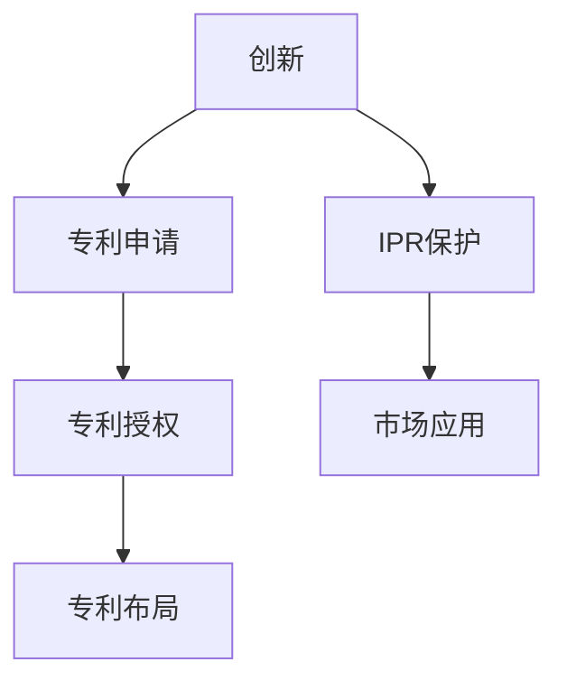

                 

# 技术创新与专利申请：程序员指南

> 关键词：技术创新,专利申请,程序员,指南,IPR,创新思维,专利策略,专利保护

## 1. 背景介绍

### 1.1 问题由来
在信息时代飞速发展的背景下，技术创新已经成为推动经济社会发展的重要引擎。对于程序员而言，技术创新不仅意味着个人职业发展的机遇，也是企业竞争力的源泉。然而，面对复杂的知识产权生态系统，如何有效保护自己的技术成果，使其转化为现实的商业价值，成为困扰广大程序员的难题。

技术创新与专利申请密切相关。专利不仅是对个人创新成果的认可，也是保护其商业利益的重要手段。因此，了解专利申请的流程和策略，掌握如何在技术创新的同时进行有效的专利布局，是每一位程序员成长为技术领导者的必修课。

### 1.2 问题核心关键点
本文旨在为程序员提供一份详尽的专利申请指南，帮助他们理解专利申请的核心概念，明确专利申请的流程和策略，从而在技术创新的道路上少走弯路，顺利实现从技术创意到市场产品的转化。

### 1.3 问题研究意义
在当前全球竞争激烈的科技市场中，专利成为了一种重要的竞争工具。掌握专利申请的知识和技巧，不仅可以保护自己的技术成果，避免技术被盗用，还能在市场竞争中占据有利地位。同时，有效的专利布局也能为后续的技术创新提供更有力的支持，形成一个良性循环。

## 2. 核心概念与联系

### 2.1 核心概念概述

为了更好地理解专利申请的过程，我们首先介绍几个核心概念：

- **专利（Patent）**：一种法律保护形式，赋予发明人在一定期限内对其发明的独占权，防止他人未经许可使用、制造、销售等。专利申请是获得专利保护的前提步骤。

- **专利申请（Patent Application）**：向国家或国际专利机构提交的，用于获得专利权的书面请求。包括发明专利、实用新型专利和外观设计专利。

- **专利布局（Patent Portfolio）**：指通过在不同的技术领域、不同的时间节点提交多份专利申请，形成一个系统的专利组合，以最大化保护发明人的技术成果。

- **创新（Innovation）**：指在产品、过程、服务或商业模式等方面的新构想，旨在解决现有问题或创造新的市场需求。

- **知识产权（Intellectual Property，IP）**：包括专利、商标、版权、商业秘密等，是创新成果的法定保护形式。

这些核心概念之间的联系如下：专利申请是获取专利权的必经过程，而有效的专利布局是保护创新成果的关键手段。创新是专利申请的出发点，而IPR（知识产权）则是创新成果转化为商业价值的法律保障。

### 2.2 核心概念原理和架构的 Mermaid 流程图



这个流程图展示了一条典型的创新到市场应用的技术路径，其中创新是起点，专利申请是保障，专利布局是延伸，IPR保护是支撑，最终市场应用是目标。

## 3. 核心算法原理 & 具体操作步骤
### 3.1 算法原理概述

专利申请的核心在于将技术创新转化为法律文件，使之能够得到国家或国际专利机构的保护。这一过程包括以下几个关键步骤：

1. **发明构思的形成**：这是创新的起点，程序员需要识别并定义出自己技术解决方案的独特性。
2. **专利申请的准备**：收集相关资料，撰写申请文件，包括发明摘要、权利要求书和说明书。
3. **专利申请的提交**：向国家或国际专利机构提交申请文件，等待审核。
4. **专利申请的授权**：在通过初步审查后，进入实质审查阶段，最终获得授权或驳回。

### 3.2 算法步骤详解

以下我们详细介绍专利申请的主要操作步骤：

**步骤 1: 发明构思的形成**

发明构思的形成是专利申请的第一步。程序员需要识别和定义出自己技术解决方案的独特性，包括但不限于：

- 技术的创新点是什么？与现有技术的区别和改进在哪里？
- 该技术解决的问题是什么？适用的应用场景有哪些？
- 该技术与现有技术的区别和改进点有哪些？
- 该技术是否有市场应用前景？商业价值如何？

这些问题的答案，将指导后续的专利申请工作，确保申请文件的准确性和完整性。

**步骤 2: 专利申请的准备**

专利申请的准备工作包括：

1. **收集相关资料**：包括技术文献、行业标准、竞争对手的产品和技术等，以确保发明的创新性和新颖性。
2. **撰写申请文件**：
    - **发明摘要**：简要描述发明的技术领域、目的、技术方案和创新点。
    - **权利要求书**：详细描述发明的技术方案和创新点，确保权利要求的覆盖范围。
    - **说明书**：详细介绍技术方案，包括背景、技术领域、发明内容、具体实施方式等。
3. **进行技术检索**：利用专利数据库进行技术检索，确保发明的创新性和新颖性，避免与已有技术冲突。

**步骤 3: 专利申请的提交**

专利申请的提交步骤如下：

1. **选择专利机构**：可以选择向国家专利局（如中国国家知识产权局）或国际专利组织（如世界知识产权组织WIPO）提交申请。
2. **准备申请材料**：按照专利机构的格式要求，准备完整的申请文件，并缴纳相应的申请费用。
3. **提交申请**：将申请材料提交到指定机构，等待受理。

**步骤 4: 专利申请的授权**

专利申请的授权过程如下：

1. **初步审查**：审查员会对申请文件进行形式审查，确保其符合专利法规定的格式要求。
2. **实质审查**：审查员会对技术内容进行实质审查，包括技术方案的新颖性、创造性和实用性。
3. **授权或驳回**：通过初步审查和实质审查后，专利申请将被授权，或因不符合要求而被驳回。

### 3.3 算法优缺点

专利申请的优势包括：

- **法律保护**：专利权赋予发明人对其发明的独占权，防止他人未经许可使用、制造、销售等。
- **市场竞争**：通过专利布局，可以获得竞争优势，防止他人抄袭和侵权。
- **技术积累**：有效的专利布局可以成为技术积累的证据，为后续的技术创新提供支持。

专利申请的劣势包括：

- **时间成本**：专利申请和授权过程可能需要数年时间，周期较长。
- **费用高昂**：专利申请费用较高，且后续的维护费用也不容忽视。
- **法律复杂**：专利申请涉及复杂的法律问题，需要专业知识和经验。

### 3.4 算法应用领域

专利申请技术广泛应用于各个行业，包括但不限于：

- **科技与互联网**：涉及软件、硬件、算法、网络安全等领域的专利申请。
- **生物与医药**：涉及新药、医疗器械、生物技术等领域的专利申请。
- **化工与材料**：涉及新材料、催化剂、化学合成等领域的专利申请。
- **机械与制造**：涉及机械设备、生产工艺、自动化技术等领域的专利申请。
- **电子与通信**：涉及电子设备、无线通信、信号处理等领域的专利申请。

## 4. 数学模型和公式 & 详细讲解 & 举例说明

### 4.1 数学模型构建

在专利申请中，数学模型主要用于技术描述和权利要求书的撰写。以下是专利申请中常用的数学模型构建方法：

- **技术领域描述**：通常使用数学公式、算法流程图等方式，描述技术方案的核心原理。
- **权利要求书**：使用数学公式表达权利要求的保护范围，确保专利权的覆盖面。

### 4.2 公式推导过程

以下是一个简化的专利申请中数学公式的推导过程：

假设发明是一种新的数据压缩算法，其核心思想是通过某种数学变换实现数据的高效压缩。描述该算法的数据压缩率 $C$ 可以表示为：

$$
C = \frac{S_{\text{原}} - S_{\text{压缩}}}{S_{\text{原}}}
$$

其中 $S_{\text{原}}$ 为原始数据大小，$S_{\text{压缩}}$ 为压缩后数据大小。该公式可以直观地表达算法的压缩效率。

### 4.3 案例分析与讲解

假设发明是一种基于神经网络的文字生成算法，其核心在于使用Transformer结构进行文本生成。以下是该算法的专利申请案例分析：

- **技术领域描述**：介绍使用Transformer结构进行文本生成的技术原理，包括Transformer模型的结构、训练过程和应用场景。
- **权利要求书**：使用数学公式表达算法的核心步骤和技术创新点，例如：“一种用于文本生成的神经网络，包括编码器和解码器，其中编码器使用Transformer结构，解码器使用LSTM结构，输入为输入文本，输出为生成文本。”
- **说明书**：详细介绍算法的实现细节，包括模型架构、训练过程、性能测试等。

## 5. 项目实践：代码实例和详细解释说明

### 5.1 开发环境搭建

在进行专利申请的实践前，我们需要准备好开发环境。以下是Python环境下搭建环境的步骤：

1. **安装Python**：确保Python版本为3.6或以上。
2. **安装Jupyter Notebook**：作为开发工具，Jupyter Notebook支持代码和数学公式的混合编辑，方便进行技术描述和数学推导。
3. **安装PyTorch**：用于进行深度学习算法实现，部分专利涉及技术解决方案涉及机器学习和深度学习。
4. **安装专利撰写工具**：如PatentWizard、EPOweb等，用于撰写和提交专利申请文件。

完成上述步骤后，即可在Jupyter Notebook中进行专利申请的代码实现。

### 5.2 源代码详细实现

以下是一个使用PyTorch进行文字生成算法的代码实现：

```python
import torch
import torch.nn as nn
import torch.nn.functional as F

class TransformerModel(nn.Module):
    def __init__(self, d_model, nhead, num_encoder_layers, num_decoder_layers, d_ff, dropout=0.1):
        super(TransformerModel, self).__init__()
        self.encoder = nn.TransformerEncoder(nn.TransformerEncoderLayer(d_model, nhead, d_ff, dropout))
        self.decoder = nn.TransformerDecoder(nn.TransformerDecoderLayer(d_model, nhead, d_ff, dropout))
        self.drop = nn.Dropout(dropout)
        
    def forward(self, src, tgt):
        enc_src = self.drop(self.encoder(src))
        dec_tgt = self.drop(self.decoder(tgt, enc_src))
        return dec_tgt

model = TransformerModel(512, 8, 6, 6, 2048, dropout=0.1)
```

### 5.3 代码解读与分析

在上述代码中，我们定义了一个简单的Transformer模型。以下是关键代码的解读：

- **TransformerModel类**：定义了编码器和解码器。
- **TransformerEncoderLayer**：Transformer模型的基本构建块，包括自注意力机制、前馈神经网络等。
- **TransformerDecoderLayer**：解码器的基本构建块，与编码器结构类似，但通常参数设置更为复杂。
- **dropout**：加入dropout层，防止过拟合。
- **forward方法**：实现模型的前向传播，包括编码和解码过程。

### 5.4 运行结果展示

运行上述代码，可以得到模型前向传播的结果，具体结果取决于输入的源文本和目标文本。由于代码实现简单，运行结果可能不具备实际应用价值，但可以作为技术描述和数学推导的基础。

## 6. 实际应用场景

### 6.1 智慧城市技术

智慧城市技术依赖于大量的传感器数据和实时处理能力，需要通过专利保护关键技术。以下是智慧城市技术中专利申请的实际应用场景：

- **智能交通系统**：涉及智能交通信号灯、车辆定位、交通数据分析等技术，需要保护的核心算法包括多传感器数据融合、实时路径规划等。
- **智能电网**：涉及电力数据监控、能源管理等技术，需要保护的核心算法包括电力负荷预测、智能电表等。
- **城市管理**：涉及城市环境监测、公共安全等技术，需要保护的核心算法包括视频监控、人群分析等。

### 6.2 物联网技术

物联网技术涉及多种设备和网络的互联互通，需要通过专利保护核心技术。以下是物联网技术中专利申请的实际应用场景：

- **智能家居**：涉及家电控制、安全监控等技术，需要保护的核心算法包括设备联动、语音识别等。
- **智慧农业**：涉及传感器数据采集、精准农业等技术，需要保护的核心算法包括数据融合、图像识别等。
- **智能医疗**：涉及医疗设备、电子病历等技术，需要保护的核心算法包括数据加密、远程医疗等。

### 6.3 工业互联网

工业互联网技术涉及工业数据的采集、分析和应用，需要通过专利保护关键技术。以下是工业互联网技术中专利申请的实际应用场景：

- **智能制造**：涉及生产线监控、产品质量检测等技术，需要保护的核心算法包括机器视觉、数据采集等。
- **智能物流**：涉及货物跟踪、仓储管理等技术，需要保护的核心算法包括GPS定位、货物识别等。
- **智能供应链**：涉及供应链数据分析、库存管理等技术，需要保护的核心算法包括数据挖掘、需求预测等。

### 6.4 未来应用展望

随着技术创新的不断加速，专利申请也将迎来新的挑战和机遇。未来，专利申请将在以下方面继续发展：

- **大数据和云计算技术**：随着大数据和云计算技术的普及，涉及数据安全和隐私保护的技术将成为专利申请的重要领域。
- **人工智能与机器学习**：涉及人工智能与机器学习算法的专利申请将持续增长，特别是深度学习、自然语言处理等前沿技术。
- **区块链和数字货币**：涉及区块链和数字货币技术的专利申请将逐步增多，特别是在安全协议和智能合约方面。
- **生物技术与医疗健康**：涉及新药研发、基因编辑等生物技术的专利申请将大幅增加，特别是在医疗健康领域。

## 7. 工具和资源推荐

### 7.1 学习资源推荐

为了帮助程序员系统掌握专利申请的相关知识，这里推荐一些优质的学习资源：

- **《专利法基础》**：了解专利申请的基本法律知识，包括专利的类型、申请流程、权利保护等。
- **《专利撰写技巧》**：掌握专利申请文件的撰写技巧，包括权利要求书的撰写、技术描述的表达等。
- **《IPR案例分析》**：通过分析经典专利案例，了解专利申请中的策略和技巧。
- **在线课程**：如Coursera、edX等平台上的专利法相关课程，提供系统的专利申请知识体系。
- **专利数据库**：如美国专利商标局（USPTO）、欧洲专利局（EPO）等，提供丰富的专利信息检索资源。

### 7.2 开发工具推荐

在专利申请的实践中，开发工具的选择至关重要。以下是几款常用的专利申请开发工具：

- **PatentWizard**：提供可视化的专利申请界面，支持文本和图形的混合编辑。
- **EPOweb**：欧洲专利局提供的在线专利申请工具，支持多语言操作。
- **PatentProfiler**：提供专利数据检索和分析功能，帮助程序员进行专利布局和战略规划。
- **PatentScope**：提供全球专利数据检索和分析功能，支持多种专利数据库的接入。
- **Google Patents**：提供全球专利检索功能，方便程序员查找相关专利。

### 7.3 相关论文推荐

专利申请技术的不断发展，离不开学界的持续研究。以下是几篇奠基性的相关论文，推荐阅读：

- **《专利法》**：详细介绍专利申请的法律框架和基本原则。
- **《技术创新与专利保护》**：探讨技术创新与专利保护的关系，提出专利策略建议。
- **《专利申请的数学模型构建》**：分析专利申请中数学模型的构建方法及其应用。
- **《人工智能与专利保护》**：讨论人工智能技术在专利申请中的应用，提出专利布局策略。
- **《技术创新与知识产权》**：探讨技术创新与知识产权的关系，提出知识产权保护策略。

## 8. 总结：未来发展趋势与挑战

### 8.1 研究成果总结

通过本文的详细讲解，程序员可以全面了解专利申请的流程和策略，掌握专利申请的关键技巧，从而在技术创新的道路上更加自信和从容。

### 8.2 未来发展趋势

未来，专利申请技术将呈现以下几个发展趋势：

- **技术融合加速**：随着技术创新的不断加速，专利申请将涉及更多交叉领域的技术，例如人工智能与物联网、区块链与金融科技等。
- **全球化布局**：随着全球化进程的加快，跨国专利布局将成为常态，程序员需要具备全球视角和跨文化沟通能力。
- **技术保护强化**：随着知识产权意识的提升，技术保护将变得更加严格，程序员需要更加注重技术创新和专利布局的平衡。
- **专利审查机制优化**：随着专利申请量的增加，专利审查机制将不断优化，以提高审查效率和质量。

### 8.3 面临的挑战

尽管专利申请技术已经取得了长足进展，但在技术创新的过程中，仍面临诸多挑战：

- **法律环境变化**：随着技术发展和社会进步，专利法律环境不断变化，程序员需要及时更新相关知识。
- **专利申请复杂性增加**：随着技术复杂性的增加，专利申请文件的撰写和审核难度也将增加。
- **成本压力**：专利申请的高成本和持续维护费用，对中小企业和技术创业者构成较大压力。
- **知识产权保护不足**：部分技术创新可能面临侵权风险，知识产权保护的不足将影响技术创新的积极性。

### 8.4 研究展望

面对专利申请面临的挑战，未来的研究需要在以下几个方面寻求新的突破：

- **自动化专利申请系统**：开发更加智能的专利申请系统，自动化撰写和审核申请文件，提高效率和准确性。
- **全球专利分析工具**：开发全球专利数据检索和分析工具，帮助程序员进行专利布局和战略规划。
- **知识产权法律创新**：推动知识产权法律的创新和完善，提供更加公平和透明的专利申请环境。
- **跨领域专利申请策略**：探索跨领域专利申请策略，最大化利用技术创新的成果。

通过不断的技术创新和法律完善，专利申请技术将更加高效和便捷，程序员可以在技术创新的道路上走得更远，更快地将技术成果转化为商业价值。

## 9. 附录：常见问题与解答

**Q1: 专利申请的流程和步骤是什么？**

A: 专利申请的流程大致包括以下几个步骤：
1. 发明构思的形成。
2. 专利申请的准备，包括收集资料、撰写申请文件等。
3. 专利申请的提交。
4. 专利申请的授权。

**Q2: 专利申请的难度在哪里？**

A: 专利申请的难度主要在于：
1. 技术描述的准确性。需要清楚地描述发明的创新点和技术方案。
2. 权利要求的覆盖面。需要撰写合理的权利要求，确保专利权的覆盖范围。
3. 法律知识的要求。需要熟悉专利法及相关法律知识。
4. 语言的表达能力。需要准确、清晰地表达技术方案。

**Q3: 如何高效撰写专利申请文件？**

A: 高效撰写专利申请文件的技巧包括：
1. 使用可视化工具，如PatentWizard等。
2. 参考经典专利案例，学习撰写技巧。
3. 与专利代理人合作，提高撰写质量。

**Q4: 如何维护专利权？**

A: 专利权维护的主要方法包括：
1. 支付维护费用。按时缴纳专利维护费用，确保专利权有效。
2. 监控侵权行为。定期监控市场，防止侵权行为。
3. 法律诉讼。在遭遇侵权时，通过法律手段维护专利权。

**Q5: 专利申请的有效期是多少？**

A: 专利申请的有效期因国家和地区而异，通常为20年左右。例如，中国专利的有效期为20年，自申请日起计算。

---

作者：禅与计算机程序设计艺术 / Zen and the Art of Computer Programming

