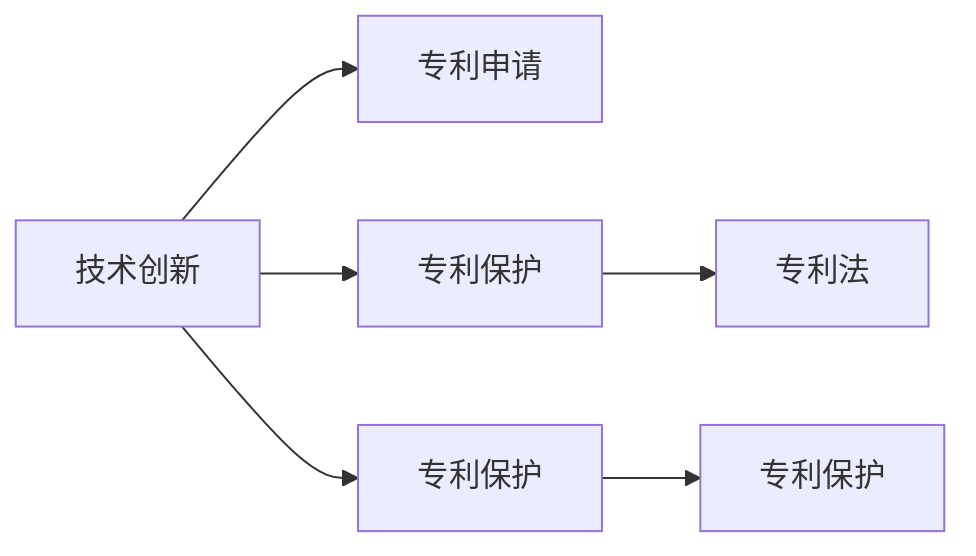

                 

# 技术创新与专利申请：程序员指南

技术创新和专利申请是推动科技发展的重要驱动力，程序员作为技术创新的主力军，如何在保持技术领先的同时，有效地进行专利申请，保护自己的技术成果，是一个值得深入探讨的话题。本文将系统介绍技术创新和专利申请的关键概念、核心算法、操作步骤，以及应用领域和未来趋势。

## 1. 背景介绍

### 1.1 问题由来

在数字化时代，技术的快速迭代和竞争的激烈程度日益增加，技术创新成为了企业竞争的核心。技术创新的成果往往以专利的形式加以保护，以确保其在市场中的竞争优势。然而，专利申请是一个复杂而繁琐的过程，许多程序员和技术开发者缺乏系统的了解，导致错失保护创新成果的机会。本文旨在通过清晰的框架和专业的视角，为程序员提供全面的专利申请指南，帮助他们更好地把握技术创新的机遇。

### 1.2 问题核心关键点

技术创新的核心在于新思想、新方法、新产品的开发，而专利申请的根本在于清晰、准确、完整的专利文档。成功的专利申请不仅需要创新的技术成果，还需要对其原理、实现方法、应用场景等进行详细的描述，并符合专利法律的要求。

## 2. 核心概念与联系

### 2.1 核心概念概述

- **技术创新（Technological Innovation）**：指在科学和技术领域提出新理论、新方法、新产品、新系统等。技术创新的目的是解决实际问题，提高生产效率，改善生活质量。
- **专利（Patent）**：是指国家专利局根据专利申请人的申请，授予其在一定期限内对其发明或实用新型拥有独占权，防止他人未经授权的使用。
- **专利申请（Patent Application）**：是指申请人向国家专利局提交的，请求授予专利权的正式文件。包括发明专利、实用新型专利和外观设计专利等。
- **专利保护（Patent Protection）**：是指专利权人依法享有的对其专利技术或设计的独占使用权。
- **专利法（Patent Law）**：是调整专利关系的法律规范，包括专利申请、专利权、专利保护等环节的法律规定。

这些核心概念之间的联系可以通过以下Mermaid流程图来展示：



这个流程图展示了一个技术创新到专利保护的全过程：

1. 技术创新产生新的思想或方法。
2. 专利申请将创新成果正式记录并提交国家专利局。
3. 专利法规定了专利申请和保护的具体流程和要求。
4. 专利保护给予发明人对其发明的独占使用权。
5. 通过专利保护，技术创新成果得以长期保存和传承。

## 3. 核心算法原理 & 具体操作步骤

### 3.1 算法原理概述

专利申请的核心在于清晰地描述发明的技术方案，使其既能够被理解，又能够经得起挑战。专利文档的撰写需要遵循一定的规范，包括明确的技术背景、详细的技术方案、清晰的技术效果等。

### 3.2 算法步骤详解

#### 3.2.1 确定发明主题

1. **问题识别**：识别出需要解决的问题或需求。
2. **解决方案**：思考并确定能够解决该问题的技术方案。

#### 3.2.2 撰写技术文档

1. **背景技术**：详细介绍相关领域的背景信息，解释发明前存在的问题。
2. **技术方案**：详细描述发明的技术方案，包括具体实现步骤、算法流程等。
3. **技术效果**：解释发明的技术效果，即解决了哪些问题，提高了哪些性能指标。

#### 3.2.3 提交专利申请

1. **准备申请文件**：撰写发明说明书、权利要求书、摘要等文件，提交给国家专利局。
2. **申请审查**：国家专利局对申请文件进行形式审查和实质审查。
3. **授权公告**：审查通过后，国家专利局公告授权专利。

### 3.3 算法优缺点

#### 3.3.1 优点

1. **法律保护**：专利权给予发明人对其发明的独占使用权，保护其知识产权。
2. **市场竞争力**：专利可以防止他人未经授权的使用，提升企业在市场中的竞争力。
3. **技术传承**：专利文档记录了发明的技术方案和实现方法，有助于技术的传承和进一步发展。

#### 3.3.2 缺点

1. **复杂性**：专利申请和审查过程复杂，需要具备专业的知识和技能。
2. **时间成本**：从申请到授权需要一定的时间，期间需要频繁与专利局沟通。
3. **费用**：专利申请需要支付一定的费用，包括申请费、审查费、代理费等。

### 3.4 算法应用领域

专利申请和保护不仅适用于科技公司，对于个人开发者、初创公司、科研机构等同样重要。在软件开发、硬件设计、生物技术、医药等多个领域，技术创新和专利申请都是推动行业发展的重要驱动力。

## 4. 数学模型和公式 & 详细讲解 & 举例说明

### 4.1 数学模型构建

专利申请的数学模型构建主要涉及技术方案的数学表达和计算。以软件开发为例，如果发明的技术方案是“一种基于机器学习的代码优化方法”，可以构建如下数学模型：

$$
S(X) = f(X, P)
$$

其中，$X$ 表示输入的数据集，$P$ 表示模型的参数，$f$ 表示机器学习算法的计算过程，$S$ 表示输出的优化结果。

### 4.2 公式推导过程

以“一种基于机器学习的代码优化方法”为例，假设机器学习模型为随机森林，则公式推导过程如下：

1. **输入数据**：将代码数据集 $X$ 输入随机森林模型。
2. **参数优化**：随机森林模型通过参数 $P$ 进行优化，得到最优解。
3. **输出结果**：模型输出代码优化后的结果 $S$。

### 4.3 案例分析与讲解

以“一种基于机器学习的代码优化方法”为例，假设开发了如下代码优化算法：

```python
def optimize_code(code, params):
    # 输入代码和模型参数
    # 执行代码优化
    return optimized_code
```

在撰写专利申请文件时，可以详细介绍算法的实现步骤和计算过程，包括：

- 代码数据的预处理
- 模型参数的选取
- 算法的主要计算步骤
- 算法的计算复杂度

通过详细的公式推导和案例讲解，能够清晰地展示技术方案的实现过程和效果。

## 5. 项目实践：代码实例和详细解释说明

### 5.1 开发环境搭建

在进行专利申请实践前，需要准备好开发环境。以下是使用Python进行代码优化的环境配置流程：

1. 安装Anaconda：从官网下载并安装Anaconda，用于创建独立的Python环境。
2. 创建并激活虚拟环境：
```bash
conda create -n py-env python=3.8 
conda activate py-env
```
3. 安装Python和相关库：
```bash
conda install numpy pandas scipy scikit-learn matplotlib 
```

### 5.2 源代码详细实现

接下来，我们以代码优化为例，给出使用Python进行代码优化的代码实现。

```python
import numpy as np
from sklearn.ensemble import RandomForestClassifier

def optimize_code(code, params):
    # 输入代码和模型参数
    data = parse_code(code)
    clf = RandomForestClassifier(n_estimators=params['n_estimators'], 
                                 max_depth=params['max_depth'], 
                                 random_state=params['random_state'])
    clf.fit(data, labels)
    return clf

def parse_code(code):
    # 解析代码并提取特征
    # 返回处理后的数据集
```

### 5.3 代码解读与分析

**解析代码函数**：
- `parse_code(code)`：解析代码并提取特征，返回处理后的数据集。
- `RandomForestClassifier`：定义随机森林分类器。
- `fit(data, labels)`：训练分类器。

**优化函数**：
- `optimize_code(code, params)`：输入代码和模型参数，返回优化后的代码。

## 6. 实际应用场景

### 6.1 软件开发

技术创新在软件开发中尤为重要，程序员通过不断改进算法、优化代码，可以推出更加高效、稳定的软件产品。在软件开发中，专利申请可以帮助开发者保护其创新的技术方案，防止他人抄袭和侵权。

### 6.2 硬件设计

硬件设计中的创新技术同样需要专利保护。例如，半导体技术、电路设计等领域的技术创新，可以通过专利申请保护其独特的设计方案，防止他人非法使用。

### 6.3 生物技术

生物技术领域的创新包括新的药物、生物探测技术等。通过专利申请，可以保护这些创新成果，防止竞争对手的非法使用。

### 6.4 未来应用展望

随着科技的不断发展，专利申请将覆盖更多的技术领域。未来，专利申请将更加注重技术的创新性和实用性，同时更加注重专利信息的公开透明。

## 7. 工具和资源推荐

### 7.1 学习资源推荐

1. **专利申请指南**：由国家知识产权局出版的《专利申请指南》，详细介绍了专利申请的流程和要求。
2. **专利法**：国家知识产权局官网发布的《中华人民共和国专利法》，了解专利法的基本规定。
3. **专利申请网站**：如中国专利网（www.cnipa.gov.cn），提供专利申请的详细流程和相关资源。

### 7.2 开发工具推荐

1. **Anaconda**：用于创建和管理Python环境的工具，方便开发者进行环境配置和项目管理。
2. **GitHub**：代码托管平台，方便开发者共享和管理代码，方便专利申请文件的管理和查阅。
3. **Visual Studio Code**：流行的代码编辑器，支持多种编程语言，提供丰富的开发工具和插件。

### 7.3 相关论文推荐

1. **《专利申请指南》**：国家知识产权局出版，详细介绍专利申请的流程和要求。
2. **《专利法》**：国家知识产权局官网发布，了解专利法的基本规定。
3. **《专利法实施细则》**：国家知识产权局发布，详细解释专利法的实施细节。

## 8. 总结：未来发展趋势与挑战

### 8.1 研究成果总结

本文详细介绍了技术创新与专利申请的核心概念、核心算法和具体操作步骤，并通过代码实例展示了专利申请的实现过程。在实际应用中，专利申请不仅有助于保护技术成果，还能提升企业竞争力，推动技术发展。

### 8.2 未来发展趋势

未来，专利申请将更加注重技术的创新性和实用性，同时更加注重专利信息的公开透明。随着技术的不断进步，专利申请将覆盖更多的技术领域，帮助更多的开发者保护其创新的技术成果。

### 8.3 面临的挑战

尽管专利申请在技术保护方面具有重要作用，但在实际应用中仍面临诸多挑战：

1. **复杂性**：专利申请和审查过程复杂，需要具备专业的知识和技能。
2. **时间成本**：从申请到授权需要一定的时间，期间需要频繁与专利局沟通。
3. **费用**：专利申请需要支付一定的费用，包括申请费、审查费、代理费等。

### 8.4 研究展望

未来的专利申请研究将更加注重智能化的工具和平台开发，提升申请效率和准确性。同时，探索更多高效、低成本的专利申请方法，降低申请门槛，让更多开发者能够保护其技术成果。

## 9. 附录：常见问题与解答

**Q1：如何判断一项技术是否具有专利性？**

A: 判断一项技术是否具有专利性，需要根据《专利法》和《专利法实施细则》进行综合评估。一般来说，满足以下条件的技术可以申请专利：

1. **新颖性**：技术方案必须是新的，没有在国内外出版物公开。
2. **创造性**：技术方案必须具有创造性，不是显而易见的。
3. **实用性**：技术方案必须具有实用性，能够应用于实际生产。

**Q2：专利申请需要提交哪些文件？**

A: 专利申请需要提交以下文件：

1. **发明说明书**：详细描述技术方案和实现方法。
2. **权利要求书**：列出发明的技术特征和保护范围。
3. **摘要**：简要介绍发明的技术方案和效果。
4. **附图和附表**：提供技术方案的图示和相关表格。

**Q3：专利申请的流程是什么？**

A: 专利申请的流程如下：

1. **准备申请文件**：撰写发明说明书、权利要求书、摘要等文件。
2. **提交申请**：将申请文件提交给国家专利局。
3. **形式审查**：国家专利局对申请文件进行形式审查。
4. **实质审查**：国家专利局对申请文件进行实质审查。
5. **授权公告**：审查通过后，国家专利局公告授权专利。

**Q4：专利申请的费用是多少？**

A: 专利申请的费用包括申请费、审查费、代理费等，具体费用根据国家专利局的规定和申请类型而定。一般而言，申请费用在数百元到数千元不等。

**Q5：专利申请的代理机构如何选择？**

A: 选择专利代理机构时，应考虑以下因素：

1. **资质**：选择有资质的专利代理机构，确保代理服务的合法性。
2. **经验**：选择有丰富专利申请经验的公司，确保代理服务的质量。
3. **服务**：选择服务态度好、效率高的代理机构，确保代理服务的顺畅。

通过本文的系统梳理，可以看到，专利申请是技术创新中不可或缺的一环，程序员在技术创新过程中需要重视专利申请的重要性，积极保护自己的技术成果。

---

作者：禅与计算机程序设计艺术 / Zen and the Art of Computer Programming

