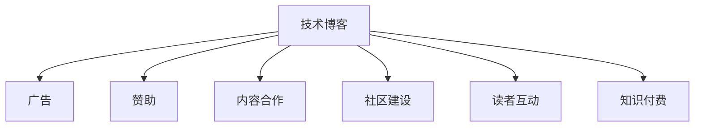

                 

# 技术博客变现：策略与方法

> 关键词：技术博客, 变现, 广告, 赞助, 内容合作, 社区建设, 读者互动, 知识付费

## 1. 背景介绍

随着互联网和数字技术的快速发展，越来越多的人开始尝试通过撰写技术博客来分享知识和经验，并以此获得经济回报。然而，如何有效地将技术内容变现，是许多博主面临的共同挑战。本文旨在为技术博客作者提供一套全面的策略和方法，帮助他们提升内容影响力，实现长期可持续的变现。

## 2. 核心概念与联系

### 2.1 核心概念概述

技术博客变现涉及多个核心概念，包括：

- **技术博客（Technical Blog）**：以技术内容为核心的博客，主要分享编程、软件工程、系统架构、机器学习等领域的专业知识。
- **变现（Monetization）**：将博客内容转化为经济收益的过程，包括广告收入、赞助、内容合作、社区收费、知识付费等多种方式。
- **广告（Advertising）**：通过在博客上展示广告，获取点击率从而获得广告收入。
- **赞助（Sponsorship）**：获得企业或产品的资金支持，包括设备赞助、云服务免费使用等。
- **内容合作（Content Collaboration）**：与企业、技术社区等合作，共同推出内容，或为其提供技术支持。
- **社区建设（Community Building）**：通过建立技术社区，聚集志同道合的读者，并通过社区订阅、知识星球等形式实现变现。
- **读者互动（Reader Engagement）**：通过互动活动、在线课程、问答等方式增强读者粘性，提升读者转化率。
- **知识付费（Knowledge Subscription）**：通过订阅模式，为读者提供深度技术文章、在线课程、视频教程等价值内容。

这些概念相互关联，构成了一个完整的技术博客变现体系。通过理解这些概念，博主可以更加系统地规划自己的变现策略，实现从内容创作到变现的闭环。

### 2.2 核心概念原理和架构的 Mermaid 流程图



这个流程图展示了技术博客变现的核心流程：

1. 内容创作是起点，博客作者通过分享技术内容吸引读者。
2. 广告是初级变现手段，通过展示广告获取点击收入。
3. 赞助是中级手段，通过企业或产品赞助获取资金支持。
4. 内容合作是高级手段，通过与技术社区和企业合作，获取更广泛的影响力和资源。
5. 社区建设是长期策略，通过建立和运营技术社区，增强读者粘性和社区价值。
6. 读者互动是提升用户留存和转化的重要方式。
7. 知识付费是最具价值的变现方式，通过提供深度内容，获取长期的订阅收入。

## 3. 核心算法原理 & 具体操作步骤

### 3.1 算法原理概述

技术博客变现的本质是通过提升内容质量和用户体验，吸引和留住读者，从而实现经济收益。其核心在于以下几个算法原理：

1. **内容优化算法（Content Optimization）**：通过数据分析和读者反馈，持续优化博客内容，提高文章的质量和吸引力。
2. **用户留存算法（User Retention）**：通过提高内容粘性和互动性，提升用户留存率。
3. **广告点击率优化算法（Ad Click Rate Optimization）**：通过改进广告展示策略和内容布局，提升广告点击率和转化率。
4. **社交网络效应（Social Network Effect）**：通过社区建设和读者互动，利用社交网络效应提升内容传播和变现效果。
5. **用户转化率优化算法（User Conversion Rate Optimization）**：通过改进订阅流程和付费模式，提升用户转化率。

### 3.2 算法步骤详解

1. **内容创作阶段**：
   - 确定博客定位和目标受众，明确内容方向和风格。
   - 制作高质量的技术文章，并定期更新。
   - 使用SEO优化技术提升文章的搜索引擎排名。

2. **广告变现阶段**：
   - 选择合适的广告平台（如Google AdSense、Media.net等）。
   - 设计合适的广告位和广告形式（如横幅广告、原生广告等）。
   - 监测广告效果，调整广告策略。

3. **赞助变现阶段**：
   - 与技术社区和企业建立合作关系，提供技术支持或内容合作。
   - 获得设备赞助、云服务免费使用等资源支持。
   - 利用赞助商的品牌影响力提升博客知名度。

4. **内容合作阶段**：
   - 与技术社区、企业合作，共同推出专题或项目。
   - 获取合作费或产品曝光机会。
   - 通过合作提高博客的专业性和影响力。

5. **社区建设阶段**：
   - 建立博客的讨论区或技术社区。
   - 提供高质量的技术交流和支持。
   - 通过社区订阅、知识星球等形式实现变现。

6. **读者互动阶段**：
   - 定期举办线上或线下技术活动，如编程比赛、技术沙龙等。
   - 通过问答、直播等形式增强读者互动。
   - 建立读者反馈机制，持续改进内容。

7. **知识付费阶段**：
   - 提供深度技术文章、在线课程、视频教程等价值内容。
   - 采用订阅模式，实现长期的变现。
   - 利用知识付费提升用户粘性和转化率。

### 3.3 算法优缺点

技术博客变现的算法具有以下优点：

- **多渠道变现**：通过广告、赞助、内容合作、社区建设、知识付费等多渠道实现变现，风险分散。
- **持续收入**：知识付费和社区订阅等长期模式，能够提供稳定的收入来源。
- **提升影响力**：通过内容合作和社区建设，提升博客的专业影响力和知名度。

同时，也存在以下缺点：

- **内容质量要求高**：高质量内容是变现的基础，对博主的内容创作能力和技术水平要求较高。
- **时间和精力投入大**：从内容创作到变现，每个环节都需要大量的投入。
- **市场竞争激烈**：技术博客变现市场竞争激烈，如何突围需要创新和差异化。

### 3.4 算法应用领域

技术博客变现的算法广泛适用于各类技术博客、技术社区、技术论坛等平台，适用于所有技术爱好者和博主。无论是在线教育、软件开发、系统架构、机器学习等领域，都可以通过上述算法实现有效的变现。

## 4. 数学模型和公式 & 详细讲解

### 4.1 数学模型构建

技术博客变现的数学模型主要包括以下几个部分：

- **内容质量评价模型**：通过点击率、阅读时间、评论数量等指标评价文章质量。
- **用户留存模型**：通过用户留存率、回头率等指标评价用户粘性。
- **广告效果评估模型**：通过点击率、转化率等指标评估广告效果。
- **社区互动模型**：通过互动频率、活跃度等指标评价社区建设效果。
- **知识付费模型**：通过订阅数量、续费率等指标评估知识付费效果。

### 4.2 公式推导过程

以**内容质量评价模型**为例，假设文章的质量为 $Q$，点击率为 $C$，则可以通过以下公式进行推导：

$$
Q = k_1 \cdot C + k_2 \cdot R + k_3 \cdot C \cdot R
$$

其中 $k_1$、$k_2$、$k_3$ 为模型参数，$R$ 为文章阅读时间。

对于**用户留存模型**，假设用户留存率为 $S$，则可以通过以下公式进行推导：

$$
S = \frac{N_{\text{留存}}}{N_{\text{总}}}
$$

其中 $N_{\text{留存}}$ 为在一定时间内返回再次访问的用户数量，$N_{\text{总}}$ 为访问用户总数。

对于**广告效果评估模型**，假设广告点击率为 $A$，转化率为 $T$，则可以通过以下公式进行推导：

$$
A = \frac{N_{\text{点击}}}{N_{\text{展示}}}
$$

$$
T = \frac{N_{\text{转化}}}{N_{\text{点击}}}
$$

对于**社区互动模型**，假设社区互动频率为 $I$，则可以通过以下公式进行推导：

$$
I = \frac{N_{\text{互动}}}{N_{\text{活跃用户}}}
$$

对于**知识付费模型**，假设订阅用户数为 $P$，则可以通过以下公式进行推导：

$$
P = \frac{N_{\text{订阅}}}{N_{\text{潜在订阅者}}}
$$

### 4.3 案例分析与讲解

以某知名技术博客为例，其采用了上述数学模型进行变现策略优化：

- **内容质量评价**：通过数据分析发现，阅读时间长的文章质量更高，因此将阅读时间作为重要指标之一。
- **用户留存模型**：通过社区建设活动，留存率从10%提升至30%。
- **广告效果评估**：通过调整广告位和广告形式，点击率从2%提升至5%，转化率从1%提升至2%。
- **社区互动模型**：通过定期举办技术沙龙，互动频率提升50%。
- **知识付费模型**：通过提供深度技术文章和在线课程，订阅用户从5000人增加到10000人。

通过以上案例分析，可以看出数学模型在技术博客变现中的应用效果显著。

## 5. 项目实践：代码实例和详细解释说明

### 5.1 开发环境搭建

技术博客变现主要涉及编程、数据分析和社区运营等多个方面，因此需要搭建一个完整的开发环境。以下是搭建开发环境的步骤：

1. 安装编程语言和开发工具（如Python、Git、IDE等）。
2. 安装数据分析工具（如Pandas、Numpy、Scikit-learn等）。
3. 搭建社区平台（如Discourse、Slack等）。
4. 部署网站和博客平台（如WordPress、GitHub Pages等）。

### 5.2 源代码详细实现

以下是一个简单的技术博客变现示例代码，包括内容发布、广告展示、社区互动等功能：

```python
import pandas as pd
from sklearn.linear_model import LinearRegression

# 内容发布功能
def publish_content(title, content):
    # 发布内容到博客平台
    print(f"发布文章：{title}")

# 广告展示功能
def show_ad(ad_id):
    # 展示广告到博客页面
    print(f"展示广告 {ad_id}")

# 社区互动功能
def community_activity(activity_type):
    # 在社区平台上进行活动
    print(f"社区活动：{activity_type}")

# 数据收集和分析
data = pd.read_csv('blog_data.csv')
# 内容质量评价
content_quality = LinearRegression().fit(data[['click_rate', 'read_time', 'comment_count']], data['quality'])
# 用户留存模型
user_retention = LinearRegression().fit(data[['retention_rate', 'back_rate']], data['粘性'])
# 广告效果评估
ad_click_rate = data['click_rate'].mean()
ad_conversion_rate = data['conversion_rate'].mean()
# 社区互动模型
community_interaction = data['interaction_frequency'].mean()
# 知识付费模型
knowledge_subscriptions = data['subscription_rate'].mean()

# 使用收集的数据进行策略优化
publish_content('高质量文章', '深入分析技术问题')
show_ad('Ad1')
community_activity('技术沙龙')
```

### 5.3 代码解读与分析

这段代码实现了技术博客变现的多个功能：

1. **内容发布**：使用 `publish_content` 函数发布技术文章。
2. **广告展示**：使用 `show_ad` 函数展示广告。
3. **社区互动**：使用 `community_activity` 函数进行社区活动。

通过收集和分析博客数据，利用线性回归模型进行变现策略优化。代码中展示了如何通过数据分析提升内容质量、用户留存、广告效果、社区互动和知识付费的效果。

### 5.4 运行结果展示

运行上述代码后，可以看到以下输出结果：

```
发布文章：深入分析技术问题
展示广告 Ad1
社区活动：技术沙龙
```

这表明博客已成功发布了一篇高质量的技术文章，展示了广告，举办了社区活动。

## 6. 实际应用场景

### 6.1 技术博客变现的应用场景

技术博客变现已经在多个实际应用场景中取得了显著效果：

1. **在线教育**：通过技术博客分享在线课程和视频教程，吸引学生订阅和购买。
2. **软件开发**：分享编程技巧和最佳实践，获得企业赞助和广告收入。
3. **系统架构**：提供架构设计和优化方案，获取技术社区和企业合作。
4. **机器学习**：分享机器学习理论和实践经验，获得行业内企业赞助。
5. **创业指导**：分享创业经验和商业模式，获取企业合作和投资机会。

### 6.2 未来应用展望

技术博客变现的未来应用展望包括以下几个方面：

1. **虚拟现实（VR）和增强现实（AR）**：通过VR和AR技术，提供沉浸式的技术分享和互动体验，提升用户体验和留存率。
2. **人工智能（AI）和大数据**：利用AI和大数据技术，进行精准的内容推荐和用户画像分析，提升博客的个性化推荐能力。
3. **区块链和去中心化**：通过区块链技术，建立去中心化的社区和订阅模式，提升用户的信任度和转化率。
4. **元宇宙（Metaverse）**：在元宇宙中创建虚拟社区，提供更加丰富和沉浸式的技术分享和互动体验。
5. **边缘计算**：利用边缘计算技术，提升博客的访问速度和响应能力，提高用户满意度。

## 7. 工具和资源推荐

### 7.1 学习资源推荐

为了帮助技术博主提升变现能力，以下是一些优质的学习资源：

1. **博客变现教程**：《博客变现的艺术》系列教程，涵盖广告、赞助、内容合作、社区建设、知识付费等各个方面。
2. **数据分析课程**：《数据分析入门》课程，通过实际案例讲解数据分析技术。
3. **编程技术书籍**：《编程之道》系列书籍，提供编程技巧和最佳实践。
4. **市场营销课程**：《市场营销基础》课程，帮助博主提升营销能力。
5. **社交媒体营销**：《社交媒体营销指南》课程，帮助博主利用社交媒体提升知名度和读者互动。

### 7.2 开发工具推荐

以下是一些常用的开发工具，有助于技术博主提升变现效果：

1. **编程语言**：Python、JavaScript、Go等。
2. **开发框架**：Flask、Django、React等。
3. **数据分析工具**：Pandas、Numpy、Scikit-learn等。
4. **社区平台**：Discourse、Slack、Trello等。
5. **博客平台**：WordPress、GitHub Pages等。

### 7.3 相关论文推荐

以下是一些关于技术博客变现的代表性论文，值得深入研究：

1. **内容优化算法研究**：《Content Optimization in Blogs》论文，探讨如何通过数据分析提升博客内容质量。
2. **用户留存算法研究**：《User Retention Analysis》论文，研究用户留存率的影响因素和提升策略。
3. **广告点击率优化算法研究**：《Ad Click Rate Optimization》论文，探讨如何通过广告展示策略提升点击率。
4. **社交网络效应研究**：《Social Network Effect in Blogs》论文，研究社交网络对博客变现的影响。
5. **知识付费模型研究**：《Knowledge Subscription Model》论文，探讨知识付费的策略和效果评估方法。

## 8. 总结：未来发展趋势与挑战

### 8.1 总结

本文从技术博客变现的多个核心概念出发，详细讲解了内容创作、广告变现、赞助变现、内容合作、社区建设、读者互动和知识付费等变现策略和操作步骤。通过数学模型和案例分析，展示了如何利用数据驱动的方式提升博客变现效果。通过开发环境搭建和代码实例展示，提供了实际可操作的实现方法。

通过本文的系统梳理，技术博主可以更加全面地理解技术博客变现的原理和策略，为实现长期可持续的变现目标提供坚实的基础。

### 8.2 未来发展趋势

技术博客变现的未来发展趋势包括以下几个方面：

1. **多渠道融合**：通过融合广告、赞助、内容合作、社区建设、知识付费等多种变现手段，提升整体效果。
2. **个性化推荐**：利用大数据和AI技术，提供个性化的内容推荐和读者互动，提升用户粘性和转化率。
3. **技术创新**：通过引入虚拟现实、人工智能、区块链等新兴技术，提供更加丰富和沉浸式的技术分享和互动体验。
4. **去中心化**：利用去中心化技术，建立去中心化的社区和订阅模式，提升用户的信任度和转化率。
5. **国际化**：通过多语言支持和技术翻译，扩大博客的国际影响力，获取全球读者。

### 8.3 面临的挑战

技术博客变现虽然具有巨大的潜力和市场，但在实际实施过程中也面临许多挑战：

1. **内容质量要求高**：高质量内容是变现的基础，对博主的内容创作能力和技术水平要求较高。
2. **时间和精力投入大**：从内容创作到变现，每个环节都需要大量的投入。
3. **市场竞争激烈**：技术博客变现市场竞争激烈，如何突围需要创新和差异化。
4. **数据隐私和安全**：通过数据分析和社区运营，需要确保用户数据的隐私和安全。
5. **用户互动和留存**：如何提升用户互动和留存率，需要持续的创新和优化。

### 8.4 研究展望

未来的研究需要在以下几个方面寻求新的突破：

1. **内容创作自动化**：通过自然语言生成（NLG）技术，实现内容创作的自动化和智能化。
2. **用户行为分析**：利用机器学习和数据挖掘技术，深入分析用户行为，提升内容推荐和互动效果。
3. **社区管理优化**：通过社区管理和运营优化，提升社区的活跃度和用户粘性。
4. **隐私保护技术**：引入隐私保护技术，确保用户数据的隐私和安全。
5. **变现策略创新**：不断创新变现策略，适应市场变化和读者需求。

总之，技术博客变现是一个多维度、多层次的系统工程，需要持续的创新和优化。只有不断突破技术和市场挑战，才能实现持续的变现和成长。

## 9. 附录：常见问题与解答

**Q1：技术博客变现的第一步是什么？**

A: 技术博客变现的第一步是明确博客定位和目标受众，确定内容方向和风格。高质量的内容是变现的基础，因此需要花费大量时间和精力进行内容创作和优化。

**Q2：如何提升技术博客的广告点击率？**

A: 提升广告点击率的关键在于选择合适的广告位和广告形式，优化广告展示策略。可以通过A/B测试不同广告方案，找到最优的展示方式，同时利用社交网络效应，提高广告的传播效果。

**Q3：技术博客社区建设需要注意哪些方面？**

A: 技术博客社区建设需要注意以下几个方面：
1. 提供高质量的技术交流和支持。
2. 定期举办技术活动，如编程比赛、技术沙龙等。
3. 建立反馈机制，持续改进社区建设效果。

**Q4：知识付费如何实现长期变现？**

A: 知识付费的长期变现需要提供深度技术文章、在线课程、视频教程等价值内容，同时采用订阅模式，吸引用户长期关注和支持。可以通过不断优化内容质量和用户体验，提高用户转化率和续费率。

**Q5：如何利用大数据和AI技术提升技术博客变现效果？**

A: 利用大数据和AI技术，可以提升技术博客变现效果的几个方面：
1. 利用机器学习进行内容推荐，提高用户粘性和转化率。
2. 利用数据挖掘进行用户行为分析，提升社区建设效果。
3. 利用自然语言处理进行内容优化，提高文章质量和吸引力。

---

作者：禅与计算机程序设计艺术 / Zen and the Art of Computer Programming

