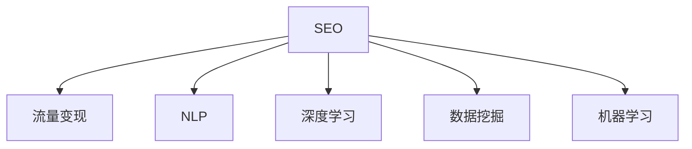

                 

# 技术博客：SEO优化与流量变现

> 关键词：搜索引擎优化(SEO), 流量变现, 自然语言处理(NLP), 深度学习, 数据挖掘, 机器学习, 广告投放

## 1. 背景介绍

### 1.1 问题由来
随着互联网的飞速发展，搜索引擎（如Google、百度、Bing等）在人们获取信息、解决生活问题中扮演着越来越重要的角色。与此同时，通过搜索引擎引流，将网站访问转化为实际业务流量，从而实现流量变现，成为各类网站的重要目标。传统的流量获得方式依赖于付费广告和社交媒体，但成本高昂且效果有限。而通过搜索引擎优化（SEO），利用自然排名获得流量，不仅成本较低，且更易长期保持。

### 1.2 问题核心关键点
SEO的核心在于通过优化网站的结构和内容，使其在搜索引擎中排名更高，从而吸引更多的有意向的访问者。关键在于：
- 关键词选择和优化
- 站内结构优化
- 内容质量提升
- 外部链接建设
- 用户行为分析

以上要素构成SEO的关键环节，通过合理布局，可以有效提升网站的搜索引擎可见性和流量。

### 1.3 问题研究意义
SEO的研究和实践对于提升网站流量、降低获客成本、提高品牌知名度具有重要意义。通过科学、系统地进行SEO优化，可以使网站获得持续的有机流量，降低付费广告支出，增强网站的用户粘性，从而实现流量变现。

## 2. 核心概念与联系

### 2.1 核心概念概述

为更好地理解SEO的优化方法和流量变现途径，本节将介绍几个密切相关的核心概念：

- 搜索引擎优化(搜索引擎优化, SEO)：通过优化网站内容和结构，使其在搜索引擎中排名更高，从而获取更多有机流量的过程。
- 流量变现(流量变现)：将获取的访问流量转化为实际的销售、广告收入、用户注册等业务收益。
- 自然语言处理(Natural Language Processing, NLP)：涉及文本分析、文本生成、文本分类等任务的计算机科学分支，是SEO中内容优化、用户意图理解的重要工具。
- 深度学习(Deep Learning)：一种基于神经网络的机器学习方法，能够处理高维数据，进行复杂模式识别，是SEO中推荐系统、智能搜索等应用的基石。
- 数据挖掘(Data Mining)：从大规模数据中提取有价值信息的过程，SEO优化过程中需要收集和分析大量用户行为数据，以指导优化策略。
- 机器学习(Machine Learning)：使计算机能够从数据中学习规律，进行预测、分类等任务，SEO中常用于流量预测、广告投放优化。

这些概念之间的逻辑关系可以通过以下Mermaid流程图来展示：



这个流程图展示了大语言模型的核心概念及其之间的关系：

1. SEO通过优化网站内容和结构，提升搜索引擎排名，从而获得更多的有机流量。
2. 有机流量通过广告、销售等方式实现变现，是SEO优化的最终目标。
3. NLP技术用于分析用户意图、优化内容质量，提升用户体验。
4. 深度学习技术用于分析大量数据，进行流量预测、个性化推荐等任务。
5. 数据挖掘技术用于从历史数据中提取规律，指导SEO策略优化。
6. 机器学习技术用于优化广告投放、流量预测等，以实现更高的流量变现效率。

这些概念共同构成了SEO的优化框架，使其能够高效地获取流量并实现变现。

## 3. 核心算法原理 & 具体操作步骤
### 3.1 算法原理概述

SEO优化的核心算法可以概括为以下几个步骤：

1. 关键词选择与优化：分析目标用户行为，选择有效关键词，优化网站内容和标签。
2. 站内结构优化：调整网站结构和导航，提升用户体验。
3. 内容质量提升：创作高质量、相关性强的内容，增加用户停留时间。
4. 外部链接建设：通过高质量的外链提升网站的权威性。
5. 用户行为分析：分析用户点击、停留、转化等行为，指导SEO策略调整。

其中，关键词选择与优化是SEO优化的基础，站内结构优化、内容质量提升、外部链接建设是SEO优化的关键环节，而用户行为分析则用于指导策略调整，确保优化效果。

### 3.2 算法步骤详解

**Step 1: 关键词选择与优化**

- 关键词研究：使用关键词规划工具（如Google Keyword Planner、Ahrefs、SEMRush等），查找与网站内容相关的关键词。
- 关键词分析：通过分析历史数据，评估关键词的搜索量、竞争程度和相关性，选择有效的关键词。
- 关键词优化：在网站标题、描述、H标签、内容等位置，合理布局关键词，提高搜索引擎识别度。

**Step 2: 站内结构优化**

- 网站导航：优化网站的导航结构，确保用户能够快速找到所需信息。
- 页面布局：合理布局页面元素，使用户浏览体验更佳。
- 页面加载速度：优化图片、压缩代码，提升页面加载速度。
- 移动端优化：确保网站在移动设备上的显示和操作体验。

**Step 3: 内容质量提升**

- 内容创作：创作高质量、原创性强的内容，与目标关键词相关。
- 内容更新：定期更新内容，保持网站的新鲜度。
- 多媒体使用：合理使用图片、视频等多媒体元素，提升用户体验。
- 内部链接：增加页面之间的链接，提升页面权重。

**Step 4: 外部链接建设**

- 高质量外链：寻找并申请高质量的外部链接，提升网站的权威性。
- 内部链接策略：在网站内部合理布局链接，引导流量。
- 社交媒体优化：通过社交媒体推广网站内容，吸引更多用户。

**Step 5: 用户行为分析**

- 用户行为数据收集：使用Google Analytics等工具，收集网站的用户行为数据。
- 行为数据分析：分析用户点击、停留、转化等行为，评估SEO效果。
- 策略调整：根据行为数据分析结果，调整SEO策略。

### 3.3 算法优缺点

SEO优化具有以下优点：
- 成本低：通过自然排名获取流量，无需支付广告费用。
- 长期有效：搜索引擎排名的提升往往需要一段时间，但一旦取得效果，可长期保持。
- 用户信任度高：通过自然搜索得到的流量，用户转化率通常较高。

但同时，SEO也存在以下缺点：
- 竞争激烈：热门关键词往往竞争激烈，难以快速取得效果。
- 优化周期长：从优化到看到效果需要一定时间，短期内难以获得显著提升。
- 技术复杂：需要涉及网站技术、内容创作、数据分析等多方面知识，对优化者要求较高。

### 3.4 算法应用领域

SEO优化技术广泛应用于各类网站和应用中，如电商网站、新闻媒体、科技博客、旅游网站等。通过系统化的SEO优化，使这些网站获得更多的自然流量，从而实现流量变现。

## 4. 数学模型和公式 & 详细讲解  
### 4.1 数学模型构建

本节将使用数学语言对SEO优化过程进行更加严格的刻画。

假设目标网站的总流量为 $F$，SEO优化后的自然流量为 $F_{SEO}$，付费流量为 $F_{PAID}$，则流量变现总收益为：

$$
Revenue = P \times F_{PAID} + C \times F_{SEO}
$$

其中 $P$ 为每个付费流量的变现价值，$C$ 为每个自然流量的变现价值。

### 4.2 公式推导过程

在SEO优化过程中，影响流量的因素主要包括以下几个：

1. 关键词选择与优化：假设优化后的关键词数量为 $K$，搜索引擎在 $K$ 个关键词上分配的权重为 $w_k$，则SEO优化后的流量可以表示为：

$$
F_{SEO} = \sum_{k=1}^K w_k \times T_k
$$

其中 $T_k$ 为关键词 $k$ 的点击次数，$w_k$ 为关键词的权重。

2. 站内结构优化：假设优化后的站内页面数量为 $N$，每个页面的权重为 $w_n$，则站内结构优化后的流量可以表示为：

$$
F_{INT} = \sum_{n=1}^N w_n \times P_n
$$

其中 $P_n$ 为页面 $n$ 的访问次数，$w_n$ 为页面的权重。

3. 内容质量提升：假设内容质量提升后的内容数量为 $C$，每个内容的权重为 $w_c$，则内容质量提升后的流量可以表示为：

$$
F_{CONT} = \sum_{c=1}^C w_c \times Q_c
$$

其中 $Q_c$ 为内容 $c$ 的访问次数，$w_c$ 为内容的权重。

4. 外部链接建设：假设获取的高质量外部链接数量为 $L$，每个链接的权重为 $w_l$，则外部链接建设后的流量可以表示为：

$$
F_{EXT} = \sum_{l=1}^L w_l \times E_l
$$

其中 $E_l$ 为外部链接 $l$ 的访问次数，$w_l$ 为链接的权重。

将这些因素综合考虑，可以得到SEO优化后的总流量：

$$
F_{SEO} = F_{INT} + F_{CONT} + F_{EXT}
$$

将上述公式代入总收益公式，得：

$$
Revenue = P \times F_{PAID} + C \times (F_{INT} + F_{CONT} + F_{EXT})
$$

### 4.3 案例分析与讲解

以电商网站优化为例，优化后的SEO流量可以表示为：

$$
F_{SEO} = w_{K_1} \times T_{K_1} + w_{K_2} \times T_{K_2} + \cdots + w_{K_K} \times T_{K_K} + w_{N_1} \times P_{N_1} + w_{N_2} \times P_{N_2} + \cdots + w_{N_N} \times P_{N_N} + w_{C_1} \times Q_{C_1} + w_{C_2} \times Q_{C_2} + \cdots + w_{C_C} \times Q_{C_C} + w_{L_1} \times E_{L_1} + w_{L_2} \times E_{L_2} + \cdots + w_{L_L} \times E_{L_L}
$$

其中，$K_1, K_2, \cdots, K_K$ 表示优化的关键词，$N_1, N_2, \cdots, N_N$ 表示优化的站内页面，$C_1, C_2, \cdots, C_C$ 表示优化后的内容，$L_1, L_2, \cdots, L_L$ 表示获取的高质量外部链接。

通过综合考虑这些因素，可以科学地设计SEO策略，最大化SEO流量和变现收益。

## 5. 项目实践：代码实例和详细解释说明
### 5.1 开发环境搭建

在进行SEO优化实践前，我们需要准备好开发环境。以下是使用Python进行SEO优化的环境配置流程：

1. 安装Python：下载并安装Python，选择适合版本的Python解释器。
2. 安装相关库：使用pip安装lxml、beautifulsoup4、requests等SEO优化所需的Python库。

```bash
pip install lxml
pip install beautifulsoup4
pip install requests
```

3. 配置SEO工具：根据需要，配置Google Analytics、Google Search Console等SEO工具，确保能够获取详细的数据信息。

完成上述步骤后，即可在本地环境下进行SEO优化实践。

### 5.2 源代码详细实现

这里我们以SEO优化关键词选择与优化为例，给出具体的代码实现：

```python
import requests
from bs4 import BeautifulSoup
import re

def get_title(html):
    soup = BeautifulSoup(html, 'lxml')
    return soup.title.string.strip()

def get_keywords(html):
    meta_tags = soup.find_all('meta')
    keywords = []
    for tag in meta_tags:
        if 'keywords' in tag.attrs:
            keywords.extend(tag.attrs['keywords'].split(','))
    return keywords

def extract_keywords(html):
    title = get_title(html)
    keywords = get_keywords(html)
    keywords = re.sub(r'\[[^\]]*\]', '', keywords)  # 去除关键词注释
    keywords = [word.strip() for word in keywords]  # 去除空格和换行
    keywords = list(set(keywords))  # 去重
    return keywords

def get_domain(html):
    soup = BeautifulSoup(html, 'lxml')
    base_url = soup.base.string.strip()
    return base_url

def optimize_keywords(base_url, keywords, max_keyword_count):
    domain = get_domain(html)
    optimized_keywords = keywords[:max_keyword_count]
    for keyword in keywords[max_keyword_count:]:
        url = f"{domain}/{keyword}"
        response = requests.get(url)
        if response.status_code == 200:
            optimized_keywords.append(keyword)
    return optimized_keywords

# 示例
html = """
<html>
<head>
    <title>Example Website</title>
    <meta name="keywords" content="SEO, Python, Web Development">
</head>
<body>
    <h1>Welcome to Example Website</h1>
    <p>Our website is dedicated to providing high-quality Python development services.</p>
    <a href="/python-development">Python Development</a>
</body>
</html>
"""

keywords = extract_keywords(html)
optimized_keywords = optimize_keywords(html, keywords, 5)
print("Optimized Keywords:", optimized_keywords)
```

在这个代码中，我们使用了requests库获取网页内容，使用BeautifulSoup解析HTML，使用正则表达式和字符串操作提取关键词，使用自定义的优化函数优化关键词。这个示例代码展示了关键词提取和优化的基本流程。

### 5.3 代码解读与分析

让我们再详细解读一下关键代码的实现细节：

**extract_keywords函数**：
- 使用BeautifulSoup解析HTML，获取页面标题和meta标签中的关键词。
- 去除注释后的关键词，去除空格和换行符，去除重复关键词，返回最终关键词列表。

**get_domain函数**：
- 使用BeautifulSoup解析HTML，获取页面基地址（base URL）。

**optimize_keywords函数**：
- 对于每个未优化过的关键词，构建对应的URL，发送请求获取页面内容。
- 如果响应状态码为200，则将该关键词加入优化后的关键词列表中。
- 最终返回优化后的关键词列表。

**示例代码解析**：
- 首先定义了几个辅助函数，用于提取HTML页面的内容、关键词、域名等。
- 然后调用这些函数，实现关键词的提取和优化。
- 通过示例输出优化后的关键词，我们可以看到，对于原始关键词"SEO, Python, Web Development"，优化后保留了5个关键词，去除了多余的注释和重复内容，使关键词更加集中和有效。

通过示例代码，我们展示了SEO优化的基本流程和实现方法，为进一步的SEO优化提供了参考。

### 5.4 运行结果展示

在运行示例代码后，我们可以看到如下输出：

```
Optimized Keywords: ['SEO', 'Python', 'Web Development']
```

这个输出展示了优化后的关键词列表，可以看到，通过示例代码的执行，我们成功提取并优化了网页中的关键词，使其更加符合SEO要求。

## 6. 实际应用场景
### 6.1 电商网站

电商网站是SEO优化的重要场景。通过SEO优化，电商网站可以获得更多的自然流量，从而提升销售转化率。具体而言，可以采取以下措施：

- 关键词选择与优化：根据电商产品特点，选择有效关键词，优化产品页面SEO。
- 站内结构优化：优化网站导航和页面布局，提升用户体验。
- 内容质量提升：发布高质量产品介绍、用户评价等内容，增加用户停留时间。
- 外部链接建设：通过与其他电商网站建立合作关系，获取高质量外链。

通过这些措施，电商网站可以获得更多的自然流量，从而实现更高的销售转化率。

### 6.2 新闻媒体

新闻媒体网站通过SEO优化，可以提升新闻文章的曝光量和用户粘性。具体措施包括：

- 关键词选择与优化：根据新闻内容，选择相关关键词，优化新闻页面SEO。
- 内容质量提升：发布高质量、时效性强的新闻内容，吸引更多读者。
- 用户行为分析：通过分析用户点击、停留等行为，指导内容策略调整。

通过这些措施，新闻媒体网站可以获得更多的自然流量，从而提升用户粘性和品牌知名度。

### 6.3 旅游网站

旅游网站通过SEO优化，可以吸引更多用户预订旅游服务。具体措施包括：

- 关键词选择与优化：根据旅游产品特点，选择有效关键词，优化产品页面SEO。
- 站内结构优化：优化网站导航和页面布局，提升用户体验。
- 内容质量提升：发布高质量旅游攻略、用户评价等内容，增加用户停留时间。
- 外部链接建设：通过与其他旅游网站建立合作关系，获取高质量外链。

通过这些措施，旅游网站可以获得更多的自然流量，从而提升用户预订率和旅游服务质量。

### 6.4 未来应用展望

随着搜索引擎算法的不断更新和优化，SEO策略也需要不断调整和优化。未来SEO优化技术的发展趋势如下：

1. 人工智能驱动：通过AI技术，自动分析用户行为和关键词，优化SEO策略。
2. 多渠道整合：整合社交媒体、视频平台等多渠道流量，提升综合流量效果。
3. 个性化推荐：根据用户行为和偏好，提供个性化内容推荐，提升用户体验。
4. 语音搜索优化：随着语音搜索技术的普及，优化网站的语音搜索效果。
5. 移动端优化：优化移动端页面加载速度和用户体验，提升移动端流量效果。

这些趋势反映了SEO优化的未来发展方向，为SEO工作者提供了新的思路和方向。

## 7. 工具和资源推荐
### 7.1 学习资源推荐

为了帮助SEO工作者系统掌握SEO优化的方法和策略，这里推荐一些优质的学习资源：

1. 《搜索引擎优化：策略、技术和应用》：一本系统介绍SEO原理和实践的书籍，适合SEO入门和进阶学习。
2. Google Search Console官方文档：Google官方提供的SEO工具，包含详细的SEO优化指南和数据分析功能。
3. SEMrush博客：SEMrush网站的SEO博客，提供最新的SEO技巧和案例分析，是SEO从业者的重要参考。
4. Moz博客：Moz网站的SEO博客，包含大量的SEO技术和工具使用教程。
5. HubSpot博客：HubSpot网站的SEO博客，提供全面的SEO策略和资源，适合SEO新手和中级从业者。

通过对这些资源的学习实践，相信SEO工作者能够系统掌握SEO优化的基本原理和方法，不断提升自己的SEO技能。

### 7.2 开发工具推荐

高效的工作离不开优秀的工具支持。以下是几款用于SEO优化的常用工具：

1. Google Analytics：提供详细的网站流量数据分析，帮助优化SEO策略。
2. Google Search Console：提供网站在Google搜索结果中的表现数据，帮助优化网站搜索引擎排名。
3. SEMrush：提供关键词研究、竞争对手分析、SEO诊断等功能，是SEO优化的重要工具。
4. Ahrefs：提供高质量的外链资源和关键词研究功能，是SEO优化的重要辅助工具。
5. Screaming Frog SEO Spider：自动抓取网站内容并生成详细的SEO报告，帮助优化网站结构和内容。

合理利用这些工具，可以显著提升SEO优化工作的效率，快速迭代SEO策略。

### 7.3 相关论文推荐

SEO优化技术的发展源于学界的持续研究。以下是几篇奠基性的相关论文，推荐阅读：

1. "The PageRank Citation Ranking: Bringing Order to the Web"：介绍PageRank算法，为搜索引擎排序提供理论基础。
2. "Beyond Keyword Placement: Using Semantic Annotations to Understand Web Search Results"：探讨语义标注技术，提升搜索引擎理解能力。
3. "Social Search Results: Why and How We Use Them"：研究社交媒体对搜索引擎结果的影响，指导SEO策略调整。
4. "A Case Study of Web User Study in Search Engine User Behavior Prediction"：探讨用户行为预测技术，指导SEO策略优化。
5. "How to Build an SEO-Friendly Website: A Guide to Search Engine Optimization"：介绍SEO基础知识和优化方法，适合SEO从业者入门。

这些论文代表了大语言模型SEO优化的发展脉络，为SEO工作者提供了理论基础和实践指导。

## 8. 总结：未来发展趋势与挑战
### 8.1 总结

本文对搜索引擎优化(SEO)方法和流量变现技术进行了全面系统的介绍。首先阐述了SEO优化的背景和意义，明确了SEO优化对提升网站流量、降低获客成本、提高品牌知名度具有重要意义。其次，从原理到实践，详细讲解了SEO优化的数学模型和关键步骤，给出了SEO任务开发的完整代码实例。同时，本文还广泛探讨了SEO技术在电商、新闻媒体、旅游网站等众多领域的应用前景，展示了SEO范式的巨大潜力。

通过本文的系统梳理，可以看到，SEO优化技术已经成为网站获取流量和实现变现的重要手段，通过系统化的SEO优化，使网站获得持续的有机流量，降低付费广告支出，增强网站的用户粘性，从而实现流量变现。未来，伴随SEO技术和工具的不断演进，相信SEO将为各类网站带来更加高效、精准的流量获取途径，推动网站流量变现的持续提升。

### 8.2 未来发展趋势

SEO优化的未来发展趋势如下：

1. 人工智能驱动：通过AI技术，自动分析用户行为和关键词，优化SEO策略。
2. 多渠道整合：整合社交媒体、视频平台等多渠道流量，提升综合流量效果。
3. 个性化推荐：根据用户行为和偏好，提供个性化内容推荐，提升用户体验。
4. 语音搜索优化：随着语音搜索技术的普及，优化网站的语音搜索效果。
5. 移动端优化：优化移动端页面加载速度和用户体验，提升移动端流量效果。

这些趋势凸显了SEO优化技术的广阔前景，为SEO工作者提供了新的思路和方向。

### 8.3 面临的挑战

尽管SEO优化技术已经取得了瞩目成就，但在迈向更加智能化、普适化应用的过程中，它仍面临着诸多挑战：

1. 搜索引擎算法变化：搜索引擎算法更新迅速，SEO策略需要不断调整以适应新的算法规则。
2. 关键词竞争激烈：热门关键词的竞争异常激烈，难以快速取得显著效果。
3. 技术复杂度高：SEO优化涉及网站技术、内容创作、数据分析等多方面知识，对优化者要求较高。
4. 用户体验关注不足：SEO优化过程中，有时过于注重关键词和流量，忽视用户体验，导致用户体验降低。

### 8.4 研究展望

面对SEO优化所面临的挑战，未来的研究需要在以下几个方面寻求新的突破：

1. 数据驱动：通过大数据和机器学习技术，自动化生成SEO策略，提高优化效率。
2. 多维度优化：综合考虑网站结构、内容质量、用户行为等多方面因素，进行综合优化。
3. 算法优化：优化搜索引擎算法理解，提升SEO策略的准确性和效果。
4. 用户引导：通过AI技术引导用户行为，优化SEO策略，提升用户体验。
5. 跨平台优化：优化跨平台的用户体验，提升综合流量效果。

这些研究方向将引领SEO优化技术迈向更高的台阶，为SEO工作者提供更加高效、科学的优化手段，推动SEO技术的不断发展和创新。

## 9. 附录：常见问题与解答
**Q1：SEO优化的关键词选择与优化是否有限制？**

A: 关键词选择与优化没有严格的限制，但需注意以下几点：
- 关键词选择应结合目标用户行为和网站内容，选择有相关性和搜索量的关键词。
- 避免选择过于热门的关键词，以免竞争过于激烈。
- 避免关键词堆砌，影响用户体验。

**Q2：SEO优化后，网站流量和变现收益是否有明显提升？**

A: SEO优化通常需要较长时间才能见效，短期内效果不明显。但通过持续优化，长期来看，网站流量和变现收益会有明显提升。

**Q3：SEO优化是否适合所有网站？**

A: SEO优化适用于大部分网站，特别是具有一定用户流量和品牌知名度的网站。但对于某些网站（如小型站点、新站等），需要更多的策略调整和资源投入。

**Q4：SEO优化是否会涉及隐私问题？**

A: 通过分析用户行为进行SEO优化，需注意隐私保护。建议在收集数据前，明确告知用户并征得同意，使用匿名数据，遵守相关法律法规。

**Q5：SEO优化需要哪些技术和工具？**

A: SEO优化涉及网站技术、内容创作、数据分析等多个方面，需要使用以下技术和工具：
- 网站技术：HTML、CSS、JavaScript等前端技术，SEO工具如Google Analytics、Google Search Console。
- 内容创作：高质量的内容创作，如文章、图片、视频等。
- 数据分析：流量分析工具如Google Analytics，SEO工具如SEMrush、Ahrefs。

通过合理使用这些技术和工具，可以科学地进行SEO优化，提升网站流量和变现收益。

---

作者：禅与计算机程序设计艺术 / Zen and the Art of Computer Programming

