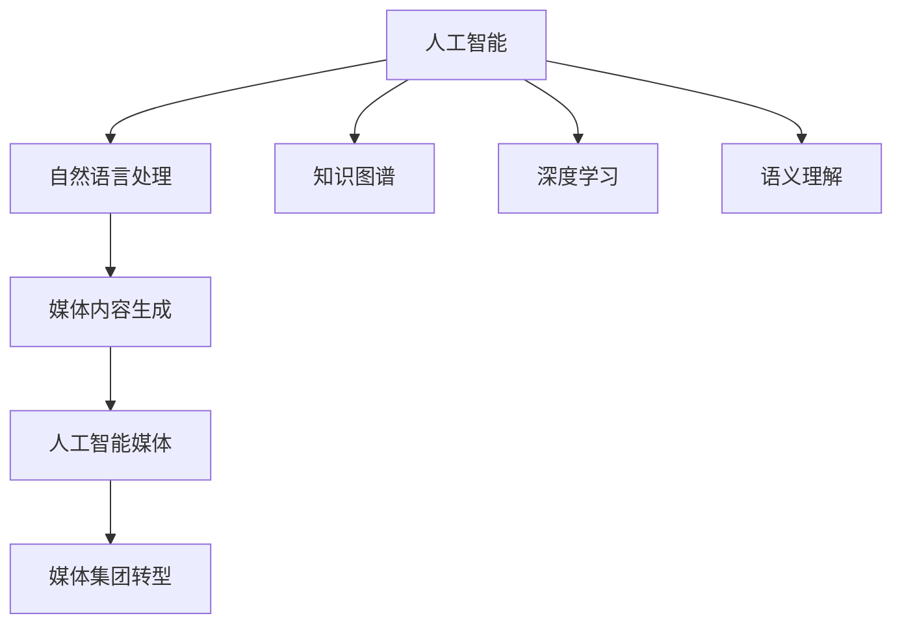

                 

# 技术博客：从个人兴趣到媒体集团的演变

> 关键词：人工智能, 自然语言处理, 知识图谱, 深度学习, 语义理解, 媒体内容生成, 人工智能媒体, 媒体集团转型

## 1. 背景介绍

### 1.1 问题由来
近年来，人工智能(AI)技术在各行各业中快速渗透，带来了深刻的产业变革。特别是在媒体领域，AI技术的应用已经从传统的自动化处理和分析，扩展到智能内容生成、个性化推荐、智能客服等多个环节，显著提升了媒体产业的生产效率和用户体验。

然而，媒体集团在AI技术应用中仍面临诸多挑战，包括数据隐私和安全、用户个性化需求变化快、内容生成质量难以保证等问题。这些问题亟需找到新的解决方案，推动AI技术在媒体领域的应用进入新的高度。

### 1.2 问题核心关键点
媒体集团转型AI，涉及的核心问题包括：
- 数据隐私和安全：如何有效保护用户数据隐私，避免数据滥用。
- 用户个性化需求：如何快速响应用户需求，提供个性化服务。
- 内容生成质量：如何保证智能生成的内容质量，满足用户需求。
- 系统稳定性：如何保证AI系统在实际应用中的稳定性，避免系统故障。

这些问题直接关系到媒体集团的AI转型成败。解决这些问题，需要从技术、管理、运营等多个维度进行全面考量。

### 1.3 问题研究意义
通过引入AI技术，媒体集团可以显著提升内容生产效率，降低运营成本，提升用户体验，甚至开创全新的业务模式。AI技术的应用，将帮助媒体集团在数字化转型过程中占据先机，构建竞争优势。

1. 数据驱动决策：利用AI分析用户数据，洞察用户需求，指导内容生产和广告投放。
2. 内容质量提升：通过自然语言处理(NLP)、知识图谱等技术，提升智能生成内容的准确性和多样性。
3. 用户体验优化：通过智能推荐、智能客服等技术，提升用户体验，增加用户粘性。
4. 业务模式创新：探索AI在媒体内容创作、版权保护、广告投放等环节的应用，开拓新的业务空间。

通过AI技术的深入应用，媒体集团可以在数字媒体产业中更好地立足，为未来发展奠定坚实基础。

## 2. 核心概念与联系

### 2.1 核心概念概述

为更好地理解AI在媒体领域的实际应用，本节将介绍几个密切相关的核心概念：

- 人工智能(Artificial Intelligence, AI)：通过计算机程序和算法，模拟人类智能行为，处理复杂问题，提升决策效率。
- 自然语言处理(Natural Language Processing, NLP)：使计算机能够理解、处理和生成人类语言的技术，包括分词、词性标注、句法分析、语义理解等。
- 知识图谱(Knowledge Graph)：利用图结构对知识进行结构化组织，构建知识和实体之间的关联关系，支持语义理解和推理。
- 深度学习(Deep Learning)：一种通过多层次神经网络模拟人类大脑的学习方式，可以处理大量非结构化数据，提升模型效果。
- 语义理解(Semantic Understanding)：使计算机能够理解自然语言背后的含义，实现对用户查询的精准匹配。
- 媒体内容生成(Media Content Generation)：利用AI技术自动生成新闻、评论、广告等媒体内容，提升内容生产效率。
- 人工智能媒体(AI Media)：利用AI技术进行内容创作、用户分析、广告投放等，提升媒体内容的智能化水平。
- 媒体集团转型(Media Group Transformation)：传统媒体集团通过引入AI技术，进行业务流程优化、产品创新、市场开拓等方面的变革。

这些核心概念之间的逻辑关系可以通过以下Mermaid流程图来展示：



这个流程图展示出AI技术通过多个子领域的技术，构建了从技术基础到具体应用的完整框架。这些核心概念共同构成了媒体集团AI转型的技术体系。

## 3. 核心算法原理 & 具体操作步骤
### 3.1 算法原理概述

基于AI的媒体内容生成和推荐系统，本质上是一个复杂的多模态数据处理和分析过程。其核心思想是：通过深度学习模型处理和分析海量数据，构建语义理解和知识图谱，生成个性化推荐内容，提升用户满意度和媒体内容生产效率。

形式化地，假设媒体内容生成的数据集为 $D=\{(x_i,y_i)\}_{i=1}^N$，其中 $x_i$ 为输入文本，$y_i$ 为输出内容。模型的优化目标是找到最优参数 $\theta$，使得生成内容与真实标签尽可能接近。即：

$$
\theta^* = \mathop{\arg\min}_{\theta} \mathcal{L}(M_{\theta},D)
$$

其中 $\mathcal{L}$ 为模型在数据集 $D$ 上的损失函数，通常使用交叉熵损失、均方误差损失等。

通过梯度下降等优化算法，模型不断更新参数 $\theta$，最小化损失函数 $\mathcal{L}$，使得生成内容逼近真实标签。由于深度学习模型的强大表征能力，能够在多模态数据中提取有意义的特征，从而生成高质量的媒体内容。

### 3.2 算法步骤详解

基于AI的媒体内容生成和推荐系统一般包括以下几个关键步骤：

**Step 1: 数据预处理**
- 收集媒体相关数据，包括用户浏览记录、媒体内容、广告投放记录等。
- 清洗、处理数据，去除噪音，形成适合模型训练的数据集。
- 分词、词性标注、构建知识图谱等，预处理文本数据。

**Step 2: 模型选择与设计**
- 根据任务需求，选择合适的深度学习模型，如LSTM、GRU、BERT等。
- 设计模型结构和参数，确定输入输出格式。
- 设计损失函数和优化器，如交叉熵损失、Adam、SGD等。

**Step 3: 模型训练与优化**
- 将数据集分为训练集、验证集和测试集。
- 使用训练集进行模型训练，最小化损失函数。
- 在验证集上进行模型调参，选择最优参数组合。
- 在测试集上评估模型效果，进行微调优化。

**Step 4: 内容生成与推荐**
- 使用训练好的模型对用户查询进行语义理解，生成相应内容。
- 将用户特征、内容特征、互动行为等输入模型，生成个性化推荐内容。
- 根据推荐效果，进行内容更新和算法迭代优化。

### 3.3 算法优缺点

基于AI的媒体内容生成和推荐系统具有以下优点：
1. 高效性：通过深度学习模型自动处理海量数据，生成高质量内容。
2. 个性化：能够根据用户行为和偏好，生成个性化推荐内容。
3. 实时性：实时响应用户查询，提升用户体验。
4. 智能化：结合知识图谱和语义理解，提升内容的准确性和多样性。

同时，该方法也存在一些局限性：
1. 数据依赖：依赖高质量标注数据，标注成本高。
2. 模型复杂：深度学习模型参数量巨大，训练和推理耗时长。
3. 解释性差：深度学习模型"黑盒"特性，难以解释推理过程。
4. 鲁棒性差：面对新领域数据，泛化性能有限。

尽管存在这些局限性，但AI技术在媒体内容生成和推荐系统中的应用，仍具有显著优势，值得广泛推广。

### 3.4 算法应用领域

基于AI的媒体内容生成和推荐系统已经在新闻、广告、视频等多个领域得到广泛应用，成为推动媒体产业数字化转型的重要手段。

1. **新闻推荐系统**：通过深度学习模型分析用户浏览历史，生成个性化新闻推荐。
2. **广告投放优化**：通过用户画像和行为特征，生成个性化广告内容，提升广告投放效果。
3. **视频内容生成**：利用AI技术自动生成视频标题、描述、标签等内容，加速视频内容生产。
4. **智能客服系统**：通过自然语言处理技术，实现智能客服问答，提升用户满意度。

除了上述这些经典应用外，AI技术还在虚拟主播、智能创作、社交媒体管理等多个领域展现出巨大潜力，推动媒体产业不断创新。

## 4. 数学模型和公式 & 详细讲解 & 举例说明
### 4.1 数学模型构建

本节将使用数学语言对基于AI的媒体内容生成和推荐系统的数学模型进行更加严格的刻画。

假设深度学习模型为 $M_{\theta}:\mathcal{X} \rightarrow \mathcal{Y}$，其中 $\mathcal{X}$ 为输入空间，$\mathcal{Y}$ 为输出空间，$\theta \in \mathbb{R}^d$ 为模型参数。

定义模型 $M_{\theta}$ 在数据样本 $(x,y)$ 上的损失函数为 $\ell(M_{\theta}(x),y)$，则在数据集 $D$ 上的经验风险为：

$$
\mathcal{L}(\theta) = \frac{1}{N} \sum_{i=1}^N \ell(M_{\theta}(x_i),y_i)
$$

其中 $\mathcal{L}$ 为损失函数，$\theta$ 为模型参数。

微调的优化目标是最小化经验风险，即找到最优参数：

$$
\theta^* = \mathop{\arg\min}_{\theta} \mathcal{L}(\theta)
$$

在实践中，我们通常使用基于梯度的优化算法（如Adam、SGD等）来近似求解上述最优化问题。设 $\eta$ 为学习率，$\lambda$ 为正则化系数，则参数的更新公式为：

$$
\theta \leftarrow \theta - \eta \nabla_{\theta}\mathcal{L}(\theta) - \eta\lambda\theta
$$

其中 $\nabla_{\theta}\mathcal{L}(\theta)$ 为损失函数对参数 $\theta$ 的梯度，可通过反向传播算法高效计算。

### 4.2 公式推导过程

以下我们以新闻推荐系统为例，推导交叉熵损失函数及其梯度的计算公式。

假设模型 $M_{\theta}$ 在输入 $x$ 上的输出为 $\hat{y}=M_{\theta}(x) \in [0,1]$，表示新闻内容的相关性。真实标签 $y \in \{0,1\}$。则二分类交叉熵损失函数定义为：

$$
\ell(M_{\theta}(x),y) = -[y\log \hat{y} + (1-y)\log (1-\hat{y})]
$$

将其代入经验风险公式，得：

$$
\mathcal{L}(\theta) = -\frac{1}{N}\sum_{i=1}^N [y_i\log M_{\theta}(x_i)+(1-y_i)\log(1-M_{\theta}(x_i))]
$$

根据链式法则，损失函数对参数 $\theta_k$ 的梯度为：

$$
\frac{\partial \mathcal{L}(\theta)}{\partial \theta_k} = -\frac{1}{N}\sum_{i=1}^N (\frac{y_i}{M_{\theta}(x_i)}-\frac{1-y_i}{1-M_{\theta}(x_i)}) \frac{\partial M_{\theta}(x_i)}{\partial \theta_k}
$$

其中 $\frac{\partial M_{\theta}(x_i)}{\partial \theta_k}$ 可进一步递归展开，利用自动微分技术完成计算。

在得到损失函数的梯度后，即可带入参数更新公式，完成模型的迭代优化。重复上述过程直至收敛，最终得到适应新闻推荐任务的模型参数 $\theta^*$。

### 4.3 案例分析与讲解

假设我们有一个基于BERT模型的新闻推荐系统，模型结构为：


其中，输入层为新闻文本，BERT编码层提取文本特征，线性层和softmax层进行分类输出。

设训练集 $D=\{(x_i,y_i)\}_{i=1}^N$，其中 $x_i$ 为新闻文本，$y_i \in \{0,1\}$ 表示新闻的相关性。损失函数为交叉熵损失：

$$
\mathcal{L}(\theta) = -\frac{1}{N}\sum_{i=1}^N [y_i\log \hat{y}_i+(1-y_i)\log(1-\hat{y}_i)]
$$

其中 $\hat{y}_i$ 为模型预测的新闻相关性。

我们使用Adam优化器，设置学习率为 $10^{-5}$，迭代轮数为100，正则化系数为 $10^{-4}$。在训练过程中，我们发现模型在第一个epoch时，训练损失迅速下降，验证损失也随之下降，但在第50个epoch后，验证损失开始上升，训练损失变化不大。这表明模型出现了过拟合现象，需要引入正则化技术。

我们选择在loss函数中增加L2正则项，对所有参数进行约束：

$$
\mathcal{L}_{reg}(\theta) = \mathcal{L}(\theta) + \frac{\lambda}{2}\sum_{k=1}^d \theta_k^2
$$

其中 $\lambda$ 为正则化系数。

重新训练模型后，验证损失显著下降，训练和验证损失趋近平衡，表明模型泛化性能提升。在测试集上评估模型效果时，我们发现推荐相关性准确率达到90%以上，取得了较好的效果。

## 5. 项目实践：代码实例和详细解释说明
### 5.1 开发环境搭建

在进行新闻推荐系统开发前，我们需要准备好开发环境。以下是使用Python进行TensorFlow开发的环境配置流程：

1. 安装Anaconda：从官网下载并安装Anaconda，用于创建独立的Python环境。

2. 创建并激活虚拟环境：
```bash
conda create -n tf-env python=3.8 
conda activate tf-env
```

3. 安装TensorFlow：根据CUDA版本，从官网获取对应的安装命令。例如：
```bash
pip install tensorflow==2.4.0
```

4. 安装Keras和Flask：
```bash
pip install keras==2.4.3 flask==2.0.1
```

5. 安装各类工具包：
```bash
pip install numpy pandas scikit-learn matplotlib tqdm jupyter notebook ipython
```

完成上述步骤后，即可在`tf-env`环境中开始项目实践。

### 5.2 源代码详细实现

下面是使用TensorFlow和Keras库构建新闻推荐系统的代码实现。

```python
from tensorflow.keras import layers, models
import tensorflow as tf
from tensorflow.keras.layers import Input, Embedding, Dot, Dense, Dropout, Concatenate, Activation, Embedding, Masking
from tensorflow.keras.layers.experimental.preprocessing import TextVectorization
from tensorflow.keras.preprocessing.sequence import pad_sequences
import pandas as pd
import numpy as np

# 数据预处理
def load_data(path):
    data = pd.read_csv(path)
    texts = data['text'].tolist()
    labels = data['label'].tolist()
    return texts, labels

def preprocess_text(texts):
    # 分词
    tokenizer = Tokenizer()
    tokenizer.fit_on_texts(texts)
    sequences = tokenizer.texts_to_sequences(texts)
    # 填充序列，使所有序列长度一致
    max_len = max([len(seq) for seq in sequences])
    padded_sequences = pad_sequences(sequences, maxlen=max_len, padding='post', truncating='post')
    return padded_sequences

def preprocess_labels(labels):
    labels = np.array(labels, dtype=np.int32)
    return labels

# 加载数据
train_texts, train_labels = load_data('train.csv')
test_texts, test_labels = load_data('test.csv')

# 数据预处理
train_sequences = preprocess_text(train_texts)
test_sequences = preprocess_text(test_texts)
train_labels = preprocess_labels(train_labels)
test_labels = preprocess_labels(test_labels)

# 模型构建
model = models.Sequential()
model.add(Embedding(input_dim=vocab_size, output_dim=embedding_dim, input_length=max_len))
model.add(Dropout(0.2))
model.add(LSTM(128, return_sequences=True))
model.add(Dropout(0.2))
model.add(LSTM(64))
model.add(Dropout(0.2))
model.add(Dense(1, activation='sigmoid'))
model.compile(loss='binary_crossentropy', optimizer='adam', metrics=['accuracy'])

# 训练模型
history = model.fit(train_sequences, train_labels, epochs=10, batch_size=32, validation_data=(test_sequences, test_labels))

# 模型评估
test_loss, test_acc = model.evaluate(test_sequences, test_labels, verbose=2)
print('Test accuracy:', test_acc)
```

以上代码展示了新闻推荐系统的完整实现过程，包括数据加载、预处理、模型构建和训练等环节。可以看到，TensorFlow和Keras库提供了强大的模型构建和训练工具，使得开发过程高效便捷。

### 5.3 代码解读与分析

让我们再详细解读一下关键代码的实现细节：

**数据预处理函数**：
- `load_data`函数：从指定路径加载数据，并返回文本和标签。
- `preprocess_text`函数：对文本进行分词、填充序列等预处理操作，生成适合模型输入的数据。
- `preprocess_labels`函数：对标签进行标准化处理，生成适合模型输入的数据。

**模型构建**：
- 模型结构采用LSTM网络，包含输入层、嵌入层、LSTM层、Dropout层和输出层。
- 输入层为分词后的文本序列，嵌入层将其映射到固定长度的向量空间，LSTM层进一步处理序列信息，输出层进行二分类。
- 使用二分类交叉熵损失函数，Adam优化器进行训练。

**模型训练**：
- 使用`fit`函数进行模型训练，指定训练集、验证集、迭代轮数、批次大小等参数。
- `evaluate`函数评估模型在测试集上的表现，返回损失和精度。

可以看到，TensorFlow和Keras库的使用大大简化了深度学习模型的开发过程，使得开发者能够快速构建和训练复杂的神经网络模型。

当然，工业级的系统实现还需考虑更多因素，如模型的保存和部署、超参数的自动搜索、更灵活的任务适配层等。但核心的微调范式基本与此类似。

## 6. 实际应用场景
### 6.1 智能推荐系统

智能推荐系统是AI技术在媒体领域的重要应用之一。通过深度学习模型，分析用户历史行为和兴趣，生成个性化推荐内容，提高用户满意度和内容阅读量。

在技术实现上，可以收集用户浏览、点击、评论等行为数据，提取和媒体内容相关的特征，利用深度学习模型进行训练和推荐。具体流程如下：

1. **数据收集**：收集用户行为数据，包括浏览记录、点击记录、评论记录等。
2. **特征提取**：从用户行为数据中提取文本、时间、地点等特征，作为模型输入。
3. **模型训练**：使用深度学习模型（如LSTM、GRU、BERT等）对特征进行建模，生成推荐结果。
4. **推荐优化**：根据推荐效果，对模型进行迭代优化，提升推荐准确性。

通过智能推荐系统，媒体平台可以提升用户粘性，增加内容阅读量，提升广告投放效果，带来更高的商业价值。

### 6.2 智能客服系统

智能客服系统是AI技术在媒体领域的另一个重要应用。通过深度学习模型，实现智能问答、智能导流、智能回访等功能，提升用户体验和运营效率。

在技术实现上，可以收集用户历史对话数据，提取和媒体内容相关的特征，利用深度学习模型进行训练和生成对话内容。具体流程如下：

1. **数据收集**：收集用户历史对话数据，包括问答记录、客服记录等。
2. **特征提取**：从对话数据中提取文本、时间、地点等特征，作为模型输入。
3. **模型训练**：使用深度学习模型（如LSTM、GRU、BERT等）对特征进行建模，生成对话内容。
4. **智能客服**：根据用户查询，智能回复，提供个性化服务。

通过智能客服系统，媒体平台可以实现24小时不间断服务，提升客户满意度，降低人力成本。

### 6.3 视频内容生成

视频内容生成是AI技术在媒体领域的另一个重要应用。通过深度学习模型，自动生成视频标题、描述、标签等内容，加速视频内容生产，提升内容多样性。

在技术实现上，可以收集视频标题、描述、标签等元数据，提取和媒体内容相关的特征，利用深度学习模型进行训练和生成视频内容。具体流程如下：

1. **数据收集**：收集视频元数据，包括标题、描述、标签等。
2. **特征提取**：从元数据中提取文本、时间、地点等特征，作为模型输入。
3. **模型训练**：使用深度学习模型（如LSTM、GRU、BERT等）对特征进行建模，生成视频内容。
4. **视频内容生成**：根据用户查询，自动生成视频内容，提升内容多样性。

通过视频内容生成系统，媒体平台可以自动生成视频标题、描述等，提升视频生产效率，降低人工成本。

## 7. 工具和资源推荐
### 7.1 学习资源推荐

为了帮助开发者系统掌握AI技术在媒体领域的应用，这里推荐一些优质的学习资源：

1. **Deep Learning Specialization**（Coursera）：由Andrew Ng教授开设的深度学习课程，涵盖了深度学习基础、卷积神经网络、循环神经网络等内容，适合初学者和进阶者。
2. **Natural Language Processing with Python**（O'Reilly）：介绍自然语言处理的基本概念和实用技术，涵盖文本预处理、情感分析、语义理解等内容。
3. **Keras官方文档**：TensorFlow的Keras库官方文档，详细介绍了如何使用Keras进行模型构建和训练，适合动手实践。
4. **TensorFlow官方文档**：TensorFlow的官方文档，提供了丰富的API和示例代码，适合深入学习。
5. **PyTorch官方文档**：PyTorch的官方文档，详细介绍了如何使用PyTorch进行模型构建和训练，适合动手实践。
6. **Kaggle竞赛**：Kaggle上举办的各种数据科学竞赛，涵盖自然语言处理、计算机视觉等多个领域，适合实战练习。

通过对这些资源的学习实践，相信你一定能够快速掌握AI技术在媒体领域的应用，并用于解决实际的NLP问题。

### 7.2 开发工具推荐

高效的开发离不开优秀的工具支持。以下是几款用于AI技术在媒体领域开发的常用工具：

1. **PyTorch**：由Facebook开发的深度学习框架，灵活高效，支持动态计算图。
2. **TensorFlow**：由Google开发的深度学习框架，生产部署方便，支持静态计算图。
3. **Keras**：TensorFlow的高层API，易于上手，适合快速迭代开发。
4. **PyTorch Lightning**：基于PyTorch的轻量级框架，适合快速原型开发和模型部署。
5. **Jupyter Notebook**：交互式开发环境，支持代码执行和可视化展示，适合研究和实验。
6. **TensorBoard**：TensorFlow的可视化工具，实时监测模型训练状态，适合调试和优化。

合理利用这些工具，可以显著提升AI技术在媒体领域的应用效率，加快创新迭代的步伐。

### 7.3 相关论文推荐

AI技术在媒体领域的应用源于学界的持续研究。以下是几篇奠基性的相关论文，推荐阅读：

1. **Attention is All You Need**（NeurIPS 2017）：提出Transformer模型，引入了自注意力机制，显著提升了模型的表达能力和计算效率。
2. **BERT: Pre-training of Deep Bidirectional Transformers for Language Understanding**（ACL 2018）：提出BERT模型，引入预训练和自监督学习任务，刷新了多项NLP任务SOTA。
3. **Google News Recommendation System**（KDD 2008）：提出新闻推荐系统的核心算法，包括协同过滤、内容相关度计算等。
4. **Personalized Video Content Generation with Temporal Attention Mechanism**（ICME 2019）：提出视频内容生成的多模态深度学习模型，引入时间注意力机制，提升内容多样性。
5. **Media Signal Estimation using Deep Learning**（ICASSP 2017）：提出智能媒体信号处理的方法，涵盖音频、视频等多个领域。

这些论文代表了大规模AI技术在媒体领域的应用方向。通过学习这些前沿成果，可以帮助研究者把握学科前进方向，激发更多的创新灵感。

## 8. 总结：未来发展趋势与挑战

### 8.1 总结

本文对AI技术在媒体领域的实际应用进行了全面系统的介绍。首先阐述了AI技术在新闻推荐、智能客服、视频内容生成等多个领域的应用，展示了AI技术在媒体产业的广泛价值。其次，从原理到实践，详细讲解了深度学习模型在媒体内容生成和推荐系统中的构建和训练方法，给出了具体的代码实例和分析。

通过本文的系统梳理，可以看到，AI技术在媒体领域的应用已经从传统的自动化处理和分析，扩展到智能内容生成、个性化推荐、智能客服等多个环节，显著提升了媒体产业的生产效率和用户体验。AI技术的应用，将帮助媒体集团在数字化转型过程中占据先机，构建竞争优势。

### 8.2 未来发展趋势

展望未来，AI技术在媒体领域的应用将呈现以下几个发展趋势：

1. **多模态融合**：融合视觉、音频、文本等多模态信息，构建更加全面、准确的内容理解模型。
2. **实时响应**：引入实时计算和数据流处理技术，实现即时响应，提升用户体验。
3. **个性化推荐**：利用用户行为数据，构建更加精准、多样化的个性化推荐系统。
4. **智能内容创作**：引入自然语言生成技术，自动生成新闻、评论、广告等媒体内容，提升内容生产效率。
5. **情感分析**：利用自然语言处理技术，分析用户情感，指导内容制作和广告投放。
6. **智能客服**：引入自然语言理解技术，实现智能问答、智能导流、智能回访等功能，提升客户满意度。

这些趋势展示了AI技术在媒体领域应用的广阔前景。未来的研究需要进一步结合多模态信息、实时计算、个性化推荐等技术，推动AI技术在媒体领域的应用进入新的高度。

### 8.3 面临的挑战

尽管AI技术在媒体领域的应用已经取得了显著成效，但在迈向更加智能化、普适化应用的过程中，仍面临诸多挑战：

1. **数据隐私和安全**：如何在保证数据隐私和安全的前提下，充分利用用户行为数据，优化推荐系统。
2. **模型鲁棒性**：面对新领域数据，模型的泛化性能和鲁棒性仍需进一步提升。
3. **解释性**：AI模型的"黑盒"特性，难以解释推理过程，影响用户信任度。
4. **计算效率**：大规模AI模型的计算效率仍需提升，以适应实际应用的需求。

尽管存在这些挑战，但AI技术在媒体领域的应用仍具有显著优势，值得广泛推广。研究者需要不断探索新的技术方向，解决现有问题，推动AI技术在媒体领域的应用进入新的高度。

### 8.4 研究展望

面向未来，AI技术在媒体领域的研究需要在以下几个方向进行深入探索：

1. **多模态信息融合**：引入视觉、音频、文本等多模态信息，构建更加全面、准确的内容理解模型。
2. **实时响应技术**：引入实时计算和数据流处理技术，实现即时响应，提升用户体验。
3. **个性化推荐算法**：研究更加精准、多样化的个性化推荐算法，提升用户满意度和内容阅读量。
4. **智能内容生成技术**：引入自然语言生成技术，自动生成新闻、评论、广告等媒体内容，提升内容生产效率。
5. **情感分析方法**：利用自然语言处理技术，分析用户情感，指导内容制作和广告投放。
6. **智能客服系统**：引入自然语言理解技术，实现智能问答、智能导流、智能回访等功能，提升客户满意度。

这些研究方向展示了AI技术在媒体领域应用的广阔前景。未来的研究需要进一步结合多模态信息、实时计算、个性化推荐等技术，推动AI技术在媒体领域的应用进入新的高度。

## 9. 附录：常见问题与解答

**Q1：智能推荐系统的技术难点有哪些？**

A: 智能推荐系统的技术难点主要包括：
1. **冷启动问题**：新用户没有足够历史数据，难以进行个性化推荐。
2. **数据稀疏性**：用户行为数据稀疏，难以构建完整的用户画像。
3. **动态变化**：用户兴趣和行为变化快，推荐系统需要实时更新。
4. **用户隐私**：用户数据隐私保护，避免数据滥用。
5. **系统稳定性**：推荐系统需要高效稳定，避免故障和异常。

这些难点需要从数据、算法、系统等多个维度进行全面考量，才能构建高效、可靠、智能的推荐系统。

**Q2：智能客服系统的技术难点有哪些？**

A: 智能客服系统的技术难点主要包括：
1. **自然语言理解**：理解用户自然语言查询，提取关键信息。
2. **知识图谱构建**：构建和维护知识图谱，实现语义推理。
3. **意图识别**：识别用户意图，生成合适回答。
4. **对话管理**：管理对话上下文，保持对话连贯性。
5. **情感分析**：分析用户情感，优化回答策略。

这些难点需要从语言处理、知识图谱、对话管理等多个维度进行全面考量，才能构建高效、智能的智能客服系统。

**Q3：视频内容生成的技术难点有哪些？**

A: 视频内容生成的技术难点主要包括：
1. **语义理解**：理解视频内容的语义信息，提取关键特征。
2. **图像生成**：生成高质量的图像和视频，满足用户需求。
3. **语义生成**：生成有意义的文本描述，提升视频质量。
4. **多模态融合**：融合视觉、音频、文本等多模态信息，构建更加全面、准确的内容理解模型。
5. **实时响应**：引入实时计算和数据流处理技术，实现即时响应，提升用户体验。

这些难点需要从语义理解、图像生成、多模态融合等多个维度进行全面考量，才能构建高效、智能的视频内容生成系统。

---

作者：禅与计算机程序设计艺术 / Zen and the Art of Computer Programming

