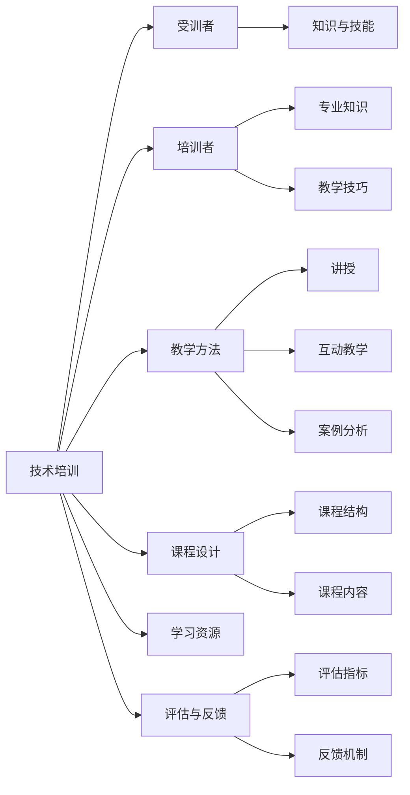

                 

# 技术培训：从受训者到培训者

> 关键词：技术培训, 技能提升, 培训者, 受训者, 教学方法, 课程设计, 学习资源, 评估与反馈

## 1. 背景介绍

### 1.1 问题由来

随着科技的飞速发展和各行各业对技术人才的需求不断增加，技术培训已经成为提升员工技能、适应新技术的关键环节。然而，传统的技术培训模式往往存在效率低、参与度差、效果不佳等问题。技术的快速发展要求我们必须改革和创新技术培训方法，以适应新的技术趋势和市场需求。

### 1.2 问题核心关键点

技术培训的核心在于如何将技术知识和技能有效传递给受训者，使他们能够快速掌握并应用到实际工作中。因此，关键问题包括以下几点：

- 培训目标的明确性：确定培训的具体目标和预期成果。
- 培训内容的选择与组织：根据目标选择和设计合适的培训内容，并合理组织。
- 培训方法的适用性：选择适合受训者的培训方法，提高学习效果。
- 培训效果的评估与反馈：建立科学的评估体系，及时反馈受训者的学习进度和效果。
- 培训者的专业性与教学技巧：确保培训者具备相应的专业知识和教学技巧，能够高效地传递知识。

## 2. 核心概念与联系

### 2.1 核心概念概述

为了更好地理解技术培训方法，我们首先需要明确一些核心概念：

- **技术培训（Technical Training）**：旨在提升受训者技术技能和知识水平，使其能够胜任相关工作。
- **受训者（Learner）**：参与技术培训的个人或团队，是培训的最终受益者。
- **培训者（Trainer）**：负责设计和实施培训课程的专业人员，是知识传递的关键角色。
- **教学方法（Teaching Methods）**：用于传授知识和技能的方法和手段，包括传统讲授、互动教学、案例分析等。
- **课程设计（Course Design）**：根据培训目标和受训者需求，合理设计培训课程结构和内容。
- **学习资源（Learning Resources）**：提供给受训者的学习材料和工具，如教材、在线课程、实验平台等。
- **评估与反馈（Assessment and Feedback）**：通过测试、考核等方式，评估受训者的学习效果，并给予及时反馈。

这些核心概念之间的逻辑关系可以通过以下Mermaid流程图来展示：



这个流程图展示了一体化技术培训过程的关键环节及其关系：

1. 技术培训是整个系统的核心，受训者、培训者、教学方法、课程设计、学习资源和评估反馈构成了系统的关键组件。
2. 培训者和受训者是直接互动的双方，培训者的专业知识和教学技巧直接影响受训者的学习效果。
3. 教学方法包括讲授、互动和案例分析等多种形式，需要根据受训者的特点进行灵活选择。
4. 课程设计需要科学合理地规划课程结构和内容，确保覆盖全面且实用。
5. 学习资源提供丰富的学习材料和工具，帮助受训者高效学习。
6. 评估反馈通过测试考核等手段，及时评估受训者的学习进度和效果，促进持续改进。

## 3. 核心算法原理 & 具体操作步骤
### 3.1 算法原理概述

技术培训的根本目的是提高受训者的技能和知识水平，以适应特定工作的需求。这涉及到知识传递和技能迁移的过程。基于此，我们可以从知识传递和技能迁移的角度来理解技术培训的算法原理：

1. **知识传递（Knowledge Transfer）**：通过培训将特定的知识和技能从培训者传递给受训者，使其能够理解和掌握。
2. **技能迁移（Skill Transfer）**：受训者通过实践应用，将所学知识技能应用到实际工作中，提升工作能力。

### 3.2 算法步骤详解

技术培训的算法步骤主要包括以下几个关键环节：

1. **需求分析与目标设定**：根据受训者的需求和目标，制定培训计划和目标。
2. **课程设计**：选择适合受训者的培训内容和方法，设计课程结构和内容。
3. **培训实施**：通过讲授、互动、案例分析等方式实施培训，确保知识传递的有效性。
4. **评估与反馈**：通过测试、考核等方式评估受训者的学习效果，并给予及时反馈。
5. **持续改进**：根据评估反馈和实际效果，不断优化和调整培训方案。

### 3.3 算法优缺点

技术培训的算法具有以下优点：

- **灵活性**：根据受训者的不同特点和需求，可以灵活选择培训方法和内容。
- **针对性**：针对特定工作需求，设计有针对性的培训内容，提高受训者的工作效率。
- **互动性**：通过互动和实践，增强受训者的学习兴趣和参与度，提高培训效果。

同时，技术培训也存在一些局限性：

- **时间和成本**：需要花费一定的时间和成本，对企业和员工都有一定的压力。
- **效果难以量化**：培训效果可能难以直接量化，评估和反馈相对复杂。
- **培训者依赖**：培训效果很大程度上依赖于培训者的专业知识和教学技巧，需要精心选择和培训培训者。

### 3.4 算法应用领域

技术培训的算法广泛应用于各种行业和领域，包括但不限于：

- **软件开发**：通过培训提升开发人员的技术技能和编程能力。
- **数据分析**：提升数据科学家和分析师的数据处理和分析能力。
- **人工智能与机器学习**：帮助技术人员掌握人工智能技术和机器学习算法。
- **项目管理**：提升项目管理人员的项目管理和团队协作能力。
- **财务与金融**：提升财务人员和金融分析师的专业知识和技能。
- **市场营销**：培训市场营销人员掌握市场分析、广告设计和客户关系管理等技能。

## 4. 数学模型和公式 & 详细讲解 & 举例说明
### 4.1 数学模型构建

为了更好地理解技术培训的算法原理，我们可以构建一个简单的数学模型来描述培训过程：

假设培训过程由 $T$ 个时间步长组成，每个时间步长内培训者向受训者传递一定量的知识 $K_t$，受训者能够掌握的比例为 $\alpha_t$。则受训者在 $T$ 个时间步长后能够掌握的总知识量为：

$$
K_T = \sum_{t=1}^T \alpha_t K_t
$$

其中 $K_t$ 表示第 $t$ 个时间步长内培训者传递的知识量，$\alpha_t$ 表示受训者在第 $t$ 个时间步长内能够掌握的比例。

### 4.2 公式推导过程

为了进一步简化模型，我们可以假设每个时间步长内培训者传递的知识量为常数 $K$，即 $K_t = K$。同时，我们假设受训者能够掌握的比例随时间线性增长，即 $\alpha_t = \beta t$，其中 $\beta$ 为比例增长速度。则受训者在 $T$ 个时间步长后能够掌握的总知识量为：

$$
K_T = \sum_{t=1}^T \alpha_t K = K \sum_{t=1}^T \beta t = K \beta \frac{T(T+1)}{2}
$$

上式表明，受训者能够掌握的总知识量与时间步长的平方成正比，即培训时间越长，受训者能够掌握的知识量越多。

### 4.3 案例分析与讲解

为了更直观地理解这个数学模型，我们可以举一个具体的例子。假设培训者每小时传递知识量为 $K=100$，受训者能够掌握的比例增长速度为 $\beta=0.1$。则经过 $T=5$ 小时培训后，受训者能够掌握的总知识量为：

$$
K_T = 100 \times 0.1 \times \frac{5(5+1)}{2} = 325
$$

这表明，在经过 5 小时的培训后，受训者能够掌握的知识量为 325 单位。如果我们将这个知识量与一个特定技能的标准知识量 $K_0=300$ 进行比较，可以看出培训效果是显著的。

## 5. 项目实践：代码实例和详细解释说明
### 5.1 开发环境搭建

在进行技术培训项目实践前，我们需要准备好开发环境。以下是使用Python进行开发的环境配置流程：

1. 安装Anaconda：从官网下载并安装Anaconda，用于创建独立的Python环境。

2. 创建并激活虚拟环境：
```bash
conda create -n pytraining python=3.8 
conda activate pytraining
```

3. 安装必要的Python包：
```bash
pip install numpy pandas matplotlib scikit-learn jupyter notebook
```

4. 准备数据集：收集并准备用于培训的课程内容和测试数据集。

5. 搭建实验环境：在Jupyter Notebook中设置实验环境，并导入必要的Python包。

### 5.2 源代码详细实现

以下是一个简单的技术培训项目示例，用于演示如何设计和实施培训课程。

```python
import numpy as np
import matplotlib.pyplot as plt

# 定义培训时间步长、知识传递量和比例增长速度
T = 5
K = 100
beta = 0.1

# 计算受训者能够掌握的总知识量
K_T = K * beta * (T * (T + 1)) / 2
print("受训者能够掌握的总知识量：", K_T)

# 定义测试数据集
K_0 = 300  # 特定技能的标准知识量
K_T_test = np.array([K_T, K_0])

# 绘制知识量对比图
plt.plot(K_T_test, marker='o')
plt.xlabel("培训时间")
plt.ylabel("知识量")
plt.title("受训者知识掌握量与标准技能知识量对比")
plt.show()
```

### 5.3 代码解读与分析

让我们再详细解读一下关键代码的实现细节：

**定义培训参数**：
- `T`：培训时间步长，表示培训的总时长。
- `K`：培训者每小时传递的知识量。
- `beta`：受训者能够掌握的比例增长速度，即每小时能够掌握的比例。

**计算总知识量**：
- 使用公式 $K_T = K \times \beta \times \frac{T(T+1)}{2}$ 计算受训者能够掌握的总知识量。

**准备测试数据**：
- `K_0`：特定技能的标准知识量，用于对比培训效果。

**绘制知识量对比图**：
- 使用matplotlib绘制知识量对比图，展示受训者能够掌握的知识量与标准技能知识量的差异。

通过这个示例，我们可以看到如何使用数学模型来描述和评估技术培训的效果。在实际应用中，我们还需要根据具体培训项目的需求，选择适当的数学模型和方法进行设计和实施。

## 6. 实际应用场景
### 6.1 软件开发

在软件开发领域，技术培训项目可以帮助开发人员掌握新的编程语言、框架和技术栈，提升开发效率和代码质量。例如，一家初创公司可以组织Java开发团队的成员进行Spring Boot框架的培训，提高他们的开发能力和应用水平。

### 6.2 数据分析

数据分析领域需要专业的数据分析和机器学习技能，技术培训项目可以帮助分析师和数据科学家掌握Python、R语言、TensorFlow等工具，提升数据处理和分析能力。例如，一家金融公司可以组织数据科学家进行金融数据分析的培训，提升他们处理大规模数据和建模的能力。

### 6.3 人工智能与机器学习

人工智能与机器学习领域需要掌握深度学习算法、模型调优等技能，技术培训项目可以帮助技术人员掌握TensorFlow、PyTorch等工具，提升他们的算法实现和模型训练能力。例如，一家科技公司可以组织机器学习团队进行深度学习算法的培训，提升他们的算法实现和模型调优能力。

### 6.4 项目管理

项目管理需要掌握项目管理和团队协作技能，技术培训项目可以帮助项目经理掌握敏捷开发、Scrum等方法论，提升他们的项目管理和团队协作能力。例如，一家企业可以组织项目管理团队进行敏捷开发方法的培训，提升他们的项目管理和团队协作能力。

## 7. 工具和资源推荐
### 7.1 学习资源推荐

为了帮助开发者系统掌握技术培训的理论基础和实践技巧，这里推荐一些优质的学习资源：

1. Coursera《Machine Learning》课程：由斯坦福大学开设，涵盖了机器学习和深度学习的基础理论和算法，适合初学者入门。

2. Udacity《Deep Learning Nanodegree》课程：由Google和Udacity联合开设，涵盖深度学习算法和实践，适合进阶学习。

3. 《深度学习》书籍：由Ian Goodfellow、Yoshua Bengio和Aaron Courville合著，全面介绍了深度学习的基础理论和算法。

4. Kaggle：提供大量数据集和竞赛平台，帮助开发者实践和提升技术技能。

5. GitHub：提供开源代码和项目，帮助开发者学习和掌握最新技术。

通过对这些资源的学习实践，相信你一定能够快速掌握技术培训的理论基础和实践技巧，并用于解决实际的技术问题。

### 7.2 开发工具推荐

高效的开发离不开优秀的工具支持。以下是几款用于技术培训开发的常用工具：

1. Jupyter Notebook：支持多种编程语言和数学公式，适合进行数据分析和算法实验。

2. Git：版本控制系统，适合团队协作和代码管理。

3. Visual Studio Code：轻量级代码编辑器，支持多种编程语言和插件扩展。

4. Anaconda：Python环境管理系统，支持创建和管理虚拟环境。

5. Docker：容器化工具，适合部署和管理应用程序。

合理利用这些工具，可以显著提升技术培训任务的开发效率，加快创新迭代的步伐。

### 7.3 相关论文推荐

技术培训的研究涉及多个学科领域，以下是几篇奠基性的相关论文，推荐阅读：

1. "Learning to Teach" by Bradbury：探讨了机器学习如何应用于教学，提升教师教学能力。

2. "Online Learning" by Dean et al.：介绍了在线学习的研究进展，涵盖教学方法和评估体系。

3. "Scientific Teaching" by Redish：讨论了科学教学的方法和策略，提升学生的学习效果。

4. "Applying Information Technology in Education" by Inan：探讨了信息技术在教育中的应用，提升教学效果和学生参与度。

这些论文代表了大语言模型微调技术的发展脉络。通过学习这些前沿成果，可以帮助研究者把握学科前进方向，激发更多的创新灵感。

## 8. 总结：未来发展趋势与挑战
### 8.1 总结

本文对技术培训的方法进行了全面系统的介绍。首先阐述了技术培训的背景和意义，明确了培训目标和关键问题。其次，从原理到实践，详细讲解了技术培训的数学模型和操作步骤，给出了技术培训项目开发的完整代码实例。同时，本文还广泛探讨了技术培训在软件开发、数据分析、人工智能与机器学习、项目管理等多个行业领域的应用前景，展示了技术培训范式的广泛适用性。此外，本文精选了技术培训的相关学习资源，力求为读者提供全方位的技术指引。

通过本文的系统梳理，可以看到，技术培训方法是提升员工技能和知识水平、适应新技术的重要手段。技术培训的灵活性和针对性使其在各行各业中具有广泛的应用价值，能够显著提升员工的工作能力和企业竞争力。未来，随着技术的不断进步和行业需求的不断变化，技术培训方法也需要不断地进行优化和创新，以适应新的技术趋势和市场需求。

### 8.2 未来发展趋势

展望未来，技术培训方法将呈现以下几个发展趋势：

1. **在线培训的普及**：随着互联网技术的发展，在线培训将成为主流。在线培训可以突破时空限制，提供更灵活的学习方式和更多样化的学习资源。

2. **微课程和微学习**：微课程和微学习可以更好地适应快节奏的工作和生活，提高学习效率。微课程通常时间较短，内容集中，适合快速掌握新知识和技能。

3. **虚拟现实（VR）和增强现实（AR）**：虚拟现实和增强现实技术可以提供沉浸式学习体验，增强学习效果和参与度。例如，通过VR技术，受训者可以进行模拟操作和实践，提高技能水平。

4. **自适应学习系统**：自适应学习系统可以根据受训者的学习情况和需求，动态调整教学内容和难度，提供个性化的学习体验。

5. **跨领域培训**：未来的技术培训将不再局限于单一领域，而是跨领域融合，涵盖软件开发、数据分析、人工智能与机器学习等多个方向，提升综合技能。

6. **持续学习与知识更新**：持续学习将成为技术培训的重要组成部分。通过不断更新和补充知识，保持技能和知识的最新性，适应快速变化的技术环境。

这些趋势将进一步推动技术培训方法的创新和发展，为受训者提供更高效、灵活和个性化的学习体验，提升整体培训效果和质量。

### 8.3 面临的挑战

尽管技术培训方法已经取得了显著的进展，但在迈向更加智能化、个性化和多样化应用的过程中，它仍面临诸多挑战：

1. **培训内容的标准化**：如何制定统一、科学的标准化培训内容，确保培训效果的一致性。

2. **学习效果的评估**：如何建立科学的评估体系，及时反馈学习效果，确保培训效果的量化和可追踪性。

3. **个性化学习的需求**：如何根据受训者的不同特点和需求，提供个性化的学习体验，提升学习效果和参与度。

4. **培训资源的整合**：如何将各类学习资源和工具进行有效整合，提供一体化的学习平台。

5. **培训效果的可量化**：如何通过科学的方法和工具，量化培训效果，评估培训项目的价值。

6. **培训者的专业性**：如何提升培训者的专业知识和教学技巧，确保培训效果。

这些挑战需要我们从培训内容、评估体系、个性化学习、资源整合和培训者等多个维度进行不断探索和改进，以实现技术培训的持续优化和提升。

### 8.4 研究展望

未来的技术培训研究需要在以下几个方面寻求新的突破：

1. **自适应学习算法**：开发自适应学习算法，根据受训者的学习情况和需求，动态调整教学内容和难度，提供个性化的学习体验。

2. **多模态学习技术**：探索多模态学习技术，结合视觉、听觉等多种感官输入，提升学习效果和参与度。

3. **基于数据的学习评估**：利用大数据分析技术，建立科学的评估体系，量化培训效果，评估培训项目的价值。

4. **跨领域培训方法**：研究跨领域培训方法，提升受训者的综合技能和跨学科知识应用能力。

5. **在线培训平台的开发**：开发高效、灵活、个性化的在线培训平台，支持受训者自主学习和互动交流。

6. **人工智能在培训中的应用**：探索人工智能技术在培训中的应用，如智能推荐、虚拟助教等，提升培训效果和用户体验。

这些研究方向将引领技术培训方法迈向更高的台阶，为受训者提供更高效、灵活和个性化的学习体验，提升整体培训效果和质量。

## 9. 附录：常见问题与解答

**Q1：如何设计科学合理的培训课程内容？**

A: 设计科学合理的培训课程内容需要考虑以下几方面：

1. **培训目标的明确性**：根据受训者的需求和目标，制定明确的培训目标和预期成果。

2. **知识的系统性**：课程内容需要系统全面，涵盖基础知识、核心技能和进阶内容，确保受训者能够掌握扎实的知识基础。

3. **实践的针对性**：根据实际工作需求，选择有针对性的实践内容，帮助受训者将所学知识应用到实际工作中。

4. **反馈的及时性**：通过测试、考核等方式，及时评估受训者的学习效果，并给予及时反馈，帮助受训者持续改进。

**Q2：如何提高受训者的学习兴趣和参与度？**

A: 提高受训者的学习兴趣和参与度是培训成功的关键，可以考虑以下方法：

1. **互动式教学**：通过互动式教学，增加受训者的参与度。例如，可以设计小组讨论、案例分析等互动环节。

2. **实战演练**：通过实战演练，提高受训者的学习兴趣和实践能力。例如，可以设计模拟项目和实战案例，让受训者亲身体验。

3. **激励机制**：通过激励机制，提高受训者的学习动力。例如，可以设置学习积分、奖励证书等激励措施。

4. **多样化的学习资源**：提供多样化的学习资源，满足受训者的不同学习需求。例如，可以提供视频、文档、实验平台等多种学习材料。

5. **个性化学习路径**：根据受训者的特点和需求，提供个性化的学习路径，满足不同受训者的学习需求。

**Q3：如何评估培训效果？**

A: 评估培训效果是技术培训的重要环节，可以考虑以下方法：

1. **测试和考核**：通过测试和考核，评估受训者的学习效果。例如，可以设计闭卷考试、编程测试等考核方式。

2. **反馈调查**：通过反馈调查，了解受训者的学习体验和反馈意见。例如，可以设计问卷调查、访谈等方式，获取受训者的反馈。

3. **实际应用效果**：通过受训者在实际工作中的应用效果，评估培训的效果。例如，可以设计实际工作案例，评估受训者应用所学知识的效果。

4. **持续跟踪评估**：通过持续跟踪评估，评估受训者在培训后的持续学习效果。例如，可以设计定期回访和跟踪评估，了解受训者的持续学习情况。

这些方法可以结合使用，全面评估培训效果，确保培训目标的实现。

**Q4：如何提升培训者的专业性和教学技巧？**

A: 提升培训者的专业性和教学技巧是培训成功的关键，可以考虑以下方法：

1. **持续学习和培训**：培训者需要持续学习和培训，保持专业知识的更新和技能提升。例如，可以参加专业培训、学术交流等活动。

2. **教学方法的多样化**：培训者需要掌握多样化的教学方法，根据受训者的特点和需求，灵活选择教学方法和手段。

3. **反馈和改进**：培训者需要及时获取受训者的反馈，根据反馈意见改进教学方法和内容。例如，可以通过问卷调查、面谈等方式获取受训者的反馈。

4. **技术工具的使用**：培训者需要掌握和使用技术工具，提高教学效果和效率。例如，可以使用在线教学平台、互动教学软件等工具。

5. **教学团队的协作**：培训者需要与教学团队协作，共享教学资源和经验，提升整体教学效果。

通过这些方法，可以不断提升培训者的专业性和教学技巧，确保培训效果的实现。

**Q5：如何设计高效的培训项目？**

A: 设计高效的培训项目需要考虑以下几个方面：

1. **明确培训目标**：根据受训者的需求和目标，制定明确的培训目标和预期成果。

2. **科学设计课程**：根据培训目标，科学设计课程内容，确保涵盖基础知识、核心技能和进阶内容。

3. **选择合适的教学方法**：根据受训者的特点和需求，选择合适的教学方法，提高学习效果和参与度。

4. **合理分配培训资源**：根据培训项目的需求，合理分配培训资源，确保培训的顺利进行。

5. **持续优化培训方案**：根据评估反馈和实际效果，不断优化和调整培训方案，确保培训效果的持续提升。

通过这些方法，可以设计出高效、灵活和个性化的培训项目，满足受训者的学习需求，提升培训效果和质量。

---

作者：禅与计算机程序设计艺术 / Zen and the Art of Computer Programming

