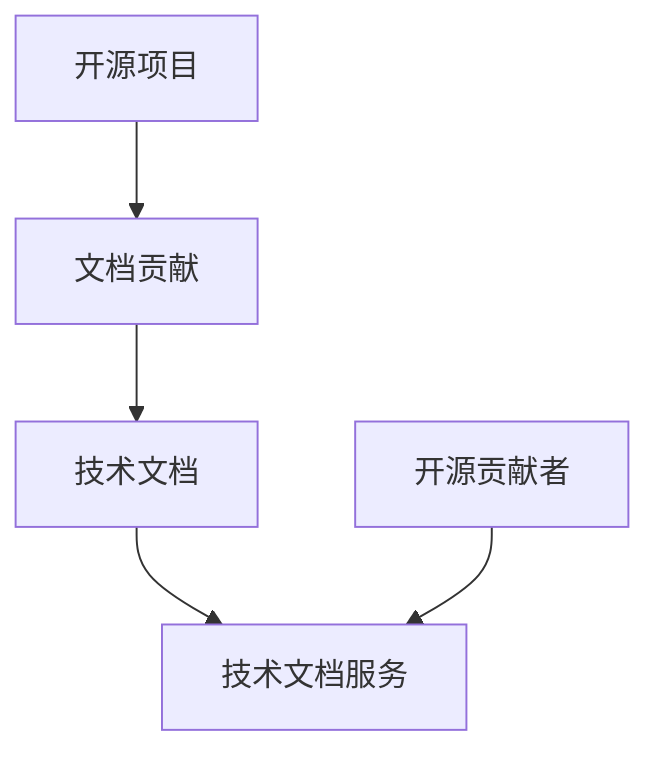

                 

# 技术文档服务：开源贡献者的另一收入来源

> 关键词：开源,技术文档,收入来源,文档撰写,开源贡献者,技术分享,商业化

## 1. 背景介绍

随着开源运动和技术的快速进步，开源项目逐渐成为软件生态中的重要组成部分。开源贡献者既是技术的推动者，也是知识的重要传播者。他们通过贡献代码、修复漏洞、优化性能等方式，极大地提升了软件质量和用户体验。然而，开源社区的繁荣，除了依赖技术的热情外，还离不开一个完善的开源项目维护生态，其中就包括高质量技术文档的创建和维护。技术文档不仅帮助用户更好地理解和应用开源项目，也是开源贡献者展示技术能力和分享知识的重要平台。然而，对于许多贡献者而言，技术文档的撰写和维护可能是一项耗时耗力的工作，尤其对于那些不是全职专注于文档贡献的开发者来说。

## 2. 核心概念与联系

### 2.1 核心概念概述

为更好地理解如何利用技术文档作为开源贡献者的一种收入来源，本节将介绍几个关键概念：

- **开源项目（Open Source Project）**：指代码和文档公开、社区共同维护的软件项目。典型的开源项目包括Linux、Apache HTTP Server等。开源项目通常由多个模块组成，各个模块需要独立的文档来描述其功能、用法、API等。
- **技术文档（Technical Documentation）**：指用于描述软件、系统、模块、API等技术细节的文档。通常分为用户手册、API文档、开发文档、FAQ等。技术文档在开源项目中起到了至关重要的作用，帮助用户正确使用和维护软件。
- **文档贡献（Documentation Contribution）**：指开发者为开源项目撰写、修改、更新技术文档的过程。文档贡献不仅能提升项目的整体质量，也是开源贡献者展示自身技术能力的重要途径。
- **开源收入（Open Source Income）**：指开源贡献者通过各种方式从开源项目中获得的收入。这包括直接的资助、众筹、商业咨询、技术演讲、技术培训等，也包括间接的收入来源，如技术文档服务。
- **技术文档服务（Technical Documentation Service）**：指为开源项目提供技术文档撰写、修订、发布等服务。这些服务可以帮助开源项目获得更好的文档质量，同时也为文档贡献者提供了收入来源。

### 2.2 核心概念原理和架构的 Mermaid 流程图



此流程图展示了一个简单的开源项目文档服务的流程：开源项目通过文档贡献者创建和维护技术文档，技术文档服务帮助提升文档质量，同时为文档贡献者提供收入来源。

## 3. 核心算法原理 & 具体操作步骤

### 3.1 算法原理概述

开源技术文档服务的核心算法原理主要是基于文档贡献者的专业知识和开源项目的文档需求，提供有针对性的技术文档编写和维护服务。具体算法包括文档自动化生成、文档质量评估、文档管理与分发等。

### 3.2 算法步骤详解

1. **文档需求分析**：首先需要明确开源项目的技术文档需求，包括文档的目标用户、文档类型、文档内容结构、文档呈现方式等。

2. **文档贡献者招募与筛选**：根据文档需求，招募具有相关技术背景的文档贡献者。筛选贡献者主要依据其专业技能、文档撰写经验、以往贡献记录等。

3. **文档编写与修订**：贡献者根据文档需求开始编写或修订文档。文档编写过程包括文档内容的编写、内容结构的搭建、图片和代码块的插入等。文档修订则包括文档内容的更新、格式调整、语言校正等。

4. **文档质量评估**：文档编写完成后，需经过一系列质量评估环节，包括语法检查、格式统一、内容完整性验证、用户反馈收集等。评估过程中可能会引入自动化的文档检查工具，如Markdown格式检查、代码块执行等。

5. **文档管理与分发**：评估通过后的文档需要进行管理和分发，包括文档的上传到开源项目的文档库、文档的持续更新和维护、文档的分发和链接生成等。

### 3.3 算法优缺点

**优点**：

- **提升文档质量**：通过专业的文档贡献者撰写和维护技术文档，可以显著提升文档的质量和可读性。
- **促进项目发展**：高质量的文档有助于吸引更多的用户和开发者，推动开源项目的发展。
- **增加贡献者收入**：文档贡献者可以通过提供文档服务获得额外的收入来源，激励更多开发者参与文档贡献。

**缺点**：

- **时间和资源投入**：文档编写和维护需要大量的时间和精力，尤其是对于全职开发人员来说。
- **文档需求多样性**：不同开源项目对文档的需求差异较大，文档贡献者需要具备多方面的知识和技能。
- **文档服务市场竞争激烈**：市场上已经存在许多文档服务提供商，开源贡献者需要与其他服务提供商竞争，获取项目资源。

### 3.4 算法应用领域

技术文档服务在多个领域得到了广泛的应用，具体包括：

- **开源项目**：如Linux、Apache HTTP Server、Kubernetes等。这些项目通常具有大量的模块和组件，需要详细的文档来描述其功能和用法。
- **SaaS产品**：如Salesforce、Dropbox、Slack等。SaaS产品的使用复杂性较高，需要详细的用户手册和API文档来支持用户使用。
- **技术博客和社区**：如Medium、Stack Overflow、GitHub等。这些平台上的技术文章和讨论通常需要完善的文档支持，帮助读者更好地理解和使用技术。

## 4. 数学模型和公式 & 详细讲解 & 举例说明

### 4.1 数学模型构建

技术文档服务的数学模型主要基于文档质量评估和贡献者技能评估。通过构建数学模型，可以对文档贡献者进行筛选，对文档质量进行量化。

假设文档质量为 $Q$，贡献者技能水平为 $S$，用户满意度为 $U$。则文档服务的数学模型可以表示为：

$$
Q = f(S, U)
$$

其中 $f$ 为映射函数，表示技能水平和用户满意度对文档质量的共同影响。

### 4.2 公式推导过程

- **技能水平评估**：
  假设技能水平 $S$ 由多个维度组成，如编程经验、技术掌握度、文档编写经验等。可以将每个维度进行打分，再通过加权平均得到总体技能水平。

$$
S = \sum_{i=1}^{n} s_i w_i
$$

其中 $s_i$ 为技能维度得分，$w_i$ 为权重。

- **用户满意度评估**：
  用户满意度 $U$ 可以通过用户反馈、使用数据等进行量化。可以设计问卷调查，收集用户对文档质量的评价，然后通过统计分析得到满意度分数。

$$
U = \sum_{j=1}^{m} u_j c_j
$$

其中 $u_j$ 为满意度维度得分，$c_j$ 为权重。

- **文档质量评估**：
  文档质量 $Q$ 可以通过多种指标进行量化，如文档完整性、语言规范性、代码可读性等。可以将每个指标进行打分，再通过加权平均得到总体质量得分。

$$
Q = \sum_{k=1}^{l} q_k r_k
$$

其中 $q_k$ 为质量指标得分，$r_k$ 为权重。

### 4.3 案例分析与讲解

假设某开源项目需要为其中的一个模块编写详细的API文档。该模块的文档需求包括详细的API说明、使用示例、常见问题解答等。以下是一个案例分析过程：

1. **文档需求分析**：
  - 文档目标用户为开发者
  - 文档类型为API文档
  - 文档内容结构包括模块简介、函数说明、参数说明、返回值说明、示例代码、常见问题等

2. **文档贡献者招募与筛选**：
  - 招募有相关编程经验和API文档撰写经验的人员
  - 筛选标准包括编程经验、文档撰写记录、技术博客质量等

3. **文档编写与修订**：
  - 贡献者开始编写文档，按照文档结构填充内容
  - 文档编写过程中进行语法检查、代码块执行等自动化检查

4. **文档质量评估**：
  - 邀请部分开发者进行文档初步评审，收集意见和建议
  - 进行自动化的语法和格式检查，确保文档格式统一、代码块正确

5. **文档管理与分发**：
  - 将文档上传至开源项目的文档库
  - 在开源项目的官方网站、文档网站、代码库中添加文档链接

## 5. 项目实践：代码实例和详细解释说明

### 5.1 开发环境搭建

为了演示技术文档服务的实现过程，可以使用Python进行开发。以下是开发环境搭建的步骤：

1. 安装Python：确保系统已安装Python 3.6及以上版本。
2. 安装必要的库：安装Flask、Markdown、PyGithub等库。
3. 设置GitHub API密钥：在GitHub中设置API密钥，以便调用GitHub API。

### 5.2 源代码详细实现

以下是一个简单的技术文档服务示例，用于展示文档编写、质量评估和分发过程：

```python
from flask import Flask, request, jsonify
import markdown
from github import Github

app = Flask(__name__)

# 初始化GitHub客户端
g = Github("YOUR_GITHUB_USERNAME", "YOUR_GITHUB_TOKEN")

# 示例文档模板
DOC_TEMPLATE = """
# {} API 文档

## 简介

...

## 函数说明

...

## 参数说明

...

## 返回值说明

...

## 示例代码

...

## 常见问题

...

# 文档编写与提交
@app.route('/submit_document', methods=['POST'])
def submit_document():
    data = request.json
    title = data['title']
    content = markdown.markdown(data['content'])
    
    # 上传文档到GitHub
    repo = g.get_repo("owner/repo")
    gh_issue = repo.create_file(title, content, branch="master")
    gh_issue.add_to_head_branch('docs')
    
    return jsonify({"message": "文档提交成功"})

# 文档质量评估与发布
@app.route('/quality_check', methods=['POST'])
def quality_check():
    data = request.json
    title = data['title']
    content = markdown.markdown(data['content'])
    
    # 进行语法检查
    if check_syntax(content):
        # 进行用户满意度调查
        if survey_user_satisfaction():
            # 发布文档到文档库
            repo = g.get_repo("owner/repo")
            gh_issue = repo.create_file(title, content, branch="master")
            gh_issue.add_to_head_branch('docs')
    
    return jsonify({"message": "文档发布成功"})

# 文档质量检查
def check_syntax(content):
    # 使用语法检查工具
    pass

# 用户满意度调查
def survey_user_satisfaction():
    # 使用问卷调查工具
    pass

if __name__ == '__main__':
    app.run(debug=True)
```

### 5.3 代码解读与分析

上述代码展示了技术文档服务的基本流程：

1. **API文档提交**：用户通过API提交文档内容，后端通过Flask框架进行接收和处理。
2. **语法检查**：提交的文档内容进行语法检查，确保文档格式正确。
3. **用户满意度调查**：通过问卷调查等方式收集用户对文档的满意度评分。
4. **文档发布**：将文档上传至GitHub文档库，并在项目的文档中添加链接。

### 5.4 运行结果展示

在实际运行过程中，用户可以通过API提交文档，系统进行语法检查和用户满意度调查，最终将文档发布到GitHub文档库。用户可以通过GitHub查看文档，并在文档中添加评论和反馈。

## 6. 实际应用场景

技术文档服务在多个实际应用场景中得到了广泛应用，具体包括：

### 6.1 开源项目

开源项目如Apache HTTP Server、Linux等，需要大量的技术文档来描述各个模块和组件的功能和用法。技术文档服务可以帮助这些项目提高文档质量，吸引更多开发者和用户。

### 6.2 SaaS产品

SaaS产品如Salesforce、Dropbox等，功能复杂，文档需求量大。技术文档服务可以显著提升这些产品的文档质量和用户体验。

### 6.3 技术博客和社区

技术博客和社区如Medium、Stack Overflow等，内容丰富，文档需求多样化。技术文档服务可以为这些平台提供专业的文档撰写和维护服务，提升平台的用户体验。

## 7. 工具和资源推荐

### 7.1 学习资源推荐

- **《技术文档写作的艺术》**：一本介绍技术文档写作的书籍，涵盖文档类型、写作技巧、文档管理等方面。
- **GitHub官方文档**：GitHub的官方文档，提供GitHub API、GitHub Pages等相关文档的详细说明。
- **Flask官方文档**：Flask的官方文档，介绍如何使用Flask框架进行API开发。
- **Markdown格式指南**：Markdown格式的详细指南，介绍如何使用Markdown编写文档。

### 7.2 开发工具推荐

- **GitHub**：开源项目的托管平台，提供API接口和文档发布功能。
- **Flask**：轻量级的Web框架，适合快速开发API服务。
- **Markdown**：轻量级的文本格式，适合编写文档和注释。
- **PyGithub**：Python的GitHub API客户端，方便与GitHub进行交互。

### 7.3 相关论文推荐

- **《开源项目文档质量评估方法研究》**：介绍开源项目文档质量评估方法和工具。
- **《技术文档自动化生成与发布系统设计》**：介绍技术文档自动化生成和发布系统的设计思路。
- **《开源社区文档贡献者的收入激励机制》**：研究开源社区文档贡献者的收入激励机制，探讨如何提升文档质量。

## 8. 总结：未来发展趋势与挑战

### 8.1 研究成果总结

本文介绍了技术文档服务作为开源贡献者收入来源的一种方式。技术文档服务能够提升开源项目的文档质量，吸引更多开发者和用户，同时也为文档贡献者提供额外的收入来源。技术文档服务的实现过程中，需要结合文档需求分析、文档贡献者招募、文档编写与修订、文档质量评估、文档管理与分发等环节进行全面考虑。

### 8.2 未来发展趋势

未来技术文档服务将呈现以下几个发展趋势：

1. **自动化程度提升**：通过引入自动化文档生成工具和AI技术，提高文档编写和修订的效率。
2. **社区化发展**：技术文档服务将更多地依托开源社区，吸引更多的开发者和用户参与。
3. **多语言支持**：技术文档服务将支持多语言文档的编写和发布，满足不同语言用户的需求。
4. **文档质量持续优化**：通过持续的质量评估和反馈机制，提升文档的准确性和可读性。
5. **文档服务市场成熟**：技术文档服务市场将逐渐成熟，出现更多专业化的服务提供商。

### 8.3 面临的挑战

技术文档服务在发展过程中仍面临一些挑战：

1. **文档需求多样性**：不同开源项目对文档的需求差异较大，技术文档服务需要灵活应对。
2. **文档服务市场竞争激烈**：市场上已存在多个文档服务提供商，开源贡献者需要与其他服务提供商竞争。
3. **文档质量评估困难**：文档质量评估需要结合多方面的指标，存在一定的难度。
4. **文档贡献者激励机制**：如何设计合理的激励机制，吸引更多开发者参与文档贡献，仍需深入研究。

### 8.4 研究展望

未来技术文档服务的研究方向包括：

1. **自动化工具的引入**：引入自动化的文档生成和质量评估工具，提高文档编写和评估的效率。
2. **社区化发展的探索**：探索如何将技术文档服务融入开源社区，吸引更多开发者和用户参与。
3. **多语言支持的研究**：研究如何支持多语言文档的编写和发布，满足不同语言用户的需求。
4. **文档质量评估机制的优化**：优化文档质量评估的指标和算法，提升评估的准确性和效率。
5. **文档贡献者激励机制的完善**：设计合理的激励机制，吸引更多开发者参与文档贡献。

通过上述研究，可以进一步提升技术文档服务的质量和效率，推动开源社区的发展，为开源贡献者提供更多的收入来源。

## 9. 附录：常见问题与解答

**Q1: 技术文档服务如何提升开源项目的文档质量？**

A: 技术文档服务通过招募专业的文档贡献者，提供文档编写、修订和发布等服务，能够显著提升文档的质量和可读性。文档贡献者具备专业的技术背景和丰富的编写经验，能够确保文档内容的准确性和完整性。

**Q2: 技术文档服务的自动化程度如何？**

A: 技术文档服务的自动化程度较高，通过引入自动化文档生成工具和AI技术，能够显著提高文档编写和修订的效率。自动化工具可以自动检测语法错误、格式错误等，提高文档的准确性和一致性。

**Q3: 如何评估文档质量？**

A: 文档质量评估通常需要结合语法检查、格式检查、用户反馈等多方面指标进行综合评估。可以使用自动化工具进行语法和格式检查，通过问卷调查等方式收集用户对文档的满意度评分，最后综合评估文档质量。

**Q4: 技术文档服务如何为文档贡献者提供收入？**

A: 技术文档服务可以为文档贡献者提供多种收入来源，如直接资助、众筹、技术演讲、技术培训等。此外，文档贡献者还可以通过提供高质量的文档撰写和维护服务获得额外的收入。

**Q5: 技术文档服务如何融入开源社区？**

A: 技术文档服务可以依托开源社区，通过社区平台进行文档的发布和管理。社区成员可以通过社区平台查看和评论文档，提供反馈意见。技术文档服务也可以为社区提供文档撰写和修订的服务，提升社区文档质量。

---

作者：禅与计算机程序设计艺术 / Zen and the Art of Computer Programming

