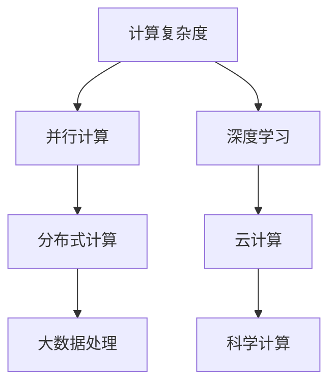

                 

# 拓展认知边界：人类计算的科学探索

## 1. 背景介绍

### 1.1 问题由来
在21世纪的科技前沿，人类计算能力的飞跃性突破，使得我们可以更深入地探索和理解自然界及人类社会的复杂系统。从物理学的粒子级别探索，到生命科学的基因组研究，再到社会科学中的大规模数据处理，人类计算正不断打开新的认知边界。然而，面对日益复杂的系统与问题，传统的计算手段逐渐显得力不从心。

### 1.2 问题核心关键点
如何高效、准确地处理大规模数据，挖掘出其中的隐含信息和规律，成为当前计算科学领域的重要研究问题。这一问题不仅涉及算法和计算能力的提升，还包括对数据、模型和系统的深度理解。例如，在人工智能领域，如何利用深度学习等技术，高效地从大规模数据中学习出具有泛化能力的模型，成为了当前研究的热点。

### 1.3 问题研究意义
研究高效、准确的人类计算方法，有助于我们更深入地理解自然现象和社会规律，为决策制定提供科学依据。同时，这些方法也能够推动相关领域的技术革新，促进产业升级和经济发展。通过精确的计算预测，人类可以更加合理地应对各类挑战，提升生活质量和社会福祉。

## 2. 核心概念与联系

### 2.1 核心概念概述

为更好地理解人类计算方法的科学探索，本节将介绍几个关键核心概念：

- 计算复杂度：指问题求解所需计算资源的度量，通常用算法的时间复杂度和空间复杂度来表示。人类计算方法的核心挑战之一，就是在保证高效计算的同时，尽量减少资源消耗。
- 并行计算：指利用多个处理器同时计算的能力，加速问题求解过程。并行计算在分布式系统和大规模数据处理中得到了广泛应用。
- 深度学习：一种通过多层神经网络，从大量数据中学习复杂表示的人工智能技术。深度学习已经在图像识别、语音识别、自然语言处理等领域取得了显著成果。
- 分布式计算：指将一个大问题分解为多个小问题，分别在不同节点上并行计算，最终将结果合并的方法。Hadoop和Spark等分布式计算框架，已广泛应用于大数据处理。
- 云计算：利用互联网提供的计算资源，按需使用，无需购买和维护。云计算提供了强大的计算能力，广泛应用于科学计算、大数据处理等领域。

这些核心概念之间的逻辑关系可以通过以下Mermaid流程图来展示：



这个流程图展示了一系列人类计算方法的基石概念，以及它们之间的相互依赖和补充关系。

## 3. 核心算法原理 & 具体操作步骤
### 3.1 算法原理概述

人类计算方法的科学探索，包括多个维度的算法原理和技术实现。本节将从理论角度概述这些原理，并为实际操作提供详细步骤。

### 3.2 算法步骤详解

人类计算方法通常包括以下几个关键步骤：

**Step 1: 数据预处理**
- 收集并清洗数据，去除噪声和不相关数据。
- 对数据进行标准化和归一化，确保数据在相同尺度上。

**Step 2: 模型设计**
- 选择合适的模型架构，如神经网络、支持向量机、随机森林等。
- 定义损失函数和优化器，用于训练模型和调整模型参数。

**Step 3: 模型训练**
- 将数据分为训练集和验证集，使用训练集训练模型。
- 定期在验证集上评估模型性能，避免过拟合。

**Step 4: 模型评估**
- 使用测试集评估模型效果，获取模型精度和泛化能力。
- 根据评估结果调整模型参数和算法超参数。

**Step 5: 模型优化**
- 使用正则化技术，如L2正则、Dropout等，提高模型泛化能力。
- 应用并行计算和分布式计算技术，提升计算效率。

**Step 6: 模型应用**
- 在实际问题中应用模型，进行数据处理和预测分析。
- 持续监控模型性能，更新模型以应对新数据和新场景。

这些步骤构成了人类计算方法的基本框架，无论是科学研究还是工程实践，都遵循这一流程。

### 3.3 算法优缺点

人类计算方法的优势在于：
1. 高效性：利用现代计算硬件和算法，可以显著提高计算效率。
2. 可扩展性：并行计算和分布式计算技术，使得计算能力可扩展到无限大的规模。
3. 灵活性：深度学习等模型架构，能够自适应复杂多变的数据结构和问题形式。
4. 普适性：人类计算方法能够在多个领域和问题中应用，具有广泛的普适性。

同时，人类计算方法也存在一些局限：
1. 数据依赖：对高质量标注数据和高质量数据集有较高的依赖。
2. 计算复杂度：某些复杂问题仍需要极高的计算资源和计算时间。
3. 模型解释性：部分模型的决策过程难以解释，缺乏透明度。
4. 鲁棒性：模型对噪声和异常数据敏感，容易出现偏差。

尽管存在这些局限，但人类计算方法通过不断优化算法和改进硬件，已经在多个领域取得了显著成果。未来，随着技术的发展，这些方法有望在更多领域得到应用，进一步拓展人类的认知边界。

### 3.4 算法应用领域

人类计算方法已经广泛应用于多个领域，展示了其强大的生命力和广泛的应用前景。以下是一些典型应用领域：

**科学计算**：物理模拟、气候预测、基因组研究等。通过高效计算，可以模拟复杂系统行为，发现科学规律。

**大数据处理**：金融分析、医疗诊断、社交网络分析等。通过分布式计算和云计算，能够处理海量数据，提取有价值的信息。

**人工智能**：图像识别、语音识别、自然语言处理等。通过深度学习等技术，可以实现高效的数据表示和学习。

**网络安全**：威胁检测、加密算法、漏洞挖掘等。通过计算能力和算法创新，提高网络安全水平，保护重要数据。

**实时系统**：自动驾驶、智能家居、工业控制等。通过分布式计算和实时计算技术，实现高效、可靠的系统运行。

未来，随着计算技术的不断发展，人类计算方法将进一步拓展到更多领域，为人类社会带来更多的便利和创新。

## 4. 数学模型和公式 & 详细讲解  
### 4.1 数学模型构建

在人类计算方法中，数学模型扮演着核心角色。本节将介绍几个典型的数学模型及其构建方法。

以线性回归模型为例，其数学表达式为：

$$ y = \beta_0 + \beta_1 x_1 + \beta_2 x_2 + \cdots + \beta_n x_n + \epsilon $$

其中，$y$ 为预测值，$x_1, x_2, \cdots, x_n$ 为自变量，$\beta_0, \beta_1, \beta_2, \cdots, \beta_n$ 为回归系数，$\epsilon$ 为误差项。

在线性回归模型中，目标是最小化预测值与真实值之间的误差，通常使用均方误差作为损失函数：

$$ \mathcal{L} = \frac{1}{2N} \sum_{i=1}^N (y_i - \hat{y}_i)^2 $$

其中，$y_i$ 为真实值，$\hat{y}_i$ 为预测值，$N$ 为样本数。

### 4.2 公式推导过程

线性回归模型的推导过程主要涉及最小二乘法，目标是最小化损失函数的平方和：

$$ \mathcal{L} = \frac{1}{2N} \sum_{i=1}^N (y_i - \hat{y}_i)^2 $$

对上述公式求导，得到：

$$ \frac{\partial \mathcal{L}}{\partial \beta_j} = \frac{1}{N} \sum_{i=1}^N (x_{ij} - \bar{x}_j) \frac{y_i - \hat{y}_i}{\sigma^2} $$

其中，$x_{ij}$ 为自变量 $x_i$ 的第 $j$ 个分量，$\bar{x}_j$ 为自变量的均值，$\sigma^2$ 为误差方差。

解上述导数等于零的方程组，即可求得回归系数 $\beta_j$。具体解法包括普通最小二乘法、梯度下降法、牛顿法等。

### 4.3 案例分析与讲解

以图像分类任务为例，使用卷积神经网络（CNN）进行模型构建和训练。假设输入图像大小为 $m \times n$，输出类别数为 $c$，则 CNN 的架构可以表示为：

$$ \hat{y} = \text{softmax}(W_l \sigma(W_{l-1} \sigma(\cdots W_1 x \cdots) + b_l)) $$

其中，$x$ 为输入图像，$W_l$ 和 $b_l$ 为第 $l$ 层的权重和偏置，$\sigma$ 为激活函数，$\text{softmax}$ 为输出层激活函数。

在模型训练中，使用交叉熵损失函数：

$$ \mathcal{L} = -\frac{1}{N} \sum_{i=1}^N \sum_{j=1}^c y_{ij} \log \hat{y}_{ij} $$

其中，$y_{ij}$ 为真实标签，$\hat{y}_{ij}$ 为预测概率。

通过反向传播算法，计算梯度并更新模型参数，即可优化模型性能。

## 5. 项目实践：代码实例和详细解释说明
### 5.1 开发环境搭建

在进行计算方法实践前，我们需要准备好开发环境。以下是使用Python进行科学计算开发的常见环境配置流程：

1. 安装Anaconda：从官网下载并安装Anaconda，用于创建独立的Python环境。

2. 创建并激活虚拟环境：
```bash
conda create -n py-env python=3.8 
conda activate py-env
```

3. 安装科学计算库：
```bash
conda install numpy scipy pandas matplotlib scikit-learn jupyter notebook
```

4. 安装分布式计算框架：
```bash
conda install dask hadoop
```

5. 安装云计算相关库：
```bash
conda install boto3 awscli
```

完成上述步骤后，即可在`py-env`环境中开始计算方法实践。

### 5.2 源代码详细实现

下面以线性回归模型为例，给出使用Python的科学计算代码实现。

```python
import numpy as np
import matplotlib.pyplot as plt
from sklearn.linear_model import LinearRegression

# 创建样本数据
X = np.random.randn(100, 2)
y = 3 * X[:, 0] + 4 * X[:, 1] + np.random.randn(100) * 0.5
y = y.reshape(-1, 1)

# 创建线性回归模型
model = LinearRegression()

# 拟合模型
model.fit(X, y)

# 预测新数据
X_new = np.array([[1, 2], [3, 4], [5, 6]])
y_pred = model.predict(X_new)

# 可视化结果
plt.scatter(X[:, 0], y)
plt.plot(X_new[:, 0], y_pred, color='r')
plt.show()
```

### 5.3 代码解读与分析

让我们再详细解读一下关键代码的实现细节：

**数据生成**：
- 使用numpy生成随机数据，模拟线性回归模型中的自变量和因变量。
- 添加噪声项，确保数据的非线性特性。

**模型构建**：
- 使用scikit-learn的线性回归模型，构建线性回归模型实例。

**模型训练**：
- 使用拟合方法，对模型进行训练，得到回归系数。

**模型预测**：
- 使用预测方法，对新数据进行预测，得到预测值。

**可视化**：
- 使用matplotlib库，可视化预测结果和真实数据点，便于观察模型效果。

可以看到，Python语言及其丰富的科学计算库，使得线性回归模型的构建和训练变得非常简单高效。

## 6. 实际应用场景
### 6.1 天气预测系统

天气预测系统是一个典型的大数据处理和科学计算应用。传统的天气预测依赖于人工观测和经验模型，准确度较低且无法实时更新。利用高效的人类计算方法，可以从大量的气象数据中学习出复杂的关系，实时预测天气变化，提高预测的准确度和时效性。

具体而言，可以收集全球气象站的观测数据，使用机器学习模型（如LSTM、神经网络等）进行时间序列预测，并引入深度学习中的迁移学习技术，在区域气象数据上进行微调，提升模型性能。通过并行计算和分布式计算技术，实时处理大量数据，实现高精度的天气预测。

### 6.2 医学影像分析

医学影像分析是科学计算在医疗领域的重要应用。通过高分辨率的医学影像数据，可以实时地检测和分析疾病病变区域，辅助医生诊断。利用深度学习中的卷积神经网络（CNN），可以对医学影像进行快速、准确地分类和分割，提高诊断的准确率和效率。

具体而言，可以收集大量医学影像数据，使用迁移学习技术对预训练的CNN模型进行微调，得到适合特定疾病的影像分类模型。通过云计算和分布式计算，实现高效的影像处理和分析，及时发现病变区域，辅助医生诊断。

### 6.3 智能交通系统

智能交通系统是一个典型的实时系统应用。通过高效计算，可以实现对交通流量的实时监测和预测，优化交通信号控制，提高道路通行效率。利用分布式计算和实时计算技术，可以处理大规模交通数据，实现实时数据处理和分析。

具体而言，可以收集交通流量数据，使用时间序列分析方法，预测交通流量变化趋势，并引入深度学习中的循环神经网络（RNN），实时处理交通数据，优化交通信号控制。通过云计算和分布式计算，实现高效的交通流量分析，提高交通管理水平。

### 6.4 未来应用展望

未来，随着计算技术和数据科学的发展，人类计算方法将在更多领域得到应用，为人类社会带来更多的便利和创新。

在生物信息学领域，通过高效计算，可以发现新的基因序列，解析复杂的生物信息数据，推动生命科学的发展。

在地球科学领域，通过计算建模，可以预测气候变化趋势，探索地质演化规律，为环境保护提供科学依据。

在金融领域，通过高效计算，可以实现高频交易，优化投资组合，提高风险管理水平。

在教育领域，通过计算建模，可以实现个性化学习，提供智能辅导，提高教育质量。

总之，高效、准确的人类计算方法，将在更多领域得到广泛应用，推动科学和技术的发展，提升人类社会的福祉。

## 7. 工具和资源推荐
### 7.1 学习资源推荐

为了帮助开发者系统掌握人类计算方法的科学探索，这里推荐一些优质的学习资源：

1. 《机器学习》书籍：由机器学习领域的经典著作，涵盖了机器学习的基本概念和算法。

2. 《深度学习》书籍：由深度学习领域的权威著作，介绍了深度学习的基本原理和应用。

3. 《Python科学计算》课程：由Python官方社区提供，涵盖Python在科学计算中的应用。

4. 《数据科学与机器学习》在线课程：由Coursera提供，涵盖数据科学和机器学习的基本知识和技能。

5. 《科学计算与数据分析》书籍：由科学计算领域的权威著作，介绍了科学计算的基本方法和技术。

通过这些资源的学习实践，相信你一定能够快速掌握人类计算方法的科学探索，并用于解决实际的计算问题。

### 7.2 开发工具推荐

高效的开发离不开优秀的工具支持。以下是几款用于人类计算方法开发的常用工具：

1. Python：作为科学计算的主流语言，Python具有丰富的科学计算库和框架，如NumPy、SciPy、Scikit-learn等。

2. R：作为数据科学和统计分析的主流语言，R具有强大的数据处理和统计分析能力。

3. MATLAB：作为工程计算的主流语言，MATLAB具有强大的数值计算和仿真能力。

4. Jupyter Notebook：一个交互式的编程环境，支持Python、R等语言，方便进行科学计算和数据分析。

5. VS Code：一个轻量级的代码编辑器，支持Python等科学计算语言，具有丰富的扩展插件。

合理利用这些工具，可以显著提升人类计算方法的开发效率，加快创新迭代的步伐。

### 7.3 相关论文推荐

人类计算方法的发展源于学界的持续研究。以下是几篇奠基性的相关论文，推荐阅读：

1. 《机器学习》（周志华）：介绍了机器学习的基本概念和算法，具有很高的学术价值。

2. 《深度学习》（Ian Goodfellow）：介绍了深度学习的基本原理和应用，是深度学习领域的经典著作。

3. 《科学计算》（Gene Golub）：介绍了科学计算的基本方法和技术，具有很高的学术价值。

4. 《分布式计算》（Michael O. Rabin）：介绍了分布式计算的基本原理和应用，具有很高的学术价值。

这些论文代表了大计算方法的发展脉络。通过学习这些前沿成果，可以帮助研究者把握学科前进方向，激发更多的创新灵感。

## 8. 总结：未来发展趋势与挑战

### 8.1 总结

本文对人类计算方法的科学探索进行了全面系统的介绍。首先阐述了人类计算方法的研究背景和意义，明确了科学探索在拓展认知边界中的重要价值。其次，从原理到实践，详细讲解了科学探索的数学模型和关键步骤，给出了科学计算任务开发的完整代码实例。同时，本文还广泛探讨了科学探索方法在多个行业领域的应用前景，展示了科学探索范式的巨大潜力。此外，本文精选了科学探索技术的各类学习资源，力求为读者提供全方位的技术指引。

通过本文的系统梳理，可以看到，人类计算方法在多个领域取得了显著成果，为科学和技术的发展提供了强大的支持。未来，伴随科学计算技术的不断进步，人类计算方法将进一步拓展到更多领域，为人类社会带来更多的便利和创新。

### 8.2 未来发展趋势

展望未来，人类计算方法的发展趋势包括以下几个方面：

1. 数据驱动的科学探索：随着大数据技术的发展，利用大规模数据进行科学探索将成为主要方向。数据驱动的科学探索将更加广泛和深入。

2. 多模态数据的融合：数据的多样性和复杂性日益增加，利用多模态数据的融合技术，将各种类型的数据进行综合分析，提升科学探索的精度和深度。

3. 实时计算与分布式计算：实时计算和分布式计算技术将进一步发展，实现高效、实时的数据处理和分析，推动科学探索的实时化。

4. 深度学习与符号计算的融合：深度学习与符号计算的融合将成为科学探索的新趋势，结合两者的优点，提升科学探索的精确度和解释性。

5. 跨学科的科学探索：不同学科之间的交叉融合将更加紧密，利用跨学科的知识和技术，解决更加复杂的问题。

以上趋势凸显了人类计算方法的广阔前景。这些方向的探索发展，将进一步提升科学探索的效率和效果，推动人类认知智能的进化。

### 8.3 面临的挑战

尽管人类计算方法在多个领域取得了显著成果，但在迈向更加智能化、普适化应用的过程中，它仍面临诸多挑战：

1. 数据质量和多样性：科学探索对数据质量和多样性要求较高，如何获取高质量、高多样性的数据，仍然是一个重要问题。

2. 计算资源的限制：随着数据规模的增大和问题复杂性的增加，科学探索对计算资源的需求也在不断增长，如何高效利用计算资源，仍然是一个重要挑战。

3. 模型解释性和透明性：科学探索中使用的模型，往往缺乏解释性和透明性，如何提高模型的可解释性和透明性，仍然是一个重要问题。

4. 多模态数据的整合：多模态数据的整合和融合，是一个复杂的工程问题，需要考虑数据格式、处理方法和融合策略。

5. 算法的可扩展性：随着数据规模的增大，算法的可扩展性问题也更加突出，如何设计高效可扩展的算法，仍然是一个重要挑战。

6. 伦理和安全性：科学探索中的数据隐私和模型安全性问题，也日益受到关注，如何保障数据隐私和模型安全性，仍然是一个重要问题。

以上挑战需要在未来不断攻克，才能进一步推动科学探索技术的发展，为人类社会带来更多的便利和创新。

### 8.4 研究展望

未来，科学探索技术的研究方向包括：

1. 数据增强和数据扩充技术：如何通过数据增强和扩充技术，提高数据质量和多样性，是未来的一个重要研究方向。

2. 高效可扩展的算法设计：如何设计高效可扩展的算法，适应大规模数据和复杂问题的需求，是未来的一个重要研究方向。

3. 跨学科的科学探索方法：如何结合不同学科的知识和技术，解决更加复杂的问题，是未来的一个重要研究方向。

4. 模型解释性和透明性技术：如何提高模型的可解释性和透明性，增强模型的可信度和应用价值，是未来的一个重要研究方向。

5. 伦理和安全性研究：如何保障数据隐私和模型安全性，是未来的一个重要研究方向。

通过持续的研究和技术创新，相信人类计算方法将进一步拓展到更多领域，为科学和技术的发展提供更强大的支持，推动人类社会的进步和发展。

## 9. 附录：常见问题与解答

**Q1：人类计算方法是否适用于所有科学探索问题？**

A: 人类计算方法在大多数科学探索问题上都能取得不错的效果，特别是对于数据量较大的问题。但对于一些特定领域的问题，如量子物理、天体物理等，目前仍存在一定的局限性。

**Q2：如何选择合适的科学计算工具和框架？**

A: 选择合适的科学计算工具和框架，需要考虑以下几个因素：
1. 数据类型和大小：根据数据类型和大小选择合适的框架，如NumPy适用于数值计算，SciPy适用于科学计算，Pandas适用于数据处理。
2. 计算任务：根据计算任务选择合适的工具，如TensorFlow适用于深度学习，Matplotlib适用于数据可视化。
3. 开发环境：根据开发环境选择合适的工具，如Jupyter Notebook适用于交互式编程，VS Code适用于代码编辑。

**Q3：在科学探索中如何处理数据噪声和异常值？**

A: 处理数据噪声和异常值，通常有以下几种方法：
1. 数据清洗：去除不相关数据，去除噪声项，去除异常值。
2. 数据平滑：使用平滑算法，如移动平均、指数平滑等，减少噪声影响。
3. 数据分箱：将数据分成若干箱，平滑处理箱内数据，去除异常值。

这些方法可以结合使用，根据具体情况选择合适的方法。

**Q4：科学探索中的模型选择和参数调优方法有哪些？**

A: 科学探索中的模型选择和参数调优方法包括：
1. 模型选择：根据问题类型选择合适的模型，如线性回归适用于线性问题，神经网络适用于非线性问题。
2. 参数调优：使用网格搜索、随机搜索、贝叶斯优化等方法，寻找最优参数组合。
3. 正则化：使用L2正则、Dropout等方法，提高模型泛化能力。
4. 交叉验证：使用交叉验证方法，评估模型性能，避免过拟合。

这些方法可以帮助选择合适的模型和调优参数，提升科学探索的效果。

**Q5：科学探索中的数据预处理有哪些常用方法？**

A: 科学探索中的数据预处理方法包括：
1. 数据清洗：去除不相关数据，去除噪声项，去除异常值。
2. 数据标准化：将数据标准化到相同尺度，便于模型训练。
3. 数据归一化：将数据归一化到[0,1]或[-1,1]等常用范围，便于模型处理。
4. 数据增强：通过数据增强技术，扩充训练集，提高模型泛化能力。
5. 数据采样：通过数据采样方法，获取有代表性样本，提高模型效果。

这些方法可以结合使用，根据具体情况选择合适的方法。

总之，科学探索是一个涉及数据、模型、算法等多个环节的系统工程。只有在各个环节进行全面优化，才能实现高效的科学探索，推动科学和技术的发展。

---

作者：禅与计算机程序设计艺术 / Zen and the Art of Computer Programming

