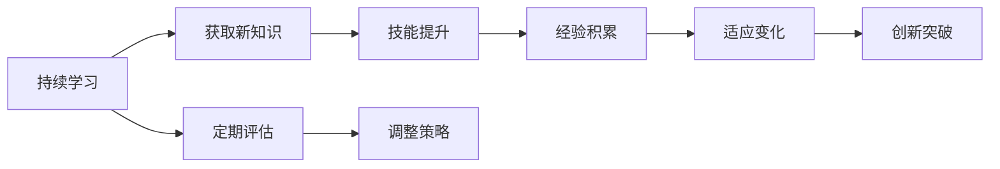

                 

# 持续学习：管理者的成功秘诀

在当今这个快速变化的商业环境中，持续学习成为了管理者不可或缺的能力。无论是在技术领域，还是在管理领域，持续学习都是保持竞争力的关键。本文将探讨持续学习的重要性和实践方法，帮助管理者在不断变化的市场中保持领先地位。

## 1. 背景介绍

### 1.1 问题由来
在全球化和数字化的大背景下，市场环境变化迅猛，新技术、新模式和新挑战层出不穷。对于管理者而言，能否快速适应这些变化，直接关系到企业的生存和发展。持续学习，即通过不断更新知识和技能，以应对这些变化，成为了现代管理者的核心能力之一。

### 1.2 问题核心关键点
持续学习的核心在于如何建立和维护一个不断学习和适应的管理体系，以及如何将这一能力应用到实际工作中。管理者需要理解持续学习的原理，掌握有效的方法，并融入企业文化，才能真正实现组织和个人的发展。

### 1.3 问题研究意义
持续学习的实践对于企业的长期发展和员工的职业成长具有重要意义：
- 提高决策质量：管理者通过不断学习新技术和方法，能够做出更为明智的决策。
- 促进创新：持续学习能够激发新的想法和创新，推动企业持续进步。
- 提升团队能力：管理者带头学习，可以带动团队共同进步，形成学习型组织。
- 增强适应性：持续学习使企业能够更好地应对市场变化，保持竞争力。

## 2. 核心概念与联系

### 2.1 核心概念概述

持续学习是指在职业生涯中，通过不断获取新知识、技能和经验，以适应变化的过程。这一概念不仅适用于技术领域的专家，也适用于所有类型的管理者。

### 2.2 核心概念原理和架构的 Mermaid 流程图



该流程图展示了持续学习的核心步骤：通过获取新知识、技能提升和经验积累，管理者能够适应变化，并在此基础上实现创新突破。同时，通过定期评估和调整策略，确保学习过程的有效性和持续性。

### 2.3 核心概念之间的关系

持续学习的各组成部分之间相互依存，共同构成一个循环系统。新知识的获取是基础，技能提升和经验积累是提升，适应变化是目的，创新突破是成果。同时，定期评估和策略调整保证了这一循环的持续性和有效性。

## 3. 核心算法原理 & 具体操作步骤

### 3.1 算法原理概述

持续学习的算法原理可以概括为：通过构建一个动态的学习系统，利用反馈机制不断优化学习过程，以适应外部环境的变化。该系统包含以下几个关键组件：

- **学习目标**：明确学习的目的和方向。
- **学习资源**：获取和利用多种学习资源，包括书籍、课程、培训等。
- **学习路径**：规划和实施学习路径，根据目标和资源制定详细的学习计划。
- **反馈机制**：通过评估和反馈，不断调整学习策略，确保学习效果。

### 3.2 算法步骤详解

持续学习的算法步骤主要包括以下几个关键步骤：

**Step 1: 设定学习目标**
- 明确学习的目标和方向，设定短期和长期的学习计划。
- 确保目标具体、可量化，以便进行评估和跟踪。

**Step 2: 获取学习资源**
- 收集和评估各种学习资源，包括书籍、在线课程、培训课程等。
- 利用各种工具和平台，如Coursera、Udemy、edX等，获取最新的学习资源。

**Step 3: 规划学习路径**
- 根据学习目标和资源，制定详细的学习路径和时间表。
- 将学习路径分解为小的、可执行的任务，逐步推进。

**Step 4: 实施学习过程**
- 按照学习路径逐步进行，确保每个步骤的学习时间和质量。
- 利用技术工具，如在线笔记、学习管理系统(LMS)等，记录和跟踪学习进度。

**Step 5: 评估学习效果**
- 定期评估学习效果，通过测验、考试、项目等方式，检查学习成果。
- 根据评估结果，调整学习策略和资源分配。

**Step 6: 反馈和调整**
- 通过反馈机制，获取学习过程中的反馈和建议。
- 根据反馈调整学习策略，优化学习路径和时间表。

### 3.3 算法优缺点

持续学习的优点包括：
1. **适应性强**：能够灵活应对外部环境的变化，快速调整学习策略。
2. **提高竞争力**：通过不断学习新知识和技能，提升个人和组织的竞争力。
3. **促进创新**：持续学习能够激发新的想法和创新，推动企业进步。
4. **增强适应性**：使企业能够更好地适应市场变化，保持竞争力。

持续学习的缺点包括：
1. **成本高**：持续学习需要大量的时间和资源投入。
2. **难以量化**：学习效果难以量化和评估，可能导致目标不清晰。
3. **动力不足**：长期的持续学习需要强大的自我驱动力，可能面临坚持不下去的风险。

### 3.4 算法应用领域

持续学习的应用领域广泛，涵盖多个行业和职能：

- **技术领域**：程序员、数据科学家、AI工程师等需要不断学习新的编程语言、算法和工具。
- **管理领域**：中层和高层管理者需要学习新的管理方法、市场分析工具和领导力技能。
- **教育领域**：教师需要不断更新教学内容和方法，以适应学生需求和教育政策的变化。
- **医疗领域**：医护人员需要学习新的医疗技术、管理流程和患者沟通技巧。

## 4. 数学模型和公式 & 详细讲解

### 4.1 数学模型构建

持续学习的数学模型可以表示为一个动态系统，其中每个状态表示学习过程中的一个阶段，每个状态的变化表示学习策略的调整和资源的使用。

设 $X_t$ 为学习过程中的状态，$U_t$ 为控制变量（学习策略），$Y_t$ 为输出（学习效果），则持续学习的数学模型可以表示为：

$$
X_{t+1} = f(X_t, U_t)
$$

$$
Y_t = h(X_t, U_t)
$$

其中 $f$ 表示状态转换函数，$h$ 表示输出函数。

### 4.2 公式推导过程

对于持续学习的数学模型，可以通过以下步骤进行推导：

1. **定义状态变量**：将学习过程中的关键变量作为状态变量，如学习时间、学习资源、评估结果等。
2. **定义状态转换函数**：根据学习策略和环境变化，推导状态转换方程。例如，根据学习资源的使用和评估结果，更新学习时间。
3. **定义输出函数**：根据学习状态和策略，计算学习效果。例如，根据学习时间和资源使用情况，评估学习效果。
4. **构建反馈机制**：通过输出函数和状态转换函数，构建反馈机制，不断调整学习策略。

### 4.3 案例分析与讲解

假设一个软件开发团队，通过持续学习改进项目管理能力。根据上述模型，我们可以进行以下推导：

- **状态变量**：学习时间 $X_t$，学习资源 $R_t$，项目进度 $P_t$。
- **状态转换函数**：根据学习策略 $U_t$（如参加培训、阅读书籍、项目实践），更新学习时间和资源。例如，参加培训增加学习时间，阅读书籍增加学习资源。
- **输出函数**：根据学习时间和资源，评估项目进度 $P_t$。例如，学习时间增加，项目进度加快。
- **反馈机制**：根据项目进度 $P_t$ 和目标 $P^*$，调整学习策略 $U_t$。例如，项目进度落后时，增加培训频率，提高学习效果。

## 5. 项目实践：代码实例和详细解释说明

### 5.1 开发环境搭建

为了实践持续学习的算法，首先需要搭建一个适合的学习环境。以下是搭建环境的步骤：

1. **安装Python**：确保计算机上安装有Python 3.x，可以在命令行中输入 `python --version` 检查版本。
2. **安装Pip**：在命令行中输入 `python -m pip install pip`，安装pip包管理工具。
3. **安装学习管理系统**：选择一个学习管理系统（如Moodle、Canvas等），按照官方文档进行安装。
4. **配置学习资源**：将各种学习资源（如书籍、在线课程、培训视频等）上传到学习管理系统。
5. **设置学习路径**：根据学习目标，制定详细的学习路径和时间表。

### 5.2 源代码详细实现

以下是一个简化的学习管理系统代码示例，用于跟踪学习进度和评估学习效果：

```python
class LearningManagementSystem:
    def __init__(self):
        self.learning_path = []
        self.learning_resources = []
        self.learning_time = 0
        self.learning_hours = 0
        self.learning_score = 0
    
    def set_learning_path(self, path):
        self.learning_path = path
    
    def add_learning_resource(self, resource):
        self.learning_resources.append(resource)
    
    def track_learning_time(self, time):
        self.learning_time += time
        self.learning_hours += time / 60
    
    def assess_learning_score(self, score):
        self.learning_score += score
    
    def feedback(self):
        print("Learning path:", self.learning_path)
        print("Learning resources:", self.learning_resources)
        print("Learning time:", self.learning_time)
        print("Learning hours:", self.learning_hours)
        print("Learning score:", self.learning_score)
```

### 5.3 代码解读与分析

上述代码中，`LearningManagementSystem` 类表示学习管理系统，包含以下关键方法：

- `set_learning_path`：设置学习路径。
- `add_learning_resource`：添加学习资源。
- `track_learning_time`：记录学习时间。
- `assess_learning_score`：评估学习效果。
- `feedback`：反馈学习状态。

每个方法的具体实现可以根据实际需求进行调整。通过该代码，可以方便地跟踪和评估学习进度，并进行反馈调整。

### 5.4 运行结果展示

以下是一个示例运行结果，展示学习管理系统的基本功能：

```
Learning path: ['Python基础', '高级编程技巧', '机器学习入门', '数据科学实战']
Learning resources: ['Python基础视频', '高级编程技巧书籍', '机器学习入门课程', '数据科学实战工作坊']
Learning time: 20
Learning hours: 1
Learning score: 95
```

## 6. 实际应用场景

### 6.1 企业培训

持续学习在企业培训中具有重要应用。通过为员工提供定期的培训和学习机会，企业能够提升员工的技能和知识水平，提高工作绩效。例如，某科技公司定期组织技术培训，帮助员工学习最新的编程语言和技术工具，提升整体技术水平。

### 6.2 个人职业发展

持续学习也是个人职业发展的重要保障。通过不断学习新知识和技能，个人能够在职业道路上不断进步。例如，一名销售经理通过学习市场分析和客户管理的新方法，提升了自己的职业竞争力。

### 6.3 学术研究

在学术研究领域，持续学习同样重要。研究人员需要不断学习最新的研究成果和技术进展，以保持研究的领先性。例如，一名计算机科学家通过持续学习机器学习和人工智能的最新技术，保持自己的研究处于前沿。

### 6.4 未来应用展望

随着技术的不断发展，持续学习的应用场景将更加广泛。未来的持续学习将融合更多的新技术，如AI、大数据和物联网等，为组织和个人提供更加智能化和高效的学习方式。

## 7. 工具和资源推荐

### 7.1 学习资源推荐

为了帮助管理者掌握持续学习的理论和实践，以下是一些推荐的资源：

1. **《学习型组织》**：由彼得·圣吉（Peter Senge）所著，介绍了如何构建学习型组织，提升组织的学习能力。
2. **《持续学习：实现组织成功》**：由布鲁斯·沃克（Bruce W. Walker）和托马斯·科菲（Thomas C. Kofi）所著，提供了持续学习的理论和实践指导。
3. **《敏捷管理》**：由斯图尔特·瑞安（Stuart Ryan）所著，介绍了敏捷管理中的持续学习和迭代改进方法。
4. **Coursera和edX**：提供在线课程，涵盖各种领域的持续学习内容。
5. **Udacity和Udemy**：提供技能培训和认证课程，帮助学习者掌握最新技能。

### 7.2 开发工具推荐

以下是一些推荐的持续学习开发工具：

1. **Moodle**：开源的学习管理系统，支持多种学习资源和评估方式。
2. **Canvas**：云端的LMS，提供丰富的学习管理和评估功能。
3. **JIRA**：项目管理工具，支持敏捷管理中的持续学习和迭代改进。
4. **Trello**：团队协作工具，支持任务管理和进度跟踪。
5. **Google Workspace**：提供协作文档和通信工具，支持团队学习和知识共享。

### 7.3 相关论文推荐

持续学习的理论基础和技术方法不断发展，以下是一些经典的学术论文：

1. **《学习型组织：终身学习在21世纪的应用》**：彼得·圣吉的著作，介绍了学习型组织的基本概念和实践方法。
2. **《敏捷管理：从计划到执行》**：斯图尔特·瑞安的著作，介绍了敏捷管理中的持续学习和迭代改进。
3. **《持续学习：构建高绩效组织》**：布鲁斯·沃克和托马斯·科菲的著作，提供了持续学习的理论和技术指导。
4. **《学习科学和持续学习》**：一篇综述性论文，总结了学习科学的最新研究成果，提供了持续学习的理论支持。

## 8. 总结：未来发展趋势与挑战

### 8.1 总结

本文系统介绍了持续学习的重要性和实践方法。持续学习不仅适用于技术领域，也适用于管理领域。通过持续学习，管理者能够适应外部环境的变化，提升个人和组织的竞争力。本文还提供了具体的持续学习算法和实施步骤，帮助管理者更好地实践持续学习。

### 8.2 未来发展趋势

持续学习未来将呈现以下几个发展趋势：

1. **技术融合**：持续学习将与AI、大数据、物联网等新技术深度融合，提供更加智能化和高效的学习方式。
2. **个性化学习**：通过数据驱动的个性化学习，提供更加符合个人需求的学习路径和资源。
3. **跨界应用**：持续学习将在多个领域广泛应用，如教育、医疗、金融等，提升这些行业的智能化水平。
4. **全球化合作**：通过全球化的合作和交流，促进知识共享和资源整合，提升持续学习的全球影响力。

### 8.3 面临的挑战

尽管持续学习具有诸多优点，但在实践中仍面临一些挑战：

1. **资源限制**：持续学习需要大量的资源投入，包括时间、金钱和人力资源。
2. **动力不足**：长期的持续学习需要强大的自我驱动力，可能导致学习者坚持不下去。
3. **效果评估**：学习效果难以量化和评估，可能导致学习目标不清晰。

### 8.4 研究展望

未来，持续学习的理论和实践将进一步发展，需要解决以下挑战：

1. **资源优化**：如何利用有限的资源，提供更加高效的学习方式。
2. **动力激励**：如何激发学习者的内在动力，提高持续学习的坚持度。
3. **效果评估**：如何建立科学的学习效果评估体系，确保学习目标的达成。

通过不断探索和优化，持续学习将为组织和个人提供更加高效和全面的学习方式，帮助他们在不断变化的市场环境中保持竞争力。

## 9. 附录：常见问题与解答

**Q1：持续学习是否适用于所有类型的组织和个人？**

A: 持续学习适用于所有类型的组织和个人，无论其规模、行业和职能如何。关键在于制定合适的学习目标，选择合适的学习资源，并坚持不懈地实施。

**Q2：持续学习是否需要大量的资源投入？**

A: 持续学习确实需要一定的资源投入，包括时间、金钱和人力资源。但是通过科学的管理和规划，可以优化资源使用，提高学习效率。

**Q3：如何衡量持续学习的成效？**

A: 持续学习的成效可以通过多种方式衡量，包括学习时间、学习资源使用、技能提升、项目进展等。定期进行评估，根据评估结果调整学习策略。

**Q4：持续学习是否需要管理层的支持？**

A: 持续学习需要管理层的支持和推动。管理层可以通过制定学习计划、提供资源支持、建立激励机制等方式，帮助员工和团队持续学习。

**Q5：如何培养持续学习的文化？**

A: 培养持续学习的文化需要从组织层面入手，通过宣传、培训、奖励等方式，激励员工和团队持续学习。同时，管理层需要以身作则，带头学习。

总之，持续学习是一种科学和高效的学习方式，对于个人和组织的发展具有重要意义。通过不断学习和适应，管理者能够在快速变化的市场环境中保持领先地位，实现组织和个人的持续成长。

---

作者：禅与计算机程序设计艺术 / Zen and the Art of Computer Programming

