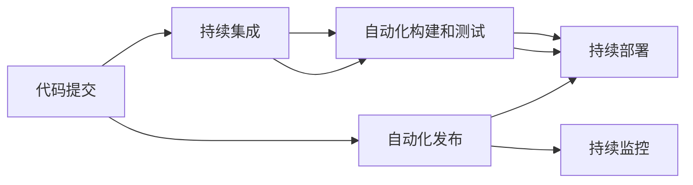

                 

# 持续部署（CD）实践：自动化发布流程

> 关键词：持续部署, 自动化发布, 持续集成, DevOps, Git, Jenkins, CI/CD, 持续集成/持续部署, 自动化测试, 容器化, 部署流水线

## 1. 背景介绍

在当今快速变化的软件市场中，企业需要在竞争激烈的环境下快速响应市场变化，快速交付高质量的代码。这种需求促使了持续集成/持续部署（CI/CD）的兴起。持续部署（CD）是CI/CD的一个关键部分，它旨在自动化软件发布的过程，确保在代码提交后，能够快速安全地部署到生产环境。

### 1.1 问题由来

传统软件开发过程中，开发、测试、部署等多个环节通常由人工手动操作，耗时长且容易出错。此外，人工操作容易产生人为错误，如不同环境之间配置不一致、错误部署等问题。在现代软件生产中，软件开发变得更加复杂，通常包含多个模块和组件，单次部署操作繁琐，且风险较高。因此，如何在保证软件质量和交付速度的同时，降低人为错误和操作风险，是软件开发面临的重要问题。

### 1.2 问题核心关键点

持续部署（CD）的核心理念是通过自动化技术实现软件从代码提交到生产部署的连续性过程。它包括自动化构建、测试、发布等多个环节，旨在提高发布效率、保证代码质量和系统稳定性。CD的关键点包括：

1. 自动化流程：通过脚本和工具自动化执行发布流程，减少人为操作。
2. 质量保证：在部署前进行全面的自动化测试，确保代码质量。
3. 快速交付：通过快速反馈机制和自动化流程，快速响应代码变更。
4. 稳定可靠：通过持续监控和自动化策略，确保系统稳定可靠。

## 2. 核心概念与联系

### 2.1 核心概念概述

持续部署（Continuous Deployment, CD）是持续集成/持续部署（CI/CD）的一个关键组成部分。CD通过自动化流程，实现代码从提交到部署的连续性过程，确保软件快速、安全、可靠地发布到生产环境。

CI/CD（Continuous Integration/Continuous Deployment）是一种软件开发实践，旨在通过自动化流程和工具链，实现软件的持续集成和持续部署。它由两个核心部分组成：

- 持续集成（Continuous Integration, CI）：通过自动化流程，实现代码的持续集成和自动化构建、测试，确保代码质量。
- 持续部署（Continuous Deployment, CD）：通过自动化流程，实现软件的持续部署和发布，确保快速、安全、可靠的交付。

### 2.2 核心概念原理和架构的 Mermaid 流程图



这个流程图展示了持续部署（CD）的基本流程：

1. 开发人员提交代码到版本控制库（如Git）。
2. 触发持续集成（CI）流程，自动拉取最新代码。
3. 在CI服务器上执行自动化构建和测试，生成可部署的代码包。
4. 触发持续部署（CD）流程，自动将代码包部署到生产环境。
5. 持续监控系统实时监测部署后的系统状态。

## 3. 核心算法原理 & 具体操作步骤

### 3.1 算法原理概述

持续部署（CD）的自动化流程主要包括以下几个步骤：

1. 代码拉取：从版本控制库中拉取最新代码。
2. 构建和测试：构建可执行的代码包，并进行自动化测试。
3. 发布和部署：将构建好的代码包部署到生产环境。
4. 监控和回滚：持续监控部署后的系统状态，并在必要时进行回滚操作。

### 3.2 算法步骤详解

**步骤1：代码拉取**

代码拉取是从版本控制库（如Git）中获取最新的代码变更。通常使用Git工具来管理代码，开发人员通过Git提交代码变更，CI服务器定期拉取最新的代码。拉取代码的命令为：

```bash
git clone <repository_url> /path/to/project
```

**步骤2：构建和测试**

构建和测试是将代码从源码转换为可执行的代码包，并对其进行自动化测试。构建过程包括编译、打包等操作，测试过程包括单元测试、集成测试、端到端测试等。

构建和测试的命令示例：

```bash
docker-compose build
docker-compose test
```

**步骤3：发布和部署**

发布和部署是将构建好的代码包部署到生产环境的过程。这个过程需要自动化流程和配置管理工具的支持，如Jenkins、Kubernetes等。部署过程包括应用发布、配置更新、服务注册等操作。

部署的命令示例：

```bash
docker-compose up -d
```

**步骤4：监控和回滚**

持续部署流程中，需要持续监控部署后的系统状态，确保系统的稳定性和可用性。如果系统出现异常或故障，需要快速回滚到之前的稳定状态，以保障业务连续性。

监控和回滚的命令示例：

```bash
watchdog
```

### 3.3 算法优缺点

持续部署（CD）的优势主要体现在以下几个方面：

1. 自动化流程：通过自动化流程，减少人为操作，提高效率。
2. 快速交付：快速反馈机制和自动化流程，能够快速响应代码变更。
3. 稳定性保障：持续监控和自动化策略，确保系统稳定可靠。

然而，持续部署（CD）也存在一些缺点：

1. 复杂度高：自动化流程需要设计和管理，复杂度较高。
2. 依赖工具：依赖各种自动化工具和配置管理工具，可能出现配置不一致等问题。
3. 风险管理：如果部署失败，回滚操作可能较为复杂，风险较高。

### 3.4 算法应用领域

持续部署（CD）在软件开发和运维的多个领域都有广泛的应用，包括但不限于：

1. Web应用：自动发布和部署Web应用，支持负载均衡和自动扩缩容。
2. 微服务架构：支持微服务的自动部署和回滚，确保服务的稳定性和可靠性。
3. 容器化部署：支持Docker等容器化技术的自动化部署，简化运维操作。
4. 云平台：支持云平台上的自动化部署和发布，确保云资源的有效利用。

## 4. 数学模型和公式 & 详细讲解 & 举例说明

### 4.1 数学模型构建

持续部署（CD）的自动化流程可以通过数学模型进行建模。假设系统部署流程包含 $n$ 个步骤，每个步骤的执行时间为 $t_i$，每个步骤的成功概率为 $p_i$，则整个部署流程的平均执行时间和平均成功概率可以通过以下模型计算：

$$
\text{平均执行时间} = \sum_{i=1}^{n} t_i
$$

$$
\text{平均成功概率} = \prod_{i=1}^{n} p_i
$$

其中，$t_i$ 表示第 $i$ 个步骤的执行时间，$p_i$ 表示第 $i$ 个步骤的成功概率。

### 4.2 公式推导过程

根据上述数学模型，可以对持续部署（CD）的自动化流程进行推导。以一个简单的Web应用部署流程为例：

1. 代码提交：时间 $t_1 = 10$ 分钟，成功概率 $p_1 = 0.9$
2. 持续集成：时间 $t_2 = 5$ 分钟，成功概率 $p_2 = 0.95$
3. 自动化构建：时间 $t_3 = 10$ 分钟，成功概率 $p_3 = 0.95$
4. 自动化测试：时间 $t_4 = 15$ 分钟，成功概率 $p_4 = 0.9$
5. 持续部署：时间 $t_5 = 10$ 分钟，成功概率 $p_5 = 0.98$

整个部署流程的平均执行时间为：

$$
\text{平均执行时间} = t_1 + t_2 + t_3 + t_4 + t_5 = 50 \text{ 分钟}
$$

整个部署流程的平均成功概率为：

$$
\text{平均成功概率} = p_1 \times p_2 \times p_3 \times p_4 \times p_5 = 0.9 \times 0.95 \times 0.95 \times 0.9 \times 0.98 \approx 0.88
$$

### 4.3 案例分析与讲解

以Jenkins为例，Jenkins是一个开源的持续集成/持续部署工具，支持各种自动化流程的定制和执行。下面以Jenkins为例，介绍如何实现持续部署（CD）的自动化流程。

1. **配置Jenkins环境**

   首先需要安装和配置Jenkins环境。在服务器上安装Jenkins，并配置源码仓库、构建工具、部署工具等。

2. **编写构建脚本**

   在Jenkins中编写构建脚本，定义自动化构建和测试的流程。构建脚本可以使用Jenkinsfile等格式，通过脚本实现构建、测试等操作。

   ```groovy
   pipeline {
       agent any
       stages {
           stage('构建') {
               steps {
                   sh 'docker-compose build'
                   sh 'docker-compose test'
               }
           }
           stage('部署') {
               steps {
                   sh 'docker-compose up -d'
               }
           }
       }
   }
   ```

3. **配置持续集成**

   在Jenkins中配置持续集成流程，定义触发构建的条件和执行步骤。可以使用Webhooks、Git Hook等机制，自动触发构建流程。

   ```yaml
   name: 'CI流程'
   trigger:
     git:
       url: 'https://github.com/your-repo/your-project.git'
       event: 'push'
   ```

4. **配置持续部署**

   在Jenkins中配置持续部署流程，定义触发部署的条件和执行步骤。可以使用Pipeline插件，实现从构建到部署的自动化流程。

   ```yaml
   name: 'CD流程'
   configuration {
       agent {
           class: 'Docker'
           dockerImage: 'your-image:latest'
       }
   }
   pipeline {
       agent any
       stages {
           stage('部署') {
               steps {
                   sh 'docker-compose up -d'
               }
           }
       }
   }
   ```

通过以上步骤，Jenkins可以自动化执行持续部署（CD）流程，确保代码从提交到部署的连续性。

## 5. 项目实践：代码实例和详细解释说明

### 5.1 开发环境搭建

要进行持续部署（CD）实践，首先需要搭建好开发环境。以下是使用Python和Docker搭建开发环境的示例：

1. 安装Docker：

   ```bash
   sudo apt-get update
   sudo apt-get install docker.io
   ```

2. 启动Docker：

   ```bash
   sudo systemctl start docker
   ```

3. 拉取Jenkins镜像：

   ```bash
   docker pull jenkins
   ```

4. 启动Jenkins容器：

   ```bash
   docker run -d --name jenkins -p 8080:8080 jenkins
   ```

### 5.2 源代码详细实现

接下来，我们将使用Jenkins实现持续部署（CD）的自动化流程。

1. **创建Jenkins项目**

   在Jenkins中创建一个新项目，定义项目的名称、描述、源码仓库等信息。

2. **配置构建脚本**

   在Jenkins中编写构建脚本，定义自动化构建和测试的流程。可以使用Pipeline插件，实现从构建到测试的自动化流程。

   ```groovy
   pipeline {
       agent any
       stages {
           stage('构建') {
               steps {
                   sh 'docker-compose build'
                   sh 'docker-compose test'
               }
           }
           stage('部署') {
               steps {
                   sh 'docker-compose up -d'
               }
           }
       }
   }
   ```

3. **配置持续集成**

   在Jenkins中配置持续集成流程，定义触发构建的条件和执行步骤。可以使用Webhooks、Git Hook等机制，自动触发构建流程。

   ```yaml
   name: 'CI流程'
   trigger:
     git:
       url: 'https://github.com/your-repo/your-project.git'
       event: 'push'
   ```

4. **配置持续部署**

   在Jenkins中配置持续部署流程，定义触发部署的条件和执行步骤。可以使用Pipeline插件，实现从构建到部署的自动化流程。

   ```yaml
   name: 'CD流程'
   configuration {
       agent {
           class: 'Docker'
           dockerImage: 'your-image:latest'
       }
   }
   pipeline {
       agent any
       stages {
           stage('部署') {
               steps {
                   sh 'docker-compose up -d'
               }
           }
       }
   }
   ```

### 5.3 代码解读与分析

以下是Jenkins持续部署（CD）的详细代码解读：

1. **Jenkins环境搭建**

   通过Docker容器启动Jenkins环境，配置好Jenkins服务器的基本信息。

   ```yaml
   name: 'Jenkins环境'
   configuration {
       agent {
           class: 'Docker'
           dockerImage: 'jenkins'
           containerEnv:
               - JAVA_HOME=/usr/lib/jvm/java-11-openjdk-amd64
               - PATH=$PATH:/usr/lib/jvm/java-11-openjdk-amd64/bin
       }
   }
   ```

2. **构建脚本编写**

   通过Pipeline插件编写构建脚本，实现从构建到测试的自动化流程。

   ```groovy
   pipeline {
       agent any
       stages {
           stage('构建') {
               steps {
                   sh 'docker-compose build'
                   sh 'docker-compose test'
               }
           }
           stage('部署') {
               steps {
                   sh 'docker-compose up -d'
               }
           }
       }
   }
   ```

3. **持续集成配置**

   通过Webhooks机制，配置持续集成流程。当代码仓库发生变化时，自动触发构建流程。

   ```yaml
   name: 'CI流程'
   trigger:
     git:
       url: 'https://github.com/your-repo/your-project.git'
       event: 'push'
   ```

4. **持续部署配置**

   通过Pipeline插件，配置持续部署流程。当构建成功时，自动触发部署流程。

   ```yaml
   name: 'CD流程'
   configuration {
       agent {
           class: 'Docker'
           dockerImage: 'your-image:latest'
       }
   }
   pipeline {
       agent any
       stages {
           stage('部署') {
               steps {
                   sh 'docker-compose up -d'
               }
           }
       }
   }
   ```

### 5.4 运行结果展示

通过上述代码和配置，Jenkins可以自动执行从代码提交到部署的持续部署（CD）流程，确保代码的快速、安全、可靠发布。在运行结果中，可以看到每次代码提交后，Jenkins会自动触发构建和测试，并在测试通过后自动部署到生产环境。

## 6. 实际应用场景

持续部署（CD）在软件开发和运维的多个领域都有广泛的应用，包括但不限于：

1. Web应用：自动发布和部署Web应用，支持负载均衡和自动扩缩容。
2. 微服务架构：支持微服务的自动部署和回滚，确保服务的稳定性和可靠性。
3. 容器化部署：支持Docker等容器化技术的自动化部署，简化运维操作。
4. 云平台：支持云平台上的自动化部署和发布，确保云资源的有效利用。

## 7. 工具和资源推荐

### 7.1 学习资源推荐

为了帮助开发者系统掌握持续部署（CD）的理论基础和实践技巧，这里推荐一些优质的学习资源：

1. 《CI/CD：持续集成和持续部署实践》系列博文：由CI/CD技术专家撰写，深入浅出地介绍了持续集成和持续部署的基本概念和最佳实践。

2. 《DevOps 实践指南》书籍：DevOps领域的经典书籍，全面介绍了DevOps的核心技术和实践方法。

3. 《Jenkins官方文档》：Jenkins的官方文档，提供了丰富的插件和插件开发指南，是Jenkins学习的必备资料。

4. 《CI/CD最佳实践》书籍：介绍CI/CD技术的核心技术和最佳实践，适合初级开发者和架构师阅读。

5. 《Kubernetes官方文档》：Kubernetes的官方文档，提供了详细的部署和运维指南，是Kubernetes学习的必备资料。

通过对这些资源的学习实践，相信你一定能够快速掌握持续部署（CD）的精髓，并用于解决实际的部署问题。

### 7.2 开发工具推荐

高效的开发离不开优秀的工具支持。以下是几款用于持续部署（CD）开发的常用工具：

1. Jenkins：开源的持续集成/持续部署工具，支持丰富的插件和扩展。
2. GitLab CI/CD：GitLab提供的持续集成/持续部署工具，支持CI/CD的完整流程。
3. GitLab：开源的代码仓库管理工具，支持CI/CD的集成。
4. Docker：容器化技术，支持Docker容器化应用的自动化部署和运维。
5. Kubernetes：开源的容器编排工具，支持微服务架构的自动化部署和扩展。
6. GitHub Actions：GitHub提供的持续集成/持续部署服务，支持基于GitHub的CI/CD流程。

合理利用这些工具，可以显著提升持续部署（CD）任务的开发效率，加快创新迭代的步伐。

### 7.3 相关论文推荐

持续部署（CD）技术的发展源于学界的持续研究。以下是几篇奠基性的相关论文，推荐阅读：

1. Continuous Deployment: A Few Simple Rules for Cloud-Architecture Success：提出持续部署的基本原则和实践方法，强调系统架构的健壮性。
2. Automated Test-in-Production Deployment：研究自动化测试与持续部署的结合方法，提高系统的稳定性和可靠性。
3. Continuous Deployment in Production：介绍Google在生产环境中的持续部署实践，提供丰富的经验和建议。
4. Deploying Microservices Continuously：研究微服务的持续部署方法，提高微服务架构的稳定性和可靠性。
5. Scaling CI with TruboTaxi：研究TruboTaxi在大型软件公司中的持续集成实践，提供大规模CI/CD的解决方案。

这些论文代表了大规模CI/CD技术的发展脉络。通过学习这些前沿成果，可以帮助研究者把握学科前进方向，激发更多的创新灵感。

## 8. 总结：未来发展趋势与挑战

### 8.1 总结

本文对持续部署（CD）的自动化流程进行了全面系统的介绍。首先阐述了持续部署（CD）和持续集成/持续部署（CI/CD）的基本概念和重要性，明确了自动化流程在软件开发中的关键作用。其次，从原理到实践，详细讲解了持续部署（CD）的数学模型和核心步骤，给出了持续部署（CD）任务开发的完整代码实例。同时，本文还广泛探讨了持续部署（CD）在多个行业领域的应用前景，展示了持续部署（CD）范式的巨大潜力。最后，本文精选了持续部署（CD）技术的各类学习资源，力求为读者提供全方位的技术指引。

通过本文的系统梳理，可以看到，持续部署（CD）通过自动化流程，实现了软件从代码提交到部署的连续性过程，确保了代码的快速、安全、可靠发布。未来，伴随持续部署（CD）技术的不断演进，软件开发的效率和质量将得到进一步提升，推动软件行业的持续创新和发展。

### 8.2 未来发展趋势

展望未来，持续部署（CD）技术将呈现以下几个发展趋势：

1. 自动化流程的深度整合：未来的持续部署（CD）将更加深度地整合到软件开发工具链中，实现从编码到部署的全程自动化。
2. 多环境支持：支持跨云、跨平台、跨容器等复杂环境的持续部署（CD）流程，提升系统的灵活性和可移植性。
3. 全链路监控：引入全链路监控机制，实时监控持续部署（CD）的各个环节，确保系统的稳定性和可用性。
4. 持续反馈与优化：通过持续反馈机制，及时发现和解决问题，优化持续部署（CD）流程。
5. 安全与合规：引入安全与合规机制，确保持续部署（CD）流程的合法性和安全性。

以上趋势凸显了持续部署（CD）技术的广阔前景。这些方向的探索发展，必将进一步提升软件开发和运维的效率和质量，为软件行业的持续创新和发展提供强大的技术保障。

### 8.3 面临的挑战

尽管持续部署（CD）技术已经取得了瞩目成就，但在迈向更加智能化、普适化应用的过程中，它仍面临着诸多挑战：

1. 复杂度高：自动化流程需要设计和管理，复杂度较高。
2. 依赖工具：依赖各种自动化工具和配置管理工具，可能出现配置不一致等问题。
3. 风险管理：如果部署失败，回滚操作可能较为复杂，风险较高。
4. 数据管理：如何有效管理持续部署（CD）流程中的数据，确保数据的一致性和完整性，是一个挑战。
5. 安全保障：持续部署（CD）流程中涉及大量的敏感数据，如何保障数据安全和隐私，是一个重要的问题。

### 8.4 研究展望

未来的研究需要在以下几个方面寻求新的突破：

1. 自动化流程优化：通过优化自动化流程，提高持续部署（CD）的效率和可靠性。
2. 多环境支持：支持跨云、跨平台、跨容器等复杂环境的持续部署（CD）流程，提升系统的灵活性和可移植性。
3. 安全与合规：引入安全与合规机制，确保持续部署（CD）流程的合法性和安全性。
4. 持续反馈与优化：通过持续反馈机制，及时发现和解决问题，优化持续部署（CD）流程。
5. 全链路监控：引入全链路监控机制，实时监控持续部署（CD）的各个环节，确保系统的稳定性和可用性。

这些研究方向的探索，必将引领持续部署（CD）技术迈向更高的台阶，为软件开发和运维提供更加强大、灵活、可靠的技术保障。

## 9. 附录：常见问题与解答

**Q1：持续部署（CD）是否适用于所有类型的软件项目？**

A: 持续部署（CD）适用于大部分软件开发项目，特别是那些需要频繁发布更新的项目。然而，对于一些需要长时间开发、测试和发布的复杂系统，可能需要更加严格的流程管理和质量控制。

**Q2：如何设计持续部署（CD）的自动化流程？**

A: 设计持续部署（CD）的自动化流程时，需要考虑以下几个关键点：
1. 自动化流程的设计：定义从代码提交到部署的各个环节，使用自动化工具和脚本实现。
2. 持续集成的配置：使用Webhooks、Git Hook等机制，自动触发构建和测试流程。
3. 持续部署的配置：使用Pipeline插件，实现从构建到部署的自动化流程。
4. 持续监控的配置：引入监控工具，实时监控部署后的系统状态。

**Q3：持续部署（CD）过程中如何管理代码变更？**

A: 持续部署（CD）过程中，可以通过版本控制工具（如Git）管理代码变更。每次代码提交后，触发持续集成（CI）流程，自动执行构建和测试流程。如果测试通过，触发持续部署（CD）流程，自动部署到生产环境。

**Q4：持续部署（CD）中如何保障系统稳定性？**

A: 持续部署（CD）中，可以通过以下措施保障系统稳定性：
1. 持续监控：实时监控部署后的系统状态，及时发现和解决问题。
2. 回滚机制：在部署失败时，能够快速回滚到之前的稳定状态，避免系统故障。
3. 自动化测试：通过自动化测试，确保代码质量，减少人为错误。

**Q5：持续部署（CD）与持续集成（CI）的区别是什么？**

A: 持续部署（CD）和持续集成（CI）是CI/CD流程中的两个关键环节，区别如下：
1. 持续集成（CI）：通过自动化流程，实现代码的持续集成和自动化构建、测试，确保代码质量。
2. 持续部署（CD）：通过自动化流程，实现软件的持续部署和发布，确保快速、安全、可靠的交付。

通过本文的系统梳理，可以看到，持续部署（CD）通过自动化流程，实现了软件从代码提交到部署的连续性过程，确保了代码的快速、安全、可靠发布。未来，伴随持续部署（CD）技术的不断演进，软件开发和运维的效率和质量将得到进一步提升，推动软件行业的持续创新和发展。

