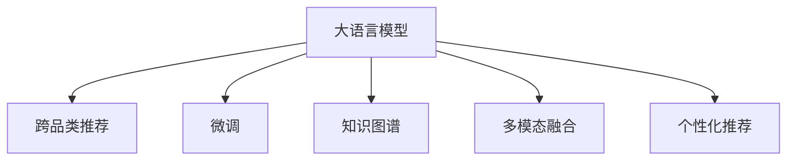
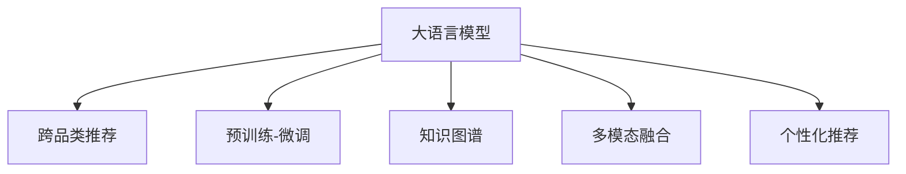

                 

# 探索AI大模型在电商平台跨品类推荐中的潜力

## 1. 背景介绍

### 1.1 问题由来

在数字化时代，电商平台已经成为连接商品与消费者、满足其购物需求的重要渠道。然而，当前平台推荐系统大多基于传统的协同过滤、内容基推荐等方法，在跨品类推荐上存在着诸多挑战：

1. **高维稀疏性**：电商平台商品种类繁多，用户历史行为数据稀疏且维度高，建模复杂度大。
2. **隐式反馈问题**：用户行为数据多为隐式反馈（如浏览、点击、加购等），存在噪声干扰，难以精准建模。
3. **多品类的知识迁移**：不同品类商品之间缺乏知识关联，推荐模型难以跨品类迁移。
4. **个性化需求多样**：用户需求多样，单一模型难以满足个性化推荐的需求。

随着AI技术的发展，特别是大语言模型（Large Language Models, LLMs）和预训练-微调（Pre-training & Fine-tuning）方法的应用，为电商平台跨品类推荐带来了新的机遇。大语言模型通过大规模预训练，能够学习和存储丰富的商品属性和关联知识，通过微调可以在特定领域高效适配，满足不同品类推荐的需求。

### 1.2 问题核心关键点

为进一步探索大语言模型在电商平台跨品类推荐中的应用，本节将介绍几个关键点：

1. **大语言模型**：以BERT、GPT等架构的预训练语言模型，通过在大规模无标签文本语料上进行预训练，学习通用的语言表示，具备强大的语言理解和生成能力。
2. **跨品类推荐**：通过构建大语言模型，实现不同品类商品之间的知识迁移和推荐，提升用户购物体验和平台转化率。
3. **微调技术**：在预训练模型基础上，使用特定领域的数据进行有监督的微调，提高模型在该领域的应用效果。
4. **知识图谱**：构建商品-属性-类别之间的关联知识图谱，辅助大语言模型在跨品类推荐中学习更丰富的知识。
5. **多模态融合**：融合商品图片、评论、评分等多模态数据，丰富推荐模型的输入信息，提升推荐质量。
6. **个性化推荐**：根据用户行为和属性，定制个性化推荐策略，提升推荐的相关性和多样性。

这些核心概念之间的逻辑关系可以通过以下Mermaid流程图来展示：



这个流程图展示了大语言模型在跨品类推荐中的核心概念及其之间的关系：

1. 大语言模型通过预训练获得基础能力。
2. 跨品类推荐依赖于大模型的知识迁移能力。
3. 微调使得通用大模型更好地适应特定品类推荐。
4. 知识图谱为跨品类推荐提供知识指导。
5. 多模态融合丰富了推荐输入信息。
6. 个性化推荐进一步提升推荐效果。

## 2. 核心概念与联系

### 2.1 核心概念概述

为更好地理解大语言模型在电商平台跨品类推荐中的应用，本节将介绍几个密切相关的核心概念：

- **大语言模型(Large Language Model, LLM)**：以自回归(如GPT)或自编码(如BERT)模型为代表的大规模预训练语言模型。通过在大规模无标签文本语料上进行预训练，学习通用的语言表示，具备强大的语言理解和生成能力。
- **跨品类推荐**：根据用户历史行为和商品属性，推荐不同品类商品的技术，包括商品类别、风格、品牌等跨品类商品。
- **预训练-微调(Pre-training & Fine-tuning)**：在无标签文本语料上预训练模型，再使用特定领域数据进行有监督的微调，使得模型在特定领域任务上性能提升。
- **知识图谱**：构建商品、属性、类别之间的关联知识图谱，辅助模型理解复杂商品间的知识关系。
- **多模态融合**：将文本、图像、声音等多模态数据进行融合，丰富推荐模型的输入信息。
- **个性化推荐**：根据用户属性、行为和偏好，定制个性化推荐策略，提升推荐的相关性和多样性。

这些核心概念之间的逻辑关系可以通过以下Mermaid流程图来展示：



这个流程图展示了大语言模型在跨品类推荐中的核心概念及其之间的关系：

1. 大语言模型通过预训练获得基础能力。
2. 跨品类推荐依赖于大模型的知识迁移能力。
3. 预训练-微调使得通用大模型更好地适应特定品类推荐。
4. 知识图谱为跨品类推荐提供知识指导。
5. 多模态融合丰富了推荐输入信息。
6. 个性化推荐进一步提升推荐效果。

## 3. 核心算法原理 & 具体操作步骤

### 3.1 算法原理概述

大语言模型在电商平台跨品类推荐中的应用，本质上是一个多领域的预训练-微调过程。其核心思想是：将大语言模型视作一个强大的"商品知识库"，通过微调在不同品类推荐数据上优化模型，使得模型在特定品类推荐中具备更强的表现。

具体而言，假设大语言模型为 $M_{\theta}$，其中 $\theta$ 为模型参数。电商平台上不同品类推荐数据集为 $D=\{(x_i,y_i)\}_{i=1}^N, x_i \in \mathcal{X}, y_i \in \mathcal{Y}$，其中 $\mathcal{X}$ 为商品特征空间，$\mathcal{Y}$ 为推荐结果空间。微调的目标是找到新的模型参数 $\hat{\theta}$，使得：

$$
\hat{\theta}=\mathop{\arg\min}_{\theta} \mathcal{L}(M_{\theta},D)
$$

其中 $\mathcal{L}$ 为针对品类推荐设计的损失函数，用于衡量模型预测结果与真实标签之间的差异。常见的损失函数包括交叉熵损失、均方误差损失等。

通过梯度下降等优化算法，微调过程不断更新模型参数 $\theta$，最小化损失函数 $\mathcal{L}$，使得模型输出逼近真实标签。由于 $\theta$ 已经通过预训练获得了较好的初始化，因此即便在多品类推荐数据上微调，也能较快收敛到理想的模型参数 $\hat{\theta}$。

### 3.2 算法步骤详解

基于大语言模型在电商平台跨品类推荐中的应用，通常包含以下关键步骤：

**Step 1: 准备预训练模型和数据集**
- 选择合适的预训练语言模型 $M_{\theta}$ 作为初始化参数，如 BERT、GPT等。
- 准备不同品类推荐数据集 $D$，包括训练集、验证集和测试集。一般要求不同品类推荐数据与预训练数据的分布不要差异过大。

**Step 2: 数据预处理**
- 收集和清洗不同品类商品的属性信息，构建商品-属性-类别关联的知识图谱。
- 将商品属性向量化，进行归一化、标准化处理。
- 对于不同品类推荐数据，进行特征工程，提取关键特征，如商品类别、风格、价格等。

**Step 3: 模型适配**
- 根据不同品类推荐任务，在预训练模型的顶层设计合适的输出层和损失函数。
- 对于分类任务，通常在顶层添加线性分类器和交叉熵损失函数。
- 对于排序任务，通常使用语言模型的解码器输出概率分布，并以负对数似然为损失函数。

**Step 4: 设置微调超参数**
- 选择合适的优化算法及其参数，如 AdamW、SGD 等，设置学习率、批大小、迭代轮数等。
- 设置正则化技术及强度，包括权重衰减、Dropout、Early Stopping 等。
- 确定冻结预训练参数的策略，如仅微调顶层，或全部参数都参与微调。

**Step 5: 执行梯度训练**
- 将训练集数据分批次输入模型，前向传播计算损失函数。
- 反向传播计算参数梯度，根据设定的优化算法和学习率更新模型参数。
- 周期性在验证集上评估模型性能，根据性能指标决定是否触发 Early Stopping。
- 重复上述步骤直到满足预设的迭代轮数或 Early Stopping 条件。

**Step 6: 测试和部署**
- 在测试集上评估微调后模型 $M_{\hat{\theta}}$ 的性能，对比微调前后的精度提升。
- 使用微调后的模型对新商品进行推荐，集成到实际的应用系统中。
- 持续收集新商品数据，定期重新微调模型，以适应数据分布的变化。

以上是基于大语言模型在电商平台跨品类推荐中的应用的一般流程。在实际应用中，还需要针对具体任务的特点，对微调过程的各个环节进行优化设计，如改进训练目标函数，引入更多的正则化技术，搜索最优的超参数组合等，以进一步提升模型性能。

### 3.3 算法优缺点

基于大语言模型在电商平台跨品类推荐中的应用，具有以下优点：

1. **多品类知识迁移**：大语言模型通过预训练学习到丰富的商品属性和关联知识，通过微调可以将其迁移到不同品类商品推荐中，提升推荐效果。
2. **高效参数利用**：在微调过程中，可以通过参数高效微调技术，只更新少量的模型参数，以提高微调效率，避免过拟合。
3. **适应性广泛**：不同品类推荐任务的特点各异，大语言模型可以通过微调灵活适应，提供个性化的推荐服务。
4. **推荐质量高**：通过微调，大语言模型可以更好地理解不同品类商品的关联性和用户需求，生成更精准、相关的推荐结果。

同时，该方法也存在一些局限性：

1. **标注成本高**：微调依赖于不同品类推荐数据集的标注，标注成本较高。
2. **模型复杂度高**：大语言模型参数量庞大，模型复杂度高，对计算资源和存储资源要求较高。
3. **泛化能力不足**：预训练模型的泛化能力有限，在特定品类推荐数据上可能表现不佳。
4. **冷启动问题**：新商品或新用户的推荐效果可能受限于历史数据不足。
5. **数据异质性问题**：不同品类推荐数据之间可能存在较大差异，模型难以统一建模。

尽管存在这些局限性，但就目前而言，基于大语言模型的微调方法仍是在电商平台跨品类推荐中表现优秀的技术范式。未来相关研究的重点在于如何进一步降低微调对标注数据的依赖，提高模型的泛化能力，同时兼顾可解释性和伦理安全性等因素。

### 3.4 算法应用领域

基于大语言模型在电商平台跨品类推荐中的应用，已经在多个行业领域得到了广泛应用，例如：

1. **服装服饰**：根据用户历史购买和浏览行为，推荐不同品类（如男装、女装、运动服等）的服饰商品。
2. **美妆个护**：推荐不同品类（如护肤品、彩妆、香水等）的美妆商品，提供个性化的护肤和美妆建议。
3. **家电家居**：推荐不同品类（如厨房电器、卧室电器、浴室电器等）的家电家居商品，提升家居生活品质。
4. **图书阅读**：根据用户历史阅读行为，推荐不同品类（如文学、科学、教育等）的图书，满足用户多样化的阅读需求。
5. **旅游出行**：推荐不同品类（如机票、酒店、景点等）的旅游商品，提供个性化旅游建议和服务。
6. **美食餐饮**：推荐不同品类（如快餐、正餐、小吃等）的美食商品，满足用户多样化的餐饮需求。

除了上述这些经典应用外，大语言模型在跨品类推荐中的应用还在不断扩展，如智能家居、智能穿戴等新兴领域，为电商平台的智能化转型提供新的思路和方向。

## 4. 数学模型和公式 & 详细讲解 & 举例说明

### 4.1 数学模型构建

本节将使用数学语言对基于大语言模型在电商平台跨品类推荐中的应用进行更加严格的刻画。

记大语言模型为 $M_{\theta}:\mathcal{X} \rightarrow \mathcal{Y}$，其中 $\mathcal{X}$ 为商品特征空间，$\mathcal{Y}$ 为推荐结果空间，$\theta$ 为模型参数。假设跨品类推荐任务数据集为 $D=\{(x_i,y_i)\}_{i=1}^N, x_i \in \mathcal{X}, y_i \in \mathcal{Y}$。

定义模型 $M_{\theta}$ 在数据样本 $(x,y)$ 上的损失函数为 $\ell(M_{\theta}(x),y)$，则在数据集 $D$ 上的经验风险为：

$$
\mathcal{L}(\theta) = \frac{1}{N} \sum_{i=1}^N \ell(M_{\theta}(x_i),y_i)
$$

微调的优化目标是最小化经验风险，即找到最优参数：

$$
\theta^* = \mathop{\arg\min}_{\theta} \mathcal{L}(\theta)
$$

在实践中，我们通常使用基于梯度的优化算法（如SGD、Adam等）来近似求解上述最优化问题。设 $\eta$ 为学习率，$\lambda$ 为正则化系数，则参数的更新公式为：

$$
\theta \leftarrow \theta - \eta \nabla_{\theta}\mathcal{L}(\theta) - \eta\lambda\theta
$$

其中 $\nabla_{\theta}\mathcal{L}(\theta)$ 为损失函数对参数 $\theta$ 的梯度，可通过反向传播算法高效计算。

### 4.2 公式推导过程

以下我们以服装服饰品类推荐为例，推导交叉熵损失函数及其梯度的计算公式。

假设模型 $M_{\theta}$ 在输入 $x$ 上的输出为 $\hat{y}=M_{\theta}(x) \in [0,1]$，表示商品属于某品类（如男装）的概率。真实标签 $y \in \{0,1\}$。则二分类交叉熵损失函数定义为：

$$
\ell(M_{\theta}(x),y) = -[y\log \hat{y} + (1-y)\log (1-\hat{y})]
$$

将其代入经验风险公式，得：

$$
\mathcal{L}(\theta) = -\frac{1}{N}\sum_{i=1}^N [y_i\log M_{\theta}(x_i)+(1-y_i)\log(1-M_{\theta}(x_i))]
$$

根据链式法则，损失函数对参数 $\theta_k$ 的梯度为：

$$
\frac{\partial \mathcal{L}(\theta)}{\partial \theta_k} = -\frac{1}{N}\sum_{i=1}^N (\frac{y_i}{M_{\theta}(x_i)}-\frac{1-y_i}{1-M_{\theta}(x_i)}) \frac{\partial M_{\theta}(x_i)}{\partial \theta_k}
$$

其中 $\frac{\partial M_{\theta}(x_i)}{\partial \theta_k}$ 可进一步递归展开，利用自动微分技术完成计算。

在得到损失函数的梯度后，即可带入参数更新公式，完成模型的迭代优化。重复上述过程直至收敛，最终得到适应不同品类推荐任务的最优模型参数 $\theta^*$。

### 4.3 案例分析与讲解

下面以服装服饰品类推荐为例，给出使用Transformer库对BERT模型进行微调的PyTorch代码实现。

首先，定义品类推荐数据处理函数：

```python
from transformers import BertTokenizer
from torch.utils.data import Dataset
import torch

class ClothingDataset(Dataset):
    def __init__(self, texts, labels, tokenizer, max_len=128):
        self.texts = texts
        self.labels = labels
        self.tokenizer = tokenizer
        self.max_len = max_len
        
    def __len__(self):
        return len(self.texts)
    
    def __getitem__(self, item):
        text = self.texts[item]
        label = self.labels[item]
        
        encoding = self.tokenizer(text, return_tensors='pt', max_length=self.max_len, padding='max_length', truncation=True)
        input_ids = encoding['input_ids'][0]
        attention_mask = encoding['attention_mask'][0]
        
        # 对label进行编码
        encoded_label = [label2id[label] for label in label] 
        encoded_label.extend([label2id['O']] * (self.max_len - len(encoded_label)))
        labels = torch.tensor(encoded_label, dtype=torch.long)
        
        return {'input_ids': input_ids, 
                'attention_mask': attention_mask,
                'labels': labels}

# 标签与id的映射
label2id = {'男装': 0, '女装': 1, '运动服': 2, '童装': 3, '鞋': 4, '包': 5, '眼镜': 6}
id2label = {v: k for k, v in label2id.items()}

# 创建dataset
tokenizer = BertTokenizer.from_pretrained('bert-base-cased')

train_dataset = ClothingDataset(train_texts, train_labels, tokenizer)
dev_dataset = ClothingDataset(dev_texts, dev_labels, tokenizer)
test_dataset = ClothingDataset(test_texts, test_labels, tokenizer)
```

然后，定义模型和优化器：

```python
from transformers import BertForTokenClassification, AdamW

model = BertForTokenClassification.from_pretrained('bert-base-cased', num_labels=len(label2id))

optimizer = AdamW(model.parameters(), lr=2e-5)
```

接着，定义训练和评估函数：

```python
from torch.utils.data import DataLoader
from tqdm import tqdm
from sklearn.metrics import classification_report

device = torch.device('cuda') if torch.cuda.is_available() else torch.device('cpu')
model.to(device)

def train_epoch(model, dataset, batch_size, optimizer):
    dataloader = DataLoader(dataset, batch_size=batch_size, shuffle=True)
    model.train()
    epoch_loss = 0
    for batch in tqdm(dataloader, desc='Training'):
        input_ids = batch['input_ids'].to(device)
        attention_mask = batch['attention_mask'].to(device)
        labels = batch['labels'].to(device)
        model.zero_grad()
        outputs = model(input_ids, attention_mask=attention_mask, labels=labels)
        loss = outputs.loss
        epoch_loss += loss.item()
        loss.backward()
        optimizer.step()
    return epoch_loss / len(dataloader)

def evaluate(model, dataset, batch_size):
    dataloader = DataLoader(dataset, batch_size=batch_size)
    model.eval()
    preds, labels = [], []
    with torch.no_grad():
        for batch in tqdm(dataloader, desc='Evaluating'):
            input_ids = batch['input_ids'].to(device)
            attention_mask = batch['attention_mask'].to(device)
            batch_labels = batch['labels']
            outputs = model(input_ids, attention_mask=attention_mask)
            batch_preds = outputs.logits.argmax(dim=2).to('cpu').tolist()
            batch_labels = batch_labels.to('cpu').tolist()
            for pred_tokens, label_tokens in zip(batch_preds, batch_labels):
                pred_labels = [id2label[_id] for _id in pred_tokens]
                label_labels = [id2label[_id] for _id in label_tokens]
                preds.append(pred_labels[:len(label_labels)])
                labels.append(label_labels)
                
    print(classification_report(labels, preds))
```

最后，启动训练流程并在测试集上评估：

```python
epochs = 5
batch_size = 16

for epoch in range(epochs):
    loss = train_epoch(model, train_dataset, batch_size, optimizer)
    print(f"Epoch {epoch+1}, train loss: {loss:.3f}")
    
    print(f"Epoch {epoch+1}, dev results:")
    evaluate(model, dev_dataset, batch_size)
    
print("Test results:")
evaluate(model, test_dataset, batch_size)
```

以上就是使用PyTorch对BERT进行服装服饰品类推荐微调的完整代码实现。可以看到，得益于Transformer库的强大封装，我们可以用相对简洁的代码完成BERT模型的加载和微调。

## 5. 项目实践：代码实例和详细解释说明

### 5.1 开发环境搭建

在进行微调实践前，我们需要准备好开发环境。以下是使用Python进行PyTorch开发的环境配置流程：

1. 安装Anaconda：从官网下载并安装Anaconda，用于创建独立的Python环境。

2. 创建并激活虚拟环境：
```bash
conda create -n pytorch-env python=3.8 
conda activate pytorch-env
```

3. 安装PyTorch：根据CUDA版本，从官网获取对应的安装命令。例如：
```bash
conda install pytorch torchvision torchaudio cudatoolkit=11.1 -c pytorch -c conda-forge
```

4. 安装Transformers库：
```bash
pip install transformers
```

5. 安装各类工具包：
```bash
pip install numpy pandas scikit-learn matplotlib tqdm jupyter notebook ipython
```

完成上述步骤后，即可在`pytorch-env`环境中开始微调实践。

### 5.2 源代码详细实现

下面我以服装服饰品类推荐为例，给出使用Transformers库对BERT模型进行微调的PyTorch代码实现。

首先，定义品类推荐数据处理函数：

```python
from transformers import BertTokenizer
from torch.utils.data import Dataset
import torch

class ClothingDataset(Dataset):
    def __init__(self, texts, labels, tokenizer, max_len=128):
        self.texts = texts
        self.labels = labels
        self.tokenizer = tokenizer
        self.max_len = max_len
        
    def __len__(self):
        return len(self.texts)
    
    def __getitem__(self, item):
        text = self.texts[item]
        label = self.labels[item]
        
        encoding = self.tokenizer(text, return_tensors='pt', max_length=self.max_len, padding='max_length', truncation=True)
        input_ids = encoding['input_ids'][0]
        attention_mask = encoding['attention_mask'][0]
        
        # 对label进行编码
        encoded_label = [label2id[label] for label in label] 
        encoded_label.extend([label2id['O']] * (self.max_len - len(encoded_label)))
        labels = torch.tensor(encoded_label, dtype=torch.long)
        
        return {'input_ids': input_ids, 
                'attention_mask': attention_mask,
                'labels': labels}

# 标签与id的映射
label2id = {'男装': 0, '女装': 1, '运动服': 2, '童装': 3, '鞋': 4, '包': 5, '眼镜': 6}
id2label = {v: k for k, v in label2id.items()}

# 创建dataset
tokenizer = BertTokenizer.from_pretrained('bert-base-cased')

train_dataset = ClothingDataset(train_texts, train_labels, tokenizer)
dev_dataset = ClothingDataset(dev_texts, dev_labels, tokenizer)
test_dataset = ClothingDataset(test_texts, test_labels, tokenizer)
```

然后，定义模型和优化器：

```python
from transformers import BertForTokenClassification, AdamW

model = BertForTokenClassification.from_pretrained('bert-base-cased', num_labels=len(label2id))

optimizer = AdamW(model.parameters(), lr=2e-5)
```

接着，定义训练和评估函数：

```python
from torch.utils.data import DataLoader
from tqdm import tqdm
from sklearn.metrics import classification_report

device = torch.device('cuda') if torch.cuda.is_available() else torch.device('cpu')
model.to(device)

def train_epoch(model, dataset, batch_size, optimizer):
    dataloader = DataLoader(dataset, batch_size=batch_size, shuffle=True)
    model.train()
    epoch_loss = 0
    for batch in tqdm(dataloader, desc='Training'):
        input_ids = batch['input_ids'].to(device)
        attention_mask = batch['attention_mask'].to(device)
        labels = batch['labels'].to(device)
        model.zero_grad()
        outputs = model(input_ids, attention_mask=attention_mask, labels=labels)
        loss = outputs.loss
        epoch_loss += loss.item()
        loss.backward()
        optimizer.step()
    return epoch_loss / len(dataloader)

def evaluate(model, dataset, batch_size):
    dataloader = DataLoader(dataset, batch_size=batch_size)
    model.eval()
    preds, labels = [], []
    with torch.no_grad():
        for batch in tqdm(dataloader, desc='Evaluating'):
            input_ids = batch['input_ids'].to(device)
            attention_mask = batch['attention_mask'].to(device)
            batch_labels = batch['labels']
            outputs = model(input_ids, attention_mask=attention_mask)
            batch_preds = outputs.logits.argmax(dim=2).to('cpu').tolist()
            batch_labels = batch_labels.to('cpu').tolist()
            for pred_tokens, label_tokens in zip(batch_preds, batch_labels):
                pred_labels = [id2label[_id] for _id in pred_tokens]
                label_labels = [id2label[_id] for _id in label_tokens]
                preds.append(pred_labels[:len(label_labels)])
                labels.append(label_labels)
                
    print(classification_report(labels, preds))
```

最后，启动训练流程并在测试集上评估：

```python
epochs = 5
batch_size = 16

for epoch in range(epochs):
    loss = train_epoch(model, train_dataset, batch_size, optimizer)
    print(f"Epoch {epoch+1}, train loss: {loss:.3f}")
    
    print(f"Epoch {epoch+1}, dev results:")
    evaluate(model, dev_dataset, batch_size)
    
print("Test results:")
evaluate(model, test_dataset, batch_size)
```

以上就是使用PyTorch对BERT进行服装服饰品类推荐微调的完整代码实现。可以看到，得益于Transformer库的强大封装，我们可以用相对简洁的代码完成BERT模型的加载和微调。

## 6. 实际应用场景

### 6.1 智能客服系统

基于大语言模型在电商平台跨品类推荐中的应用，智能客服系统可以广泛应用于电商平台中的客服服务。传统客服往往需要配备大量人力，高峰期响应缓慢，且一致性和专业性难以保证。而使用微调后的推荐模型，可以自动生成推荐商品，提升客服的工作效率和用户满意度。

在技术实现上，可以收集客服对话记录和用户购买历史，将用户购买商品作为推荐目标，将对话中的商品和关键词作为输入，训练推荐模型进行预测。微调后的模型能够在用户与客服对话时，自动推荐相关商品，提升购物体验。

### 6.2 个性化推荐系统

基于大语言模型在电商平台跨品类推荐中的应用，个性化推荐系统可以更好地挖掘用户需求，提供更精准的推荐。推荐模型可以根据用户历史行为和属性，进行个性化推荐。对于新商品，可以通过微调快速适应，提高推荐效果。

在具体实现中，可以收集用户历史浏览、点击、购买等行为数据，构建用户画像。利用微调后的推荐模型，根据用户画像和行为特征，动态生成推荐结果。推荐模型可以根据用户不同时间、不同情境下的需求，提供更个性化的推荐服务。

### 6.3 营销活动推广

基于大语言模型在电商平台跨品类推荐中的应用，电商平台可以更灵活地设计营销活动。推荐模型可以根据用户画像和行为特征，推荐特定品类商品，进行精准营销。例如，可以根据用户的购物历史、兴趣爱好，推荐相关类别的商品，提升用户粘性和转化率。

在技术实现上，可以通过微调模型，学习用户行为和商品属性之间的关联关系，生成更加个性化的推荐结果。营销活动可以根据推荐结果，设计针对性的广告和促销方案，提升营销效果。

### 6.4 未来应用展望

随着大语言模型和微调方法的不断发展，基于微调范式将在更多领域得到应用，为电商平台的智能化转型提供新的思路和方向。

在智慧医疗领域，基于微调的推荐模型可以推荐相关药品、诊疗方案，辅助医生诊疗，提升医疗服务的智能化水平。

在智能教育领域，微调模型可以根据学生的学习行为和知识掌握情况，推荐相关学习内容，提供个性化的学习建议。

在智能家居领域，推荐模型可以根据用户的生活习惯和偏好，推荐相关家电商品，提升家居生活品质。

此外，在企业生产、社会治理、文娱传媒等众多领域，基于大语言模型微调的推荐技术也将不断涌现，为经济社会发展注入新的动力。相信随着技术的日益成熟，微调方法将成为电商平台和其他领域推荐系统的核心技术范式，推动人工智能技术的规模化落地。

## 7. 工具和资源推荐

### 7.1 学习资源推荐

为了帮助开发者系统掌握大语言模型微调的理论基础和实践技巧，这里推荐一些优质的学习资源：

1. 《Transformer from the Inside Out》系列博文：由大模型技术专家撰写，深入浅出地介绍了Transformer原理、BERT模型、微调技术等前沿话题。

2. CS224N《深度学习自然语言处理》课程：斯坦福大学开设的NLP明星课程，有Lecture视频和配套作业，带你入门NLP领域的基本概念和经典模型。

3. 《Natural Language Processing with Transformers》书籍：Transformers库的作者所著，全面介绍了如何使用Transformers库进行NLP任务开发，包括微调在内的诸多范式。

4. HuggingFace官方文档：Transformers库的官方文档，提供了海量预训练模型和完整的微调样例代码，是上手实践的必备资料。

5. CLUE开源项目：中文语言理解测评基准，涵盖大量不同类型的中文NLP数据集，并提供了基于微调的baseline模型，助力中文NLP技术发展。

通过对这些资源的学习实践，相信你一定能够快速掌握大语言模型微调的精髓，并用于解决实际的NLP问题。

### 7.2 开发工具推荐

高效的开发离不开优秀的工具支持。以下是几款用于大语言模型微调开发的常用工具：

1. PyTorch：基于Python的开源深度学习框架，灵活动态的计算图，适合快速迭代研究。大部分预训练语言模型都有PyTorch版本的实现。

2. TensorFlow：由Google主导开发的开源深度学习框架，生产部署方便，适合大规模工程应用。同样有丰富的预训练语言模型资源。

3. Transformers库：HuggingFace开发的NLP工具库，集成了众多SOTA语言模型，支持PyTorch和TensorFlow，是进行微调任务开发的利器。

4. Weights & Biases：模型训练的实验跟踪工具，可以记录和可视化模型训练过程中的各项指标，方便对比和调优。与主流深度学习框架无缝集成。

5. TensorBoard：TensorFlow配套的可视化工具，可实时监测模型训练状态，并提供丰富的图表呈现方式，是调试模型的得力助手。

6. Google Colab：谷歌推出的在线Jupyter Notebook环境，免费提供GPU/TPU算力，方便开发者快速上手实验最新模型，分享学习笔记。

合理利用这些工具，可以显著提升大语言模型微调任务的开发效率，加快创新迭代的步伐。

### 7.3 相关论文推荐

大语言模型和微调技术的发展源于学界的持续研究。以下是几篇奠基性的相关论文，推荐阅读：

1. Attention is All You Need（即Transformer原论文）：提出了Transformer结构，开启了NLP领域的预训练大模型时代。

2. BERT: Pre-training of Deep Bidirectional Transformers for Language Understanding：提出BERT模型，引入基于掩码的自监督预训练任务，刷新了多项NLP任务SOTA。

3. Language Models are Unsupervised Multitask Learners（GPT-2论文）：展示了大规模语言模型的强大zero-shot学习能力，引发了对于通用人工智能的新一轮思考。

4. Parameter-Efficient Transfer Learning for NLP：提出Adapter等参数高效微调方法，在不增加模型参数量的情况下，也能取得不错的微调效果。

5. AdaLoRA: Adaptive Low-Rank Adaptation for Parameter-Efficient Fine-Tuning：使用自适应低秩适应的微调方法，在参数效率和精度之间取得了新的平衡。

这些论文代表了大语言模型微调技术的发展脉络。通过学习这些前沿成果，可以帮助研究者把握学科前进方向，激发更多的创新灵感。

## 8. 总结：未来发展趋势与挑战

### 8.1 研究成果总结

本文对大语言模型在电商平台跨品类推荐中的应用进行了全面系统的介绍。首先阐述了大语言模型和微调技术的研究背景和意义，明确了微调在拓展预训练模型应用、提升下游任务性能方面的独特价值。其次，从原理到实践，详细讲解了微调的过程，给出了微调任务开发的完整代码实例。同时，本文还广泛探讨了大语言模型在跨品类推荐中的应用场景，展示了微调范式的巨大潜力。

通过本文的系统梳理，可以看到，基于大语言模型的微调方法正在成为电商平台推荐系统的核心技术范式，极大地拓展了预训练语言模型的应用边界，催生了更多的落地场景。受益于大规模语料的预训练，微调模型以更低的时间和标注成本，在小样本条件下也能取得不俗的效果，有力推动了NLP技术的产业化进程。未来，伴随预训练语言模型和微调方法的持续演进，基于微调范式将在更多领域得到应用，为传统行业带来变革性影响。

### 8.2 未来发展趋势

展望未来，大语言模型微调技术将呈现以下几个发展趋势：

1. **多品类知识迁移**：随着大语言模型的不断增强，其在跨品类推荐中的应用将更加广泛，提升推荐的多样性和准确性。
2. **微调方法的改进**：未来将涌现更多参数高效、计算高效的微调方法，如Prefix-Tuning、LoRA等，在节省计算资源的同时保证微调精度。
3. **跨品类数据融合**：不同品类推荐数据之间的关联性将逐渐被挖掘，通过融合提升推荐模型的泛化能力。
4. **多模态融合**：融合商品图片、评论、评分等多模态数据，丰富推荐输入信息，提升推荐质量。
5. **个性化推荐**：根据用户行为和属性，定制个性化推荐策略，提升推荐的相关性和多样性。
6. **冷启动问题解决**：通过引入对抗训练、知识蒸馏等技术，解决冷启动问题，提升新商品和用户的推荐效果。

以上趋势凸显了大语言模型微调技术的广阔前景。这些方向的探索发展，必将进一步提升推荐系统的性能和应用范围，为电商平台和其他领域带来新的突破。

### 8.3 面临的挑战

尽管大语言模型微调技术已经取得了瞩目成就，但在迈向更加智能化、普适化应用的过程中，它仍面临着诸多挑战：

1. **标注成本高**：微调依赖于不同品类推荐数据集的标注，标注成本较高。如何进一步降低微调对标注样本的依赖，将是一大难题。
2. **模型复杂度高**：大语言模型参数量庞大，模型复杂度高，对计算资源和存储资源要求较高。如何优化模型结构，提高计算效率，是一个重要研究方向。
3. **泛化能力不足**：预训练模型的泛化能力有限，在特定品类推荐数据上可能表现不佳。如何提升模型的泛化能力，确保推荐结果的鲁棒性，还需要更多理论和实践的积累。
4. **冷启动问题**：新商品或新用户的推荐效果可能受限于历史数据不足。如何通过微调快速适应新商品和用户，提高推荐效果，是未来研究的重要方向。
5. **数据异质性问题**：不同品类推荐数据之间可能存在较大差异，模型难以统一建模。如何构建更全面、更一致的数据集，提升模型的跨品类迁移能力，是一个重要研究课题。
6. **伦理安全性**：预训练语言模型可能学习到有偏见、有害的信息，如何避免模型输出中的负面内容，确保推荐结果的安全性，是一个重要的伦理问题。

尽管存在这些挑战，但通过研究者的不懈努力和产业界的共同探索，这些难题终将得到解决。随着技术的不断进步，大语言模型微调必将在更多领域发挥更大作用，推动人工智能技术的广泛应用。

### 8.4 研究展望

面对大语言模型微调所面临的挑战，未来的研究需要在以下几个方面寻求新的突破：

1. **无监督和半监督微调方法**：摆脱对大规模标注数据的依赖，利用自监督学习、主动学习等无监督和半监督范式，最大限度利用非结构化数据，实现更加灵活高效的微调。
2. **参数高效和计算高效的微调范式**：开发更加参数高效的微调方法，在固定大部分预训练参数的同时，只更新极少量的任务相关参数。同时优化微调模型的计算图，减少前向传播和反向传播的资源消耗，实现更加轻量级、实时性的部署。
3. **因果推断和多模态融合**：通过引入因果推断和对比学习思想，增强微调模型建立稳定因果关系的能力，学习更加普适、鲁棒的语言表征，从而提升模型泛化性和抗干扰能力。
4. **融合知识图谱**：将符号化的先验知识，如知识图谱、逻辑规则等，与神经网络模型进行巧妙融合，引导微调过程学习更准确、合理的语言模型。同时加强不同模态数据的整合，实现视觉、语音等多模态信息与文本信息的协同建模。
5. **引入伦理导向评估指标**：在模型训练目标中引入伦理导向的评估指标，过滤和惩罚有偏见、有害的输出倾向。同时加强人工干预和审核，建立模型行为的监管机制，确保输出符合人类价值观和伦理道德。

这些研究方向的探索，必将引领大语言模型微调技术迈向更高的台阶，为构建安全、可靠、可解释、可控的智能系统铺平道路。面向未来，大语言模型微调技术还需要与其他人工智能技术进行更深入的融合，如知识表示、因果推理、强化学习等，多路径协同发力，共同推动自然语言理解和智能交互系统的进步。只有勇于创新、敢于突破，才能不断拓展语言模型的边界，让智能技术更好地造福人类社会。

## 9. 附录：常见问题与解答

**Q1：大语言模型微调是否适用于所有NLP任务？**

A: 大语言模型微调在大多数NLP任务上都能取得不错的效果，特别是对于数据量较小的任务。但对于一些特定领域的任务，如医学、法律等，仅仅依靠通用语料预训练的模型可能难以很好地适应。此时需要在特定领域语料上进一步预训练，再进行微调，才能获得理想效果。此外，对于一些需要时效性、个性化很强的任务，如对话、推荐等，微调方法也需要针对性的改进优化。

**Q2：微调过程中如何选择合适的学习率？**

A: 微调的学习率一般要比预训练时小1-2个数量级，如果使用过大的学习率，容易破坏预训练权重，导致过拟合。一般建议从1e-5开始调参，逐步减小学习率，直至收敛。也可以使用warmup策略，在开始阶段使用较小的学习率，再逐渐过渡到预设值。需要注意的是，不同的优化器(如AdamW、Adafactor等)以及不同的学习率调度策略，可能需要设置不同的学习率阈值。

**Q3：采用大模型微调时会面临哪些资源瓶颈？**

A: 目前主流的预训练大模型动辄以亿计的参数规模，对算力、内存、存储都提出了很高的要求。GPU/TPU等高性能设备是必不可少的，但即便如此，超大批次的训练和推理也可能遇到显存不足的问题。因此需要采用一些资源优化技术，如梯度积累、混合精度训练、模型并行等，来突破硬件瓶颈。同时，模型的存储和读取也可能占用大量时间和空间，需要采用模型压缩、稀疏化存储等方法进行优化。

**Q4：如何缓解微调过程中的过拟合问题？**

A: 过拟合是微调面临的主要挑战，尤其是在标注数据不足的情况下。常见的缓解策略包括：
1. 数据增强：通过回译、近义替换等方式扩充训练集
2. 正则化：使用L2正则、Dropout、Early Stopping等避免过拟合
3. 对抗训练：引入对抗样本，提高模型鲁棒性
4. 参数高效微调：只调整少量参数(如Adapter、Prefix等)，减小过拟合风险
5. 多模型集成：训练多个微调模型，取平均输出，抑制过拟合

这些策略往往需要根据具体任务和数据特点进行灵活组合。只有在数据、模型、训练、推理等各环节进行全面优化，才能最大限度地发挥大语言模型微调的威力。

**Q5：微调模型在落地部署时需要注意哪些问题？**

A: 将微调模型转化为实际应用，还需要考虑以下因素：
1. 模型裁剪：去除不必要的层和参数，减小模型尺寸，加快推理速度
2. 量化加速：将浮点模型转为定点模型，压缩存储空间，提高计算效率
3. 服务化封装：将模型封装为标准化服务接口，便于集成调用
4. 弹性伸缩：根据请求流量动态调整资源配置，平衡服务质量和成本
5. 监控告警：实时采集系统指标，设置异常告警阈值，确保服务稳定性
6. 安全

