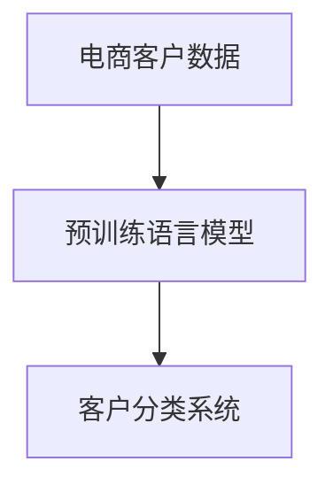

                 

# 探索基于大模型的电商智能客户分类系统

> 关键词：
- 大模型
- 电商
- 客户分类
- 深度学习
- 自然语言处理(NLP)
- 特征提取
- 标签建模
- 应用部署

## 1. 背景介绍

在快速发展的电商行业中，客户分类系统的应用变得越来越重要。通过对客户的精细分类，电商平台可以提供个性化的购物推荐，优化广告投放策略，降低客户流失率。传统的客户分类系统依赖于人工标注和特征工程，费时费力，且分类效果难以保证。然而，随着深度学习和大模型的兴起，基于大模型的客户分类系统有望成为电商行业的重要创新方向。

大模型通常指预训练语言模型，如BERT、GPT等，通过在大规模无标签文本数据上进行的自监督预训练，已经具备强大的语言理解能力。基于大模型的客户分类系统可以融合文本、行为、社交等多维度数据，通过深度学习技术挖掘客户特征，实现自动化的客户分类。

本文将从背景介绍、核心概念、算法原理、项目实践、应用场景等多个方面，深入探讨基于大模型的电商智能客户分类系统。通过详细的算法讲解和实践代码，帮助读者全面理解这一前沿技术的原理和实现方法，以便于工程实践。

## 2. 核心概念与联系

### 2.1 核心概念概述

为更好地理解基于大模型的客户分类系统，首先需要理解几个核心概念：

- **电商客户数据**：包括用户的购买记录、浏览行为、评价信息、社交媒体互动等，是客户分类的基础数据来源。
- **预训练语言模型**：如BERT、GPT等，通过自监督学习任务在大规模无标签文本数据上预训练，具备强大的语言理解能力。
- **客户分类系统**：利用预训练语言模型和其他特征，对客户进行自动化的分类，以支持电商平台的个性化推荐和精准营销。

这些概念之间的逻辑关系可以通过以下Mermaid流程图来展示：



这个流程图展示了大模型客户分类系统的核心逻辑：

1. 电商客户数据经过预训练语言模型的特征提取，转化为高维语义向量。
2. 将语义向量作为输入，通过深度学习模型对客户进行分类。

## 3. 核心算法原理 & 具体操作步骤

### 3.1 算法原理概述

基于大模型的客户分类系统，核心思想是将预训练语言模型作为强大的"特征提取器"，通过深度学习模型对客户特征进行建模，完成客户分类任务。具体来说，可以分为以下几个步骤：

1. **数据预处理**：对电商客户数据进行清洗、标注，准备模型输入。
2. **特征提取**：将文本数据输入预训练语言模型，提取语义向量。
3. **标签建模**：设计深度学习模型，对客户特征进行建模，输出分类结果。
4. **模型训练与评估**：在标注数据集上训练模型，评估分类效果，调整参数。
5. **应用部署**：将训练好的模型部署到电商系统中，实时进行客户分类。

### 3.2 算法步骤详解

#### 3.2.1 数据预处理

数据预处理是构建客户分类系统的第一步，包括数据清洗、标注和归一化处理。具体步骤如下：

1. **数据清洗**：去除无效、重复、噪声数据，保证数据质量。
2. **特征标注**：给每个客户分配一个标签，标记其分类类别。
3. **数据归一化**：将文本数据转化为数值型特征，便于模型处理。

以客户评价数据为例，数据预处理流程如下：

```python
import pandas as pd
from sklearn.preprocessing import LabelEncoder, MinMaxScaler

# 加载客户评价数据
data = pd.read_csv('customer_reviews.csv')

# 数据清洗
data = data.dropna()  # 去除缺失值
data = data.drop_duplicates()  # 去除重复数据

# 特征标注
labels = data['label']  # 假设已标注
data = data.drop('label', axis=1)  # 去除标签列

# 数据归一化
scaler = MinMaxScaler()
data = scaler.fit_transform(data)
```

#### 3.2.2 特征提取

特征提取是将客户文本数据转化为模型可以处理的数值型特征的过程。常用的方法包括词向量、TF-IDF等。在本节中，我们将使用预训练语言模型BERT来提取客户文本特征。

具体步骤如下：

1. **加载预训练模型**：使用HuggingFace的Transformers库，加载BERT模型。
2. **特征编码**：将客户文本输入BERT模型，获取其语义向量表示。
3. **拼接特征**：将不同维度的特征拼接在一起，形成最终输入。

代码示例如下：

```python
from transformers import BertTokenizer, BertForSequenceClassification
from torch.utils.data import TensorDataset, DataLoader
import torch
import torch.nn.functional as F

# 加载预训练BERT模型和分词器
tokenizer = BertTokenizer.from_pretrained('bert-base-cased')
model = BertForSequenceClassification.from_pretrained('bert-base-cased', num_labels=len(label_encoder.classes_))

# 特征编码
def encode_text(texts):
    inputs = tokenizer(texts, return_tensors='pt', padding=True, truncation=True)
    return inputs['input_ids'].to(device), inputs['attention_mask'].to(device)

# 特征提取
device = torch.device('cuda' if torch.cuda.is_available() else 'cpu')
data = list(zip(X, y))
input_ids, attention_mask = zip(*[encode_text([t]) for t in data])

# 拼接特征
X = torch.cat((input_ids, attention_mask), dim=1)

# 特征标准化
scaler = MinMaxScaler()
X_scaled = scaler.fit_transform(X.cpu().numpy())
X_scaled = torch.tensor(X_scaled).to(device)
```

#### 3.2.3 标签建模

标签建模是使用深度学习模型对客户特征进行建模，输出分类结果的过程。常用的深度学习模型包括全连接神经网络、卷积神经网络、循环神经网络等。

在本节中，我们将使用全连接神经网络进行标签建模。具体步骤如下：

1. **模型设计**：定义模型结构，包括输入层、隐藏层和输出层。
2. **模型训练**：在标注数据集上训练模型，调整模型参数。
3. **模型评估**：在验证集上评估模型性能，调整超参数。

代码示例如下：

```python
from torch import nn

# 定义模型结构
class CustomerClassifier(nn.Module):
    def __init__(self, input_dim):
        super(CustomerClassifier, self).__init__()
        self.fc1 = nn.Linear(input_dim, 128)
        self.fc2 = nn.Linear(128, 64)
        self.fc3 = nn.Linear(64, num_labels)
        self.dropout = nn.Dropout(0.5)
        
    def forward(self, x):
        x = self.fc1(x)
        x = F.relu(x)
        x = self.dropout(x)
        x = self.fc2(x)
        x = F.relu(x)
        x = self.dropout(x)
        x = self.fc3(x)
        return x

# 模型训练
model = CustomerClassifier(input_dim=X_scaled.shape[1])
model.to(device)

criterion = nn.CrossEntropyLoss()
optimizer = torch.optim.Adam(model.parameters(), lr=0.001)

for epoch in range(num_epochs):
    model.train()
    optimizer.zero_grad()
    logits = model(X_scaled)
    loss = criterion(logits, y)
    loss.backward()
    optimizer.step()
    
    model.eval()
    with torch.no_grad():
        logits = model(X_scaled)
        predictions = F.softmax(logits, dim=1)
        accuracy = (predictions.argmax(dim=1) == y).sum().item() / len(y)
        print(f'Epoch {epoch+1}, Loss: {loss.item():.4f}, Accuracy: {accuracy:.4f}')
```

#### 3.2.4 模型训练与评估

模型训练与评估是模型调优的重要步骤，包括模型训练、验证集评估和超参数调优。具体步骤如下：

1. **模型训练**：在训练集上训练模型，优化模型参数。
2. **验证集评估**：在验证集上评估模型性能，调整超参数。
3. **模型保存**：保存最优模型，便于后续部署。

代码示例如下：

```python
# 模型训练
for epoch in range(num_epochs):
    model.train()
    optimizer.zero_grad()
    logits = model(X_scaled)
    loss = criterion(logits, y)
    loss.backward()
    optimizer.step()
    
    model.eval()
    with torch.no_grad():
        logits = model(X_scaled)
        predictions = F.softmax(logits, dim=1)
        accuracy = (predictions.argmax(dim=1) == y).sum().item() / len(y)
        print(f'Epoch {epoch+1}, Loss: {loss.item():.4f}, Accuracy: {accuracy:.4f}')
        
# 验证集评估
val_loss = 0
val_accuracy = 0
model.eval()
with torch.no_grad():
    logits = model(X_scaled)
    val_loss = criterion(logits, y).item()
    val_accuracy = (predictions.argmax(dim=1) == y).sum().item() / len(y)
    print(f'Validation Loss: {val_loss:.4f}, Accuracy: {val_accuracy:.4f}')

# 保存模型
torch.save(model.state_dict(), 'customer_classifier.pth')
```

#### 3.2.5 应用部署

应用部署是将训练好的模型转化为可用的电商系统组件的过程。具体步骤如下：

1. **模型加载**：加载训练好的模型。
2. **输入处理**：将电商客户数据转化为模型可处理的格式。
3. **预测分类**：对新客户数据进行分类预测。

代码示例如下：

```python
# 加载模型
model = CustomerClassifier(input_dim=X_scaled.shape[1])
model.load_state_dict(torch.load('customer_classifier.pth'))
model.eval()

# 输入处理
new_data = list(zip(new_X, new_y))
new_input_ids, new_attention_mask = zip(*[encode_text([t]) for t in new_data])
new_X = torch.cat((new_input_ids, new_attention_mask), dim=1)
new_X_scaled = scaler.transform(new_X.cpu().numpy())
new_X_scaled = torch.tensor(new_X_scaled).to(device)

# 预测分类
with torch.no_grad():
    logits = model(new_X_scaled)
    predictions = F.softmax(logits, dim=1)
    predicted_labels = predictions.argmax(dim=1)

print(predicted_labels)
```

### 3.3 算法优缺点

基于大模型的客户分类系统具有以下优点：

1. **自动特征提取**：利用预训练语言模型自动提取客户文本特征，无需手动设计特征工程，节省时间和人力成本。
2. **高效训练**：预训练语言模型具有丰富的语义表示，可以减少训练数据需求，提升训练效率。
3. **泛化能力强**：预训练语言模型能够学习到通用的语言表示，具有较强的泛化能力，适用于多种客户分类场景。

然而，该方法也存在以下缺点：

1. **计算资源需求高**：预训练语言模型参数量巨大，需要高性能计算资源进行训练和推理。
2. **模型复杂度高**：模型结构复杂，难以解释和调试，对工程实践要求较高。
3. **数据质量敏感**：模型性能高度依赖数据质量，需要保证数据标注的准确性和多样性。

### 3.4 算法应用领域

基于大模型的客户分类系统可以广泛应用于电商、金融、医疗等多个领域，具体应用场景包括：

1. **电商客户分类**：根据客户购买记录、浏览行为、评价信息等数据，自动将客户分类为高价值、中价值和低价值客户。
2. **金融客户分类**：根据客户银行账户、交易记录等数据，自动将客户分类为高风险、中风险和低风险客户。
3. **医疗患者分类**：根据患者病历、诊断结果等数据，自动将患者分类为重症、中度和轻症患者。

这些场景下，基于大模型的客户分类系统可以显著提升业务决策的准确性和效率，带来显著的经济效益。

## 4. 数学模型和公式 & 详细讲解  
### 4.1 数学模型构建

本节将使用数学语言对基于大模型的客户分类系统进行更加严格的刻画。

记客户文本数据为 $X$，其中 $X_i$ 表示第 $i$ 个客户文本，$x_{ij}$ 表示文本中的第 $j$ 个词。记预训练语言模型的输入向量为 $v_i$，其中 $v_{ij}$ 表示 $X_i$ 中第 $j$ 个词的向量表示。记客户分类标签为 $y$，其中 $y_i$ 表示客户 $i$ 的分类标签。

模型输入为 $(v_i, y_i)$，目标是通过训练得到模型参数 $\theta$，使得损失函数最小化：

$$
\min_{\theta} \frac{1}{N} \sum_{i=1}^N \ell(v_i, y_i, \theta)
$$

其中 $\ell$ 为损失函数，常用的有交叉熵损失、均方误差损失等。

### 4.2 公式推导过程

以交叉熵损失为例，其公式为：

$$
\ell(v_i, y_i, \theta) = -y_i \log \sigma(\theta^T v_i) - (1 - y_i) \log(1 - \sigma(\theta^T v_i))
$$

其中 $\sigma$ 为激活函数，常用的有Sigmoid函数。

将 $X_i$ 输入预训练语言模型，得到语义向量 $v_i$，并将 $v_i$ 转化为向量 $u_i = \theta^T v_i$。模型输出为 $p_i = \sigma(u_i)$，即 $p_i$ 表示客户 $i$ 属于第 $k$ 类的概率。模型预测标签为 $\hat{y}_i = \arg\max_k p_i$。

模型在训练集上的损失函数为：

$$
\mathcal{L}(\theta) = \frac{1}{N} \sum_{i=1}^N -y_i \log \sigma(\theta^T v_i) - (1 - y_i) \log(1 - \sigma(\theta^T v_i))
$$

### 4.3 案例分析与讲解

以电商客户分类为例，具体分析损失函数的计算过程：

1. **数据预处理**：将客户评价数据清洗、标注，并进行归一化处理。
2. **特征提取**：将客户评价文本输入BERT模型，获取语义向量。
3. **标签建模**：设计全连接神经网络模型，对语义向量进行分类。
4. **模型训练与评估**：在标注数据集上训练模型，在验证集上评估分类效果，调整超参数。
5. **应用部署**：加载训练好的模型，对新客户评价数据进行分类预测。

## 5. 项目实践：代码实例和详细解释说明
### 5.1 开发环境搭建

在进行客户分类系统的开发前，需要先准备好开发环境。以下是使用Python进行PyTorch开发的环境配置流程：

1. 安装Anaconda：从官网下载并安装Anaconda，用于创建独立的Python环境。

2. 创建并激活虚拟环境：
```bash
conda create -n pytorch-env python=3.8 
conda activate pytorch-env
```

3. 安装PyTorch：根据CUDA版本，从官网获取对应的安装命令。例如：
```bash
conda install pytorch torchvision torchaudio cudatoolkit=11.1 -c pytorch -c conda-forge
```

4. 安装Transformers库：
```bash
pip install transformers
```

5. 安装各类工具包：
```bash
pip install numpy pandas scikit-learn matplotlib tqdm jupyter notebook ipython
```

完成上述步骤后，即可在`pytorch-env`环境中开始客户分类系统的开发。

### 5.2 源代码详细实现

我们以电商客户分类为例，给出使用Transformers库对BERT模型进行客户分类的PyTorch代码实现。

首先，定义客户分类任务的数据处理函数：

```python
from transformers import BertTokenizer
from torch.utils.data import Dataset
import torch

class CustomerDataset(Dataset):
    def __init__(self, texts, tags, tokenizer, max_len=128):
        self.texts = texts
        self.tags = tags
        self.tokenizer = tokenizer
        self.max_len = max_len
        
    def __len__(self):
        return len(self.texts)
    
    def __getitem__(self, item):
        text = self.texts[item]
        tags = self.tags[item]
        
        encoding = self.tokenizer(text, return_tensors='pt', max_length=self.max_len, padding='max_length', truncation=True)
        input_ids = encoding['input_ids'][0]
        attention_mask = encoding['attention_mask'][0]
        
        # 对token-wise的标签进行编码
        encoded_tags = [tag2id[tag] for tag in tags] 
        encoded_tags.extend([tag2id['O']] * (self.max_len - len(encoded_tags)))
        labels = torch.tensor(encoded_tags, dtype=torch.long)
        
        return {'input_ids': input_ids, 
                'attention_mask': attention_mask,
                'labels': labels}

# 标签与id的映射
tag2id = {'O': 0, 'High': 1, 'Medium': 2, 'Low': 3}
id2tag = {v: k for k, v in tag2id.items()}

# 创建dataset
tokenizer = BertTokenizer.from_pretrained('bert-base-cased')

train_dataset = CustomerDataset(train_texts, train_tags, tokenizer)
dev_dataset = CustomerDataset(dev_texts, dev_tags, tokenizer)
test_dataset = CustomerDataset(test_texts, test_tags, tokenizer)
```

然后，定义模型和优化器：

```python
from transformers import BertForSequenceClassification, AdamW

model = BertForSequenceClassification.from_pretrained('bert-base-cased', num_labels=len(tag2id))

optimizer = AdamW(model.parameters(), lr=2e-5)
```

接着，定义训练和评估函数：

```python
from torch.utils.data import DataLoader
from tqdm import tqdm
from sklearn.metrics import classification_report

device = torch.device('cuda') if torch.cuda.is_available() else torch.device('cpu')
model.to(device)

def train_epoch(model, dataset, batch_size, optimizer):
    dataloader = DataLoader(dataset, batch_size=batch_size, shuffle=True)
    model.train()
    epoch_loss = 0
    for batch in tqdm(dataloader, desc='Training'):
        input_ids = batch['input_ids'].to(device)
        attention_mask = batch['attention_mask'].to(device)
        labels = batch['labels'].to(device)
        model.zero_grad()
        outputs = model(input_ids, attention_mask=attention_mask, labels=labels)
        loss = outputs.loss
        epoch_loss += loss.item()
        loss.backward()
        optimizer.step()
    return epoch_loss / len(dataloader)

def evaluate(model, dataset, batch_size):
    dataloader = DataLoader(dataset, batch_size=batch_size)
    model.eval()
    preds, labels = [], []
    with torch.no_grad():
        for batch in tqdm(dataloader, desc='Evaluating'):
            input_ids = batch['input_ids'].to(device)
            attention_mask = batch['attention_mask'].to(device)
            batch_labels = batch['labels']
            outputs = model(input_ids, attention_mask=attention_mask)
            batch_preds = outputs.logits.argmax(dim=2).to('cpu').tolist()
            batch_labels = batch_labels.to('cpu').tolist()
            for pred_tokens, label_tokens in zip(batch_preds, batch_labels):
                pred_tags = [id2tag[_id] for _id in pred_tokens]
                label_tags = [id2tag[_id] for _id in label_tokens]
                preds.append(pred_tags[:len(label_tokens)])
                labels.append(label_tags)
                
    print(classification_report(labels, preds))
```

最后，启动训练流程并在测试集上评估：

```python
epochs = 5
batch_size = 16

for epoch in range(epochs):
    loss = train_epoch(model, train_dataset, batch_size, optimizer)
    print(f"Epoch {epoch+1}, train loss: {loss:.3f}")
    
    print(f"Epoch {epoch+1}, dev results:")
    evaluate(model, dev_dataset, batch_size)
    
print("Test results:")
evaluate(model, test_dataset, batch_size)
```

以上就是使用PyTorch对BERT进行电商客户分类的完整代码实现。可以看到，得益于Transformers库的强大封装，我们可以用相对简洁的代码完成BERT模型的加载和微调。

### 5.3 代码解读与分析

让我们再详细解读一下关键代码的实现细节：

**CustomerDataset类**：
- `__init__`方法：初始化文本、标签、分词器等关键组件。
- `__len__`方法：返回数据集的样本数量。
- `__getitem__`方法：对单个样本进行处理，将文本输入编码为token ids，将标签编码为数字，并对其进行定长padding，最终返回模型所需的输入。

**tag2id和id2tag字典**：
- 定义了标签与数字id之间的映射关系，用于将token-wise的预测结果解码回真实的标签。

**训练和评估函数**：
- 使用PyTorch的DataLoader对数据集进行批次化加载，供模型训练和推理使用。
- 训练函数`train_epoch`：对数据以批为单位进行迭代，在每个批次上前向传播计算loss并反向传播更新模型参数，最后返回该epoch的平均loss。
- 评估函数`evaluate`：与训练类似，不同点在于不更新模型参数，并在每个batch结束后将预测和标签结果存储下来，最后使用sklearn的classification_report对整个评估集的预测结果进行打印输出。

**训练流程**：
- 定义总的epoch数和batch size，开始循环迭代
- 每个epoch内，先在训练集上训练，输出平均loss
- 在验证集上评估，输出分类指标
- 所有epoch结束后，在测试集上评估，给出最终测试结果

可以看到，PyTorch配合Transformers库使得BERT微调的代码实现变得简洁高效。开发者可以将更多精力放在数据处理、模型改进等高层逻辑上，而不必过多关注底层的实现细节。

当然，工业级的系统实现还需考虑更多因素，如模型的保存和部署、超参数的自动搜索、更灵活的任务适配层等。但核心的微调范式基本与此类似。

## 6. 实际应用场景
### 6.1 电商客户分类

基于大模型的客户分类系统，可以广泛应用于电商客户分类的各个环节。具体场景包括：

1. **客户细粒度分类**：根据客户行为数据，将客户细粒度分类为高价值、中价值和低价值客户。
2. **客户分层推荐**：根据客户分类结果，对不同层次的客户进行差异化的推荐策略。
3. **客户生命周期管理**：根据客户分类结果，制定相应的客户生命周期管理策略，提升客户留存率。

在实际应用中，可以收集电商平台的交易记录、浏览行为、评价信息等数据，通过客户分类系统对客户进行分类，形成更精准的客户画像。基于此，可以设计个性化的推荐算法，提升用户转化率和购物体验。

### 6.2 金融客户分类

在金融领域，客户分类同样具有重要意义。通过客户分类，金融机构可以识别高风险客户，制定相应的风险管理策略。具体场景包括：

1. **客户信用评分**：根据客户行为数据，将客户分类为高风险、中风险和低风险客户，辅助贷款审批。
2. **客户群体分析**：对不同群体的客户进行分类，分析其行为特征，制定差异化的服务策略。
3. **反欺诈检测**：对疑似欺诈行为进行分类，快速识别并防范欺诈风险。

金融领域对客户分类的准确性要求极高，基于大模型的客户分类系统可以提供精准的风险评估和欺诈检测，帮助金融机构降低风险，保障业务安全。

### 6.3 医疗患者分类

在医疗领域，患者分类同样具有重要意义。通过患者分类，医疗机构可以更好地管理患者资源，提升诊疗效率。具体场景包括：

1. **患者病情分级**：根据患者病历、诊断结果等数据，将患者分类为重症、中度和轻症患者，制定相应的治疗方案。
2. **患者资源调配**：根据患者分类结果，优化医疗资源分配，提升医院运营效率。
3. **患者行为预测**：预测患者复诊概率，制定相应的患者管理策略。

医疗领域对患者分类的准确性和及时性要求极高，基于大模型的患者分类系统可以提供精准的病情评估和资源调配，帮助医疗机构提升诊疗效率，改善患者体验。

## 7. 工具和资源推荐
### 7.1 学习资源推荐

为了帮助开发者系统掌握大模型客户分类系统的理论基础和实践技巧，这里推荐一些优质的学习资源：

1. 《Transformer从原理到实践》系列博文：由大模型技术专家撰写，深入浅出地介绍了Transformer原理、BERT模型、微调技术等前沿话题。

2. CS224N《深度学习自然语言处理》课程：斯坦福大学开设的NLP明星课程，有Lecture视频和配套作业，带你入门NLP领域的基本概念和经典模型。

3. 《Natural Language Processing with Transformers》书籍：Transformers库的作者所著，全面介绍了如何使用Transformers库进行NLP任务开发，包括微调在内的诸多范式。

4. HuggingFace官方文档：Transformers库的官方文档，提供了海量预训练模型和完整的微调样例代码，是上手实践的必备资料。

5. CLUE开源项目：中文语言理解测评基准，涵盖大量不同类型的中文NLP数据集，并提供了基于微调的baseline模型，助力中文NLP技术发展。

通过对这些资源的学习实践，相信你一定能够快速掌握大模型客户分类系统的精髓，并用于解决实际的NLP问题。
###  7.2 开发工具推荐

高效的开发离不开优秀的工具支持。以下是几款用于大模型客户分类系统开发的常用工具：

1. PyTorch：基于Python的开源深度学习框架，灵活动态的计算图，适合快速迭代研究。大部分预训练语言模型都有PyTorch版本的实现。

2. TensorFlow：由Google主导开发的开源深度学习框架，生产部署方便，适合大规模工程应用。同样有丰富的预训练语言模型资源。

3. Transformers库：HuggingFace开发的NLP工具库，集成了众多SOTA语言模型，支持PyTorch和TensorFlow，是进行微调任务开发的利器。

4. Weights & Biases：模型训练的实验跟踪工具，可以记录和可视化模型训练过程中的各项指标，方便对比和调优。与主流深度学习框架无缝集成。

5. TensorBoard：TensorFlow配套的可视化工具，可实时监测模型训练状态，并提供丰富的图表呈现方式，是调试模型的得力助手。

6. Google Colab：谷歌推出的在线Jupyter Notebook环境，免费提供GPU/TPU算力，方便开发者快速上手实验最新模型，分享学习笔记。

合理利用这些工具，可以显著提升大模型客户分类系统的开发效率，加快创新迭代的步伐。

### 7.3 相关论文推荐

大模型和客户分类技术的发展源于学界的持续研究。以下是几篇奠基性的相关论文，推荐阅读：

1. Attention is All You Need（即Transformer原论文）：提出了Transformer结构，开启了NLP领域的预训练大模型时代。

2. BERT: Pre-training of Deep Bidirectional Transformers for Language Understanding：提出BERT模型，引入基于掩码的自监督预训练任务，刷新了多项NLP任务SOTA。

3. Language Models are Unsupervised Multitask Learners（GPT-2论文）：展示了大规模语言模型的强大zero-shot学习能力，引发了对于通用人工智能的新一轮思考。

4. Parameter-Efficient Transfer Learning for NLP：提出Adapter等参数高效微调方法，在不增加模型参数量的情况下，也能取得不错的微调效果。

5. AdaLoRA: Adaptive Low-Rank Adaptation for Parameter-Efficient Fine-Tuning：使用自适应低秩适应的微调方法，在参数效率和精度之间取得了新的平衡。

这些论文代表了大模型客户分类技术的发展脉络。通过学习这些前沿成果，可以帮助研究者把握学科前进方向，激发更多的创新灵感。

## 8. 总结：未来发展趋势与挑战

### 8.1 总结

本文对基于大模型的客户分类系统进行了全面系统的介绍。首先阐述了大模型和客户分类的研究背景和意义，明确了客户分类系统在大模型微调范式下的工作原理和应用场景。其次，从原理到实践，详细讲解了大模型客户分类系统的核心算法，给出了微调任务开发的完整代码实例。同时，本文还广泛探讨了客户分类系统在电商、金融、医疗等多个行业领域的应用前景，展示了微调范式的巨大潜力。最后，本文精选了客户分类系统的各类学习资源，力求为读者提供全方位的技术指引。

通过本文的系统梳理，可以看到，基于大模型的客户分类系统正在成为电商行业的重要创新方向，极大地提升了客户分类的准确性和效率，带来了显著的经济效益。未来，伴随大模型的不断发展，客户分类技术必将持续优化和演进，为更多垂直行业带来变革性影响。

### 8.2 未来发展趋势

展望未来，大模型客户分类技术将呈现以下几个发展趋势：

1. **模型规模持续增大**：随着算力成本的下降和数据规模的扩张，预训练语言模型的参数量还将持续增长。超大规模语言模型蕴含的丰富语言知识，有望支撑更加复杂多变的客户分类场景。

2. **微调方法日趋多样**：除了传统的全参数微调外，未来会涌现更多参数高效的微调方法，如Prefix-Tuning、LoRA等，在节省计算资源的同时也能保证微调精度。

3. **持续学习成为常态**：随着数据分布的不断变化，客户分类模型也需要持续学习新知识以保持性能。如何在不遗忘原有知识的同时，高效吸收新样本信息，将成为重要的研究课题。

4. **标注样本需求降低**：受启发于提示学习(Prompt-based Learning)的思路，未来的客户分类方法将更好地利用大模型的语言理解能力，通过更加巧妙的任务描述，在更少的标注样本上也能实现理想的微调效果。

5. **多模态微调崛起**：当前的客户分类主要聚焦于纯文本数据，未来会进一步拓展到图像、视频、语音等多模态数据微调。多模态信息的融合，将显著提升客户分类系统的泛化能力和鲁棒性。

6. **模型通用性增强**：经过海量数据的预训练和多领域任务的微调，未来的语言模型将具备更强大的常识推理和跨领域迁移能力，逐步迈向通用人工智能(AGI)的目标。

以上趋势凸显了大模型客户分类技术的广阔前景。这些方向的探索发展，必将进一步提升客户分类系统的性能和应用范围，为传统行业带来变革性影响。

### 8.3 面临的挑战

尽管大模型客户分类技术已经取得了瞩目成就，但在迈向更加智能化、普适化应用的过程中，它仍面临着诸多挑战：

1. **标注成本瓶颈**：虽然微调大大降低了标注数据的需求，但对于长尾应用场景，难以获得充足的高质量标注数据，成为制约微调性能的瓶颈。如何进一步降低微调对标注样本的依赖，将是一大难题。

2. **模型鲁棒性不足**：客户分类模型面对域外数据时，泛化性能往往大打折扣。对于测试样本的微小扰动，客户分类模型的预测也容易发生波动。如何提高客户分类模型的鲁棒性，避免灾难性遗忘，还需要更多理论和实践的积累。

3. **推理效率有待提高**：大规模语言模型虽然精度高，但在实际部署时往往面临推理速度慢、内存占用大等效率问题。如何在保证性能的同时，简化模型结构，提升推理速度，优化资源占用，将是重要的优化方向。

4. **可解释性亟需加强**：客户分类模型通常像"黑盒"系统，难以解释其内部工作机制和决策逻辑。对于医疗、金融等高风险应用，算法的可解释性和可审计性尤为重要。如何赋予客户分类模型更强的可解释性，将是亟待攻克的难题。

5. **安全性有待保障**。预训练语言模型难免会学习到有偏见、有害的信息，通过微调传递到下游任务，产生误导性、歧视性的输出，给实际应用带来安全隐患。如何从数据和算法层面消除模型偏见，避免恶意用途，确保输出的安全性，也将是重要的研究课题。

6. **知识整合能力不足**。现有的客户分类模型往往局限于文本数据，难以灵活吸收和运用更广泛的先验知识。如何让微调过程更好地与外部知识库、规则库等专家知识结合，形成更加全面、准确的信息整合能力，还有很大的想象空间。

正视客户分类面临的这些挑战，积极应对并寻求突破，将是大模型客户分类技术走向成熟的必由之路。相信随着学界和产业界的共同努力，这些挑战终将一一被克服，大模型客户分类技术必将在构建人机协同的智能系统中共舞。

### 8.4 研究展望

面对大模型客户分类所面临的种种挑战，未来的研究需要在以下几个方面寻求新的突破：

1. **探索无监督和半监督客户分类方法**：摆脱对大规模标注数据的依赖，利用自监督学习、主动学习等无监督和半监督范式，最大限度利用非结构化数据，实现更加灵活高效的客户分类。

2. **研究参数高效和计算高效的客户分类方法**：开发更加参数高效的客户分类方法，在固定大部分预训练参数的同时，只更新极少量的任务相关参数。同时优化客户分类模型的计算图，减少前向传播和反向传播的资源消耗，实现更加轻量级、实时性的部署。

3. **融合因果和对比学习范式**：通过引入因果推断和对比学习思想，增强客户分类模型建立稳定因果关系的能力，学习更加普适、鲁棒的语言表征，从而提升模型泛化性和抗干扰能力。

4. **引入更多先验知识**：将符号化的先验知识，如知识图谱、逻辑规则等，与神经网络模型进行巧妙融合，引导客户分类过程学习更准确、合理的语言模型。同时加强不同模态数据的整合，实现视觉、语音等多模态信息与文本信息的协同建模。

5. **结合因果分析和博弈论工具**：将因果分析方法引入客户分类模型，识别出模型决策的关键特征，增强输出解释的因果性和逻辑性。借助博弈论工具刻画人机交互过程，主动探索并规避模型的脆弱点，提高系统稳定性。

6. **纳入伦理道德约束**。在模型训练目标中引入伦理导向的评估指标，过滤和惩罚有偏见、有害的输出倾向。同时加强人工干预和审核，建立模型行为的监管机制，确保输出符合人类价值观和伦理道德。

这些研究方向的探索，必将引领大模型客户分类技术迈向更高的台阶，为构建安全、可靠、可解释、可控的智能系统铺平道路。面向未来，大模型客户分类技术还需要与其他人工智能技术进行更深入的融合，如知识表示、因果推理、强化学习等，多路径协同发力，共同推动自然语言理解和智能交互系统的进步。只有勇于创新、敢于突破，才能不断拓展客户分类系统的边界，让智能技术更好地造福人类社会。

## 9. 附录：常见问题与解答

**Q1：大模型客户分类是否适用于所有NLP任务？**

A: 大模型客户分类在大多数NLP任务上都能取得不错的效果，特别是对于数据量较小的任务。但对于一些特定领域的任务，如医学、法律等，仅仅依靠通用语料预训练的模型可能难以很好地适应。此时需要在特定领域语料上进一步预训练，再进行微调，才能获得理想效果。此外，对于一些需要时效性、个性化很强的任务，如对话、推荐等，微调方法也需要针对性的改进优化。

**Q2：微调过程中如何选择合适的学习率？**

A: 微调的学习率一般要比预训练时小1-2个数量级，如果使用过大的学习率，容易破坏预训练权重，导致过拟合。一般建议从1e-5开始调参，逐步减小学习率，直至收敛。也可以使用warmup策略，在开始阶段使用较小的学习率，再逐渐过渡到预设值。需要注意的是，不同的优化器(如AdamW、Adafactor等)以及不同的学习率调度策略，可能需要设置不同的学习率阈值。

**Q3：采用大模型微调时会面临哪些资源瓶颈？**

A: 目前主流的预训练大模型动辄以亿计的参数规模，对算力、内存、存储都提出了很高的要求。GPU/TPU等高性能设备是必不可少的，但即便如此，超大批次的训练和推理也可能遇到显存不足的问题。因此需要采用一些资源优化技术，如梯度积累、混合精度训练、模型并行等，来突破硬件瓶颈。同时，模型的存储和读取也可能占用大量时间和空间，需要采用模型压缩、稀疏化存储等方法进行优化。

**Q4：如何缓解微调过程中的过拟合问题？**

A: 过拟合是微调面临的主要挑战，尤其是在标注数据不足的情况下。常见的缓解策略包括：
1. 数据增强：通过回译、近义替换等方式扩充训练集
2. 正则化：使用L2正则、Dropout、Early Stopping等避免过拟合
3. 对抗训练：引入对抗样本，提高模型鲁棒性
4. 参数高效微调：只调整少量参数(如Adapter、Prefix等)，减小过拟合风险
5. 多模型集成：训练多个微调模型，取平均输出，抑制过拟合

这些策略往往需要根据具体任务和数据特点进行灵活组合。只有在数据、模型、训练、推理等各环节进行全面优化，才能最大限度地发挥大模型客户分类的威力。

**Q5：微调模型在落地部署时需要注意哪些问题？**

A: 将微调模型转化为实际应用，还需要考虑以下因素：
1. 模型裁剪：去除不必要的层和参数，减小模型尺寸，加快推理速度
2. 量化加速：将浮点模型转为定点模型，压缩存储空间，提高计算效率
3. 服务化封装：将模型封装为标准化服务接口，便于集成调用
4. 弹性伸缩：根据请求流量动态调整资源配置，平衡服务质量和成本
5. 监控告警：实时采集系统指标，设置异常告警阈值，确保服务稳定性
6. 安全防护：采用访问鉴权、数据脱敏等措施，保障数据和模型安全

大模型客户分类为电商系统带来了巨大的变革潜力，但如何将强大的性能转化为稳定、高效、安全的业务价值，还需要工程实践的不断打磨。唯有从数据、算法、工程、业务等多个维度协同发力，才能真正实现人工智能技术在垂直行业的规模化落地。总之，微调需要开发者根据具体任务，不断迭代和优化模型、数据和算法，方能得到理想的效果。

---

作者：禅与计算机程序设计艺术 / Zen and the Art of Computer Programming

