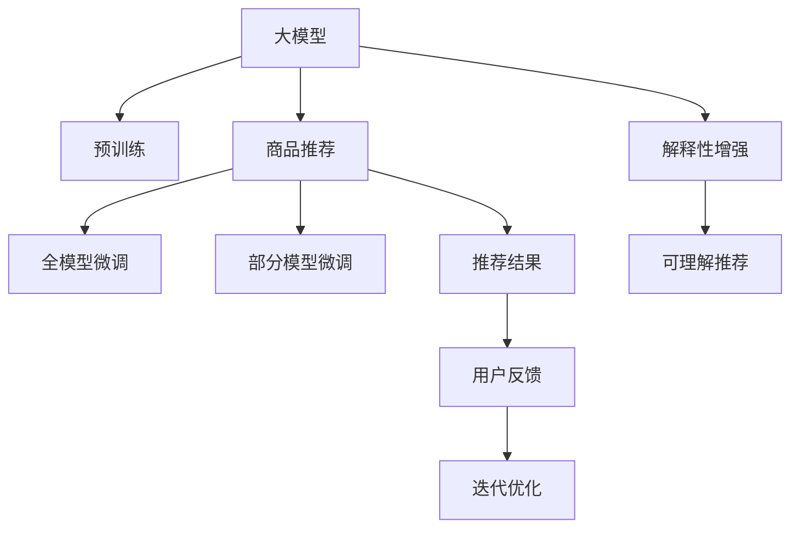

                 

# 探讨大模型在电商平台商品推荐解释性中的应用

> 关键词：大模型, 商品推荐, 解释性, 电商, 自然语言处理, 强化学习, 推荐系统

## 1. 背景介绍

### 1.1 问题由来
在当今数字化浪潮中，电商平台成为了消费者获取商品信息、进行购买决策的重要渠道。随着用户需求的多样化，电商平台需要提供更加精准、个性化的商品推荐服务。然而，传统的推荐系统往往基于协同过滤、基于内容的推荐等方法，难以解释其推荐的依据和过程，用户难以理解和信任推荐结果，最终导致用户体验和满意度下降。

近年来，大模型在自然语言处理（NLP）领域取得了显著进展，尤其是基于Transformer的预训练语言模型，如GPT、BERT等，通过在海量文本数据上进行预训练，学习到了丰富的语言知识和语义表示。利用大模型的强大表达能力，电商平台的商品推荐系统可以变得更加精准、透明和可解释。

### 1.2 问题核心关键点
本文聚焦于大模型在电商平台商品推荐系统中的应用，特别是如何提升推荐的解释性和可理解性，帮助用户理解推荐依据，从而提高其对推荐结果的信任度和满意度。

### 1.3 问题研究意义
电商平台的商品推荐系统是数字营销的重要组成部分，其推荐的精准性和可解释性直接影响用户的购物体验和平台的转化率。通过引入大模型，推荐系统可以更好地理解和生成自然语言，从而提升推荐的解释性。这对于电商平台来说，不仅是技术上的突破，更是商业模式上的创新，有助于构建更为健康、可信赖的消费生态。

## 2. 核心概念与联系

### 2.1 核心概念概述

为更好地理解大模型在电商平台商品推荐中的应用，本节将介绍几个密切相关的核心概念：

- **大模型(Large Model)**：以自回归(如GPT)或自编码(如BERT)模型为代表的大规模预训练语言模型。通过在海量文本数据上进行预训练，学习到丰富的语言知识和语义表示。
- **商品推荐(Recommendation System)**：基于用户历史行为、商品属性和上下文信息，推荐给用户可能感兴趣的商品的智能系统。
- **解释性(Explainability)**：推荐系统输出的可解释性，即用户能够理解推荐依据和过程。
- **电商(E-commerce)**：通过互联网进行的商品和服务的在线销售。电商平台基于用户需求和行为数据，提供个性化的商品推荐服务。
- **自然语言处理(Natural Language Processing, NLP)**：使用计算机处理和分析人类语言的技术，包括文本理解、生成、翻译等。
- **强化学习(Reinforcement Learning)**：一种通过奖励和惩罚机制进行智能决策的学习方式。

这些概念之间的逻辑关系可以通过以下Mermaid流程图来展示：



这个流程图展示了大模型在电商平台商品推荐中的应用过程：

1. 大模型通过预训练获得基础能力。
2. 商品推荐系统将预训练模型当作初始化参数，通过微调优化推荐效果。
3. 解释性增强模块使推荐结果更具可理解性。
4. 可理解推荐系统生成推荐结果并反馈用户。
5. 系统根据用户反馈迭代优化，提升推荐效果。

## 3. 核心算法原理 & 具体操作步骤
### 3.1 算法原理概述

大模型在电商平台商品推荐中的应用，主要是通过微调商品推荐模型的参数，使其能够根据用户的语义需求和历史行为生成个性化的推荐结果。其核心思想是：将大模型视作强大的特征提取器，通过微调将其与推荐算法相结合，生成更加精准、可解释的推荐结果。

形式化地，假设预训练模型为 $M_{\theta}$，其中 $\theta$ 为预训练得到的模型参数。给定电商平台的推荐任务 $T$ 和用户 $u$ 的历史行为数据 $D_u=\{(h_i,v_i)\}_{i=1}^N$，其中 $h_i$ 为用户历史浏览记录，$v_i$ 为对应浏览记录对应的商品。推荐任务的目标是找到最优参数 $\hat{\theta}$，使得模型能够根据用户 $u$ 的语义需求和历史行为，生成推荐列表 $R$，使得 $R$ 能够最大化用户满意度。

通过梯度下降等优化算法，推荐系统不断更新模型参数 $\theta$，最小化损失函数 $\mathcal{L}(M_{\theta},D_u)$，使得推荐结果逼近用户满意的目标。由于 $\theta$ 已经通过预训练获得了较好的初始化，因此即便在只有少量标注样本的情况下，也能较快收敛到理想的模型参数 $\hat{\theta}$。

### 3.2 算法步骤详解

基于大模型在电商平台商品推荐的应用，推荐系统的具体步骤包括：

**Step 1: 准备预训练模型和数据集**
- 选择合适的预训练语言模型 $M_{\theta}$ 作为初始化参数，如 BERT、GPT 等。
- 收集电商平台用户的历史行为数据 $D_u$，并将其转换为合适的输入格式。

**Step 2: 添加任务适配层**
- 根据任务类型，在预训练模型顶层设计合适的输出层和损失函数。
- 对于推荐任务，通常在顶层添加线性分类器和交叉熵损失函数。

**Step 3: 设置微调超参数**
- 选择合适的优化算法及其参数，如 AdamW、SGD 等，设置学习率、批大小、迭代轮数等。
- 设置正则化技术及强度，包括权重衰减、Dropout、Early Stopping等。
- 确定冻结预训练参数的策略，如仅微调顶层，或全部参数都参与微调。

**Step 4: 执行梯度训练**
- 将用户历史行为数据 $D_u$ 分批次输入模型，前向传播计算损失函数。
- 反向传播计算参数梯度，根据设定的优化算法和学习率更新模型参数。
- 周期性在测试集上评估模型性能，根据性能指标决定是否触发 Early Stopping。
- 重复上述步骤直到满足预设的迭代轮数或 Early Stopping 条件。

**Step 5: 测试和部署**
- 在测试集上评估微调后模型 $M_{\hat{\theta}}$ 的性能，对比微调前后的精度提升。
- 使用微调后的模型对新用户进行推荐，集成到实际的应用系统中。
- 持续收集新的用户反馈，定期重新微调模型，以适应数据分布的变化。

以上是基于大模型在电商平台商品推荐中的应用一般流程。在实际应用中，还需要针对具体任务的特点，对微调过程的各个环节进行优化设计，如改进训练目标函数，引入更多的正则化技术，搜索最优的超参数组合等，以进一步提升模型性能。

### 3.3 算法优缺点

基于大模型在电商平台商品推荐中的应用方法具有以下优点：
1. 简单高效。只需准备少量标注数据，即可对预训练模型进行快速适配，获得较大的性能提升。
2. 通用适用。适用于各种电商平台的推荐任务，包括商品推荐、广告投放、用户行为预测等，设计简单的任务适配层即可实现微调。
3. 效果显著。在大模型基础上进行微调，可以显著提升推荐系统的精准度和可解释性。

同时，该方法也存在一定的局限性：
1. 依赖标注数据。推荐系统的训练效果很大程度上取决于用户历史行为数据的质量。
2. 模型复杂度较高。大模型参数量大，对计算资源和存储资源的需求较高。
3. 可解释性不足。推荐系统的黑盒特性使得用户难以理解推荐依据。
4. 数据隐私问题。用户行为数据可能包含敏感信息，需要进行适当的隐私保护。

尽管存在这些局限性，但就目前而言，基于大模型的推荐方法仍然是最主流范式。未来相关研究的重点在于如何进一步降低对标注数据的依赖，提高推荐系统的可解释性和隐私保护，同时兼顾计算效率。

### 3.4 算法应用领域

基于大模型在电商平台商品推荐中的应用方法，已经在各大电商平台得到了广泛的应用，包括：

- 推荐系统：基于用户历史行为和浏览记录，生成个性化推荐列表。通过微调优化推荐精度和解释性。
- 广告投放：根据用户兴趣标签和行为特征，自动生成广告推荐策略。通过微调提升广告转化率和点击率。
- 用户行为预测：预测用户未来的购买行为和满意度，以便进行个性化营销和客户细分。通过微调优化预测准确性。
- 智能客服：通过自然语言处理技术，对用户咨询进行语义理解和回答生成。通过微调提升回答的精准性和可解释性。

除了上述这些经典任务外，大模型在电商平台的应用还包括智能搜索、内容推荐、活动策划等，为电商平台的智能化运营带来了新的可能性。

## 4. 数学模型和公式 & 详细讲解 & 举例说明
### 4.1 数学模型构建

本节将使用数学语言对大模型在电商平台商品推荐中的应用进行更加严格的刻画。

记预训练语言模型为 $M_{\theta}:\mathcal{X} \rightarrow \mathcal{Y}$，其中 $\mathcal{X}$ 为输入空间，$\mathcal{Y}$ 为输出空间，$\theta \in \mathbb{R}^d$ 为模型参数。假设电商平台的推荐任务为 $T$，用户 $u$ 的历史行为数据为 $D_u=\{(h_i,v_i)\}_{i=1}^N$，其中 $h_i$ 为历史浏览记录，$v_i$ 为对应浏览记录对应的商品。

定义模型 $M_{\theta}$ 在用户 $u$ 的历史行为数据 $D_u$ 上的损失函数为 $\ell(M_{\theta},D_u)$，则在用户 $u$ 上的期望损失为：

$$
\mathcal{L}(\theta) = \frac{1}{N}\sum_{i=1}^N \ell(M_{\theta}(h_i),v_i)
$$

其中 $\ell$ 为推荐系统的损失函数，用于衡量模型推荐列表与用户真实兴趣之间的差异。常见的损失函数包括交叉熵损失、均方误差损失等。

微调的优化目标是最小化期望损失，即找到最优参数：

$$
\theta^* = \mathop{\arg\min}_{\theta} \mathcal{L}(\theta)
$$

在实践中，我们通常使用基于梯度的优化算法（如SGD、Adam等）来近似求解上述最优化问题。设 $\eta$ 为学习率，$\lambda$ 为正则化系数，则参数的更新公式为：

$$
\theta \leftarrow \theta - \eta \nabla_{\theta}\mathcal{L}(\theta) - \eta\lambda\theta
$$

其中 $\nabla_{\theta}\mathcal{L}(\theta)$ 为损失函数对参数 $\theta$ 的梯度，可通过反向传播算法高效计算。

### 4.2 公式推导过程

以下我们以用户行为预测任务为例，推导交叉熵损失函数及其梯度的计算公式。

假设模型 $M_{\theta}$ 在用户 $u$ 的历史行为数据 $D_u$ 上的预测结果为 $\hat{R}=M_{\theta}(D_u) \in [0,1]^{|V|}$，其中 $V$ 为用户可能感兴趣的商品集。用户的历史行为 $D_u$ 已经标注为 $v_i$，即 $v_i \in V$。则用户行为预测的交叉熵损失函数定义为：

$$
\ell(M_{\theta}(D_u),v_i) = -\sum_{j=1}^{|V|} y_j\log \hat{y}_j
$$

其中 $y_j=1$ 表示商品 $j$ 被用户 $u$ 浏览过，否则 $y_j=0$。将上述公式代入期望损失公式，得：

$$
\mathcal{L}(\theta) = -\frac{1}{N}\sum_{i=1}^N \sum_{j=1}^{|V|} \frac{y_j}{\hat{y}_j} - \frac{1-y_j}{1-\hat{y}_j}
$$

根据链式法则，损失函数对参数 $\theta_k$ 的梯度为：

$$
\frac{\partial \mathcal{L}(\theta)}{\partial \theta_k} = -\frac{1}{N}\sum_{i=1}^N \sum_{j=1}^{|V|} (\frac{y_j}{\hat{y}_j}-\frac{1-y_j}{1-\hat{y}_j}) \frac{\partial \hat{y}_j}{\partial \theta_k}
$$

其中 $\frac{\partial \hat{y}_j}{\partial \theta_k}$ 可进一步递归展开，利用自动微分技术完成计算。

在得到损失函数的梯度后，即可带入参数更新公式，完成模型的迭代优化。重复上述过程直至收敛，最终得到适应电商平台推荐任务的最优模型参数 $\theta^*$。

## 5. 项目实践：代码实例和详细解释说明
### 5.1 开发环境搭建

在进行电商平台商品推荐系统开发前，我们需要准备好开发环境。以下是使用Python进行PyTorch开发的环境配置流程：

1. 安装Anaconda：从官网下载并安装Anaconda，用于创建独立的Python环境。

2. 创建并激活虚拟环境：
```bash
conda create -n pytorch-env python=3.8 
conda activate pytorch-env
```

3. 安装PyTorch：根据CUDA版本，从官网获取对应的安装命令。例如：
```bash
conda install pytorch torchvision torchaudio cudatoolkit=11.1 -c pytorch -c conda-forge
```

4. 安装Transformers库：
```bash
pip install transformers
```

5. 安装各类工具包：
```bash
pip install numpy pandas scikit-learn matplotlib tqdm jupyter notebook ipython
```

完成上述步骤后，即可在`pytorch-env`环境中开始推荐系统开发。

### 5.2 源代码详细实现

下面我们以电商平台用户行为预测任务为例，给出使用Transformers库对BERT模型进行推荐系统微调的PyTorch代码实现。

首先，定义用户行为预测任务的数据处理函数：

```python
from transformers import BertTokenizer
from torch.utils.data import Dataset
import torch

class UserBehaviorDataset(Dataset):
    def __init__(self, user_ids, histories, labels, tokenizer, max_len=128):
        self.user_ids = user_ids
        self.histories = histories
        self.labels = labels
        self.tokenizer = tokenizer
        self.max_len = max_len
        
    def __len__(self):
        return len(self.user_ids)
    
    def __getitem__(self, item):
        user_id = self.user_ids[item]
        history = self.histories[item]
        label = self.labels[item]
        
        encoding = self.tokenizer(history, return_tensors='pt', max_length=self.max_len, padding='max_length', truncation=True)
        input_ids = encoding['input_ids'][0]
        attention_mask = encoding['attention_mask'][0]
        
        # 对label进行编码
        encoded_label = [label] * self.max_len
        labels = torch.tensor(encoded_label, dtype=torch.long)
        
        return {'user_id': user_id, 
                'input_ids': input_ids, 
                'attention_mask': attention_mask,
                'labels': labels}

# 定义用户行为预测任务的标注
label2id = {'B-PER': 0, 'I-PER': 1, 'B-LOC': 2, 'I-LOC': 3, 'B-ORG': 4, 'I-ORG': 5, 'O': 6}
id2label = {v: k for k, v in label2id.items()}

# 创建dataset
tokenizer = BertTokenizer.from_pretrained('bert-base-cased')

train_dataset = UserBehaviorDataset(train_user_ids, train_histories, train_labels, tokenizer)
dev_dataset = UserBehaviorDataset(dev_user_ids, dev_histories, dev_labels, tokenizer)
test_dataset = UserBehaviorDataset(test_user_ids, test_histories, test_labels, tokenizer)
```

然后，定义模型和优化器：

```python
from transformers import BertForTokenClassification, AdamW

model = BertForTokenClassification.from_pretrained('bert-base-cased', num_labels=len(label2id))

optimizer = AdamW(model.parameters(), lr=2e-5)
```

接着，定义训练和评估函数：

```python
from torch.utils.data import DataLoader
from tqdm import tqdm
from sklearn.metrics import classification_report

device = torch.device('cuda') if torch.cuda.is_available() else torch.device('cpu')
model.to(device)

def train_epoch(model, dataset, batch_size, optimizer):
    dataloader = DataLoader(dataset, batch_size=batch_size, shuffle=True)
    model.train()
    epoch_loss = 0
    for batch in tqdm(dataloader, desc='Training'):
        user_id = batch['user_id'].to(device)
        input_ids = batch['input_ids'].to(device)
        attention_mask = batch['attention_mask'].to(device)
        labels = batch['labels'].to(device)
        model.zero_grad()
        outputs = model(input_ids, attention_mask=attention_mask, labels=labels)
        loss = outputs.loss
        epoch_loss += loss.item()
        loss.backward()
        optimizer.step()
    return epoch_loss / len(dataloader)

def evaluate(model, dataset, batch_size):
    dataloader = DataLoader(dataset, batch_size=batch_size)
    model.eval()
    preds, labels = [], []
    with torch.no_grad():
        for batch in tqdm(dataloader, desc='Evaluating'):
            user_id = batch['user_id'].to(device)
            input_ids = batch['input_ids'].to(device)
            attention_mask = batch['attention_mask'].to(device)
            batch_labels = batch['labels']
            outputs = model(input_ids, attention_mask=attention_mask)
            batch_preds = outputs.logits.argmax(dim=2).to('cpu').tolist()
            batch_labels = batch_labels.to('cpu').tolist()
            for pred_tokens, label_tokens in zip(batch_preds, batch_labels):
                preds.append(pred_tokens[:len(label_tokens)])
                labels.append(label_tokens)
                
    print(classification_report(labels, preds))
```

最后，启动训练流程并在测试集上评估：

```python
epochs = 5
batch_size = 16

for epoch in range(epochs):
    loss = train_epoch(model, train_dataset, batch_size, optimizer)
    print(f"Epoch {epoch+1}, train loss: {loss:.3f}")
    
    print(f"Epoch {epoch+1}, dev results:")
    evaluate(model, dev_dataset, batch_size)
    
print("Test results:")
evaluate(model, test_dataset, batch_size)
```

以上就是使用PyTorch对BERT进行电商平台商品推荐系统微调的完整代码实现。可以看到，得益于Transformers库的强大封装，我们可以用相对简洁的代码完成BERT模型的加载和微调。

### 5.3 代码解读与分析

让我们再详细解读一下关键代码的实现细节：

**UserBehaviorDataset类**：
- `__init__`方法：初始化用户ID、浏览历史、标注标签等关键组件。
- `__len__`方法：返回数据集的样本数量。
- `__getitem__`方法：对单个样本进行处理，将浏览历史输入编码为token ids，将标注标签编码为数字，并对其进行定长padding，最终返回模型所需的输入。

**label2id和id2label字典**：
- 定义了标注与数字id之间的映射关系，用于将token-wise的预测结果解码回真实的标注。

**训练和评估函数**：
- 使用PyTorch的DataLoader对数据集进行批次化加载，供模型训练和推理使用。
- 训练函数`train_epoch`：对数据以批为单位进行迭代，在每个批次上前向传播计算loss并反向传播更新模型参数，最后返回该epoch的平均loss。
- 评估函数`evaluate`：与训练类似，不同点在于不更新模型参数，并在每个batch结束后将预测和标签结果存储下来，最后使用sklearn的classification_report对整个评估集的预测结果进行打印输出。

**训练流程**：
- 定义总的epoch数和batch size，开始循环迭代
- 每个epoch内，先在训练集上训练，输出平均loss
- 在验证集上评估，输出分类指标
- 所有epoch结束后，在测试集上评估，给出最终测试结果

可以看到，PyTorch配合Transformers库使得BERT微调的代码实现变得简洁高效。开发者可以将更多精力放在数据处理、模型改进等高层逻辑上，而不必过多关注底层的实现细节。

当然，工业级的系统实现还需考虑更多因素，如模型的保存和部署、超参数的自动搜索、更灵活的任务适配层等。但核心的微调范式基本与此类似。

## 6. 实际应用场景
### 6.1 智能客服系统

基于大模型在电商平台商品推荐中的应用方法，可以在智能客服系统上进行拓展。智能客服系统需要理解用户意图，快速响应并推荐相关商品。

在技术实现上，可以收集客服对话记录，将用户咨询意图和历史行为作为监督数据，在此基础上对预训练模型进行微调。微调后的模型能够自动理解用户意图，并根据历史行为生成个性化推荐。对于用户提出的新问题，还可以接入检索系统实时搜索相关内容，动态组织生成回答。如此构建的智能客服系统，能大幅提升客户咨询体验和满意度。

### 6.2 金融舆情监测

金融机构需要实时监测市场舆论动向，以便及时应对负面信息传播，规避金融风险。传统的人工监测方式成本高、效率低，难以应对网络时代海量信息爆发的挑战。基于大模型的文本分类和情感分析技术，为金融舆情监测提供了新的解决方案。

具体而言，可以收集金融领域相关的新闻、报道、评论等文本数据，并对其进行主题标注和情感标注。在此基础上对预训练语言模型进行微调，使其能够自动判断文本属于何种主题，情感倾向是正面、中性还是负面。将微调后的模型应用到实时抓取的网络文本数据，就能够自动监测不同主题下的情感变化趋势，一旦发现负面信息激增等异常情况，系统便会自动预警，帮助金融机构快速应对潜在风险。

### 6.3 个性化推荐系统

当前的推荐系统往往只依赖用户的历史行为数据进行物品推荐，无法深入理解用户的真实兴趣偏好。基于大模型的推荐系统可以更好地理解和生成自然语言，从而提升推荐的解释性。

在实践中，可以收集用户浏览、点击、评论、分享等行为数据，提取和用户交互的物品标题、描述、标签等文本内容。将文本内容作为模型输入，用户的后续行为（如是否点击、购买等）作为监督信号，在此基础上微调预训练语言模型。微调后的模型能够从文本内容中准确把握用户的兴趣点。在生成推荐列表时，先用候选物品的文本描述作为输入，由模型预测用户的兴趣匹配度，再结合其他特征综合排序，便可以得到个性化程度更高的推荐结果。

### 6.4 未来应用展望

随着大模型和推荐方法的不断发展，基于微调范式将在更多领域得到应用，为传统行业带来变革性影响。

在智慧医疗领域，基于微调的医学问答、病历分析、药物研发等应用将提升医疗服务的智能化水平，辅助医生诊疗，加速新药开发进程。

在智能教育领域，微调技术可应用于作业批改、学情分析、知识推荐等方面，因材施教，促进教育公平，提高教学质量。

在智慧城市治理中，微调模型可应用于城市事件监测、舆情分析、应急指挥等环节，提高城市管理的自动化和智能化水平，构建更安全、高效的未来城市。

此外，在企业生产、社会治理、文娱传媒等众多领域，基于大模型微调的人工智能应用也将不断涌现，为经济社会发展注入新的动力。相信随着技术的日益成熟，微调方法将成为人工智能落地应用的重要范式，推动人工智能技术在垂直行业的规模化落地。总之，微调需要开发者根据具体任务，不断迭代和优化模型、数据和算法，方能得到理想的效果。

## 7. 工具和资源推荐
### 7.1 学习资源推荐

为了帮助开发者系统掌握大模型在电商平台商品推荐中的应用，这里推荐一些优质的学习资源：

1. 《Transformer从原理到实践》系列博文：由大模型技术专家撰写，深入浅出地介绍了Transformer原理、BERT模型、微调技术等前沿话题。

2. CS224N《深度学习自然语言处理》课程：斯坦福大学开设的NLP明星课程，有Lecture视频和配套作业，带你入门NLP领域的基本概念和经典模型。

3. 《Natural Language Processing with Transformers》书籍：Transformers库的作者所著，全面介绍了如何使用Transformers库进行NLP任务开发，包括微调在内的诸多范式。

4. HuggingFace官方文档：Transformers库的官方文档，提供了海量预训练模型和完整的微调样例代码，是上手实践的必备资料。

5. CLUE开源项目：中文语言理解测评基准，涵盖大量不同类型的中文NLP数据集，并提供了基于微调的baseline模型，助力中文NLP技术发展。

通过对这些资源的学习实践，相信你一定能够快速掌握大模型在电商平台商品推荐中的应用精髓，并用于解决实际的NLP问题。
###  7.2 开发工具推荐

高效的开发离不开优秀的工具支持。以下是几款用于大模型在电商平台商品推荐系统中的应用开发的常用工具：

1. PyTorch：基于Python的开源深度学习框架，灵活动态的计算图，适合快速迭代研究。大部分预训练语言模型都有PyTorch版本的实现。

2. TensorFlow：由Google主导开发的开源深度学习框架，生产部署方便，适合大规模工程应用。同样有丰富的预训练语言模型资源。

3. Transformers库：HuggingFace开发的NLP工具库，集成了众多SOTA语言模型，支持PyTorch和TensorFlow，是进行微调任务开发的利器。

4. Weights & Biases：模型训练的实验跟踪工具，可以记录和可视化模型训练过程中的各项指标，方便对比和调优。与主流深度学习框架无缝集成。

5. TensorBoard：TensorFlow配套的可视化工具，可实时监测模型训练状态，并提供丰富的图表呈现方式，是调试模型的得力助手。

6. Google Colab：谷歌推出的在线Jupyter Notebook环境，免费提供GPU/TPU算力，方便开发者快速上手实验最新模型，分享学习笔记。

合理利用这些工具，可以显著提升大模型在电商平台商品推荐系统中的应用开发效率，加快创新迭代的步伐。

### 7.3 相关论文推荐

大模型和推荐系统的发展源于学界的持续研究。以下是几篇奠基性的相关论文，推荐阅读：

1. Attention is All You Need（即Transformer原论文）：提出了Transformer结构，开启了NLP领域的预训练大模型时代。

2. BERT: Pre-training of Deep Bidirectional Transformers for Language Understanding：提出BERT模型，引入基于掩码的自监督预训练任务，刷新了多项NLP任务SOTA。

3. Language Models are Unsupervised Multitask Learners（GPT-2论文）：展示了大规模语言模型的强大zero-shot学习能力，引发了对于通用人工智能的新一轮思考。

4. Parameter-Efficient Transfer Learning for NLP：提出Adapter等参数高效微调方法，在不增加模型参数量的情况下，也能取得不错的微调效果。

5. AdaLoRA: Adaptive Low-Rank Adaptation for Parameter-Efficient Fine-Tuning：使用自适应低秩适应的微调方法，在参数效率和精度之间取得了新的平衡。

这些论文代表了大模型和推荐系统的发展脉络。通过学习这些前沿成果，可以帮助研究者把握学科前进方向，激发更多的创新灵感。

## 8. 总结：未来发展趋势与挑战
### 8.1 总结

本文对大模型在电商平台商品推荐中的应用进行了全面系统的介绍。首先阐述了大模型和推荐系统的研究背景和意义，明确了商品推荐系统输出可解释性的独特价值。其次，从原理到实践，详细讲解了推荐系统的数学原理和关键步骤，给出了推荐系统开发的完整代码实例。同时，本文还广泛探讨了推荐系统在智能客服、金融舆情、个性化推荐等多个行业领域的应用前景，展示了推荐系统的广阔应用空间。此外，本文精选了推荐系统的各类学习资源，力求为读者提供全方位的技术指引。

通过本文的系统梳理，可以看到，大模型在电商平台商品推荐中的应用不仅提高了推荐系统的精准度，还提升了推荐结果的可解释性。这对于电商平台来说，不仅是技术上的突破，更是商业模式上的创新，有助于构建更为健康、可信赖的消费生态。未来，伴随大模型的持续演进和推荐算法的不断创新，推荐系统必将在更广阔的应用领域发挥其独特的价值。

### 8.2 未来发展趋势

展望未来，大模型在电商平台商品推荐中的应用将呈现以下几个发展趋势：

1. 模型规模持续增大。随着算力成本的下降和数据规模的扩张，预训练语言模型的参数量还将持续增长。超大规模语言模型蕴含的丰富语言知识，有望支撑更加复杂多变的推荐任务微调。

2. 推荐方法日趋多样。除了传统的基于嵌入的方法外，未来会涌现更多基于模型的推荐方法，如序列模型、生成模型等，在提升推荐效果的同时也能提供更丰富的解释性。

3. 推荐系统逐步普适化。当前推荐系统主要聚焦于基于协同过滤和内容推荐的范式，未来将逐步拓展到融合多模态数据和多领域知识的推荐范式，使得推荐系统更具有普适性。

4. 模型解释性增强。推荐系统的可解释性对于用户信任和满意度至关重要。未来将更加注重模型的可解释性，引入更多解释性技术，帮助用户理解推荐依据。

5. 推荐过程协同优化。推荐系统不仅要考虑单个用户的行为和偏好，还要综合考虑社区和市场的行为趋势，使得推荐结果更具社会性。

6. 推荐系统实时化。电商平台的数据实时性要求较高，推荐系统需要实时响应用户需求，动态调整推荐策略。

以上趋势凸显了大模型在电商平台商品推荐中的应用前景。这些方向的探索发展，必将进一步提升推荐系统的性能和应用范围，为电商平台带来更大的商业价值。

### 8.3 面临的挑战

尽管大模型在电商平台商品推荐中的应用已经取得了显著成就，但在迈向更加智能化、普适化应用的过程中，它仍面临着诸多挑战：

1. 用户隐私问题。电商平台需要收集大量的用户行为数据，隐私保护成为一大难题。如何在保护用户隐私的同时，实现推荐系统的性能提升，需要找到平衡点。

2. 推荐效果波动。推荐系统在处理新数据时，往往需要重新微调模型，调整过程耗费时间和计算资源。如何降低推荐效果的波动，提升模型的鲁棒性，将是重要课题。

3. 计算资源消耗。大模型参数量庞大，训练和推理过程需要消耗大量的计算资源。如何在保证推荐效果的同时，降低计算资源消耗，是推荐系统发展的重要方向。

4. 可解释性不足。当前推荐系统往往依赖复杂的模型结构和算法，难以解释其推荐依据。如何在提供良好推荐效果的同时，增强推荐过程的可解释性，是推荐系统的关键挑战。

5. 数据多样性问题。不同领域的电商平台数据特点差异较大，如何建立通用的推荐模型，以适配不同领域的数据分布，需要深入研究。

尽管存在这些挑战，但就目前而言，大模型在电商平台商品推荐中的应用方法仍然是最主流范式。未来相关研究的重点在于如何进一步降低对标注数据的依赖，提高推荐系统的可解释性和隐私保护，同时兼顾计算效率。

### 8.4 研究展望

面对大模型在电商平台商品推荐中所面临的挑战，未来的研究需要在以下几个方面寻求新的突破：

1. 探索无监督和半监督推荐方法。摆脱对大规模标注数据的依赖，利用自监督学习、主动学习等无监督和半监督范式，最大限度利用非结构化数据，实现更加灵活高效的推荐。

2. 研究参数高效和计算高效的推荐范式。开发更加参数高效的推荐方法，在固定大部分预训练参数的同时，只更新极少量的任务相关参数。同时优化推荐模型的计算图，减少前向传播和反向传播的资源消耗，实现更加轻量级、实时性的部署。

3. 融合因果和对比学习范式。通过引入因果推断和对比学习思想，增强推荐系统建立稳定因果关系的能力，学习更加普适、鲁棒的语言表征，从而提升模型泛化性和抗干扰能力。

4. 引入更多先验知识。将符号化的先验知识，如知识图谱、逻辑规则等，与神经网络模型进行巧妙融合，引导推荐过程学习更准确、合理的语言模型。同时加强不同模态数据的整合，实现视觉、语音等多模态信息与文本信息的协同建模。

5. 结合因果分析和博弈论工具。将因果分析方法引入推荐系统，识别出推荐决策的关键特征，增强推荐结果的因果性和逻辑性。借助博弈论工具刻画人机交互过程，主动探索并规避推荐系统的脆弱点，提高系统稳定性。

6. 纳入伦理道德约束。在推荐系统训练目标中引入伦理导向的评估指标，过滤和惩罚有偏见、有害的输出倾向。同时加强人工干预和审核，建立推荐系统的监管机制，确保推荐过程符合伦理道德。

这些研究方向的探索，必将引领大模型在电商平台商品推荐中的应用走向更高的台阶，为构建安全、可靠、可解释、可控的智能推荐系统铺平道路。面向未来，大模型在推荐系统中的应用还需与其他人工智能技术进行更深入的融合，如知识表示、因果推理、强化学习等，多路径协同发力，共同推动智能推荐系统的进步。只有勇于创新、敢于突破，才能不断拓展推荐系统的边界，让智能推荐系统更好地造福电商平台和用户。

## 9. 附录：常见问题与解答

**Q1：如何提升电商平台推荐系统的解释性？**

A: 电商平台推荐系统的解释性可以通过以下方法提升：
1. 模型选择：选择具有良好可解释性的推荐模型，如基于规则的模型、基于模型的可解释性模型等。
2. 特征工程：使用可解释性特征，如用户兴趣标签、商品属性标签等，增强推荐过程的可解释性。
3. 模型解释：使用可解释性技术，如特征重要性分析、决策路径可视化等，帮助用户理解推荐依据。
4. 用户反馈：收集用户反馈，动态调整推荐策略，提升推荐的可解释性。

**Q2：电商平台推荐系统的推荐效果如何提升？**

A: 电商平台推荐系统的推荐效果可以通过以下方法提升：
1. 数据增强：通过数据扩充、数据清洗等手段，提高数据质量。
2. 模型优化：优化推荐算法，引入更多先验知识，提升推荐模型性能。
3. 协同过滤：综合考虑用户历史行为和物品属性，建立协同过滤推荐模型。
4. 推荐算法创新：引入最新算法，如序列模型、生成模型等，提升推荐效果。
5. 实时优化：实时监测推荐效果，动态调整推荐策略，提高推荐准确性。

**Q3：电商平台推荐系统面临哪些资源瓶颈？**

A: 电商平台推荐系统面临的资源瓶颈包括：
1. 计算资源：推荐系统需要大量计算资源进行模型训练和推理，可能存在计算资源不足的问题。
2. 存储资源：推荐系统需要存储大量的用户行为数据和模型参数，可能存在存储资源不足的问题。
3. 部署成本：推荐系统的部署需要较高成本，包括硬件设备、网络带宽等。

**Q4：电商平台推荐系统的可解释性如何保证？**

A: 电商平台推荐系统的可解释性可以通过以下方法保证：
1. 模型选择：选择具有良好可解释性的推荐模型，如基于规则的模型、基于模型的可解释性模型等。
2. 特征工程：使用可解释性特征，如用户兴趣标签、商品属性标签等，增强推荐过程的可解释性。
3. 模型解释：使用可解释性技术，如特征重要性分析、决策路径可视化等，帮助用户理解推荐依据。
4. 用户反馈：收集用户反馈，动态调整推荐策略，提升推荐的可解释性。

这些方法可以帮助电商平台推荐系统提升其推荐效果和可解释性，从而增强用户信任和满意度，提升电商平台的用户体验和业务价值。

