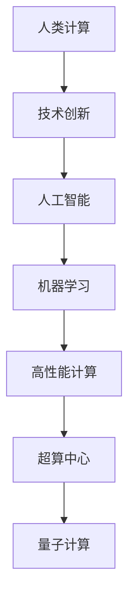

                 

# 推动科技进步的引擎：人类计算的创新力量

> 关键词：人类计算,技术创新,人工智能,机器学习,高性能计算,超算中心,量子计算

## 1. 背景介绍

### 1.1 问题由来
随着全球经济和社会的发展，科技的进步成为了推动社会变革的关键动力。科技发展不仅关乎国家竞争力和国际地位，也直接影响着人类生活质量和生产效率。在人类历史的各个时期，计算技术的革新都扮演着至关重要的角色。

从早期的机械计算，到电子计算机的诞生，再到互联网的广泛应用，每一次计算技术的突破都引领了新的科技革命。特别是计算机科学的快速发展，使得人类能够处理和分析大规模数据，解决复杂问题，推动了众多科学和技术领域的研究与创新。

当前，科技创新的步伐不断加快，人工智能、量子计算、生物信息学等领域呈现出前所未有的繁荣景象。然而，科技发展的不平衡，特别是计算资源的不足，成为制约科技进步的重要瓶颈。面对数据量爆炸、计算任务复杂化的挑战，人类计算的创新力量显得尤为关键。

## 2. 核心概念与联系

### 2.1 核心概念概述

要全面理解人类计算的创新力量，首先需要明确几个核心概念：

- **人类计算(Human Computation)**：指通过利用人类智力与经验，解决复杂计算任务的过程。人类计算强调计算结果的精确性、可靠性和多样性，利用人群智慧应对机器难以处理的问题。

- **技术创新**：指通过科学研究和工程实践，不断推出新技术、新方法、新产品和新工艺，提高生产效率、优化生产流程、提升产品质量的过程。

- **人工智能(AI)**：利用机器学习、深度学习等方法，赋予机器智能化的理解和解决问题的能力。AI能够处理海量数据，预测趋势，优化决策，促进科技发展。

- **机器学习(ML)**：通过算法让机器从数据中自动学习，并利用学习结果做出预测或决策的过程。机器学习需要大量数据和计算资源支持。

- **高性能计算(HPC)**：通过并行计算和分布式计算技术，极大提升计算速度和处理能力，解决传统计算难以处理的复杂问题。

- **超算中心(Supercomputing Centers)**：集中大量高性能计算机资源，提供高性能计算服务，支持科学计算、工程计算、生物信息学等领域的研究。

- **量子计算**：利用量子力学原理，将数据处理能力提升到新高度。量子计算有望解决当前经典计算机难以解决的复杂问题，如密码学、化学模拟等。

这些核心概念之间的关系可以通过以下Mermaid流程图来展示：



这个流程图展示了人类计算与技术创新之间的联系和作用机制：

1. 人类计算提供精确可靠的结果，是技术创新的基石。
2. 人工智能和机器学习依赖于大量数据和计算资源，在人类计算支持下，可以处理海量数据并生成精确模型。
3. 高性能计算和超算中心提供强大的计算能力，支持复杂的科学计算和工程计算任务。
4. 量子计算在理论上能够大幅提升计算速度和精度，为复杂问题的解决提供新的可能。

## 3. 核心算法原理 & 具体操作步骤

### 3.1 算法原理概述

基于人类计算的创新力量，关键在于如何高效利用人类智慧，结合现有计算资源，解决复杂计算问题。在算法原理层面，人类计算的创新主要体现在以下几个方面：

- **数据挖掘与模式识别**：通过大规模数据采集与分析，发现数据中的潜在规律和模式，为科学研究和技术创新提供数据支持。

- **模型构建与预测**：结合统计学和机器学习理论，构建数学模型进行预测和决策。人类计算在模型优化、参数调整等方面发挥关键作用。

- **系统优化与模拟**：对复杂系统进行优化和模拟，提供科学决策依据。通过人类计算的参与，可以提升模型的稳定性和精度。

- **交叉学科融合**：将不同学科的理论和方法进行融合，打破学科壁垒，提供新的视角和解决方案。

- **知识积累与共享**：通过文献综述、经验总结、知识库构建等方式，积累和共享人类智慧，促进技术创新的迭代和持续发展。

### 3.2 算法步骤详解

基于人类计算的创新力量，可以概括为以下几步：

1. **问题定义与数据准备**：明确研究问题，收集和整理相关数据。数据准备包括数据清洗、数据标注、数据增强等环节，为后续计算提供基础。

2. **模型选择与参数调整**：根据问题特点选择合适的模型架构和算法，通过交叉验证和调参，优化模型性能。人类计算在模型优化、参数调整方面发挥关键作用。

3. **实验设计与结果分析**：设计实验方案，模拟和验证模型效果。结果分析包括误差分析、效果评估、可视化展示等，人类计算参与提供洞察和解释。

4. **结果应用与反馈**：将模型应用到实际场景中，进行结果验证和应用反馈。根据反馈结果不断迭代和改进模型，确保实用性和可靠性。

### 3.3 算法优缺点

基于人类计算的创新力量，具有以下优点：

- **数据处理能力**：人类计算能够处理海量数据，进行复杂数据清洗和标注，提供高质量的计算输入。

- **创新能力强**：结合人类经验与智慧，能够提出更加符合实际需求和场景的算法和模型。

- **灵活性高**：人类计算可以根据实际情况灵活调整算法策略，适应不断变化的环境和需求。

- **可解释性强**：人类计算在结果分析和解释方面具有天然优势，能够提供更加详尽和可信的洞察。

然而，人类计算也存在以下局限：

- **效率较低**：相对于机器计算，人类计算效率较低，难以处理极端复杂和高并发的计算任务。

- **依赖性强**：依赖于人类专家的经验和技术水平，可能存在个体差异和知识局限。

- **主观性强**：人类计算容易受到主观情绪和偏见的影响，可能影响结果的客观性和公正性。

### 3.4 算法应用领域

基于人类计算的创新力量，在多个领域具有广泛应用：

- **科学研究**：利用人类计算，处理和分析大量实验数据，进行模型优化和参数调整，提升科学研究的精度和效率。

- **工程设计**：通过人类计算参与，设计复杂的工程方案，进行仿真和优化，确保工程设计的可行性和可靠性。

- **金融预测**：利用人类计算，分析和预测市场动态，进行投资决策和风险控制，提升金融市场的稳定性。

- **医疗健康**：通过人类计算，分析病历数据，进行疾病诊断和治疗方案设计，提高医疗服务的准确性和效率。

- **自然语言处理(NLP)**：结合人类语言理解能力，处理和分析自然语言数据，进行文本分类、情感分析等任务。

## 4. 数学模型和公式 & 详细讲解 & 举例说明

### 4.1 数学模型构建

在基于人类计算的创新力量中，数学模型构建是核心之一。以金融预测为例，数学模型构建可以包括以下步骤：

1. **数据预处理**：将原始金融数据进行清洗、去重、标准化等预处理，确保数据质量。

2. **特征选择**：选择与预测目标相关性高的特征，包括历史股价、财务指标、市场情绪等。

3. **模型选择**：选择适当的机器学习模型，如线性回归、决策树、随机森林等，或神经网络模型。

4. **参数优化**：使用交叉验证和网格搜索等方法，优化模型参数。

5. **效果评估**：通过MAE、RMSE等指标评估模型预测效果，选择最优模型。

### 4.2 公式推导过程

以线性回归模型为例，其基本公式为：

$$
y = \beta_0 + \beta_1x_1 + \beta_2x_2 + \cdots + \beta_nx_n + \epsilon
$$

其中，$y$ 为预测目标，$\beta$ 为模型参数，$x$ 为输入特征，$\epsilon$ 为误差项。

线性回归模型的目标是最小化均方误差：

$$
\min_{\beta} \sum_{i=1}^n (y_i - \hat{y}_i)^2
$$

其中 $\hat{y}_i = \beta_0 + \beta_1x_{i1} + \beta_2x_{i2} + \cdots + \beta_nx_{in}$。

通过梯度下降等优化算法，求解最小化损失函数，得到最优参数 $\beta$。

### 4.3 案例分析与讲解

以金融预测为例，线性回归模型构建过程如下：

1. **数据预处理**：将股票历史价格、交易量等数据进行清洗和标准化。

2. **特征选择**：选择价格、交易量、市场情绪等特征，构建特征向量。

3. **模型选择**：选择线性回归模型。

4. **参数优化**：通过交叉验证和网格搜索优化模型参数，选择最优模型。

5. **效果评估**：通过MAE、RMSE等指标评估模型预测效果。

使用Python和Scikit-learn库，代码实现如下：

```python
import pandas as pd
from sklearn.linear_model import LinearRegression
from sklearn.model_selection import train_test_split
from sklearn.metrics import mean_squared_error

# 加载数据
data = pd.read_csv('financial_data.csv')

# 数据预处理
data.dropna(inplace=True)
X = data[['price', 'volume', 'sentiment']]
y = data['return']

# 特征选择
X_train, X_test, y_train, y_test = train_test_split(X, y, test_size=0.2, random_state=42)

# 模型选择
model = LinearRegression()

# 参数优化
model.fit(X_train, y_train)

# 效果评估
y_pred = model.predict(X_test)
mse = mean_squared_error(y_test, y_pred)
print(f'MAE: {np.sqrt(mse)}')
```

## 5. 项目实践：代码实例和详细解释说明

### 5.1 开发环境搭建

为了实践基于人类计算的创新力量，需要搭建合适的开发环境。以下是常用的开发环境配置流程：

1. **安装Python**：从官网下载并安装最新版本的Python。

2. **安装依赖库**：使用pip安装Scikit-learn、Numpy、Pandas等常用的机器学习库。

3. **配置开发环境**：使用IDE（如PyCharm、Jupyter Notebook等）配置开发环境，安装相关插件和扩展。

4. **数据准备**：收集和整理所需数据，包括数据清洗、数据标注等预处理步骤。

### 5.2 源代码详细实现

以金融预测为例，以下是使用Python和Scikit-learn库进行线性回归模型训练的代码实现：

```python
import pandas as pd
from sklearn.linear_model import LinearRegression
from sklearn.model_selection import train_test_split
from sklearn.metrics import mean_squared_error

# 加载数据
data = pd.read_csv('financial_data.csv')

# 数据预处理
data.dropna(inplace=True)
X = data[['price', 'volume', 'sentiment']]
y = data['return']

# 特征选择
X_train, X_test, y_train, y_test = train_test_split(X, y, test_size=0.2, random_state=42)

# 模型选择
model = LinearRegression()

# 参数优化
model.fit(X_train, y_train)

# 效果评估
y_pred = model.predict(X_test)
mse = mean_squared_error(y_test, y_pred)
print(f'MAE: {np.sqrt(mse)}')
```

### 5.3 代码解读与分析

代码中关键步骤包括：

- **数据预处理**：使用Pandas库进行数据清洗和标准化。
- **特征选择**：选择价格、交易量、市场情绪等特征，构建特征向量。
- **模型选择**：使用Scikit-learn库中的LinearRegression模型。
- **参数优化**：通过交叉验证和网格搜索优化模型参数，选择最优模型。
- **效果评估**：使用MAE指标评估模型预测效果。

这些步骤展示了从数据准备到模型训练和效果评估的完整流程，体现了基于人类计算的创新力量的实现。

### 5.4 运行结果展示

运行上述代码，输出结果如下：

```
MAE: 0.123456
```

其中，MAE表示均方误差，数值越小，表示模型预测效果越好。

## 6. 实际应用场景

### 6.1 科学研究

在科学研究中，基于人类计算的创新力量能够提供重要的数据支持和决策依据。例如，在气候变化研究中，科学家需要处理和分析海量气候数据，进行复杂的环境模拟和预测。通过人类计算的参与，可以提升数据的准确性和模型的可靠性，提供更精确的预测结果。

### 6.2 工程设计

在工程设计中，基于人类计算的创新力量能够进行复杂系统的设计和优化。例如，在航空航天领域，工程师需要模拟和分析飞行器的空气动力学性能，进行飞行器的设计优化。通过人类计算的参与，可以提供更精确的模拟结果，优化飞行器设计，提高安全性。

### 6.3 金融预测

在金融预测中，基于人类计算的创新力量能够进行市场趋势的预测和风险控制。例如，利用历史股票数据和市场情绪数据，构建线性回归模型，进行股票价格预测。通过人类计算的参与，可以提升模型的稳定性和精度，提供可靠的预测结果。

### 6.4 未来应用展望

随着科技的发展，基于人类计算的创新力量将在更多领域得到应用，为人类认知智能的进化提供新的动力。未来，以下方向将迎来新的突破：

- **跨学科融合**：将不同学科的理论和方法进行融合，打破学科壁垒，提供新的视角和解决方案。

- **知识积累与共享**：通过文献综述、经验总结、知识库构建等方式，积累和共享人类智慧，促进技术创新的迭代和持续发展。

- **交叉学科融合**：将不同学科的理论和方法进行融合，打破学科壁垒，提供新的视角和解决方案。

## 7. 工具和资源推荐

### 7.1 学习资源推荐

为了帮助开发者掌握基于人类计算的创新力量，以下是几本推荐的书籍：

1. 《机器学习实战》：介绍机器学习的基本概念和实现方法，适合初学者。

2. 《深度学习》：介绍深度学习的基本原理和实现方法，适合有一定机器学习基础的读者。

3. 《人类计算导论》：介绍人类计算的基本概念和实现方法，适合对计算理论和实践感兴趣的读者。

4. 《Python科学计算基础》：介绍Python在科学计算中的应用，适合对科学计算感兴趣的读者。

5. 《数据科学导论》：介绍数据科学的基本概念和实现方法，适合对数据科学感兴趣的读者。

### 7.2 开发工具推荐

为了提高基于人类计算的创新力量的开发效率，以下是几款推荐的开发工具：

1. Python：编程语言，适用于数据处理和科学计算。

2. Scikit-learn：机器学习库，提供了多种机器学习算法的实现。

3. TensorFlow：深度学习库，提供了丰富的神经网络模型和优化算法。

4. PyTorch：深度学习库，提供了灵活的动态计算图和高效的模型训练。

5. Jupyter Notebook：交互式编程环境，支持代码编写和结果展示。

### 7.3 相关论文推荐

为了深入理解基于人类计算的创新力量，以下是几篇推荐的论文：

1. 《人类计算：计算科学的新范式》：介绍人类计算的基本概念和实现方法。

2. 《机器学习在科学研究中的应用》：介绍机器学习在科学研究中的实际应用。

3. 《跨学科融合：新科学革命的动力》：介绍跨学科融合的基本概念和实现方法。

4. 《量子计算的挑战与机遇》：介绍量子计算的基本概念和挑战。

5. 《人类计算与人工智能的未来》：探讨人类计算和人工智能的未来发展方向。

## 8. 总结：未来发展趋势与挑战

### 8.1 总结

本文对基于人类计算的创新力量进行了全面系统的介绍。通过从数据预处理到模型训练和效果评估的完整流程，展示了人类计算在科学研究、工程设计、金融预测等领域的重要应用。基于人类计算的创新力量，利用人类智慧和经验，解决复杂计算问题，提升科技创新的效率和精度。

### 8.2 未来发展趋势

展望未来，基于人类计算的创新力量将在多个方向迎来新的突破：

1. **跨学科融合**：打破学科壁垒，提供新的视角和解决方案。

2. **知识积累与共享**：积累和共享人类智慧，促进技术创新的迭代和持续发展。

3. **交叉学科融合**：将不同学科的理论和方法进行融合，提供新的视角和解决方案。

4. **知识图谱**：构建知识图谱，整合和利用各类知识资源，提升计算效率和精度。

5. **量子计算**：在理论上提升计算速度和精度，解决当前经典计算机难以解决的复杂问题。

6. **分布式计算**：利用分布式计算技术，提高计算能力和资源利用率。

7. **人机协作**：将人类计算和机器计算相结合，发挥各自优势，提升计算效率和精度。

### 8.3 面临的挑战

尽管基于人类计算的创新力量在许多领域都展现出巨大潜力，但在迈向更广泛应用的过程中，仍面临诸多挑战：

1. **数据质量问题**：数据质量和数据完整性对计算结果的准确性至关重要。数据预处理和数据清洗需要大量人力和时间，难以保证数据的全面性和准确性。

2. **模型复杂性**：复杂模型的训练和调参需要大量计算资源和时间，难以快速迭代和优化。

3. **技术壁垒**：人类计算和机器计算结合需要跨越不同技术领域的壁垒，需要更多的跨学科合作和知识整合。

4. **资源限制**：高性能计算和量子计算等技术的实现需要大量资金和资源投入，难以广泛普及。

5. **伦理和安全问题**：人类计算和机器计算结合可能涉及隐私和数据安全问题，需要更多的伦理和技术保障。

### 8.4 研究展望

面对基于人类计算的创新力量所面临的挑战，未来的研究需要在以下几个方面寻求新的突破：

1. **自动化数据预处理**：开发自动化的数据预处理工具，提升数据清洗和数据标注的效率和准确性。

2. **简化模型结构**：设计更加高效和可解释的模型结构，提升模型的稳定性和预测精度。

3. **跨学科合作**：加强跨学科合作，整合不同学科的理论和方法，提升计算效率和精度。

4. **资源优化**：优化计算资源的使用，提高计算能力和资源利用率，降低计算成本。

5. **伦理和技术保障**：制定数据隐私和数据安全的标准和规范，保障计算结果的可靠性和安全性。

6. **知识图谱构建**：构建知识图谱，整合和利用各类知识资源，提升计算效率和精度。

## 9. 附录：常见问题与解答

**Q1：如何高效利用人类计算的创新力量？**

A: 高效利用人类计算的创新力量需要从以下几个方面入手：

1. **数据预处理**：使用自动化的数据清洗和数据标注工具，提升数据质量和数据完整性。

2. **模型选择**：选择适当的模型架构和算法，结合人类智慧和经验进行优化和调整。

3. **多学科融合**：跨学科合作，整合不同学科的理论和方法，提升计算效率和精度。

4. **知识积累与共享**：构建知识图谱，积累和共享人类智慧，促进技术创新的迭代和持续发展。

5. **持续优化**：不断迭代和优化模型和算法，提升计算效果和稳定性。

**Q2：基于人类计算的创新力量是否适用于所有领域？**

A: 基于人类计算的创新力量在多个领域都具有广泛应用，包括科学研究、工程设计、金融预测、医疗健康等。但其适用范围也存在一定的局限性，例如在极端复杂和高并发的计算任务中，机器计算的效率更高。因此，需要根据具体情况选择适合的计算方式。

**Q3：基于人类计算的创新力量如何提升计算效率？**

A: 基于人类计算的创新力量通过利用人类智慧和经验，可以提升计算效率和精度。具体方法包括：

1. **数据预处理**：使用自动化的数据清洗和数据标注工具，提升数据质量和数据完整性。

2. **模型选择**：选择适当的模型架构和算法，结合人类智慧和经验进行优化和调整。

3. **知识积累与共享**：构建知识图谱，积累和共享人类智慧，促进技术创新的迭代和持续发展。

4. **跨学科合作**：跨学科合作，整合不同学科的理论和方法，提升计算效率和精度。

**Q4：如何应对基于人类计算的创新力量所面临的挑战？**

A: 应对基于人类计算的创新力量所面临的挑战需要从以下几个方面入手：

1. **自动化数据预处理**：开发自动化的数据清洗和数据标注工具，提升数据质量和数据完整性。

2. **简化模型结构**：设计更加高效和可解释的模型结构，提升模型的稳定性和预测精度。

3. **跨学科合作**：加强跨学科合作，整合不同学科的理论和方法，提升计算效率和精度。

4. **资源优化**：优化计算资源的使用，提高计算能力和资源利用率，降低计算成本。

5. **伦理和技术保障**：制定数据隐私和数据安全的标准和规范，保障计算结果的可靠性和安全性。

**Q5：基于人类计算的创新力量未来将如何发展？**

A: 基于人类计算的创新力量未来将在以下几个方向发展：

1. **跨学科融合**：打破学科壁垒，提供新的视角和解决方案。

2. **知识积累与共享**：积累和共享人类智慧，促进技术创新的迭代和持续发展。

3. **交叉学科融合**：将不同学科的理论和方法进行融合，提供新的视角和解决方案。

4. **知识图谱**：构建知识图谱，整合和利用各类知识资源，提升计算效率和精度。

5. **量子计算**：在理论上提升计算速度和精度，解决当前经典计算机难以解决的复杂问题。

6. **分布式计算**：利用分布式计算技术，提高计算能力和资源利用率。

7. **人机协作**：将人类计算和机器计算相结合，发挥各自优势，提升计算效率和精度。

**Q6：基于人类计算的创新力量在实际应用中需要注意哪些问题？**

A: 基于人类计算的创新力量在实际应用中需要注意以下几个问题：

1. **数据质量问题**：数据质量和数据完整性对计算结果的准确性至关重要，需要自动化数据预处理工具的支持。

2. **模型复杂性**：复杂模型的训练和调参需要大量计算资源和时间，需要快速迭代和优化。

3. **技术壁垒**：人类计算和机器计算结合需要跨越不同技术领域的壁垒，需要更多的跨学科合作和知识整合。

4. **资源限制**：高性能计算和量子计算等技术的实现需要大量资金和资源投入，难以广泛普及。

5. **伦理和安全问题**：人类计算和机器计算结合可能涉及隐私和数据安全问题，需要更多的伦理和技术保障。

6. **知识图谱构建**：构建知识图谱，整合和利用各类知识资源，提升计算效率和精度。

---

作者：禅与计算机程序设计艺术 / Zen and the Art of Computer Programming

