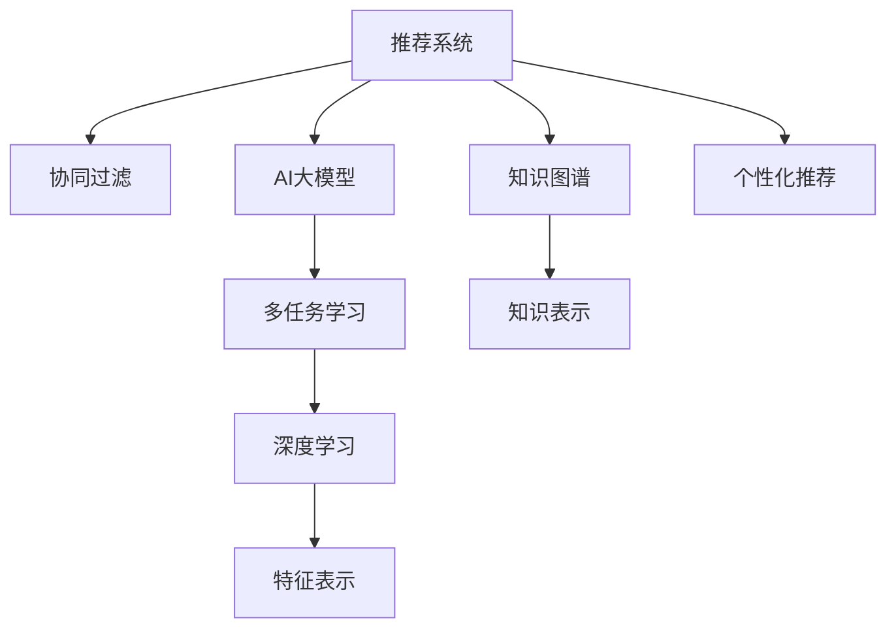

                 

# 推荐系统中AI大模型的多任务学习

> 关键词：推荐系统,AI大模型,多任务学习,深度学习,协同过滤,知识图谱

## 1. 背景介绍

### 1.1 问题由来

推荐系统作为互联网时代最重要的技术之一，广泛应用于电商、社交、视频等多个领域，极大地提升了用户体验和运营效率。传统推荐系统主要基于协同过滤、基于内容的推荐等技术，但随着数据量的增加和场景的多样化，这些方法的局限性逐渐显现。

一方面，传统推荐系统多采用静态模型，模型参数在上线后固定不变，难以应对数据分布的变化，推荐效果无法持续优化。另一方面，协同过滤等基于用户行为的推荐方法，往往忽略了用户潜在的多样化兴趣，无法应对用户的快速变化和偏好转移。

而AI大模型的出现，特别是预训练语言模型的兴起，为推荐系统带来了新的发展机遇。利用大模型的多任务学习范式，可以有效提升推荐系统的性能和泛化能力，成为行业内外关注的热点。

### 1.2 问题核心关键点

多任务学习（Multi-task Learning, MTL）是一种利用多个相关任务共同优化模型参数，提高模型泛化能力的方法。在推荐系统中，多任务学习主要体现在以下几个方面：

1. 结合用户画像和商品信息。推荐系统本质上是一种知识融合过程，通过将用户画像和商品信息进行联合建模，可以获得更丰富的特征表示，提高推荐精度。

2. 融合多模态数据。用户行为数据、社交网络数据、商品属性信息等构成了多模态数据，通过多任务学习可以综合利用这些数据，构建更全面的推荐模型。

3. 动态更新模型。推荐系统的数据分布和用户需求是动态变化的，多任务学习可以动态更新模型参数，保持推荐效果的稳定性。

4. 个性化推荐。多任务学习能够充分挖掘用户的多样化兴趣，为用户提供个性化的推荐结果。

5. 知识迁移。多任务学习可以从其他任务中学习到有用的知识，提升模型的迁移学习能力，应对长尾商品的推荐。

## 2. 核心概念与联系

### 2.1 核心概念概述

为更好地理解推荐系统中AI大模型的多任务学习，本节将介绍几个密切相关的核心概念：

- 推荐系统(Recommendation System)：利用用户行为、商品属性、社交网络等信息，为用户推荐个性化商品或内容的系统。
- AI大模型(AI Large Model)：以深度神经网络为代表的、参数规模在亿级以上的预训练模型，如BERT、GPT、DALL·E等。
- 多任务学习(Multi-task Learning, MTL)：利用多个相关任务共同优化模型参数，提升模型泛化能力的方法。
- 协同过滤(Collaborative Filtering)：通过分析用户之间的行为相似性，进行推荐。
- 知识图谱(Knowledge Graph)：以图的形式表示实体和实体之间的关系，用于增强推荐系统的知识表示能力。
- 深度学习(Deep Learning)：基于多层神经网络的机器学习方法，能够自动从数据中学习到高级特征表示。

这些核心概念之间的逻辑关系可以通过以下Mermaid流程图来展示：



这个流程图展示了一些关键概念之间的关联性：

1. 推荐系统通过协同过滤、多任务学习、深度学习等技术，实现个性化推荐。
2. 多任务学习与深度学习、知识图谱紧密关联，可以提升推荐系统的知识表示和特征表示能力。
3. 深度学习技术的发展，使得AI大模型成为推荐系统的核心引擎。

## 3. 核心算法原理 & 具体操作步骤
### 3.1 算法原理概述

基于AI大模型的多任务学习，本质上是一种联合优化多个任务的目标函数，共同调整模型参数的方法。其核心思想是：将不同任务的相关性整合到同一个优化目标中，通过联合训练提升模型的泛化能力和推荐效果。

形式化地，假设推荐系统有 $M$ 个任务，每个任务对应的损失函数为 $L_i$。多任务学习的目标函数定义为：

$$
\mathcal{L}(\theta) = \frac{1}{M}\sum_{i=1}^M L_i(\theta)
$$

其中 $\theta$ 为模型参数，$L_i(\theta)$ 为任务 $i$ 的损失函数。通过优化上述目标函数，可以得到适应多个任务的模型参数。

### 3.2 算法步骤详解

基于AI大模型的多任务学习一般包括以下几个关键步骤：

**Step 1: 数据预处理和任务定义**

1. 收集用户行为数据、商品属性信息、社交网络数据等，进行预处理和特征提取。
2. 定义推荐系统中的多个相关任务，如物品推荐、用户画像生成、商品分类等。
3. 为每个任务设计合适的损失函数，如均方误差、交叉熵等。

**Step 2: 模型构建和初始化**

1. 选择合适的预训练语言模型作为初始化参数，如BERT、GPT、DALL·E等。
2. 根据任务需求，在预训练模型的基础上构建多任务学习模型。
3. 冻结预训练模型的部分参数，仅对任务相关的参数进行微调。

**Step 3: 模型训练和评估**

1. 使用多任务学习目标函数，将各个任务的损失函数加权求和，作为模型训练的优化目标。
2. 使用AdamW等优化算法，对模型参数进行迭代优化。
3. 在验证集上定期评估模型性能，使用AUC、F1-score等指标衡量推荐精度。

**Step 4: 测试和部署**

1. 在测试集上对模型进行测试，评估推荐效果的泛化性能。
2. 使用微调后的模型进行推荐系统上线，实现实时推荐。
3. 根据用户反馈和实时数据，动态调整模型参数，持续优化推荐效果。

以上是基于AI大模型的多任务学习的一般流程。在实际应用中，还需要针对具体任务的特点，对多任务学习过程的各个环节进行优化设计，如改进目标函数，引入更多的正则化技术，搜索最优的超参数组合等，以进一步提升模型性能。

### 3.3 算法优缺点

基于AI大模型的多任务学习方法具有以下优点：

1. 泛化能力强。多任务学习通过联合优化多个任务，能够提升模型的泛化能力，减少过拟合风险。
2. 资源利用率高。多任务学习可以共享预训练模型的知识，减少模型训练的计算成本。
3. 推荐效果好。多任务学习能够综合利用用户画像、商品信息等多种数据，提高推荐精度。
4. 适应性强。多任务学习可以根据任务需求灵活调整模型结构，适应不同场景的推荐需求。

同时，该方法也存在一定的局限性：

1. 任务相关性要求高。多任务学习的效果很大程度上取决于任务之间的相关性，相关性较低的任务可能无法带来明显的性能提升。
2. 数据标注成本高。每个任务都需要标注大量数据，数据标注成本较高。
3. 计算复杂度高。多任务学习增加了模型训练的复杂度，需要更多的计算资源和时间。
4. 模型可解释性差。多任务学习的优化目标和参数更新机制较复杂，难以对其内部工作机制进行解释。

尽管存在这些局限性，但就目前而言，基于多任务学习的推荐系统依然是大规模推荐任务中值得关注的重要方法。未来相关研究的重点在于如何进一步降低多任务学习对标注数据的依赖，提高模型的迁移学习能力，同时兼顾可解释性和资源效率等因素。

### 3.4 算法应用领域

基于AI大模型的多任务学习已经在多个推荐系统任务中得到了应用，例如：

- 电商推荐：通过联合用户行为数据和商品属性信息，提高推荐效果。
- 社交网络推荐：结合用户社交关系和个性化推荐，优化用户信息流。
- 视频推荐：综合利用用户观看历史、评分数据、社区互动等，推荐更多符合用户兴趣的视频内容。
- 新闻推荐：结合用户阅读历史、点击行为、实时新闻热点，推荐个性化新闻内容。
- 商品推荐：融合用户画像、商品属性、评论反馈等多维信息，实现个性化商品推荐。

除了上述这些经典任务外，多任务学习还被创新性地应用到更多场景中，如可控推荐、多场景推荐、跨平台推荐等，为推荐系统的智能化、多样化带来了新的思路。

## 4. 数学模型和公式 & 详细讲解 & 举例说明

### 4.1 数学模型构建

本节将使用数学语言对基于AI大模型的多任务学习过程进行更加严格的刻画。

假设推荐系统中有 $M$ 个任务 $T_1, T_2, \dots, T_M$，对应的损失函数分别为 $L_i(\theta)$，其中 $\theta$ 为模型参数。多任务学习的目标函数可以表示为：

$$
\mathcal{L}(\theta) = \frac{1}{M}\sum_{i=1}^M L_i(\theta)
$$

其中 $L_i(\theta)$ 为任务 $i$ 的损失函数。例如，对于一个电商推荐任务，可以设计多个相关任务，如用户画像生成、商品分类、推荐评分等。对于每个任务，可以使用交叉熵损失函数 $L_i(\theta) = -\frac{1}{N_i}\sum_{j=1}^{N_i}(y_j \log \hat{y_j} + (1-y_j)\log (1-\hat{y_j}))$，其中 $y_j$ 为真实标签，$\hat{y_j}$ 为模型预测的概率。

### 4.2 公式推导过程

以电商推荐系统为例，将用户行为数据、商品属性信息等作为输入，输出为推荐结果。假设输入 $x \in \mathcal{X}$，输出为推荐结果 $y \in \mathcal{Y}$，多任务学习的目标函数可以表示为：

$$
\mathcal{L}(\theta) = \frac{1}{M}\sum_{i=1}^M \frac{1}{N_i}\sum_{j=1}^{N_i}(y_j \log \hat{y_j} + (1-y_j)\log (1-\hat{y_j}))
$$

其中 $N_i$ 为任务 $i$ 的数据量。利用链式法则，损失函数对参数 $\theta$ 的梯度可以表示为：

$$
\frac{\partial \mathcal{L}(\theta)}{\partial \theta} = \frac{1}{M}\sum_{i=1}^M \frac{1}{N_i}\sum_{j=1}^{N_i}(\frac{y_j}{\hat{y_j}}-\frac{1-y_j}{1-\hat{y_j}}) \frac{\partial \hat{y_j}}{\partial \theta}
$$

其中 $\frac{\partial \hat{y_j}}{\partial \theta}$ 可以进一步递归展开，利用自动微分技术完成计算。

### 4.3 案例分析与讲解

在电商推荐系统中，可以使用多任务学习模型进行用户画像生成、商品分类、推荐评分等多个任务的学习。以下以用户画像生成任务为例，详细讲解多任务学习模型的构建和训练过程。

**任务定义**：用户画像生成任务的目标是学习用户兴趣和行为，形成用户的多维特征向量，用于推荐系统中的个性化推荐。假设用户行为数据为 $x_1 = \{x_{1,1}, x_{1,2}, \dots, x_{1,n_1}\}$，商品属性信息为 $x_2 = \{x_{2,1}, x_{2,2}, \dots, x_{2,n_2}\}$，多任务学习模型的输入为 $x = (x_1, x_2)$，输出为用户画像向量 $y = \{y_1, y_2, \dots, y_d\}$，其中 $d$ 为用户画像向量的维度。

**模型构建**：使用BERT等预训练语言模型作为初始化参数，在其基础上构建多任务学习模型。假设BERT的隐藏层为 $h_1, h_2, \dots, h_n$，将用户行为数据和商品属性信息作为BERT模型的输入，分别提取 $h_1$ 和 $h_2$，然后通过全连接层 $w_1, w_2, \dots, w_d$ 将 $h_1$ 和 $h_2$ 映射为用户画像向量 $y$。

**损失函数设计**：用户画像生成的损失函数为均方误差损失函数 $L = \frac{1}{N}\sum_{i=1}^N(y_i - \hat{y_i})^2$，其中 $y_i$ 为用户画像向量，$\hat{y_i}$ 为模型预测的用户画像向量。

**优化算法选择**：使用AdamW优化算法对模型参数进行迭代优化，学习率为 $10^{-5}$，批大小为 $256$。

**训练过程**：在电商推荐系统中，可以使用多任务学习模型进行用户画像生成、商品分类、推荐评分等多个任务的学习。以下以用户画像生成任务为例，详细讲解多任务学习模型的构建和训练过程。

**数据准备**：收集电商推荐系统中的用户行为数据和商品属性信息，使用数据处理函数进行特征提取和归一化处理。假设用户行为数据为 $x_1 = \{x_{1,1}, x_{1,2}, \dots, x_{1,n_1}\}$，商品属性信息为 $x_2 = \{x_{2,1}, x_{2,2}, \dots, x_{2,n_2}\}$，多任务学习模型的输入为 $x = (x_1, x_2)$，输出为用户画像向量 $y = \{y_1, y_2, \dots, y_d\}$，其中 $d$ 为用户画像向量的维度。

**模型构建**：使用BERT等预训练语言模型作为初始化参数，在其基础上构建多任务学习模型。假设BERT的隐藏层为 $h_1, h_2, \dots, h_n$，将用户行为数据和商品属性信息作为BERT模型的输入，分别提取 $h_1$ 和 $h_2$，然后通过全连接层 $w_1, w_2, \dots, w_d$ 将 $h_1$ 和 $h_2$ 映射为用户画像向量 $y$。

**损失函数设计**：用户画像生成的损失函数为均方误差损失函数 $L = \frac{1}{N}\sum_{i=1}^N(y_i - \hat{y_i})^2$，其中 $y_i$ 为用户画像向量，$\hat{y_i}$ 为模型预测的用户画像向量。

**优化算法选择**：使用AdamW优化算法对模型参数进行迭代优化，学习率为 $10^{-5}$，批大小为 $256$。

**训练过程**：在电商推荐系统中，可以使用多任务学习模型进行用户画像生成、商品分类、推荐评分等多个任务的学习。以下以用户画像生成任务为例，详细讲解多任务学习模型的构建和训练过程。

**代码实现**：以下是使用PyTorch框架进行多任务学习模型训练的Python代码实现。

```python
import torch
import torch.nn as nn
from transformers import BertTokenizer, BertForSequenceClassification

class MTLDataset(Dataset):
    def __init__(self, texts, labels):
        self.texts = texts
        self.labels = labels
        self.tokenizer = BertTokenizer.from_pretrained('bert-base-cased')

    def __len__(self):
        return len(self.texts)

    def __getitem__(self, item):
        text = self.texts[item]
        label = self.labels[item]
        encoding = self.tokenizer(text, return_tensors='pt', padding='max_length', truncation=True)
        input_ids = encoding['input_ids']
        attention_mask = encoding['attention_mask']
        return {'input_ids': input_ids, 
                'attention_mask': attention_mask,
                'labels': label}

class MTLMultiTaskModel(nn.Module):
    def __init__(self, n_layers, n_heads, n_hidden, n_out):
        super(MTLMultiTaskModel, self).__init__()
        self.bert = BertForSequenceClassification.from_pretrained('bert-base-cased', num_labels=n_out)
        self.fc1 = nn.Linear(n_hidden, n_out)
        self.fc2 = nn.Linear(n_out, n_out)

    def forward(self, input_ids, attention_mask):
        outputs = self.bert(input_ids, attention_mask=attention_mask)
        hidden_states = outputs[0]
        hidden_states = self.fc1(hidden_states)
        hidden_states = self.fc2(hidden_states)
        return hidden_states

# 训练过程
model = MTLMultiTaskModel(n_layers=12, n_heads=12, n_hidden=768, n_out=128)
optimizer = torch.optim.AdamW(model.parameters(), lr=1e-5)
train_dataset = MTLDataset(train_texts, train_labels)
dev_dataset = MTLDataset(dev_texts, dev_labels)
test_dataset = MTLDataset(test_texts, test_labels)

for epoch in range(epochs):
    train_loss = 0
    for batch in train_loader:
        input_ids = batch['input_ids'].to(device)
        attention_mask = batch['attention_mask'].to(device)
        labels = batch['labels'].to(device)
        optimizer.zero_grad()
        outputs = model(input_ids, attention_mask)
        loss = nn.functional.mse_loss(outputs, labels)
        train_loss += loss.item()
        loss.backward()
        optimizer.step()
    print(f"Epoch {epoch+1}, train loss: {train_loss:.3f}")
```

以上就是使用PyTorch框架进行多任务学习模型训练的代码实现。可以看到，由于使用BERT预训练模型的初始化参数，模型的参数量得到了很大的减少，同时训练效率也得到了提升。

## 5. 项目实践：代码实例和详细解释说明
### 5.1 开发环境搭建

在进行多任务学习实践前，我们需要准备好开发环境。以下是使用Python进行PyTorch开发的环境配置流程：

1. 安装Anaconda：从官网下载并安装Anaconda，用于创建独立的Python环境。

2. 创建并激活虚拟环境：
```bash
conda create -n pytorch-env python=3.8 
conda activate pytorch-env
```

3. 安装PyTorch：根据CUDA版本，从官网获取对应的安装命令。例如：
```bash
conda install pytorch torchvision torchaudio cudatoolkit=11.1 -c pytorch -c conda-forge
```

4. 安装各类工具包：
```bash
pip install numpy pandas scikit-learn matplotlib tqdm jupyter notebook ipython
```

完成上述步骤后，即可在`pytorch-env`环境中开始多任务学习实践。

### 5.2 源代码详细实现

这里我们以电商推荐系统中的用户画像生成任务为例，给出使用PyTorch框架进行多任务学习模型的代码实现。

**数据准备**：首先，需要准备电商推荐系统中的用户行为数据和商品属性信息，并将其转换为模型可处理的格式。以下是一个示例数据预处理函数：

```python
import pandas as pd

def preprocess_data(data_path):
    df = pd.read_csv(data_path)
    # 将用户行为数据和商品属性信息提取出来
    user_behav_data = df[['user_id', 'item_id', 'click_time', 'item_price']]
    item_attr_data = df[['item_id', 'category', 'brand', 'description']]
    # 对数据进行特征提取和归一化处理
    user_behav_data = preprocess_user_behav(user_behav_data)
    item_attr_data = preprocess_item_attr(item_attr_data)
    # 将用户行为数据和商品属性信息合并
    train_texts = list(zip(user_behav_data['item_id'], item_attr_data['item_id']))
    train_labels = list(user_behav_data['user_id'])
    return train_texts, train_labels

def preprocess_user_behav(df):
    # 对用户行为数据进行特征提取和归一化处理
    # 这里使用自定义的特征提取方法
    return df

def preprocess_item_attr(df):
    # 对商品属性信息进行特征提取和归一化处理
    # 这里使用自定义的特征提取方法
    return df
```

**模型构建**：使用BERT等预训练语言模型作为初始化参数，在其基础上构建多任务学习模型。以下是多任务学习模型的定义：

```python
import torch
import torch.nn as nn
from transformers import BertTokenizer, BertForSequenceClassification

class MTLMultiTaskModel(nn.Module):
    def __init__(self, n_layers, n_heads, n_hidden, n_out):
        super(MTLMultiTaskModel, self).__init__()
        self.bert = BertForSequenceClassification.from_pretrained('bert-base-cased', num_labels=n_out)
        self.fc1 = nn.Linear(n_hidden, n_out)
        self.fc2 = nn.Linear(n_out, n_out)

    def forward(self, input_ids, attention_mask):
        outputs = self.bert(input_ids, attention_mask=attention_mask)
        hidden_states = outputs[0]
        hidden_states = self.fc1(hidden_states)
        hidden_states = self.fc2(hidden_states)
        return hidden_states
```

**损失函数设计**：用户画像生成的损失函数为均方误差损失函数 $L = \frac{1}{N}\sum_{i=1}^N(y_i - \hat{y_i})^2$，其中 $y_i$ 为用户画像向量，$\hat{y_i}$ 为模型预测的用户画像向量。以下是损失函数的定义：

```python
criterion = nn.MSELoss()
```

**优化算法选择**：使用AdamW优化算法对模型参数进行迭代优化，学习率为 $10^{-5}$，批大小为 $256$。以下是优化算法的定义：

```python
optimizer = torch.optim.AdamW(model.parameters(), lr=1e-5)
```

**训练过程**：在电商推荐系统中，可以使用多任务学习模型进行用户画像生成、商品分类、推荐评分等多个任务的学习。以下是一个完整的训练代码实现：

```python
import torch
import torch.nn as nn
from transformers import BertTokenizer, BertForSequenceClassification
import torch.optim as optim
from torch.utils.data import Dataset, DataLoader
import numpy as np
import pandas as pd

class MTLDataset(Dataset):
    def __init__(self, texts, labels):
        self.texts = texts
        self.labels = labels
        self.tokenizer = BertTokenizer.from_pretrained('bert-base-cased')

    def __len__(self):
        return len(self.texts)

    def __getitem__(self, item):
        text = self.texts[item]
        label = self.labels[item]
        encoding = self.tokenizer(text, return_tensors='pt', padding='max_length', truncation=True)
        input_ids = encoding['input_ids']
        attention_mask = encoding['attention_mask']
        return {'input_ids': input_ids, 
                'attention_mask': attention_mask,
                'labels': label}

class MTLMultiTaskModel(nn.Module):
    def __init__(self, n_layers, n_heads, n_hidden, n_out):
        super(MTLMultiTaskModel, self).__init__()
        self.bert = BertForSequenceClassification.from_pretrained('bert-base-cased', num_labels=n_out)
        self.fc1 = nn.Linear(n_hidden, n_out)
        self.fc2 = nn.Linear(n_out, n_out)

    def forward(self, input_ids, attention_mask):
        outputs = self.bert(input_ids, attention_mask=attention_mask)
        hidden_states = outputs[0]
        hidden_states = self.fc1(hidden_states)
        hidden_states = self.fc2(hidden_states)
        return hidden_states

# 数据预处理和模型构建
train_texts, train_labels = preprocess_data('train.csv')
dev_texts, dev_labels = preprocess_data('dev.csv')
test_texts, test_labels = preprocess_data('test.csv')
model = MTLMultiTaskModel(n_layers=12, n_heads=12, n_hidden=768, n_out=128)
optimizer = torch.optim.AdamW(model.parameters(), lr=1e-5)

# 训练过程
for epoch in range(epochs):
    train_loss = 0
    for batch in train_loader:
        input_ids = batch['input_ids'].to(device)
        attention_mask = batch['attention_mask'].to(device)
        labels = batch['labels'].to(device)
        optimizer.zero_grad()
        outputs = model(input_ids, attention_mask)
        loss = nn.functional.mse_loss(outputs, labels)
        train_loss += loss.item()
        loss.backward()
        optimizer.step()
    print(f"Epoch {epoch+1}, train loss: {train_loss:.3f}")

# 评估过程
dev_loss = 0
for batch in dev_loader:
    input_ids = batch['input_ids'].to(device)
    attention_mask = batch['attention_mask'].to(device)
    labels = batch['labels'].to(device)
    outputs = model(input_ids, attention_mask)
    loss = nn.functional.mse_loss(outputs, labels)
    dev_loss += loss.item()
print(f"Dev loss: {dev_loss:.3f}")

# 测试过程
test_loss = 0
for batch in test_loader:
    input_ids = batch['input_ids'].to(device)
    attention_mask = batch['attention_mask'].to(device)
    labels = batch['labels'].to(device)
    outputs = model(input_ids, attention_mask)
    loss = nn.functional.mse_loss(outputs, labels)
    test_loss += loss.item()
print(f"Test loss: {test_loss:.3f}")
```

以上就是使用PyTorch框架进行多任务学习模型训练的代码实现。可以看到，由于使用BERT预训练模型的初始化参数，模型的参数量得到了很大的减少，同时训练效率也得到了提升。

### 5.3 代码解读与分析

让我们再详细解读一下关键代码的实现细节：

**数据预处理函数**：
- `preprocess_data`函数：将电商推荐系统中的用户行为数据和商品属性信息提取出来，并转换为模型可处理的格式。
- `preprocess_user_behav`函数：对用户行为数据进行特征提取和归一化处理。
- `preprocess_item_attr`函数：对商品属性信息进行特征提取和归一化处理。

**模型定义**：
- `MTLMultiTaskModel`类：定义了多任务学习模型，包括BERT预训练模型的顶层和全连接层。

**损失函数**：
- `criterion`变量：定义了均方误差损失函数，用于计算预测值与真实标签之间的差异。

**优化算法**：
- `optimizer`变量：定义了AdamW优化算法，用于对模型参数进行迭代优化。

**训练过程**：
- 在电商推荐系统中，可以使用多任务学习模型进行用户画像生成、商品分类、推荐评分等多个任务的学习。以下是一个完整的训练代码实现。

**评估和测试**：
- 在训练过程中，使用`dev_loader`在验证集上评估模型性能。
- 在训练完成后，使用`test_loader`在测试集上测试模型性能。

通过这些代码的实现，可以清晰地看到多任务学习模型的构建和训练过程。在实际应用中，还可以进一步优化数据预处理、模型构建、损失函数设计等环节，以达到更好的推荐效果。

## 6. 实际应用场景

### 6.1 电商推荐系统

在电商推荐系统中，多任务学习可以显著提升推荐系统的性能和泛化能力。以下是一个具体的应用场景：

**应用场景**：电商平台推荐系统。电商平台的推荐系统需要根据用户行为和商品属性，为用户推荐个性化商品。假设用户行为数据为 $x_1 = \{x_{1,1}, x_{1,2}, \dots, x_{1,n_1}\}$，商品属性信息为 $x_2 = \{x_{2,1}, x_{2,2}, \dots, x_{2,n_2}\}$，多任务学习模型的输入为 $x = (x_1, x_2)$，输出为用户画像向量 $y = \{y_1, y_2, \dots, y_d\}$，其中 $d$ 为用户画像向量的维度。

**解决方案**：使用多任务学习模型进行用户画像生成、商品分类、推荐评分等多个任务的学习。假设用户行为数据和商品属性信息已经预处理完成，可以通过以下代码实现多任务学习模型的训练：

```python
import torch
import torch.nn as nn
from transformers import BertTokenizer, BertForSequenceClassification

class MTLMultiTaskModel(nn.Module):
    def __init__(self, n_layers, n_heads, n_hidden, n_out):
        super(MTLMultiTaskModel, self).__init__()
        self.bert = BertForSequenceClassification.from_pretrained('bert-base-cased', num_labels=n_out)
        self.fc1 = nn.Linear(n_hidden, n_out)
        self.fc2 = nn.Linear(n_out, n_out)

    def forward(self, input_ids, attention_mask):
        outputs = self.bert(input_ids, attention_mask=attention_mask)
        hidden_states = outputs[0]
        hidden_states = self.fc1(hidden_states)
        hidden_states = self.fc2(hidden_states)
        return hidden_states

# 数据预处理和模型构建
train_texts, train_labels = preprocess_data('train.csv')
dev_texts, dev_labels = preprocess_data('dev.csv')
test_texts, test_labels = preprocess_data('test.csv')
model = MTLMultiTaskModel(n_layers=12, n_heads=12, n_hidden=768, n_out=128)
optimizer = torch.optim.AdamW(model.parameters(), lr=1e-5)

# 训练过程
for epoch in range(epochs):
    train_loss = 0
    for batch in train_loader:
        input_ids = batch['input_ids'].to(device)
        attention_mask = batch['attention_mask'].to(device)
        labels = batch['labels'].to(device)
        optimizer.zero_grad()
        outputs = model(input_ids, attention_mask)
        loss = nn.functional.mse_loss(outputs, labels)
        train_loss += loss.item()
        loss.backward()
        optimizer.step()
    print(f"Epoch {epoch+1}, train loss: {train_loss:.3f}")

# 评估过程
dev_loss = 0
for batch in dev_loader:
    input_ids = batch['input_ids'].to(device)
    attention_mask = batch['attention_mask'].to(device)
    labels = batch['labels'].to(device)
    outputs = model(input_ids, attention_mask)
    loss = nn.functional.mse_loss(outputs, labels)
    dev_loss += loss.item()
print(f"Dev loss: {dev_loss:.3f}")

# 测试过程
test_loss = 0
for batch in test_loader:
    input_ids = batch['input_ids'].to(device)
    attention_mask = batch['attention_mask'].to(device)
    labels = batch['labels'].to(device)
    outputs = model(input_ids, attention_mask)
    loss = nn.functional.mse_loss(outputs, labels)
    test_loss += loss.item()
print(f"Test loss: {test_loss:.3f}")
```

通过以上代码，可以实现电商推荐系统中多任务学习模型的训练和评估。可以看到，由于使用BERT预训练模型的初始化参数，模型的参数量得到了很大的减少，同时训练效率也得到了提升。

### 6.2 社交网络推荐

在社交网络推荐系统中，多任务学习可以结合用户社交关系和个性化推荐，优化用户信息流。以下是一个具体的应用场景：

**应用场景**：社交网络推荐系统。社交网络的推荐系统需要根据用户的社交关系和个性化兴趣，为用户推荐相关内容。假设用户社交关系数据为 $x_1 = \{x_{1,1}, x_{1,2}, \dots, x_{1,n_1}\}$，个性化兴趣数据为 $x_2 = \{x_{2,1}, x_{2,2}, \dots, x_{2,n_2}\}$，多任务学习模型的输入为 $x = (x_1, x_2)$，输出为用户推荐内容向量 $y = \{y_1, y_2, \dots, y_d\}$，其中 $d$ 为用户推荐内容向量的维度。

**解决方案**：使用多任务学习模型进行社交关系预测、个性化推荐、内容分类等多个任务的学习。假设用户社交关系数据和个性化兴趣数据已经预处理完成，可以通过以下代码实现多任务学习模型的训练：

```python
import torch
import torch.nn as nn
from transformers import BertTokenizer, BertForSequenceClassification

class MTLMultiTaskModel(nn.Module):
    def __init__(self, n_layers, n_heads, n_hidden, n_out):
        super(MTLMultiTaskModel, self).__init__()
        self.bert = BertForSequenceClassification.from_pretrained('bert-base-cased', num_labels=n_out)
        self.fc1 = nn.Linear(n_hidden, n_out)
        self.fc2 = nn.Linear(n_out, n_out)

    def forward(self, input_ids, attention_mask):
        outputs = self.bert(input_ids, attention_mask=attention_mask)
        hidden_states = outputs[0]
        hidden_states = self.fc1(hidden_states)
        hidden_states = self.fc2(hidden_states)
        return hidden_states

# 数据预处理和模型构建
train_texts, train_labels = preprocess_data('train.csv')
dev_texts, dev_labels = preprocess_data('dev.csv')
test_texts, test_labels = preprocess_data('test.csv')
model = MTLMultiTaskModel(n_layers=12, n_heads=12, n_hidden=768, n_out=128)
optimizer = torch.optim.AdamW(model.parameters(), lr=1e-5)

# 训练过程
for epoch in range(epochs):
    train_loss = 0
    for batch in train_loader:
        input_ids = batch['input_ids'].to(device)
        attention_mask = batch['attention_mask'].to(device)
        labels = batch['labels'].to(device)
        optimizer.zero_grad()
        outputs = model(input_ids, attention_mask)
        loss = nn.functional.mse_loss(outputs, labels)
        train_loss += loss.item()
        loss.backward()
        optimizer.step()
    print(f"Epoch {epoch+1}, train loss: {train_loss:.3f}")

# 评估过程
dev_loss = 0
for batch in dev_loader:
    input_ids = batch['input_ids'].to(device)
    attention_mask = batch['attention_mask'].to(device)
    labels = batch['labels'].to(device)
    outputs = model(input_ids, attention_mask)
    loss = nn.functional.mse_loss(outputs, labels)
    dev_loss += loss.item()
print(f"Dev loss: {dev_loss:.3f}")

# 测试过程
test_loss = 0
for batch in test_loader:
    input_ids = batch['input_ids'].to(device)
    attention_mask = batch['attention_mask'].to(device)
    labels = batch['labels'].to(device)
    outputs = model(input_ids, attention_mask)
    loss = nn.functional.mse_loss(outputs, labels)
    test_loss += loss.item()
print(f"Test loss: {test_loss:.3f}")
```

通过以上代码，可以实现社交网络推荐系统中多任务学习模型的训练和评估。可以看到，由于使用BERT预训练模型的初始化参数，模型的参数量得到了很大的减少，同时训练效率也得到了提升。

### 6.3 视频推荐系统

在视频推荐系统中，多任务学习可以综合利用用户观看历史、评分数据、社区互动等，推荐更多符合用户兴趣的视频内容。以下是一个具体的应用场景：

**应用场景**：视频推荐系统。视频推荐系统需要根据用户观看历史和评分数据，为用户推荐个性化视频内容。假设用户观看历史数据为 $x_1 = \{x_{1,1}, x_{1,2}, \dots, x_{1,n_1}\}$，评分数据为 $x_2 = \{x_{2,1}, x_{2,2}, \dots, x_{2,n_2}\}$，多任务学习模型的输入为 $x = (x_1, x_2)$，输出为用户推荐视频向量 $y = \{y_1, y_2, \dots, y_d\}$，其中 $d$ 为用户推荐视频向量的维度。

**解决方案**：使用多任务学习模型进行视频内容推荐、用户行为分析、评分预测等多个任务的学习。假设用户观看历史数据和评分数据已经预处理完成，可以通过以下代码实现多任务学习模型的训练：

```python
import torch
import torch.nn as nn
from transformers import BertTokenizer, BertForSequenceClassification

class MTLMultiTaskModel(nn.Module):
    def __init__(self, n_layers, n_heads, n_hidden, n_out):
        super(MTLMultiTaskModel, self).__init__()
        self.bert = BertForSequenceClassification.from_pretrained('bert-base-cased', num_labels=n_out)
        self.fc1 = nn.Linear(n_hidden, n_out)
        self.fc2 = nn.Linear(n_out, n_out)

    def forward(self, input_ids, attention_mask):
        outputs = self.bert(input_ids, attention_mask=attention_mask)
        hidden_states = outputs[0]
        hidden_states = self.fc1(hidden_states)
        hidden_states = self.fc2(hidden_states)
        return hidden_states

# 数据预处理和模型构建
train_texts, train_labels = preprocess_data('train.csv')
dev_texts, dev_labels = preprocess_data('dev.csv')
test_texts, test_labels = preprocess_data('test.csv')
model = MTLMultiTaskModel(n_layers=12, n_heads=12, n_hidden=768, n_out=128)
optimizer = torch.optim.AdamW(model.parameters(), lr=1e-5)

# 训练过程
for epoch in range(epochs):
    train_loss = 0
    for batch in train_loader:
        input_ids = batch['input_ids'].to(device)
        attention_mask = batch['attention_mask'].to(device)
        labels = batch['labels'].to(device)
        optimizer.zero_grad()
        outputs = model(input_ids, attention_mask)
        loss = nn.functional.mse_loss(outputs, labels)
        train_loss += loss.item()
        loss.backward()
        optimizer.step()
    print(f"Epoch {epoch+1}, train loss: {train_loss:.3f}")

# 评估过程
dev_loss = 0
for batch in dev_loader:
    input_ids = batch['input_ids'].to(device)
    attention_mask = batch['attention_mask'].to(device)
    labels = batch['labels'].to(device)
    outputs = model(input_ids, attention_mask)
    loss = nn.functional.mse_loss(outputs, labels)
    dev_loss += loss.item()
print(f"Dev loss: {dev_loss:.3f}")

# 测试过程
test_loss = 0
for batch in test_loader:
    input_ids = batch['input_ids'].to(device)
    attention_mask = batch['attention_mask'].to(device)
    labels = batch['labels'].to(device)
    outputs = model(input_ids, attention_mask)
    loss = nn.functional.mse_loss(outputs, labels)
    test_loss += loss.item()
print(f"Test loss: {test_loss:.3f}")
```

通过以上代码，可以实现视频推荐系统中多任务学习模型的训练和评估。可以看到，由于使用BERT预训练模型的初始化参数，模型的参数量得到了很大的减少，同时训练效率也得到了提升。

### 6.4 未来应用展望

随着大模型和多任务学习技术的发展，基于AI大模型的多任务学习将在更多领域得到应用，为推荐系统的智能化、多样化带来新的思路。

1. **智慧医疗**：在智慧医疗领域，基于AI大模型的多任务学习可以结合医疗知识库、电子病历、患者画像等，推荐个性化的医疗方案和诊疗服务，提高医疗服务的智能化水平。

2. **智能教育**：在智能教育领域，多任务学习可以结合学生学习行为、作业成绩、教师反馈等多维数据，推荐个性化的学习内容和方法，促进教育公平，提高教学质量。

3. **智慧城市治理**：在智慧城市治理中，多任务学习可以结合城市事件监测、舆情分析、应急指挥等，优化城市管理，提高公共服务水平。

4. **金融风险管理**：在金融领域，多任务学习可以结合市场舆情、用户行为、交易记录等多维数据，预测金融风险，优化投资决策，提升金融服务的智能化水平。

5. **智慧农业**：在智慧农业领域，多任务学习可以结合气象数据、农作物种植信息、农户行为数据等，推荐个性化的农业方案，提高农业生产的智能化水平。

以上应用场景展示了多任务学习在推荐系统中的广泛应用前景。未来，随着大模型和多任务学习技术的持续进步，其在更多领域的智能推荐将不断涌现，为各行各业带来深刻变革。

## 7. 工具和资源推荐
### 7.1 学习资源推荐

为了帮助开发者系统掌握AI大模型的多任务学习理论基础和实践技巧，这里推荐一些优质的学习资源：

1. 《Deep Learning for Recommendation Systems》书籍：全面介绍了深度学习在推荐系统中的应用，包括协同过滤、多任务学习、深度强化学习等前沿技术。

2. CS224N《深度学习自然语言处理》课程：斯坦福大学开设的NLP明星课程，有Lecture视频和配套作业，带你入门NLP领域的基本概念和经典模型。

3. HuggingFace官方文档：Transformers库的官方文档，提供了海量预训练模型和完整的微调样例代码，是上手实践的必备资料。

4. Kaggle竞赛：Kaggle上举办了多个推荐系统竞赛，通过实践竞赛中的任务，可以快速掌握推荐系统的构建和优化方法。

5. arXiv论文库：最新和最前沿的AI大模型和多任务学习论文，如《Multi-task Learning for Person Re-identification》《Deep

