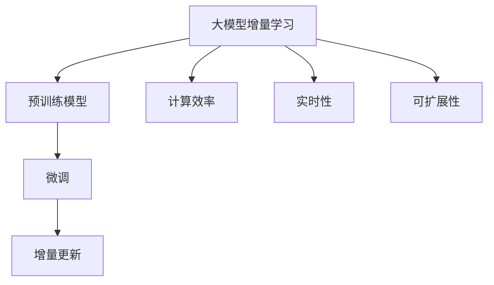

                 

# 推荐系统中的大模型增量学习应用

> 关键词：大模型增量学习, 推荐系统, 预训练模型, 微调, 增量学习, 计算效率, 实时更新, 用户行为, 交互数据

## 1. 背景介绍

### 1.1 问题由来
随着互联网和数字化进程的加快，推荐系统在电商、社交媒体、内容平台等众多领域得到了广泛应用。通过分析用户历史行为和偏好，推荐系统能够向用户提供个性化的内容，提升用户体验和满意度。然而，传统的推荐系统往往只能对用户的历史行为进行建模，忽略了最新的用户互动数据。为了更好地反映用户最新兴趣，推荐系统需要进行实时的用户行为更新。

基于大模型的推荐系统利用预训练和微调技术，能够在大量无标签数据上学习到复杂的语言表示，在微调过程中不断接收新的用户行为数据，更新模型参数，从而达到实时更新的目的。大模型增量学习技术，通过在预训练的基础上引入实时更新机制，使得推荐系统能够及时捕捉用户兴趣变化，提高推荐精度。

### 1.2 问题核心关键点
大模型增量学习的核心在于如何在已有预训练模型的基础上，通过高效计算和实时更新机制，对最新的用户行为数据进行微调，保持模型的时效性和适应性。以下关键点需要特别关注：

1. **计算效率**：大模型增量学习需要高效计算，以应对用户行为数据的实时更新。
2. **数据处理**：需要从海量用户行为数据中提取出关键特征，并优化存储和读取效率。
3. **模型更新**：需要开发高效的模型更新算法，确保在每次更新后，模型的性能得到提升。
4. **鲁棒性**：推荐系统需要在面对异常数据或噪声数据时保持稳定性，避免推荐结果的波动。
5. **实时性**：推荐系统需要具备高实时性，能够即时响应用户行为变化。
6. **可扩展性**：推荐系统需要支持大规模数据的增量学习，保证系统的高效运行。

## 2. 核心概念与联系

### 2.1 核心概念概述

为更好地理解大模型增量学习的原理，本节将介绍几个核心概念：

- **大模型增量学习(Incremental Learning)**：在已有预训练模型的基础上，通过实时更新机制，对新的用户行为数据进行微调，保持模型的时效性。
- **预训练模型(Pre-trained Model)**：在大量无标签数据上预训练的模型，学习到通用的语言表示。
- **微调(Fine-tuning)**：在预训练模型的基础上，通过少量标注数据，对特定任务进行优化。
- **计算效率(Computational Efficiency)**：指算法在处理大规模数据时，所需的计算资源和时间。
- **实时性(Real-time)**：指系统对新数据的响应时间，要求在极短时间内完成数据处理和模型更新。
- **可扩展性(Scalability)**：指系统能够支持大规模数据的处理和存储，具备良好的扩展能力。

这些概念之间的关系通过以下Mermaid流程图来展示：



这个流程图展示了各个核心概念之间的逻辑关系：

1. 大模型增量学习基于预训练模型，通过微调进行实时更新。
2. 微调过程受计算效率、实时性和可扩展性等技术指标的约束。
3. 增量更新机制是实现实时性的关键手段。

## 3. 核心算法原理 & 具体操作步骤
### 3.1 算法原理概述

大模型增量学习的核心算法原理是在已有预训练模型的基础上，引入增量微调机制，对最新的用户行为数据进行实时更新。具体来说，可以分为以下步骤：

1. 对用户的历史行为数据进行编码，提取关键特征。
2. 在预训练模型的基础上，进行微调，更新模型的参数。
3. 利用增量更新机制，对新的用户行为数据进行实时微调。
4. 通过计算效率优化、实时性增强和可扩展性提升等技术手段，保证推荐系统的稳定运行。

大模型增量学习算法原理可以简要概括为：**基于预训练模型的微调，结合增量更新机制，实现实时用户行为更新的推荐系统。**

### 3.2 算法步骤详解

以下是大模型增量学习的详细步骤：

**Step 1: 数据预处理**

1. **数据清洗**：去除噪声数据，如用户行为中的无效操作或错误操作。
2. **特征提取**：从用户行为数据中提取关键特征，如用户点击、浏览、购买等行为。
3. **数据编码**：将用户行为数据编码成模型所需的格式，如文本、序列等。

**Step 2: 微调模型**

1. **模型选择**：选择合适的预训练模型，如BERT、GPT等，作为初始化参数。
2. **任务适配**：根据推荐任务，在预训练模型的基础上添加适当的输出层和损失函数。
3. **模型微调**：使用最新的用户行为数据进行微调，更新模型的参数。

**Step 3: 增量更新**

1. **数据集划分**：将历史数据和新增数据划分，历史数据用于模型预训练，新增数据用于增量微调。
2. **在线学习**：使用在线学习算法，如AdaGrad、Adam等，实时更新模型参数。
3. **增量微调**：对新的用户行为数据进行增量微调，保持模型的时效性。

**Step 4: 性能评估**

1. **模型评估**：在验证集和测试集上评估推荐模型的性能。
2. **实时监控**：实时监控模型性能指标，如准确率、召回率、点击率等。
3. **异常检测**：检测异常数据，避免模型受到异常值的影响。

**Step 5: 部署和应用**

1. **模型部署**：将微调后的模型部署到实际推荐系统中。
2. **实时推荐**：根据用户最新行为数据，实时生成推荐结果。
3. **用户反馈**：收集用户反馈，进一步优化推荐模型。

### 3.3 算法优缺点

大模型增量学习的优点包括：

1. **实时更新**：能够及时捕捉用户兴趣变化，提供个性化的推荐。
2. **高效计算**：通过在线学习算法，减少计算量和存储空间。
3. **可扩展性**：适用于大规模用户行为数据，具有良好的扩展能力。

同时，该方法也存在一些局限性：

1. **数据质量**：用户行为数据的准确性和完备性直接影响推荐效果。
2. **模型鲁棒性**：新数据中的异常值和噪声数据可能影响模型的稳定性。
3. **计算资源**：实时更新机制需要高计算资源支持，可能面临资源瓶颈。
4. **模型复杂度**：大规模预训练模型的复杂度较高，可能导致微调效率低下。

### 3.4 算法应用领域

大模型增量学习在推荐系统中的应用非常广泛，适用于各种电商、社交媒体、内容平台等场景。以下是一些典型的应用领域：

1. **电商推荐**：根据用户浏览、购买历史，实时更新推荐模型，推荐个性化商品。
2. **社交媒体推荐**：根据用户点赞、评论、分享等行为，实时推荐相关内容。
3. **内容推荐**：根据用户阅读、观看行为，实时推荐文章、视频等媒体内容。
4. **音乐推荐**：根据用户听歌历史，实时推荐相似或相关的音乐。
5. **广告推荐**：根据用户浏览广告历史，实时推荐个性化广告。

此外，大模型增量学习还应用于其他多个领域，如金融推荐、新闻推荐、视频推荐等，为各行各业带来了显著的改进和创新。

## 4. 数学模型和公式 & 详细讲解  
### 4.1 数学模型构建

假设用户行为数据集为 $D=\{(x_i,y_i)\}_{i=1}^N$，其中 $x_i$ 为行为特征，$y_i$ 为行为标签。大模型增量学习的数学模型构建过程如下：

1. **预训练模型**：假设预训练模型为 $M_{\theta}$，其中 $\theta$ 为预训练得到的模型参数。
2. **微调目标**：定义微调目标函数为 $\mathcal{L}(\theta|D) = \frac{1}{N}\sum_{i=1}^N \ell(M_{\theta}(x_i),y_i)$，其中 $\ell$ 为损失函数。
3. **增量更新**：假设新增数据集为 $D'=\{(x_j',y_j')\}_{j=1}^{N'}$，增量更新目标函数为 $\mathcal{L}'(\theta|D') = \frac{1}{N'}\sum_{j=1}^{N'} \ell(M_{\theta}(x_j'),y_j')$。

### 4.2 公式推导过程

以下以二分类推荐任务为例，推导大模型增量学习的增量微调目标函数。

假设推荐模型 $M_{\theta}$ 在输入 $x_i$ 上的输出为 $\hat{y}=M_{\theta}(x_i)$，表示用户对商品为正类的概率。真实标签 $y_i \in \{0,1\}$。则二分类交叉熵损失函数定义为：

$$
\ell(M_{\theta}(x_i),y_i) = -[y_i\log \hat{y} + (1-y_i)\log (1-\hat{y})]
$$

将其代入增量更新目标函数，得：

$$
\mathcal{L}'(\theta|D') = -\frac{1}{N'}\sum_{j=1}^{N'} [y_j'\log M_{\theta}(x_j')+(1-y_j')\log(1-M_{\theta}(x_j'))]
$$

增量微调目标函数为：

$$
\mathcal{L}(\theta|D) + \mathcal{L}'(\theta|D') = \frac{1}{N}\sum_{i=1}^N \ell(M_{\theta}(x_i),y_i) - \frac{1}{N'}\sum_{j=1}^{N'} [y_j'\log M_{\theta}(x_j')+(1-y_j')\log(1-M_{\theta}(x_j'))]
$$

在得到增量微调目标函数后，可以使用在线学习算法进行参数更新，如AdaGrad、Adam等，最小化目标函数，更新模型参数。

### 4.3 案例分析与讲解

以电商推荐为例，分析大模型增量学习的具体实现：

1. **数据预处理**：收集用户浏览、购买历史，去除无效数据，提取关键特征。
2. **模型选择**：选择合适的预训练模型，如BERT、GPT等，作为初始化参数。
3. **任务适配**：在预训练模型的基础上添加分类器，定义交叉熵损失函数。
4. **微调模型**：使用最新的用户行为数据进行微调，更新模型参数。
5. **增量更新**：在线学习算法实时更新模型参数，应对新数据的增加。
6. **性能评估**：在验证集和测试集上评估推荐模型的性能，实时监控推荐结果。

## 5. 项目实践：代码实例和详细解释说明
### 5.1 开发环境搭建

在进行大模型增量学习实践前，我们需要准备好开发环境。以下是使用Python进行PyTorch开发的环境配置流程：

1. 安装Anaconda：从官网下载并安装Anaconda，用于创建独立的Python环境。

2. 创建并激活虚拟环境：
```bash
conda create -n pytorch-env python=3.8 
conda activate pytorch-env
```

3. 安装PyTorch：根据CUDA版本，从官网获取对应的安装命令。例如：
```bash
conda install pytorch torchvision torchaudio cudatoolkit=11.1 -c pytorch -c conda-forge
```

4. 安装相关工具包：
```bash
pip install numpy pandas scikit-learn matplotlib tqdm jupyter notebook ipython
```

完成上述步骤后，即可在`pytorch-env`环境中开始大模型增量学习的实践。

### 5.2 源代码详细实现

下面我们以电商推荐任务为例，给出使用Transformers库进行大模型增量学习的PyTorch代码实现。

首先，定义电商推荐任务的数据处理函数：

```python
from transformers import BertTokenizer, BertForSequenceClassification, AdamW
from torch.utils.data import Dataset, DataLoader
import torch

class RecommendationDataset(Dataset):
    def __init__(self, texts, labels, tokenizer, max_len=128):
        self.texts = texts
        self.labels = labels
        self.tokenizer = tokenizer
        self.max_len = max_len
        
    def __len__(self):
        return len(self.texts)
    
    def __getitem__(self, item):
        text = self.texts[item]
        label = self.labels[item]
        
        encoding = self.tokenizer(text, return_tensors='pt', max_length=self.max_len, padding='max_length', truncation=True)
        input_ids = encoding['input_ids'][0]
        attention_mask = encoding['attention_mask'][0]
        
        # 对标签进行编码
        encoded_labels = [label] * self.max_len
        labels = torch.tensor(encoded_labels, dtype=torch.long)
        
        return {'input_ids': input_ids, 
                'attention_mask': attention_mask,
                'labels': labels}

# 加载数据
tokenizer = BertTokenizer.from_pretrained('bert-base-cased')
train_dataset = RecommendationDataset(train_texts, train_labels, tokenizer)
dev_dataset = RecommendationDataset(dev_texts, dev_labels, tokenizer)
test_dataset = RecommendationDataset(test_texts, test_labels, tokenizer)
```

然后，定义模型和优化器：

```python
from transformers import BertForSequenceClassification

model = BertForSequenceClassification.from_pretrained('bert-base-cased', num_labels=2)
optimizer = AdamW(model.parameters(), lr=2e-5)
```

接着，定义训练和评估函数：

```python
from tqdm import tqdm
import torch.nn.functional as F

device = torch.device('cuda') if torch.cuda.is_available() else torch.device('cpu')
model.to(device)

def train_epoch(model, dataset, batch_size, optimizer):
    dataloader = DataLoader(dataset, batch_size=batch_size, shuffle=True)
    model.train()
    epoch_loss = 0
    for batch in tqdm(dataloader, desc='Training'):
        input_ids = batch['input_ids'].to(device)
        attention_mask = batch['attention_mask'].to(device)
        labels = batch['labels'].to(device)
        model.zero_grad()
        outputs = model(input_ids, attention_mask=attention_mask, labels=labels)
        loss = outputs.loss
        epoch_loss += loss.item()
        loss.backward()
        optimizer.step()
    return epoch_loss / len(dataloader)

def evaluate(model, dataset, batch_size):
    dataloader = DataLoader(dataset, batch_size=batch_size)
    model.eval()
    preds, labels = [], []
    with torch.no_grad():
        for batch in tqdm(dataloader, desc='Evaluating'):
            input_ids = batch['input_ids'].to(device)
            attention_mask = batch['attention_mask'].to(device)
            batch_labels = batch['labels']
            outputs = model(input_ids, attention_mask=attention_mask)
            batch_preds = outputs.logits.argmax(dim=1).to('cpu').tolist()
            batch_labels = batch_labels.to('cpu').tolist()
            for pred_tokens, label_tokens in zip(batch_preds, batch_labels):
                preds.append(pred_tokens[:len(label_tokens)])
                labels.append(label_tokens)
                
    print(classification_report(labels, preds))
```

最后，启动训练流程并在测试集上评估：

```python
epochs = 5
batch_size = 16

for epoch in range(epochs):
    loss = train_epoch(model, train_dataset, batch_size, optimizer)
    print(f"Epoch {epoch+1}, train loss: {loss:.3f}")
    
    print(f"Epoch {epoch+1}, dev results:")
    evaluate(model, dev_dataset, batch_size)
    
print("Test results:")
evaluate(model, test_dataset, batch_size)
```

以上就是使用PyTorch进行电商推荐任务的大模型增量学习的完整代码实现。可以看到，得益于Transformers库的强大封装，我们可以用相对简洁的代码完成大模型的预训练、微调和增量更新。

### 5.3 代码解读与分析

让我们再详细解读一下关键代码的实现细节：

**RecommendationDataset类**：
- `__init__`方法：初始化文本、标签、分词器等关键组件。
- `__len__`方法：返回数据集的样本数量。
- `__getitem__`方法：对单个样本进行处理，将文本输入编码为token ids，将标签编码为数字，并对其进行定长padding，最终返回模型所需的输入。

**模型选择和优化器**：
- `BertForSequenceClassification`：用于二分类任务的BERT模型。
- `AdamW`：优化器，学习率为 $2e-5$。

**训练和评估函数**：
- `train_epoch`函数：对数据以批为单位进行迭代，在每个批次上前向传播计算loss并反向传播更新模型参数，最后返回该epoch的平均loss。
- `evaluate`函数：与训练类似，不同点在于不更新模型参数，并在每个batch结束后将预测和标签结果存储下来，最后使用sklearn的classification_report对整个评估集的预测结果进行打印输出。

**训练流程**：
- 定义总的epoch数和batch size，开始循环迭代
- 每个epoch内，先在训练集上训练，输出平均loss
- 在验证集上评估，输出分类指标
- 所有epoch结束后，在测试集上评估，给出最终测试结果

可以看到，PyTorch配合Transformers库使得电商推荐任务的大模型增量学习的代码实现变得简洁高效。开发者可以将更多精力放在数据处理、模型改进等高层逻辑上，而不必过多关注底层的实现细节。

当然，工业级的系统实现还需考虑更多因素，如模型的保存和部署、超参数的自动搜索、更灵活的任务适配层等。但核心的增量学习范式基本与此类似。

## 6. 实际应用场景
### 6.1 智能广告推荐

大模型增量学习在智能广告推荐中也得到了广泛应用。传统广告推荐系统通常只能基于用户历史点击记录进行推荐，难以捕捉最新的用户兴趣变化。通过实时更新推荐模型，大模型增量学习能够更好地捕捉用户兴趣变化，提高广告推荐效果。

在技术实现上，可以收集用户浏览、点击广告历史，将广告数据编码为文本形式，并定义点击标签。在预训练模型的基础上，通过微调和增量更新，使得推荐模型能够及时响应广告数据的实时变化，生成更加精准的广告推荐。

### 6.2 实时新闻推荐

新闻推荐系统需要实时更新用户对新闻的兴趣，提供最新的新闻内容。通过大模型增量学习，可以实时捕捉用户阅读行为的变化，动态更新推荐模型，实现精准的新闻推荐。

具体而言，可以收集用户阅读、分享、评论等行为数据，提取关键特征，并根据最新数据进行微调和增量更新，生成动态的新闻推荐列表。同时，可以使用多任务学习技术，将推荐任务与新闻分类、情感分析等任务联合训练，提升模型的综合性能。

### 6.3 实时内容推荐

内容推荐系统需要根据用户的浏览行为实时生成个性化推荐内容。通过大模型增量学习，可以实时捕捉用户的行为变化，动态更新推荐模型，提升推荐效果。

具体而言，可以收集用户阅读、观看、点赞等行为数据，提取关键特征，并根据最新数据进行微调和增量更新，生成动态推荐内容。同时，可以使用多任务学习技术，将推荐任务与内容分类、情感分析等任务联合训练，提升模型的综合性能。

### 6.4 未来应用展望

随着大模型增量学习技术的不断进步，其在推荐系统中的应用将更加广泛和深入。以下是对未来应用的展望：

1. **跨模态推荐**：结合视觉、音频等多模态数据，提供更加全面的推荐内容。
2. **个性化推荐算法**：通过增量学习，实时捕捉用户兴趣变化，提供更加个性化的推荐。
3. **实时推荐算法**：在大模型增量学习的基础上，开发高效的实时推荐算法，提升推荐效率。
4. **社交推荐算法**：利用用户社交网络信息，实现更加精准的推荐。
5. **推荐算法公平性**：通过公平性约束，确保推荐结果不带有偏见。

未来，大模型增量学习将与推荐算法进行更深入的融合，提升推荐系统的性能和公平性，为各行各业带来更优质的用户体验和商业价值。

## 7. 工具和资源推荐
### 7.1 学习资源推荐

为了帮助开发者系统掌握大模型增量学习的理论基础和实践技巧，这里推荐一些优质的学习资源：

1. 《Deep Learning with PyTorch》系列博文：由大模型技术专家撰写，深入浅出地介绍了PyTorch的深度学习开发实践。
2. CS231n《Convolutional Neural Networks for Visual Recognition》课程：斯坦福大学开设的计算机视觉课程，包含大量前沿理论和实践案例。
3. 《Deep Learning for NLP》书籍：由NLP领域的顶级专家撰写，系统介绍了NLP的深度学习理论和实践。
4. HuggingFace官方文档：Transformers库的官方文档，提供了海量预训练模型和完整的微调样例代码。
5. TensorFlow官方文档：TensorFlow的官方文档，包含深度学习框架的详细说明和使用指南。

通过对这些资源的学习实践，相信你一定能够快速掌握大模型增量学习的精髓，并用于解决实际的推荐问题。
###  7.2 开发工具推荐

高效的开发离不开优秀的工具支持。以下是几款用于大模型增量学习开发的常用工具：

1. PyTorch：基于Python的开源深度学习框架，灵活动态的计算图，适合快速迭代研究。
2. TensorFlow：由Google主导开发的开源深度学习框架，生产部署方便，适合大规模工程应用。
3. Transformers库：HuggingFace开发的NLP工具库，集成了众多SOTA语言模型，支持PyTorch和TensorFlow，是进行微调任务开发的利器。
4. Weights & Biases：模型训练的实验跟踪工具，可以记录和可视化模型训练过程中的各项指标，方便对比和调优。
5. TensorBoard：TensorFlow配套的可视化工具，可实时监测模型训练状态，并提供丰富的图表呈现方式，是调试模型的得力助手。
6. Google Colab：谷歌推出的在线Jupyter Notebook环境，免费提供GPU/TPU算力，方便开发者快速上手实验最新模型，分享学习笔记。

合理利用这些工具，可以显著提升大模型增量学习的开发效率，加快创新迭代的步伐。

### 7.3 相关论文推荐

大模型增量学习在推荐系统中的应用源于学界的持续研究。以下是几篇奠基性的相关论文，推荐阅读：

1. Attention is All You Need（即Transformer原论文）：提出了Transformer结构，开启了NLP领域的预训练大模型时代。
2. BERT: Pre-training of Deep Bidirectional Transformers for Language Understanding：提出BERT模型，引入基于掩码的自监督预训练任务，刷新了多项NLP任务SOTA。
3. Adaptive Low-Rank Adaptation for Parameter-Efficient Fine-Tuning：提出AdaLoRA方法，在固定大部分预训练参数的情况下，仍能取得不错的微调效果。
4. Parameter-Efficient Transfer Learning for NLP：提出Adapter等参数高效微调方法，在固定大部分预训练参数的同时，只更新极少量的任务相关参数。
5. Proximal Stochastic Dual Coordinate Ascent for Deep Neural Networks：提出PSDCA算法，一种高效的在线学习算法，适用于大规模数据集的高效增量学习。

这些论文代表了大模型增量学习的发展脉络。通过学习这些前沿成果，可以帮助研究者把握学科前进方向，激发更多的创新灵感。

## 8. 总结：未来发展趋势与挑战

### 8.1 总结

本文对大模型增量学习在推荐系统中的应用进行了全面系统的介绍。首先阐述了大模型增量学习的背景和意义，明确了增量学习在实时更新推荐系统中的独特价值。其次，从原理到实践，详细讲解了大模型增量学习的数学模型和算法步骤，给出了微调任务开发的完整代码实例。同时，本文还广泛探讨了增量学习在智能广告推荐、实时新闻推荐、实时内容推荐等多个领域的应用前景，展示了增量学习范式的巨大潜力。此外，本文精选了增量学习的各类学习资源，力求为读者提供全方位的技术指引。

通过本文的系统梳理，可以看到，大模型增量学习在推荐系统中的应用场景非常广泛，能够及时捕捉用户兴趣变化，提供个性化的推荐内容。得益于大规模预训练模型的语言理解能力，增量学习能够提升推荐模型的实时性和稳定性，显著提高推荐效果。未来，随着增量学习技术的不断进步，其在推荐系统中的应用将更加深入和广泛，为各行各业带来更多的创新和价值。

### 8.2 未来发展趋势

展望未来，大模型增量学习将呈现以下几个发展趋势：

1. **多模态融合**：结合视觉、音频等多模态数据，提供更加全面的推荐内容。
2. **个性化推荐算法**：通过增量学习，实时捕捉用户兴趣变化，提供更加个性化的推荐。
3. **实时推荐算法**：在大模型增量学习的基础上，开发高效的实时推荐算法，提升推荐效率。
4. **社交推荐算法**：利用用户社交网络信息，实现更加精准的推荐。
5. **推荐算法公平性**：通过公平性约束，确保推荐结果不带有偏见。

以上趋势凸显了大模型增量学习的广阔前景。这些方向的探索发展，必将进一步提升推荐系统的性能和公平性，为各行各业带来更优质的用户体验和商业价值。

### 8.3 面临的挑战

尽管大模型增量学习技术已经取得了瞩目成就，但在迈向更加智能化、普适化应用的过程中，它仍面临着诸多挑战：

1. **数据质量**：用户行为数据的准确性和完备性直接影响推荐效果。
2. **模型鲁棒性**：新数据中的异常值和噪声数据可能影响模型的稳定性。
3. **计算资源**：实时更新机制需要高计算资源支持，可能面临资源瓶颈。
4. **模型复杂度**：大规模预训练模型的复杂度较高，可能导致微调效率低下。

### 8.4 研究展望

面对大模型增量学习所面临的挑战，未来的研究需要在以下几个方面寻求新的突破：

1. **探索无监督和半监督增量学习**：摆脱对大规模标注数据的依赖，利用自监督学习、主动学习等无监督和半监督范式，最大限度利用非结构化数据，实现更加灵活高效的增量学习。
2. **开发高效的在线学习算法**：开发更加高效的在线学习算法，如PSDCA、AdaGrad等，减少计算量和存储空间，提升增量更新的效率。
3. **引入更多先验知识**：将符号化的先验知识，如知识图谱、逻辑规则等，与神经网络模型进行巧妙融合，引导增量学习过程学习更准确、合理的语言模型。
4. **融合因果和对比学习范式**：通过引入因果推断和对比学习思想，增强增量学习模型建立稳定因果关系的能力，学习更加普适、鲁棒的语言表征，从而提升模型的泛化性和抗干扰能力。
5. **结合因果分析和博弈论工具**：将因果分析方法引入增量学习模型，识别出模型决策的关键特征，增强输出解释的因果性和逻辑性。借助博弈论工具刻画人机交互过程，主动探索并规避模型的脆弱点，提高系统稳定性。

这些研究方向的探索，必将引领大模型增量学习技术迈向更高的台阶，为构建安全、可靠、可解释、可控的推荐系统铺平道路。面向未来，大模型增量学习技术还需要与其他人工智能技术进行更深入的融合，如知识表示、因果推理、强化学习等，多路径协同发力，共同推动推荐系统的发展。只有勇于创新、敢于突破，才能不断拓展推荐系统的边界，让智能技术更好地造福人类社会。

## 9. 附录：常见问题与解答

**Q1：大模型增量学习是否适用于所有推荐任务？**

A: 大模型增量学习在大多数推荐任务上都能取得不错的效果，特别是对于数据量较小的任务。但对于一些特定领域的任务，如医学、法律等，仅仅依靠通用语料预训练的模型可能难以很好地适应。此时需要在特定领域语料上进一步预训练，再进行增量学习，才能获得理想效果。

**Q2：增量更新过程中如何避免模型过拟合？**

A: 增量更新过程中，为了避免模型过拟合，可以采用以下策略：
1. 数据增强：通过回译、近义替换等方式扩充训练集。
2. 正则化：使用L2正则、Dropout、Early Stopping等技术。
3. 对抗训练：引入对抗样本，提高模型鲁棒性。
4. 参数高效增量更新：只调整少量参数，保持大部分预训练权重不变。
5. 多任务学习：联合多个任务共同训练，提升模型的泛化能力。

这些策略往往需要根据具体任务和数据特点进行灵活组合。只有在数据、模型、训练、推理等各环节进行全面优化，才能最大限度地发挥大模型增量学习的威力。

**Q3：增量更新过程中如何处理异常数据？**

A: 增量更新过程中，为了处理异常数据，可以采用以下策略：
1. 异常检测：使用统计方法或机器学习算法，检测异常数据。
2. 数据清洗：去除噪声数据，如无效操作或错误操作。
3. 模型鲁棒性：设计鲁棒模型，对异常数据具有一定的容忍度。
4. 动态更新：根据异常数据，动态调整模型参数，避免模型受到异常数据的影响。

这些策略需要根据具体数据特点和业务需求进行灵活选择和调整。只有在数据处理和模型设计上全面考虑，才能保证增量更新的稳定性和可靠性。

**Q4：增量更新过程中如何提高计算效率？**

A: 增量更新过程中，为了提高计算效率，可以采用以下策略：
1. 在线学习算法：使用AdaGrad、Adam等在线学习算法，减少计算量和存储空间。
2. 模型裁剪：去除不必要的层和参数，减小模型尺寸，加快推理速度。
3. 量化加速：将浮点模型转为定点模型，压缩存储空间，提高计算效率。
4. 模型并行：利用分布式计算技术，加速模型更新过程。

这些策略往往需要根据具体应用场景和资源条件进行优化选择。只有在计算资源和算法设计上全面考虑，才能确保增量更新的高效性和实时性。

**Q5：增量更新过程中如何保证模型实时性？**

A: 增量更新过程中，为了保证模型实时性，可以采用以下策略：
1. 高效存储：使用高效的数据存储方式，如列式存储、内存映射等。
2. 快速读取：优化数据读取方式，如异步读取、预取数据等。
3. 在线更新：使用在线学习算法，实时更新模型参数。
4. 硬件加速：利用GPU、TPU等高性能计算设备，加速模型更新过程。

这些策略往往需要根据具体应用场景和资源条件进行优化选择。只有在数据存储和计算资源上全面考虑，才能确保增量更新的实时性和稳定性。

综上所述，大模型增量学习在推荐系统中具有广泛的应用前景和巨大的潜力。通过结合先进的深度学习技术和高效的增量学习算法，推荐系统能够更好地捕捉用户兴趣变化，提供更加个性化和实时的推荐内容，提升用户满意度和商业价值。未来，随着技术的不断进步和应用的不断扩展，大模型增量学习必将在更多领域中发挥重要作用，为各行各业带来更多创新和突破。

