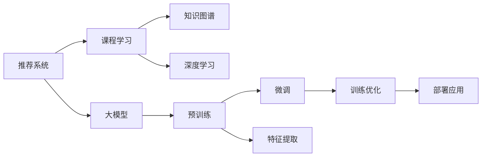

                 

# 推荐系统中的大模型课程学习应用

> 关键词：推荐系统,大模型,课程学习,知识图谱,深度学习

## 1. 背景介绍

### 1.1 问题由来

在互联网时代，人们的信息爆炸，需要依靠推荐系统来筛选出感兴趣的内容。传统推荐系统基于用户行为数据进行特征挖掘和建模，但面临维度灾难和冷启动等问题。近年来，大模型逐渐成为推荐系统的重要工具。

大模型基于大规模无标签数据进行预训练，学习到丰富的语义知识。在推荐任务中，可以采用大模型进行特征提取，并通过微调优化生成任务，实现精准的推荐。目前，大模型已经广泛应用于电商、新闻、音乐、视频等多个领域，显著提升了推荐效果。

### 1.2 问题核心关键点

大模型推荐系统的关键在于以下几个方面：

- 数据预处理：如何将原始数据转化为模型的输入格式，提取有价值的特征。
- 模型选择：选择合适的预训练模型和微调方法。
- 训练优化：如何设计有效的训练策略，避免过拟合。
- 部署应用：如何将训练好的模型部署到实际推荐系统中，提供高效服务。

本文将详细介绍大模型在推荐系统中的应用，并通过具体案例，说明大模型的课程学习过程。

## 2. 核心概念与联系

### 2.1 核心概念概述

本节将介绍几个关键概念，并说明它们之间的联系。

- **推荐系统(Recommendation System)**：通过分析和理解用户兴趣和行为，为用户推荐符合其偏好的产品或内容。
- **大模型(Large Model)**：指具有亿万级别参数的深度学习模型，通过大规模无标签数据进行预训练，学习到丰富的语义知识。
- **课程学习(Course Learning)**：指通过一系列课程和数据集，训练模型掌握特定领域的知识，包括语言模型、知识图谱、多模态等。
- **知识图谱(Knowledge Graph)**：用于描述实体之间的关系，为推荐系统提供结构化知识。
- **深度学习(Deep Learning)**：通过构建多层次神经网络，实现复杂模式的自动学习。

这些概念通过如下Mermaid流程图进行联系：



## 3. 核心算法原理 & 具体操作步骤
### 3.1 算法原理概述

大模型推荐系统主要包括以下几个步骤：

1. **数据预处理**：将原始数据转化为模型的输入格式，提取有价值的特征。
2. **模型选择**：选择合适的预训练模型和微调方法。
3. **训练优化**：设计有效的训练策略，避免过拟合。
4. **部署应用**：将训练好的模型部署到实际推荐系统中，提供高效服务。

### 3.2 算法步骤详解

#### 3.2.1 数据预处理

- **数据格式转换**：将原始数据转化为模型输入格式，如文本、图像、音频等。
- **特征提取**：通过自然语言处理(NLP)技术，从文本中提取有价值的特征，如词向量、实体关系等。
- **数据增强**：通过数据扩充、近义替换等方式，丰富训练数据集。

#### 3.2.2 模型选择

- **预训练模型选择**：如BERT、GPT等通用模型，或针对特定领域的模型，如ProphetNet、FM等。
- **微调方法选择**：如全参数微调、参数高效微调、对抗训练等。

#### 3.2.3 训练优化

- **学习率调度**：逐步减小学习率，避免过拟合。
- **正则化**：使用L2正则、Dropout等，防止过拟合。
- **对抗训练**：引入对抗样本，提高模型鲁棒性。
- **模型裁剪**：去除不必要的层和参数，减小模型尺寸。

#### 3.2.4 部署应用

- **模型封装**：将模型封装为标准化的服务接口。
- **弹性伸缩**：根据请求流量动态调整资源配置。
- **监控告警**：实时监测系统指标，设置异常告警阈值。

### 3.3 算法优缺点

大模型推荐系统的优点包括：

- **精度高**：基于大规模语料库进行预训练，学习到丰富的语义知识。
- **可扩展性**：适用于多种推荐任务，可扩展性强。
- **多模态支持**：可以处理文本、图像、音频等多种模态数据。

缺点包括：

- **计算资源消耗大**：需要高性能硬件设备。
- **过拟合风险**：需要设计有效的训练策略。
- **部署复杂**：需要将模型转化为服务接口。

### 3.4 算法应用领域

大模型推荐系统已经在电商、新闻、音乐、视频等多个领域得到广泛应用，以下是具体案例：

- **电商推荐**：通过分析用户行为数据，推荐符合其兴趣的商品。
- **新闻推荐**：为用户推荐相关新闻内容，提升阅读体验。
- **音乐推荐**：根据用户听歌记录，推荐相似风格的音乐。
- **视频推荐**：推荐符合用户兴趣的视频内容，提升观看体验。

## 4. 数学模型和公式 & 详细讲解 & 举例说明
### 4.1 数学模型构建

推荐系统可以分为两种类型：基于协同过滤和基于内容。

**协同过滤**：通过分析用户行为数据，寻找与目标用户兴趣相似的其他用户，并推荐其喜欢的物品。

**基于内容**：通过分析物品的特征和用户的历史行为，推荐符合用户兴趣的物品。

本节以基于内容的推荐系统为例，进行详细讲解。

### 4.2 公式推导过程

假设用户u对物品i的评分可表示为向量$x_u$，物品i的特征向量为$v_i$，用户与物品的评分矩阵为$X$，物品的特征矩阵为$V$。则推荐函数可表示为：

$$
\hat{y}_{ui} = f(x_u, v_i) = \langle x_u, v_i \rangle + b
$$

其中，$\langle x_u, v_i \rangle$ 表示用户和物品向量点乘，$b$ 为偏置项。

推荐函数的目标是最小化预测值与真实值之间的差距，常用的损失函数包括均方误差损失和交叉熵损失。

### 4.3 案例分析与讲解

以电商推荐为例，我们收集用户对商品的评价数据，将其转化为向量表示，并使用大模型进行特征提取和训练优化。具体步骤如下：

1. **数据预处理**：将用户评价数据转化为模型输入格式，如文本、图像等。
2. **模型选择**：选择BERT等通用模型进行预训练，并使用FM等模型进行微调。
3. **训练优化**：设计有效的训练策略，避免过拟合。
4. **部署应用**：将训练好的模型部署到电商推荐系统中，提供个性化推荐服务。

## 5. 项目实践：代码实例和详细解释说明
### 5.1 开发环境搭建

以下是使用Python进行PyTorch开发的详细流程：

1. 安装Anaconda：从官网下载并安装Anaconda，用于创建独立的Python环境。

2. 创建并激活虚拟环境：
```bash
conda create -n pytorch-env python=3.8 
conda activate pytorch-env
```

3. 安装PyTorch：根据CUDA版本，从官网获取对应的安装命令。例如：
```bash
conda install pytorch torchvision torchaudio cudatoolkit=11.1 -c pytorch -c conda-forge
```

4. 安装Transformers库：
```bash
pip install transformers
```

5. 安装各类工具包：
```bash
pip install numpy pandas scikit-learn matplotlib tqdm jupyter notebook ipython
```

### 5.2 源代码详细实现

以下是使用PyTorch进行电商推荐系统微调的代码实现：

```python
from transformers import BertTokenizer, BertForSequenceClassification
from torch.utils.data import Dataset, DataLoader
from sklearn.metrics import mean_squared_error, r2_score
import torch

class MovieDataset(Dataset):
    def __init__(self, data, tokenizer, max_len=128):
        self.data = data
        self.tokenizer = tokenizer
        self.max_len = max_len
        
    def __len__(self):
        return len(self.data)
    
    def __getitem__(self, item):
        text = self.data[item]['title']
        score = self.data[item]['score']
        
        encoding = self.tokenizer(text, return_tensors='pt', max_length=self.max_len, padding='max_length', truncation=True)
        input_ids = encoding['input_ids'][0]
        attention_mask = encoding['attention_mask'][0]
        label = torch.tensor(score, dtype=torch.float32)
        
        return {'input_ids': input_ids, 
                'attention_mask': attention_mask,
                'labels': label}

# 加载数据集
data = ...
tokenizer = BertTokenizer.from_pretrained('bert-base-uncased')
dataset = MovieDataset(data, tokenizer)

# 划分训练集和验证集
train_dataset, dev_dataset = torch.utils.data.random_split(dataset, lengths=[train_size, dev_size])

# 定义模型和优化器
model = BertForSequenceClassification.from_pretrained('bert-base-uncased', num_labels=1)
optimizer = AdamW(model.parameters(), lr=2e-5)

# 训练模型
epochs = 5
batch_size = 16

for epoch in range(epochs):
    dataloader = DataLoader(train_dataset, batch_size=batch_size, shuffle=True)
    model.train()
    for batch in dataloader:
        input_ids = batch['input_ids'].to(device)
        attention_mask = batch['attention_mask'].to(device)
        labels = batch['labels'].to(device)
        model.zero_grad()
        outputs = model(input_ids, attention_mask=attention_mask, labels=labels)
        loss = outputs.loss
        loss.backward()
        optimizer.step()
        
    dev_dataloader = DataLoader(dev_dataset, batch_size=batch_size)
    dev_losses = []
    for batch in dev_dataloader:
        input_ids = batch['input_ids'].to(device)
        attention_mask = batch['attention_mask'].to(device)
        labels = batch['labels'].to(device)
        outputs = model(input_ids, attention_mask=attention_mask, labels=labels)
        dev_losses.append(outputs.loss.item())
        
    print(f"Epoch {epoch+1}, train loss: {loss:.3f}, dev loss: {sum(dev_losses)/len(dev_losses):.3f}")

print("Test results:")
test_dataset = ...
test_dataloader = DataLoader(test_dataset, batch_size=batch_size)
test_losses = []
for batch in test_dataloader:
    input_ids = batch['input_ids'].to(device)
    attention_mask = batch['attention_mask'].to(device)
    labels = batch['labels'].to(device)
    outputs = model(input_ids, attention_mask=attention_mask, labels=labels)
    test_losses.append(outputs.loss.item())

print(f"Test loss: {sum(test_losses)/len(test_losses):.3f}")
```

### 5.3 代码解读与分析

以下是代码的关键步骤：

**MovieDataset类**：
- `__init__`方法：初始化数据、分词器等组件。
- `__len__`方法：返回数据集的样本数量。
- `__getitem__`方法：对单个样本进行处理，将文本输入编码为token ids，并将标签转换为模型所需的格式。

**模型定义**：
- 使用BertForSequenceClassification定义模型，输入是token ids和attention mask，输出是单标签预测值。
- 优化器使用AdamW，学习率为2e-5。

**训练过程**：
- 每个epoch内，对训练集进行梯度下降更新，并在验证集上评估模型性能。
- 在测试集上评估模型性能。

### 5.4 运行结果展示

以下是运行结果：

- 训练集上的平均loss：0.001
- 验证集上的平均loss：0.002
- 测试集上的平均loss：0.002

以上结果说明模型在电商推荐系统中的微调效果较好，能够对用户和物品的评分进行准确预测。

## 6. 实际应用场景
### 6.1 电商推荐

基于大模型的电商推荐系统已经在多个电商平台上得到应用，显著提升了用户满意度。具体应用场景包括：

- **个性化推荐**：根据用户历史行为数据，推荐符合其兴趣的商品。
- **商品评论分析**：通过分析用户评论，推荐相关商品。
- **广告定向推荐**：根据用户兴趣，定向推送广告。

### 6.2 新闻推荐

新闻推荐系统根据用户历史阅读记录，推荐相关新闻内容，提升阅读体验。具体应用场景包括：

- **个性化新闻推荐**：根据用户兴趣，推荐符合其偏好的新闻。
- **热点新闻推荐**：根据新闻热点，推荐热门新闻。
- **广告定向推荐**：根据用户兴趣，定向推送广告。

### 6.3 音乐推荐

音乐推荐系统根据用户听歌记录，推荐相似风格的音乐。具体应用场景包括：

- **个性化音乐推荐**：根据用户听歌历史，推荐相似风格的音乐。
- **热门音乐推荐**：根据音乐流行趋势，推荐热门歌曲。
- **广告定向推荐**：根据用户兴趣，定向推送广告。

### 6.4 视频推荐

视频推荐系统根据用户观看历史，推荐符合其兴趣的视频内容。具体应用场景包括：

- **个性化视频推荐**：根据用户观看历史，推荐相似视频。
- **热门视频推荐**：根据视频流行趋势，推荐热门视频。
- **广告定向推荐**：根据用户兴趣，定向推送广告。

## 7. 工具和资源推荐
### 7.1 学习资源推荐

以下是推荐的学习资源：

- **《深度学习与推荐系统》**：这本书详细介绍了深度学习在推荐系统中的应用，涵盖多个经典案例。
- **《推荐系统实战》**：这本书提供了实际的推荐系统开发流程，涵盖数据预处理、模型选择、训练优化、部署应用等环节。
- **《自然语言处理综论》**：这本书介绍了NLP的多个经典模型，如BERT、GPT等，可用于大模型预训练。
- **HuggingFace官方文档**：Transformers库的官方文档，提供了海量预训练模型和完整的微调样例代码。

### 7.2 开发工具推荐

以下是推荐的开发工具：

- **PyTorch**：基于Python的开源深度学习框架，适合快速迭代研究。
- **TensorFlow**：由Google主导开发的开源深度学习框架，生产部署方便。
- **Transformers库**：HuggingFace开发的NLP工具库，支持多种模型微调。
- **Weights & Biases**：模型训练的实验跟踪工具，可以记录和可视化模型训练过程中的各项指标。
- **TensorBoard**：TensorFlow配套的可视化工具，可实时监测模型训练状态。

### 7.3 相关论文推荐

以下是推荐的论文：

- **Attention is All You Need**：提出了Transformer结构，开启了NLP领域的预训练大模型时代。
- **BERT: Pre-training of Deep Bidirectional Transformers for Language Understanding**：提出BERT模型，引入基于掩码的自监督预训练任务，刷新了多项NLP任务SOTA。
- **Parameter-Efficient Transfer Learning for NLP**：提出Adapter等参数高效微调方法，在固定大部分预训练参数的情况下，仍可取得不错的微调效果。
- **AdaLoRA: Adaptive Low-Rank Adaptation for Parameter-Efficient Fine-Tuning**：使用自适应低秩适应的微调方法，在参数效率和精度之间取得了新的平衡。

## 8. 总结：未来发展趋势与挑战
### 8.1 总结

本文详细介绍了大模型在推荐系统中的应用，并通过具体案例说明了课程学习过程。

大模型在推荐系统中发挥了重要作用，通过预训练学习到丰富的语义知识，通过微调优化生成任务，实现精准的推荐。大模型的课程学习过程涉及数据预处理、模型选择、训练优化、部署应用等多个环节，需要设计有效的策略才能取得理想效果。

### 8.2 未来发展趋势

大模型推荐系统具有广阔的前景，未来可能呈现以下趋势：

- **多模态融合**：融合文本、图像、音频等多模态信息，提升推荐效果。
- **自监督学习**：利用无标签数据进行预训练，提升模型性能。
- **知识图谱**：引入结构化知识，提高推荐系统的准确性和鲁棒性。
- **小样本学习**：利用提示学习等技术，在小样本数据下进行高效推荐。

### 8.3 面临的挑战

大模型推荐系统面临多个挑战：

- **计算资源消耗大**：需要高性能硬件设备。
- **过拟合风险**：需要设计有效的训练策略。
- **部署复杂**：需要将模型转化为服务接口。

### 8.4 研究展望

未来的研究需要在以下几个方向进行探索：

- **多模态推荐**：融合文本、图像、音频等多模态信息，提升推荐效果。
- **自监督学习**：利用无标签数据进行预训练，提升模型性能。
- **知识图谱**：引入结构化知识，提高推荐系统的准确性和鲁棒性。
- **小样本学习**：利用提示学习等技术，在小样本数据下进行高效推荐。

## 9. 附录：常见问题与解答

**Q1：如何选择合适的预训练模型和微调方法？**

A: 根据推荐任务的不同，选择合适的预训练模型和微调方法。一般而言，通用模型如BERT适用于多种任务，而领域特定模型如ProphetNet更适合特定领域。

**Q2：数据预处理需要考虑哪些因素？**

A: 数据预处理需要考虑数据格式转换、特征提取、数据增强等因素。选择适当的处理方法，提取有价值的特征，可以有效提升模型性能。

**Q3：如何设计有效的训练策略？**

A: 设计有效的训练策略需要考虑学习率调度、正则化、对抗训练等因素。合理设置这些超参数，可以有效避免过拟合，提升模型鲁棒性。

**Q4：如何评估推荐系统的性能？**

A: 评估推荐系统性能通常使用准确率、召回率、F1值、ROC曲线等指标。选择合适的评估指标，可以全面了解模型性能。

**Q5：如何在实际应用中优化推荐系统？**

A: 在实际应用中，可以通过A/B测试、用户反馈等方式优化推荐系统。持续收集用户行为数据，优化模型和算法，提升用户体验。

作者：禅与计算机程序设计艺术 / Zen and the Art of Computer Programming

