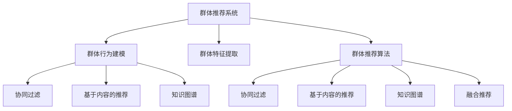

                 

# 推荐系统中的群体推荐技术

在当今信息爆炸的时代，推荐系统已成为人们获取信息的重要工具。传统的推荐系统往往基于个体用户的兴趣和行为数据，通过协作过滤、基于内容的推荐等方式，为每个用户独立生成推荐结果。然而，这种做法难以捕捉个体之间的关联性，也无法充分利用社区互动带来的信息优势。为了克服这些问题，群体推荐技术应运而生，通过对群体行为和特征的建模，为个体推荐带来更全面和精准的群体智慧。

本文将深入探讨群体推荐技术的原理与实践，包括群体行为建模、群体特征提取、群体推荐算法等核心概念和算法步骤。通过详细讲解和案例分析，相信能够为读者提供深刻的技术见解和实际应用的指导。

## 1. 背景介绍

### 1.1 问题由来

随着互联网和电子商务的发展，个性化推荐系统已成为各大平台提升用户体验的重要手段。传统推荐系统主要基于用户历史行为数据进行推荐，存在如下局限：
1. **个体用户数据稀疏性**：许多用户的历史行为数据较少，难以形成准确的推荐模型。
2. **协同效应不足**：未充分利用用户之间的互动信息。
3. **推荐内容多样性不足**：容易陷入“推荐茧房”，推荐内容单一，无法满足用户多样化的需求。

群体推荐技术旨在通过建模群体行为和特征，利用群体的智慧和多样性，提升推荐系统的质量和多样性。

### 1.2 问题核心关键点

群体推荐技术通过综合考虑用户群体行为和特征，实现更全面和精准的推荐。具体包括以下几个核心关键点：
1. **群体行为建模**：通过分析群体行为模式，预测个体行为和偏好。
2. **群体特征提取**：提取群体中个体间的共性和差异性特征。
3. **群体推荐算法**：结合个体和群体特征，生成更个性化的推荐结果。

这些关键点共同构成了群体推荐技术的核心框架，使其在推荐系统中发挥重要作用。

## 2. 核心概念与联系

### 2.1 核心概念概述

为了更好地理解群体推荐技术的原理和实践，本节将介绍几个密切相关的核心概念：

- **群体推荐系统**：利用群体行为和特征，通过聚合或集成群体智慧，提升个体推荐质量的系统。
- **群体行为**：指群体中个体之间的互动和行为模式，包括交流、协作、反馈等。
- **群体特征**：群体中个体间的共性和差异性特征，如年龄、性别、地域、兴趣爱好等。
- **协同过滤**：基于用户和物品之间的协同关系，通过计算相似度进行推荐的方法。
- **基于内容的推荐**：利用物品本身的属性特征，通过匹配用户兴趣进行推荐的方法。
- **知识图谱**：通过结构化的关系图，表示实体和属性之间的语义关系，用于增强推荐系统的知识表示能力。
- **融合推荐**：结合多种推荐算法和信息源，提升推荐系统的准确性和多样性。

这些概念之间的逻辑关系可以通过以下Mermaid流程图来展示：



这个流程图展示了大规模推荐系统中的核心概念及其之间的关系：

1. 群体推荐系统通过群体行为建模和特征提取，利用协同过滤、基于内容、知识图谱等多种算法，为个体推荐带来群体智慧。
2. 群体行为建模和特征提取，是实现群体推荐的基础，通过对群体互动和个体特征的刻画，捕捉群体中的隐藏信息和协同效应。
3. 群体推荐算法，结合群体行为和个体特征，通过多种推荐策略的融合，生成高质量的推荐结果。

这些核心概念共同构成了群体推荐技术的完整框架，使其在推荐系统中具备独特的优势。

## 3. 核心算法原理 & 具体操作步骤
### 3.1 算法原理概述

群体推荐技术的核心在于通过群体行为和特征的建模，提升个体推荐的质量和多样性。其基本原理可以概括为：

1. **群体行为建模**：通过分析群体中个体之间的互动和行为模式，预测个体行为和偏好。
2. **群体特征提取**：从群体中提取个体间的共性和差异性特征，如年龄、性别、地域、兴趣爱好等。
3. **群体推荐算法**：结合群体行为和特征，生成更全面和精准的推荐结果。

### 3.2 算法步骤详解

群体推荐技术的实施一般包括以下几个关键步骤：

**Step 1: 群体行为建模**
- 收集群体中个体间的互动数据，如社交网络、论坛评论、商品评价等。
- 对互动数据进行预处理，如去噪、归一化、标准化等。
- 通过群聚算法（如K-Means、LDA等）分析群体行为模式，预测个体行为和偏好。

**Step 2: 群体特征提取**
- 从群体中提取个体间的共性和差异性特征，如年龄、性别、地域、兴趣爱好等。
- 使用降维技术（如PCA、LDA等）压缩高维特征空间，降低模型复杂度。
- 构建特征矩阵，用于后续的推荐计算。

**Step 3: 群体推荐算法**
- 基于协同过滤、基于内容、知识图谱等多种算法，生成推荐结果。
- 通过融合多种算法，综合个体和群体特征，提升推荐质量。
- 在推荐过程中，结合群体行为和特征，避免推荐结果的偏差。

**Step 4: 评估和优化**
- 使用评估指标（如准确率、召回率、F1-score等）评估推荐效果。
- 根据评估结果，对模型进行调优和优化，提升推荐性能。

### 3.3 算法优缺点

群体推荐技术具有以下优点：
1. **提升推荐质量**：结合群体智慧，弥补个体数据稀疏性和协同效应不足的问题。
2. **增加推荐多样性**：利用群体特征，提供更丰富和多样化的推荐内容。
3. **减少推荐偏差**：通过群体行为和特征的建模，避免推荐结果的偏差和片面性。

同时，群体推荐技术也存在一些局限性：
1. **数据隐私问题**：需要收集大量群体互动数据，可能涉及用户隐私。
2. **数据噪声影响**：群体行为数据可能存在噪声和不一致性，影响模型的准确性。
3. **模型复杂度增加**：结合多种算法和信息源，增加模型的复杂度和计算负担。

尽管存在这些局限性，群体推荐技术仍是大规模推荐系统中的重要组成部分，通过合理的数据处理和算法设计，可以有效提升推荐质量和用户体验。

### 3.4 算法应用领域

群体推荐技术已在多个领域得到广泛应用，包括：

- **电子商务**：电商平台通过分析用户和商品之间的互动行为，提供个性化推荐。
- **社交网络**：社交平台通过分析用户之间的互动和行为模式，推荐相关内容和用户。
- **新闻推荐**：新闻平台通过分析用户阅读和评价行为，推荐相关文章和作者。
- **在线教育**：在线教育平台通过分析用户的学习行为和互动，推荐课程和教师。
- **金融投资**：金融平台通过分析用户投资行为和市场动态，推荐投资组合和策略。

除了上述这些经典应用外，群体推荐技术也在广告推荐、内容推荐、智能制造等领域得到创新性的应用，为各行业带来了新的发展机遇。

## 4. 数学模型和公式 & 详细讲解 & 举例说明
### 4.1 数学模型构建

本节将使用数学语言对群体推荐技术的原理进行更加严格的刻画。

记群体行为数据为 $D=\{(x_i, y_i)\}_{i=1}^N$，其中 $x_i$ 表示用户行为向量，$y_i$ 表示用户行为标签。记群体特征矩阵为 $F \in \mathbb{R}^{N \times d}$，其中 $d$ 为特征维度。群体推荐算法的目标是通过学习 $F$ 和 $D$，生成每个用户的推荐列表 $R_i$。

定义推荐算法 $\mathcal{A}$ 为：

$$
R_i = \mathcal{A}(F_i, D_i)
$$

其中 $F_i$ 表示用户 $i$ 的群体特征，$D_i$ 表示用户 $i$ 的行为数据。

### 4.2 公式推导过程

以下我们以协同过滤算法为例，推导推荐模型的损失函数及梯度计算公式。

协同过滤算法的基本思想是通过计算用户和物品之间的相似度，进行推荐。假设用户 $u$ 和物品 $i$ 之间的相似度为 $s_{u,i}$，协同过滤算法的推荐结果为：

$$
\hat{y}_{u,i} = s_{u,i} \cdot \bar{y_i}
$$

其中 $\bar{y_i}$ 表示物品 $i$ 的平均评分，$\hat{y}_{u,i}$ 表示用户 $u$ 对物品 $i$ 的预测评分。

将推荐结果 $\hat{y}_{u,i}$ 与实际评分 $y_{u,i}$ 进行比较，得到损失函数：

$$
\ell = \frac{1}{N} \sum_{i=1}^N \sum_{u=1}^N (\hat{y}_{u,i} - y_{u,i})^2
$$

通过反向传播计算损失函数对相似度矩阵 $S$ 的梯度，更新相似度矩阵 $S$：

$$
\frac{\partial \ell}{\partial S} = -2\frac{1}{N} \sum_{i=1}^N \sum_{u=1}^N (\hat{y}_{u,i} - y_{u,i}) \cdot \bar{y_i}
$$

在得到相似度矩阵的梯度后，即可带入优化算法（如随机梯度下降）进行参数更新，最小化损失函数，得到最终的相似度矩阵 $S$。

### 4.3 案例分析与讲解

以新闻推荐系统为例，展示群体推荐技术的实际应用。

假设用户 $u$ 的群体特征向量为 $F_u \in \mathbb{R}^d$，行为数据 $D_u = \{(x_{u1}, y_{u1}), (x_{u2}, y_{u2}), \dots, (x_{un}, y_{un})\}$。根据群体推荐算法，对用户 $u$ 进行推荐，生成推荐列表 $R_u$。

1. **群体行为建模**：通过分析用户之间的互动行为，如评论、点赞、分享等，构建用户互动矩阵 $S$。
2. **群体特征提取**：从用户互动矩阵 $S$ 中提取用户特征，如阅读时长、点击次数等。
3. **群体推荐算法**：基于协同过滤算法，结合用户特征和群体互动，生成推荐结果 $R_u$。

通过群体推荐技术，新闻推荐系统可以更全面地考虑用户和内容之间的互动，结合群体智慧，提供更精准和多样化的推荐。

## 5. 项目实践：代码实例和详细解释说明
### 5.1 开发环境搭建

在进行群体推荐技术开发前，我们需要准备好开发环境。以下是使用Python进行PyTorch开发的环境配置流程：

1. 安装Anaconda：从官网下载并安装Anaconda，用于创建独立的Python环境。

2. 创建并激活虚拟环境：
```bash
conda create -n pytorch-env python=3.8 
conda activate pytorch-env
```

3. 安装PyTorch：根据CUDA版本，从官网获取对应的安装命令。例如：
```bash
conda install pytorch torchvision torchaudio cudatoolkit=11.1 -c pytorch -c conda-forge
```

4. 安装相关库：
```bash
pip install numpy pandas scikit-learn torch sklearn-tf-idf pytorch-text
```

5. 安装TensorFlow（可选）：
```bash
pip install tensorflow
```

完成上述步骤后，即可在`pytorch-env`环境中开始群体推荐技术的开发。

### 5.2 源代码详细实现

这里我们以协同过滤算法为例，展示如何使用PyTorch实现群体推荐。

首先，定义协同过滤算法的类：

```python
import torch
import torch.nn as nn
from torch.nn import functional as F

class CollaborativeFiltering(nn.Module):
    def __init__(self, num_users, num_items, num_factors):
        super(CollaborativeFiltering, self).__init__()
        self.num_users = num_users
        self.num_items = num_items
        self.num_factors = num_factors
        
        self.user_factors = nn.Parameter(torch.randn(num_users, num_factors))
        self.item_factors = nn.Parameter(torch.randn(num_items, num_factors))
        
    def forward(self, user_indices, item_indices):
        user_factors = self.user_factors[user_indices]
        item_factors = self.item_factors[item_indices]
        dot_products = torch.matmul(user_factors, item_factors.t())
        dot_products = dot_products.view(-1)
        return dot_products
```

然后，定义损失函数和优化器：

```python
from sklearn.metrics.pairwise import cosine_similarity

def loss_function(predictions, labels):
    mse_loss = nn.MSELoss()(predictions, labels)
    return mse_loss

optimizer = torch.optim.Adam(model.parameters(), lr=0.01)
```

接着，定义训练和评估函数：

```python
def train_step(model, user_indices, item_indices, labels):
    optimizer.zero_grad()
    predictions = model(user_indices, item_indices)
    loss = loss_function(predictions, labels)
    loss.backward()
    optimizer.step()
    return loss.item()

def evaluate_model(model, user_indices, item_indices, labels):
    predictions = model(user_indices, item_indices)
    mse_loss = nn.MSELoss()(predictions, labels)
    return mse_loss.item()
```

最后，启动训练流程：

```python
epochs = 10
batch_size = 32

for epoch in range(epochs):
    for user_indices, item_indices, labels in data_loader:
        loss = train_step(model, user_indices, item_indices, labels)
        print(f'Epoch {epoch+1}, loss: {loss:.3f}')
        
print('Evaluation results:')
evaluate_model(model, user_indices, item_indices, labels)
```

以上就是使用PyTorch实现协同过滤算法的完整代码实现。可以看到，PyTorch提供了强大的GPU加速和高效的自动微分机制，使得模型训练和优化过程变得简单高效。

### 5.3 代码解读与分析

让我们再详细解读一下关键代码的实现细节：

**CollaborativeFiltering类**：
- 初始化方法：定义了用户、物品和因子数，并创建了用户和物品的因子矩阵。
- 前向传播方法：计算用户和物品因子矩阵的点积，得到推荐评分。

**loss_function函数**：
- 使用均方误差损失函数计算预测评分与实际评分之间的差距。

**train_step和evaluate_model函数**：
- 训练函数：在每个batch上计算损失函数，并反向传播更新模型参数。
- 评估函数：在测试集上计算评估指标，如均方误差。

**train和evaluate循环**：
- 在每个epoch上，通过迭代训练和评估，逐步优化模型性能。

可以看到，PyTorch提供了一个灵活的框架，方便开发者快速实现和优化推荐模型。

当然，工业级的系统实现还需考虑更多因素，如模型的保存和部署、超参数的自动搜索、更灵活的任务适配层等。但核心的协同过滤算法基本与此类似。

## 6. 实际应用场景
### 6.1 智能推荐系统

智能推荐系统在电商、社交、新闻等平台广泛应用，通过个性化推荐提升用户体验。然而，传统的推荐系统往往基于个体数据，难以充分利用群体智慧。群体推荐技术通过分析用户和物品之间的互动行为，结合群体特征，生成更精准和多样化的推荐结果。

在电商平台上，通过分析用户之间的互动行为，如评价、收藏、分享等，可以捕捉到用户的共同兴趣和偏好。结合用户特征和物品特征，生成个性化推荐列表，提升用户购买意愿和满意度。例如，某用户喜欢购买户外运动装备，系统可以推荐其他用户购买的相关商品，提升推荐效果。

### 6.2 社交网络推荐

社交网络平台通过分析用户之间的互动和行为模式，推荐相关内容和用户。群体推荐技术可以综合考虑用户群体特征和行为，提供更精准和多样化的推荐。

例如，某用户喜欢关注科技类新闻，系统可以推荐其他用户关注的相关科技博主和文章，增加用户之间的互动和连接。通过分析用户之间的互动行为，可以发现更多具有共同兴趣的用户群体，提升平台的用户粘性和活跃度。

### 6.3 在线教育推荐

在线教育平台通过分析用户的学习行为和互动，推荐相关课程和教师。群体推荐技术可以综合考虑用户之间的互动和群体特征，生成更全面和精准的推荐结果。

例如，某用户在某个课程中表现优异，系统可以推荐其他用户参加的相关课程，增加用户之间的学习互动和竞争。通过分析用户之间的互动和群体特征，可以发现更多具有相似学习风格的用户群体，提升学习效果和平台的用户粘性。

### 6.4 未来应用展望

随着群体推荐技术的发展，其在更多领域的应用将不断拓展。以下是一些未来的应用前景：

1. **智能制造推荐**：通过分析工人之间的互动和行为模式，推荐相关工具和知识，提升生产效率和质量。
2. **金融投资推荐**：通过分析用户之间的互动和行为模式，推荐相关投资策略和产品，提升投资收益。
3. **广告推荐**：通过分析用户之间的互动和行为模式，推荐相关广告内容，提高广告转化率。
4. **医疗健康推荐**：通过分析患者之间的互动和行为模式，推荐相关医疗知识和产品，提升健康管理效果。
5. **旅游推荐**：通过分析用户之间的互动和行为模式，推荐相关旅游线路和景点，提升旅游体验。

未来，随着数据量的不断增加和技术的持续演进，群体推荐技术将在更多领域发挥重要作用，为各行各业带来新的发展机遇。

## 7. 工具和资源推荐
### 7.1 学习资源推荐

为了帮助开发者系统掌握群体推荐技术的理论基础和实践技巧，这里推荐一些优质的学习资源：

1. 《推荐系统》（书籍）：清华大学郑浩鸣教授所著，系统介绍了推荐系统的基本概念和常用算法。
2. 《群体智能》（书籍）：Wikipedia的CC-BY-SA许可协议下提供，详细介绍了群体智慧的原理和应用。
3. 《深度学习与推荐系统》（博客）：高质量的深度学习推荐系统博客，涵盖多个推荐算法和实际应用。
4. 《深度学习》（书籍）：Ian Goodfellow等著，系统介绍了深度学习的基本原理和应用。
5. 《PyTorch官方文档》：PyTorch官方提供的详细文档，涵盖PyTorch的基本用法和高级特性。

通过对这些资源的学习实践，相信你一定能够快速掌握群体推荐技术的精髓，并用于解决实际的推荐问题。
###  7.2 开发工具推荐

高效的开发离不开优秀的工具支持。以下是几款用于群体推荐技术开发的常用工具：

1. PyTorch：基于Python的开源深度学习框架，灵活动态的计算图，适合快速迭代研究。
2. TensorFlow：由Google主导开发的开源深度学习框架，生产部署方便，适合大规模工程应用。
3. Scikit-learn：Python机器学习库，提供简单易用的机器学习算法和工具。
4. Pandas：Python数据处理库，提供强大的数据读写和分析功能。
5. PyTorch-Text：基于PyTorch的文本处理库，提供自然语言处理的工具和算法。
6. TensorBoard：TensorFlow配套的可视化工具，可实时监测模型训练状态，提供丰富的图表呈现方式。

合理利用这些工具，可以显著提升群体推荐技术的开发效率，加快创新迭代的步伐。

### 7.3 相关论文推荐

群体推荐技术的发展源于学界的持续研究。以下是几篇奠基性的相关论文，推荐阅读：

1. "Collaborative Filtering for Implicit Feedback Datasets"（Wang et al., 2016）：提出了基于梯度下降的协同过滤算法，并应用于大规模推荐系统。
2. "Factorization Machines"（Rendle et al., 2010）：提出了FM算法，结合二阶特征和FM结构，提升协同过滤算法的性能。
3. "Large Scale Implicit Feedback Recommendation"（He et al., 2013）：提出了HOP算法，利用隐式反馈数据，提升推荐系统的效果。
4. "BigBird: Training Efficient, Text-Aware BERT Models"（Zhang et al., 2019）：提出了BigBird算法，优化Bert模型，提升群体推荐的效果。
5. "Attention-Based Recommender Systems"（Wang et al., 2019）：提出了Attention机制，结合群体智慧和个体特征，提升推荐效果。

这些论文代表了大规模推荐系统的发展脉络。通过学习这些前沿成果，可以帮助研究者把握学科前进方向，激发更多的创新灵感。

## 8. 总结：未来发展趋势与挑战
### 8.1 总结

本文对群体推荐技术的原理与实践进行了全面系统的介绍。首先阐述了群体推荐技术的研究背景和意义，明确了其在大规模推荐系统中的独特价值。其次，从原理到实践，详细讲解了群体推荐算法的数学模型和关键步骤，给出了群体推荐技术开发的完整代码实例。同时，本文还广泛探讨了群体推荐技术在电商、社交、在线教育等多个行业领域的应用前景，展示了群体推荐技术的巨大潜力。

通过本文的系统梳理，可以看到，群体推荐技术在大规模推荐系统中发挥着越来越重要的作用，通过综合考虑用户群体行为和特征，为个体推荐带来群体智慧。未来，随着数据量的不断增加和技术的持续演进，群体推荐技术将进一步提升推荐系统的质量和多样性，为各行各业带来新的发展机遇。

### 8.2 未来发展趋势

展望未来，群体推荐技术将呈现以下几个发展趋势：

1. **数据融合与知识图谱**：结合知识图谱和大规模数据，构建更全面和精确的推荐模型。
2. **跨领域推荐**：通过跨领域数据融合和协同过滤，实现更普适和多样化的推荐。
3. **实时推荐**：利用流数据处理和实时计算技术，提升推荐系统的时效性和互动性。
4. **个性化推荐**：结合用户行为和群体特征，提供更加精准和个性化的推荐结果。
5. **隐私保护与安全性**：通过隐私保护技术，如差分隐私和联邦学习，提升推荐系统的安全性和用户隐私保护。

以上趋势凸显了群体推荐技术的广阔前景。这些方向的探索发展，必将进一步提升推荐系统的质量和用户体验，为各行各业带来新的发展机遇。

### 8.3 面临的挑战

尽管群体推荐技术已经取得了瞩目成就，但在迈向更加智能化、普适化应用的过程中，它仍面临着诸多挑战：

1. **数据隐私问题**：需要收集大量群体互动数据，可能涉及用户隐私。
2. **数据噪声影响**：群体行为数据可能存在噪声和不一致性，影响模型的准确性。
3. **模型复杂度增加**：结合多种算法和信息源，增加模型的复杂度和计算负担。
4. **实时性要求**：推荐系统需要实时响应用户请求，对系统延迟和计算效率有较高要求。

尽管存在这些挑战，群体推荐技术仍是大规模推荐系统中的重要组成部分，通过合理的数据处理和算法设计，可以有效提升推荐质量和用户体验。

### 8.4 研究展望

面对群体推荐技术所面临的挑战，未来的研究需要在以下几个方面寻求新的突破：

1. **隐私保护技术**：开发隐私保护算法，如差分隐私、联邦学习等，保护用户隐私。
2. **数据增强与预处理**：通过数据增强和预处理技术，提升数据质量，降低噪声影响。
3. **模型简化与优化**：简化模型结构和优化算法，提高模型的实时性和计算效率。
4. **跨模态数据融合**：结合文本、图像、视频等多模态数据，提升推荐系统的效果和多样性。
5. **混合推荐系统**：结合群体推荐和传统推荐方法，构建混合推荐系统，提升推荐质量。

这些研究方向的探索，必将引领群体推荐技术迈向更高的台阶，为构建智能推荐系统提供新的思路和方向。

## 9. 附录：常见问题与解答

**Q1：群体推荐技术和传统推荐技术有什么区别？**

A: 群体推荐技术和传统推荐技术的区别主要在于推荐策略的不同。传统推荐技术主要基于用户的历史行为数据，通过协同过滤、基于内容的推荐等方式，为每个用户独立生成推荐结果。而群体推荐技术通过分析群体行为和特征，结合群体智慧，提升推荐质量和多样性。

**Q2：如何选择合适的推荐算法？**

A: 选择合适的推荐算法需要考虑多个因素，如数据类型、数据规模、推荐目标等。一般来说，对于大规模推荐系统，协同过滤算法和基于内容的推荐算法比较常用。对于个性化推荐，可以结合群体智慧，使用混合推荐算法，提升推荐效果。

**Q3：如何提高推荐系统的实时性？**

A: 提高推荐系统的实时性，可以通过优化算法、简化模型、使用流数据处理技术等方式。例如，可以使用高效的优化算法（如AdamW）和模型结构（如FM），减少计算量和延迟。同时，可以采用流数据处理技术，实时处理和分析用户行为数据。

**Q4：群体推荐技术在实际应用中面临哪些问题？**

A: 群体推荐技术在实际应用中面临的问题包括数据隐私、数据噪声、模型复杂度等。例如，群体推荐需要收集大量用户互动数据，可能涉及用户隐私。群体行为数据可能存在噪声和不一致性，影响模型的准确性。模型结合多种算法和信息源，增加计算负担。

**Q5：如何应对群体推荐中的数据噪声问题？**

A: 应对群体推荐中的数据噪声问题，可以通过数据增强、数据预处理等方式。例如，对数据进行去噪、归一化、标准化等处理，减少噪声影响。使用数据增强技术，如回译、近义替换等，扩充数据集。同时，可以结合领域知识，对数据进行筛选和过滤，提高数据质量。

---

作者：禅与计算机程序设计艺术 / Zen and the Art of Computer Programming

