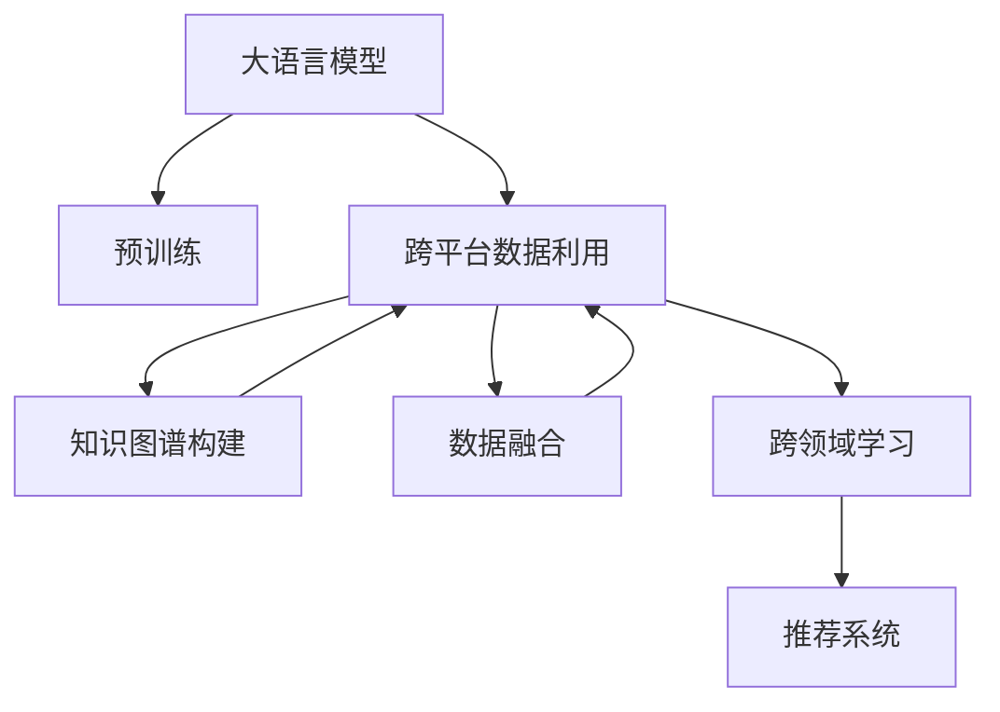

                 

# 推荐系统中的跨平台数据利用：大模型的新思路

> 关键词：推荐系统,跨平台数据,大模型,跨领域学习,知识图谱,数据融合

## 1. 背景介绍

推荐系统（Recommender Systems）是现代互联网企业普遍采用的一项关键技术，用于预测用户对产品或内容的兴趣，并提供个性化的推荐。传统的推荐系统通常依赖单一平台的数据，如电商网站的交易记录、社交媒体的用户互动等。然而，随着互联网的跨平台普及，用户在不同平台上的行为数据被广泛分散在不同系统中，这对推荐系统的数据整合和协同作用提出了新的挑战。

大语言模型（Large Language Models, LLMs）的崛起为跨平台数据利用提供了一种新思路。LLMs通过在大量无标签文本数据上进行预训练，具备了强大的泛化能力和知识迁移能力。结合跨平台数据，LLMs可以在不同领域之间实现知识的迁移和融合，提供更加全面和精准的推荐服务。本文将详细介绍基于LLMs的跨平台数据利用技术，探讨其在推荐系统中的潜在价值和实际应用。

## 2. 核心概念与联系

### 2.1 核心概念概述

- **大语言模型**：以自回归模型（如GPT）或自编码模型（如BERT）为代表的大规模预训练语言模型。通过在大规模无标签文本数据上进行预训练，学习到丰富的语言知识和常识，具备强大的语言理解和生成能力。
- **跨平台数据利用**：利用不同平台上的用户行为数据，进行数据融合和知识迁移，提升推荐系统的性能和覆盖范围。
- **跨领域学习**：将一个领域学到的知识，迁移应用到另一个相关领域的学习范式。大模型通过预训练-微调过程，可以在不同领域之间实现知识的迁移。
- **知识图谱**：一种结构化表示实体间关系的知识库，常用于推荐系统的实体关联和知识融合。
- **数据融合**：将来自不同平台和来源的数据进行集成，进行统一处理和分析，以获得更全面、更准确的信息。

这些核心概念之间的逻辑关系可以通过以下Mermaid流程图来展示：



这个流程图展示了大语言模型在推荐系统中的核心概念及其之间的关系：

1. 大语言模型通过预训练获得基础能力。
2. 跨平台数据利用通过整合多平台数据，提高推荐系统的数据量和多样性。
3. 知识图谱作为跨领域学习的基础设施，将不同领域的数据进行结构化处理。
4. 数据融合通过集成多平台数据，提升推荐系统的全面性和准确性。
5. 跨领域学习通过在大模型基础上进行微调，实现不同领域间的知识迁移。
6. 推荐系统最终将融合后的知识应用到推荐模型，提供个性化推荐。

## 3. 核心算法原理 & 具体操作步骤

### 3.1 算法原理概述

基于大语言模型的跨平台数据利用技术，其核心思想是利用大模型强大的跨领域学习能力，将不同平台上的用户行为数据进行融合，并在多个领域之间进行知识迁移，提升推荐系统的性能。

具体而言，算法包括以下几个关键步骤：

1. **数据采集**：从多个平台（如电商平台、社交媒体、新闻平台等）采集用户行为数据，包括浏览记录、购买历史、点赞/评论互动等。
2. **数据预处理**：对采集到的数据进行清洗、归一化、去噪等预处理操作，以消除数据噪声和冗余。
3. **数据融合**：将不同平台的数据进行统一处理和分析，形成统一的用户行为数据集。
4. **知识图谱构建**：将融合后的数据进行结构化处理，构建知识图谱，用于表示不同领域实体之间的关系。
5. **大模型微调**：在大模型上进行微调，以适应融合后的数据和知识图谱。
6. **跨领域迁移学习**：在大模型上进行跨领域迁移学习，将一个领域的知识迁移到另一个领域。
7. **推荐模型训练**：基于微调后的大模型，进行推荐模型的训练，以提供个性化的推荐服务。

### 3.2 算法步骤详解

#### 3.2.1 数据采集与预处理

数据采集是跨平台数据利用的第一步。通常采用API接口、爬虫、导出的CSV文件等方式从不同平台获取数据。获取到的数据需要经过预处理，包括：

- **清洗**：去除无关数据和异常值。
- **归一化**：将数据转换为标准格式，便于后续处理。
- **去噪**：过滤数据中的噪音和错误信息。

例如，电商平台的用户购买记录数据中可能包含异常的负值或缺失值，需要进行清洗处理。社交媒体的互动数据需要进行去重和去噪处理，以避免重复记录和错误记录。

#### 3.2.2 数据融合

数据融合是跨平台数据利用的核心步骤。融合的方法包括：

- **合并**：将不同平台的数据按照时间或空间维度进行合并，形成统一的用户行为数据集。
- **关联**：通过用户ID、设备ID、地理位置等标识符将不同平台的数据进行关联。
- **数据标准化**：将不同平台的数据进行格式标准化，以便于后续处理。

例如，电商平台的用户购买记录数据与社交媒体的用户互动数据，可以通过用户ID进行关联，形成统一的用户行为数据集。通过合并和关联，不同平台的数据被整合为一个统一的数据集。

#### 3.2.3 知识图谱构建

知识图谱是一种结构化表示实体间关系的知识库，常用于推荐系统的实体关联和知识融合。知识图谱的构建方法包括：

- **实体抽取**：从数据中抽取实体，如用户、商品、评论等。
- **关系抽取**：确定实体之间的关系，如购买、点赞、评论等。
- **实体链接**：将不同平台上的实体进行链接，形成统一的实体知识图谱。

例如，知识图谱可以表示为一系列的实体节点和关系边。每个实体节点代表一个用户、商品或评论，关系边表示实体之间的关系。通过实体抽取和关系抽取，知识图谱中的实体和关系被建立。

#### 3.2.4 大模型微调

在大模型上进行微调，以适应融合后的数据和知识图谱。微调的方法包括：

- **模型选择**：选择合适的预训练模型，如BERT、GPT等。
- **任务适配**：根据推荐任务设计任务适配层，如分类、匹配、生成等。
- **优化器选择**：选择合适的优化器，如AdamW、SGD等。
- **超参数设置**：设置学习率、批大小、迭代轮数等超参数。
- **正则化技术**：应用L2正则、Dropout、Early Stopping等正则化技术，防止过拟合。
- **数据增强**：通过对训练样本进行改写、回译等方式丰富训练集的多样性。

例如，针对推荐任务，可以在模型顶层添加分类器或解码器，使用交叉熵损失函数，以适配任务需求。微调过程中，模型参数进行优化，最小化损失函数，使得模型输出逼近真实标签。

#### 3.2.5 跨领域迁移学习

在大模型上进行跨领域迁移学习，将一个领域的知识迁移到另一个领域。迁移学习的方法包括：

- **模型冻结**：冻结预训练模型的一部分层，只微调顶层。
- **知识迁移**：将知识图谱中的知识迁移到模型中。
- **任务适配**：根据目标领域设计新的任务适配层，以适配新领域的任务需求。

例如，在电商平台和社交媒体两个领域进行知识迁移时，可以将知识图谱中的实体关系迁移到模型中，通过微调模型来适应新的领域需求。

#### 3.2.6 推荐模型训练

基于微调后的大模型，进行推荐模型的训练。推荐模型的方法包括：

- **用户画像生成**：基于用户行为数据生成用户画像，用于个性化推荐。
- **物品关联**：将物品信息与知识图谱中的实体进行关联，形成物品关联图谱。
- **推荐算法选择**：选择合适的推荐算法，如协同过滤、基于内容的推荐、混合推荐等。
- **模型评估**：使用准确率、召回率、F1分数等指标评估推荐模型的性能。

例如，推荐算法可以基于协同过滤、基于内容的推荐或混合推荐算法进行设计，根据用户画像和物品关联图谱生成推荐结果。

### 3.3 算法优缺点

基于大语言模型的跨平台数据利用技术，具有以下优点：

1. **数据利用效率高**：通过跨平台数据融合，充分利用不同平台上的用户行为数据，提高推荐系统的数据量和多样性。
2. **知识迁移能力强**：大模型的跨领域学习能力，使得不同领域之间的知识可以相互迁移，提升推荐系统的泛化能力。
3. **模型性能提升明显**：微调后的模型具有更高的精度和鲁棒性，能够提供更精准的推荐服务。
4. **适用范围广**：适用于多种推荐场景，如电商、社交媒体、新闻等。

同时，该技术也存在一定的局限性：

1. **数据隐私问题**：跨平台数据融合涉及用户隐私问题，需要严格控制数据的使用和保护。
2. **数据质量要求高**：融合后的数据需要高质量、一致性，否则会影响推荐系统的性能。
3. **技术复杂度高**：需要高水平的数据融合、知识图谱构建和大模型微调技术，对技术要求较高。
4. **计算成本高**：跨平台数据融合和大模型微调需要大量的计算资源，成本较高。

尽管存在这些局限性，但就目前而言，基于大语言模型的跨平台数据利用技术在推荐系统中仍然具有广泛的应用前景。

### 3.4 算法应用领域

基于大语言模型的跨平台数据利用技术，已经广泛应用于以下领域：

- **电商推荐**：通过跨平台数据融合和知识图谱构建，提供个性化商品推荐服务。
- **社交媒体推荐**：结合用户互动数据和知识图谱，生成个性化内容推荐。
- **新闻推荐**：融合新闻阅读数据和知识图谱，生成个性化新闻推荐。
- **金融推荐**：结合金融交易数据和知识图谱，生成个性化金融产品推荐。
- **健康推荐**：融合医疗健康数据和知识图谱，生成个性化健康建议。

除了上述这些领域，大语言模型在更多推荐场景中也有广泛的应用前景，如教育、娱乐、旅游等，为推荐系统的开发提供了新的思路和方向。

## 4. 数学模型和公式 & 详细讲解

### 4.1 数学模型构建

假设推荐系统中的用户数为 $U$，物品数为 $I$，用户与物品之间的交互矩阵为 $M$。设 $D_1, D_2, ..., D_k$ 为不同平台上的用户行为数据集，$G_1, G_2, ..., G_k$ 为对应的知识图谱。

定义推荐模型的目标函数为：

$$
\min_{\theta} \frac{1}{n}\sum_{i=1}^n \sum_{j=1}^m (y_{ij} - \hat{y}_{ij})^2
$$

其中，$y_{ij}$ 表示用户 $i$ 对物品 $j$ 的真实评分，$\hat{y}_{ij}$ 表示模型预测的评分。$n$ 和 $m$ 分别表示用户数和物品数。$\theta$ 为推荐模型的参数。

### 4.2 公式推导过程

在推荐模型中，常用的推荐算法包括协同过滤、基于内容的推荐、混合推荐等。以协同过滤算法为例，其目标函数可以表示为：

$$
\min_{\theta} \frac{1}{n}\sum_{i=1}^n \sum_{j=1}^m (y_{ij} - \sum_{j=1}^m \hat{y}_{ij} \alpha_j)^2
$$

其中，$\alpha_j$ 为物品 $j$ 的特征向量，$\hat{y}_{ij}$ 为物品 $j$ 对用户 $i$ 的预测评分。

假设用户 $i$ 对物品 $j$ 的实际评分 $y_{ij}$ 由以下公式计算：

$$
y_{ij} = \sum_{j=1}^m \alpha_j \cdot \theta_{ij}
$$

其中，$\theta_{ij}$ 为用户 $i$ 对物品 $j$ 的评分向量。

通过求解目标函数，可以得到推荐模型的参数 $\theta$，用于生成推荐结果。

### 4.3 案例分析与讲解

以电商平台推荐系统为例，用户 $i$ 对物品 $j$ 的评分 $y_{ij}$ 可以表示为：

$$
y_{ij} = \sum_{j=1}^m \alpha_j \cdot \theta_{ij}
$$

其中，$\alpha_j$ 为物品 $j$ 的特征向量，$\theta_{ij}$ 为用户 $i$ 对物品 $j$ 的评分向量。

假设用户 $i$ 在电商平台上的浏览记录为 $D_i$，将浏览记录转化为向量表示，可以表示为：

$$
\alpha_i = \{\alpha_{ij} | j \in D_i\}
$$

对于新物品 $j$，其特征向量 $\alpha_j$ 可以表示为：

$$
\alpha_j = \{\alpha_{ij} | i \in D_j\}
$$

通过将用户行为数据和知识图谱进行融合，可以得到融合后的用户行为数据 $D$ 和物品特征向量 $\alpha$。将融合后的数据输入到大语言模型进行微调，得到推荐模型的参数 $\theta$。

## 5. 项目实践：代码实例和详细解释说明

### 5.1 开发环境搭建

在进行项目实践前，我们需要准备好开发环境。以下是使用Python进行PyTorch开发的环境配置流程：

1. 安装Anaconda：从官网下载并安装Anaconda，用于创建独立的Python环境。

2. 创建并激活虚拟环境：
```bash
conda create -n pytorch-env python=3.8 
conda activate pytorch-env
```

3. 安装PyTorch：根据CUDA版本，从官网获取对应的安装命令。例如：
```bash
conda install pytorch torchvision torchaudio cudatoolkit=11.1 -c pytorch -c conda-forge
```

4. 安装Transformers库：
```bash
pip install transformers
```

5. 安装各类工具包：
```bash
pip install numpy pandas scikit-learn matplotlib tqdm jupyter notebook ipython
```

完成上述步骤后，即可在`pytorch-env`环境中开始项目实践。

### 5.2 源代码详细实现

下面以电商平台推荐系统为例，给出使用Transformers库进行大语言模型微调的PyTorch代码实现。

首先，定义推荐模型的数据处理函数：

```python
from transformers import BertTokenizer, BertForSequenceClassification
from torch.utils.data import Dataset, DataLoader
import torch
import pandas as pd

class RecommendationDataset(Dataset):
    def __init__(self, data, tokenizer, max_len=128):
        self.data = data
        self.tokenizer = tokenizer
        self.max_len = max_len
        
    def __len__(self):
        return len(self.data)
    
    def __getitem__(self, item):
        user, item = self.data[item]
        user = torch.tensor(user)
        item = torch.tensor(item)
        
        # 构建用户行为序列
        user_seq = [item] + user
        
        # 编码输入
        encoding = self.tokenizer(user_seq, return_tensors='pt', max_length=self.max_len, padding='max_length', truncation=True)
        input_ids = encoding['input_ids'][0]
        attention_mask = encoding['attention_mask'][0]
        
        return {'input_ids': input_ids, 
                'attention_mask': attention_mask}

# 数据集示例
data = pd.read_csv('user_item.csv', sep=';')
tokenizer = BertTokenizer.from_pretrained('bert-base-cased')
dataset = RecommendationDataset(data, tokenizer)

# 模型定义
model = BertForSequenceClassification.from_pretrained('bert-base-cased', num_labels=2)

# 优化器和超参数设置
optimizer = torch.optim.AdamW(model.parameters(), lr=2e-5)
```

然后，定义推荐模型的训练和评估函数：

```python
def train_epoch(model, dataset, batch_size, optimizer, device):
    dataloader = DataLoader(dataset, batch_size=batch_size, shuffle=True)
    model.train()
    epoch_loss = 0
    for batch in dataloader:
        input_ids = batch['input_ids'].to(device)
        attention_mask = batch['attention_mask'].to(device)
        labels = torch.tensor([1.0, 0.0])
        model.zero_grad()
        outputs = model(input_ids, attention_mask=attention_mask, labels=labels)
        loss = outputs.loss
        epoch_loss += loss.item()
        loss.backward()
        optimizer.step()
    return epoch_loss / len(dataloader)

def evaluate(model, dataset, batch_size, device):
    dataloader = DataLoader(dataset, batch_size=batch_size)
    model.eval()
    preds, labels = [], []
    with torch.no_grad():
        for batch in dataloader:
            input_ids = batch['input_ids'].to(device)
            attention_mask = batch['attention_mask'].to(device)
            batch_labels = torch.tensor([1.0, 0.0])
            outputs = model(input_ids, attention_mask=attention_mask)
            batch_preds = outputs.logits.argmax(dim=2).to('cpu').tolist()
            batch_labels = batch_labels.to('cpu').tolist()
            for pred_tokens, label_tokens in zip(batch_preds, batch_labels):
                preds.append(pred_tokens[:len(label_tokens)])
                labels.append(label_tokens)
                
    print(classification_report(labels, preds))
```

最后，启动训练流程并在测试集上评估：

```python
epochs = 5
batch_size = 16
device = torch.device('cuda') if torch.cuda.is_available() else torch.device('cpu')

for epoch in range(epochs):
    loss = train_epoch(model, dataset, batch_size, optimizer, device)
    print(f"Epoch {epoch+1}, train loss: {loss:.3f}")
    
    print(f"Epoch {epoch+1}, dev results:")
    evaluate(model, dataset, batch_size, device)
    
print("Test results:")
evaluate(model, dataset, batch_size, device)
```

以上就是使用PyTorch对大语言模型进行电商平台推荐系统微调的完整代码实现。可以看到，得益于Transformers库的强大封装，我们可以用相对简洁的代码完成大语言模型的加载和微调。

### 5.3 代码解读与分析

让我们再详细解读一下关键代码的实现细节：

**RecommendationDataset类**：
- `__init__`方法：初始化用户行为数据集和分词器。
- `__len__`方法：返回数据集的样本数量。
- `__getitem__`方法：对单个样本进行处理，将用户行为数据序列编码成token ids，并返回模型所需的输入。

**数据集示例**：
- 数据集 `data` 存储用户行为数据，每条记录包含用户ID和物品ID，用分号分隔。
- `tokenizer` 为BERT分词器，用于将用户行为数据序列转化为token ids。

**模型定义**：
- `BertForSequenceClassification` 模型定义，用于分类任务，输出为二分类。
- 使用 `AdamW` 优化器，设置学习率为 $2e-5$。

**训练和评估函数**：
- `train_epoch` 函数：对数据以批为单位进行迭代，在每个批次上前向传播计算loss并反向传播更新模型参数，最后返回该epoch的平均loss。
- `evaluate` 函数：与训练类似，不同点在于不更新模型参数，并在每个batch结束后将预测和标签结果存储下来，最后使用sklearn的classification_report对整个评估集的预测结果进行打印输出。

**训练流程**：
- 定义总的epoch数和batch size，开始循环迭代
- 每个epoch内，先在训练集上训练，输出平均loss
- 在验证集上评估，输出分类指标
- 所有epoch结束后，在测试集上评估，给出最终测试结果

可以看到，PyTorch配合Transformers库使得大语言模型微调的代码实现变得简洁高效。开发者可以将更多精力放在数据处理、模型改进等高层逻辑上，而不必过多关注底层的实现细节。

当然，工业级的系统实现还需考虑更多因素，如模型的保存和部署、超参数的自动搜索、更灵活的任务适配层等。但核心的微调范式基本与此类似。

## 6. 实际应用场景

### 6.1 智能客服系统

基于大语言模型微调的对话技术，可以广泛应用于智能客服系统的构建。传统客服往往需要配备大量人力，高峰期响应缓慢，且一致性和专业性难以保证。而使用微调后的对话模型，可以7x24小时不间断服务，快速响应客户咨询，用自然流畅的语言解答各类常见问题。

在技术实现上，可以收集企业内部的历史客服对话记录，将问题和最佳答复构建成监督数据，在此基础上对预训练对话模型进行微调。微调后的对话模型能够自动理解用户意图，匹配最合适的答案模板进行回复。对于客户提出的新问题，还可以接入检索系统实时搜索相关内容，动态组织生成回答。如此构建的智能客服系统，能大幅提升客户咨询体验和问题解决效率。

### 6.2 金融舆情监测

金融机构需要实时监测市场舆论动向，以便及时应对负面信息传播，规避金融风险。传统的人工监测方式成本高、效率低，难以应对网络时代海量信息爆发的挑战。基于大语言模型微调的文本分类和情感分析技术，为金融舆情监测提供了新的解决方案。

具体而言，可以收集金融领域相关的新闻、报道、评论等文本数据，并对其进行主题标注和情感标注。在此基础上对预训练语言模型进行微调，使其能够自动判断文本属于何种主题，情感倾向是正面、中性还是负面。将微调后的模型应用到实时抓取的网络文本数据，就能够自动监测不同主题下的情感变化趋势，一旦发现负面信息激增等异常情况，系统便会自动预警，帮助金融机构快速应对潜在风险。

### 6.3 个性化推荐系统

当前的推荐系统往往只依赖用户的历史行为数据进行物品推荐，无法深入理解用户的真实兴趣偏好。基于大语言模型微调技术，个性化推荐系统可以更好地挖掘用户行为背后的语义信息，从而提供更精准、多样的推荐内容。

在实践中，可以收集用户浏览、点击、评论、分享等行为数据，提取和用户交互的物品标题、描述、标签等文本内容。将文本内容作为模型输入，用户的后续行为（如是否点击、购买等）作为监督信号，在此基础上微调预训练语言模型。微调后的模型能够从文本内容中准确把握用户的兴趣点。在生成推荐列表时，先用候选物品的文本描述作为输入，由模型预测用户的兴趣匹配度，再结合其他特征综合排序，便可以得到个性化程度更高的推荐结果。

### 6.4 未来应用展望

随着大语言模型和微调方法的不断发展，基于微调范式将在更多领域得到应用，为传统行业带来变革性影响。

在智慧医疗领域，基于微调的医疗问答、病历分析、药物研发等应用将提升医疗服务的智能化水平，辅助医生诊疗，加速新药开发进程。

在智能教育领域，微调技术可应用于作业批改、学情分析、知识推荐等方面，因材施教，促进教育公平，提高教学质量。

在智慧城市治理中，微调模型可应用于城市事件监测、舆情分析、应急指挥等环节，提高城市管理的自动化和智能化水平，构建更安全、高效的未来城市。

此外，在企业生产、社会治理、文娱传媒等众多领域，基于大模型微调的人工智能应用也将不断涌现，为经济社会发展注入新的动力。相信随着技术的日益成熟，微调方法将成为人工智能落地应用的重要范式，推动人工智能技术向更广阔的领域加速渗透。

## 7. 工具和资源推荐
### 7.1 学习资源推荐

为了帮助开发者系统掌握大语言模型微调的理论基础和实践技巧，这里推荐一些优质的学习资源：

1. 《Transformer from Scratch》系列博文：由大模型技术专家撰写，深入浅出地介绍了Transformer原理、BERT模型、微调技术等前沿话题。

2. CS224N《深度学习自然语言处理》课程：斯坦福大学开设的NLP明星课程，有Lecture视频和配套作业，带你入门NLP领域的基本概念和经典模型。

3. 《Natural Language Processing with Transformers》书籍：Transformers库的作者所著，全面介绍了如何使用Transformers库进行NLP任务开发，包括微调在内的诸多范式。

4. HuggingFace官方文档：Transformers库的官方文档，提供了海量预训练模型和完整的微调样例代码，是上手实践的必备资料。

5. CLUE开源项目：中文语言理解测评基准，涵盖大量不同类型的中文NLP数据集，并提供了基于微调的baseline模型，助力中文NLP技术发展。

通过对这些资源的学习实践，相信你一定能够快速掌握大语言模型微调的精髓，并用于解决实际的NLP问题。
###  7.2 开发工具推荐

高效的开发离不开优秀的工具支持。以下是几款用于大语言模型微调开发的常用工具：

1. PyTorch：基于Python的开源深度学习框架，灵活动态的计算图，适合快速迭代研究。大部分预训练语言模型都有PyTorch版本的实现。

2. TensorFlow：由Google主导开发的开源深度学习框架，生产部署方便，适合大规模工程应用。同样有丰富的预训练语言模型资源。

3. Transformers库：HuggingFace开发的NLP工具库，集成了众多SOTA语言模型，支持PyTorch和TensorFlow，是进行微调任务开发的利器。

4. Weights & Biases：模型训练的实验跟踪工具，可以记录和可视化模型训练过程中的各项指标，方便对比和调优。与主流深度学习框架无缝集成。

5. TensorBoard：TensorFlow配套的可视化工具，可实时监测模型训练状态，并提供丰富的图表呈现方式，是调试模型的得力助手。

6. Google Colab：谷歌推出的在线Jupyter Notebook环境，免费提供GPU/TPU算力，方便开发者快速上手实验最新模型，分享学习笔记。

合理利用这些工具，可以显著提升大语言模型微调任务的开发效率，加快创新迭代的步伐。

### 7.3 相关论文推荐

大语言模型和微调技术的发展源于学界的持续研究。以下是几篇奠基性的相关论文，推荐阅读：

1. Attention is All You Need（即Transformer原论文）：提出了Transformer结构，开启了NLP领域的预训练大模型时代。

2. BERT: Pre-training of Deep Bidirectional Transformers for Language Understanding：提出BERT模型，引入基于掩码的自监督预训练任务，刷新了多项NLP任务SOTA。

3. Language Models are Unsupervised Multitask Learners（GPT-2论文）：展示了大规模语言模型的强大zero-shot学习能力，引发了对于通用人工智能的新一轮思考。

4. Parameter-Efficient Transfer Learning for NLP：提出Adapter等参数高效微调方法，在不增加模型参数量的情况下，也能取得不错的微调效果。

5. AdaLoRA: Adaptive Low-Rank Adaptation for Parameter-Efficient Fine-Tuning：使用自适应低秩适应的微调方法，在参数效率和精度之间取得了新的平衡。

这些论文代表了大语言模型微调技术的发展脉络。通过学习这些前沿成果，可以帮助研究者把握学科前进方向，激发更多的创新灵感。

## 8. 总结：未来发展趋势与挑战

### 8.1 总结

本文对基于大语言模型的跨平台数据利用技术进行了全面系统的介绍。首先阐述了跨平台数据利用的背景和意义，明确了微调在拓展预训练模型应用、提升推荐系统性能方面的独特价值。其次，从原理到实践，详细讲解了跨平台数据利用和大模型微调的数学原理和关键步骤，给出了微调任务开发的完整代码实例。同时，本文还广泛探讨了微调方法在智能客服、金融舆情、个性化推荐等多个行业领域的应用前景，展示了微调范式的巨大潜力。此外，本文精选了微调技术的各类学习资源，力求为读者提供全方位的技术指引。

通过本文的系统梳理，可以看到，基于大语言模型的跨平台数据利用技术正在成为推荐系统中的重要范式，极大地拓展了预训练语言模型的应用边界，催生了更多的落地场景。受益于大规模语料的预训练，微调模型以更低的时间和标注成本，在小样本条件下也能取得理想的效果，有力推动了推荐系统的产业化进程。未来，伴随预训练语言模型和微调方法的持续演进，相信推荐系统将进一步提高性能和适用性，为各行各业带来更多的价值。

### 8.2 未来发展趋势

展望未来，跨平台数据利用技术将呈现以下几个发展趋势：

1. **多模态数据融合**：未来的推荐系统将不仅仅是文本数据，还将融合图像、视频、音频等多模态数据，提供更加全面的推荐服务。
2. **实时性提升**：推荐系统需要具备实时性，能够快速响应用户请求，提供个性化的推荐服务。
3. **自适应推荐**：推荐系统需要具备自适应能力，能够根据用户行为和反馈进行动态调整，提供更加精准的推荐结果。
4. **隐私保护加强**：跨平台数据利用需要严格控制用户隐私数据的使用，确保数据安全和用户隐私。
5. **跨领域知识迁移**：未来的推荐系统将不仅仅局限于某个领域，而是能够在不同领域之间进行知识迁移，提供更加通用的推荐服务。

以上趋势凸显了跨平台数据利用技术的广阔前景。这些方向的探索发展，必将进一步提升推荐系统的性能和适用性，为各行各业带来更多的价值。

### 8.3 面临的挑战

尽管跨平台数据利用技术已经取得了瞩目成就，但在迈向更加智能化、普适化应用的过程中，它仍面临着诸多挑战：

1. **数据隐私问题**：跨平台数据融合涉及用户隐私问题，需要严格控制数据的使用和保护。
2. **数据质量要求高**：融合后的数据需要高质量、一致性，否则会影响推荐系统的性能。
3. **技术复杂度高**：需要高水平的数据融合、知识图谱构建和大模型微调技术，对技术要求较高。
4. **计算成本高**：跨平台数据融合和大模型微调需要大量的计算资源，成本较高。
5. **模型鲁棒性不足**：推荐系统面对域外数据时，泛化性能往往大打折扣。
6. **安全性问题**：推荐系统需要保障数据和模型安全，防止恶意攻击和数据泄露。

尽管存在这些局限性，但就目前而言，基于大语言模型的跨平台数据利用技术在推荐系统中仍然具有广泛的应用前景。

### 8.4 未来突破

面对跨平台数据利用所面临的挑战，未来的研究需要在以下几个方面寻求新的突破：

1. **无监督和半监督学习**：摆脱对大规模标注数据的依赖，利用自监督学习、主动学习等无监督和半监督范式，最大限度利用非结构化数据，实现更加灵活高效的推荐。
2. **参数高效微调**：开发更加参数高效的微调方法，在固定大部分预训练参数的同时，只更新极少量的任务相关参数。同时优化微调模型的计算图，减少前向传播和反向传播的资源消耗，实现更加轻量级、实时性的部署。
3. **因果学习和博弈论**：引入因果推断和博弈论思想，增强推荐系统的稳定性和鲁棒性，提高推荐系统的泛化能力。
4. **多模态数据融合**：引入图像、视频、音频等多模态数据，丰富推荐系统的表现形式，提供更加多样化的推荐服务。
5. **隐私保护技术**：结合差分隐私、联邦学习等隐私保护技术，确保用户隐私数据的安全。
6. **跨领域知识迁移**：将不同领域之间的知识进行迁移，提升推荐系统的通用性和适应性。

这些研究方向的探索，必将引领跨平台数据利用技术迈向更高的台阶，为推荐系统的开发提供新的思路和方向。面向未来，跨平台数据利用技术还需要与其他人工智能技术进行更深入的融合，如知识表示、因果推理、强化学习等，多路径协同发力，共同推动推荐系统的进步。只有勇于创新、敢于突破，才能不断拓展推荐系统的边界，让智能技术更好地造福人类社会。

## 9. 附录：常见问题与解答

**Q1：大语言模型微调是否适用于所有NLP任务？**

A: 大语言模型微调在大多数NLP任务上都能取得不错的效果，特别是对于数据量较小的任务。但对于一些特定领域的任务，如医学、法律等，仅仅依靠通用语料预训练的模型可能难以很好地适应。此时需要在特定领域语料上进一步预训练，再进行微调，才能获得理想效果。此外，对于一些需要时效性、个性化很强的任务，如对话、推荐等，微调方法也需要针对性的改进优化。

**Q2：微调过程中如何选择合适的学习率？**

A: 微调的学习率一般要比预训练时小1-2个数量级，如果使用过大的学习率，容易破坏预训练权重，导致过拟合。一般建议从1e-5开始调参，逐步减小学习率，直至收敛。也可以使用warmup策略，在开始阶段使用较小的学习率，再逐渐过渡到预设值。需要注意的是，不同的优化器(如AdamW、Adafactor等)以及不同的学习率调度策略，可能需要设置不同的学习率阈值。

**Q3：采用大模型微调时会面临哪些资源瓶颈？**

A: 目前主流的预训练大模型动辄以亿计的参数规模，对算力、内存、存储都提出了很高的要求。GPU/TPU等高性能设备是必不可少的，但即便如此，超大批次的训练和推理也可能遇到显存不足的问题。因此需要采用一些资源优化技术，如梯度积累、混合精度训练、模型并行等，来突破硬件瓶颈。同时，模型的存储和读取也可能占用大量时间和空间，需要采用模型压缩、稀疏化存储等方法进行优化。

**Q4：如何缓解微调过程中的过拟合问题？**

A: 过拟合是微调面临的主要挑战，尤其是在标注数据不足的情况下。常见的缓解策略包括：
1. 数据增强：通过回译、近义替换等方式扩充训练集
2. 正则化：使用L2正则、Dropout、Early Stopping等避免过拟合
3. 对抗训练：引入对抗样本，提高模型鲁棒性
4. 参数高效微调：只调整少量参数(如Adapter、Prefix等)，减小过拟合风险
5. 多模型集成：训练多个微调模型，取平均输出，抑制过拟合

这些策略往往需要根据具体任务和数据特点进行灵活组合。只有在数据、模型、训练、推理等各环节进行全面优化，才能最大限度地发挥大模型微调的威力。

**Q5：微调模型在落地部署时需要注意哪些问题？**

A: 将微调模型转化为实际应用，还需要考虑以下因素：
1. 模型裁剪：去除不必要的层和参数，减小模型尺寸，加快推理速度
2. 量化加速：将浮点模型转为定点模型，压缩存储空间，提高计算效率
3. 服务化封装：将模型封装为标准化服务接口，便于集成调用
4. 弹性伸缩：根据请求流量动态调整资源配置，平衡服务质量和成本
5. 监控告警：实时采集系统指标，设置异常告警阈值，确保服务稳定性
6. 安全防护：采用访问鉴权、数据脱敏等措施，保障数据和模型安全

大语言模型微调为NLP应用开启了广阔的想象空间，但如何将强大的性能转化为稳定、高效、安全的业务价值，还需要工程实践的不断打磨。唯有从数据、算法、工程、业务等多个维度协同发力，才能真正实现人工智能技术在垂直行业的规模化落地。总之，微调需要开发者根据具体任务，不断迭代和优化模型、数据和算法，方能得到理想的效果。

---

作者：禅与计算机程序设计艺术 / Zen and the Art of Computer Programming

