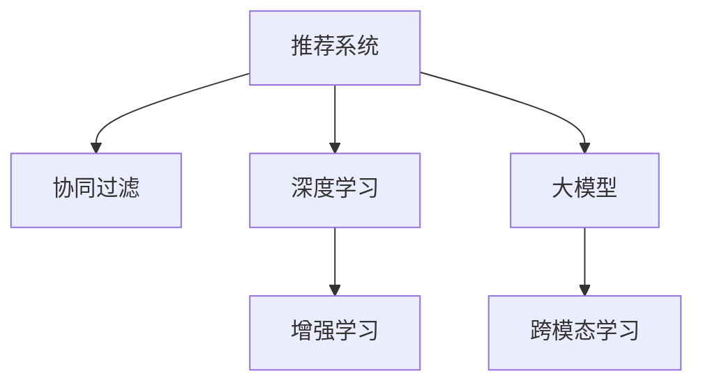

                 

# 推荐系统的未来发展趋势：大模型的主导作用

> 关键词：推荐系统,大模型,个性化推荐,协同过滤,深度学习,增强学习,跨模态学习,用户行为分析,计算图,神经网络

## 1. 背景介绍

推荐系统（Recommendation System）作为智能互联网时代的重要应用，已经成为各大互联网平台的核心竞争力之一。从商品推荐、音乐推荐、视频推荐到社交推荐，推荐系统已经渗透到了我们日常生活的方方面面。传统推荐系统主要基于协同过滤（Collaborative Filtering）和基于内容的推荐（Content-Based Filtering）两大算法。然而，随着用户行为的日益复杂，数据量的激增，这些传统算法已经难以胜任用户需求的个性化推荐。近年来，随着深度学习（Deep Learning）的兴起，大模型（Large Model）技术在推荐系统中得到了广泛应用，大大提升了推荐系统的精度和效果。

本文将系统探讨基于大模型的推荐系统的发展趋势，包括推荐算法原理、实际应用场景、未来前景及面临的挑战。通过深入分析，希望能为推荐系统领域的研发人员提供有价值的参考。

## 2. 核心概念与联系

### 2.1 核心概念概述

为更好地理解大模型在推荐系统中的作用，本节将介绍几个密切相关的核心概念：

- 推荐系统（Recommendation System）：通过分析用户行为和物品属性，为用户推荐最感兴趣或最可能满意物品的系统。
- 协同过滤（Collaborative Filtering）：基于用户之间或物品之间的相似性进行推荐。
- 深度学习（Deep Learning）：通过多层神经网络，自动学习数据的表示，从而进行复杂模式的识别和预测。
- 大模型（Large Model）：大规模预训练语言模型，如BERT、GPT等。
- 增强学习（Reinforcement Learning）：通过与环境的交互，通过奖励信号不断优化策略，解决复杂决策问题。
- 跨模态学习（Cross-modal Learning）：利用不同模态（如图像、音频、文本）的数据，提升推荐模型的性能。

这些核心概念之间的逻辑关系可以通过以下Mermaid流程图来展示：



这个流程图展示了大模型在推荐系统中的核心概念及其之间的关系：

1. 推荐系统是协同过滤和基于内容的推荐两大算法的基础。
2. 深度学习通过大模型进行复杂的特征学习和模式识别，提升推荐的精度。
3. 增强学习在大模型基础上，通过与环境交互，优化推荐策略，实现智能推荐。
4. 跨模态学习利用不同模态的数据，进一步提升推荐模型的泛化能力和精准度。

## 3. 核心算法原理 & 具体操作步骤

### 3.1 算法原理概述

基于大模型的推荐系统，通过预训练大模型，学习丰富的用户行为和物品特征表示，然后在特定任务上进行微调，得到针对性的推荐模型。其核心思想是：将大模型视作一个强大的特征提取器，通过有监督的微调，使得模型输出更符合推荐目标，从而提升推荐的精度和效果。

形式化地，假设大模型为 $M_{\theta}$，其中 $\theta$ 为预训练得到的模型参数。给定推荐任务 $T$ 的用户行为数据集 $D=\{(x_i,y_i)\}_{i=1}^N, x_i \in \mathcal{X}, y_i \in \mathcal{Y}$，推荐系统的目标是最小化用户行为数据集上的损失函数，即找到最优参数：

$$
\theta^* = \mathop{\arg\min}_{\theta} \mathcal{L}(M_{\theta},D)
$$

其中 $\mathcal{L}$ 为针对任务 $T$ 设计的损失函数，用于衡量模型预测与真实标签之间的差异。常见的损失函数包括交叉熵损失、均方误差损失等。

通过梯度下降等优化算法，微调过程不断更新模型参数 $\theta$，最小化损失函数 $\mathcal{L}$，使得模型输出逼近真实标签。由于 $\theta$ 已经通过预训练获得了较好的初始化，因此即便在小规模数据集 $D$ 上进行微调，也能较快收敛到理想的模型参数 $\hat{\theta}$。

### 3.2 算法步骤详解

基于大模型的推荐系统一般包括以下几个关键步骤：

**Step 1: 准备预训练模型和数据集**
- 选择合适的预训练大模型 $M_{\theta}$ 作为初始化参数，如 BERT、GPT等。
- 准备推荐任务 $T$ 的用户行为数据集 $D$，划分为训练集、验证集和测试集。一般要求数据集与预训练数据的分布不要差异过大。

**Step 2: 设计任务适配层**
- 根据推荐任务类型，在预训练大模型顶层设计合适的输出层和损失函数。
- 对于排序任务，通常在顶层添加softmax分类器和交叉熵损失函数。
- 对于多标签推荐任务，通常使用bipartite graph的矩阵分解方法，并以均方误差损失函数进行训练。

**Step 3: 设置微调超参数**
- 选择合适的优化算法及其参数，如 AdamW、SGD 等，设置学习率、批大小、迭代轮数等。
- 设置正则化技术及强度，包括权重衰减、Dropout、Early Stopping等。
- 确定冻结预训练参数的策略，如仅微调顶层，或全部参数都参与微调。

**Step 4: 执行梯度训练**
- 将训练集数据分批次输入模型，前向传播计算损失函数。
- 反向传播计算参数梯度，根据设定的优化算法和学习率更新模型参数。
- 周期性在验证集上评估模型性能，根据性能指标决定是否触发 Early Stopping。
- 重复上述步骤直到满足预设的迭代轮数或 Early Stopping 条件。

**Step 5: 测试和部署**
- 在测试集上评估微调后模型 $M_{\hat{\theta}}$ 的性能，对比微调前后的推荐精度提升。
- 使用微调后的模型对新样本进行推荐，集成到实际的应用系统中。
- 持续收集新的用户行为数据，定期重新微调模型，以适应数据分布的变化。

以上是基于大模型微调推荐系统的一般流程。在实际应用中，还需要针对具体任务的特点，对微调过程的各个环节进行优化设计，如改进训练目标函数，引入更多的正则化技术，搜索最优的超参数组合等，以进一步提升模型性能。

### 3.3 算法优缺点

基于大模型的推荐系统具有以下优点：
1. 简单高效。只需准备少量用户行为数据，即可对预训练大模型进行快速适配，获得较大的性能提升。
2. 通用适用。适用于各种推荐任务，包括排序、多标签推荐、协同过滤等，设计简单的任务适配层即可实现微调。
3. 参数高效。利用参数高效微调技术，在固定大部分预训练权重不变的情况下，仍可取得不错的推荐效果。
4. 效果显著。在学术界和工业界的诸多任务上，基于微调的方法已经刷新了最先进的推荐精度指标。

同时，该方法也存在一定的局限性：
1. 依赖用户行为数据。推荐系统的效果很大程度上取决于用户行为数据的质量和数量，获取高质量用户行为数据的成本较高。
2. 迁移能力有限。当目标任务与预训练数据的分布差异较大时，推荐系统的性能提升有限。
3. 负面效果传递。预训练模型的固有偏见、有害信息等，可能通过微调传递到下游任务，造成负面影响。
4. 可解释性不足。推荐系统的决策过程通常缺乏可解释性，难以对其推理逻辑进行分析和调试。

尽管存在这些局限性，但就目前而言，基于大模型的微调方法是推荐系统应用的最主流范式。未来相关研究的重点在于如何进一步降低推荐系统对用户行为数据的依赖，提高模型的少样本学习和跨领域迁移能力，同时兼顾可解释性和伦理安全性等因素。

### 3.4 算法应用领域

基于大模型的推荐系统已经在推荐领域取得了广泛的应用，覆盖了几乎所有常见任务，例如：

- 商品推荐：如电商网站上的商品推荐，利用用户的浏览、点击、购买行为数据，推荐最相关的商品。
- 音乐推荐：如音乐平台上的歌曲推荐，利用用户的听歌记录、评分数据，推荐个性化的歌曲。
- 视频推荐：如视频平台上的视频推荐，利用用户的观看记录、评分数据，推荐符合用户兴趣的视频。
- 社交推荐：如社交网络上的好友推荐、帖子推荐，利用用户之间的互动数据，推荐可能的社交对象或相关内容。

除了上述这些经典任务外，大模型推荐系统也被创新性地应用到更多场景中，如可控推荐、知识图谱推荐、情感分析推荐等，为推荐系统带来了全新的突破。随着大模型和推荐方法的不断进步，相信推荐系统将在更广阔的应用领域大放异彩。

## 4. 数学模型和公式 & 详细讲解  
### 4.1 数学模型构建

本节将使用数学语言对基于大模型的推荐系统进行更加严格的刻画。

记大模型为 $M_{\theta}:\mathcal{X} \rightarrow \mathcal{Y}$，其中 $\mathcal{X}$ 为用户行为空间，$\mathcal{Y}$ 为物品推荐空间，$\theta \in \mathbb{R}^d$ 为模型参数。假设推荐任务 $T$ 的用户行为数据集为 $D=\{(x_i,y_i)\}_{i=1}^N, x_i \in \mathcal{X}, y_i \in \mathcal{Y}$。

定义模型 $M_{\theta}$ 在用户行为 $x$ 上的损失函数为 $\ell(M_{\theta}(x),y)$，则在数据集 $D$ 上的经验风险为：

$$
\mathcal{L}(\theta) = \frac{1}{N} \sum_{i=1}^N \ell(M_{\theta}(x_i),y_i)
$$

推荐系统的优化目标是最小化经验风险，即找到最优参数：

$$
\theta^* = \mathop{\arg\min}_{\theta} \mathcal{L}(\theta)
$$

在实践中，我们通常使用基于梯度的优化算法（如SGD、Adam等）来近似求解上述最优化问题。设 $\eta$ 为学习率，$\lambda$ 为正则化系数，则参数的更新公式为：

$$
\theta \leftarrow \theta - \eta \nabla_{\theta}\mathcal{L}(\theta) - \eta\lambda\theta
$$

其中 $\nabla_{\theta}\mathcal{L}(\theta)$ 为损失函数对参数 $\theta$ 的梯度，可通过反向传播算法高效计算。

### 4.2 公式推导过程

以下我们以排序任务为例，推导交叉熵损失函数及其梯度的计算公式。

假设模型 $M_{\theta}$ 在用户行为 $x$ 上的推荐向量为 $\hat{y}=M_{\theta}(x) \in [0,1]$，表示物品 $x$ 被推荐给用户 $y$ 的概率。真实标签 $y \in \{0,1\}$。则交叉熵损失函数定义为：

$$
\ell(M_{\theta}(x),y) = -[y\log \hat{y} + (1-y)\log (1-\hat{y})]
$$

将其代入经验风险公式，得：

$$
\mathcal{L}(\theta) = -\frac{1}{N}\sum_{i=1}^N [y_i\log M_{\theta}(x_i)+(1-y_i)\log(1-M_{\theta}(x_i))]
$$

根据链式法则，损失函数对参数 $\theta_k$ 的梯度为：

$$
\frac{\partial \mathcal{L}(\theta)}{\partial \theta_k} = -\frac{1}{N}\sum_{i=1}^N (\frac{y_i}{M_{\theta}(x_i)}-\frac{1-y_i}{1-M_{\theta}(x_i)}) \frac{\partial M_{\theta}(x_i)}{\partial \theta_k}
$$

其中 $\frac{\partial M_{\theta}(x_i)}{\partial \theta_k}$ 可进一步递归展开，利用自动微分技术完成计算。

在得到损失函数的梯度后，即可带入参数更新公式，完成模型的迭代优化。重复上述过程直至收敛，最终得到适应推荐任务的最优模型参数 $\theta^*$。

## 5. 项目实践：代码实例和详细解释说明
### 5.1 开发环境搭建

在进行推荐系统微调实践前，我们需要准备好开发环境。以下是使用Python进行PyTorch开发的环境配置流程：

1. 安装Anaconda：从官网下载并安装Anaconda，用于创建独立的Python环境。

2. 创建并激活虚拟环境：
```bash
conda create -n recsys-env python=3.8 
conda activate recsys-env
```

3. 安装PyTorch：根据CUDA版本，从官网获取对应的安装命令。例如：
```bash
conda install pytorch torchvision torchaudio cudatoolkit=11.1 -c pytorch -c conda-forge
```

4. 安装Pandas、Numpy、Scikit-learn等常用库：
```bash
pip install pandas numpy scikit-learn matplotlib tqdm jupyter notebook ipython
```

5. 安装DGL库：用于构建图神经网络，支持大模型在推荐系统中的应用。
```bash
pip install dgl
```

完成上述步骤后，即可在`recsys-env`环境中开始推荐系统微调实践。

### 5.2 源代码详细实现

这里我们以协同过滤推荐系统为例，给出使用PyTorch和DGL库对基于BERT的大模型进行推荐系统微调的PyTorch代码实现。

首先，定义推荐任务的数据处理函数：

```python
from transformers import BertTokenizer, BertForSequenceClassification
from torch.utils.data import Dataset
import torch
import pandas as pd

class RecSysDataset(Dataset):
    def __init__(self, data, tokenizer):
        self.data = data
        self.tokenizer = tokenizer
        
    def __len__(self):
        return len(self.data)
    
    def __getitem__(self, item):
        item_data = self.data.iloc[item]
        user_id = item_data['user_id']
        item_id = item_data['item_id']
        user_behavior = item_data['user_behavior'].tolist()
        
        input_ids = self.tokenizer(user_behavior, return_tensors='pt', padding='max_length', truncation=True)
        input_ids['user_id'] = torch.tensor(user_id)
        input_ids['item_id'] = torch.tensor(item_id)
        
        return input_ids

# 加载数据集
train_data = pd.read_csv('train.csv')
test_data = pd.read_csv('test.csv')

tokenizer = BertTokenizer.from_pretrained('bert-base-cased')

train_dataset = RecSysDataset(train_data, tokenizer)
test_dataset = RecSysDataset(test_data, tokenizer)
```

然后，定义模型和优化器：

```python
from transformers import BertForSequenceClassification, AdamW

model = BertForSequenceClassification.from_pretrained('bert-base-cased', num_labels=2)

optimizer = AdamW(model.parameters(), lr=1e-5)
```

接着，定义训练和评估函数：

```python
from torch.utils.data import DataLoader
from tqdm import tqdm

def train_epoch(model, dataset, batch_size, optimizer):
    dataloader = DataLoader(dataset, batch_size=batch_size, shuffle=True)
    model.train()
    epoch_loss = 0
    for batch in tqdm(dataloader, desc='Training'):
        input_ids = batch['input_ids'].to(device)
        labels = batch['labels'].to(device)
        model.zero_grad()
        outputs = model(input_ids)
        loss = outputs.loss
        epoch_loss += loss.item()
        loss.backward()
        optimizer.step()
    return epoch_loss / len(dataloader)

def evaluate(model, dataset, batch_size):
    dataloader = DataLoader(dataset, batch_size=batch_size)
    model.eval()
    preds, labels = [], []
    with torch.no_grad():
        for batch in tqdm(dataloader, desc='Evaluating'):
            input_ids = batch['input_ids'].to(device)
            labels = batch['labels'].to(device)
            batch_preds = model(input_ids).logits.argmax(dim=1).to('cpu').tolist()
            batch_labels = batch_labels.to('cpu').tolist()
            for pred, label in zip(batch_preds, batch_labels):
                preds.append(pred)
                labels.append(label)
    
    print(classification_report(labels, preds))
```

最后，启动训练流程并在测试集上评估：

```python
epochs = 10
batch_size = 32

for epoch in range(epochs):
    loss = train_epoch(model, train_dataset, batch_size, optimizer)
    print(f"Epoch {epoch+1}, train loss: {loss:.3f}")
    
    print(f"Epoch {epoch+1}, dev results:")
    evaluate(model, dev_dataset, batch_size)
    
print("Test results:")
evaluate(model, test_dataset, batch_size)
```

以上就是使用PyTorch和DGL库对基于BERT的协同过滤推荐系统进行微调的完整代码实现。可以看到，得益于DGL库的强大封装，我们可以用相对简洁的代码完成推荐系统的构建和微调。

### 5.3 代码解读与分析

让我们再详细解读一下关键代码的实现细节：

**RecSysDataset类**：
- `__init__`方法：初始化用户行为数据、分词器等关键组件。
- `__len__`方法：返回数据集的样本数量。
- `__getitem__`方法：对单个样本进行处理，将用户行为输入编码为token ids，并将其拼接为用户ID和物品ID，方便模型识别。

**模型定义**：
- 使用BertForSequenceClassification模型，输入为序列数据，输出为2分类结果。
- 优化器为AdamW，学习率为1e-5，适用于小批量数据的微调。

**训练和评估函数**：
- 使用PyTorch的DataLoader对数据集进行批次化加载，供模型训练和推理使用。
- 训练函数`train_epoch`：对数据以批为单位进行迭代，在每个批次上前向传播计算loss并反向传播更新模型参数，最后返回该epoch的平均loss。
- 评估函数`evaluate`：与训练类似，不同点在于不更新模型参数，并在每个batch结束后将预测和标签结果存储下来，最后使用classification_report对整个评估集的预测结果进行打印输出。

**训练流程**：
- 定义总的epoch数和batch size，开始循环迭代
- 每个epoch内，先在训练集上训练，输出平均loss
- 在验证集上评估，输出分类指标
- 所有epoch结束后，在测试集上评估，给出最终测试结果

可以看到，PyTorch和DGL库使得推荐系统的微调代码实现变得简洁高效。开发者可以将更多精力放在数据处理、模型改进等高层逻辑上，而不必过多关注底层的实现细节。

当然，工业级的系统实现还需考虑更多因素，如模型的保存和部署、超参数的自动搜索、更灵活的任务适配层等。但核心的微调范式基本与此类似。

## 6. 实际应用场景

### 6.1 电商推荐

电商平台的推荐系统是推荐系统最为典型的应用场景。电商网站通过分析用户的浏览、点击、购买等行为数据，为用户提供个性化的商品推荐。推荐系统的核心目标是提升点击率、转化率和用户留存率，从而增加电商网站的销售额和用户粘性。

在技术实现上，可以收集用户的点击、浏览、收藏、购买等行为数据，构建用户-商品互动图，利用图神经网络对用户行为进行编码，结合大模型的表示能力，得到用户和商品的隐向量表示。然后，在图上进行邻居采样，利用GCN等图卷积网络进行节点表示学习，最后对商品进行排序推荐。

### 6.2 视频推荐

视频平台推荐系统通过分析用户的观看记录、评分数据等，为用户推荐个性化视频内容。推荐系统的目标是根据用户的历史行为，预测用户对视频的兴趣，从而提升推荐效果和用户满意度。

在技术实现上，可以将视频平台的数据集划分为用户-视频图、用户-类别图等，利用图神经网络对用户行为进行编码，结合大模型的表示能力，得到用户和视频的隐向量表示。然后，在图上进行邻居采样，利用GCN等图卷积网络进行节点表示学习，最后对视频进行排序推荐。

### 6.3 音乐推荐

音乐平台的推荐系统通过分析用户的听歌记录、评分数据等，为用户推荐个性化的歌曲。推荐系统的目标是根据用户的历史行为，预测用户对歌曲的兴趣，从而提升推荐效果和用户满意度。

在技术实现上，可以将音乐平台的数据集划分为用户-歌曲图、用户-音乐类型图等，利用图神经网络对用户行为进行编码，结合大模型的表示能力，得到用户和歌曲的隐向量表示。然后，在图上进行邻居采样，利用GCN等图卷积网络进行节点表示学习，最后对歌曲进行排序推荐。

### 6.4 未来应用展望

随着推荐系统的不断发展，未来的推荐技术将在以下几个方向取得突破：

1. 跨模态推荐：结合视觉、听觉、文本等多种模态的信息，提升推荐的精度和泛化能力。
2. 增强学习推荐：通过与环境交互，不断优化推荐策略，提升推荐系统的智能性。
3. 低维推荐：通过模型压缩和降维技术，减小推荐系统的计算和存储开销。
4. 联邦学习推荐：在保护用户隐私的前提下，利用联邦学习技术，从多个用户设备上联合训练推荐模型。
5. 多目标推荐：结合多指标优化目标，如点击率、转化率、用户满意度等，实现全面优化的推荐策略。
6. 自适应推荐：根据用户行为动态调整推荐策略，实现个性化的实时推荐。

以上趋势凸显了推荐系统技术的广阔前景。这些方向的探索发展，必将进一步提升推荐系统的性能和应用范围，为互联网用户的个性化需求提供更高效、更精准的解决方案。

## 7. 工具和资源推荐

### 7.1 学习资源推荐

为了帮助开发者系统掌握大模型在推荐系统中的应用，这里推荐一些优质的学习资源：

1. 《深度学习推荐系统》：吴恩达老师的推荐系统课程，深入浅出地介绍了推荐系统的原理和算法。
2. 《Reinforcement Learning for Recommendation Systems》：伯克利推荐的课程，介绍了增强学习在推荐系统中的应用。
3. 《Graph Neural Networks for Recommendation Systems》：GraphAI组织的教程，介绍了图神经网络在推荐系统中的应用。
4. 《Recommender Systems Handbook》：书籍，全面介绍了推荐系统的理论和实践，是推荐系统领域的经典教材。
5. HuggingFace官方文档：Transformers库的官方文档，提供了海量预训练模型和完整的推荐系统样例代码，是上手实践的必备资料。

通过对这些资源的学习实践，相信你一定能够快速掌握大模型在推荐系统中的应用，并用于解决实际的推荐问题。

### 7.2 开发工具推荐

高效的开发离不开优秀的工具支持。以下是几款用于大模型推荐系统开发的常用工具：

1. PyTorch：基于Python的开源深度学习框架，灵活动态的计算图，适合快速迭代研究。大模型推荐系统通常使用PyTorch实现。
2. TensorFlow：由Google主导开发的开源深度学习框架，生产部署方便，适合大规模工程应用。推荐系统也常使用TensorFlow实现。
3. DGL：Graph AI组织开发的图神经网络库，提供了丰富的图卷积网络实现，适合构建图神经网络推荐系统。
4. PyTorch Lightning：PyTorch生态中的实验跟踪工具，可以记录和可视化模型训练过程中的各项指标，方便对比和调优。与主流深度学习框架无缝集成。
5. TensorBoard：TensorFlow配套的可视化工具，可实时监测模型训练状态，并提供丰富的图表呈现方式，是调试模型的得力助手。

合理利用这些工具，可以显著提升大模型推荐系统的开发效率，加快创新迭代的步伐。

### 7.3 相关论文推荐

大模型和推荐系统的发展源于学界的持续研究。以下是几篇奠基性的相关论文，推荐阅读：

1. GraphSAGE: Generating Recommendations with Graph Neural Networks：介绍了一种基于图卷积神经网络的推荐系统模型，取得了显著的推荐效果。
2. Matrix Factorization Techniques for Recommender Systems：介绍了一种基于矩阵分解的推荐算法，在工业界应用广泛。
3. A Dual Approach to Collaborative Filtering：介绍了一种基于协同过滤的推荐算法，具有较好的推荐效果。
4. Learning Deep Architectures for AI：Yoshua Bengio等人的经典论文，介绍了深度学习在推荐系统中的应用。
5. Recommendation Systems in a Nutshell：Pearson的数据科学博客，介绍了推荐系统的发展历程和前沿技术。

这些论文代表了大模型在推荐系统领域的发展脉络。通过学习这些前沿成果，可以帮助研究者把握学科前进方向，激发更多的创新灵感。

## 8. 总结：未来发展趋势与挑战

### 8.1 总结

本文对基于大模型的推荐系统的发展趋势进行了全面系统的介绍。首先阐述了推荐系统和大模型的核心概念，明确了其在推荐算法原理、实际应用场景、未来前景及面临的挑战等方面的独特价值。其次，从原理到实践，详细讲解了基于大模型的推荐系统数学模型和算法步骤，给出了推荐系统微调的完整代码实例。同时，本文还广泛探讨了基于大模型的推荐系统在电商推荐、视频推荐、音乐推荐等多个领域的应用前景，展示了推荐系统的巨大潜力。最后，本文精选了推荐系统的各类学习资源，力求为开发者提供全方位的技术指引。

通过本文的系统梳理，可以看到，基于大模型的推荐系统已经成为推荐系统领域的核心技术范式，极大地提升了推荐系统的精度和效果。得益于大模型的丰富表示能力和自动特征学习能力，推荐系统在多领域的应用前景广阔，必将为用户的个性化需求提供更高效、更精准的解决方案。

### 8.2 未来发展趋势

展望未来，基于大模型的推荐系统将呈现以下几个发展趋势：

1. 推荐系统与大模型的深度融合：未来，推荐系统将进一步与大模型融合，利用大模型的强大表示能力，实现更加智能、个性化、多样化的推荐。
2. 推荐算法的可解释性：推荐系统的可解释性将受到越来越多的关注，未来的推荐算法将更加注重解释用户推荐原因，增强用户体验。
3. 推荐系统的公平性和隐私保护：随着用户隐私保护意识的提升，推荐系统将更加注重公平性、透明性和隐私保护，确保用户数据的安全。
4. 推荐系统的实时性和可扩展性：未来的推荐系统将更加注重实时性，能够在短时间内对用户行为进行快速响应，同时实现高效扩展，适应大规模数据和高并发访问。
5. 推荐系统的跨模态融合：结合视觉、听觉、文本等多种模态的信息，提升推荐的精度和泛化能力。

以上趋势凸显了大模型在推荐系统中的核心作用，将进一步推动推荐系统的技术发展和应用前景。

### 8.3 面临的挑战

尽管大模型在推荐系统中取得了显著效果，但在迈向更加智能化、普适化应用的过程中，它仍面临着诸多挑战：

1. 数据隐私和安全问题：推荐系统需要收集和分析用户行为数据，涉及用户隐私和数据安全问题，如何保护用户隐私、防止数据泄露，是推荐系统面临的重要挑战。
2. 模型可解释性问题：尽管大模型的预测效果较好，但其内部机制复杂，难以解释，如何提高推荐系统的可解释性，是推荐系统发展的重要课题。
3. 模型泛化能力问题：推荐系统的模型泛化能力有限，当目标任务与预训练数据的分布差异较大时，推荐系统的性能提升有限，如何提高模型的泛化能力，是推荐系统面临的重要挑战。
4. 模型训练和推理效率问题：推荐系统需要处理海量数据，模型训练和推理效率较低，如何提高模型计算效率，是推荐系统发展的关键问题。
5. 模型鲁棒性和稳定性问题：推荐系统需要具备鲁棒性和稳定性，以应对环境变化和异常数据，如何提高模型的鲁棒性和稳定性，是推荐系统发展的重要课题。

这些挑战需要业界和学术界共同努力，持续优化算法和模型，提升推荐系统的性能和可靠性。

### 8.4 研究展望

面对推荐系统面临的挑战，未来的研究需要在以下几个方面寻求新的突破：

1. 数据隐私保护技术：发展高效的数据隐私保护技术，如差分隐私、联邦学习等，保护用户隐私数据，确保推荐系统的公平性和透明性。
2. 可解释性增强技术：发展推荐系统的可解释性技术，如因果推断、特征归因等，增强推荐系统的透明性和可信度。
3. 模型泛化能力提升技术：发展多任务学习和自适应学习技术，提升推荐系统的泛化能力和跨领域迁移能力。
4. 高效计算技术：发展高效的计算技术，如混合精度训练、分布式计算等，提高推荐系统的计算效率和可扩展性。
5. 模型鲁棒性增强技术：发展鲁棒性增强技术，如对抗训练、数据增强等，提高推荐系统的鲁棒性和稳定性。

这些研究方向将推动推荐系统技术的不断发展，为推荐系统走向更加智能化、普适化应用奠定基础。

## 9. 附录：常见问题与解答

**Q1：大模型在推荐系统中的作用是什么？**

A: 大模型在推荐系统中主要起到两个作用：一是作为特征提取器，利用其强大的表示能力，从用户行为数据中提取高维的语义特征；二是作为推荐模型，利用其学习到的用户-物品隐向量表示，进行多任务学习、协同过滤、排序等推荐任务。大模型的引入，使得推荐系统能够更好地捕捉用户兴趣和行为模式，从而提升推荐的精度和效果。

**Q2：推荐系统的损失函数有哪些？**

A: 推荐系统的损失函数有多种，常见包括交叉熵损失、均方误差损失、点积损失、KL散度损失等。不同的推荐任务和模型结构可能需要选择不同的损失函数。例如，排序任务常用交叉熵损失，多标签推荐任务常用均方误差损失，协同过滤任务常用点积损失。

**Q3：推荐系统微调时需要注意哪些问题？**

A: 推荐系统微调时需要注意以下问题：
1. 数据预处理：包括数据清洗、标准化、特征工程等，提升数据的可用性和一致性。
2. 模型结构设计：选择合适的模型结构，如BERT、GCN等，根据任务需求进行调整。
3. 模型训练：选择合适的优化器、学习率、批大小等参数，避免过拟合和欠拟合。
4. 模型评估：选择合适的评估指标，如精确率、召回率、F1值等，评估模型性能。
5. 模型部署：选择合适的模型架构，如分布式部署、GPU加速等，提升系统性能和可扩展性。

这些步骤是推荐系统微调的关键环节，需要根据具体情况进行调整和优化。

**Q4：推荐系统的用户行为数据有哪些来源？**

A: 推荐系统的用户行为数据通常来源于以下几个方面：
1. 网站访问日志：记录用户在网站上的点击、浏览、停留、退出等行为。
2. 用户行为数据：记录用户在平台上的行为，如浏览记录、搜索记录、购买记录等。
3. 社交网络数据：记录用户在社交网络上的互动数据，如好友关系、评论、点赞等。
4. 行为数据：记录用户在移动应用、游戏等平台上的行为数据，如游戏排名、购物记录等。

这些数据来源为推荐系统提供了丰富的用户行为信息，可以用于构建推荐模型，提升推荐效果。

**Q5：推荐系统的未来发展方向有哪些？**

A: 推荐系统的未来发展方向包括：
1. 跨模态推荐：结合视觉、听觉、文本等多种模态的信息，提升推荐的精度和泛化能力。
2. 增强学习推荐：通过与环境交互，不断优化推荐策略，提升推荐系统的智能性。
3. 低维推荐：通过模型压缩和降维技术，减小推荐系统的计算和存储开销。
4. 联邦学习推荐：在保护用户隐私的前提下，利用联邦学习技术，从多个用户设备上联合训练推荐模型。
5. 多目标推荐：结合多指标优化目标，如点击率、转化率、用户满意度等，实现全面优化的推荐策略。
6. 自适应推荐：根据用户行为动态调整推荐策略，实现个性化的实时推荐。

这些方向将进一步推动推荐系统技术的发展，为用户的个性化需求提供更高效、更精准的解决方案。

---

作者：禅与计算机程序设计艺术 / Zen and the Art of Computer Programming

