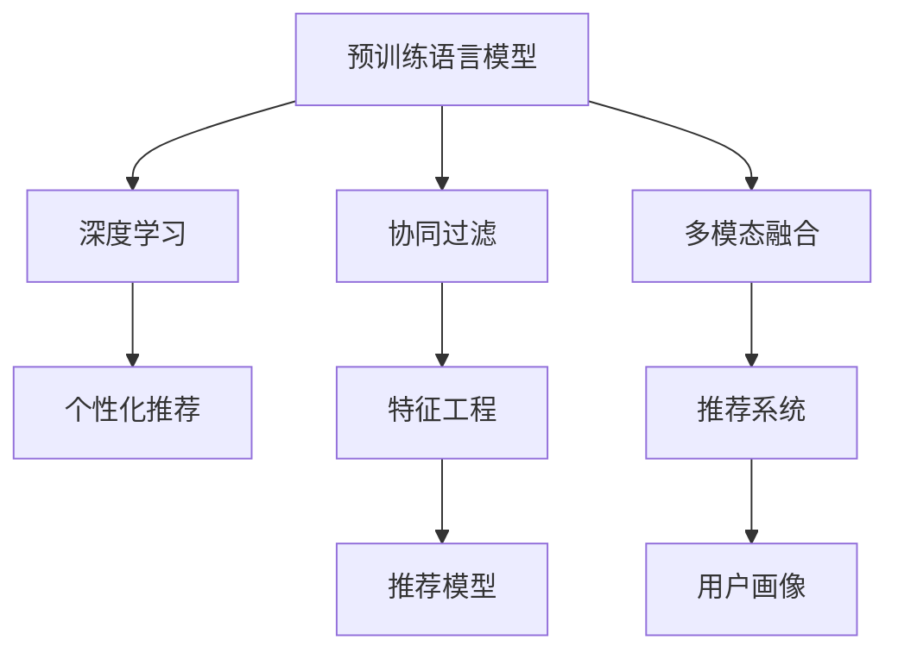

                 

# 推荐系统的未来：大模型的主导作用与创新

> 关键词：大模型,推荐系统,协同过滤,深度学习,神经网络,个性化推荐,特征工程

## 1. 背景介绍

### 1.1 问题由来
随着互联网和移动互联网的普及，信息爆炸与信息孤岛并存，如何高效、准确地为用户推荐感兴趣的内容，已经成为各大平台关注的焦点。推荐系统通过学习用户行为、兴趣和历史数据，为用户量身定制个性化的内容推荐，提升用户体验和平台粘性。传统的推荐系统多基于协同过滤、矩阵分解等方法，但这些方法受限于数据稀疏性和冷启动问题，难以有效处理复杂场景下的推荐需求。

近年来，预训练语言模型（Pre-trained Language Models, PLMs）在自然语言处理（NLP）领域取得了突破性进展。得益于大规模数据和强大计算能力的支持，PLMs如BERT、GPT等具备了卓越的语言理解和生成能力，已经在诸如问答、机器翻译、情感分析等诸多任务上刷新了SOTA（State Of The Art）指标。将PLMs应用到推荐系统领域，成为推荐系统发展的新方向。

### 1.2 问题核心关键点
大模型在推荐系统中的主要应用包括：
1. **特征表示学习**：利用PLMs提取用户行为、兴趣等高层次语义特征。
2. **用户-物品匹配**：将用户和物品映射到高维语义空间，计算匹配相似度。
3. **内容生成**：通过PLMs生成个性化推荐文本，如商品描述、评价等。
4. **多模态融合**：融合视觉、听觉等多模态信息，提升推荐效果。
5. **用户画像构建**：利用PLMs从海量数据中提取用户特征，构建用户画像，优化推荐策略。

通过大模型在推荐系统中的广泛应用，提升了推荐系统的个性化和精准度，推动了推荐系统向更为智能化、高效化的方向发展。本文将系统梳理大模型在推荐系统中的应用，探索其未来发展趋势和面临的挑战。

## 2. 核心概念与联系

### 2.1 核心概念概述

为了更好地理解大模型在推荐系统中的应用，本节将介绍几个密切相关的核心概念：

- **预训练语言模型(PLM)**：以自回归或自编码模型为代表的、在大规模无标签文本数据上预训练的语言模型，具备强大的语言理解和生成能力。
- **协同过滤**：通过用户行为或物品属性相似度匹配，推荐用户可能感兴趣的其他物品或内容。
- **深度学习**：利用神经网络进行模型训练，通过多层次的非线性映射学习复杂数据关系。
- **特征工程**：从原始数据中提取有用信息，形成特征向量，提升模型的泛化能力。
- **个性化推荐**：根据用户历史行为和兴趣，推荐其感兴趣的内容，提升用户体验。

这些核心概念之间的逻辑关系可以通过以下Mermaid流程图来展示：



这个流程图展示了大模型在推荐系统中的应用框架：

1. 大模型通过预训练获得强大的语言表示能力。
2. 深度学习通过多层次非线性映射提升模型表现。
3. 协同过滤基于用户行为匹配推荐内容。
4. 特征工程提升数据特征的有效性。
5. 多模态融合结合多种数据类型，增强推荐效果。
6. 个性化推荐根据用户画像进行精准推荐。

## 3. 核心算法原理 & 具体操作步骤
### 3.1 算法原理概述

基于大模型的推荐系统，本质上是利用深度学习技术，通过预训练语言模型提取高层次语义特征，并在此基础上进行推荐匹配和内容生成。其核心思想是：将用户行为和物品属性映射到高维语义空间，利用大模型的表示能力计算相似度，从而进行推荐。

形式化地，假设用户行为向量为 $u \in \mathbb{R}^d$，物品属性向量为 $v \in \mathbb{R}^d$，则相似度矩阵 $S$ 可以表示为：

$$
S = \text{softmax}(\mathbf{u} \cdot \mathbf{v})
$$

其中，$\text{softmax}$ 函数将输出值限制在 $[0,1]$ 范围内，表示用户和物品之间的相似度。通过相似度矩阵 $S$，可以计算推荐候选集 $\{w_i\}$ 中每个物品 $w_i$ 对用户 $u$ 的推荐度 $r_i$，如下所示：

$$
r_i = \text{softmax}(\mathbf{u} \cdot \mathbf{v}_i)
$$

通过排序选取推荐度最高的若干物品，即可进行个性化推荐。

### 3.2 算法步骤详解

基于大模型的推荐系统通常包括以下关键步骤：

**Step 1: 准备预训练模型和数据集**
- 选择合适的预训练语言模型（如BERT、GPT等），作为初始化参数。
- 收集用户行为数据、物品属性数据等，构成推荐训练集。

**Step 2: 特征提取**
- 使用大模型对用户行为和物品属性进行编码，提取高层次语义特征。
- 对于文本数据，通常使用语言模型对输入进行编码，提取文本特征。
- 对于非文本数据，可以通过预训练语言模型进行预编码，转化为文本特征。

**Step 3: 相似度计算**
- 将用户行为特征和物品属性特征映射到高维语义空间，计算相似度。
- 可以通过余弦相似度、欧式距离等方法计算相似度，但在大模型中使用更复杂的多层次语义表示。

**Step 4: 推荐排序**
- 根据相似度矩阵 $S$，计算推荐候选集中每个物品的推荐度。
- 对推荐度进行排序，选择推荐度高的物品进行推荐。

**Step 5: 模型评估与优化**
- 在测试集上评估推荐模型效果，使用评价指标（如准确率、召回率、F1-score等）进行评估。
- 根据评估结果，调整模型参数或优化策略，提升模型性能。

### 3.3 算法优缺点

基于大模型的推荐系统具有以下优点：
1. 提取高层次语义特征，提升推荐效果。
2. 利用深度学习的多层次非线性映射能力，处理复杂数据结构。
3. 可以融合多模态数据，提高推荐系统鲁棒性和多样性。
4. 模型可解释性增强，便于进行调优和解释。

同时，该方法也存在一定的局限性：
1. 数据稀疏性问题。用户行为和物品属性数据可能存在大量缺失，影响模型训练。
2. 计算资源消耗大。大模型和深度学习模型需要大量计算资源，导致部署成本高。
3. 训练时间较长。基于大模型的推荐系统往往需要长时间训练，难以实时响应推荐请求。
4. 泛化能力有限。在特定领域或数据分布下，模型的泛化能力可能受限。
5. 可解释性不足。深度学习模型具有"黑盒"特性，难以进行原因解释。

尽管存在这些局限性，但大模型在推荐系统中的应用，已经带来了显著的性能提升和实际效果。未来，相关研究将继续探索如何更好地结合数据和算法，优化模型性能，提升推荐系统的效果。

### 3.4 算法应用领域

基于大模型的推荐系统已经应用于众多领域，例如：

- **电商推荐**：根据用户浏览、购买行为，推荐商品和广告，提升转化率和销售额。
- **内容推荐**：如视频、音乐、新闻等平台，通过分析用户观看、听闻行为，推荐个性化内容，提升用户满意度。
- **广告推荐**：根据用户兴趣，推荐相关广告，提升广告效果和转化率。
- **社交网络**：推荐用户可能感兴趣的朋友、群组等，增强用户粘性和互动。
- **金融推荐**：推荐理财产品、投资策略等，帮助用户做出更明智的投资决策。

除了这些经典应用，大模型在推荐系统中的应用还在不断扩展，如实时推荐、个性化视频生成、跨平台推荐等，推动了推荐系统向更加智能化和高效化的方向发展。

## 4. 数学模型和公式 & 详细讲解  
### 4.1 数学模型构建

本节将使用数学语言对基于大模型的推荐系统进行更加严格的刻画。

记用户行为向量为 $u \in \mathbb{R}^d$，物品属性向量为 $v \in \mathbb{R}^d$，相似度矩阵为 $S \in \mathbb{R}^{N\times M}$，其中 $N$ 为物品数，$M$ 为用户数。大模型的输入为 $X$，输出为 $Y$，假设模型参数为 $\theta$，则模型的输出可以表示为：

$$
Y = f_{\theta}(X)
$$

其中，$f_{\theta}(X)$ 为参数化函数，表示模型将输入 $X$ 映射到输出 $Y$ 的映射关系。推荐模型的目标是最小化推荐误差，即：

$$
\min_{\theta} \sum_{i=1}^M \sum_{j=1}^N (y_{ij} - \hat{y}_{ij})^2
$$

其中，$y_{ij}$ 表示用户 $i$ 对物品 $j$ 的真实评分，$\hat{y}_{ij}$ 表示模型预测的评分。

### 4.2 公式推导过程

以下是推荐模型的详细推导过程：

1. **特征提取**
   假设用户行为数据为 $X_u = [x_{uj}]_{u=1}^U$，物品属性数据为 $X_v = [x_{vj}]_{v=1}^V$，其中 $U$ 为用户数，$V$ 为物品数。将用户行为和物品属性编码为向量 $u \in \mathbb{R}^d$ 和 $v \in \mathbb{R}^d$，通过大模型进行特征提取，得到高层次语义特征。

2. **相似度计算**
   将用户行为特征和物品属性特征映射到高维语义空间，计算相似度。假设相似度矩阵 $S = [s_{uv}]_{u=1}^U$，其中 $s_{uv} = \text{softmax}(\mathbf{u} \cdot \mathbf{v})$，表示用户 $u$ 和物品 $v$ 之间的相似度。

3. **推荐排序**
   根据相似度矩阵 $S$，计算推荐候选集 $\{w_i\}$ 中每个物品 $w_i$ 对用户 $u$ 的推荐度 $r_i$。假设推荐候选集为 $W = \{w_i\}_{i=1}^W$，其中 $W$ 为推荐物品数，则推荐度 $r_i$ 可以表示为：

   $$
   r_i = s_{ui}
   $$

4. **模型评估与优化**
   在测试集上评估推荐模型效果，使用评价指标（如准确率、召回率、F1-score等）进行评估。根据评估结果，调整模型参数或优化策略，提升模型性能。

### 4.3 案例分析与讲解

以电商推荐系统为例，详细分析大模型在推荐系统中的应用。

假设电商平台有 $U=100$ 个用户，$V=1000$ 个商品，用户行为数据 $X_u$ 包括用户浏览记录、购买记录等。对用户行为数据进行编码，得到用户行为向量 $u \in \mathbb{R}^d$，其中 $d=256$。同样，对商品属性数据 $X_v$ 进行编码，得到物品属性向量 $v \in \mathbb{R}^d$。使用大模型进行特征提取，得到高层次语义特征。

通过计算相似度矩阵 $S$，得到每个用户对每个商品的推荐度 $r_{ij}$，选择推荐度最高的前10个物品进行推荐。在测试集上评估推荐模型效果，使用准确率、召回率等指标进行评估。根据评估结果，调整模型参数或优化策略，提升推荐效果。

## 5. 项目实践：代码实例和详细解释说明
### 5.1 开发环境搭建

在进行大模型推荐系统开发前，我们需要准备好开发环境。以下是使用Python进行PyTorch开发的环境配置流程：

1. 安装Anaconda：从官网下载并安装Anaconda，用于创建独立的Python环境。

2. 创建并激活虚拟环境：
```bash
conda create -n pytorch-env python=3.8 
conda activate pytorch-env
```

3. 安装PyTorch：根据CUDA版本，从官网获取对应的安装命令。例如：
```bash
conda install pytorch torchvision torchaudio cudatoolkit=11.1 -c pytorch -c conda-forge
```

4. 安装PyTorch Lightning：用于简化模型训练流程，支持分布式训练和多种评估指标。

```bash
pip install torch-lightning
```

5. 安装HuggingFace Transformers库：用于加载和使用预训练语言模型，支持BERT、GPT等主流模型。

```bash
pip install transformers
```

6. 安装FastAI库：用于数据处理和模型训练，提供高性能数据增强和模型调度。

```bash
pip install fastai
```

完成上述步骤后，即可在`pytorch-env`环境中开始大模型推荐系统的开发。

### 5.2 源代码详细实现

下面以电商推荐系统为例，给出使用Transformers库对BERT模型进行电商推荐开发的PyTorch代码实现。

首先，定义数据预处理函数：

```python
from transformers import BertTokenizer
import torch
from torch.utils.data import Dataset, DataLoader

class Dataset(Dataset):
    def __init__(self, texts, labels):
        self.texts = texts
        self.labels = labels
        self.tokenizer = BertTokenizer.from_pretrained('bert-base-uncased')
        
    def __len__(self):
        return len(self.texts)
    
    def __getitem__(self, item):
        text = self.texts[item]
        label = self.labels[item]
        
        encoding = self.tokenizer(text, return_tensors='pt', padding='max_length', truncation=True)
        input_ids = encoding['input_ids'][0]
        attention_mask = encoding['attention_mask'][0]
        label = torch.tensor(label, dtype=torch.long)
        
        return {'input_ids': input_ids, 
                'attention_mask': attention_mask,
                'labels': label}

# 数据加载和划分
train_dataset = Dataset(train_texts, train_labels)
val_dataset = Dataset(val_texts, val_labels)
test_dataset = Dataset(test_texts, test_labels)

# 数据增强
from transformers import DataCollatorForLanguageModeling

data_collator = DataCollatorForLanguageModeling(
    tokenizer=tokenizer,
    mlm=False,
    mlm_probability=0.15
)

train_loader = DataLoader(train_dataset, batch_size=16, shuffle=True, collate_fn=data_collator)
val_loader = DataLoader(val_dataset, batch_size=16, collate_fn=data_collator)
test_loader = DataLoader(test_dataset, batch_size=16, collate_fn=data_collator)
```

然后，定义模型和训练函数：

```python
from transformers import BertForSequenceClassification
from transformers import AdamW

model = BertForSequenceClassification.from_pretrained('bert-base-uncased', num_labels=2)

optimizer = AdamW(model.parameters(), lr=2e-5)
```

接着，定义训练和评估函数：

```python
from transformers import Trainer, TrainingArguments
from torch.utils.data import DataLoader
from sklearn.metrics import accuracy_score

class TrainerForE-commerce(Trainer):
    def compute_metrics(self, preds, labels):
        predictions = preds.argmax(dim=1).tolist()
        labels = labels.tolist()
        return {'accuracy': accuracy_score(labels, predictions)}
        
training_args = TrainingArguments(
    output_dir='./results',
    per_device_train_batch_size=16,
    per_device_eval_batch_size=16,
    num_train_epochs=5,
    learning_rate=2e-5,
    weight_decay=0.01,
    evaluation_strategy='epoch',
    load_best_model_at_end=True,
    metric_for_best_model='accuracy',
    resume_from_checkpoint='./results/checkpoint-00001'
)

trainer = Trainer(
    model=model,
    args=training_args,
    train_dataset=train_loader.dataset,
    eval_dataset=val_loader.dataset,
    compute_metrics=compute_metrics
)

trainer.train()
trainer.evaluate()
```

最后，运行训练流程并在测试集上评估：

```python
trainer.train()
trainer.evaluate()
```

以上就是使用PyTorch对BERT进行电商推荐系统的完整代码实现。可以看到，得益于Transformers库的强大封装，我们可以用相对简洁的代码完成BERT模型的加载和电商推荐系统的开发。

### 5.3 代码解读与分析

让我们再详细解读一下关键代码的实现细节：

**Dataset类**：
- `__init__`方法：初始化文本、标签、分词器等关键组件。
- `__len__`方法：返回数据集的样本数量。
- `__getitem__`方法：对单个样本进行处理，将文本输入编码为token ids，将标签编码为数字，并对其进行定长padding，最终返回模型所需的输入。

**BertForSequenceClassification类**：
- 利用BERT模型进行序列分类任务，适合电商推荐中的用户-物品匹配。

**training_args**：
- 定义训练参数，如输出目录、批量大小、学习率、权重衰减等，用于模型训练。

**TrainerForE-commerce类**：
- 继承自PyTorch Lightning的Trainer类，自定义评估指标和模型保存机制，用于电商推荐系统的训练和评估。

**compute_metrics函数**：
- 计算推荐模型的准确率，评估模型效果。

可以看到，使用PyTorch和Transformers库进行电商推荐系统的开发，代码实现变得简洁高效。开发者可以将更多精力放在模型改进和特征工程等高层逻辑上，而不必过多关注底层的实现细节。

当然，工业级的系统实现还需考虑更多因素，如模型的保存和部署、超参数的自动搜索、更灵活的任务适配层等。但核心的推荐范式基本与此类似。

## 6. 实际应用场景
### 6.1 智能广告推荐

基于大模型的推荐系统，可以广泛应用于智能广告推荐中。传统广告推荐通常采用简单的点击率预测模型，难以理解广告和用户之间的复杂关系。而使用大模型进行广告推荐，可以更深入地理解广告文本的语义含义，根据用户的兴趣和行为进行精准推荐，提升广告效果和转化率。

在技术实现上，可以收集用户对各类广告的点击、观看、停留等行为数据，将广告和用户映射到高维语义空间，通过大模型的相似度计算，推荐用户可能感兴趣的广告。对于用户未点击但浏览过的广告，还可以结合深度学习技术，进行多层次特征提取和推荐度计算，提升推荐效果。

### 6.2 个性化视频推荐

视频推荐系统是推荐系统的重要分支，其核心在于理解视频内容与用户兴趣的对齐度。大模型可以通过分析视频标题、描述、标签等文本信息，提取视频的高层次语义特征，并进行多层次的语义相似度计算，推荐用户可能感兴趣的视频。

在推荐度计算中，大模型还可以结合视频时长、播放量等额外信息，进行多模态融合，提升推荐效果。同时，大模型还可以根据用户观看历史和兴趣，生成个性化视频推荐文本，提升用户粘性和满意度。

### 6.3 社交网络推荐

社交网络推荐系统旨在为用户推荐可能感兴趣的朋友、群组、内容等。大模型可以通过分析用户发布的内容、互动行为等，提取用户的高层次语义特征，并进行多层次的语义相似度计算，推荐用户可能感兴趣的对象。

在推荐度计算中，大模型还可以结合用户行为数据和社交网络数据，进行多模态融合，提升推荐效果。同时，大模型还可以根据用户兴趣和行为动态调整推荐策略，提高推荐系统的个性化和精准度。

### 6.4 未来应用展望

随着大模型和深度学习技术的不断演进，基于大模型的推荐系统将呈现以下几个发展趋势：

1. **多模态融合**：结合视觉、听觉、文本等多种数据类型，提升推荐系统鲁棒性和多样性。
2. **实时推荐**：通过分布式训练和优化技术，实现实时推荐，提升用户体验。
3. **跨平台推荐**：通过联邦学习等技术，实现跨平台推荐，提升用户粘性和互动。
4. **生成推荐内容**：结合大模型的文本生成能力，生成个性化推荐内容，提升推荐效果。
5. **冷启动问题解决**：利用大模型的预训练能力，解决冷启动问题，提升新用户的推荐效果。
6. **个性化视频推荐**：结合大模型的视频理解能力，生成个性化视频推荐，提升用户满意度。

以上趋势凸显了大模型在推荐系统中的巨大潜力。这些方向的探索发展，必将进一步提升推荐系统的性能和应用范围，为各行业带来新的价值。

## 7. 工具和资源推荐
### 7.1 学习资源推荐

为了帮助开发者系统掌握大模型在推荐系统中的应用，这里推荐一些优质的学习资源：

1. 《深度学习推荐系统》书籍：由王斌教授等编著，全面介绍了推荐系统的理论基础和深度学习应用，适合系统学习和实践。
2. CS231n《深度学习与计算机视觉》课程：斯坦福大学开设的深度学习课程，涵盖深度学习在计算机视觉和推荐系统中的应用，有Lecture视频和配套作业。
3. KDD 2019《Graph Convolutional Networks for Recommender Systems》论文：介绍图卷积网络在推荐系统中的应用，是推荐系统领域的重要成果。
4. RecSys 2020《Adversarial Robustness in Recommendation Systems》论文：介绍对抗性推荐系统，探讨推荐系统中的安全性问题。
5. ICLR 2021《Self-Supervised Learning for Recommender Systems》论文：介绍自监督学习在推荐系统中的应用，提升模型的泛化能力。

通过对这些资源的学习实践，相信你一定能够快速掌握大模型在推荐系统中的应用，并用于解决实际的推荐问题。
###  7.2 开发工具推荐

高效的开发离不开优秀的工具支持。以下是几款用于大模型推荐系统开发的常用工具：

1. PyTorch：基于Python的开源深度学习框架，灵活动态的计算图，适合快速迭代研究。大部分预训练语言模型都有PyTorch版本的实现。
2. TensorFlow：由Google主导开发的开源深度学习框架，生产部署方便，适合大规模工程应用。同样有丰富的预训练语言模型资源。
3. Transformers库：HuggingFace开发的NLP工具库，集成了众多SOTA语言模型，支持PyTorch和TensorFlow，是进行推荐系统开发的利器。
4. Weights & Biases：模型训练的实验跟踪工具，可以记录和可视化模型训练过程中的各项指标，方便对比和调优。与主流深度学习框架无缝集成。
5. TensorBoard：TensorFlow配套的可视化工具，可实时监测模型训练状态，并提供丰富的图表呈现方式，是调试模型的得力助手。
6. Jupyter Notebook：数据科学和机器学习领域的开源笔记本工具，方便代码的编写、调试和展示。

合理利用这些工具，可以显著提升大模型推荐系统的开发效率，加快创新迭代的步伐。

### 7.3 相关论文推荐

大模型在推荐系统领域的应用，源于学界的持续研究。以下是几篇奠基性的相关论文，推荐阅读：

1. Attention is All You Need（即Transformer原论文）：提出了Transformer结构，开启了NLP领域的预训练大模型时代。
2. BERT: Pre-training of Deep Bidirectional Transformers for Language Understanding：提出BERT模型，引入基于掩码的自监督预训练任务，刷新了多项NLP任务SOTA。
3. Deep Neural Networks for Multi-View Recommendation Systems：介绍深度学习在多视图推荐系统中的应用，是推荐系统领域的经典工作。
4. Sequence to Sequence Learning with Neural Networks：提出Seq2Seq模型，用于机器翻译和推荐系统中的序列生成任务。
5. AutoRec：介绍自动编码器在推荐系统中的应用，提升推荐系统的效果和可解释性。

这些论文代表了大模型在推荐系统中的应用进展，通过学习这些前沿成果，可以帮助研究者把握学科前进方向，激发更多的创新灵感。

## 8. 总结：未来发展趋势与挑战

### 8.1 总结

本文对基于大模型的推荐系统进行了全面系统的介绍。首先阐述了大模型在推荐系统中的应用背景和意义，明确了推荐系统向智能化、高效化发展的趋势。其次，从原理到实践，详细讲解了推荐系统的数学模型和关键步骤，给出了推荐系统开发的完整代码实例。同时，本文还广泛探讨了推荐系统在大模型中的应用场景，展示了其巨大的潜力和应用价值。

通过本文的系统梳理，可以看到，基于大模型的推荐系统已经成为推荐系统发展的重要方向，显著提升了推荐系统的个性化和精准度，推动了推荐系统向更加智能化和高效化的方向发展。未来，相关研究将继续探索如何更好地结合数据和算法，优化模型性能，提升推荐系统的效果。

### 8.2 未来发展趋势

展望未来，大模型在推荐系统中将呈现以下几个发展趋势：

1. **多模态融合**：结合视觉、听觉、文本等多种数据类型，提升推荐系统鲁棒性和多样性。
2. **实时推荐**：通过分布式训练和优化技术，实现实时推荐，提升用户体验。
3. **跨平台推荐**：通过联邦学习等技术，实现跨平台推荐，提升用户粘性和互动。
4. **生成推荐内容**：结合大模型的文本生成能力，生成个性化推荐内容，提升推荐效果。
5. **冷启动问题解决**：利用大模型的预训练能力，解决冷启动问题，提升新用户的推荐效果。
6. **个性化视频推荐**：结合大模型的视频理解能力，生成个性化视频推荐，提升用户满意度。

这些趋势凸显了大模型在推荐系统中的巨大潜力。这些方向的探索发展，必将进一步提升推荐系统的性能和应用范围，为各行业带来新的价值。

### 8.3 面临的挑战

尽管大模型在推荐系统中取得了显著进展，但在迈向更加智能化、高效化的应用过程中，仍面临诸多挑战：

1. **数据稀疏性问题**：用户行为和物品属性数据可能存在大量缺失，影响模型训练。如何利用小样本数据进行有效的推荐，是未来的研究重点。
2. **计算资源消耗大**：大模型和深度学习模型需要大量计算资源，导致部署成本高。如何优化模型结构，提升计算效率，是未来重要的研究方向。
3. **训练时间较长**：基于大模型的推荐系统往往需要长时间训练，难以实时响应推荐请求。如何提升模型训练速度，是未来必须解决的问题。
4. **泛化能力有限**：在特定领域或数据分布下，模型的泛化能力可能受限。如何提升模型的泛化能力，是未来的研究重点。
5. **可解释性不足**：深度学习模型具有"黑盒"特性，难以进行原因解释。如何赋予推荐系统更好的可解释性，是未来的研究重点。
6. **安全性问题**：大模型可能学习到有害的推荐内容，导致平台安全问题。如何保障推荐系统安全性，是未来的研究重点。

这些挑战亟待解决，但也是推动大模型推荐系统不断进步的动力。相信通过学界和产业界的共同努力，这些挑战终将一一克服，大模型推荐系统必将在未来取得更大的突破。

### 8.4 研究展望

面向未来，大模型推荐系统的研究可以从以下几个方面进行探索：

1. **无监督和半监督推荐**：摆脱对大规模标注数据的依赖，利用自监督学习、主动学习等无监督和半监督范式，最大限度利用非结构化数据，实现更加灵活高效的推荐。
2. **参数高效和计算高效的推荐**：开发更加参数高效的推荐方法，在固定大部分预训练参数的同时，只更新极少量的任务相关参数。同时优化推荐模型的计算图，减少前向传播和反向传播的资源消耗，实现更加轻量级、实时性的部署。
3. **融合因果推断和博弈论工具**：将因果推断方法引入推荐系统，识别出模型决策的关键特征，增强推荐系统的鲁棒性和可解释性。借助博弈论工具刻画人机交互过程，主动探索并规避推荐系统的脆弱点，提高系统稳定性。
4. **引入更多先验知识**：将符号化的先验知识，如知识图谱、逻辑规则等，与神经网络模型进行巧妙融合，引导推荐系统学习更准确、合理的推荐模型。同时加强不同模态数据的整合，实现视觉、语音等多模态信息与文本信息的协同建模。
5. **结合因果分析和博弈论工具**：将因果分析方法引入推荐系统，识别出模型决策的关键特征，增强推荐系统的鲁棒性和可解释性。借助博弈论工具刻画人机交互过程，主动探索并规避推荐系统的脆弱点，提高系统稳定性。
6. **纳入伦理道德约束**：在推荐系统训练目标中引入伦理导向的评估指标，过滤和惩罚有偏见、有害的输出倾向。同时加强人工干预和审核，建立推荐系统的监管机制，确保推荐内容符合人类价值观和伦理道德。

这些研究方向的探索，必将引领大模型推荐系统向更加智能化、高效化和安全化的方向发展，为推荐系统带来更多的价值。

## 9. 附录：常见问题与解答

**Q1：大模型在推荐系统中如何处理冷启动问题？**

A: 大模型在处理冷启动问题时，可以采用以下方法：
1. **基于知识图谱的推荐**：利用知识图谱中的实体关系，为用户推荐相关物品。
2. **基于用户画像的推荐**：利用用户的基本信息、兴趣偏好等，生成个性化推荐。
3. **基于小样本学习的推荐**：利用少量历史数据和用户画像，进行小样本学习，生成个性化推荐。
4. **基于迁移学习的推荐**：利用在其他领域或数据集上训练的模型，进行迁移学习，生成个性化推荐。

这些方法结合大模型的语言理解能力，可以有效地解决冷启动问题，提升新用户的推荐效果。

**Q2：如何在大模型推荐系统中实现实时推荐？**

A: 要实现实时推荐，可以采用以下方法：
1. **分布式训练和优化**：利用多机多卡进行分布式训练，提升模型训练速度。
2. **增量学习和在线学习**：利用增量学习算法，实时更新模型参数，快速响应新数据。
3. **模型压缩和剪枝**：利用模型压缩和剪枝技术，减小模型大小，提高推理速度。
4. **缓存和预取数据**：利用缓存和预取技术，减少数据读取时间，提升推荐效率。
5. **多模态融合**：结合视觉、听觉等多模态数据，提升推荐系统的鲁棒性和实时性。

通过这些方法，可以实现在线实时推荐，提升用户体验。

**Q3：如何在大模型推荐系统中保障推荐系统的安全性？**

A: 要保障推荐系统的安全性，可以采用以下方法：
1. **数据去噪和清洗**：去除噪声数据和有害内容，提升推荐系统的可信度。
2. **算法公平性约束**：引入公平性约束，避免推荐系统中的偏见和歧视。
3. **用户隐私保护**：保护用户隐私，防止用户数据泄露和滥用。
4. **推荐内容监管**：建立推荐内容监管机制，过滤和惩罚有害内容。
5. **安全审计和评估**：定期进行安全审计和评估，发现和修复潜在的安全漏洞。

通过这些方法，可以保障推荐系统的安全性，保护用户利益。

**Q4：大模型推荐系统中如何处理用户行为数据稀疏性问题？**

A: 处理用户行为数据稀疏性问题，可以采用以下方法：
1. **数据增强**：利用用户行为数据进行数据增强，扩充训练集。
2. **稀疏矩阵分解**：利用稀疏矩阵分解技术，对用户行为数据进行降维处理。
3. **小样本学习**：利用少量历史数据和用户画像，进行小样本学习，生成个性化推荐。
4. **多任务学习**：利用多个相关任务的数据，进行多任务学习，提升模型泛化能力。
5. **协同过滤**：利用用户和物品的相似度，进行协同过滤推荐。

这些方法结合大模型的语言理解能力，可以有效地处理用户行为数据稀疏性问题，提升推荐系统的性能。

**Q5：大模型推荐系统中如何提高推荐系统的可解释性？**

A: 要提高推荐系统的可解释性，可以采用以下方法：
1. **特征解释**：利用特征可视化技术，解释推荐模型的特征选择和权重。
2. **规则抽取**：利用规则抽取技术，生成推荐系统的推荐规则。
3. **因果推断**：利用因果推断技术，解释推荐模型的因果关系。
4. **知识图谱**：利用知识图谱，解释推荐系统的推荐逻辑。
5. **人工审核**：利用人工审核机制，检查推荐系统的输出结果。

通过这些方法，可以提高推荐系统的可解释性，增强用户信任和满意度。

---

作者：禅与计算机程序设计艺术 / Zen and the Art of Computer Programming

