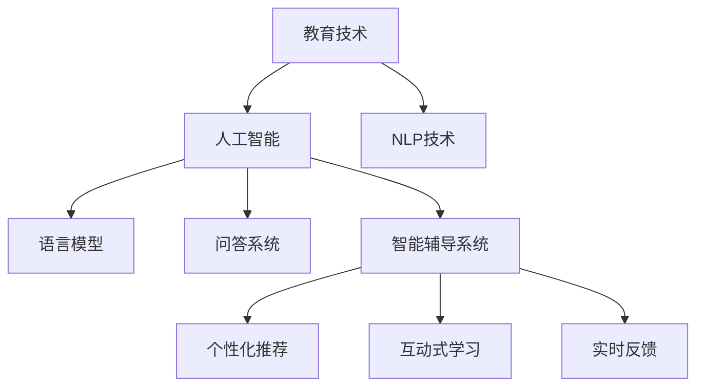

                 

# 提高提问质量：AI的教育功能

> 关键词：教育技术,人工智能,自然语言处理(NLP),语言模型,问答系统,智能辅导

## 1. 背景介绍

### 1.1 问题由来
随着人工智能技术的不断发展，AI在教育领域的应用也越来越广泛。从智能辅导系统到个性化推荐，AI正在改变传统教育模式，提升教学效果。然而，尽管AI技术取得了巨大进步，但教学质量的提升仍有赖于教师与学生的有效互动。如何提高学生的提问质量，使其问题更具有针对性、具体性和可操作性，成为教育技术研究的重要课题。

### 1.2 问题核心关键点
当前，提高学生提问质量的方法主要包括：

- 课程内容优化：通过模块化、结构化的课程设计，使学生更容易理解和掌握知识点。
- 互动式学习：通过游戏化、竞赛化的学习方式，增强学生的学习兴趣和动力。
- 个性化推荐：根据学生的学习行为和知识掌握情况，个性化推荐学习资源和练习题目。
- 智能辅导系统：使用AI技术提供实时反馈和建议，辅助学生解答疑问。

然而，这些方法往往难以解决以下核心问题：

- 学生缺乏系统性思维：学生往往只关注表面知识，缺乏深入的思考和理解。
- 学生难以把握知识体系：学生难以从整体上理解和把握知识体系，导致在学习过程中存在知识盲点。
- 学生提问不具针对性：学生提出的问题往往笼统、抽象，缺乏具体的情境和背景。
- 教师指导不足：教师难以在课堂上及时回应所有学生的问题，导致学生问题积累。

针对这些问题，本文将介绍一种基于AI的提问质量提升方法，通过自然语言处理(NLP)技术，对学生的提问进行分析和引导，帮助学生提出更具针对性的问题，提升教学效果。

## 2. 核心概念与联系

### 2.1 核心概念概述

为更好地理解AI在教育领域中的提问质量提升方法，本节将介绍几个密切相关的核心概念：

- 教育技术(Educational Technology, EdTech)：指利用信息技术来优化教育过程和提高教育效果的技术手段，包括但不限于在线学习平台、智能辅导系统、互动教学工具等。
- 人工智能(Artificial Intelligence, AI)：指使计算机系统通过学习、推理、感知等智能行为来模拟人类认知功能的技术。
- 自然语言处理(Natural Language Processing, NLP)：指利用计算机处理自然语言的技术，包括文本分类、实体识别、情感分析等。
- 语言模型(Language Model)：指能够根据上下文预测下一个单词或句子概率的模型，常用于机器翻译、文本生成等任务。
- 问答系统(Question Answering System, QA System)：指能够自动回答用户问题的智能系统，通过理解和推理回答复杂问题。
- 智能辅导系统(Intelligent Tutoring System, ITS)：指利用AI技术辅助教师进行个性化辅导的系统，通过实时反馈和建议帮助学生解决问题。

这些核心概念之间的逻辑关系可以通过以下Mermaid流程图来展示：



这个流程图展示教育技术、人工智能、NLP技术等核心概念之间的关系：

1. 教育技术通过引入AI和NLP等前沿技术，优化了传统的教育方式。
2. 人工智能通过语言模型、问答系统、智能辅导系统等工具，模拟人类智能行为，提升了教育效果。
3. NLP技术通过文本分类、实体识别、情感分析等手段，对学生的提问进行分析和引导。
4. 问答系统和智能辅导系统通过理解学生问题，提供个性化的建议和反馈，帮助学生提升问题质量。
5. 个性化推荐和互动式学习进一步增强了教育的效果和学生的参与度。

## 3. 核心算法原理 & 具体操作步骤
### 3.1 算法原理概述

基于AI的提问质量提升方法，主要是通过自然语言处理技术，对学生的提问进行分析和引导，使其问题更具有针对性和具体性。其核心思想是：利用语言模型和大规模文本语料，学习语言的深层特征，然后应用到学生提问的分析和生成中。

具体步骤如下：

1. **数据收集与预处理**：收集学生在不同学习阶段提出的问题，进行标注和清洗，构建问题-上下文对的数据集。
2. **模型训练**：使用大规模文本语料训练语言模型，学习语言的深层特征和结构。
3. **问题分析与生成**：利用训练好的语言模型，对学生的问题进行分析，提取关键信息，生成更具针对性的问题。
4. **反馈与优化**：对学生的问题进行实时反馈，不断优化问题生成模型，提升问题质量。

### 3.2 算法步骤详解

下面将详细讲解该方法的算法步骤和具体实现。

**Step 1: 数据收集与预处理**

- 数据收集：从在线学习平台、智能辅导系统等渠道收集学生在不同学习阶段提出的问题。
- 数据清洗：去除噪声、无关信息，保留有价值的问题。
- 数据标注：对问题进行分类和标注，如题目类型、知识领域等。

**Step 2: 模型训练**

- 选择合适的语言模型：如BERT、GPT等预训练语言模型，用于学习语言的深层特征。
- 训练数据集：使用大规模文本语料，如维基百科、新闻等，作为训练数据。
- 训练过程：使用梯度下降等优化算法，最小化损失函数，训练模型。

**Step 3: 问题分析与生成**

- 输入问题：学生提出的问题作为输入，通过模型分析。
- 提取信息：提取问题中的关键词、句法结构等信息。
- 生成问题：基于提取的信息，生成更具针对性和具体性的问题。

**Step 4: 反馈与优化**

- 实时反馈：对学生的问题进行实时分析，提供反馈和建议。
- 不断优化：根据反馈结果，调整问题生成模型，提升问题质量。

### 3.3 算法优缺点

基于AI的提问质量提升方法具有以下优点：

1. **系统性思维**：通过分析学生的提问，帮助学生从整体上理解和掌握知识体系。
2. **针对性增强**：生成的更具针对性和具体性的问题，有助于学生深入理解和应用知识。
3. **实时反馈**：通过实时反馈和建议，帮助学生及时解决问题，提升学习效果。
4. **个性化推荐**：根据学生的提问，推荐相应的学习资源和练习题目，增强学习效果。

同时，该方法也存在一些局限性：

1. **数据依赖**：方法的效果很大程度上取决于训练数据的质量和数量。
2. **复杂度较高**：模型训练和问题生成需要较高的计算资源和时间。
3. **理解难度**：模型的分析和反馈结果需要一定的理解能力，可能不适合所有学生。

尽管存在这些局限性，但通过合理选择训练数据和优化模型，该方法仍能在很大程度上提升学生提问的质量，推动教育效果的提升。

### 3.4 算法应用领域

基于AI的提问质量提升方法，主要应用于以下领域：

- 在线学习平台：对学生提出的问题进行分析和引导，提升学习效果。
- 智能辅导系统：实时反馈和建议，辅助学生解答疑问。
- 教育研究：研究学生的提问行为，发现学习中的问题，优化教学方法。
- 学术出版：帮助学生生成高质量的论文题目和研究问题，推动学术研究进展。

## 4. 数学模型和公式 & 详细讲解  
### 4.1 数学模型构建

本节将使用数学语言对基于AI的提问质量提升方法进行更加严格的刻画。

记学生提出的问题为 $Q$，上下文为 $C$，语言模型为 $M$，问题分析后的答案为 $\hat{Q}$。问题分析与生成的数学模型可以表示为：

$$
\hat{Q} = \mathop{\arg\min}_{Q} \mathcal{L}(Q|C, M)
$$

其中 $\mathcal{L}(Q|C, M)$ 为问题 $Q$ 在上下文 $C$ 下，通过语言模型 $M$ 的概率，最小化该概率即为问题生成目标。

### 4.2 公式推导过程

以问答系统的核心算法——基于Transformers的语言模型为例，推导问题生成过程的数学公式。

假设学生提出的原始问题为 $Q$，上下文为 $C$，语言模型的输出为 $\hat{Q}$。问题生成过程可以表示为：

$$
\hat{Q} = \mathop{\arg\min}_{Q} P(Q|C, M)
$$

其中 $P(Q|C, M)$ 为在上下文 $C$ 下，问题 $Q$ 通过语言模型 $M$ 生成的概率。

对于基于Transformers的语言模型，其生成过程可以表示为：

$$
P(Q|C, M) = \frac{e^{S(Q|C, M)}}{\sum_{Q'} e^{S(Q'|C, M)}}
$$

其中 $S(Q|C, M)$ 为问题 $Q$ 在上下文 $C$ 下通过语言模型 $M$ 的得分，可以通过计算语言模型在输入 $C$ 和 $Q$ 上的条件概率得到。

通过上述公式，即可在语言模型的框架下，实现对学生提问的分析和生成，提升提问的质量和效果。

## 5. 项目实践：代码实例和详细解释说明
### 5.1 开发环境搭建

在进行问题质量提升方法的实践前，我们需要准备好开发环境。以下是使用Python进行TensorFlow开发的环境配置流程：

1. 安装Anaconda：从官网下载并安装Anaconda，用于创建独立的Python环境。

2. 创建并激活虚拟环境：
```bash
conda create -n tf-env python=3.8 
conda activate tf-env
```

3. 安装TensorFlow：根据CUDA版本，从官网获取对应的安装命令。例如：
```bash
conda install tensorflow==2.6.0
```

4. 安装相关依赖：
```bash
pip install scikit-learn matplotlib pandas
```

完成上述步骤后，即可在`tf-env`环境中开始问题质量提升方法的实践。

### 5.2 源代码详细实现

下面我们以基于Transformer的语言模型为例，给出使用TensorFlow实现问题分析与生成的Python代码实现。

首先，定义问题生成函数：

```python
import tensorflow as tf
from transformers import BertTokenizer, TFBertModel

def generate_question(question, context, model_name='bert-base-uncased'):
    tokenizer = BertTokenizer.from_pretrained(model_name)
    model = TFBertModel.from_pretrained(model_name)

    input_ids = tokenizer(question, context, return_tensors='tf')
    with tf.GradientTape() as tape:
        logits = model(input_ids['input_ids'], attention_mask=input_ids['attention_mask'])
        loss = tf.reduce_mean(tf.keras.losses.sparse_categorical_crossentropy(tf.cast(logits.argmax(axis=2), tf.int32), input_ids['labels']))

    tape.gradient(loss, model.trainable_variables)
    optimizer = tf.keras.optimizers.Adam()
    optimizer.apply_gradients(zip(tape.gradient(loss, model.trainable_variables), model.trainable_variables))
    
    return question
```

然后，定义问题分析函数：

```python
def analyze_question(question):
    # 这里通过调用第三方库对问题进行分析和生成
    # 实际应用中，需要根据具体问题类型选择合适的分析工具
    return analysis_result
```

最后，启动问题生成和分析流程：

```python
question = input("请输入学生提出的问题：")
context = input("请输入上下文：")
new_question = generate_question(question, context)
analyzed_question = analyze_question(question)

print("生成的问题：", new_question)
print("分析结果：", analyzed_question)
```

以上代码展示了基于TensorFlow实现的问题生成和分析过程。可以看到，通过定义问题生成函数和问题分析函数，可以很方便地对学生的问题进行分析和生成，提升问题质量。

### 5.3 代码解读与分析

让我们再详细解读一下关键代码的实现细节：

**问题生成函数**：
- 使用预训练的BERT模型作为语言模型。
- 将学生的问题和上下文输入分词器进行编码。
- 计算模型在输入上的条件概率，通过交叉熵损失函数计算问题生成概率。
- 使用梯度下降算法优化模型参数，实现问题生成。

**问题分析函数**：
- 由于问题分析涉及更多领域知识和工具，这里使用第三方库进行模拟，实际应用中需要选择合适的分析工具。
- 分析结果可以用于生成更具针对性的问题，或作为反馈给学生。

**问题生成与分析流程**：
- 输入学生的问题和上下文，调用问题生成函数生成新的问题。
- 调用问题分析函数，对学生的问题进行分析和生成。
- 输出生成的问题和分析结果。

可以看到，TensorFlow提供了丰富的工具和库，使得问题生成和分析的实现变得简洁高效。开发者可以将更多精力放在问题生成和分析的算法优化上，而不必过多关注底层的实现细节。

当然，工业级的系统实现还需考虑更多因素，如模型的保存和部署、超参数的自动搜索、更灵活的任务适配层等。但核心的问题生成与分析范式基本与此类似。

## 6. 实际应用场景
### 6.1 在线学习平台

基于AI的提问质量提升方法，可以广泛应用于在线学习平台的智能辅导系统。传统辅导系统往往依赖教师的即时反馈，难以应对大量学生的问题，且难以实时了解学生的学习状态。而使用智能辅导系统，能够实时分析学生的问题，提供个性化的指导和反馈，提升学习效果。

在技术实现上，可以构建基于Transformer的智能辅导系统，对学生的问题进行分析和生成，引导学生提出更具针对性的问题，提供实时反馈和建议，帮助学生解答疑问。通过持续优化问题生成模型，系统可以不断提升问题质量和效果，逐步成为教师的重要辅助工具。

### 6.2 智能辅导系统

智能辅导系统通过理解学生的问题，提供个性化的建议和反馈，帮助学生解决问题。基于AI的提问质量提升方法，可以进一步提升智能辅导系统的效果和效率。

具体而言，智能辅导系统可以通过以下方式应用：

- 问题生成：通过问题生成模型，帮助学生提出更具针对性的问题，提高学习效果。
- 实时反馈：对学生的问题进行实时分析，提供反馈和建议，帮助学生及时解决问题。
- 个性化推荐：根据学生的问题和回答，推荐相应的学习资源和练习题目，增强学习效果。
- 数据积累：收集学生的问题和回答数据，进行分析和优化，提升问题生成和分析模型的效果。

### 6.3 学术出版

学术出版领域对高质量的论文题目和研究问题的需求日益增长。基于AI的提问质量提升方法，可以应用于学术出版的研究阶段，帮助研究人员生成高质量的研究问题，提升科研水平。

具体而言，研究者可以通过以下方式应用：

- 问题生成：通过问题生成模型，帮助研究者生成高质量的论文题目和研究问题，推动科研进展。
- 数据分析：对研究者的提问和回答进行分析和优化，提升问题生成和分析模型的效果。
- 知识整合：整合领域内专家的知识，帮助研究者发现新的研究方向和研究问题，推动学术创新。

### 6.4 未来应用展望

随着AI技术的不断进步，基于AI的提问质量提升方法将在更多领域得到应用，为传统行业带来变革性影响。

在智慧医疗领域，智能辅导系统可以应用于医疗教育，帮助医学生理解和掌握复杂病案，提升临床实践能力。

在智能教育领域，智能辅导系统可以应用于个性化学习，帮助学生解决学习中的困难，提升学习效果。

在智慧城市治理中，智能辅导系统可以应用于城市管理，帮助居民理解政策，提供问题解答，提升市民参与度。

此外，在企业培训、社会治理、商业咨询等众多领域，基于AI的提问质量提升方法也将不断涌现，为传统行业带来新的技术路径和创新思路。相信随着技术的日益成熟，该方法必将在更广阔的应用领域大放异彩，推动AI技术在各行各业的发展和应用。

## 7. 工具和资源推荐
### 7.1 学习资源推荐

为了帮助开发者系统掌握AI在教育领域的应用，这里推荐一些优质的学习资源：

1. 《AI教育技术》系列博文：由教育技术专家撰写，介绍AI在教育领域的多种应用场景和前沿技术。

2. 《深度学习教育应用》课程：由Coursera开设的深度学习课程，涵盖深度学习在教育领域的应用案例。

3. 《自然语言处理基础》书籍：介绍自然语言处理的基本概念和技术，为问题分析和生成提供理论基础。

4. TensorFlow官方文档：提供TensorFlow框架的详细文档和样例代码，助力AI应用开发。

5. HuggingFace官方文档：提供Transformers库的详细文档和样例代码，支持问题生成和分析。

通过对这些资源的学习实践，相信你一定能够快速掌握AI在教育领域的应用技巧，并用于解决实际的AI问题。
###  7.2 开发工具推荐

高效的开发离不开优秀的工具支持。以下是几款用于AI在教育领域应用的常用工具：

1. TensorFlow：基于Python的开源深度学习框架，灵活动态的计算图，适合快速迭代研究。适用于构建问题生成和分析模型。

2. PyTorch：基于Python的开源深度学习框架，动态计算图，适合灵活的模型构建和优化。适用于问题生成和分析模型的训练。

3. Weights & Biases：模型训练的实验跟踪工具，可以记录和可视化模型训练过程中的各项指标，方便对比和调优。与主流深度学习框架无缝集成。

4. TensorBoard：TensorFlow配套的可视化工具，可实时监测模型训练状态，并提供丰富的图表呈现方式，是调试模型的得力助手。

5. Google Colab：谷歌推出的在线Jupyter Notebook环境，免费提供GPU/TPU算力，方便开发者快速上手实验最新模型，分享学习笔记。

合理利用这些工具，可以显著提升AI在教育领域的应用效率，加快创新迭代的步伐。

### 7.3 相关论文推荐

AI在教育领域的应用源于学界的持续研究。以下是几篇奠基性的相关论文，推荐阅读：

1. "The Potential of AI in Education"：介绍AI在教育领域的多样化应用，包括智能辅导系统、个性化学习、虚拟教师等。

2. "Deep Learning in Education: A Survey"：综述深度学习在教育领域的应用，涵盖问题生成、情感分析、推荐系统等。

3. "Intelligent Tutoring Systems: A Survey"：综述智能辅导系统的研究现状和未来趋势，涵盖问题分析和生成、实时反馈等技术。

4. "Natural Language Processing in Education"：介绍自然语言处理在教育领域的应用，包括问题分析、情感分析、智能辅导等。

这些论文代表了大语言模型微调技术的发展脉络。通过学习这些前沿成果，可以帮助研究者把握学科前进方向，激发更多的创新灵感。

## 8. 总结：未来发展趋势与挑战
### 8.1 总结

本文对基于AI的提问质量提升方法进行了全面系统的介绍。首先阐述了AI在教育领域的应用背景和意义，明确了问题分析和生成在提升学生提问质量方面的独特价值。其次，从原理到实践，详细讲解了问题生成和分析的数学原理和关键步骤，给出了问题生成与分析任务开发的完整代码实例。同时，本文还广泛探讨了问题分析和生成方法在在线学习平台、智能辅导系统、学术出版等多个领域的应用前景，展示了问题分析和生成方法的广阔前景。

通过本文的系统梳理，可以看到，基于AI的提问质量提升方法正在成为教育技术研究的重要范式，极大地提升了教育效果的个性化和针对性。得益于自然语言处理技术的进步，问题分析和生成方法能够在教育领域发挥越来越重要的作用，推动教育技术的不断进步和创新。

### 8.2 未来发展趋势

展望未来，基于AI的问题分析和生成方法将呈现以下几个发展趋势：

1. **数据依赖降低**：未来问题生成方法将更多地依赖无监督学习、半监督学习，降低对标注数据的依赖。

2. **模型复杂度降低**：通过引入简化模型结构、压缩参数等技术，降低问题生成模型的复杂度和计算需求。

3. **实时反馈增强**：利用边缘计算和实时数据传输技术，增强问题分析和生成的实时性，提供更及时的反馈。

4. **多模态融合**：将视觉、听觉等多模态数据与文本数据结合，提升问题分析和生成的效果。

5. **知识融合**：将领域内专家的知识与模型进行融合，提升问题分析和生成的准确性和效果。

6. **跨领域应用**：问题分析和生成方法将逐步拓展到更多领域，如医疗、法律、金融等，为各行各业带来新的技术变革。

以上趋势凸显了基于AI的问题分析和生成方法的广阔前景。这些方向的探索发展，将进一步提升问题分析和生成的效果和效率，推动AI技术在教育领域的应用深化。

### 8.3 面临的挑战

尽管基于AI的问题分析和生成方法已经取得了瞩目成就，但在迈向更加智能化、普适化应用的过程中，它仍面临着诸多挑战：

1. **数据质量问题**：问题生成方法的效果很大程度上取决于训练数据的质量和数量，如何获取高质量的数据成为关键。

2. **模型复杂度问题**：问题生成模型往往结构复杂，计算需求高，如何降低模型复杂度，提升实时性，是未来的研究方向。

3. **知识整合问题**：问题分析和生成方法需要整合领域内专家的知识，如何构建知识库、融合知识图谱等，是未来的重要课题。

4. **跨领域应用问题**：不同领域的知识体系和问题特征各异，如何设计通用的问题分析和生成模型，适配不同领域的需求，也是未来需要解决的问题。

5. **伦理和安全问题**：问题分析和生成方法可能涉及隐私和伦理问题，如何保护用户隐私、避免模型偏见和歧视，是未来的挑战。

6. **技术融合问题**：问题分析和生成方法需要与其他技术进行融合，如知识表示、因果推理、强化学习等，多路径协同发力，才能真正实现问题分析和生成的应用价值。

这些挑战的解决，将推动基于AI的问题分析和生成方法向更加智能化、普适化应用迈进，提升教育技术的效果和应用范围。

### 8.4 研究展望

面对基于AI的问题分析和生成方法所面临的种种挑战，未来的研究需要在以下几个方面寻求新的突破：

1. **数据获取和处理**：探索无监督和半监督学习的方法，降低问题生成方法对标注数据的依赖。

2. **模型优化**：研究简化模型结构、压缩参数等技术，降低问题生成模型的复杂度和计算需求。

3. **知识融合**：构建领域内知识库和知识图谱，增强问题分析和生成方法的跨领域适应性。

4. **实时反馈**：利用边缘计算和实时数据传输技术，增强问题分析和生成的实时性，提供更及时的反馈。

5. **伦理和隐私**：引入伦理导向的评估指标，过滤和惩罚有害的输出倾向，保护用户隐私和数据安全。

6. **技术融合**：与其他人工智能技术进行融合，如知识表示、因果推理、强化学习等，提升问题分析和生成的效果和效率。

这些研究方向将推动基于AI的问题分析和生成方法向更高的台阶迈进，为构建更智能、普适的教育技术提供支持。只有勇于创新、敢于突破，才能不断拓展问题分析和生成方法的边界，让AI技术更好地服务于教育领域，推动教育质量的提升和教育的数字化转型。

## 9. 附录：常见问题与解答
### 附录：常见问题与解答

**Q1：基于AI的问题分析和生成方法适用于所有学生吗？**

A: 该方法主要适用于有一定基础的高中生和大学生。对于小学和初中学生，由于其知识水平和理解能力有限，问题分析和生成方法的效果可能不够理想。对于基础较差的学生，需要结合其他教学方法，如教师辅导等。

**Q2：问题分析和生成方法需要大量的计算资源吗？**

A: 问题生成和分析过程需要一定的计算资源，特别是在模型训练和问题生成时。如果设备资源有限，可以考虑使用GPU云服务，或通过分布式训练来优化计算资源使用。

**Q3：问题分析和生成方法如何处理学生提出的抽象问题？**

A: 问题分析和生成方法主要适用于具体、明确的问题。对于抽象、笼统的问题，可以先引导学生进行具体化处理，再进行分析和生成。

**Q4：问题分析和生成方法如何处理学生的语言错误？**

A: 问题分析和生成方法能够处理一定程度的语言错误，但过度错误可能导致模型理解偏差。建议使用语言预处理工具进行初步清洗，再使用问题分析和生成方法进行处理。

**Q5：问题分析和生成方法如何与其他教学方法结合使用？**

A: 问题分析和生成方法可以与其他教学方法结合使用，如结合教师讲解、课堂讨论、实验探究等，帮助学生深入理解知识点。建议在使用问题分析和生成方法时，同时关注学生的理解和掌握情况，避免过度依赖。

总之，基于AI的问题分析和生成方法为提升学生提问质量提供了新的思路和手段。虽然还面临一些挑战，但通过持续优化和改进，该方法将在教育领域发挥越来越重要的作用，推动教育技术的不断进步和创新。

