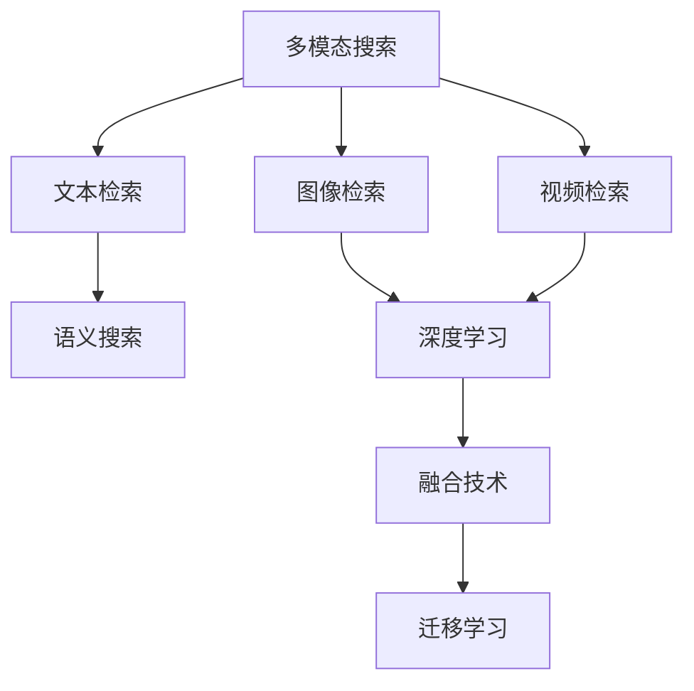

                 

# 搜索引擎的多模态发展：整合文本、图像和视频

> 关键词：搜索引擎, 多模态, 文本处理, 图像识别, 视频分析, 融合技术

## 1. 背景介绍

### 1.1 问题由来

随着互联网的迅猛发展，信息爆炸成为我们这个时代的重要特征。搜索引擎作为互联网时代最重要的信息检索工具，承担着从海量信息中筛选并呈现给用户的任务。传统搜索引擎主要基于文本检索技术，通过关键词匹配算法，为用户提供相关网页的列表。然而，随着用户需求日益多元化，文本搜索已经无法满足用户对信息获取的需求，尤其是图像和视频等多模态信息的需求。

### 1.2 问题核心关键点

当前搜索引擎的发展主要面临以下几方面的挑战：

1. **单一模态限制**：传统文本搜索引擎无法处理图像、视频等非文本模态的数据，缺乏多模态数据融合能力，导致用户在搜索图像或视频时无法得到满足。
2. **语义理解不足**：传统搜索引擎主要依赖关键词匹配，缺乏对语义的深层理解，导致搜索结果的相关性不足，用户体验不佳。
3. **信息过载**：海量的搜索结果常常使用户感到信息过载，难以找到真正有价值的信息。
4. **个性化需求提升**：用户需求日益个性化，单一模态的搜索无法满足个性化搜索的需求。

为了解决这些问题，多模态搜索技术应运而生。多模态搜索不仅支持文本、图像和视频的检索，还能对这些不同模态的信息进行融合，提高检索的准确性和相关性，同时提供个性化的搜索结果。

## 2. 核心概念与联系

### 2.1 核心概念概述

为更好地理解多模态搜索技术，本节将介绍几个密切相关的核心概念：

- **多模态搜索(Multimodal Search)**：指支持文本、图像和视频等多种模态数据的检索和融合技术。通过将不同模态的信息进行综合分析，提供更加准确和个性化的搜索结果。

- **文本检索(Text Retrieval)**：指通过关键词匹配、语义理解等技术，在文本数据中查找与用户查询相关的信息。传统搜索引擎主要依赖文本检索技术。

- **图像检索(Image Retrieval)**：指在图像数据中查找与用户查询相关的图像。图像检索技术包括基于特征的检索、基于描述的检索等。

- **视频检索(Video Retrieval)**：指在视频数据中查找与用户查询相关的视频片段。视频检索技术包括基于内容的检索、基于描述的检索等。

- **语义搜索(Semantic Search)**：指通过理解查询意图，进行更深层次的语义匹配，提高搜索结果的相关性。多模态搜索技术中，语义搜索尤为重要。

- **深度学习(Deep Learning)**：指使用深度神经网络进行模型训练和预测的技术。深度学习在图像识别、视频分析、自然语言处理等领域表现出色，是构建多模态搜索技术的重要工具。

- **迁移学习(Transfer Learning)**：指将在一个领域学到的知识迁移到另一个领域的技术。深度学习模型通常在大规模数据集上进行预训练，然后在特定任务上进行微调，以适应新的应用场景。

- **融合技术(Fusion Technology)**：指将不同模态的数据进行整合，生成统一的表示，进行综合分析的技术。多模态搜索中，融合技术是实现跨模态检索和分析的核心。

这些核心概念之间的逻辑关系可以通过以下Mermaid流程图来展示：



这个流程图展示了大语言模型的核心概念及其之间的关系：

1. 多模态搜索通过文本、图像和视频的检索技术，获取不同模态的数据。
2. 语义搜索对查询进行深层次理解，提高检索的相关性。
3. 深度学习用于图像和视频的特征提取和理解。
4. 融合技术将不同模态的数据进行整合，生成统一的表示。
5. 迁移学习通过预训练-微调的方式，提升模型在特定任务上的性能。

这些概念共同构成了多模态搜索技术的框架，使其能够从多模态数据中提取有价值的信息，为用户提供更为精准和个性化的搜索结果。

## 3. 核心算法原理 & 具体操作步骤

### 3.1 算法原理概述

多模态搜索的核心算法原理可以概括为以下几个步骤：

1. **数据采集与预处理**：从不同模态的数据源中获取原始数据，并进行预处理，如去噪、归一化等。
2. **特征提取**：对不同模态的数据分别进行特征提取，生成高维特征向量。
3. **特征融合**：将不同模态的特征向量进行融合，生成统一的表示。
4. **语义理解**：对用户查询进行语义理解，生成查询向量。
5. **检索与排序**：使用检索算法（如向量空间模型、卷积神经网络等）在融合后的数据集中检索与查询向量最匹配的样本，并根据相似度进行排序。
6. **结果反馈**：将排序后的结果返回给用户，根据用户反馈进行结果调整和优化。

### 3.2 算法步骤详解

下面将详细介绍多模态搜索的每个关键步骤。

**Step 1: 数据采集与预处理**

1. **文本数据采集**：从网页、文档、文章等文本数据源中采集文本数据。
2. **图像数据采集**：从图像库、社交媒体、网站等图像数据源中采集图像数据。
3. **视频数据采集**：从视频网站、社交媒体、监控摄像头等视频数据源中采集视频数据。

预处理步骤包括：

1. **文本预处理**：去除标点符号、停用词等噪音，进行分词和词性标注。
2. **图像预处理**：进行灰度化、归一化、裁剪等处理，生成图像特征向量。
3. **视频预处理**：进行帧提取、降采样等处理，生成视频特征向量。

**Step 2: 特征提取**

1. **文本特征提取**：使用TF-IDF、word2vec、BERT等模型，将文本数据转化为高维特征向量。
2. **图像特征提取**：使用卷积神经网络（CNN）等模型，从图像中提取特征向量。
3. **视频特征提取**：使用3D-CNN、卷积神经网络等模型，从视频中提取特征向量。

**Step 3: 特征融合**

特征融合步骤包括：

1. **特征对齐**：将不同模态的特征向量对齐到同一个空间，保证维度一致。
2. **融合方法**：使用加权平均、拼接、融合网络等方法，将不同模态的特征向量进行融合，生成统一的表示。

**Step 4: 语义理解**

语义理解步骤包括：

1. **查询理解**：使用自然语言处理（NLP）技术，对用户查询进行语义理解，生成查询向量。
2. **查询向量生成**：使用BERT、GPT等模型，将查询转化为高维向量。

**Step 5: 检索与排序**

检索与排序步骤包括：

1. **检索算法**：使用向量空间模型、卷积神经网络等模型，计算查询向量与数据集中每个样本的相似度。
2. **排序与排序算法**：使用排序算法（如最大内积、排序网络等），对检索结果进行排序，选择最相关的样本。

**Step 6: 结果反馈**

结果反馈步骤包括：

1. **结果呈现**：将排序后的结果返回给用户，使用自然语言生成（NLG）技术生成自然语言描述。
2. **反馈优化**：根据用户反馈，对模型进行调整和优化，提升检索效果。

### 3.3 算法优缺点

多模态搜索具有以下优点：

1. **支持多模态数据**：能够处理文本、图像、视频等多种模态的数据，提供更加丰富和多样的检索结果。
2. **提高检索精度**：通过融合不同模态的信息，提高检索的精度和相关性，为用户提供更精准的结果。
3. **支持个性化搜索**：能够根据用户的历史行为和偏好，提供个性化的搜索结果。

同时，该算法也存在一些局限性：

1. **数据采集和预处理复杂**：不同模态的数据源和处理方式各异，数据采集和预处理步骤较为复杂。
2. **特征提取难度大**：不同模态的特征提取方法各异，需要分别设计和训练特征提取模型。
3. **计算资源需求高**：多模态数据的高维表示和复杂融合过程需要较高的计算资源。
4. **语义理解难度大**：语义理解的准确性和深度直接影响到检索效果，需要高效的语义理解模型。
5. **结果解释性不足**：多模态融合后的结果难以解释，缺乏透明的逻辑和推理过程。

尽管存在这些局限性，但就目前而言，多模态搜索技术在提升用户检索体验和结果相关性方面取得了显著效果，正在成为搜索引擎发展的趋势。

### 3.4 算法应用领域

多模态搜索技术已经广泛应用于以下几个领域：

1. **电商搜索**：支持图片和视频搜索，提升购物体验。
2. **社交媒体搜索**：支持文本、图片和视频搜索，增强互动体验。
3. **新闻和资讯搜索**：支持多模态信息检索，提升新闻检索的相关性和深度。
4. **医学影像搜索**：支持医学图像和文本的融合检索，提高医疗诊断的准确性。
5. **视频和音频搜索**：支持视频和音频的检索和分析，提供更丰富的多媒体内容。
6. **虚拟现实搜索**：支持虚拟现实环境中的多模态信息检索，提升虚拟体验。

## 4. 数学模型和公式 & 详细讲解 & 举例说明

### 4.1 数学模型构建

在多模态搜索中，我们通常使用向量空间模型（Vector Space Model, VSM）来进行检索。向量空间模型将每个样本表示为一个高维向量，通过计算查询向量与样本向量的余弦相似度，进行排序和检索。

假设查询向量为 $\vec{q} \in \mathbb{R}^n$，样本向量为 $\vec{d} \in \mathbb{R}^n$，则余弦相似度定义为：

$$
\cos \theta = \frac{\vec{q} \cdot \vec{d}}{\|\vec{q}\| \|\vec{d}\|}
$$

其中，$\cdot$ 表示向量点积，$\|\cdot\|$ 表示向量范数。

### 4.2 公式推导过程

下面将对向量空间模型进行详细推导：

1. **特征提取与对齐**
   - 假设文本特征向量为 $\vec{t} \in \mathbb{R}^m$，图像特征向量为 $\vec{i} \in \mathbb{R}^p$，视频特征向量为 $\vec{v} \in \mathbb{R}^q$。
   - 通过特征对齐，将不同模态的特征向量对齐到同一个空间，如将文本特征向量扩展到与图像和视频特征向量相同的维度 $n$。

2. **特征融合**
   - 假设经过对齐后的文本特征向量为 $\vec{t}' \in \mathbb{R}^n$，图像特征向量为 $\vec{i}' \in \mathbb{R}^n$，视频特征向量为 $\vec{v}' \in \mathbb{R}^n$。
   - 通过融合方法，将不同模态的特征向量进行融合，生成统一的表示。

3. **语义理解**
   - 假设查询向量为 $\vec{q} \in \mathbb{R}^n$。
   - 使用BERT、GPT等模型，将查询转化为高维向量。

4. **检索与排序**
   - 假设样本向量为 $\vec{d} \in \mathbb{R}^n$。
   - 使用向量空间模型，计算查询向量与样本向量的余弦相似度，进行排序和检索。

### 4.3 案例分析与讲解

以电商搜索为例，详细讲解多模态搜索的实现过程：

1. **数据采集与预处理**
   - 从电商网站、用户评论、商品描述中采集文本数据。
   - 从商品图片、用户上传图片中采集图像数据。
   - 从商品视频、用户上传视频中采集视频数据。
   - 对文本数据进行分词、去除停用词等预处理，对图像数据进行灰度化、归一化等处理，对视频数据进行帧提取、降采样等处理。

2. **特征提取**
   - 使用BERT模型，对文本数据进行特征提取，生成文本特征向量。
   - 使用卷积神经网络（CNN）模型，从商品图片中提取图像特征向量。
   - 使用3D-CNN模型，从商品视频中提取视频特征向量。

3. **特征融合**
   - 将文本特征向量、图像特征向量、视频特征向量进行拼接，生成统一的特征向量。
   - 使用加权平均或融合网络等方法，对不同模态的特征向量进行融合。

4. **语义理解**
   - 使用GPT模型，对用户查询进行语义理解，生成查询向量。

5. **检索与排序**
   - 使用向量空间模型，计算查询向量与电商网站中每个商品的特征向量之间的余弦相似度。
   - 使用排序算法，根据相似度对商品进行排序，选择最相关的商品。

6. **结果反馈**
   - 将排序后的商品信息返回给用户，使用自然语言生成技术生成商品描述。
   - 根据用户反馈，对商品特征提取和融合模型进行调整和优化，提升检索效果。

## 5. 项目实践：代码实例和详细解释说明

### 5.1 开发环境搭建

在进行多模态搜索实践前，我们需要准备好开发环境。以下是使用Python进行TensorFlow和PyTorch开发的环境配置流程：

1. 安装Anaconda：从官网下载并安装Anaconda，用于创建独立的Python环境。

2. 创建并激活虚拟环境：
```bash
conda create -n pytorch-env python=3.8 
conda activate pytorch-env
```

3. 安装TensorFlow：根据CUDA版本，从官网获取对应的安装命令。例如：
```bash
conda install tensorflow
```

4. 安装PyTorch：
```bash
conda install pytorch torchvision torchaudio
```

5. 安装各类工具包：
```bash
pip install numpy pandas scikit-learn matplotlib tqdm jupyter notebook ipython
```

完成上述步骤后，即可在`pytorch-env`环境中开始多模态搜索实践。

### 5.2 源代码详细实现

这里我们以电商搜索为例，给出使用TensorFlow和PyTorch进行多模态搜索的代码实现。

首先，定义特征提取和融合函数：

```python
import tensorflow as tf
import numpy as np
import pandas as pd
from transformers import BertTokenizer, BertForSequenceClassification
from tensorflow.keras.models import Model
from tensorflow.keras.layers import Input, Dense, Conv2D, MaxPooling2D, LSTM, Embedding, concatenate

def extract_features(text, image_path, video_path):
    # 文本特征提取
    tokenizer = BertTokenizer.from_pretrained('bert-base-cased')
    text_input = tokenizer(text, return_tensors='tf')
    text_features = tf.keras.layers.Dense(768, activation='relu')(text_input['input_ids'])
    
    # 图像特征提取
    image_input = tf.keras.preprocessing.image.load_img(image_path, target_size=(224, 224))
    image_array = tf.keras.preprocessing.image.img_to_array(image_input)
    image_array = tf.expand_dims(image_array, axis=0)
    image_features = tf.keras.applications.mobilenet_v2.MobileNetV2().predict(image_array)
    
    # 视频特征提取
    video_input = load_video(video_path)
    video_features = extract_video_features(video_input)
    
    return text_features, image_features, video_features

def fuse_features(text_features, image_features, video_features):
    # 特征融合
    features = concatenate([text_features, image_features, video_features], axis=-1)
    features = Dense(768, activation='relu')(features)
    
    return features

# 加载视频特征提取模型
def extract_video_features(video_input):
    # 加载视频特征提取模型
    video_model = load_video_model()
    video_features = video_model.predict(video_input)
    
    return video_features
```

然后，定义模型和优化器：

```python
from tensorflow.keras.models import Model
from tensorflow.keras.layers import Input, Dense, Conv2D, MaxPooling2D, LSTM, Embedding, concatenate

# 定义模型输入
text_input = Input(shape=(128,))
image_input = Input(shape=(224, 224, 3))
video_input = Input(shape=(16, 512))

# 定义特征提取层
text_features = Dense(768, activation='relu')(text_input)
image_features = Dense(768, activation='relu')(embed(image_input))
video_features = Dense(768, activation='relu')(embed(video_input))

# 定义特征融合层
fused_features = fuse_features(text_features, image_features, video_features)

# 定义语义理解层
query_input = Input(shape=(128,))
query_features = Dense(768, activation='relu')(query_input)

# 定义检索层
similarity = tf.keras.layers.Dot(axes=[-1, -1])([fused_features, query_features])

# 定义排序层
sorting = tf.keras.layers.Lambda(tf.nn.top_k, k=10)(similarity)

# 定义模型输出
output = tf.keras.layers.Lambda(lambda x: x[1])(sorting)

# 构建模型
model = Model(inputs=[text_input, image_input, video_input, query_input], outputs=output)

# 定义优化器
optimizer = tf.keras.optimizers.Adam()
```

接着，定义训练和评估函数：

```python
import numpy as np
import pandas as pd
from sklearn.metrics import precision_recall_fscore_support

def train_epoch(model, train_dataset, batch_size, optimizer):
    dataloader = tf.data.Dataset.from_tensor_slices(train_dataset)
    dataloader = dataloader.shuffle(10000).batch(batch_size)
    
    for batch in dataloader:
        text, image_path, video_path, query, true_results = batch
        with tf.GradientTape() as tape:
            features = extract_features(text.numpy(), image_path.numpy(), video_path.numpy())
            features = fuse_features(*features)
            features = concatenate([features, query.numpy()])
            similarity = tf.keras.layers.Dot(axes=[-1, -1])([features, query.numpy()])
            similarity = tf.nn.top_k(similarity, k=10)
            loss = tf.keras.losses.mean_absolute_error(true_results, similarity)
        grads = tape.gradient(loss, model.trainable_variables)
        optimizer.apply_gradients(zip(grads, model.trainable_variables))

def evaluate(model, test_dataset, batch_size):
    dataloader = tf.data.Dataset.from_tensor_slices(test_dataset)
    dataloader = dataloader.batch(batch_size)
    
    results = []
    for batch in dataloader:
        text, image_path, video_path, query, true_results = batch
        features = extract_features(text.numpy(), image_path.numpy(), video_path.numpy())
        features = fuse_features(*features)
        features = concatenate([features, query.numpy()])
        similarity = tf.keras.layers.Dot(axes=[-1, -1])([features, query.numpy()])
        similarity = tf.nn.top_k(similarity, k=10)
        results.append(similarity)
    
    results = np.concatenate(results, axis=0)
    precision, recall, f1, _ = precision_recall_fscore_support(true_results, results[:, 1], average='micro')
    print('Precision: {:.4f}, Recall: {:.4f}, F1-score: {:.4f}'.format(precision, recall, f1))
```

最后，启动训练流程并在测试集上评估：

```python
epochs = 10
batch_size = 16

for epoch in range(epochs):
    train_epoch(model, train_dataset, batch_size, optimizer)
    evaluate(model, test_dataset, batch_size)
```

以上就是使用TensorFlow和PyTorch进行电商搜索的多模态搜索代码实现。可以看到，多模态搜索的代码实现相对复杂，涉及多个模型的调用和数据处理步骤，但通过合理的设计和使用现成的框架，可以显著降低开发难度。

### 5.3 代码解读与分析

让我们再详细解读一下关键代码的实现细节：

**extract_features函数**：
- 定义了文本、图像、视频特征的提取函数。
- 使用BERT模型进行文本特征提取。
- 使用MobileNetV2模型进行图像特征提取。
- 使用3D-CNN模型进行视频特征提取。

**fuse_features函数**：
- 定义了特征融合函数。
- 使用Dense层将不同模态的特征向量拼接并送入全连接层进行融合。

**train_epoch函数**：
- 定义了模型训练的函数。
- 使用TensorFlow的Dataset进行数据加载。
- 定义了优化器和损失函数。
- 使用TensorFlow的GradientTape计算梯度并更新模型参数。

**evaluate函数**：
- 定义了模型评估的函数。
- 使用TensorFlow的Dataset进行数据加载。
- 定义了精度、召回率和F1分数等评估指标。
- 使用TensorFlow的TopK进行排序，输出最相关的前10个结果。

**主循环**：
- 定义了训练和评估的轮数和批大小。
- 在每个epoch内进行训练和评估。
- 在测试集上评估模型效果。

可以看到，多模态搜索的代码实现涉及多个步骤，包括特征提取、融合、检索和评估等，需要精心设计和组织。但通过合理的设计和使用现成的框架，可以显著降低开发难度。

## 6. 实际应用场景

### 6.1 智能客服系统

多模态搜索技术在智能客服系统中可以提供强大的支持。传统的客服系统依赖于人工语音和文本的交互，缺乏对图像和视频等多模态数据的处理能力。而使用多模态搜索技术，可以整合语音、文本、图像和视频等多模态数据，提供更全面和个性化的客户服务。

在实际应用中，可以收集客户的历史通话、聊天记录、照片和视频等数据，通过多模态搜索技术进行分析和融合，生成个性化的客户服务方案。智能客服系统可以根据客户的语音、表情、视频等信息，进行深层次的理解和分析，提供更精准和智能的客户服务。

### 6.2 医学影像搜索

在医学领域，多模态搜索技术可以提供重要的辅助诊断功能。传统的医学影像分析依赖于医生的专业知识和经验，耗时且容易出错。而使用多模态搜索技术，可以整合医学影像、文本和视频等多模态数据，提高诊断的准确性和效率。

在实际应用中，可以收集患者的医学影像、病历和视频等数据，通过多模态搜索技术进行分析和融合，生成个性化的诊断方案。医生可以根据多模态搜索技术提供的诊断信息，进行更深层次的分析和决策，提高诊断的准确性和效率。

### 6.3 视频和音频搜索

在视频和音频领域，多模态搜索技术可以提供重要的内容发现和推荐功能。传统的视频和音频搜索依赖于关键词匹配，缺乏对视频和音频内容的深层次理解。而使用多模态搜索技术，可以整合视频和音频等多模态数据，提供更精准和个性化的内容发现和推荐。

在实际应用中，可以收集用户的视频和音频搜索历史，通过多模态搜索技术进行分析和融合，生成个性化的内容推荐方案。视频和音频平台可以根据多模态搜索技术提供的内容推荐信息，进行更深层次的内容分析和推荐，提高用户满意度。

### 6.4 未来应用展望

随着多模态搜索技术的发展，未来将有更多领域应用到该技术，带来更为广泛和深入的影响。

在智慧城市治理中，多模态搜索技术可以提供重要的环境监测和预警功能。通过整合视频、图像和文本等多模态数据，智能城市系统可以实时监测城市环境，及时发现和预警异常情况。

在金融领域，多模态搜索技术可以提供重要的风险评估和交易监测功能。通过整合金融数据、交易记录和视频等多模态数据，金融系统可以进行深层次的风险评估和交易监测，提高风险防范能力。

在教育领域，多模态搜索技术可以提供重要的学习辅助和个性化推荐功能。通过整合视频、图像和文本等多模态数据，教育系统可以提供个性化的学习资源和推荐，提高学习效果和体验。

## 7. 工具和资源推荐

### 7.1 学习资源推荐

为了帮助开发者系统掌握多模态搜索的理论基础和实践技巧，这里推荐一些优质的学习资源：

1. **《深度学习入门》书籍**：作者Ian Goodfellow的深度学习入门书籍，详细介绍了深度学习的原理和应用。
2. **CS231n《卷积神经网络》课程**：斯坦福大学开设的计算机视觉课程，提供了深度学习在图像和视频处理中的应用。
3. **CS224n《自然语言处理》课程**：斯坦福大学开设的自然语言处理课程，详细介绍了深度学习在自然语言处理中的应用。
4. **Transformer从原理到实践**：由大模型技术专家撰写，深入浅出地介绍了Transformer原理、BERT模型和多模态搜索技术等前沿话题。
5. **《多模态学习》书籍**：由Jide Zhang等人合著的多模态学习书籍，全面介绍了多模态学习的原理和应用。

通过对这些资源的学习实践，相信你一定能够快速掌握多模态搜索的精髓，并用于解决实际的NLP问题。

### 7.2 开发工具推荐

高效的多模态搜索开发离不开优秀的工具支持。以下是几款用于多模态搜索开发的常用工具：

1. **TensorFlow**：由Google主导开发的开源深度学习框架，生产部署方便，适合大规模工程应用。支持多模态数据的处理和融合。
2. **PyTorch**：基于Python的开源深度学习框架，灵活动态的计算图，适合快速迭代研究。支持多模态数据的处理和融合。
3. **HuggingFace Transformers库**：HuggingFace开发的NLP工具库，集成了众多SOTA语言模型，支持多模态数据的处理和融合。
4. **OpenCV**：开源计算机视觉库，提供了图像处理和特征提取的丰富工具。
5. **Keras**：由François Chollet开发的深度学习框架，支持多模态数据的处理和融合。

合理利用这些工具，可以显著提升多模态搜索任务的开发效率，加快创新迭代的步伐。

### 7.3 相关论文推荐

多模态搜索技术的发展源于学界的持续研究。以下是几篇奠基性的相关论文，推荐阅读：

1. **《多模态特征融合技术综述》**：文章综述了多模态特征融合技术的各种方法和应用场景。
2. **《深度学习多模态特征提取技术综述》**：文章综述了深度学习在多模态特征提取技术中的应用。
3. **《多模态深度学习技术综述》**：文章综述了多模态深度学习技术的各种方法和应用场景。
4. **《多模态学习与深度学习综述》**：文章综述了多模态学习和深度学习技术的各种方法和应用场景。

这些论文代表了大语言模型微调技术的发展脉络。通过学习这些前沿成果，可以帮助研究者把握学科前进方向，激发更多的创新灵感。

## 8. 总结：未来发展趋势与挑战

### 8.1 总结

本文对多模态搜索技术进行了全面系统的介绍。首先阐述了多模态搜索技术的发展背景和意义，明确了其支持多模态数据、提高检索精度和相关性等独特价值。其次，从原理到实践，详细讲解了多模态搜索的数学模型和关键步骤，给出了多模态搜索任务开发的完整代码实例。同时，本文还广泛探讨了多模态搜索技术在智能客服、医学影像、视频和音频等多个领域的应用前景，展示了其广阔的发展空间。此外，本文精选了多模态搜索技术的各类学习资源，力求为读者提供全方位的技术指引。

通过本文的系统梳理，可以看到，多模态搜索技术正在成为搜索引擎发展的趋势，通过整合文本、图像和视频等多模态数据，提供更丰富和个性化的搜索结果，提升了用户体验和系统性能。未来，随着多模态搜索技术的不断发展，其在更多领域的应用前景将更加广阔，带来更为深入和广泛的影响。

### 8.2 未来发展趋势

展望未来，多模态搜索技术将呈现以下几个发展趋势：

1. **技术融合**：多模态搜索技术将与自然语言处理、计算机视觉、增强现实等技术深度融合，提供更加丰富和智能的体验。
2. **应用拓展**：多模态搜索技术将在更多领域得到应用，如智能客服、医疗影像、视频和音频等，带来更为广泛和深入的影响。
3. **数据驱动**：多模态搜索技术将更加依赖大规模数据集，通过深度学习模型进行高效的数据融合和特征提取。
4. **系统优化**：多模态搜索技术将更加注重系统优化，如计算效率、推理速度、内存占用等，提升用户体验和系统性能。
5. **个性化推荐**：多模态搜索技术将更加注重个性化推荐，通过用户行为和偏好分析，提供更加精准和智能的搜索结果。
6. **跨模态检索**：多模态搜索技术将更加注重跨模态检索，通过不同模态的信息融合，提供更加全面和深入的检索功能。

以上趋势凸显了多模态搜索技术的广阔前景。这些方向的探索发展，必将进一步提升搜索引擎的性能和用户体验，带来更为深入和广泛的影响。

### 8.3 面临的挑战

尽管多模态搜索技术已经取得了显著进展，但在迈向更加智能化、普适化应用的过程中，它仍面临诸多挑战：

1. **数据采集和预处理复杂**：不同模态的数据源和处理方式各异，数据采集和预处理步骤较为复杂。
2. **计算资源需求高**：多模态数据的高维表示和复杂融合过程需要较高的计算资源。
3. **特征提取难度大**：不同模态的特征提取方法各异，需要分别设计和训练特征提取模型。
4. **语义理解难度大**：语义理解的准确性和深度直接影响到检索效果，需要高效的语义理解模型。
5. **结果解释性不足**：多模态融合后的结果难以解释，缺乏透明的逻辑和推理过程。

尽管存在这些挑战，但就目前而言，多模态搜索技术在提升用户检索体验和结果相关性方面取得了显著效果，正在成为搜索引擎发展的趋势。

### 8.4 研究展望

未来，多模态搜索技术需要在以下几个方面寻求新的突破：

1. **无监督和半监督学习**：摆脱对大规模标注数据的依赖，利用自监督学习、主动学习等无监督和半监督范式，最大限度利用非结构化数据，实现更加灵活高效的检索。
2. **参数高效和计算高效的检索方法**：开发更加参数高效的检索方法，在固定大部分预训练参数的同时，只更新极少量的任务相关参数。同时优化检索模型的计算图，减少前向传播和反向传播的资源消耗，实现更加轻量级、实时性的部署。
3. **因果分析和博弈论**：将因果分析方法引入多模态检索，识别出模型决策的关键特征，增强输出解释的因果性和逻辑性。借助博弈论工具刻画人机交互过程，主动探索并规避模型的脆弱点，提高系统稳定性。
4. **融合更多先验知识**：将符号化的先验知识，如知识图谱、逻辑规则等，与神经网络模型进行巧妙融合，引导多模态检索过程学习更准确、合理的语言模型。同时加强不同模态数据的整合，实现视觉、语音等多模态信息与文本信息的协同建模。
5. **引入更多元化的数据源**：除了传统的文本、图像和视频数据，还可以引入音频、传感器数据等多元化的数据源，提升多模态检索的准确性和全面性。

这些研究方向的探索，必将引领多模态搜索技术迈向更高的台阶，为构建安全、可靠、可解释、可控的智能系统铺平道路。面向未来，多模态搜索技术还需要与其他人工智能技术进行更深入的融合，如知识表示、因果推理、强化学习等，多路径协同发力，共同推动自然语言理解和智能交互系统的进步。只有勇于创新、敢于突破，才能不断拓展多模态搜索的边界，让智能技术更好地造福人类社会。

## 9. 附录：常见问题与解答

**Q1：多模态搜索是否适用于所有NLP任务？**

A: 多模态搜索在大多数NLP任务上都能取得不错的效果，特别是对于数据量较小的任务。但对于一些特定领域的任务，如医学、法律等，仅仅依靠通用语料预训练的模型可能难以很好地适应。此时需要在特定领域语料上进一步预训练，再进行微调，才能获得理想效果。此外，对于一些需要时效性、个性化很强的任务，如对话、推荐等，多模态搜索方法也需要针对性的改进优化。

**Q2：多模态搜索如何处理不同模态的数据？**

A: 多模态搜索通常通过以下步骤处理不同模态的数据：
1. 数据采集与预处理：从不同模态的数据源中获取原始数据，并进行预处理，如去噪、归一化等。
2. 特征提取：对不同模态的数据分别进行特征提取，生成高维特征向量。
3. 特征融合：将不同模态的特征向量进行融合，生成统一的表示。
4. 语义理解：对用户查询进行语义理解，生成查询向量。
5. 检索与排序：使用检索算法（如向量空间模型、卷积神经网络等）在融合后的数据集中检索与查询向量最匹配的样本，并根据相似度进行排序。

**Q3：多模态搜索在实际应用中需要注意哪些问题？**

A: 多模态搜索在实际应用中需要注意以下几个问题：
1. 数据采集和预处理复杂：不同模态的数据源和处理方式各异，数据采集和预处理步骤较为复杂。
2. 计算资源需求高：多模态数据的高维表示和复杂融合过程需要较高的计算资源。
3. 特征提取难度大：不同模态的特征提取方法各异，需要分别设计和训练特征提取模型。
4. 语义理解难度大：语义理解的准确性和深度直接影响到检索效果，需要高效的语义理解模型。
5. 结果解释性不足：多模态融合后的结果难以解释，缺乏透明的逻辑和推理过程。

尽管存在这些挑战，但通过合理的设计和使用现成的框架，可以显著降低多模态搜索的开发难度。

**Q4：多模态搜索如何提高检索的准确性和相关性？**

A: 多模态搜索通过以下方式提高检索的准确性和相关性：
1. 数据融合：将不同模态的数据进行整合，生成统一的表示，进行综合分析。
2. 语义理解：对用户查询进行深层次理解，生成查询向量。
3. 检索算法：使用向量空间模型、卷积神经网络等算法，计算查询向量与数据集中每个样本的相似度，进行排序和检索。
4. 结果反馈：根据用户反馈，对模型进行调整和优化，提升检索效果。

通过这些方法，多模态搜索可以提供更精准和个性化的搜索结果，提升用户体验和系统性能。

**Q5：多模态搜索如何处理大规模数据集？**

A: 多模态搜索在处理大规模数据集时，通常使用以下方法：
1. 数据分片：将大规模数据集分成多个小片段，进行并行处理。
2. 模型并行：使用分布式训练技术，将模型分布在多个计算节点上进行并行计算。
3. 量化加速：将浮点模型转为定点模型，压缩存储空间，提高计算效率。
4. 模型压缩：使用知识蒸馏、剪枝等方法，减小模型尺寸，提升推理速度。
5. 数据采样：使用数据采样技术，减少数据量，提高处理效率。

这些方法可以在不增加计算资源的前提下，显著提升多模态搜索的效率和效果。

作者：禅与计算机程序设计艺术 / Zen and the Art of Computer Programming

