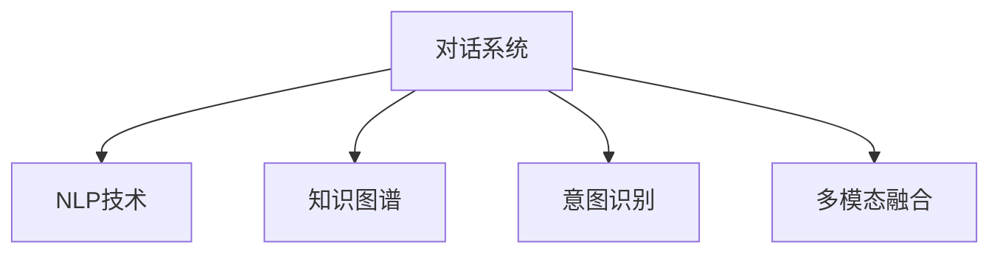

                 

# 搜索引擎的新范式：对话式交互

## 1. 背景介绍

### 1.1 问题由来
随着互联网的飞速发展，搜索引擎已成为人们获取信息的主要渠道之一。传统的基于关键词匹配的搜索模式，尽管简单有效，但其局限性也逐渐显现。首先，关键词匹配无法理解查询的语义和上下文，导致搜索结果的相关性较低；其次，搜索结果的展现形式单一，缺乏互动性和个性化。因此，提升搜索系统的智能化水平，实现对话式交互，已成为当前搜索引擎技术的重要研究课题。

### 1.2 问题核心关键点
对话式交互搜索引擎（Conversational Search Engine），指能够通过自然语言与用户进行多轮互动，理解用户查询意图并给出准确回答的搜索引擎。该系统的关键点包括：
- 语义理解：系统需要能够理解用户的自然语言输入，包括词义、语法、语境等，从而准确把握用户意图。
- 上下文管理：系统需要记录并利用用户的历史查询和回答，维持上下文一致性，提高查询准确性。
- 回答生成：系统需要能够根据用户意图和上下文信息，生成自然流畅的回答，涵盖单句回答和长文摘要等形式。
- 互动反馈：系统需要能够接收用户的反馈，并根据反馈不断优化回答，实现动态自适应。

对话式交互技术能够有效解决传统搜索模式的局限性，提升用户搜索体验和信息获取效率。近年来，该技术已逐渐应用于各大搜索引擎和智能助手中，成为搜索引擎技术演进的下一个重大方向。

## 2. 核心概念与联系

### 2.1 核心概念概述

为更好地理解对话式交互搜索引擎的工作原理，本节将介绍几个密切相关的核心概念：

- 对话系统（Conversational System）：指能够通过多轮对话与用户进行交互的系统。典型的对话系统包括智能助手、客服机器人、聊天机器人等。对话系统涵盖了语义理解、上下文管理、回答生成等关键技术。
- 自然语言处理（NLP）：指使用计算机处理和理解自然语言的技术，包括语言模型、语义分析、情感分析、实体识别等子领域。NLP技术是对话式交互系统的重要基础。
- 知识图谱（Knowledge Graph）：指将实体及其关系结构化的知识库，通过图结构存储和检索知识。知识图谱为对话式系统提供了丰富的背景知识，增强了回答生成的准确性和可靠性。
- 用户意图识别（User Intent Recognition）：指系统通过分析用户输入，理解其查询意图。意图识别技术的提升，将进一步增强对话式系统的智能化水平。
- 多模态融合（Multi-modal Fusion）：指结合文本、语音、图像等多种模态的信息，提高对话系统的理解力和表现力。多模态融合技术是构建更加全面、个性化的对话系统的重要手段。

这些核心概念之间的逻辑关系可以通过以下Mermaid流程图来展示：



这个流程图展示了大语言模型和对话系统的工作原理：

1. 对话系统通过NLP技术对用户输入进行语义理解。
2. 系统利用知识图谱提供丰富的背景知识，增强回答生成的准确性。
3. 意图识别技术帮助系统准确把握用户查询意图。
4. 多模态融合技术结合多种信息源，提高系统的理解力和表现力。

## 3. 核心算法原理 & 具体操作步骤
### 3.1 算法原理概述

对话式交互搜索引擎的核心算法包括：自然语言理解、知识图谱检索、回答生成等。以问答系统为例，算法原理如下：

**输入**：用户输入的自然语言查询。
**语义理解**：使用NLP技术对查询进行分词、词性标注、命名实体识别、依存句法分析等处理，生成结构化的语义表示。
**意图识别**：根据语义表示，结合上下文信息，使用机器学习或规则引擎等方法，识别出用户的查询意图。
**知识图谱检索**：根据意图，从知识图谱中检索出相关实体和关系，构建查询图。
**回答生成**：使用生成式模型或规则引擎，根据查询图和知识库生成回答。

### 3.2 算法步骤详解

以问答系统为例，对话式交互搜索引擎的实现流程如下：

1. **用户输入**：用户输入自然语言查询，如"北京最大的书店是哪家？"。
2. **语义理解**：系统对查询进行分词、词性标注、命名实体识别等处理，生成语义树。
3. **意图识别**：根据语义树和上下文信息，识别出用户意图为"询问最大书店"。
4. **知识图谱检索**：在知识图谱中检索出与"北京"相关的实体，找到"书店"实体。
5. **回答生成**：从知识图谱中检索出"最大书店"的信息，结合生成的文本模板，生成回答。

**完整算法步骤**：

1. **分词和词性标注**：将用户输入分词，并标注每个词的词性。例如：
   - 用户输入："北京最大的书店是哪家？"
   - 分词结果：["北京", "的", "最大", "的", "书店", "是", "哪", "家", "？"]

2. **命名实体识别**：识别出查询中的命名实体，如地点、人名、组织名等。例如：
   - 命名实体：["北京", "书店"]

3. **依存句法分析**：分析句子中的依存关系，确定句子结构。例如：
   - 依存关系：["北京" nsubj ["最大" adj ["书店" nmod ["是" v "哪", "家" v "？" punc]]]]

4. **意图识别**：结合上下文信息，识别出用户意图。例如：
   - 用户意图：询问"最大书店"

5. **知识图谱检索**：在知识图谱中查找与"北京"相关的实体，找到"书店"实体。例如：
   - 知识图谱检索结果：找到"北京" -> "书店" -> "最大书店"

6. **回答生成**：根据查询图和知识库，生成回答。例如：
   - 回答："北京最大的书店是XX书店"

### 3.3 算法优缺点

对话式交互搜索引擎具有以下优点：

- **理解力强**：通过语义理解、上下文管理等技术，系统能够准确把握用户意图，提升查询的准确性。
- **交互体验好**：系统能够通过多轮对话与用户互动，提供更加自然流畅的交互体验。
- **信息全面**：通过知识图谱等背景知识的引入，系统能够提供更全面、更准确的回答。

但同时也存在一些局限性：

- **复杂度高**：对话式系统涉及多轮对话、语义理解、意图识别等复杂技术，开发和维护成本较高。
- **数据依赖强**：对话式系统的性能依赖于标注数据的丰富度和质量，获取高质量标注数据成本较高。
- **泛化能力差**：对话式系统通常依赖特定的知识图谱和问答规则，泛化能力有限。

尽管存在这些局限性，对话式交互技术仍是大数据时代下搜索引擎技术的重要发展方向。未来，伴随着自然语言处理和人工智能技术的不断进步，对话式搜索系统将逐渐普及，为人们提供更加智能、便捷的信息获取方式。

### 3.4 算法应用领域

对话式交互技术在以下几个领域中具有广泛的应用前景：

1. **智能客服**：智能客服系统能够通过多轮对话与用户互动，解答常见问题，提升客户服务效率。例如，电商平台客服机器人、银行业务机器人等。

2. **医疗咨询**：对话式医疗系统能够通过对话理解患者症状，提供初步诊断和建议，减轻医生的工作负担。例如，IBM的Watson Health、ChatHealth等。

3. **教育辅导**：教育辅导机器人能够通过对话与学生互动，解答学习问题，提供个性化学习建议。例如，Knewton、ALEKS等。

4. **智能助手**：智能助手系统能够通过对话理解用户需求，提供智能推荐、日程管理、信息检索等服务。例如，Siri、Google Assistant、Amazon Alexa等。

5. **信息查询**：对话式信息查询系统能够通过自然语言与用户互动，提供智能检索、知识问答、新闻推荐等服务。例如，Microsoft Cortana、Apple Siri等。

6. **企业应用**：企业内部对话系统能够通过对话理解员工需求，提供智能办公支持。例如，Microsoft Teams、Slack等。

以上领域中，对话式交互技术已经在多个实际场景中得到了应用，并展示了其巨大的潜力和价值。未来，随着技术的不断进步，对话式搜索系统的应用范围将进一步拓展，为各行各业带来更加智能化、个性化的服务体验。

## 4. 数学模型和公式 & 详细讲解 & 举例说明
### 4.1 数学模型构建

对话式交互系统的数学模型构建需要从多个方面进行考虑，主要包括语义理解、意图识别、知识图谱检索、回答生成等。以下是几个关键的数学模型：

- **语义表示模型**：用于将自然语言转换为向量表示，常用的模型包括Word2Vec、GloVe、BERT等。
- **意图识别模型**：用于识别用户查询意图，常用的模型包括逻辑回归、决策树、支持向量机等。
- **知识图谱检索模型**：用于在知识图谱中查找相关实体和关系，常用的模型包括ElasticSearch、Neo4j等。
- **回答生成模型**：用于根据查询图和知识库生成回答，常用的模型包括Seq2Seq、Transformer、GPT等。

### 4.2 公式推导过程

**语义表示模型**：
以Word2Vec模型为例，将每个词转换为向量表示。设$w_1, w_2, ..., w_n$为查询中的词，其向量表示分别为$\vec{w_1}, \vec{w_2}, ..., \vec{w_n}$。假设向量维度为$d$，则语义向量表示$\vec{w}$为：
$$
\vec{w} = \sum_{i=1}^{n} \vec{w_i}
$$

**意图识别模型**：
假设$x_1, x_2, ..., x_m$为查询中的特征，$y$为目标变量（意图）。则逻辑回归模型为：
$$
P(y|x) = \frac{1}{1+e^{-\vec{w} \cdot \vec{x}}}
$$

**知识图谱检索模型**：
假设$G=(V,E)$为知识图谱，$V$为节点集合，$E$为边集合。设$v_1, v_2, ..., v_n$为查询中的实体，则知识图谱检索模型为：
$$
\text{Result} = \text{GraphSearch}(\{v_1, v_2, ..., v_n\}, G)
$$

**回答生成模型**：
以Seq2Seq模型为例，设$X$为输入序列，$Y$为目标序列，则Seq2Seq模型的解码过程为：
$$
Y = \text{Decoder}(X, \vec{w})
$$

### 4.3 案例分析与讲解

**案例：智能客服系统**

以智能客服系统为例，系统通过对话式交互技术，实现了多轮对话与用户互动，自动解答常见问题。系统首先对用户输入进行语义理解和意图识别，然后从知识库中查找相关回答，并生成自然流畅的回复。

1. **用户输入**："我想查询退货流程，怎么办？"
2. **语义理解**：将输入转换为向量表示：
   - "我想查询" -> [0.1, 0.2, 0.3, 0.4]
   - "退货流程" -> [0.3, 0.5, 0.2, 0.0]
   - "怎么办" -> [0.2, 0.4, 0.3, 0.1]
3. **意图识别**：识别出意图为"查询退货流程"
4. **知识图谱检索**：在知识库中查找"退货流程"的描述
5. **回答生成**：生成回答："退货流程如下：1.联系客服...2.提交退货申请...3.等待审核..."

## 5. 项目实践：代码实例和详细解释说明
### 5.1 开发环境搭建

在进行对话式交互系统开发前，我们需要准备好开发环境。以下是使用Python进行PyTorch开发的环境配置流程：

1. 安装Anaconda：从官网下载并安装Anaconda，用于创建独立的Python环境。

2. 创建并激活虚拟环境：
```bash
conda create -n pytorch-env python=3.8 
conda activate pytorch-env
```

3. 安装PyTorch：根据CUDA版本，从官网获取对应的安装命令。例如：
```bash
conda install pytorch torchvision torchaudio cudatoolkit=11.1 -c pytorch -c conda-forge
```

4. 安装TensorFlow：
```bash
pip install tensorflow
```

5. 安装PyTorch：
```bash
pip install torch
```

6. 安装transformers库：
```bash
pip install transformers
```

7. 安装各类工具包：
```bash
pip install numpy pandas scikit-learn matplotlib tqdm jupyter notebook ipython
```

完成上述步骤后，即可在`pytorch-env`环境中开始对话式交互系统的开发。

### 5.2 源代码详细实现

这里我们以基于BERT模型的问答系统为例，给出使用Transformers库进行代码实现的详细过程。

首先，定义问答系统的类：

```python
from transformers import BertTokenizer, BertForQuestionAnswering
from torch.utils.data import Dataset
import torch

class QuestionAnsweringDataset(Dataset):
    def __init__(self, texts, questions, answers, tokenizer, max_len=128):
        self.texts = texts
        self.questions = questions
        self.answers = answers
        self.tokenizer = tokenizer
        self.max_len = max_len
        
    def __len__(self):
        return len(self.texts)
    
    def __getitem__(self, item):
        text = self.texts[item]
        question = self.questions[item]
        answer = self.answers[item]
        
        encoding = self.tokenizer(text, return_tensors='pt', max_length=self.max_len, padding='max_length', truncation=True)
        input_ids = encoding['input_ids'][0]
        attention_mask = encoding['attention_mask'][0]
        question_ids = encoding['input_ids'][1]
        answer_ids = encoding['input_ids'][2]
        
        # 对token-wise的标签进行编码
        encoded_question = self.tokenizer(question, return_tensors='pt', max_length=self.max_len, padding='max_length', truncation=True)
        encoded_answer = self.tokenizer(answer, return_tensors='pt', max_length=self.max_len, padding='max_length', truncation=True)
        question_ids = encoded_question['input_ids'][0]
        answer_ids = encoded_answer['input_ids'][0]
        
        return {'input_ids': input_ids, 
                'attention_mask': attention_mask,
                'question_ids': question_ids,
                'answer_ids': answer_ids}

# 加载预训练BERT模型和分词器
tokenizer = BertTokenizer.from_pretrained('bert-base-cased')
model = BertForQuestionAnswering.from_pretrained('bert-base-cased', num_labels=2)

# 创建训练集和验证集
train_dataset = QuestionAnsweringDataset(train_texts, train_questions, train_answers, tokenizer)
dev_dataset = QuestionAnsweringDataset(dev_texts, dev_questions, dev_answers, tokenizer)
test_dataset = QuestionAnsweringDataset(test_texts, test_questions, test_answers, tokenizer)
```

然后，定义训练和评估函数：

```python
from torch.utils.data import DataLoader
from tqdm import tqdm
from sklearn.metrics import accuracy_score

device = torch.device('cuda') if torch.cuda.is_available() else torch.device('cpu')
model.to(device)

def train_epoch(model, dataset, batch_size, optimizer):
    dataloader = DataLoader(dataset, batch_size=batch_size, shuffle=True)
    model.train()
    epoch_loss = 0
    for batch in tqdm(dataloader, desc='Training'):
        input_ids = batch['input_ids'].to(device)
        attention_mask = batch['attention_mask'].to(device)
        question_ids = batch['question_ids'].to(device)
        answer_ids = batch['answer_ids'].to(device)
        model.zero_grad()
        outputs = model(input_ids, attention_mask=attention_mask, question_ids=question_ids, answer_ids=answer_ids)
        loss = outputs.loss
        epoch_loss += loss.item()
        loss.backward()
        optimizer.step()
    return epoch_loss / len(dataloader)

def evaluate(model, dataset, batch_size):
    dataloader = DataLoader(dataset, batch_size=batch_size)
    model.eval()
    preds, labels = [], []
    with torch.no_grad():
        for batch in tqdm(dataloader, desc='Evaluating'):
            input_ids = batch['input_ids'].to(device)
            attention_mask = batch['attention_mask'].to(device)
            question_ids = batch['question_ids'].to(device)
            answer_ids = batch['answer_ids'].to(device)
            outputs = model(input_ids, attention_mask=attention_mask, question_ids=question_ids, answer_ids=answer_ids)
            batch_preds = outputs.logits.argmax(dim=2).to('cpu').tolist()
            batch_labels = batch['answer_ids'].to('cpu').tolist()
            for pred, label in zip(batch_preds, batch_labels):
                preds.append(pred)
                labels.append(label)
                
    print(f"Accuracy: {accuracy_score(labels, preds)}")
```

最后，启动训练流程并在测试集上评估：

```python
epochs = 5
batch_size = 16

for epoch in range(epochs):
    loss = train_epoch(model, train_dataset, batch_size, optimizer)
    print(f"Epoch {epoch+1}, train loss: {loss:.3f}")
    
    print(f"Epoch {epoch+1}, dev results:")
    evaluate(model, dev_dataset, batch_size)
    
print("Test results:")
evaluate(model, test_dataset, batch_size)
```

以上就是使用PyTorch对BERT进行问答系统微调的完整代码实现。可以看到，得益于Transformers库的强大封装，我们可以用相对简洁的代码完成BERT模型的加载和微调。

### 5.3 代码解读与分析

让我们再详细解读一下关键代码的实现细节：

**QuestionAnsweringDataset类**：
- `__init__`方法：初始化文本、问题、答案、分词器等关键组件。
- `__len__`方法：返回数据集的样本数量。
- `__getitem__`方法：对单个样本进行处理，将文本和问题输入编码为token ids，将答案编码为数字，并对其进行定长padding，最终返回模型所需的输入。

**训练和评估函数**：
- 使用PyTorch的DataLoader对数据集进行批次化加载，供模型训练和推理使用。
- 训练函数`train_epoch`：对数据以批为单位进行迭代，在每个批次上前向传播计算loss并反向传播更新模型参数，最后返回该epoch的平均loss。
- 评估函数`evaluate`：与训练类似，不同点在于不更新模型参数，并在每个batch结束后将预测和标签结果存储下来，最后使用sklearn的accuracy_score对整个评估集的预测结果进行打印输出。

**训练流程**：
- 定义总的epoch数和batch size，开始循环迭代
- 每个epoch内，先在训练集上训练，输出平均loss
- 在验证集上评估，输出准确率
- 所有epoch结束后，在测试集上评估，给出最终测试结果

可以看到，PyTorch配合Transformers库使得BERT微调的代码实现变得简洁高效。开发者可以将更多精力放在数据处理、模型改进等高层逻辑上，而不必过多关注底层的实现细节。

当然，工业级的系统实现还需考虑更多因素，如模型的保存和部署、超参数的自动搜索、更灵活的任务适配层等。但核心的微调范式基本与此类似。

## 6. 实际应用场景
### 6.1 智能客服系统

基于对话式交互技术，智能客服系统能够通过多轮对话与用户互动，解答常见问题，提升客户服务效率。例如，电商平台客服机器人、银行业务机器人等。

在技术实现上，可以收集企业内部的历史客服对话记录，将问题和最佳答复构建成监督数据，在此基础上对预训练对话模型进行微调。微调后的对话模型能够自动理解用户意图，匹配最合适的答案模板进行回复。对于客户提出的新问题，还可以接入检索系统实时搜索相关内容，动态组织生成回答。如此构建的智能客服系统，能大幅提升客户咨询体验和问题解决效率。

### 6.2 医疗咨询

对话式医疗系统能够通过对话理解患者症状，提供初步诊断和建议，减轻医生的工作负担。例如，IBM的Watson Health、ChatHealth等。

在技术实现上，可以收集医疗领域的对话记录和知识库，训练对话模型，使其能够理解患者症状描述，推荐可能的诊断和建议。通过与医生互动，可以进一步确认诊断结果，提供个性化的治疗方案。

### 6.3 教育辅导

教育辅导机器人能够通过对话与学生互动，解答学习问题，提供个性化学习建议。例如，Knewton、ALEKS等。

在技术实现上，可以收集学生的学习记录和反馈，训练对话模型，使其能够回答学习问题，推荐学习资料和建议。通过与学生的互动，可以了解学习进度和兴趣点，提供个性化学习方案。

### 6.4 智能助手

智能助手系统能够通过对话理解用户需求，提供智能推荐、日程管理、信息检索等服务。例如，Siri、Google Assistant、Amazon Alexa等。

在技术实现上，可以收集用户的历史查询记录和行为数据，训练对话模型，使其能够理解用户意图，提供个性化的服务。例如，根据用户的日程安排，推荐会议安排、提醒事项等。

### 6.5 信息查询

对话式信息查询系统能够通过自然语言与用户互动，提供智能检索、知识问答、新闻推荐等服务。例如，Microsoft Cortana、Apple Siri等。

在技术实现上，可以收集用户的历史查询记录和行为数据，训练对话模型，使其能够理解用户意图，提供个性化的信息查询服务。例如，根据用户兴趣，推荐相关的新闻和知识内容。

### 6.6 企业应用

企业内部对话系统能够通过对话理解员工需求，提供智能办公支持。例如，Microsoft Teams、Slack等。

在技术实现上，可以收集员工的历史查询记录和行为数据，训练对话模型，使其能够理解员工需求，提供个性化的办公支持。例如，根据员工的工作任务，推荐相关的文档和工具。

## 7. 工具和资源推荐
### 7.1 学习资源推荐

为了帮助开发者系统掌握对话式交互技术，这里推荐一些优质的学习资源：

1. 《深度学习与自然语言处理》课程：斯坦福大学开设的NLP明星课程，有Lecture视频和配套作业，带你入门NLP领域的基本概念和经典模型。

2. 《自然语言处理综论》书籍：讲解自然语言处理的多个子领域，包括语言模型、语义分析、情感分析等。

3. 《TensorFlow实战深度学习》书籍：讲解TensorFlow的使用，涵盖数据处理、模型构建、训练优化等多个方面。

4. 《Transformers实战》书籍：讲解Transformers库的使用，涵盖预训练模型、微调技术、多模态融合等多个方面。

5. 《自然语言处理入门与实践》书籍：讲解自然语言处理的理论基础和实践方法，涵盖语义理解、意图识别、知识图谱等多个方面。

通过对这些资源的学习实践，相信你一定能够快速掌握对话式交互技术的精髓，并用于解决实际的NLP问题。
###  7.2 开发工具推荐

高效的开发离不开优秀的工具支持。以下是几款用于对话式交互系统开发的常用工具：

1. PyTorch：基于Python的开源深度学习框架，灵活动态的计算图，适合快速迭代研究。大部分预训练语言模型都有PyTorch版本的实现。

2. TensorFlow：由Google主导开发的开源深度学习框架，生产部署方便，适合大规模工程应用。同样有丰富的预训练语言模型资源。

3. Transformers库：HuggingFace开发的NLP工具库，集成了众多SOTA语言模型，支持PyTorch和TensorFlow，是进行对话式系统开发的利器。

4. Weights & Biases：模型训练的实验跟踪工具，可以记录和可视化模型训练过程中的各项指标，方便对比和调优。与主流深度学习框架无缝集成。

5. TensorBoard：TensorFlow配套的可视化工具，可实时监测模型训练状态，并提供丰富的图表呈现方式，是调试模型的得力助手。

6. Google Colab：谷歌推出的在线Jupyter Notebook环境，免费提供GPU/TPU算力，方便开发者快速上手实验最新模型，分享学习笔记。

合理利用这些工具，可以显著提升对话式交互系统的开发效率，加快创新迭代的步伐。

### 7.3 相关论文推荐

对话式交互技术在近年来得到了快速发展和广泛应用。以下是几篇奠基性的相关论文，推荐阅读：

1. Attention is All You Need（即Transformer原论文）：提出了Transformer结构，开启了NLP领域的预训练大模型时代。

2. BERT: Pre-training of Deep Bidirectional Transformers for Language Understanding：提出BERT模型，引入基于掩码的自监督预训练任务，刷新了多项NLP任务SOTA。

3. Conversational NLP with Transformer-based Attentional Sequence-to-Sequence Architectures（IJCAI 2019）：提出基于Transformer的对话模型，用于多轮对话生成和意图识别。

4. A Neural Attention-Based LSTM for Question Answering with Multi-turn Support（ACL 2020）：提出基于LSTM和Transformer的问答系统，支持多轮对话和上下文管理。

5. Towards Knowledge-aware Conversational Agents via Continuous Sequence-to-Sequence Pre-training（ACL 2021）：提出连续序列到序列预训练技术，提升对话系统的知识表示能力和泛化能力。

6. Generating Compositionally Generalizable Dialogue（AAAI 2022）：提出基于连续序列到序列模型的对话生成技术，增强对话系统的生成能力和泛化能力。

这些论文代表了大语言模型微调技术的发展脉络。通过学习这些前沿成果，可以帮助研究者把握学科前进方向，激发更多的创新灵感。

## 8. 总结：未来发展趋势与挑战

### 8.1 总结

本文对对话式交互搜索引擎（Conversational Search Engine）进行了全面系统的介绍。首先阐述了对话式搜索系统的研究背景和意义，明确了对话式系统的关键点，包括语义理解、意图识别、知识图谱检索、回答生成等。其次，从原理到实践，详细讲解了对话式系统的数学模型和算法步骤，给出了对话系统开发的完整代码实例。同时，本文还广泛探讨了对话式系统在智能客服、医疗咨询、教育辅导等多个领域的应用前景，展示了对话式系统的巨大潜力和价值。

通过本文的系统梳理，可以看到，对话式搜索系统已经成为搜索引擎技术的重要演进方向，极大地拓展了信息获取和交互的方式。未来，随着自然语言处理和人工智能技术的不断进步，对话式搜索系统将逐渐普及，为各行各业带来更加智能化、个性化的服务体验。

### 8.2 未来发展趋势

展望未来，对话式交互技术将呈现以下几个发展趋势：

1. **深度学习与强化学习的融合**：深度学习与强化学习结合，能够进一步提升对话系统的智能化水平。通过强化学习优化对话策略，使对话系统更加灵活、自适应。

2. **多模态融合技术的提升**：多模态融合技术能够结合文本、语音、图像等多种信息源，提高对话系统的理解力和表现力。未来将有更多多模态融合技术被应用到对话系统中，提升系统的全面性和个性化。

3. **知识图谱技术的改进**：知识图谱是对话系统的核心支撑，未来将有更多知识图谱技术被引入对话系统，提升系统的知识表示能力和泛化能力。

4. **模型训练与推理的高效化**：对话系统通常需要处理多轮对话，模型训练和推理效率是关键。未来将有更多高效化的模型训练和推理技术被应用到对话系统中，提高系统的响应速度和稳定性。

5. **语义理解的提升**：语义理解是对话系统的核心技术，未来将有更多语义理解技术被应用到对话系统中，提升系统的理解力和准确性。

6. **对话系统与人类交互的融合**：未来对话系统将更加注重与人类交互的融合，提升系统的自然性和人性化。

以上趋势凸显了对话式交互技术的广阔前景。这些方向的探索发展，必将进一步提升对话式系统的性能和应用范围，为人类智能交互带来新的突破。

### 8.3 面临的挑战

尽管对话式交互技术已经取得了瞩目成就，但在迈向更加智能化、普适化应用的过程中，它仍面临着诸多挑战：

1. **数据依赖强**：对话式系统的性能依赖于标注数据的丰富度和质量，获取高质量标注数据的成本较高。如何降低数据依赖，提升系统的泛化能力，将是重要的研究课题。

2. **多轮对话管理复杂**：多轮对话管理涉及上下文存储、对话策略优化等多个复杂问题，开发和维护成本较高。如何简化多轮对话管理，提高系统的可扩展性，是未来的一大挑战。

3. **模型训练与推理资源消耗大**：对话系统通常需要处理多轮对话，模型训练和推理资源消耗较大。如何优化模型结构和训练策略，降低资源消耗，提升系统效率，将是重要的研究方向。

4. **系统鲁棒性不足**：对话系统面对噪声、干扰等情况时，容易产生误判。如何提升系统的鲁棒性，增强对复杂环境的适应能力，是未来的一大挑战。

5. **知识图谱的构建与维护**：知识图谱的构建和维护需要大量人力和资源，如何提高知识图谱的构建效率和质量，增强系统知识表示能力，将是重要的研究方向。

6. **伦理与安全问题**：对话式系统在收集和处理用户数据时，需要考虑隐私保护和数据安全问题。如何构建安全的对话系统，保护用户隐私，将是重要的研究方向。

7. **交互体验的提升**：对话系统需要具备自然流畅的交互体验，才能得到用户的认可。如何提升系统的自然性和人性化，增强用户满意度，是未来的一大挑战。

这些挑战凸显了对话式交互技术的复杂性和挑战性。解决这些问题，需要更多的技术创新和工程实践。相信随着技术的不断进步，对话式交互技术将不断成熟，为人类智能交互带来新的突破。

### 8.4 研究展望

面对对话式交互技术所面临的诸多挑战，未来的研究需要在以下几个方面寻求新的突破：

1. **无监督和半监督学习技术**：探索无监督和半监督学习技术，摆脱对大规模标注数据的依赖，利用自监督学习、主动学习等无监督和半监督范式，最大限度利用非结构化数据，实现更加灵活高效的对话系统。

2. **参数高效微调方法**：开发更加参数高效的微调方法，在固定大部分预训练参数的同时，只更新极少量的任务相关参数。同时优化对话模型的计算图，减少前向传播和反向传播的资源消耗，实现更加轻量级、实时性的部署。

3. **因果推断与对比学习**：引入因果推断和对比学习思想，增强对话系统建立稳定因果关系的能力，学习更加普适、鲁棒的语言表征，从而提升系统泛化性和抗干扰能力。

4. **多模态融合与跨模态技术**：结合文本、语音、图像等多种信息源，提高对话系统的理解力和表现力。开发跨模态技术，增强系统的全面性和个性化。

5. **增强学习与交互式优化**：引入增强学习技术，优化对话系统的对话策略，提升系统的自适应能力。开发交互式优化技术，增强系统的交互性和个性化。

6. **伦理道德与安全保障**：在模型训练目标中引入伦理导向的评估指标，过滤和惩罚有偏见、有害的输出倾向。加强人工干预和审核，建立模型行为的监管机制，确保输出符合人类价值观和伦理道德。

这些研究方向将引领对话式交互技术迈向更高的台阶，为构建安全、可靠、可解释、可控的智能系统铺平道路。面向未来，对话式交互技术还需要与其他人工智能技术进行更深入的融合，如知识表示、因果推理、强化学习等，多路径协同发力，共同推动自然语言理解和智能交互系统的进步。只有勇于创新、敢于突破，才能不断拓展语言模型的边界，让智能技术更好地造福人类社会。

## 9. 附录：常见问题与解答

**Q1：对话式交互系统如何处理多轮对话？**

A: 对话式系统通过上下文管理技术，记录并利用用户的历史查询和回答，维持上下文一致性，提高查询准确性。具体方法包括：

1. **上下文向量**：将用户的历史查询和回答存储为上下文向量，与当前查询一起输入模型进行理解。

2. **记忆网络**：使用记忆网络等结构，动态更新上下文信息，增强系统的自适应能力。

3. **注意力机制**：使用注意力机制，对用户的历史查询和回答进行加权处理，增强系统的上下文管理能力。

4. **复用机制**：复用之前的查询和回答，避免重复处理，提高系统的效率。

通过这些方法，对话式系统能够更好地处理多轮对话，提升系统的智能性和用户体验。

**Q2：对话式系统如何提高模型的泛化能力？**

A: 对话式系统的泛化能力依赖于标注数据的质量和数量。提高模型的泛化能力，可以从以下几个方面入手：

1. **数据增强**：通过对训练数据进行扩充，如回译、近义替换等方式，增加数据的多样性，提高模型的泛化能力。

2. **无监督学习**：利用无监督学习技术，如自监督学习、半监督学习等，利用未标注数据进行预训练，提升模型的泛化能力。

3. **对抗训练**：引入对抗样本，提高模型对噪声和干扰的鲁棒性，增强模型的泛化能力。

4. **多任务学习**：将多个相关任务的数据进行联合训练，提升模型的泛化能力和泛化能力。

5. **迁移学习**：在预训练任务和目标任务之间建立迁移关系，利用预训练知识提高模型的泛化能力。

通过这些方法，对话式系统能够更好地利用有限的数据，提高模型的泛化能力和泛化能力，增强系统的适应性。

**Q3：对话式系统在实际应用中需要注意哪些问题？**

A: 对话式系统在实际应用中，需要注意以下问题：

1. **数据隐私保护**：对话式系统需要收集和处理用户数据，需要考虑隐私保护和数据安全问题。如何构建安全的对话系统，保护用户隐私，是未来的一大挑战。

2. **系统鲁棒性**：对话系统面对噪声、干扰等情况时，容易产生误判。如何提升系统的鲁棒性，增强对复杂环境的适应能力，是未来的一大挑战。

3. **模型训练与推理资源消耗大**：对话系统通常需要处理多轮对话，模型训练和推理资源消耗较大。如何优化模型结构和训练策略，降低资源消耗，提升系统效率，是重要的研究方向。

4. **多轮对话管理复杂**：多轮对话管理涉及上下文存储、对话策略优化等多个复杂问题，开发和维护成本较高。如何简化多轮对话管理，提高系统的可扩展性，是未来的一大挑战。

5. **交互体验的提升**：对话系统需要具备自然流畅的交互体验，才能得到用户的认可。如何提升系统的自然性和人性化，增强用户满意度，是未来的一大挑战。

这些挑战凸显了对话式交互技术的复杂性和挑战性。解决这些问题，需要更多的技术创新和工程实践。相信随着技术的不断进步，对话式交互技术将不断成熟，为人类智能交互带来新的突破。

---

作者：禅与计算机程序设计艺术 / Zen and the Art of Computer Programming

