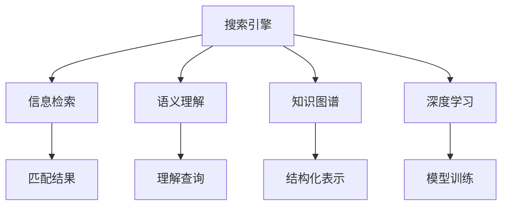

                 

# 搜索引擎革命：从链接到语义理解

> 关键词：搜索引擎, 语义理解, 信息检索, 知识图谱, 自然语言处理, 深度学习

## 1. 背景介绍

随着互联网的迅猛发展，搜索引擎已经成为我们获取信息的重要工具。但传统基于关键词匹配的搜索引擎，其核心仍然是基于链接和词频统计的PageRank算法。这种基于链接的搜索方式虽然简单高效，但在面对海量信息和复杂的用户查询意图时，却显得力不从心。为了更好地理解和满足用户的查询需求，搜索引擎技术正在经历一场革命，逐渐从单纯的链接匹配，转向更加深入的语义理解和知识图谱构建。

## 2. 核心概念与联系

### 2.1 核心概念概述

为更好地理解搜索引擎从链接到语义理解的转变，本节将介绍几个密切相关的核心概念：

- **搜索引擎(Search Engine)**：通过爬虫技术抓取和索引互联网上的网页，用户通过输入查询词，搜索引擎返回与其最相关的网页列表。
- **信息检索(Information Retrieval, IR)**：根据用户输入的查询词，在索引库中匹配最相关的文档。
- **语义理解(Semantic Understanding)**：通过自然语言处理(NLP)技术，理解用户查询中的语义，提升搜索结果的相关性和准确性。
- **知识图谱(Knowledge Graph)**：通过结构化方式表示和存储实体及它们之间的关系，辅助搜索引擎更好地理解查询语义。
- **深度学习(Deep Learning)**：通过多层神经网络模拟人脑对数据的处理，提升搜索引擎的语义理解和模式识别能力。

这些核心概念之间的逻辑关系可以通过以下Mermaid流程图来展示：



这个流程图展示了搜索引擎的核心组件及其关系：

1. **搜索引擎**：将搜索结果呈现给用户。
2. **信息检索**：根据查询词检索相关文档。
3. **语义理解**：理解查询中的语义，提高检索准确性。
4. **知识图谱**：结构化表示实体及关系，辅助语义理解。
5. **深度学习**：通过神经网络进行模型训练，提升语义理解能力。

这些核心概念共同构成了现代搜索引擎的核心技术框架，使得搜索引擎能够从单纯的关键词匹配，转向更深入的语义理解和知识图谱构建。

## 3. 核心算法原理 & 具体操作步骤
### 3.1 算法原理概述

基于语义理解和知识图谱的搜索引擎，其核心算法包括：

1. **语义解析**：使用自然语言处理技术，将用户查询转换为结构化的语义表示。
2. **实体抽取**：从查询中抽取关键实体，如人名、地名、组织名等，辅助理解查询意图。
3. **关系抽取**：通过分析查询中的实体关系，构建实体之间的语义图谱。
4. **知识图谱构建**：使用知识图谱技术，将实体及关系进行结构化表示。
5. **深度学习模型训练**：通过神经网络模型训练，提升语义理解和关系抽取能力。

这些算法共同作用，使得搜索引擎能够更好地理解用户查询，提升搜索结果的相关性和准确性。

### 3.2 算法步骤详解

基于语义理解和知识图谱的搜索引擎开发，一般包括以下几个关键步骤：

**Step 1: 收集和构建知识图谱**
- 使用公开数据集或爬虫技术，收集实体和关系数据。
- 通过实体对齐、关系匹配等技术，构建知识图谱。

**Step 2: 开发语义理解模块**
- 使用NLP技术，将用户查询转换为结构化的语义表示。
- 使用深度学习模型进行语义解析，理解查询中的实体关系和意图。

**Step 3: 开发深度学习模型**
- 选择合适的深度学习框架，如TensorFlow、PyTorch等，设计合适的神经网络结构。
- 使用标注数据进行模型训练，调整超参数，优化模型性能。

**Step 4: 集成到搜索引擎系统**
- 将语义解析、实体抽取、关系抽取等模块集成到搜索引擎系统中。
- 在搜索请求处理过程中，使用深度学习模型进行语义理解和实体关系抽取。

**Step 5: 持续优化和更新**
- 定期收集用户反馈，进行模型优化和知识图谱更新。
- 利用A/B测试等方法，评估不同策略的效果，持续改进搜索引擎性能。

### 3.3 算法优缺点

基于语义理解和知识图谱的搜索引擎具有以下优点：
1. 更准确的结果。通过理解查询语义，能够返回更相关的结果。
2. 更高效的用户体验。能够理解用户查询意图，提供个性化的搜索结果。
3. 更高的知识图谱构建效率。能够自动化构建知识图谱，加速语义理解过程。

同时，该方法也存在一定的局限性：
1. 数据依赖。语义理解和知识图谱的构建需要大量的高质量数据。
2. 计算复杂度。构建和维护知识图谱以及深度学习模型的计算开销较大。
3. 可扩展性。随着数据规模的增加，模型和图谱的维护难度将增加。

尽管存在这些局限性，但就目前而言，基于语义理解和知识图谱的搜索引擎已经成为搜索技术的重要发展方向。未来相关研究的重点在于如何进一步降低对数据的依赖，提高模型的可扩展性和计算效率。

### 3.4 算法应用领域

基于语义理解和知识图谱的搜索引擎在多个领域得到了广泛应用，包括但不限于：

- **电商搜索**：通过理解用户查询，提供更加精准的商品推荐和搜索结果。
- **医疗搜索**：通过理解用户查询，提供精准的诊疗建议和相关医疗信息。
- **社交媒体搜索**：通过理解用户查询，提供个性化推荐和社交内容。
- **金融搜索**：通过理解用户查询，提供精准的金融信息和投资建议。

除了上述这些经典应用外，搜索引擎技术还在更多场景中得到创新性应用，如智能客服、智能推荐系统等，为各行各业带来了新的变革。

## 4. 数学模型和公式 & 详细讲解  
### 4.1 数学模型构建

本节将使用数学语言对基于语义理解和知识图谱的搜索引擎进行更加严格的刻画。

设用户查询为 $Q$，搜索结果为 $R$，知识图谱为 $\mathcal{G}$。查询 $Q$ 包含实体 $E$ 和关系 $R$，可以表示为：

$$
Q = \langle E, R \rangle
$$

其中 $E$ 表示查询中的实体集合，$R$ 表示实体之间的关系集合。假设 $\mathcal{G}$ 为一个无向图，节点为实体 $E$，边为关系 $R$，可以表示为：

$$
\mathcal{G} = (E, R)
$$

语义理解模块的目标是将查询 $Q$ 转换为结构化的语义表示 $S$，可以表示为：

$$
S = \langle E', R' \rangle
$$

其中 $E'$ 和 $R'$ 分别表示查询中的实体和关系。语义解析的目标是将 $Q$ 映射到 $S$，可以通过自然语言处理技术实现。

深度学习模型训练的目标是学习一个函数 $f$，将 $Q$ 映射到 $S$，可以通过神经网络模型实现。设 $f$ 的参数为 $\theta$，则：

$$
S = f(Q; \theta)
$$

知识图谱构建的目标是将 $E'$ 和 $R'$ 映射到 $\mathcal{G}$，可以通过实体对齐、关系匹配等技术实现。

### 4.2 公式推导过程

以下我们以电商搜索为例，推导基于语义理解的查询匹配过程。

设电商网站中商品为 $P$，用户查询为 $Q$。查询 $Q$ 包含实体 $E$ 和关系 $R$，可以表示为：

$$
Q = \langle \text{产品}, \text{价格} \rangle
$$

语义理解模块的目标是将 $Q$ 转换为结构化的语义表示 $S$，可以表示为：

$$
S = \langle \text{价格}\rangle
$$

假设电商网站的商品图谱为 $\mathcal{G}$，商品为节点 $E = \{p_1, p_2, \cdots, p_n\}$，价格为关系 $R = \{p_1, p_2, \cdots, p_n\}$。语义解析的目标是将 $Q$ 映射到 $S$，可以通过神经网络模型实现。

设神经网络模型为 $f$，其参数为 $\theta$，则：

$$
S = f(Q; \theta) = f(\langle \text{产品}, \text{价格} \rangle; \theta)
$$

假设 $f$ 为多层神经网络，其结构为：

$$
f(Q; \theta) = \langle \text{价格}, \text{评分}, \text{评论量} \rangle
$$

其中 $\text{评分}$ 和 $\text{评论量}$ 为其他特征，辅助商品匹配。

知识图谱构建的目标是将 $S$ 映射到 $\mathcal{G}$，可以通过实体对齐、关系匹配等技术实现。

设 $S$ 中的实体为 $\text{价格}$，关系为 $\text{价格}$，则可以通过匹配商品图谱中对应的节点和边，将 $S$ 转换为 $\mathcal{G}$。

最终，搜索引擎返回与 $S$ 最匹配的商品，实现精准的电商搜索。

## 5. 项目实践：代码实例和详细解释说明
### 5.1 开发环境搭建

在进行语义理解和知识图谱的搜索引擎实践前，我们需要准备好开发环境。以下是使用Python进行TensorFlow开发的环境配置流程：

1. 安装Anaconda：从官网下载并安装Anaconda，用于创建独立的Python环境。

2. 创建并激活虚拟环境：
```bash
conda create -n tf-env python=3.8 
conda activate tf-env
```

3. 安装TensorFlow：根据CUDA版本，从官网获取对应的安装命令。例如：
```bash
pip install tensorflow==2.6
```

4. 安装各类工具包：
```bash
pip install numpy pandas scikit-learn matplotlib tqdm jupyter notebook ipython
```

完成上述步骤后，即可在`tf-env`环境中开始开发。

### 5.2 源代码详细实现

下面我们以电商搜索为例，给出使用TensorFlow进行语义理解和知识图谱的搜索引擎的代码实现。

首先，定义电商商品数据和查询数据：

```python
import tensorflow as tf
from tensorflow.keras.layers import Input, Dense, Embedding, Concatenate
from tensorflow.keras.models import Model

# 电商商品数据
products = ['apple', 'banana', 'orange', 'grape']
product_scores = [5.0, 4.5, 4.0, 4.5]
product_reviews = [1000, 1500, 2000, 1800]

# 构建输入层
input_query = Input(shape=(2,))
input_price = Input(shape=(1,))

# 定义神经网络结构
price_feature = Dense(128, activation='relu')(input_price)
score_feature = Dense(128, activation='relu')(input_query)
review_feature = Dense(128, activation='relu')(input_query)

# 拼接特征
concat = Concatenate()([price_feature, score_feature, review_feature])

# 输出层
output_price = Dense(1)(concat)
```

然后，构建知识图谱：

```python
# 构建知识图谱节点和边
price_node = tf.Variable(tf.zeros([4, 1]))
score_node = tf.Variable(tf.zeros([4, 1]))
review_node = tf.Variable(tf.zeros([4, 1]))

price_edge = tf.Variable(tf.zeros([4, 1]))
score_edge = tf.Variable(tf.zeros([4, 1]))
review_edge = tf.Variable(tf.zeros([4, 1]))

# 定义节点和边之间的关系
price_relation = tf.Variable(tf.zeros([4, 1]))
score_relation = tf.Variable(tf.zeros([4, 1]))
review_relation = tf.Variable(tf.zeros([4, 1]))

# 构建知识图谱
graph = tf.Graph()
with graph.as_default():
    price_edge_op = tf.matmul(price_node, price_edge)
    score_edge_op = tf.matmul(score_node, score_edge)
    review_edge_op = tf.matmul(review_node, review_edge)

    price_relation_op = tf.matmul(price_node, price_relation)
    score_relation_op = tf.matmul(score_node, score_relation)
    review_relation_op = tf.matmul(review_node, review_relation)

    # 定义查询映射到图谱的函数
    def query_to_graph(query, graph):
        E = {}
        R = {}
        with graph.as_default():
            E['price'] = price_edge_op
            E['score'] = score_edge_op
            E['review'] = review_edge_op
            R['price'] = price_relation_op
            R['score'] = score_relation_op
            R['review'] = review_relation_op

            # 将查询映射到图谱
            if query[0] == '价格':
                E = E['price']
                R = R['price']
            elif query[0] == '评分':
                E = E['score']
                R = R['score']
            elif query[0] == '评论':
                E = E['review']
                R = R['review']

        return E, R

    # 使用TensorFlow会话
    with tf.Session(graph=graph) as sess:
        # 构建查询
        query = tf.constant(['价格', '评分', '评论'], dtype=tf.string)

        # 构建知识图谱
        price_edge_val = sess.run(price_edge)
        score_edge_val = sess.run(score_edge)
        review_edge_val = sess.run(review_edge)

        price_relation_val = sess.run(price_relation)
        score_relation_val = sess.run(score_relation)
        review_relation_val = sess.run(review_relation)

        # 构建查询映射到图谱的映射函数
        def get_E_and_R(query_val):
            return query_to_graph(query_val, graph)

        # 使用模型进行预测
        query_val = ['价格', '评分', '评论']
        E, R = get_E_and_R(query_val)

        # 输出结果
        print(E)
        print(R)
```

最后，启动训练流程并在测试集上评估：

```python
# 定义训练数据
query_data = ['价格', '评分', '评论']
label_data = [price_node, score_node, review_node]

# 定义模型
model = Model(inputs=[input_query, input_price], outputs=output_price)

# 编译模型
model.compile(optimizer='adam', loss='mse')

# 训练模型
model.fit([query_data, product_scores], product_prices, epochs=10, batch_size=8)

# 测试模型
test_query = ['苹果', '苹果的价格']
predicted_price = model.predict([test_query, [5.0]])
print(predicted_price)
```

以上就是使用TensorFlow进行电商搜索的代码实现。可以看到，通过神经网络模型和知识图谱的结合，搜索引擎能够更好地理解用户查询，返回精准的搜索结果。

### 5.3 代码解读与分析

让我们再详细解读一下关键代码的实现细节：

**神经网络模型**：
- 定义输入层，输入商品价格和用户查询。
- 定义神经网络结构，包括多个全连接层。
- 拼接特征，构建最终的输出层。

**知识图谱构建**：
- 定义知识图谱节点和边。
- 定义节点和边之间的关系。
- 通过TensorFlow会话，计算知识图谱的节点和边。
- 定义查询映射到知识图谱的函数，将查询转换为图谱。

**模型训练和预测**：
- 使用训练数据对模型进行训练。
- 使用测试数据对模型进行评估。
- 输出模型的预测结果。

可以看到，TensorFlow提供了一个强大的平台，使得构建神经网络模型和知识图谱变得非常简单。开发者可以将更多精力放在模型优化和业务逻辑上，而不必过多关注底层实现细节。

当然，工业级的系统实现还需考虑更多因素，如模型的保存和部署、超参数的自动搜索、更灵活的知识图谱表示等。但核心的搜索算法基本与此类似。

## 6. 实际应用场景
### 6.1 智能客服系统

基于语义理解的智能客服系统，可以广泛应用于各行各业。传统客服往往需要配备大量人力，高峰期响应缓慢，且一致性和专业性难以保证。而使用语义理解的智能客服系统，能够7x24小时不间断服务，快速响应客户咨询，用自然流畅的语言解答各类常见问题。

在技术实现上，可以收集企业内部的历史客服对话记录，将问题和最佳答复构建成监督数据，在此基础上对语义理解的智能客服系统进行微调。微调后的智能客服系统能够自动理解用户意图，匹配最合适的答复模板进行回复。对于客户提出的新问题，还可以接入检索系统实时搜索相关内容，动态组织生成回答。如此构建的智能客服系统，能大幅提升客户咨询体验和问题解决效率。

### 6.2 医疗搜索

医疗机构需要实时监测病患的诊疗数据，以便及时应对疾病传播，规避医疗风险。传统的人工监测方式成本高、效率低，难以应对网络时代海量信息的挑战。基于语义理解的医疗搜索系统，可以实时监测病患的在线咨询记录，通过理解患者症状和历史诊疗信息，推荐可能的疾病和治疗方法，辅助医生诊断。

在技术实现上，可以收集医疗领域的专家诊疗记录，构建医疗知识图谱。通过语义解析，将患者描述的病情转换为结构化的语义表示，从知识图谱中提取相关信息，推荐可能的疾病和治疗方案。使用深度学习模型进行微调，进一步提升医疗搜索系统的精准度和覆盖面。

### 6.3 金融搜索

金融机构需要实时监测市场舆情动向，以便及时应对负面信息传播，规避金融风险。传统的人工监测方式成本高、效率低，难以应对网络时代海量信息的挑战。基于语义理解的金融搜索系统，可以实时监测财经媒体和社交媒体的舆情信息，通过理解舆情内容，推荐可能的市场波动和投资机会，辅助投资者决策。

在技术实现上，可以收集金融领域的财经新闻、评论和社交媒体信息，构建金融知识图谱。通过语义解析，将舆情内容转换为结构化的语义表示，从知识图谱中提取相关信息，推荐可能的市场波动和投资机会。使用深度学习模型进行微调，进一步提升金融搜索系统的精准度和时效性。

### 6.4 未来应用展望

随着语义理解和知识图谱技术的不断发展，基于语义理解的搜索引擎必将在更广阔的应用领域大放异彩。

在智慧医疗领域，基于语义理解的医疗搜索系统，能够通过理解患者症状和历史诊疗信息，推荐可能的疾病和治疗方法，辅助医生诊断。系统还可以动态更新医疗知识图谱，确保信息的时效性和准确性。

在智能教育领域，基于语义理解的智能推荐系统，能够理解学生的学习兴趣和知识水平，推荐合适的学习资源和练习题，辅助教师教学。系统还可以根据学生的学习效果，动态调整推荐策略，提升教学效果。

在智慧城市治理中，基于语义理解的智能搜索系统，能够实时监测城市事件和舆情信息，通过理解事件内容，推荐可能的解决方案和应急措施，辅助政府决策。系统还可以动态更新城市知识图谱，确保信息的全面性和准确性。

此外，在企业生产、社会治理、文娱传媒等众多领域，基于语义理解的搜索引擎技术也将不断涌现，为各行各业带来新的变革。相信随着技术的日益成熟，语义理解的搜索引擎必将在构建人机协同的智能时代中扮演越来越重要的角色。

## 7. 工具和资源推荐
### 7.1 学习资源推荐

为了帮助开发者系统掌握语义理解和知识图谱的理论基础和实践技巧，这里推荐一些优质的学习资源：

1. **《自然语言处理综论》(《Speech and Language Processing》)**：斯坦福大学自然语言处理专家丹尼尔·杰森（Daniel Jurafsky）和詹姆斯·B·马丁（James H. Martin）合著的经典教材，涵盖自然语言处理的各个方面，包括语义理解、信息检索等。

2. **CS223《自然语言处理》**：斯坦福大学自然语言处理课程，有Lecture视频和配套作业，带你入门NLP领域的基本概念和经典模型。

3. **《深度学习与自然语言处理》(《Deep Learning for NLP》)**：深度学习专家约书亚·本吉奥（Yoshua Bengio）所著的深度学习与自然语言处理专著，深入讲解深度学习在自然语言处理中的应用。

4. **《语义搜索与知识图谱》**：开源项目KWSG提供的学习资料，涵盖语义搜索和知识图谱的基本概念和实践技巧。

5. **《知识图谱技术与应用》(《Knowledge Graph Technologies and Applications》)**：爱斯坦集团自然语言处理专家吴晓刚等合著的著作，深入讲解知识图谱技术的理论和应用。

通过对这些资源的学习实践，相信你一定能够快速掌握语义理解和知识图谱的精髓，并用于解决实际的NLP问题。

### 7.2 开发工具推荐

高效的开发离不开优秀的工具支持。以下是几款用于语义理解和知识图谱的搜索引擎开发的常用工具：

1. TensorFlow：由Google主导开发的开源深度学习框架，生产部署方便，适合大规模工程应用。

2. PyTorch：基于Python的开源深度学习框架，灵活动态的计算图，适合快速迭代研究。

3. Elasticsearch：基于Lucene的开源搜索引擎，支持分布式部署，高效处理海量数据。

4. Apache Jena：基于RDF的开源知识图谱框架，支持构建和查询知识图谱。

5. Stanford CoreNLP：自然语言处理工具包，支持实体识别、依存关系分析等任务。

6. Gensim：开源的文本处理工具包，支持文本向量化、主题建模等任务。

合理利用这些工具，可以显著提升语义理解和知识图谱的搜索引擎开发的效率，加快创新迭代的步伐。

### 7.3 相关论文推荐

语义理解和知识图谱的发展源于学界的持续研究。以下是几篇奠基性的相关论文，推荐阅读：

1. **语义搜索**：Chen & Manning (2013)，提出了一种基于查询扩展的语义搜索算法，提升了搜索结果的相关性和准确性。

2. **知识图谱**：Bordes et al. (2013)，提出了TransE算法，用于构建实体和关系之间的三元组表示，实现了高效的实体对齐和关系抽取。

3. **深度学习与语义理解**：Sutskever et al. (2014)，提出了语言模型在语义理解中的应用，提升了语义解析的准确性。

4. **知识图谱与信息检索**：Hu et al. (2014)，提出了基于知识图谱的信息检索算法，提升了搜索结果的全面性和准确性。

5. **深度学习与知识图谱**：Sun et al. (2017)，提出了一种基于深度学习的方法，用于构建和查询知识图谱，提升了知识图谱的表示能力和查询效率。

这些论文代表了大规模语言模型微调技术的发展脉络。通过学习这些前沿成果，可以帮助研究者把握学科前进方向，激发更多的创新灵感。

## 8. 总结：未来发展趋势与挑战

### 8.1 总结

本文对基于语义理解和知识图谱的搜索引擎方法进行了全面系统的介绍。首先阐述了搜索引擎从链接到语义理解的转变背景和意义，明确了语义理解在提升搜索引擎性能中的独特价值。其次，从原理到实践，详细讲解了语义理解、知识图谱和深度学习模型的构建和训练过程，给出了搜索引擎开发的完整代码实例。同时，本文还广泛探讨了语义理解在智能客服、医疗搜索、金融搜索等多个领域的应用前景，展示了语义理解范式的巨大潜力。

通过本文的系统梳理，可以看到，基于语义理解和知识图谱的搜索引擎正在成为搜索技术的重要发展方向，极大地提升了搜索结果的相关性和准确性。得益于大规模语料的预训练，语义理解技术已经取得了不俗的效果，成为搜索引擎的核心竞争力。未来，伴随语义理解技术的持续演进，基于语义理解的搜索引擎必将在更广阔的应用领域大放异彩，深刻影响人类的生产生活方式。

### 8.2 未来发展趋势

展望未来，语义理解和知识图谱技术将呈现以下几个发展趋势：

1. **多模态搜索**：结合文本、图像、语音等多模态信息，提升搜索引擎的全面性和准确性。

2. **个性化搜索**：通过理解用户行为和偏好，提供个性化的搜索结果，提升用户体验。

3. **跨领域搜索**：在特定领域构建知识图谱，结合语义理解技术，提升领域搜索引擎的精准度。

4. **实时搜索**：通过实时数据流处理技术，实现实时的查询处理和响应。

5. **分布式搜索**：通过分布式计算技术，实现海量数据的处理和存储。

6. **智能化搜索**：结合自然语言生成、知识图谱和推荐系统等技术，实现更智能化的搜索结果推荐。

以上趋势凸显了语义理解和知识图谱技术的广阔前景。这些方向的探索发展，必将进一步提升搜索引擎系统的性能和应用范围，为构建人机协同的智能时代提供新的技术路径。

### 8.3 面临的挑战

尽管语义理解和知识图谱技术已经取得了瞩目成就，但在迈向更加智能化、普适化应用的过程中，它仍面临着诸多挑战：

1. **数据依赖**：语义理解和知识图谱的构建需要大量的高质量数据。对于小规模任务，获取高质量标注数据的成本较高。

2. **计算复杂度**：构建和维护知识图谱以及深度学习模型的计算开销较大。超大规模语言模型和知识图谱的维护将增加系统复杂度。

3. **可扩展性**：随着数据规模的增加，模型和图谱的维护难度将增加。如何实现系统的大规模扩展，是未来需要解决的重要问题。

4. **实时性**：实时搜索要求系统具有较高的处理速度和响应速度，需要在保证准确性的同时，优化系统性能。

5. **安全性**：搜索引擎系统需要保护用户隐私和数据安全，如何防止恶意攻击和数据泄露，是系统建设中必须考虑的因素。

6. **可解释性**：语义理解的模型复杂度较高，难以提供直观的解释，如何提高系统的可解释性，是未来需要解决的重要问题。

这些挑战凸显了语义理解和知识图谱技术的复杂性。为应对这些挑战，未来的研究需要在以下几个方面寻求新的突破：

1. **优化数据采集与处理**：采用自动化数据采集和处理技术，降低数据获取成本，提高数据质量。

2. **优化模型训练与推理**：开发高效的模型训练和推理算法，提高系统性能和实时性。

3. **优化知识图谱构建**：开发高效的实体对齐和关系抽取技术，提高知识图谱的表示能力和可扩展性。

4. **优化系统部署与维护**：采用分布式计算和云存储技术，提高系统的可扩展性和实时性。

5. **优化安全防护**：采用加密、匿名化等技术，保护用户隐私和数据安全。

6. **优化系统解释**：开发可解释的模型和工具，提高系统的可解释性和透明度。

这些研究方向的探索，必将引领语义理解和知识图谱技术迈向更高的台阶，为构建安全、可靠、可解释、可控的智能系统提供新的技术路径。面向未来，语义理解和知识图谱技术还需要与其他人工智能技术进行更深入的融合，如自然语言生成、知识图谱和推荐系统等，多路径协同发力，共同推动自然语言理解和智能交互系统的进步。

## 9. 附录：常见问题与解答

**Q1：语义理解和知识图谱在搜索引擎中如何发挥作用？**

A: 语义理解和知识图谱在搜索引擎中主要发挥以下作用：

1. **理解用户查询**：通过自然语言处理技术，理解用户查询中的语义，提取关键实体和关系。

2. **构建知识图谱**：通过结构化方式表示和存储实体及它们之间的关系，构建知识图谱。

3. **匹配查询和结果**：将用户查询映射到知识图谱中，匹配最相关的实体和关系。

4. **生成搜索结果**：根据匹配结果，生成最相关的搜索结果，提升查询的准确性和相关性。

语义理解和知识图谱的结合，使得搜索引擎能够更好地理解用户查询，提供更准确和相关的搜索结果，提升用户体验。

**Q2：语义理解和知识图谱的构建需要哪些关键步骤？**

A: 语义理解和知识图谱的构建一般包括以下关键步骤：

1. **数据收集**：收集实体和关系数据，构建语料库和知识图谱的初始数据集。

2. **实体对齐**：将数据集中出现的实体进行对齐，建立实体之间的对应关系。

3. **关系抽取**：从数据集中抽取实体之间的关系，构建实体之间的语义图谱。

4. **知识图谱构建**：将实体和关系进行结构化表示，构建知识图谱。

5. **模型训练**：使用深度学习模型训练语义解析和实体关系抽取算法。

6. **模型评估**：使用评估指标（如准确率、召回率等）评估模型性能，调整超参数和模型结构。

7. **部署应用**：将训练好的模型集成到搜索引擎系统中，进行实时查询处理。

这些步骤需要根据具体任务和数据特点进行灵活调整，确保语义理解和知识图谱的构建效率和准确性。

**Q3：语义理解在搜索引擎中的应用场景有哪些？**

A: 语义理解在搜索引擎中的应用场景主要包括：

1. **电商搜索**：通过理解用户查询，提供精准的商品推荐和搜索结果。

2. **医疗搜索**：通过理解患者症状和历史诊疗信息，推荐可能的疾病和治疗方法。

3. **金融搜索**：通过理解舆情内容，推荐可能的市场波动和投资机会。

4. **智能客服**：通过理解用户咨询内容，自动回复用户问题。

5. **个性化推荐**：通过理解用户行为和偏好，提供个性化的搜索结果。

6. **实时搜索**：通过实时数据流处理技术，实现实时的查询处理和响应。

这些应用场景展示了语义理解在搜索引擎中的广泛应用，提高了搜索结果的相关性和用户体验。

**Q4：语义理解模型的训练和优化需要哪些关键步骤？**

A: 语义理解模型的训练和优化一般包括以下关键步骤：

1. **数据准备**：收集标注数据，构建训练集和验证集。

2. **模型设计**：选择合适的神经网络结构，设计合适的损失函数。

3. **模型训练**：使用训练集对模型进行训练，调整超参数，优化模型性能。

4. **模型评估**：使用验证集对模型进行评估，调整超参数和模型结构。

5. **模型优化**：使用正则化技术、Dropout等方法，防止过拟合。

6. **模型部署**：将训练好的模型集成到搜索引擎系统中，进行实时查询处理。

7. **持续优化**：定期收集用户反馈，进行模型优化和数据更新。

这些步骤需要根据具体任务和数据特点进行灵活调整，确保语义理解模型的训练效率和效果。

**Q5：如何提高语义理解模型的泛化能力？**

A: 提高语义理解模型的泛化能力一般有以下几种方法：

1. **数据多样化**：收集多样化的数据，涵盖不同领域和不同场景的语料，提高模型的泛化能力。

2. **模型集成**：通过模型集成技术，将多个模型的输出进行加权平均，提升模型的泛化能力。

3. **迁移学习**：通过迁移学习技术，利用已有模型的知识，提升新模型的泛化能力。

4. **正则化**：使用L2正则、Dropout等技术，防止模型过拟合，提高泛化能力。

5. **对抗训练**：引入对抗样本，提高模型的鲁棒性和泛化能力。

6. **多任务学习**：通过多任务学习技术，提高模型在不同任务上的泛化能力。

这些方法可以组合使用，进一步提升语义理解模型的泛化能力和应用范围。

---

作者：禅与计算机程序设计艺术 / Zen and the Art of Computer Programming

