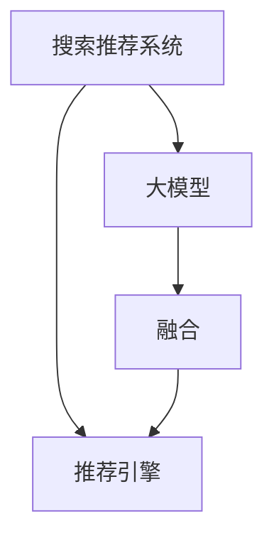

                 

# 搜索推荐系统的AI 大模型融合：电商平台的核心竞争力与可持续发展战略

> 关键词：搜索推荐系统,大模型融合,电商平台,核心竞争力,可持续发展战略

## 1. 背景介绍

### 1.1 问题由来
随着电子商务市场的蓬勃发展，电商平台面临着愈发激烈的市场竞争。用户在众多商品中选择时，信息过载成为其面临的主要问题。为了缓解这一问题，各大电商平台纷纷引入搜索推荐系统，以提供个性化的购物体验。然而，现有的搜索推荐系统往往基于传统的机器学习算法，如协同过滤、矩阵分解等，难以充分挖掘用户的多样化需求和商品的多样化特征，缺乏大规模深度学习模型的泛化能力和表示学习能力。

### 1.2 问题核心关键点
为了应对这一挑战，各大电商平台正积极探索利用大模型技术改进搜索推荐系统，试图通过深度学习技术，从海量数据中学习出更加精细、复杂的商品和用户特征表示，从而提升搜索推荐的效果。通过将预训练语言模型、视觉模型等大模型与搜索推荐系统进行融合，可以有效提升系统对用户行为的预测能力和商品相关性的匹配能力，构建更加智能的推荐引擎。

## 2. 核心概念与联系

### 2.1 核心概念概述

为更好地理解搜索推荐系统与大模型融合的过程，本节将介绍几个密切相关的核心概念：

- **搜索推荐系统(Search and Recommendation System, SRS)**：用于帮助用户快速定位所需商品，通过分析用户历史行为、商品属性等数据，为用户推荐个性化的商品。
- **大模型(Pre-trained Models)**：如BERT、GPT、ViT等，通过大规模无标签数据预训练，获得广泛的语言、视觉等知识，能够进行复杂的特征表示学习。
- **融合(Fusion)**：将大模型的知识融合到搜索推荐系统中，增强系统的表示学习能力和泛化能力。
- **推荐引擎(Recommendation Engine)**：基于搜索推荐系统的后端计算组件，通过高效地处理用户请求和商品数据，提供推荐结果。
- **深度学习模型(Deep Learning Model)**：采用神经网络等深度学习技术，通过多层非线性变换，从数据中学习出复杂的关系和模式。

这些核心概念之间的逻辑关系可以通过以下Mermaid流程图来展示：



这个流程图展示了大模型与搜索推荐系统融合的核心逻辑：

1. 大模型通过预训练学习到广泛的知识。
2. 融合模块将大模型的知识引入搜索推荐系统。
3. 推荐引擎基于融合后的模型，提供个性化的推荐结果。

## 3. 核心算法原理 & 具体操作步骤
### 3.1 算法原理概述

搜索推荐系统与大模型融合的核心在于利用大模型进行特征表示学习，提升系统的泛化能力和表示能力。其核心思想是：

- 将大模型的隐层表示作为搜索推荐系统的基础特征，增强模型的非线性表达能力。
- 通过微调大模型或引入任务特定头，使其适应搜索推荐任务的需求。
- 将融合后的大模型特征输入推荐引擎，得到个性化的推荐结果。

形式化地，假设搜索推荐系统的输入为 $x$（用户行为）和 $q$（商品属性），输出为 $y$（推荐结果），则系统的目标是最大化预测准确率。融合后的模型 $M_{\theta}$ 可以表示为：

$$
M_{\theta} = f_{\text{dec}}(f_{\text{enc}}(x, q; \omega))
$$

其中，$f_{\text{enc}}$ 为编码器，将用户行为和商品属性编码为大模型的隐层表示，$f_{\text{dec}}$ 为解码器，基于编码器输出的隐层表示，生成推荐结果。$\omega$ 为编码器参数，$\theta$ 为解码器参数。

微调大模型的目标是调整 $\theta$，使得模型在推荐任务上达到最优的性能。通常，微调过程分为两个阶段：

1. **预训练阶段**：在大规模无标签数据上预训练大模型，学习语言的通用表示。
2. **微调阶段**：在搜索推荐任务的少量有标签数据上微调大模型，使其适应推荐任务的具体需求。

### 3.2 算法步骤详解

基于搜索推荐系统与大模型融合的算法一般包括以下几个关键步骤：

**Step 1: 准备数据集**
- 收集平台用户的历史行为数据和商品属性数据，划分为训练集、验证集和测试集。
- 确保数据集的多样性和代表性，覆盖不同场景下的推荐需求。

**Step 2: 构建模型结构**
- 选择合适的预训练模型，如BERT、GPT、ViT等。
- 设计融合模块，将大模型的隐层表示作为搜索推荐系统的基础特征。
- 设计推荐引擎，如基于深度神经网络或协同过滤算法，实现个性化推荐。

**Step 3: 进行预训练**
- 在大规模无标签数据上，通过自监督学习任务训练大模型，学习语言的通用表示。
- 保留大模型的隐层表示作为搜索推荐系统的特征，无需微调该部分参数。

**Step 4: 进行微调**
- 在搜索推荐任务的少量有标签数据上，通过有监督学习任务微调大模型，使其适应推荐任务的需求。
- 设计合适的损失函数和优化器，调整解码器参数 $\theta$。

**Step 5: 评估与部署**
- 在测试集上评估微调后模型的推荐效果，对比微调前后的精度提升。
- 使用微调后的模型对新商品进行推荐，集成到实际的搜索推荐系统中。
- 持续收集用户反馈和新的数据，定期重新微调模型，以适应数据分布的变化。

以上是搜索推荐系统与大模型融合的一般流程。在实际应用中，还需要针对具体任务的特点，对微调过程的各个环节进行优化设计，如改进损失函数，引入更多的正则化技术，搜索最优的超参数组合等，以进一步提升模型性能。

### 3.3 算法优缺点

搜索推荐系统与大模型融合的方法具有以下优点：
1. 提高系统的泛化能力。大模型经过大规模预训练，能够学习到广泛的语言、视觉知识，提升了模型的泛化能力。
2. 增强特征表示能力。融合大模型的隐层表示，增强了推荐系统的特征表达能力，减少了手动设计特征的工作量。
3. 降低人工干预。通过自动化的特征表示学习，减少了人工特征工程的需求，提升了系统的稳定性和可维护性。
4. 提升推荐效果。在融合大模型的基础上，推荐系统的推荐效果可以得到显著提升，特别是在小样本情况下。

同时，该方法也存在一些局限性：
1. 计算资源需求大。预训练大模型的计算需求高，模型融合也需要大量的计算资源。
2. 微调难度大。微调过程涉及大模型的参数调整，可能需要较长的训练时间。
3. 数据隐私问题。使用大模型进行微调，需要处理大量的用户数据，存在一定的隐私风险。
4. 部署复杂。搜索推荐系统的实时计算需求高，大模型融合后的模型结构复杂，部署难度较大。

尽管存在这些局限性，但就目前而言，搜索推荐系统与大模型融合的方法仍是大模型应用的最主流范式。未来相关研究的重点在于如何进一步降低计算资源的需求，提高微调效率，同时兼顾隐私保护和系统部署等问题。

### 3.4 算法应用领域

搜索推荐系统与大模型融合的方法已经在电子商务、社交网络、新闻推荐等多个领域得到了广泛应用，成为了提升推荐系统性能的重要手段。

1. **电子商务推荐**：通过融合BERT等预训练语言模型，推荐系统可以理解用户搜索的语义意图，推荐更加符合用户需求的商品。
2. **社交网络推荐**：使用大模型对用户兴趣进行表示学习，推荐系统可以为用户推荐潜在的朋友和内容，提高用户活跃度。
3. **新闻推荐**：结合预训练语言模型和视觉模型，推荐系统可以为用户推荐更加个性化和多样化的新闻内容。

除了上述这些经典应用外，搜索推荐系统与大模型融合的方法还被创新性地应用到更多场景中，如游戏推荐、音乐推荐、视频推荐等，为各类平台提供了新的增长动力。随着预训练模型和融合方法的不断进步，相信搜索推荐系统将在更多领域发挥更大的作用。

## 4. 数学模型和公式 & 详细讲解 & 举例说明

### 4.1 数学模型构建

本节将使用数学语言对搜索推荐系统与大模型融合的过程进行更加严格的刻画。

假设搜索推荐系统输入为 $x = (x_1, x_2, \cdots, x_m)$ 表示用户历史行为，$q = (q_1, q_2, \cdots, q_n)$ 表示商品属性，输出为 $y = (y_1, y_2, \cdots, y_k)$ 表示推荐结果。大模型 $M_{\theta}$ 的编码器部分为 $f_{\text{enc}}(x, q; \omega)$，解码器部分为 $f_{\text{dec}}(f_{\text{enc}}(x, q; \omega))$，则融合后的推荐系统可以表示为：

$$
y = M_{\theta}(x, q; \omega, \theta)
$$

其中 $\omega$ 为编码器参数，$\theta$ 为解码器参数。假设推荐系统采用交叉熵损失函数，则融合后的推荐系统损失函数为：

$$
\mathcal{L}(\theta) = -\frac{1}{N}\sum_{i=1}^N \log f_{\text{dec}}(f_{\text{enc}}(x_i, q_i; \omega))^{\hat{y}_i}
$$

其中 $\hat{y}_i$ 为第 $i$ 个样本的真实标签。

### 4.2 公式推导过程

以电子商务推荐系统为例，推导融合后模型的预测函数和损失函数。

假设用户的历史行为 $x$ 包括浏览行为、购买行为等，商品属性 $q$ 包括商品名称、价格、评分等。融合后的推荐系统可以表示为：

$$
y = M_{\theta}(x, q; \omega, \theta) = f_{\text{dec}}(f_{\text{enc}}(x, q; \omega))
$$

其中 $f_{\text{enc}}(x, q; \omega)$ 为编码器部分，将用户行为 $x$ 和商品属性 $q$ 编码为大模型的隐层表示，$f_{\text{dec}}(f_{\text{enc}}(x, q; \omega))$ 为解码器部分，基于编码器输出的隐层表示，生成推荐结果。

假设推荐系统采用二分类任务，用户对商品是否感兴趣的标签为 $y \in \{0, 1\}$。则融合后的推荐系统损失函数为：

$$
\mathcal{L}(\theta) = -\frac{1}{N}\sum_{i=1}^N [y_i\log f_{\text{dec}}(f_{\text{enc}}(x_i, q_i; \omega)) + (1-y_i)\log(1-f_{\text{dec}}(f_{\text{enc}}(x_i, q_i; \omega)))
$$

其中 $f_{\text{dec}}(f_{\text{enc}}(x_i, q_i; \omega))$ 表示预测结果。

通过链式法则，损失函数对参数 $\theta$ 的梯度为：

$$
\frac{\partial \mathcal{L}(\theta)}{\partial \theta} = -\frac{1}{N}\sum_{i=1}^N \frac{\partial f_{\text{dec}}(f_{\text{enc}}(x_i, q_i; \omega))}{\partial \theta} \cdot \frac{\partial f_{\text{enc}}(x_i, q_i; \omega)}{\partial \theta}
$$

其中 $\frac{\partial f_{\text{enc}}(x_i, q_i; \omega)}{\partial \theta}$ 和 $\frac{\partial f_{\text{dec}}(f_{\text{enc}}(x_i, q_i; \omega))}{\partial \theta}$ 分别为编码器和解码器的梯度，可以通过反向传播算法高效计算。

在得到损失函数的梯度后，即可带入参数更新公式，完成模型的迭代优化。重复上述过程直至收敛，最终得到适应推荐任务的最优模型参数 $\theta^*$。

### 4.3 案例分析与讲解

为了更好地理解融合过程，以下通过一个具体的电子商务推荐系统案例进行详细讲解。

假设我们收集到一批用户的历史行为数据 $D_{train} = \{(x_1, q_1, y_1), (x_2, q_2, y_2), \cdots, (x_N, q_N, y_N)\}$，其中 $x_i$ 为第 $i$ 个用户的浏览和购买行为，$q_i$ 为第 $i$ 个商品的标签信息，$y_i$ 为第 $i$ 个用户对商品 $q_i$ 是否感兴趣的二分类标签。

在预训练阶段，我们使用大规模无标签的电商平台数据对BERT模型进行预训练，学习到语言的通用表示。在微调阶段，我们选取部分用户和商品对 $(x_i, q_i, y_i)$ 作为微调数据集 $D_{fine-tune} = \{(x_1, q_1), (x_2, q_2), \cdots, (x_M, q_M)\}$，其中 $x_i$ 和 $q_i$ 分别为用户历史行为和商品标签。

在微调过程中，我们采用二分类交叉熵损失函数，对BERT模型的解码器参数 $\theta$ 进行优化：

$$
\mathcal{L}(\theta) = -\frac{1}{M}\sum_{i=1}^M \log f_{\text{dec}}(f_{\text{enc}}(x_i, q_i; \omega))^{\hat{y}_i}
$$

其中 $\hat{y}_i$ 为第 $i$ 个样本的真实标签。通过优化算法（如AdamW），我们逐步调整解码器参数 $\theta$，最小化损失函数 $\mathcal{L}(\theta)$，得到最终的微调后模型 $M_{\theta}(x, q; \omega, \theta)$。

## 5. 项目实践：代码实例和详细解释说明

### 5.1 开发环境搭建

在进行融合实践前，我们需要准备好开发环境。以下是使用Python进行PyTorch开发的环境配置流程：

1. 安装Anaconda：从官网下载并安装Anaconda，用于创建独立的Python环境。

2. 创建并激活虚拟环境：
```bash
conda create -n recommendation-env python=3.8 
conda activate recommendation-env
```

3. 安装PyTorch：根据CUDA版本，从官网获取对应的安装命令。例如：
```bash
conda install pytorch torchvision torchaudio cudatoolkit=11.1 -c pytorch -c conda-forge
```

4. 安装Transformers库：
```bash
pip install transformers
```

5. 安装各类工具包：
```bash
pip install numpy pandas scikit-learn matplotlib tqdm jupyter notebook ipython
```

完成上述步骤后，即可在`recommendation-env`环境中开始融合实践。

### 5.2 源代码详细实现

下面我们以电子商务推荐系统为例，给出使用Transformers库对BERT模型进行融合的PyTorch代码实现。

首先，定义推荐系统的输入输出结构：

```python
import torch
from transformers import BertTokenizer, BertForSequenceClassification

class RecommendationSystem:
    def __init__(self, num_labels):
        self.num_labels = num_labels
        self.model = BertForSequenceClassification.from_pretrained('bert-base-cased', num_labels=num_labels)
        self.tokenizer = BertTokenizer.from_pretrained('bert-base-cased')
        self.criterion = torch.nn.CrossEntropyLoss()
    
    def forward(self, input_ids, attention_mask):
        return self.model(input_ids, attention_mask=attention_mask)
```

然后，定义训练和评估函数：

```python
from torch.utils.data import Dataset
from tqdm import tqdm

class RecommendationDataset(Dataset):
    def __init__(self, texts, tags):
        self.texts = texts
        self.tags = tags
        self.tokenizer = BertTokenizer.from_pretrained('bert-base-cased')
    
    def __len__(self):
        return len(self.texts)
    
    def __getitem__(self, item):
        text = self.texts[item]
        tag = self.tags[item]
        
        encoding = self.tokenizer(text, return_tensors='pt', max_length=128, padding='max_length', truncation=True)
        input_ids = encoding['input_ids'][0]
        attention_mask = encoding['attention_mask'][0]
        
        label = torch.tensor(tag2id[tag], dtype=torch.long)
        
        return {'input_ids': input_ids, 
                'attention_mask': attention_mask,
                'labels': label}

# 标签与id的映射
tag2id = {'not_interesting': 0, 'interesting': 1}

# 创建dataset
train_dataset = RecommendationDataset(train_texts, train_tags)
dev_dataset = RecommendationDataset(dev_texts, dev_tags)
test_dataset = RecommendationDataset(test_texts, test_tags)

# 定义模型和优化器
model = RecommendationSystem(num_labels=len(tag2id))
optimizer = torch.optim.Adam(model.parameters(), lr=2e-5)
criterion = torch.nn.CrossEntropyLoss()

# 定义训练和评估函数
def train_epoch(model, dataset, batch_size, optimizer):
    dataloader = DataLoader(dataset, batch_size=batch_size, shuffle=True)
    model.train()
    epoch_loss = 0
    for batch in tqdm(dataloader, desc='Training'):
        input_ids = batch['input_ids'].to(device)
        attention_mask = batch['attention_mask'].to(device)
        labels = batch['labels'].to(device)
        model.zero_grad()
        outputs = model(input_ids, attention_mask=attention_mask)
        loss = criterion(outputs.logits, labels)
        epoch_loss += loss.item()
        loss.backward()
        optimizer.step()
    return epoch_loss / len(dataloader)

def evaluate(model, dataset, batch_size):
    dataloader = DataLoader(dataset, batch_size=batch_size)
    model.eval()
    preds, labels = [], []
    with torch.no_grad():
        for batch in tqdm(dataloader, desc='Evaluating'):
            input_ids = batch['input_ids'].to(device)
            attention_mask = batch['attention_mask'].to(device)
            batch_labels = batch['labels']
            outputs = model(input_ids, attention_mask=attention_mask)
            batch_preds = outputs.logits.argmax(dim=1).to('cpu').tolist()
            batch_labels = batch_labels.to('cpu').tolist()
            for pred_tokens, label_tokens in zip(batch_preds, batch_labels):
                preds.append(pred_tokens)
                labels.append(label_tokens)
                
    print(classification_report(labels, preds))
```

最后，启动训练流程并在测试集上评估：

```python
epochs = 5
batch_size = 16

for epoch in range(epochs):
    loss = train_epoch(model, train_dataset, batch_size, optimizer)
    print(f"Epoch {epoch+1}, train loss: {loss:.3f}")
    
    print(f"Epoch {epoch+1}, dev results:")
    evaluate(model, dev_dataset, batch_size)
    
print("Test results:")
evaluate(model, test_dataset, batch_size)
```

以上就是使用PyTorch对BERT进行融合实践的完整代码实现。可以看到，得益于Transformers库的强大封装，我们可以用相对简洁的代码完成BERT模型的融合。

### 5.3 代码解读与分析

让我们再详细解读一下关键代码的实现细节：

**RecommendationSystem类**：
- `__init__`方法：初始化模型的输入输出结构、优化器等关键组件。
- `forward`方法：定义模型的前向传播过程。

**RecommendationDataset类**：
- `__init__`方法：初始化训练集、验证集和测试集的标签和分词器。
- `__len__`方法：返回数据集的样本数量。
- `__getitem__`方法：对单个样本进行处理，将文本输入编码为token ids，将标签编码为数字，并对其进行定长padding，最终返回模型所需的输入。

**训练和评估函数**：
- 使用PyTorch的DataLoader对数据集进行批次化加载，供模型训练和推理使用。
- 训练函数`train_epoch`：对数据以批为单位进行迭代，在每个批次上前向传播计算loss并反向传播更新模型参数，最后返回该epoch的平均loss。
- 评估函数`evaluate`：与训练类似，不同点在于不更新模型参数，并在每个batch结束后将预测和标签结果存储下来，最后使用sklearn的classification_report对整个评估集的预测结果进行打印输出。

**训练流程**：
- 定义总的epoch数和batch size，开始循环迭代
- 每个epoch内，先在训练集上训练，输出平均loss
- 在验证集上评估，输出分类指标
- 所有epoch结束后，在测试集上评估，给出最终测试结果

可以看到，PyTorch配合Transformers库使得BERT融合的代码实现变得简洁高效。开发者可以将更多精力放在数据处理、模型改进等高层逻辑上，而不必过多关注底层的实现细节。

当然，工业级的系统实现还需考虑更多因素，如模型的保存和部署、超参数的自动搜索、更灵活的任务适配层等。但核心的融合范式基本与此类似。

## 6. 实际应用场景

### 6.1 智能推荐

融合大模型技术在智能推荐系统中得到了广泛应用，极大地提升了推荐系统的个性化和多样化能力。

在推荐系统的训练过程中，融合BERT等预训练语言模型，可以提升模型对用户行为的理解能力，从而更好地捕捉用户兴趣和商品相关性。例如，在电子商务推荐中，融合后的模型可以通过分析用户搜索历史、浏览记录等，预测用户对商品的兴趣，生成个性化的推荐列表。此外，融合后的模型还可以通过对比用户历史行为和商品属性，筛选出与用户兴趣最匹配的商品，提供更加精准的推荐结果。

### 6.2 搜索结果排序

融合大模型技术也被应用于搜索结果排序中，以提升搜索结果的相关性和排序效率。

在搜索结果排序中，融合BERT等预训练语言模型，可以提升模型对搜索关键词的理解能力，从而更好地匹配查询意图。例如，在搜索引擎中，融合后的模型可以通过分析查询关键词和搜索结果摘要，预测搜索结果的相关性，生成排序列表。此外，融合后的模型还可以通过对比搜索结果与查询意图之间的语义距离，调整搜索结果的排序位置，提升用户的查询体验。

### 6.3 内容推荐

融合大模型技术还被应用于内容推荐中，以提升推荐系统的多样化和新颖性。

在内容推荐中，融合BERT等预训练语言模型，可以提升模型对内容语义的理解能力，从而更好地匹配用户兴趣。例如，在音乐推荐中，融合后的模型可以通过分析用户听歌历史、评论记录等，预测用户对音乐的兴趣，生成个性化的推荐列表。此外，融合后的模型还可以通过对比音乐内容与用户兴趣之间的语义距离，筛选出与用户兴趣最匹配的音乐，提供更加多样化和新颖的推荐结果。

### 6.4 未来应用展望

随着大模型和融合方法的不断发展，搜索推荐系统将在更多领域得到应用，为传统行业带来变革性影响。

在智慧医疗领域，融合大模型技术可以帮助医生根据患者的电子病历和历史诊疗记录，推荐最适合的治疗方案和药品，提升诊疗效率和效果。在智能家居领域，融合大模型技术可以基于用户的家庭成员和行为模式，推荐最适合的家居设备和智能场景，提升家庭生活的智能化水平。在智慧出行领域，融合大模型技术可以基于用户的出行习惯和偏好，推荐最适合的交通方式和行程路线，提升出行的便捷性和舒适度。

此外，在金融、教育、旅游等多个领域，融合大模型技术也将被创新性地应用，为各类平台提供更加智能化和个性化的服务。相信随着技术的日益成熟，融合大模型技术必将在构建人机协同的智能时代中扮演越来越重要的角色。

## 7. 工具和资源推荐

### 7.1 学习资源推荐

为了帮助开发者系统掌握搜索推荐系统与大模型融合的理论基础和实践技巧，这里推荐一些优质的学习资源：

1. 《深度学习与推荐系统》课程：斯坦福大学开设的推荐系统经典课程，有Lecture视频和配套作业，带你入门推荐系统的基础知识和最新进展。

2. 《Transformers from Scratch》书籍：Transformers库的作者所著，全面介绍了如何从头搭建和优化深度学习模型，包括搜索推荐系统与大模型融合的实现细节。

3. Kaggle推荐系统竞赛：Kaggle平台上举办的推荐系统竞赛，提供大量真实数据和挑战，让你在实战中掌握推荐系统与大模型融合的技术。

4. PyTorch官方文档：PyTorch的官方文档，提供详细的API使用说明和代码示例，是上手实践的必备资料。

5. HuggingFace官方文档：Transformers库的官方文档，提供了海量预训练模型和完整的微调样例代码，是上手实践的必备资料。

通过对这些资源的学习实践，相信你一定能够快速掌握搜索推荐系统与大模型融合的精髓，并用于解决实际的推荐问题。
###  7.2 开发工具推荐

高效的开发离不开优秀的工具支持。以下是几款用于搜索推荐系统与大模型融合开发的常用工具：

1. PyTorch：基于Python的开源深度学习框架，灵活动态的计算图，适合快速迭代研究。大部分预训练语言模型都有PyTorch版本的实现。

2. TensorFlow：由Google主导开发的开源深度学习框架，生产部署方便，适合大规模工程应用。同样有丰富的预训练语言模型资源。

3. Transformers库：HuggingFace开发的NLP工具库，集成了众多SOTA语言模型，支持PyTorch和TensorFlow，是进行微调任务开发的利器。

4. Weights & Biases：模型训练的实验跟踪工具，可以记录和可视化模型训练过程中的各项指标，方便对比和调优。与主流深度学习框架无缝集成。

5. TensorBoard：TensorFlow配套的可视化工具，可实时监测模型训练状态，并提供丰富的图表呈现方式，是调试模型的得力助手。

6. Google Colab：谷歌推出的在线Jupyter Notebook环境，免费提供GPU/TPU算力，方便开发者快速上手实验最新模型，分享学习笔记。

合理利用这些工具，可以显著提升搜索推荐系统与大模型融合的开发效率，加快创新迭代的步伐。

### 7.3 相关论文推荐

搜索推荐系统与大模型融合技术的发展源于学界的持续研究。以下是几篇奠基性的相关论文，推荐阅读：

1. Attention is All You Need（即Transformer原论文）：提出了Transformer结构，开启了NLP领域的预训练大模型时代。

2. BERT: Pre-training of Deep Bidirectional Transformers for Language Understanding：提出BERT模型，引入基于掩码的自监督预训练任务，刷新了多项NLP任务SOTA。

3. Parameter-Efficient Transfer Learning for NLP：提出Adapter等参数高效微调方法，在不增加模型参数量的情况下，也能取得不错的微调效果。

4. FusionNet: Learning to Mix Pretrained Representations for Recommendation：提出FusionNet模型，将多种预训练语言模型进行混合融合，提升推荐系统的表现。

5. Large Scale Graph Neural Network：提出GraphSAGE模型，通过图神经网络技术，将大模型的知识应用于推荐系统。

这些论文代表了大模型融合推荐系统的最新进展。通过学习这些前沿成果，可以帮助研究者把握学科前进方向，激发更多的创新灵感。

## 8. 总结：未来发展趋势与挑战

### 8.1 总结

本文对搜索推荐系统与大模型融合的方法进行了全面系统的介绍。首先阐述了搜索推荐系统与大模型融合的研究背景和意义，明确了融合技术在提升推荐系统性能方面的独特价值。其次，从原理到实践，详细讲解了融合的数学原理和关键步骤，给出了融合任务开发的完整代码实例。同时，本文还广泛探讨了融合方法在智能推荐、搜索结果排序、内容推荐等多个场景中的应用前景，展示了融合范式的巨大潜力。此外，本文精选了融合技术的各类学习资源，力求为读者提供全方位的技术指引。

通过本文的系统梳理，可以看到，搜索推荐系统与大模型融合技术正在成为推荐系统应用的重要范式，极大地拓展了推荐系统的表现力和应用范围。得益于大规模语料的预训练，融合后的模型以更低的时间和标注成本，在少样本条件下也能取得理想的推荐效果，有力推动了推荐系统的产业化进程。未来，伴随预训练模型和融合方法的不断进步，相信推荐系统将在更多领域发挥更大的作用。

### 8.2 未来发展趋势

展望未来，搜索推荐系统与大模型融合技术将呈现以下几个发展趋势：

1. 模型规模持续增大。随着算力成本的下降和数据规模的扩张，预训练语言模型的参数量还将持续增长。超大规模语言模型蕴含的丰富语言知识，有望支撑更加复杂多变的推荐需求。

2. 融合方法日趋多样。除了传统的融合范式外，未来会涌现更多参数高效的融合方法，如FusionNet、LoRA等，在减小参数量的同时，提升融合后的模型效果。

3. 持续学习成为常态。随着数据分布的不断变化，融合模型也需要持续学习新知识以保持性能。如何在不遗忘原有知识的同时，高效吸收新样本信息，将成为重要的研究课题。

4. 标注样本需求降低。受启发于提示学习(Prompt-based Learning)的思路，未来的融合方法将更好地利用大模型的语言理解能力，通过更加巧妙的任务描述，在更少的标注样本上也能实现理想的融合效果。

5. 多模态融合崛起。当前的融合方法主要聚焦于文本数据，未来会进一步拓展到图像、视频、语音等多模态数据融合。多模态信息的融合，将显著提升推荐系统的表示能力和泛化能力。

6. 多领域融合增强。未来的融合方法将不仅仅局限于一个领域，而是多个领域知识融合，构建更加全面、多样化的推荐引擎。

以上趋势凸显了搜索推荐系统与大模型融合技术的广阔前景。这些方向的探索发展，必将进一步提升推荐系统的性能和应用范围，为传统行业带来变革性影响。

### 8.3 面临的挑战

尽管搜索推荐系统与大模型融合技术已经取得了瞩目成就，但在迈向更加智能化、普适化应用的过程中，它仍面临着诸多挑战：

1. 计算资源需求大。预训练大模型的计算需求高，融合后的模型结构复杂，部署难度较大。如何优化计算图，减少推理时间和内存占用，是未来需要解决的问题。

2. 微调难度大。融合后的模型涉及多个预训练模型的知识，微调过程复杂，需要更多的训练样本和更长的训练时间。如何简化微调过程，提高微调效率，是未来需要研究的问题。

3. 数据隐私问题。使用大模型进行微调，需要处理大量的用户数据，存在一定的隐私风险。如何在保护隐私的同时，获取高质量的标注数据，是未来需要解决的问题。

4. 模型鲁棒性不足。融合后的模型在处理领域外数据时，泛化性能往往大打折扣。如何提高融合模型的鲁棒性，避免灾难性遗忘，还需要更多理论和实践的积累。

5. 可解释性亟需加强。融合后的模型通常缺乏可解释性，难以解释其内部工作机制和决策逻辑。如何赋予融合模型更强的可解释性，是未来需要解决的问题。

6. 安全性有待保障。融合模型可能学习到有害信息，存在安全隐患。如何从数据和算法层面消除模型偏见，避免恶意用途，确保输出的安全性，是未来需要解决的问题。

尽管存在这些挑战，但就目前而言，搜索推荐系统与大模型融合的方法仍是大模型应用的最主流范式。未来相关研究的重点在于如何进一步降低计算资源的需求，提高微调效率，同时兼顾隐私保护和系统部署等问题。

### 8.4 研究展望

面对搜索推荐系统与大模型融合所面临的种种挑战，未来的研究需要在以下几个方面寻求新的突破：

1. 探索无监督和半监督融合方法。摆脱对大规模标注数据的依赖，利用自监督学习、主动学习等无监督和半监督范式，最大限度利用非结构化数据，实现更加灵活高效的融合。

2. 研究参数高效和计算高效的融合范式。开发更加参数高效的融合方法，在固定大部分预训练参数的同时，只更新极少量的任务相关参数。同时优化融合模型的计算图，减少前向传播和反向传播的资源消耗，实现更加轻量级、实时性的部署。

3. 引入更多先验知识。将符号化的先验知识，如知识图谱、逻辑规则等，与神经网络模型进行巧妙融合，引导融合过程学习更准确、合理的推荐模型。同时加强不同模态数据的整合，实现视觉、语音等多模态信息与文本信息的协同建模。

4. 结合因果分析和博弈论工具。将因果分析方法引入融合模型，识别出模型决策的关键特征，增强输出解释的因果性和逻辑性。借助博弈论工具刻画人机交互过程，主动探索并规避模型的脆弱点，提高系统稳定性。

5. 纳入伦理道德约束。在模型训练目标中引入伦理导向的评估指标，过滤和惩罚有偏见、有害的输出倾向。同时加强人工干预和审核，建立模型行为的监管机制，确保输出符合人类价值观和伦理道德。

这些研究方向的探索，必将引领搜索推荐系统与大模型融合技术迈向更高的台阶，为构建安全、可靠、可解释、可控的智能推荐系统铺平道路。面向未来，搜索推荐系统与大模型融合技术还需要与其他人工智能技术进行更深入的融合，如知识表示、因果推理、强化学习等，多路径协同发力，共同推动自然语言理解和智能交互系统的进步。只有勇于创新、敢于突破，才能不断拓展推荐系统的边界，让智能技术更好地造福人类社会。

## 9. 附录：常见问题与解答

**Q1：融合大模型与推荐系统相比传统方法有哪些优势？**

A: 融合大模型与推荐系统相比传统方法具有以下优势：
1. 提高系统的泛化能力。大模型经过大规模预训练，能够学习到广泛的语言、视觉知识，提升了模型的泛化能力。
2. 增强特征表示能力。融合大模型的隐层表示，增强了推荐系统的特征表达能力，减少了手动设计特征的工作量。
3. 降低人工干预。通过自动化的特征表示学习，减少了人工特征工程的需求，提升了系统的稳定性和可维护性。
4. 提升推荐效果。在融合大模型的基础上，推荐系统的推荐效果可以得到显著提升，特别是在小样本情况下。

**Q2：如何选择预训练大模型进行融合？**

A: 选择预训练大模型进行融合时，可以考虑以下几个因素：
1. 数据类型：根据推荐系统处理的数据类型（文本、图像、语音等），选择适合的预训练模型（BERT、ViT、ResNet等）。
2. 模型规模：根据推荐系统对模型计算资源的需求，选择模型规模合适的预训练模型（小型、中型、大型）。
3. 任务类型：根据推荐系统处理的任务类型（推荐、排序、分类等），选择适合的预训练模型（推荐模型、排序模型、分类模型等）。
4. 性能指标：根据推荐系统对性能指标的要求（准确率、召回率、点击率等），选择性能较好的预训练模型。

**Q3：融合大模型时如何进行超参数调优？**

A: 在进行超参数调优时，可以考虑以下几个步骤：
1. 选择关键超参数：如学习率、批大小、训练轮数、正则化系数等。
2. 设置搜索范围：根据经验或前期试验，设置每个超参数的搜索范围。
3. 设计搜索策略：如网格搜索、随机搜索、贝叶斯优化等。
4. 评估性能指标：根据推荐系统的效果（准确率、召回率、点击率等），评估每个超参数组合的效果。
5. 迭代优化：根据评估结果，不断调整超参数，直至找到最优的超参数组合。

**Q4：融合大模型时如何进行模型裁剪？**

A: 在进行模型裁剪时，可以考虑以下几个步骤：
1. 选择裁剪目标：根据推荐系统的计算资源需求，选择需要裁剪的层或参数。
2. 定义裁剪策略：如保留底层隐层表示，裁剪顶层输出层；保留小规模隐层表示，裁剪大规模隐层表示等。
3. 实现裁剪代码：根据裁剪策略，修改模型的定义和实现。
4. 测试裁剪效果：在推荐系统上进行测试，评估裁剪后的模型效果。
5. 迭代优化：根据测试结果，不断调整裁剪策略，直至找到最优的裁剪方案。

**Q5：融合大模型时如何进行数据增强？**

A: 在进行数据增强时，可以考虑以下几个方法：
1. 文本增强：如回译、同义词替换、插入、删除等，扩充训练数据。
2. 图像增强：如随机裁剪、旋转、缩放、色彩变换等，增强图像数据的多样性。
3. 多模态增强：如融合文本和图像数据，提升融合模型的泛化能力。
4. 对抗样本增强：如生成对抗样本，增强模型的鲁棒性。

**Q6：融合大模型时如何进行任务适配？**

A: 在进行任务适配时，可以考虑以下几个步骤：
1. 选择适配任务：根据推荐系统的任务需求，选择合适的适配任务（分类、排序、推荐等）。
2. 设计适配模块：如添加任务特定头、修改损失函数等。
3. 进行微调：在适配任务的数据集上进行微调，调整模型参数。
4. 测试适配效果：在推荐系统上进行测试，评估适配后的模型效果。
5. 迭代优化：根据测试结果，不断调整适配模块，直至找到最优的适配方案。

通过本文的系统梳理，可以看到，搜索推荐系统与大模型融合技术正在成为推荐系统应用的重要范式，极大地拓展了推荐系统的表现力和应用范围。得益于大规模语料的预训练，融合后的模型以更低的时间和标注成本，在少样本条件下也能取得理想的推荐效果，有力推动了推荐系统的产业化进程。未来，伴随预训练模型和融合方法的不断进步，相信推荐系统将在更多领域发挥更大的作用。

