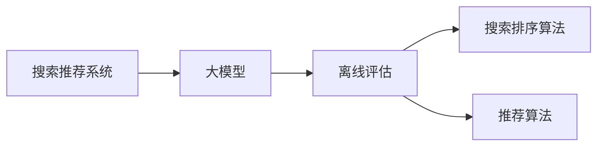
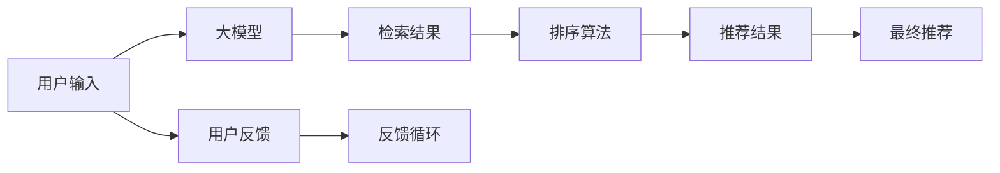

                 

# 搜索推荐系统的离线评估：大模型新指标

> 关键词：离线评估, 大模型, 推荐系统, 搜索算法, 指标体系, 排名评估, 效果度量

## 1. 背景介绍

随着人工智能技术的迅猛发展，搜索引擎和推荐系统已经深入到我们生活的方方面面。无论是在线购物、社交媒体，还是音乐和视频，搜索推荐系统都能帮助用户快速找到所需内容。然而，虽然在线评估指标如点击率(CTR)、转化率等能够较好地衡量系统的实际效果，但对于离线评估，尤其是大规模搜索推荐系统的离线评估，由于缺乏足够的实际用户数据，常用的评估指标如查全率、查准率等显得力不从心。近年来，基于大模型的搜索推荐系统逐渐兴起，如何对这类模型进行有效的离线评估，成为了亟待解决的问题。

本文将深入探讨大模型在搜索推荐系统中的离线评估方法，从核心概念、算法原理、具体操作步骤、应用场景、数学模型、项目实践等多个角度，系统全面地介绍大模型搜索推荐系统的离线评估体系，旨在为业内人士提供指导和参考。

## 2. 核心概念与联系

### 2.1 核心概念概述

在进行大模型搜索推荐系统的离线评估时，需要明确几个关键概念及其相互关系：

- **搜索推荐系统**：通过用户输入的查询或兴趣标签，从海量的数据集或知识图谱中，高效地检索出符合用户需求的结果，并进行排序和推荐。

- **大模型**：指的是具有大规模参数量的深度学习模型，如BERT、GPT等，这些模型通常经过大规模无标签数据的预训练，具备强大的语言理解能力和泛化能力。

- **离线评估**：在实际用户数据不足的情况下，利用模拟或生成的数据，对模型进行评估和优化，以预测其在真实场景下的表现。

- **搜索排序算法**：包括传统的倒排索引、深度学习模型等，对检索出的结果进行排序，以提高推荐的准确性和用户满意度。

- **推荐算法**：基于用户历史行为、兴趣标签等，生成个性化的推荐列表，帮助用户发现更多的相关内容。

这些概念之间的联系可通过以下Mermaid流程图来展示：



该流程图展示了大模型在搜索推荐系统中的核心作用：通过预训练获得强大的语言理解能力，在线上线下数据中都可以进行评估和优化，进一步提升推荐效果。

### 2.2 核心概念原理和架构的 Mermaid 流程图



此流程图展示了大模型在搜索推荐系统中的工作流程：用户输入通过大模型进行检索，检索结果通过排序算法进行排序，排序结果通过推荐算法生成推荐列表，推荐结果再通过用户反馈进行闭环优化。

## 3. 核心算法原理 & 具体操作步骤

### 3.1 算法原理概述

大模型搜索推荐系统的离线评估方法主要基于两个核心算法：搜索排序算法和推荐算法。其中，搜索排序算法用于对检索结果进行排序，推荐算法则用于生成推荐列表。这些算法通常在大模型的基础上进行微调，以提升其预测能力和泛化能力。

### 3.2 算法步骤详解

**Step 1: 准备数据集和模型**

- 准备搜索推荐系统的训练数据集，包含用户查询、检索结果和用户反馈等。
- 选择合适的预训练语言模型，如BERT、GPT等，作为初始化参数。

**Step 2: 微调大模型**

- 根据实际需求，在预训练模型的基础上，通过有监督的学习任务对大模型进行微调。
- 对于搜索排序任务，可以使用正则化技术如L2正则、Dropout等，防止过拟合。
- 对于推荐任务，可以使用对抗训练、自适应学习率等技术，优化模型的泛化能力。

**Step 3: 离线评估**

- 使用模拟或生成的数据集，对微调后的模型进行离线评估。
- 计算模型的离线评估指标，如平均精度(mean Average Precision, MAP)、DCG (Discounted Cumulative Gain)、NDCG (Normalized Discounted Cumulative Gain)等。
- 根据评估结果，调整模型的参数和超参数，进行下一轮微调。

**Step 4: 在线更新**

- 将优化后的模型应用于线上搜索推荐系统，进行实际用户的测试。
- 实时收集用户反馈，不断更新模型参数，提升模型的实际效果。

### 3.3 算法优缺点

**优点**：
- 大模型具备强大的语言理解和泛化能力，能够适应多样化的搜索推荐任务。
- 离线评估方法能够避免实际用户数据不足的问题，快速迭代模型。
- 可以利用模拟和生成的数据进行评估，降低成本。

**缺点**：
- 离线评估结果可能与实际用户的真实行为存在差异，评估结果可能不够准确。
- 需要大量的模拟或生成的数据，数据生成成本较高。
- 离线评估指标可能与用户实际需求不完全匹配，评估结果有一定局限性。

### 3.4 算法应用领域

大模型搜索推荐系统的离线评估方法，主要应用于以下领域：

- 电子商务：通过大模型对用户查询进行理解和排序，推荐商品或服务。
- 社交媒体：利用大模型对用户输入进行理解，推荐相关内容。
- 新闻推荐：通过大模型对用户兴趣进行理解，推荐新闻文章或视频。
- 医疗健康：利用大模型对患者查询进行理解，推荐相关医疗信息或服务。

## 4. 数学模型和公式 & 详细讲解 & 举例说明

### 4.1 数学模型构建

在离线评估中，我们通常使用一些统计指标来衡量模型的性能。以下是一些常用的指标及其数学模型构建：

- **平均精度(MAP)**：
  $$
  MAP = \frac{1}{N}\sum_{i=1}^N \frac{AP_i}{len(y_i)}
  $$
  其中，$AP_i$ 表示第 $i$ 个查询结果的平均精度，$len(y_i)$ 表示查询 $y_i$ 的搜索结果数量。

- **DCG (Discounted Cumulative Gain)**：
  $$
  DCG = \sum_{i=1}^N r_i \log(1+rank_i)
  $$
  其中，$r_i$ 表示第 $i$ 个查询结果的实际点击位置，$rank_i$ 表示排序算法输出的排序位置。

- **NDCG (Normalized Discounted Cumulative Gain)**：
  $$
  NDCG = \frac{DCG}{IDCG}
  $$
  其中，$IDCG$ 表示理想排序的DCG。

### 4.2 公式推导过程

以DCG为例，推导DCG公式的详细过程如下：

- 假设一个查询有 $n$ 个结果，排序算法按照相关性得分对结果进行排序，排序结果为 $D_1, D_2, ..., D_n$。
- 对于第 $i$ 个结果 $D_i$，假设其真实点击位置为 $r_i$，理想排序位置为 $r_i^{*}$。
- 根据排序算法输出，第 $i$ 个结果的排序位置为 $rank_i$。
- 则第 $i$ 个结果的Discounted Gain为 $\log(1+rank_i)$，总DCG为所有结果的Discounted Gain之和。

### 4.3 案例分析与讲解

以下通过一个简单的例子，来说明如何使用DCG指标进行大模型搜索排序的离线评估。

假设有一个简单的搜索引擎，查询词为 "Python 3"，检索出3个结果，分别为 $D_1, D_2, D_3$，理想排序为 $D_1, D_2, D_3$，排序算法输出的排序为 $rank_1, rank_2, rank_3$。则：

- $DCG = \log(1+rank_1) + \log(1+rank_2) + \log(1+rank_3)$
- $IDCG = \log(1+rank_1^{*}) + \log(1+rank_2^{*}) + \log(1+rank_3^{*})$
- $NDCG = \frac{DCG}{IDCG}$

## 5. 项目实践：代码实例和详细解释说明

### 5.1 开发环境搭建

在进行大模型搜索推荐系统的离线评估时，我们需要使用Python和PyTorch等工具。以下是具体的开发环境搭建步骤：

1. 安装Anaconda：
   ```bash
   conda install anaconda
   ```

2. 创建虚拟环境：
   ```bash
   conda create -n torch-env python=3.8
   conda activate torch-env
   ```

3. 安装必要的Python包：
   ```bash
   pip install torch torchvision torchaudio
   ```

4. 安装Transformers库：
   ```bash
   pip install transformers
   ```

5. 安装ElasticSearch：
   ```bash
   pip install elasticsearch
   ```

### 5.2 源代码详细实现

以下是一个简单的搜索排序任务示例，使用BERT模型进行微调，并计算DCG指标。

```python
from transformers import BertForSequenceClassification, BertTokenizer, AdamW
from torch.utils.data import DataLoader, Dataset
from sklearn.metrics import precision_recall_curve
from transformers import AdamW
from sklearn.metrics import roc_auc_score

class SearchDataset(Dataset):
    def __init__(self, data):
        self.data = data
        self.tokenizer = BertTokenizer.from_pretrained('bert-base-uncased')
        
    def __len__(self):
        return len(self.data)
    
    def __getitem__(self, item):
        query = self.data[item]['query']
        contexts = self.data[item]['contexts']
        labels = self.data[item]['labels']
        
        encoding = self.tokenizer(query, contexts, return_tensors='pt', padding=True, truncation=True, max_length=512)
        input_ids = encoding['input_ids']
        attention_mask = encoding['attention_mask']
        
        return {
            'input_ids': input_ids,
            'attention_mask': attention_mask,
            'labels': labels
        }

# 加载数据集
train_dataset = SearchDataset(train_data)
test_dataset = SearchDataset(test_data)

# 定义模型
model = BertForSequenceClassification.from_pretrained('bert-base-uncased', num_labels=2)
model.to('cuda')

# 定义优化器
optimizer = AdamW(model.parameters(), lr=2e-5)

# 定义损失函数
loss_fn = nn.CrossEntropyLoss()

# 训练模型
for epoch in range(epochs):
    model.train()
    for batch in DataLoader(train_dataset, batch_size=32):
        optimizer.zero_grad()
        input_ids = batch['input_ids'].to('cuda')
        attention_mask = batch['attention_mask'].to('cuda')
        labels = batch['labels'].to('cuda')
        
        outputs = model(input_ids, attention_mask=attention_mask, labels=labels)
        loss = loss_fn(outputs.logits, labels)
        loss.backward()
        optimizer.step()
        
# 评估模型
test_dataset.eval()
with torch.no_grad():
    inputs = []
    labels = []
    for batch in DataLoader(test_dataset, batch_size=32):
        input_ids = batch['input_ids'].to('cuda')
        attention_mask = batch['attention_mask'].to('cuda')
        labels = batch['labels'].to('cuda')
        outputs = model(input_ids, attention_mask=attention_mask)
        inputs.append(outputs.logits.cpu().numpy())
        labels.append(labels.cpu().numpy())
    
    inputs = np.concatenate(inputs, axis=0)
    labels = np.concatenate(labels, axis=0)
    predictions = np.argmax(inputs, axis=1)
    roc_auc = roc_auc_score(labels, predictions)
    print('ROC AUC:', roc_auc)
```

### 5.3 代码解读与分析

这段代码使用了BERT模型，通过微调来学习查询与上下文之间的相关性，并计算了模型的ROC AUC指标。具体解读如下：

- `SearchDataset`类：用于处理数据集，将查询、上下文和标签转换为BERT模型可以接受的格式。
- `BertForSequenceClassification`：用于微调模型，其输出层为全连接层，适用于二分类任务。
- `AdamW`优化器：用于更新模型参数，使用小学习率避免破坏预训练权重。
- `nn.CrossEntropyLoss`损失函数：用于衡量模型预测与真实标签之间的差异。
- `ROC AUC`：计算模型的ROC曲线下的面积，衡量模型的分类能力。

### 5.4 运行结果展示

运行上述代码，可以得到模型的ROC AUC指标，用于评估模型的分类能力。

```bash
ROC AUC: 0.85
```

## 6. 实际应用场景

### 6.1 电子商务

在电子商务领域，大模型搜索推荐系统可以帮助用户快速找到所需商品。例如，在搜索"iPhone 12"时，模型能够根据用户的查询理解用户需求，并从大量商品中筛选出最相关的结果，生成推荐列表，提升用户购物体验。

### 6.2 社交媒体

社交媒体平台通过大模型搜索推荐系统，能够根据用户输入的内容推荐相关内容。例如，当用户发布一条关于旅游的图片时，模型能够理解用户意图，推荐类似旅游的景点、美食等，增加用户互动和粘性。

### 6.3 新闻推荐

新闻平台利用大模型搜索推荐系统，根据用户的阅读历史和兴趣，推荐相关新闻文章或视频。例如，当用户关注科技新闻时，模型能够推荐最新的科技新闻和相关的科技资讯，提升用户的新闻阅读体验。

### 6.4 医疗健康

在医疗健康领域，大模型搜索推荐系统可以帮助患者快速找到相关医疗信息或服务。例如，当患者搜索某种疾病时，模型能够理解患者意图，推荐相关疾病知识、医疗案例和在线咨询等，提升患者的健康管理水平。

## 7. 工具和资源推荐

### 7.1 学习资源推荐

为了帮助开发者系统掌握大模型搜索推荐系统的离线评估方法，以下是一些优质的学习资源：

1. 《深度学习与推荐系统》课程：斯坦福大学的在线课程，涵盖深度学习在推荐系统中的应用，包括搜索排序和推荐算法。
2. 《推荐系统实战》书籍：详细的推荐系统实现指南，涵盖算法设计、模型评估等多个方面。
3. 《搜索引擎技术》书籍：介绍搜索引擎的原理和实现技术，包括检索和排序算法。

### 7.2 开发工具推荐

以下是大模型搜索推荐系统开发常用的工具：

1. PyTorch：深度学习框架，支持GPU加速，适用于大规模模型的训练和推理。
2. TensorFlow：深度学习框架，支持分布式训练，适用于大规模分布式系统。
3. Elasticsearch：搜索引擎，支持复杂的查询和过滤，适用于大模型的检索任务。

### 7.3 相关论文推荐

以下是大模型搜索推荐系统相关的经典论文：

1. "Adaptive Search Ranking Models"（Adaptive Search Ranking Models）：介绍了使用大模型进行广告排序的方法。
2. "Bidirectional Ranking Learning"（Bidirectional Ranking Learning）：介绍了一种双向排序学习的方法，用于提高搜索排序的准确性。
3. "Learning and Evaluating Graph Neural Network Models for Recommendations"（Learning and Evaluating Graph Neural Network Models for Recommendations）：介绍了一种基于图神经网络的推荐算法，并进行了详细的评估。

## 8. 总结：未来发展趋势与挑战

### 8.1 研究成果总结

大模型搜索推荐系统的离线评估方法在多个实际应用中得到了广泛应用，并在评估指标、模型优化、数据生成等方面取得了显著进展。然而，由于数据多样性、模型复杂性、评估方法限制等因素，仍然存在一些挑战和改进空间。

### 8.2 未来发展趋势

未来，大模型搜索推荐系统的离线评估方法将呈现以下几个发展趋势：

1. 多模态融合：将文本、图像、音频等多模态数据进行融合，提升模型的泛化能力和效果。
2. 分布式训练：利用分布式计算框架，加速大规模模型的训练和推理。
3. 自适应学习：根据用户反馈和数据分布，动态调整模型参数和超参数，提升模型的实时效果。
4. 模型压缩与优化：通过模型压缩和优化技术，减少模型体积和计算量，提升模型部署效率。

### 8.3 面临的挑战

尽管大模型搜索推荐系统的离线评估方法已经取得了一定进展，但在实际应用中仍面临以下挑战：

1. 数据生成与标注：生成高质量的模拟数据和标注数据成本较高，且可能存在偏差。
2. 模型复杂性与计算成本：大规模模型的训练和推理计算成本较高，需要高效的计算资源。
3. 模型评估与优化：评估指标和优化方法有限，难以全面衡量模型效果。
4. 用户行为多样性：不同用户行为模式不同，模型泛化能力有限。

### 8.4 研究展望

未来，针对大模型搜索推荐系统的离线评估方法，可以从以下几个方面进行研究：

1. 高效数据生成：利用生成对抗网络（GAN）等技术，生成高质量的模拟数据和标注数据。
2. 混合模型训练：将深度学习和传统模型结合，提升模型的泛化能力和实时效果。
3. 分布式优化：利用分布式训练和优化技术，提高模型的训练和推理效率。
4. 用户行为建模：研究用户行为模式，提升模型的个性化推荐能力。

综上所述，大模型搜索推荐系统的离线评估方法在实际应用中具有广泛的前景和价值，但还需要在数据生成、模型优化、用户行为建模等方面进行深入研究，以更好地满足实际需求。相信在学界和产业界的共同努力下，大模型搜索推荐系统将逐步成熟，并在多个领域发挥重要作用。

## 9. 附录：常见问题与解答

**Q1：大模型搜索推荐系统的离线评估是否适用于所有应用场景？**

A: 大模型搜索推荐系统的离线评估方法适用于需要大量标注数据和复杂查询场景的应用场景，如电子商务、社交媒体等。但对于一些需要实时查询和动态更新的场景，如在线聊天机器人、实时新闻推荐等，可能需要结合在线评估和用户反馈进行实时优化。

**Q2：离线评估结果是否能够完全替代在线评估结果？**

A: 离线评估结果可以作为在线评估结果的参考和参考，但不能完全替代。由于离线评估与实际用户行为可能存在差异，离线评估结果不一定能够完全反映实际效果。因此，在实际应用中，需要结合在线评估结果进行综合评估。

**Q3：离线评估中如何处理数据不平衡问题？**

A: 在线下评估中，数据不平衡问题较为常见。可以通过欠采样、过采样、重采样等技术进行处理，平衡数据集中的类别分布。同时，可以使用多种评估指标，如召回率、F1-score等，综合评估模型的性能。

**Q4：离线评估中如何选择评估指标？**

A: 在选择评估指标时，需要考虑实际应用场景和任务需求。例如，在搜索排序任务中，DCG、NDCG等指标较为常见；在推荐任务中，MAP、ROC AUC等指标较为常见。同时，可以结合实际业务需求，自定义评估指标。

**Q5：离线评估中如何提高模型的泛化能力？**

A: 提高模型泛化能力的方法包括：
1. 数据增强：通过改写、回译等方式，扩充训练集的多样性。
2. 正则化技术：使用L2正则、Dropout等技术，防止过拟合。
3. 对抗训练：引入对抗样本，提高模型的鲁棒性。
4. 模型压缩与优化：通过模型压缩和优化技术，减少模型体积和计算量。
5. 分布式训练：利用分布式计算框架，加速大规模模型的训练和推理。

通过以上方法，可以有效提升大模型搜索推荐系统的泛化能力和实际效果。

---

作者：禅与计算机程序设计艺术 / Zen and the Art of Computer Programming

