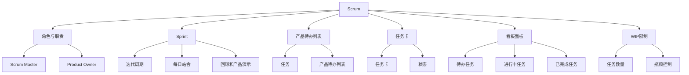

                 

# 敏捷开发方法：Scrum与看板方法

> 关键词：敏捷开发, Scrum, 看板, 项目管理, 软件开发生命周期, 迭代, 持续集成, 持续交付

## 1. 背景介绍

敏捷开发(Agile Development)是一种以人为本的开发模式，旨在快速响应客户需求变化，以缩短项目周期，提升开发效率。随着软件行业的快速发展，敏捷方法论逐渐成为业界主流，Scrum和看板(Kanban)方法作为敏捷开发的两个重要分支，广泛应用于项目管理、软件开发、产品设计和用户体验改进等多个领域。

### 1.1 问题由来
在传统的瀑布开发模型中，软件项目严格按照计划分阶段推进，每一阶段完成后再进行下一阶段。然而，随着市场需求的快速变化和客户反馈的不断迭代，瀑布模型已难以满足现代软件开发的要求。敏捷开发理念应运而生，它强调以客户为中心，团队成员紧密协作，快速迭代，以应对市场需求的变化。

敏捷开发的核心在于通过迭代式增量开发，将大项目拆分成若干小的可交付功能，以快速交付并不断优化产品。其中，Scrum和看板方法是最常用的两种敏捷开发方法，它们在提高团队协作、提升项目效率、增强客户满意度等方面发挥了重要作用。

### 1.2 问题核心关键点
敏捷开发的核心在于灵活应对变化，提升团队协作和交付速度。Scrum和看板方法作为敏捷开发的两种经典范式，具有以下共同点：

1. **迭代开发**：将项目分解为若干迭代周期，每次迭代完成一定量的功能交付。
2. **客户参与**：在迭代周期中，客户可以频繁参与项目评审，及时反馈需求变化。
3. **持续改进**：每次迭代结束时，团队进行回顾总结，优化流程，提升效率。
4. **自组织团队**：赋予团队成员更多的自主权，鼓励跨职能协作。

Scrum和看板方法的主要区别在于工作方式和时间管理的不同。Scrum侧重于定期的迭代和Sprint，而看板则侧重于流程管理和可视化的工作进展。

## 2. 核心概念与联系

### 2.1 核心概念概述

为更好地理解Scrum和看板方法的原理和架构，本节将介绍几个密切相关的核心概念：

- **Scrum**：一种敏捷开发框架，强调通过Scrum Master和Product Owner的协作，进行定期迭代和Sprint，实现客户需求的高效交付。Scrum框架通过明确角色和职责，提升团队协作效率，加速项目进展。

- **看板(Kanban)**：一种敏捷开发方法，强调通过可视化工作流程和限制在制品(WIP)数量，实现流程管理。看板方法通过任务卡和看板面板，提供实时的工作状态，使团队成员更容易发现问题并及时调整。

- **Sprint**：Scrum框架中的核心概念，指在特定时间周期内，团队集中精力完成一组预定的任务。Sprint周期一般持续1-4周，周期结束后进行回顾和产品演示。

- **任务卡**：看板方法中用来表示具体任务的小卡片，通常包括任务名称、描述、负责人和状态等信息。任务卡在面板上移动，表示任务的进展状态。

- **看板面板**：看板方法中的可视化工具，通常包括待办任务、进行中任务、已完成任务等不同列。看板面板帮助团队成员清晰地看到任务的当前状态和进展。

- **WIP限制**：看板方法中对在制品数量的限制，旨在避免团队成员同时处理过多任务，减少流程瓶颈。

这些核心概念之间的逻辑关系可以通过以下Mermaid流程图来展示：



这个流程图展示了几大敏捷开发方法的核心概念及其之间的关系：

1. Scrum通过角色定义、迭代周期、每日站会等机制，确保团队高效协作。
2. 看板方法通过任务卡和看板面板，提供实时的工作进展，帮助团队发现并解决问题。
3. Sprint是Scrum框架的核心，通过固定时间周期的迭代，实现客户需求的高效交付。
4. 角色和职责是Scrum框架的基础，通过明确团队成员的职责，确保高效协作。
5. 任务卡和看板面板是看板方法的核心，提供实时的工作状态，促进透明和持续改进。
6. WIP限制是看板方法的重要策略，旨在避免流程瓶颈，提升效率。

这些概念共同构成了敏捷开发方法的框架，使团队能够灵活应对变化，高效交付价值。

## 3. 核心算法原理 & 具体操作步骤
### 3.1 算法原理概述

Scrum和看板方法的核心在于通过迭代周期、每日站会、回顾会议等机制，提升团队协作效率，快速响应变化。这些机制的核心思想是：

- 通过迭代周期(Sprint)，将大项目拆分为多个小的可交付功能，在每次迭代中完成一定量的任务。
- 通过每日站会，保持团队成员的沟通，及时发现和解决问题，确保任务进展透明。
- 通过回顾会议，团队总结经验，发现问题，优化流程，提升效率。

Scrum和看板方法的具体操作步骤如下：

**Scrum操作步骤**：

1. **角色与职责**：定义Scrum Master、Product Owner和开发团队的角色与职责，确保团队协作高效。
2. **产品待办列表**：由Product Owner维护产品待办列表，优先级排序，确保高价值功能的优先交付。
3. **Sprint计划**：开发团队与Product Owner共同制定Sprint计划，明确迭代周期内的任务和目标。
4. **每日站会**：团队成员每天早上举行站会，更新任务状态，讨论进展和阻碍。
5. **Sprint执行**：开发团队按照Sprint计划执行任务，每日站会持续跟进进展。
6. **Sprint评审**：每次迭代结束时，团队进行产品评审，展示Sprint成果。
7. **回顾会议**：团队总结Sprint，回顾经验，发现问题，制定改进计划。

**看板操作步骤**：

1. **任务卡与看板面板**：创建任务卡，定义任务名称、描述、负责人等信息，放置在看板面板上。
2. **工作流程定义**：定义看板面板的工作流程，包括待办任务、进行中任务、已完成任务等列。
3. **WIP限制**：设置每个任务在制品的数量限制，避免任务积压。
4. **任务移动**：团队成员根据任务进展，将任务卡在不同列间移动，更新任务状态。
5. **每日回顾**：团队成员每天查看任务进展，及时调整计划。
6. **周期回顾**：周期结束后，团队总结经验，优化流程。

### 3.2 算法步骤详解

**Scrum操作步骤详解**：

1. **角色与职责**：
    - Scrum Master：负责敏捷实践的监督和指导，确保Scrum流程的顺利执行。
    - Product Owner：负责产品需求的定义和管理，确保高价值功能的优先交付。
    - 开发团队：负责软件开发和任务执行，确保任务按时完成。
    
2. **产品待办列表**：
    - Product Owner根据客户需求，定义产品待办列表，按优先级排序。
    - 每个任务描述详细，包括任务名称、目标、预期完成时间等。
    
3. **Sprint计划**：
    - 开发团队与Product Owner共同讨论，从产品待办列表中选取任务，组成Sprint Backlog。
    - 明确Sprint目标和任务分配，制定Sprint计划。
    
4. **每日站会**：
    - 每天早上，开发团队和Scrum Master举行站会，更新任务状态。
    - 每个团队成员简要描述昨天的进展、今天的计划和阻碍，确保团队成员之间的沟通和协作。
    
5. **Sprint执行**：
    - 开发团队按照Sprint计划，执行任务，确保任务按时完成。
    - 每日站会持续跟进进展，及时发现和解决问题。
    
6. **Sprint评审**：
    - Sprint结束前，开发团队和Product Owner共同评审Sprint成果，展示完成的任务。
    - Product Owner评估任务完成情况，确认是否满足客户需求。
    
7. **回顾会议**：
    - Sprint结束后，团队进行回顾会议，总结经验，发现问题。
    - 讨论Sprint中遇到的问题，制定改进计划，优化流程。

**看板操作步骤详解**：

1. **任务卡与看板面板**：
    - 创建任务卡，定义任务名称、描述、负责人等信息。
    - 在看板面板上定义工作流程，通常包括待办任务、进行中任务、已完成任务等列。
    
2. **WIP限制**：
    - 根据任务复杂度和工作量，设置每个任务的WIP限制。
    - 避免团队成员同时处理过多任务，减少流程瓶颈。
    
3. **任务移动**：
    - 团队成员根据任务进展，将任务卡在不同列间移动。
    - 从待办任务列移动到进行中任务列，再移动到已完成任务列。
    
4. **每日回顾**：
    - 团队成员每天查看任务进展，及时调整计划。
    - 发现任务积压或阻碍，及时采取措施。
    
5. **周期回顾**：
    - 周期结束后，团队总结经验，优化流程。
    - 讨论任务进展和阻碍，制定改进计划。

### 3.3 算法优缺点

Scrum和看板方法作为敏捷开发的两个重要分支，具有以下优缺点：

**Scrum方法的优点**：
1. 明确角色和职责，提升团队协作效率。
2. 定期迭代和每日站会，及时发现和解决问题。
3. 产品评审和回顾会议，确保客户需求高效交付。

**Scrum方法的缺点**：
1. 需要Scrum Master和Product Owner的角色，可能增加管理成本。
2. 每日站会和回顾会议可能需要较多时间，可能影响团队效率。
3. 对团队成员的技能要求较高，需要较高的沟通和协作能力。

**看板方法的优点**：
1. 任务可视化和WIP限制，帮助团队发现和解决流程瓶颈。
2. 每日回顾和周期回顾，提升团队自我管理和持续改进。
3. 流程简单，易于实施和管理，适合中小型团队。

**看板方法的缺点**：
1. 对任务描述和优先级需要较高的前期准备。
2. 团队成员需要较高的自我管理能力，否则任务进度可能失控。
3. 缺乏明确的迭代周期和计划，可能导致团队成员缺乏方向感。

尽管存在这些局限性，但Scrum和看板方法仍然是目前敏捷开发中最流行和有效的方法之一。

### 3.4 算法应用领域

Scrum和看板方法已经在软件开发、项目管理、产品设计和用户体验改进等多个领域得到了广泛应用，具体如下：

1. **软件开发**：通过Scrum和看板方法，软件开发团队可以高效地迭代开发，快速响应客户需求，提升产品质量和交付速度。
2. **项目管理**：Scrum和看板方法为项目管理提供了有效的工具，帮助项目团队清晰地定义任务和优先级，确保项目按时完成。
3. **产品设计**：看板方法通过可视化工作流程和任务管理，帮助产品团队及时发现和解决问题，提升产品设计和开发的效率。
4. **用户体验改进**：通过敏捷开发方法，团队可以快速迭代产品，收集用户反馈，不断优化用户体验。
5. **市场营销**：敏捷方法帮助市场营销团队快速响应市场变化，及时调整策略，提升品牌和产品竞争力。
6. **客户服务**：敏捷方法使客户服务团队能够更高效地处理客户请求，提升客户满意度和忠诚度。

此外，Scrum和看板方法也适用于各种规模和类型的组织，包括企业、非营利组织、政府机构等。

## 4. 数学模型和公式 & 详细讲解 & 举例说明

### 4.1 数学模型构建

Scrum和看板方法的数学模型较为简单，主要关注时间和任务的管理。下面以看板方法为例，进行详细讲解。

**看板模型构建**：

1. **任务描述**：定义任务的起始状态、进行中状态和完成状态。
2. **WIP限制**：设置每个任务的最大在制品数量。
3. **任务移动**：任务在不同列间移动时，更新状态和数量。
4. **周期时间**：计算周期内每个任务所需的时间。

### 4.2 公式推导过程

**任务描述**：
- 任务名称：$T_i$
- 开始时间：$t_i^{start}$
- 进行中时间：$t_i^{inprogress}$
- 完成时间：$t_i^{done}$

**WIP限制**：
- 任务当前状态：$S_i$（待办、进行中、已完成）
- WIP数量限制：$L$
- 任务数量：$N_i$
- 任务进度：$P_i$

**任务移动**：
- 任务从待办到进行中：$t_i^{start} \rightarrow t_i^{inprogress}$
- 任务从进行中到已完成：$t_i^{inprogress} \rightarrow t_i^{done}$

**周期时间**：
- 周期时间：$T$
- 任务周期时间：$T_i$
- 任务数量：$N_i$

**公式推导**：
$$
T_i = t_i^{done} - t_i^{start}
$$
$$
P_i = \frac{N_i}{L}
$$

**案例分析**：
假设一个团队有5个任务，WIP限制为2，每个任务在完成状态之前需要1周时间。

- 任务1在开始状态，周期时间为1周。
- 任务2在进行中状态，周期时间为1周。
- 任务3在完成状态，周期时间为1周。
- 任务4在待办状态，未开始。
- 任务5在进行中状态，周期时间为1周。

根据公式计算，任务1、2、3、5的周期时间均为1周，任务4的周期时间未知。

任务1在开始状态，未进行移动；
任务2在完成状态，未进行移动；
任务3在完成状态，未进行移动；
任务4在待办状态，未进行移动；
任务5在进行中状态，未进行移动。

最终计算结果为：
$$
T_1 = 1, T_2 = 1, T_3 = 1, T_4 = 0, T_5 = 1
$$

### 4.3 案例分析与讲解

**任务移动和WIP限制**：
看板方法通过任务移动和WIP限制，实现任务可视化和流程管理。

- **任务移动**：任务从待办状态移动到进行中状态，表示任务已开始处理。
- **WIP限制**：限制每个任务的最大在制品数量，避免任务积压。

**周期时间**：
通过计算每个任务的周期时间，可以分析任务的进展情况，优化流程，提升效率。

- **任务周期时间**：表示任务从开始到完成所需的时间。
- **任务数量**：表示周期内需要处理的任务数量。
- **WIP数量限制**：表示每个任务的最大在制品数量。

**周期回顾**：
通过周期回顾，团队可以总结经验，发现问题，制定改进计划。

- **任务进展**：分析周期内每个任务的进展情况，识别瓶颈和障碍。
- **WIP控制**：调整WIP限制，避免任务积压。
- **流程优化**：总结经验，优化任务管理流程。

## 5. 项目实践：代码实例和详细解释说明

### 5.1 开发环境搭建

在进行敏捷开发实践前，我们需要准备好开发环境。以下是使用JIRA和Confluence搭建敏捷开发环境的流程：

1. 安装JIRA：从官网下载并安装JIRA，用于任务管理和敏捷实践。
2. 安装Confluence：从官网下载并安装Confluence，用于文档管理和知识共享。
3. 配置JIRA和Confluence：设置系统管理员、用户角色和权限，确保团队协作顺畅。
4. 创建项目和看板：在JIRA中创建敏捷项目，并配置看板面板，定义工作流程和任务类型。

完成上述步骤后，即可在JIRA和Confluence上进行敏捷开发实践。

### 5.2 源代码详细实现

下面我们以看板方法为例，给出使用JIRA和Confluence进行敏捷开发实践的代码实现。

首先，定义任务和看板：

```python
from jira import JIRA

jira = JIRA('https://jira.example.com', username='user', password='pass')
project_key = 'PROJ'
board_id = '1000'

jira.create_issue(project=project_key, summary='Task1', description='Describe Task1')
jira.create_issue(project=project_key, summary='Task2', description='Describe Task2')

board = jira.get_board(board_id)
for task in board['issues']:
    if task['status'] == 'To Do':
        jira.transition(task, from_id='To Do', to_id='In Progress')
```

然后，配置WIP限制：

```python
jira.create_parameter(name='my_wip_limit', description='My Work in Progress Limit', type='numeric')
jira.add_parameter('my_wip_limit', project_key)
jira.update_board(board_id, max_card_limit=2)
```

最后，进行任务移动：

```python
for task in board['issues']:
    if task['status'] == 'In Progress':
        jira.transition(task, from_id='In Progress', to_id='Done')
```

### 5.3 代码解读与分析

让我们再详细解读一下关键代码的实现细节：

**JIRA和Confluence配置**：
- `jira = JIRA('https://jira.example.com', username='user', password='pass')`：初始化JIRA客户端，连接JIRA系统。
- `jira.create_issue(project=project_key, summary='Task1', description='Describe Task1')`：创建任务1，设置任务标题和描述。

**任务移动和WIP限制**：
- `jira.create_parameter(name='my_wip_limit', description='My Work in Progress Limit', type='numeric')`：创建WIP限制参数。
- `jira.add_parameter('my_wip_limit', project_key)`：将WIP限制参数添加到项目。
- `jira.update_board(board_id, max_card_limit=2)`：设置看板的最大卡片数量限制。

**任务移动**：
- `jira.transition(task, from_id='To Do', to_id='In Progress')`：将任务从待办状态移动到进行中状态。
- `jira.transition(task, from_id='In Progress', to_id='Done')`：将任务从进行中状态移动到已完成状态。

**代码执行结果**：
在执行上述代码后，JIRA中的看板将显示任务1和任务2的进展情况，WIP限制将生效，任务移动操作将被记录。

## 6. 实际应用场景
### 6.1 智能客服系统

基于敏捷开发方法，智能客服系统可以实现高效、灵活的客户服务。传统客服系统需要配备大量人力，高峰期响应缓慢，且客户体验不佳。

在敏捷开发框架下，智能客服系统可以通过Scrum或看板方法进行高效管理：

1. **任务拆分**：将客户服务任务拆分为多个小的可交付功能，每个功能由一组开发团队负责。
2. **每日站会**：团队每天早上举行站会，更新任务状态，讨论进展和阻碍。
3. **周期评审**：每个迭代周期结束后，团队进行产品评审，展示任务成果。
4. **回顾会议**：团队总结经验，发现问题，优化流程。

通过敏捷开发方法，智能客服系统可以快速迭代，满足客户需求，提升客户满意度和忠诚度。

### 6.2 金融舆情监测

金融舆情监测需要实时监测市场舆论动向，以便及时应对负面信息传播，规避金融风险。传统的人工监测方式成本高、效率低，难以应对网络时代海量信息爆发的挑战。

在敏捷开发框架下，金融舆情监测可以通过Scrum或看板方法进行高效管理：

1. **任务拆分**：将舆情监测任务拆分为多个小的可交付功能，每个功能由一组开发团队负责。
2. **每日站会**：团队每天早上举行站会，更新任务状态，讨论进展和阻碍。
3. **周期评审**：每个迭代周期结束后，团队进行产品评审，展示任务成果。
4. **回顾会议**：团队总结经验，发现问题，优化流程。

通过敏捷开发方法，金融舆情监测系统可以快速响应市场变化，及时发现和处理负面信息，降低金融风险。

### 6.3 个性化推荐系统

个性化推荐系统需要高效地处理大量用户数据，快速推荐个性化内容，提升用户体验。传统系统往往依赖复杂算法，难以快速迭代。

在敏捷开发框架下，个性化推荐系统可以通过Scrum或看板方法进行高效管理：

1. **任务拆分**：将推荐系统任务拆分为多个小的可交付功能，每个功能由一组开发团队负责。
2. **每日站会**：团队每天早上举行站会，更新任务状态，讨论进展和阻碍。
3. **周期评审**：每个迭代周期结束后，团队进行产品评审，展示任务成果。
4. **回顾会议**：团队总结经验，发现问题，优化流程。

通过敏捷开发方法，个性化推荐系统可以快速迭代，不断优化推荐算法，提升推荐效果和用户满意度。

### 6.4 未来应用展望

随着敏捷开发方法不断成熟，基于Scrum和看板方法的开发将在更多领域得到应用，为各行各业带来变革性影响。

在智慧医疗领域，敏捷开发方法可以应用于医疗问答、病历分析、药物研发等应用，提升医疗服务的智能化水平。

在智能教育领域，敏捷开发方法可以应用于作业批改、学情分析、知识推荐等方面，因材施教，促进教育公平。

在智慧城市治理中，敏捷开发方法可以应用于城市事件监测、舆情分析、应急指挥等环节，提高城市管理的自动化和智能化水平。

此外，在企业生产、社会治理、文娱传媒等众多领域，基于敏捷开发方法的人工智能应用也将不断涌现，为经济社会发展注入新的动力。

## 7. 工具和资源推荐
### 7.1 学习资源推荐

为了帮助开发者系统掌握敏捷开发方法的理论基础和实践技巧，这里推荐一些优质的学习资源：

1. Scrum官方文档：Scrum的官方网站提供了丰富的文档和指南，介绍了Scrum的核心概念和操作步骤。

2. Kanban官方文档：看板方法的官方网站提供了详细的文档和教程，介绍了看板的核心思想和应用实践。

3. Scrum基础课程：Udemy、Coursera等平台提供了丰富的Scrum基础课程，帮助初学者快速上手。

4. Kanban实践指南：David J. Anderson的《Kanban: Successful Evolutionary Change for Your Technology Business》一书，详细介绍了看板方法的实践指南和案例分析。

5. Agile开发工具：Atlassian的JIRA、Confluence等工具，提供了丰富的敏捷开发功能，支持Scrum和看板方法的实践。

6. Scrum敏捷转型：Scrum.org的Scrum敏捷转型指南，帮助企业从传统项目管理转型为敏捷开发。

通过对这些资源的学习实践，相信你一定能够快速掌握敏捷开发方法的核心要义，并用于解决实际的NLP问题。

### 7.2 开发工具推荐

高效的开发离不开优秀的工具支持。以下是几款用于敏捷开发开发的常用工具：

1. JIRA：用于任务管理和敏捷实践的领先工具，支持Scrum和看板方法。

2. Confluence：用于文档管理和知识共享的协作平台，支持文档编辑、版本控制等。

3. Trello：用于看板管理的工作流程工具，支持任务可视化和WIP限制。

4. Slack：用于团队沟通和协作的平台，支持即时消息、文件共享等。

5. Google Docs：用于团队协作的文档编辑工具，支持多人实时编辑、评论等。

6. Zoom：用于远程会议和视频通话的工具，支持团队协作和沟通。

合理利用这些工具，可以显著提升敏捷开发任务的开发效率，加快创新迭代的步伐。

### 7.3 相关论文推荐

敏捷开发方法自诞生以来，一直是软件工程领域的研究热点。以下是几篇奠基性的相关论文，推荐阅读：

1. Agile Manifesto：敏捷开发的宣言，介绍了敏捷开发的核心理念和原则。

2. Agile Project Management with Scrum：Ken Schwaber的《Agile Project Management with Scrum》一书，详细介绍了Scrum方法的实践指南和案例分析。

3. Kanban: Successful Evolutionary Change for Your Technology Business：David J. Anderson的《Kanban: Successful Evolutionary Change for Your Technology Business》一书，详细介绍了看板方法的实践指南和案例分析。

4. Agile Estimating and Planning: A Practical Guide：Mike Cohn的《Agile Estimating and Planning: A Practical Guide》一书，详细介绍了敏捷估算和计划的方法和技巧。

5. Agile Retrospectives: Facilitating Effective Scrum Retrospectives：Martin Ringleant的《Agile Retrospectives: Facilitating Effective Scrum Retrospectives》一书，详细介绍了敏捷回顾会议的实践指南和案例分析。

这些论文代表了大规模语言模型微调技术的发展脉络。通过学习这些前沿成果，可以帮助研究者把握学科前进方向，激发更多的创新灵感。

## 8. 总结：未来发展趋势与挑战

### 8.1 总结

本文对Scrum和看板方法进行了全面系统的介绍。首先阐述了敏捷开发方法的背景和意义，明确了Scrum和看板方法在提升团队协作、提升项目效率、增强客户满意度等方面的独特价值。其次，从原理到实践，详细讲解了Scrum和看板方法的核心操作步骤，给出了敏捷开发任务开发的完整代码实例。同时，本文还广泛探讨了敏捷开发方法在智能客服、金融舆情、个性化推荐等多个行业领域的应用前景，展示了敏捷开发方法的巨大潜力。此外，本文精选了敏捷开发方法的各类学习资源，力求为读者提供全方位的技术指引。

通过本文的系统梳理，可以看到，敏捷开发方法已经成为软件开发领域的重要范式，极大地提升了团队的协作效率和项目交付速度，满足了市场快速变化的需求。未来，伴随敏捷开发方法的不断演进，相信软件开发将更加灵活、高效、透明，推动企业数字化转型的进程。

### 8.2 未来发展趋势

展望未来，敏捷开发方法将呈现以下几个发展趋势：

1. 敏捷开发工具的持续创新。随着技术的不断进步，敏捷开发工具将提供更多的功能和扩展，进一步提升开发效率和协作体验。
2. 敏捷开发方法的全球化和标准化。敏捷开发方法在国际上得到广泛应用，将逐步形成行业标准，促进全球范围内的协作和交流。
3. 敏捷开发方法的行业定制化。根据不同行业的需求，敏捷开发方法将进行更加精细的定制和优化，提升行业应用效果。
4. 敏捷开发方法的自动化和智能化。引入AI和ML技术，自动生成敏捷开发计划和任务，提升敏捷开发的智能化水平。
5. 敏捷开发方法的生态化。敏捷开发方法将与其他软件开发技术如DevOps、微服务、容器化等进行更加深入的融合，构建完整的软件开发生态系统。

这些趋势凸显了敏捷开发方法的广阔前景，为软件开发带来了更多的创新和可能。

### 8.3 面临的挑战

尽管敏捷开发方法已经取得了显著成就，但在迈向更加智能化、普适化应用的过程中，它仍面临诸多挑战：

1. 敏捷开发工具的复杂性。随着功能越来越多，敏捷开发工具的操作和维护成本也会随之增加。
2. 敏捷开发方法的适用性。敏捷开发方法在面对复杂、高风险项目时，可能无法完全满足需求。
3. 敏捷开发方法的规范性。敏捷开发方法的实施需要高度规范化和标准化，否则可能无法发挥其真正效用。
4. 敏捷开发方法的成本。敏捷开发方法的实施需要投入大量人力和时间，成本较高。
5. 敏捷开发方法的推广。敏捷开发方法的普及度还不够高，需要更多培训和推广。

尽管存在这些挑战，但敏捷开发方法的核心理念和实践方法仍然具有重要价值。只有不断探索和改进，才能更好地应对这些挑战，实现敏捷开发的持续发展和创新。

### 8.4 研究展望

面对敏捷开发方法所面临的挑战，未来的研究需要在以下几个方面寻求新的突破：

1. 敏捷开发工具的简化和优化。简化敏捷开发工具的界面和操作，优化其功能和扩展，提升用户体验。
2. 敏捷开发方法的行业适配。根据不同行业的特点，对敏捷开发方法进行精细化的定制和优化，提升行业应用效果。
3. 敏捷开发方法的规范化和标准化。制定行业标准和规范，提升敏捷开发方法的实施效果。
4. 敏捷开发方法的智能化和自动化。引入AI和ML技术，自动生成敏捷开发计划和任务，提升敏捷开发的智能化水平。
5. 敏捷开发方法的生态化。敏捷开发方法将与其他软件开发技术如DevOps、微服务、容器化等进行更加深入的融合，构建完整的软件开发生态系统。

这些研究方向的探索，必将引领敏捷开发方法迈向更高的台阶，为软件开发带来更多的创新和可能。面向未来，敏捷开发方法还需要与其他软件开发技术进行更深入的融合，共同推动软件开发技术的进步。

## 9. 附录：常见问题与解答

**Q1：Scrum和看板方法的主要区别是什么？**

A: Scrum和看板方法的主要区别在于工作方式和时间管理的不同。

Scrum方法侧重于定期的迭代和Sprint，通过每日站会和回顾会议，确保团队高效协作和客户需求的高效交付。

看板方法侧重于流程管理和可视化的工作进展，通过任务卡和看板面板，提供实时的工作状态，使团队成员更容易发现问题并及时调整。

**Q2：Scrum和看板方法如何适应不同的团队规模？**

A: Scrum和看板方法可以适应不同的团队规模。

Scrum方法适用于较大的团队，通过角色定义和Sprint周期，确保团队协作高效，同时通过每日站会和回顾会议，及时发现和解决问题。

看板方法适用于较小的团队，通过任务卡和看板面板，提供实时的工作状态，使团队成员更容易发现问题并及时调整。

**Q3：如何选择合适的敏捷开发方法？**

A: 选择合适的敏捷开发方法需要考虑多个因素。

1. 团队规模：较大的团队适合Scrum方法，较小的团队适合看板方法。
2. 任务复杂度：复杂的任务适合Scrum方法，简单的任务适合看板方法。
3. 客户需求变化：客户需求变化快的项目适合Scrum方法，客户需求变化慢的项目适合看板方法。
4. 团队协作能力：协作能力强的团队适合Scrum方法，协作能力弱的团队适合看板方法。

综合考虑以上因素，选择合适的敏捷开发方法，才能充分发挥其优势。

**Q4：敏捷开发方法在软件开发中的应用前景如何？**

A: 敏捷开发方法在软件开发中的应用前景非常广阔。

通过敏捷开发方法，软件开发团队可以快速响应客户需求变化，提升开发效率和项目交付速度。

敏捷开发方法通过迭代开发和每日站会，及时发现和解决问题，确保团队协作高效和客户需求的高效交付。

敏捷开发方法在敏捷开发工具和行业规范的支持下，将进一步提升软件开发的质量和效率，推动企业数字化转型的进程。

**Q5：敏捷开发方法与传统瀑布开发模型的区别是什么？**

A: 敏捷开发方法与传统瀑布开发模型的主要区别在于灵活性和响应变化的能力。

敏捷开发方法强调快速迭代和客户反馈，通过每日站会和回顾会议，及时发现和解决问题，确保客户需求的高效交付。

传统瀑布开发模型严格按照计划分阶段推进，每一阶段完成后再进行下一阶段，难以快速响应市场需求变化。

因此，敏捷开发方法更适合市场变化快的项目，而传统瀑布开发模型更适合稳定、需求明确的长期项目。

---

作者：禅与计算机程序设计艺术 / Zen and the Art of Computer Programming

