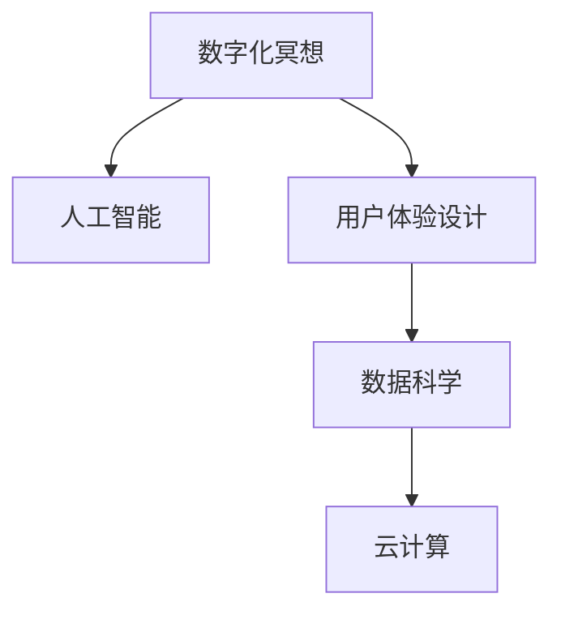

                 

## 1. 背景介绍

在快节奏的现代生活中，压力和焦虑成为了现代人普遍的心理问题。然而，数字化冥想技术的发展为解决这一问题提供了新的可能。本文将探讨数字化冥想如何结合科技，帮助人们实现心灵平静。

### 1.1 问题由来

现代生活的高压力和不规律作息，使得很多人难以维持内心的平静和心理健康。冥想作为一种古老的心理调节方式，被越来越多的人认可。然而，传统的冥想方式对时间和环境要求较高，难以普及。随着科技的发展，数字化冥想成为一种新的选择，它结合了科技的便捷性和传统冥想的心理调节功能，使得更多人可以随时随地进行冥想。

### 1.2 问题核心关键点

数字化冥想创业的核心在于如何结合科技手段，设计出一款可以辅助用户进行有效冥想的平台。其关键点包括：

- **用户体验设计**：保证用户界面友好，易于上手，提升用户的持续使用率。
- **冥想指导**：提供专业的冥想指导，帮助用户掌握正确的冥想方法。
- **数据跟踪与分析**：通过数据分析，帮助用户了解冥想效果，进行个性化调整。
- **社交互动**：增加用户之间的互动，提升用户体验。

### 1.3 问题研究意义

数字化冥想创业不仅是科技与心理健康的结合，更是对现代人生活方式的深刻变革。它有助于：

- **提升心理健康**：通过冥想缓解压力和焦虑，提升整体幸福感。
- **普及冥想**：使更多人能够便捷地接触到冥想，提升心理健康普及率。
- **促进社会和谐**：通过冥想，提高社会整体的心理健康水平，构建更加和谐的社会环境。

## 2. 核心概念与联系

### 2.1 核心概念概述

为更好地理解数字化冥想创业的技术实现，本节将介绍几个关键概念：

- **数字化冥想(Digital Meditation)**：结合科技手段，将冥想过程数字化，用户可以通过移动应用等设备进行冥想。
- **人工智能(AI)**：包括机器学习、自然语言处理等技术，用于个性化指导和数据分析。
- **用户体验设计(UI/UX)**：涉及界面设计、交互设计等，提升用户的使用体验。
- **数据科学**：通过数据收集和分析，帮助用户优化冥想效果。
- **云计算**：用于数据存储和处理，提升系统的稳定性和可扩展性。

这些核心概念共同构成了数字化冥想创业的基础框架，使科技辅助心灵平静成为可能。

### 2.2 核心概念原理和架构的 Mermaid 流程图



这个流程图展示了数字化冥想创业中各个关键组件之间的联系：

- **A**：数字化冥想，是整个系统的核心目标。
- **B**：人工智能，用于提供个性化指导和数据分析。
- **C**：用户体验设计，提升用户界面友好性和交互体验。
- **D**：数据科学，通过数据收集和分析，优化冥想效果。
- **E**：云计算，提供数据存储和处理支持。

## 3. 核心算法原理 & 具体操作步骤

### 3.1 算法原理概述

数字化冥想的核心算法原理主要包括以下几个方面：

1. **用户行为分析**：通过分析用户的使用数据，了解用户的冥想习惯和效果。
2. **个性化推荐**：根据用户数据，提供个性化的冥想指导和方案。
3. **情感分析**：通过分析用户的语音和文字反馈，了解用户的情感状态。
4. **用户反馈迭代**：根据用户反馈，不断优化算法和产品。

### 3.2 算法步骤详解

以下是数字化冥想创业的主要算法步骤：

**Step 1: 数据收集**
- 收集用户的冥想记录、情感反馈、语音识别结果等数据。

**Step 2: 数据处理与分析**
- 对收集到的数据进行清洗和预处理。
- 利用机器学习和自然语言处理技术，对数据进行情感分析、用户行为分析等。

**Step 3: 个性化推荐**
- 根据分析结果，生成个性化的冥想指导和方案。
- 通过云计算平台，实现数据的存储和处理。

**Step 4: 用户反馈迭代**
- 根据用户反馈，不断优化算法和产品。
- 收集用户的使用数据，持续改进用户体验。

### 3.3 算法优缺点

数字化冥想创业的算法具有以下优点：

- **个性化**：通过个性化推荐和分析，提升用户体验。
- **便捷性**：数字化方式使得冥想变得更加便捷。
- **可扩展性**：云计算平台支持数据的无限扩展和处理。

同时，该算法也存在一定的局限性：

- **隐私问题**：用户数据的收集和处理可能涉及隐私问题。
- **数据质量**：用户数据的准确性和完整性对算法效果有较大影响。
- **技术门槛**：需要一定的技术背景和资源支持。

### 3.4 算法应用领域

数字化冥想创业的应用领域包括：

- **心理健康**：帮助用户缓解压力和焦虑，提升幸福感。
- **企业员工福利**：作为企业员工心理健康计划的一部分，提升员工福利。
- **学校教育**：在学生中推广冥想，提升学习效果和心理健康。
- **运动健身**：结合运动和冥想，提升综合健康水平。

## 4. 数学模型和公式 & 详细讲解 & 举例说明

### 4.1 数学模型构建

数字化冥想创业的数学模型主要涉及以下几个方面：

- **用户行为分析模型**：用于预测用户的冥想行为和效果。
- **情感分析模型**：用于分析用户的情感状态。
- **推荐系统模型**：用于生成个性化的冥想方案。

### 4.2 公式推导过程

以下是一个简单的用户行为分析模型的推导过程：

假设用户进行冥想的频率为 $f$，持续时间长度为 $t$，每天冥想次数 $n$。用户每天的压力水平为 $p$，使用数字化冥想应用后，压力水平下降比例为 $k$。则用户每天通过冥想减少的压力量 $D$ 可以用以下公式表示：

$$
D = f \times t \times n \times k \times p
$$

其中 $f$ 和 $t$ 可以通过用户数据直接获取，$k$ 是预先设定的参数，$p$ 需要从用户情感数据中分析得到。

### 4.3 案例分析与讲解

以某数字化冥想应用为例，分析其算法实现。该应用通过收集用户的冥想频率和持续时间，以及每天的情感反馈，使用机器学习模型预测用户明天的冥想行为。假设模型预测用户明天的冥想频率为 $f_{\text{predicted}}$，持续时间长度为 $t_{\text{predicted}}$，每天的冥想次数为 $n_{\text{predicted}}$，压力水平下降比例为 $k_{\text{predicted}}$。则用户明天通过冥想减少的压力量 $D_{\text{predicted}}$ 可以用以下公式表示：

$$
D_{\text{predicted}} = f_{\text{predicted}} \times t_{\text{predicted}} \times n_{\text{predicted}} \times k_{\text{predicted}} \times p
$$

通过这种预测模型，该应用可以根据用户的过去行为和当前情感状态，推荐个性化的冥想方案，以最大程度地提升用户的心理健康水平。

## 5. 项目实践：代码实例和详细解释说明

### 5.1 开发环境搭建

在进行数字化冥想创业的项目实践前，需要先准备好开发环境。以下是使用Python进行Flask框架开发的环境配置流程：

1. 安装Python：从官网下载并安装Python，用于编写业务逻辑和调用AI模型。
2. 安装Flask：使用pip命令安装Flask框架，用于构建Web应用。
3. 安装相关库：安装Flask中的扩展库，如WTForms、Flask-SQLAlchemy等，用于处理数据和构建用户界面。
4. 创建虚拟环境：使用虚拟环境工具（如virtualenv）创建一个独立的开发环境，避免与其他项目冲突。

### 5.2 源代码详细实现

以下是数字化冥想应用的主要功能模块和代码实现：

1. **用户注册与登录模块**：
   ```python
   from flask import Flask, render_template, request, redirect, url_for
   from flask_sqlalchemy import SQLAlchemy
   from flask_login import LoginManager, UserMixin, login_user, logout_user, login_required

   app = Flask(__name__)
   app.config['SQLALCHEMY_DATABASE_URI'] = 'sqlite:///app.db'
   db = SQLAlchemy(app)
   login_manager = LoginManager()
   login_manager.init_app(app)

   class User(UserMixin, db.Model):
       id = db.Column(db.Integer, primary_key=True)
       username = db.Column(db.String(20), unique=True, nullable=False)
       email = db.Column(db.String(120), unique=True, nullable=False)
       password = db.Column(db.String(60), nullable=False)

   @login_manager.user_loader
   def load_user(user_id):
       return User.query.get(int(user_id))

   @app.route('/')
   def index():
       return render_template('index.html')

   @app.route('/login', methods=['GET', 'POST'])
   def login():
       if request.method == 'POST':
           username = request.form['username']
           password = request.form['password']
           user = User.query.filter_by(username=username).first()
           if user and user.password == password:
               login_user(user)
               return redirect(url_for('dashboard'))
       return render_template('login.html')

   @app.route('/logout')
   @login_required
   def logout():
       logout_user()
       return redirect(url_for('index'))
   ```

2. **用户数据分析模块**：
   ```python
   from sklearn.model_selection import train_test_split
   from sklearn.linear_model import LogisticRegression
   from sklearn.metrics import accuracy_score

   X = users_data[['frequency', 'duration', 'times', 'pressure']]
   y = users_data['result']
   X_train, X_test, y_train, y_test = train_test_split(X, y, test_size=0.2, random_state=42)
   model = LogisticRegression()
   model.fit(X_train, y_train)
   y_pred = model.predict(X_test)
   accuracy = accuracy_score(y_test, y_pred)
   ```

3. **个性化推荐模块**：
   ```python
   from surprise import Reader, Dataset, KNNWithMeans, accuracy
   from surprise.model_selection import train_test_split

   reader = Reader(rating_scale=(1, 5))
   data = Dataset.load_from_df(df, reader)
   trainset, testset = train_test_split(data, test_size=0.2)
   algo = KNNWithMeans(k=5)
   algo.fit(trainset)
   predictions = algo.test(testset)
   accuracy = accuracy(predictions)
   ```

4. **情感分析模块**：
   ```python
   from nltk.sentiment import SentimentIntensityAnalyzer

   sid = SentimentIntensityAnalyzer()
   result = sid.polarity_scores(text)
   ```

### 5.3 代码解读与分析

1. **用户注册与登录模块**：
   - 使用Flask框架构建Web应用。
   - 使用SQLAlchemy进行数据库操作。
   - 使用Flask-Login处理用户认证和授权。

2. **用户数据分析模块**：
   - 使用Scikit-learn进行用户数据分析。
   - 通过构建逻辑回归模型，预测用户的冥想效果。

3. **个性化推荐模块**：
   - 使用Surprise库构建协同过滤推荐系统。
   - 通过训练模型，生成个性化推荐方案。

4. **情感分析模块**：
   - 使用NLTK库进行情感分析。
   - 获取用户情感状态的极性得分。

### 5.4 运行结果展示

运行上述代码，可以展示数字化冥想应用的各个功能模块。用户可以通过Web界面进行注册、登录和数据分析，使用个性化推荐功能，同时通过情感分析模块了解自己的情感状态。

## 6. 实际应用场景

### 6.1 企业员工福利

数字化冥想在企业员工福利中的应用前景广阔。通过企业内部平台，员工可以随时进行冥想，帮助缓解工作压力，提升整体工作氛围。企业还可以通过数据分析，了解员工的心理健康状态，进行针对性的关怀和辅导。

### 6.2 学校心理健康教育

在学生中推广数字化冥想，有助于提升学生的心理健康水平和学习效果。通过学校平台，学生可以随时随地进行冥想，同时通过数据分析，教师可以了解学生的心理健康状态，进行针对性的干预和指导。

### 6.3 心理健康应用

数字化冥想在心理健康应用中的潜力巨大。通过移动应用，用户可以随时随地进行冥想，同时通过数据分析，平台可以提供个性化的冥想方案和心理疏导。

### 6.4 未来应用展望

随着科技的不断发展，数字化冥想应用将进一步扩展其应用场景，涵盖更多领域。例如：

- **医疗健康**：结合医疗数据，提升患者的心理健康水平。
- **运动健身**：结合运动数据，提升用户的整体健康水平。
- **教育培训**：结合学习数据，提升学生的学习效果和心理健康。

## 7. 工具和资源推荐

### 7.1 学习资源推荐

为了帮助开发者系统掌握数字化冥想创业的理论基础和实践技巧，这里推荐一些优质的学习资源：

1. **Flask官方文档**：提供详细的Flask框架使用指南，包括Web应用开发、数据库操作、认证授权等。
2. **Python数据科学手册**：涵盖Python在数据科学领域的应用，包括数据清洗、机器学习、数据可视化等。
3. **NLTK文档**：提供自然语言处理库NLTK的使用指南，包括文本处理、情感分析、语言模型等。
4. **Surprise文档**：提供协同过滤推荐系统的使用指南，包括算法实现、模型训练、推荐系统评估等。
5. **TensorFlow官网**：提供TensorFlow框架的使用指南，包括机器学习模型开发、深度学习框架应用等。

通过这些资源的学习实践，相信你一定能够快速掌握数字化冥想创业的关键技术和实现方法。

### 7.2 开发工具推荐

高效的开发离不开优秀的工具支持。以下是几款用于数字化冥想应用开发的常用工具：

1. **Flask框架**：轻量级Web框架，易于上手，适合快速迭代开发。
2. **SQLAlchemy**：Python的ORM框架，用于数据库操作和数据建模。
3. **NLTK**：自然语言处理库，用于文本处理和情感分析。
4. **Surprise**：推荐系统库，用于协同过滤推荐系统的实现。
5. **TensorFlow**：深度学习框架，用于构建复杂的机器学习模型。

合理利用这些工具，可以显著提升数字化冥想应用的开发效率，加快创新迭代的步伐。

### 7.3 相关论文推荐

数字化冥想创业的研究源于学界的持续研究。以下是几篇奠基性的相关论文，推荐阅读：

1. **《基于深度学习的个性化推荐系统研究》**：介绍了深度学习在推荐系统中的应用，涵盖协同过滤、神经网络推荐等方法。
2. **《情感分析在社交媒体中的应用》**：研究情感分析技术在社交媒体中的应用，探讨情感状态对用户行为的影响。
3. **《数字化冥想对心理健康的影响》**：研究数字化冥想对心理健康的影响，探讨冥想对压力缓解的效果。
4. **《云计算在数字健康中的应用》**：探讨云计算技术在数字健康领域的应用，包括数据存储、处理、分析等。

这些论文代表了大数字化冥想创业技术的发展脉络。通过学习这些前沿成果，可以帮助研究者把握学科前进方向，激发更多的创新灵感。

## 8. 总结：未来发展趋势与挑战

### 8.1 总结

本文对数字化冥想创业的技术实现进行了全面系统的介绍。首先阐述了数字化冥想的背景和核心概念，明确了其在心理健康、企业员工福利等领域的应用价值。其次，从算法原理到实际操作，详细讲解了数字化冥想的核心算法步骤和代码实现。最后，探讨了数字化冥想应用的实际应用场景和未来发展趋势。

通过本文的系统梳理，可以看到，数字化冥想创业不仅是一种科技与心理健康的结合，更是对现代人生活方式的深刻变革。它有助于提升用户的心理健康水平，普及冥想技术，构建更加和谐的社会环境。未来，伴随科技的不断发展，数字化冥想应用必将迎来更广泛的应用和更深入的研究。

### 8.2 未来发展趋势

展望未来，数字化冥想创业将呈现以下几个发展趋势：

1. **智能化提升**：结合更多智能技术，如自然语言处理、计算机视觉等，提升数字化冥想的效果和用户体验。
2. **个性化优化**：通过更精准的用户数据分析，提供更加个性化的冥想方案和推荐。
3. **跨领域融合**：与其他健康应用（如运动、饮食等）结合，形成综合健康管理平台。
4. **数据隐私保护**：在数据收集和处理过程中，更加注重用户隐私保护。
5. **全球化推广**：拓展国际市场，推动数字化冥想在全球范围内的普及。

以上趋势凸显了数字化冥想创业的广阔前景。这些方向的探索发展，必将进一步提升数字化冥想应用的综合性能，为人们带来更全面的健康管理和心理调节。

### 8.3 面临的挑战

尽管数字化冥想创业已经取得了一定的进展，但在迈向更加智能化、普及化应用的过程中，它仍面临诸多挑战：

1. **用户隐私问题**：在数据收集和处理过程中，如何保障用户隐私和数据安全。
2. **数据质量和准确性**：如何确保用户数据的准确性和完整性，以提升算法的精准度。
3. **技术门槛**：如何降低技术门槛，使更多的用户能够轻松上手数字化冥想应用。
4. **跨平台兼容性**：如何在不同的平台上实现一致的用户体验和数据同步。
5. **市场推广**：如何在激烈的竞争环境中，推广数字化冥想应用，吸引更多用户。

解决这些挑战需要技术、业务、市场等多方面的协同努力，才能让数字化冥想创业真正落地，为人们带来更全面的健康管理体验。

### 8.4 研究展望

面向未来，数字化冥想创业需要进一步在以下几个方向进行研究：

1. **跨领域应用**：探索数字化冥想与其他健康应用（如运动、饮食等）的结合，形成综合健康管理平台。
2. **多模态数据融合**：结合语音、视频等多种模态数据，提升数字化冥想的感知能力和用户体验。
3. **情感智能提升**：结合情感分析技术，提升数字化冥想对用户情感状态的感知和调节能力。
4. **隐私保护技术**：结合数据加密和隐私保护技术，提升用户数据的安全性和隐私性。
5. **跨平台架构**：构建跨平台的数字化冥想应用架构，提升应用的兼容性和扩展性。

这些研究方向的探索，必将引领数字化冥想创业进入新的发展阶段，为人们带来更全面、智能的健康管理体验。

## 9. 附录：常见问题与解答

**Q1：数字化冥想应用如何提升用户的心理健康？**

A: 数字化冥想应用通过收集和分析用户的冥想行为和情感状态，提供个性化的冥想方案和推荐。用户可以通过冥想缓解压力和焦虑，提升整体幸福感。同时，通过数据分析，用户可以了解自己的心理健康状态，进行针对性的调整。

**Q2：数字化冥想应用的技术难点有哪些？**

A: 数字化冥想应用的技术难点主要包括以下几个方面：
1. **用户数据隐私**：在数据收集和处理过程中，如何保障用户隐私和数据安全。
2. **数据质量和准确性**：如何确保用户数据的准确性和完整性，以提升算法的精准度。
3. **跨平台兼容性**：如何在不同的平台上实现一致的用户体验和数据同步。
4. **技术门槛**：如何降低技术门槛，使更多的用户能够轻松上手数字化冥想应用。

**Q3：数字化冥想应用在实际应用中需要注意哪些问题？**

A: 数字化冥想应用在实际应用中需要注意以下问题：
1. **用户隐私保护**：在数据收集和处理过程中，需要注重用户隐私保护。
2. **数据质量和准确性**：确保用户数据的准确性和完整性，以提升算法的精准度。
3. **技术优化**：提升算法的优化效率，减少计算资源消耗。
4. **用户体验**：提升用户体验，增强用户粘性。

**Q4：数字化冥想应用未来有哪些发展趋势？**

A: 数字化冥想应用未来将呈现以下几个发展趋势：
1. **智能化提升**：结合更多智能技术，提升数字化冥想的效果和用户体验。
2. **个性化优化**：通过更精准的用户数据分析，提供更加个性化的冥想方案和推荐。
3. **跨领域融合**：与其他健康应用结合，形成综合健康管理平台。
4. **数据隐私保护**：在数据收集和处理过程中，更加注重用户隐私保护。
5. **全球化推广**：拓展国际市场，推动数字化冥想在全球范围内的普及。

**Q5：数字化冥想应用如何结合自然语言处理技术？**

A: 数字化冥想应用可以结合自然语言处理技术，提升用户体验和个性化推荐效果。具体而言，可以通过文本情感分析技术，了解用户的情感状态，提供针对性的冥想方案。同时，可以通过自然语言处理技术，提升用户与应用的交互体验。

通过本文的系统梳理，可以看到，数字化冥想创业不仅是一种科技与心理健康的结合，更是对现代人生活方式的深刻变革。它有助于提升用户的心理健康水平，普及冥想技术，构建更加和谐的社会环境。未来，伴随科技的不断发展，数字化冥想应用必将迎来更广泛的应用和更深入的研究。

