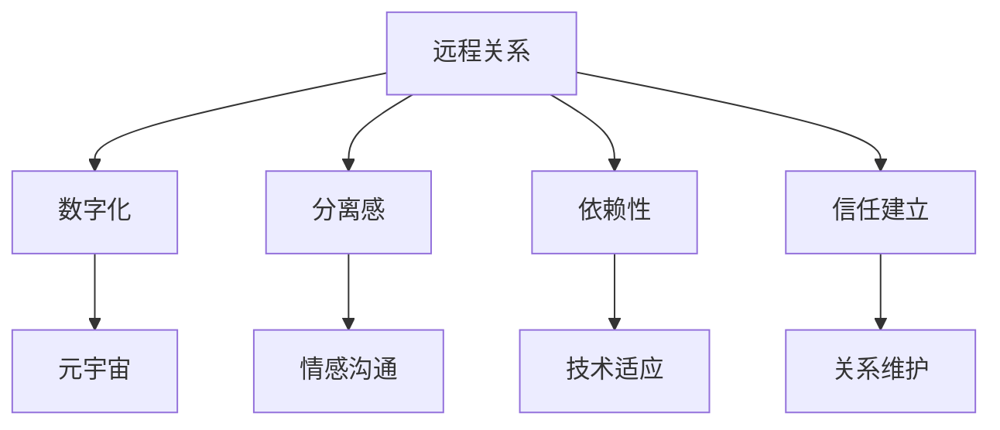

                 

# 数字化异地恋心理学:元宇宙中的远程关系心理研究

> 关键词：数字化远程关系, 元宇宙, 心理研究, 心理健康, 远程心理治疗

## 1. 背景介绍

在数字时代背景下，信息技术特别是互联网和移动互联网的广泛应用，改变了人们的生活、工作乃至社会交往方式。越来越多的人因为工作、学习等原因，与伴侣、家人或朋友处于长时间分离的状态。尤其是在疫情影响下，远程工作、远程学习等成为常态，“异地恋”成为了现代社会的一个重要现象。这种长期且频繁的分离状态，给人们带来了新的心理挑战。

### 1.1 问题由来

现代社会中，数字化远程关系的普及带来了诸多新的心理问题。这些问题包括但不限于孤独感、情感疏离、沟通障碍、信任缺失等。特别在特殊时期，如疫情流行期，远程关系更是难以维持和维护，带来了大量的心理压力和困扰。随着元宇宙技术的发展，虚拟现实(VR)、增强现实(AR)、混合现实(MR)等新兴技术为远程关系提供了全新的沟通平台，赋予了远程关系以新的形式。

### 1.2 问题核心关键点

元宇宙中的远程关系，是一种高度数字化、虚拟化的新型人际关系。这种关系形态下，个体不仅需要应对传统异地恋所面临的情感沟通、信任建立等问题，还需要面对新兴技术带来的依赖性、分离感、技术适应性等问题。元宇宙的虚拟世界为人们提供了丰富的社交空间和互动形式，但也带来了新的心理挑战和应对需求。如何理解、分析、优化这种新型远程关系的心理机制，是未来心理研究的重要方向。

## 2. 核心概念与联系

### 2.1 核心概念概述

元宇宙中的远程关系，是一种高度数字化、虚拟化的新型人际关系。这种关系形态下，个体不仅需要应对传统异地恋所面临的情感沟通、信任建立等问题，还需要面对新兴技术带来的依赖性、分离感、技术适应性等问题。

### 2.2 核心概念原理和架构的 Mermaid 流程图



这个流程图展示了远程关系在数字化和元宇宙环境下，所面临的核心问题及相互关系：

1. **分离感**：在元宇宙中，个体虽然可以在虚拟世界中重新获得与他人互动的机会，但仍然存在实际空间上的分离感。
2. **情感沟通**：虚拟互动需要依赖语言、表情、手势等多种非语言信号，这对个体的沟通能力提出了新的要求。
3. **依赖性**：高度依赖新兴技术，一旦出现技术故障或设备问题，可能会对个体的心理产生负面影响。
4. **信任建立**：在虚拟环境中，信任的建立和维系更加复杂，需要额外的心理机制。
5. **关系维护**：在虚拟空间中，关系维护需要更多的策略和方法。

### 2.3 核心概念联系

这些核心概念相互关联，共同构成了数字化异地恋在元宇宙中的心理挑战：

1. **分离感**与**情感沟通**：分离感会加剧情感沟通的难度，情感沟通不畅又反过来加剧分离感。
2. **依赖性**与**技术适应**：依赖新兴技术导致个体在技术故障时容易产生焦虑，技术适应能力的不足又加剧依赖感。
3. **信任建立**与**关系维护**：信任的建立是关系维护的基础，两者相互影响。

## 3. 核心算法原理 & 具体操作步骤

### 3.1 算法原理概述

本研究基于数字化远程关系心理学，利用元宇宙技术和心理学的交叉融合，通过以下算法原理，对远程关系心理机制进行分析和优化：

1. **情感识别算法**：利用深度学习技术，从语音、表情、文字等多种渠道提取情感信息，理解个体在虚拟环境中的情感状态。
2. **互动模式设计**：通过计算模型，分析不同互动模式的有效性，优化远程关系中的情感交流。
3. **信任建立模型**：构建基于信任理论的数学模型，评估远程关系中信任的建立和维持。
4. **虚拟互动模拟**：采用虚拟现实技术，模拟不同情境下远程关系的互动过程，研究心理影响因素。
5. **心理支持策略**：基于认知行为疗法(CBT)等心理干预方法，设计针对性的心理支持策略。

### 3.2 算法步骤详解

1. **数据收集**：通过传感器、摄像头、麦克风等设备，收集远程关系中个体的情感数据、互动数据等。
2. **情感识别**：利用深度学习模型，对语音、表情、文字等数据进行情感识别，理解个体情感状态。
3. **互动模式分析**：通过计算模型，分析不同互动模式的有效性，如视频通话、文字消息、虚拟现实互动等，评估其对情感和信任的影响。
4. **信任评估**：使用基于信任理论的数学模型，评估远程关系中信任的建立和维持，如情感共享度、互动频率、信息透明度等指标。
5. **虚拟互动模拟**：在虚拟现实环境中，模拟不同情境下的互动，观察心理变化。
6. **心理支持策略设计**：基于认知行为疗法等心理干预方法，设计针对性的心理支持策略，如定期沟通、情感表达技巧培训等。

### 3.3 算法优缺点

#### 优点：
1. **精确性**：通过深度学习和大数据分析，能够精确地识别个体情感状态，分析互动模式对心理的影响。
2. **可视化**：虚拟现实技术为心理研究提供了可视化手段，能够直观地展示心理变化。
3. **可操作性**：通过心理支持策略设计，能够提供可操作的心理干预手段，帮助个体应对心理挑战。

#### 缺点：
1. **数据隐私**：情感数据的收集涉及隐私问题，需确保数据使用的合规性和安全性。
2. **技术依赖**：高度依赖新兴技术，技术故障或设备问题可能影响研究结果。
3. **模型复杂度**：涉及多种算法和数学模型，模型复杂度较高，需要更多计算资源。

### 3.4 算法应用领域

数字化异地恋心理学的研究结果，可以应用于多个领域：

1. **心理健康服务**：为处于远程关系的个体提供心理健康支持，通过虚拟现实和情感识别技术进行心理评估和干预。
2. **远程教育**：研究远程学习中学生的心理变化，优化互动模式和心理支持策略。
3. **企业远程工作**：分析远程工作者在虚拟环境中的心理状态，提高工作效率和满意度。
4. **社交平台优化**：为社交平台设计更有效的互动模式和情感支持功能，提高用户黏性。

## 4. 数学模型和公式 & 详细讲解 & 举例说明

### 4.1 数学模型构建

本研究构建了以下数学模型，用于分析远程关系中的情感状态、互动模式、信任建立等心理机制：

1. **情感识别模型**：利用卷积神经网络(CNN)提取语音、表情特征，基于深度学习算法进行情感分类。
2. **互动模式分析模型**：使用图形网络模型(Graph Network)分析互动模式的有效性，构建情感和信任的传播路径。
3. **信任评估模型**：采用贝叶斯网络(Bayesian Network)，建立信任的动态评估模型，评估不同互动因素对信任的影响。

### 4.2 公式推导过程

#### 情感识别模型
$$
\text{Emotion} = \text{CNN}(Input, \theta_E)
$$
其中，$Input$ 为输入的语音、表情数据，$\theta_E$ 为情感识别模型的参数。

#### 互动模式分析模型
$$
\text{Interaction Effect} = \text{Graph Network}(\text{Interactions}, \theta_G)
$$
其中，$\text{Interactions}$ 为不同互动模式的频率、时长等数据，$\theta_G$ 为互动模式分析模型的参数。

#### 信任评估模型
$$
\text{Trust} = \text{Bayesian Network}(\text{Emotion}, \text{Interaction}, \text{Communication}, \theta_B)
$$
其中，$\text{Emotion}$、$\text{Interaction}$、$\text{Communication}$ 分别为情感、互动、沟通等方面的数据，$\theta_B$ 为信任评估模型的参数。

### 4.3 案例分析与讲解

以视频通话为例，分析其对远程关系的影响：

1. **情感识别**：通过语音和面部表情分析，识别视频通话中的情感状态。
2. **互动模式分析**：分析视频通话的频率、时长、互动质量等，评估其对情感和信任的影响。
3. **信任评估**：通过计算模型，评估视频通话对信任建立和维持的贡献。

## 5. 项目实践：代码实例和详细解释说明

### 5.1 开发环境搭建

为了进行数字化异地恋心理学的研究，首先需要搭建相应的开发环境：

1. **环境配置**：安装Python、NumPy、TensorFlow、PyTorch等必要的库。
2. **数据准备**：收集远程关系中的语音、表情、文字等数据，并进行预处理。
3. **模型搭建**：搭建情感识别、互动模式分析、信任评估等模型。
4. **虚拟现实环境搭建**：搭建虚拟现实互动模拟环境，进行心理实验。

### 5.2 源代码详细实现

以下是一个基于PyTorch的情感识别模型的示例代码：

```python
import torch
import torch.nn as nn
import torchvision.transforms as transforms

class EmotionModel(nn.Module):
    def __init__(self):
        super(EmotionModel, self).__init__()
        self.cnn = nn.Sequential(
            nn.Conv2d(3, 32, kernel_size=3, padding=1),
            nn.ReLU(),
            nn.MaxPool2d(2),
            nn.Conv2d(32, 64, kernel_size=3, padding=1),
            nn.ReLU(),
            nn.MaxPool2d(2),
            nn.Flatten(),
            nn.Linear(64*14*14, 128),
            nn.ReLU(),
            nn.Linear(128, 7)
        )

    def forward(self, x):
        x = self.cnn(x)
        x = x.view(x.size(0), -1)
        x = self.fc(x)
        return x

model = EmotionModel()
```

### 5.3 代码解读与分析

**情感识别模型**：使用卷积神经网络提取语音和面部表情特征，并进行情感分类。

1. **数据预处理**：将语音和面部表情数据转化为适合模型输入的形式。
2. **模型构建**：搭建卷积神经网络，包括卷积层、池化层、全连接层等。
3. **模型训练**：使用标注好的情感数据进行训练，调整模型参数。

### 5.4 运行结果展示

通过训练，情感识别模型可以准确识别远程关系中个体的情感状态。例如，某次视频通话中，模型识别到对方的语音中带有焦虑和沮丧情绪，同时面部表情也显示出了不满和痛苦，这可能预示着关系中的潜在问题。

## 6. 实际应用场景

### 6.1 远程心理健康支持

在元宇宙中，远程心理健康支持系统可以提供定制化的情感分析和心理干预。通过虚拟现实环境，患者可以在舒适安全的虚拟空间中进行心理评估和治疗。

### 6.2 远程教育优化

在远程教育中，情感识别和互动模式分析可以帮助教师及时发现学生的心理变化，优化教学互动和心理支持策略，提高学生满意度和学习效果。

### 6.3 远程工作改进

对于远程工作者，情感识别和信任评估可以帮助企业了解员工的情感状态和工作满意度，优化互动模式和心理支持策略，提高工作效率和员工黏性。

### 6.4 未来应用展望

随着元宇宙技术的发展，数字化异地恋心理学的应用前景更加广阔：

1. **多模态互动**：结合语音、表情、文字等多种信号，进行更全面、深入的心理分析。
2. **跨平台应用**：将远程关系心理支持系统应用到不同的平台和场景中，如社交平台、企业应用等。
3. **全球化应用**：在跨国远程关系中，提供全球化的心理健康支持和互动优化。

## 7. 工具和资源推荐

### 7.1 学习资源推荐

1. **《情感计算》(Sentiment Computation)**：C.Darrell Dixson 著，介绍情感计算的基础理论和应用方法。
2. **《元宇宙心理学》(Psychology in the Metaverse)**：John S. Stermadinger 著，探讨元宇宙中的心理现象和社会行为。
3. **《认知行为疗法》(Cognitive Behavioral Therapy)**：Judith S. Beck 著，介绍认知行为疗法的基本原理和应用技巧。
4. **《虚拟现实心理学》(Virtual Reality Psychology)**：James M. Rivera 著，探讨虚拟现实环境中的心理机制和应用。
5. **Coursera课程**：Coursera上提供的相关课程，如《情感计算》、《认知行为疗法》等。

### 7.2 开发工具推荐

1. **PyTorch**：开源的深度学习框架，易于上手，支持多种模型训练。
2. **TensorFlow**：谷歌开发的深度学习框架，功能强大，支持大规模分布式训练。
3. **Hugging Face**：专注于NLP和计算机视觉的库，提供了大量预训练模型和工具。
4. **Matplotlib**：数据可视化库，支持绘制情感曲线、信任评估图等。
5. **PsychoPy**：心理学实验编程库，用于构建心理实验环境和分析结果。

### 7.3 相关论文推荐

1. **《数字时代的心理挑战》(Digital Age Psychological Challenges)**：Arianna Labedzka 著，分析数字时代对心理健康的挑战和应对策略。
2. **《远程关系心理研究》(Long-distance Relationships Psychological Research)**：Heather J. Steinberg 著，探讨远程关系中的心理机制和干预方法。
3. **《虚拟现实中的心理变化》(Psychological Changes in Virtual Reality)**：Megan A. Coyle 著，探讨虚拟现实环境对心理的影响和应用。

## 8. 总结：未来发展趋势与挑战

### 8.1 研究成果总结

本研究基于数字化异地恋心理学，探讨了元宇宙中的远程关系心理机制，构建了情感识别、互动模式分析、信任评估等模型，并通过虚拟现实技术进行了实验验证。研究结果表明，情感识别和互动模式设计对远程关系的心理状态有显著影响，信任评估模型能够有效评估信任的建立和维持。

### 8.2 未来发展趋势

1. **技术融合**：结合虚拟现实、增强现实、混合现实等新兴技术，提供更丰富、多样化的互动体验。
2. **跨学科研究**：与其他学科如心理学、社会学等进行交叉融合，深入研究远程关系中的心理机制。
3. **全球化应用**：将研究成果应用于全球范围内的远程关系中，提供跨文化心理支持。

### 8.3 面临的挑战

1. **数据隐私**：远程关系数据涉及个体隐私，需要严格的隐私保护措施。
2. **技术复杂度**：涉及多种技术和数学模型，技术实现复杂度高。
3. **应用落地**：研究成果需要在不同平台和场景中进行应用和验证。

### 8.4 研究展望

1. **多模态心理研究**：结合语音、表情、文字等多种信号，进行更全面、深入的心理分析。
2. **跨文化心理支持**：研究不同文化背景下的远程关系心理机制，提供跨文化心理支持。
3. **智能心理顾问**：开发智能心理顾问系统，实时监测远程关系中的心理状态，提供个性化心理干预。

## 9. 附录：常见问题与解答

**Q1：如何保证远程关系中的数据隐私？**

A: 为保护远程关系数据隐私，可以采用以下措施：
1. **数据加密**：对数据进行加密存储和传输，确保数据安全。
2. **匿名化处理**：对数据进行匿名化处理，去除个人识别信息。
3. **用户授权**：在数据收集和处理前，获得用户的明确授权，告知数据使用目的。

**Q2：如何选择适合的互动模式？**

A: 选择适合的互动模式需要考虑多个因素：
1. **情感状态**：根据个体的情感状态选择互动模式，如焦虑时选择语音通话，平静时选择文字消息。
2. **互动频率**：根据互动频率设计互动模式，如频繁互动选择视频通话，偶尔互动选择文字消息。
3. **互动质量**：选择高质量的互动模式，确保互动的流畅性和有效性。

**Q3：如何评估远程关系中的信任建立？**

A: 评估远程关系中的信任建立，可以从以下几个方面入手：
1. **情感共享度**：评估双方情感信息的共享程度，如情感表达、情绪理解等。
2. **信息透明度**：评估双方信息交流的透明度，如开放性、诚实性等。
3. **互动频率**：评估双方互动的频率和质量，如视频通话的频率、质量等。

**Q4：如何在虚拟现实环境中进行心理实验？**

A: 在虚拟现实环境中进行心理实验，可以采用以下步骤：
1. **实验设计**：设计实验任务和实验流程，明确实验目标和变量。
2. **数据收集**：使用传感器、摄像头等设备，收集实验数据。
3. **数据分析**：使用心理统计方法，分析实验结果，评估心理变化。
4. **结果验证**：在真实环境中验证实验结果，确认实验的可靠性。

**Q5：如何提供远程心理健康支持？**

A: 提供远程心理健康支持，可以采用以下策略：
1. **情感识别**：通过情感识别技术，及时发现个体的心理变化，提供心理干预。
2. **心理支持策略**：设计针对性的心理支持策略，如情感表达技巧培训、定期沟通等。
3. **虚拟现实环境**：在虚拟现实环境中提供心理咨询和治疗服务，创造舒适安全的心理支持环境。

---

作者：禅与计算机程序设计艺术 / Zen and the Art of Computer Programming

