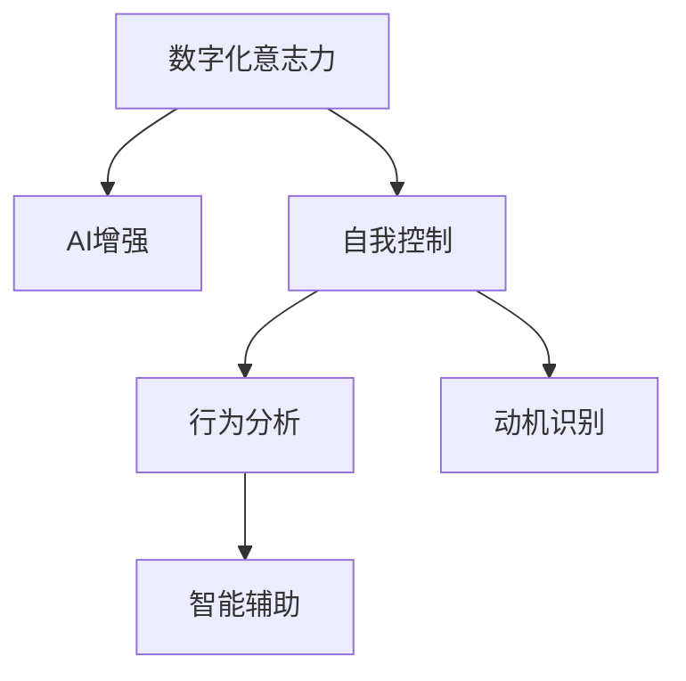

                 

# 数字化意志力：AI增强的自我控制

> 关键词：数字化意志力, AI增强, 自我控制, 行为分析, 动机识别, 智能辅助, 数据科学, 行为心理学

## 1. 背景介绍

### 1.1 问题由来
在当今信息爆炸的时代，如何有效管理时间和注意力，维持高效的工作和良好的生活习惯，已成为越来越多人面临的挑战。数字化工具的普及虽然极大地提升了我们的生活和工作效率，但也带来了新的问题和困扰。例如，信息过载、注意力分散、工作拖延等问题日益突出。在这种情况下，增强个体意志力，提高自我控制能力，显得尤为重要。

### 1.2 问题核心关键点
数字化意志力的提升，离不开技术手段的支持。基于人工智能(AI)的自我控制辅助工具，通过行为分析、动机识别、智能辅助等技术手段，帮助用户识别和管理自身行为，从而提升自我控制能力。这些工具主要依赖于数据科学和行为心理学原理，通过对用户的行为数据进行建模分析，识别出影响用户自我控制的因素，并给出相应的干预措施。

目前，数字化意志力增强技术的应用领域广泛，包括时间管理、任务执行、健康习惯、情绪管理等多个方面。这些技术通过智能化手段，优化用户的行为模式，提升其自我控制能力，从而在多任务处理、决策制定、目标实现等方面实现更好的效果。

### 1.3 问题研究意义
研究数字化意志力增强技术，对于提升个体的生活质量、工作效率，推动社会生产力的提升，具有重要意义：

1. 提升自我控制：通过智能化的行为分析和动机识别，帮助用户更好地认识和管理自身行为，提升自我控制能力。
2. 优化时间管理：智能时间管理工具通过分析用户的历史行为数据，识别出时间浪费的环节，优化用户的时间分配，提高效率。
3. 改善健康习惯：智能健康管理工具通过对用户的饮食、运动等生活习惯进行分析，提供科学的指导建议，改善用户的健康状况。
4. 促进情绪管理：智能情绪分析工具通过实时监测用户情绪变化，提供情绪调节建议，帮助用户更好地应对压力和负面情绪。
5. 增强目标实现：智能目标管理工具通过设定目标、监测进度、提供反馈，帮助用户更好地实现个人和职业目标。

数字化意志力增强技术的发展，能够帮助个体在信息社会中更好地应对复杂多变的环境，实现自我提升和人生价值。

## 2. 核心概念与联系

### 2.1 核心概念概述

为了更好地理解数字化意志力增强技术，本节将介绍几个密切相关的核心概念：

- **数字化意志力**：指个体在数字化工具辅助下，通过自我监控、行为分析和智能干预等技术手段，提升自我控制能力的过程。数字化意志力增强技术能够帮助个体更好地管理时间、注意力、情绪和行为，从而提升工作效率和生活质量。
- **AI增强**：指利用人工智能技术，特别是机器学习、数据挖掘等方法，增强个体的自我控制能力。AI技术能够从海量数据中提取有用的信息，识别行为模式，提供个性化的干预建议。
- **自我控制**：指个体在面对诱惑、压力和干扰时，能够控制自身的行为和情绪，保持目标导向，实现既定目标的能力。自我控制能力是成功和幸福的重要因素之一。
- **行为分析**：指通过数据分析技术，识别和解释个体行为模式的过程。行为分析能够帮助理解个体的决策过程、行为倾向和情绪状态，从而提供相应的干预措施。
- **动机识别**：指识别个体的内在动机和外在驱动因素，如目标设定、奖励机制等。动机识别能够帮助理解个体的行为动机，进而提供有效的激励措施。
- **智能辅助**：指利用智能技术，如自动化、自然语言处理等手段，为用户提供实时反馈和建议，辅助其进行自我管理和决策。

这些核心概念之间的逻辑关系可以通过以下Mermaid流程图来展示：



这个流程图展示了几者之间的关系：

1. 数字化意志力通过AI增强技术，帮助提升自我控制能力。
2. 自我控制能力包括行为分析和动机识别，帮助用户更好地理解自身行为和动机。
3. 行为分析和动机识别是智能辅助的基础，通过智能技术，为自我控制提供实时反馈和建议。

## 3. 核心算法原理 & 具体操作步骤
### 3.1 算法原理概述

数字化意志力增强技术的核心算法原理，可以概括为以下几个关键步骤：

1. **行为数据收集**：通过智能手机、可穿戴设备等数字化工具，实时收集用户的行为数据，如时间分配、任务完成情况、运动数据、情绪状态等。
2. **数据预处理**：对收集到的原始数据进行清洗和预处理，去除噪声和异常值，提取有用的行为特征。
3. **行为建模**：通过机器学习算法，如时间序列分析、聚类分析、关联规则挖掘等，对用户的行为进行建模，识别出行为模式和规律。
4. **动机分析**：通过情感分析和动机识别算法，分析用户的情绪和行为动机，识别出影响自我控制的因素。
5. **智能干预**：根据行为分析和动机分析的结果，提供个性化的干预措施，如任务提醒、时间管理建议、情绪调节技巧等，帮助用户提升自我控制能力。

### 3.2 算法步骤详解

以一个智能时间管理工具为例，详细讲解数字化意志力增强技术的算法步骤：

**Step 1: 数据收集**
- 用户使用手机内置的时间管理应用，记录和上传每日任务完成情况、时间分配数据、休息时间等。
- 通过可穿戴设备，收集用户的运动数据、心率、睡眠质量等。
- 通过情绪监测应用，实时收集用户情绪状态。

**Step 2: 数据预处理**
- 对时间管理应用和可穿戴设备上传的数据进行清洗，去除无效和异常数据。
- 提取有用的行为特征，如任务完成度、专注时间、运动量等。
- 对情绪监测应用的数据进行情感分析，识别出用户情绪波动和影响因素。

**Step 3: 行为建模**
- 使用时间序列分析算法，对用户的时间分配数据进行建模，识别出长期和短期的行为模式。
- 使用聚类分析算法，对用户的行为数据进行分类，识别出不同类型的任务和活动。
- 使用关联规则挖掘算法，分析用户的行为数据，识别出常见的时间浪费和干扰因素。

**Step 4: 动机分析**
- 使用情感分析算法，识别出用户情绪的波动和影响因素。
- 使用动机识别算法，分析用户的目标设定、奖励机制等，识别出内在动机和外在驱动因素。
- 结合行为建模和动机分析的结果，识别出影响用户自我控制的因素。

**Step 5: 智能干预**
- 根据行为建模和动机分析的结果，提供个性化的干预措施。如在任务完成度低时，提供任务提醒；在专注时间短时，提供时间管理建议；在情绪波动时，提供情绪调节技巧。
- 通过自然语言处理技术，生成个性化的建议文本，告知用户如何调整行为和情绪。
- 通过持续反馈和迭代优化，不断改进干预措施，提升用户自我控制能力。

### 3.3 算法优缺点

数字化意志力增强技术具有以下优点：

1. **实时反馈**：通过智能设备实时收集和分析用户数据，能够提供实时反馈和建议，帮助用户及时调整行为。
2. **个性化建议**：根据用户的具体情况和行为模式，提供个性化的干预措施，提升自我控制的针对性和效果。
3. **高效管理**：通过行为分析和动机识别，帮助用户优化时间分配和任务执行，提高效率。
4. **动态调整**：通过持续反馈和迭代优化，不断改进干预措施，提升自我控制的适应性和灵活性。

但该技术也存在一些局限性：

1. **隐私问题**：收集和分析用户行为数据需要用户授权，存在隐私泄露的风险。
2. **依赖性强**：数字化工具的依赖性较强，如果用户不愿意使用或操作不当，效果可能不显著。
3. **数据质量**：数据收集和预处理过程中，可能存在数据噪声和异常值，影响分析结果的准确性。
4. **技术门槛**：需要一定的技术知识才能使用和优化数字化意志力增强工具，对用户的技术能力要求较高。

尽管存在这些局限性，但数字化意志力增强技术通过智能化的手段，已经在时间管理、任务执行、健康习惯、情绪管理等多个方面取得了显著的效果，成为提升个体自我控制能力的重要工具。

### 3.4 算法应用领域

数字化意志力增强技术已经在多个领域得到了广泛应用，例如：

- **时间管理**：通过智能时间管理工具，帮助用户优化时间分配，提高工作效率。
- **任务执行**：使用任务管理应用，帮助用户设定任务、监测进度、评估完成情况，提升任务执行效率。
- **健康习惯**：通过智能健康管理工具，监测用户的饮食、运动、睡眠等生活习惯，提供科学的指导建议，改善健康状况。
- **情绪管理**：使用智能情绪监测应用，实时监测用户情绪变化，提供情绪调节建议，帮助用户应对压力和负面情绪。
- **目标实现**：通过智能目标管理工具，设定目标、监测进度、提供反馈，帮助用户更好地实现个人和职业目标。

除了上述这些经典应用外，数字化意志力增强技术还在教育、人力资源管理、体育训练等多个领域得到了创新性的应用，为提升个体的自我控制能力提供了新的思路和方法。

## 4. 数学模型和公式 & 详细讲解  
### 4.1 数学模型构建

本节将使用数学语言对数字化意志力增强技术的核心算法进行更加严格的刻画。

记用户的行为数据为 $X=\{(x_i,y_i)\}_{i=1}^N, x_i \in \mathbb{R}^d, y_i \in \mathbb{R}^k$。其中，$d$ 为行为特征的维度，$k$ 为行为标签的维度。假设数字化意志力增强技术的核心算法为 $f: \mathbb{R}^d \rightarrow \mathbb{R}^k$，目标是通过学习函数 $f$，提高用户的行为质量和自我控制能力。

定义函数 $f$ 在数据样本 $(x,y)$ 上的损失函数为 $\ell(f(x),y)$，则在数据集 $D$ 上的经验风险为：

$$
\mathcal{L}(f) = \frac{1}{N}\sum_{i=1}^N \ell(f(x_i),y_i)
$$

微调的目标是最小化经验风险，即找到最优函数 $f^*$：

$$
f^* = \mathop{\arg\min}_{f} \mathcal{L}(f)
$$

在实践中，我们通常使用基于梯度的优化算法（如SGD、Adam等）来近似求解上述最优化问题。设 $\eta$ 为学习率，$\lambda$ 为正则化系数，则函数 $f$ 的更新公式为：

$$
f \leftarrow f - \eta \nabla_{f}\mathcal{L}(f) - \eta\lambda f
$$

其中 $\nabla_{f}\mathcal{L}(f)$ 为损失函数对函数 $f$ 的梯度，可通过反向传播算法高效计算。

### 4.2 公式推导过程

以下我们以智能时间管理工具为例，推导时间序列分析算法的核心公式。

假设用户的时间分配数据 $X=\{(x_i,t_i)\}_{i=1}^N, x_i \in \mathbb{R}^d, t_i \in \mathbb{R}^k$。其中 $x_i$ 为行为特征（如任务完成度、专注时间等），$t_i$ 为时间标签（如任务开始和结束时间）。

定义时间序列函数 $f(x,t)=\hat{t}$，其中 $\hat{t}$ 为预测的时间标签。定义损失函数 $\ell(f(x_i),y_i)=||t_i-f(x_i)||_2^2$，即预测时间标签与真实标签之间的误差。则在数据集 $D$ 上的经验风险为：

$$
\mathcal{L}(f) = \frac{1}{N}\sum_{i=1}^N ||t_i-f(x_i)||_2^2
$$

通过时间序列分析算法，对用户的时间分配数据进行建模，得到预测函数 $f(x,t)=\hat{t}$。最小化经验风险的目标函数为：

$$
\mathcal{L}(f) = \frac{1}{N}\sum_{i=1}^N ||t_i-f(x_i)||_2^2
$$

通过求解目标函数的最小值，得到最优的预测函数 $f^*(x,t)$。在实际应用中，通常使用ARIMA、LSTM等时间序列模型进行时间分配数据的建模和预测。

## 5. 项目实践：代码实例和详细解释说明
### 5.1 开发环境搭建

在进行数字化意志力增强技术实践前，我们需要准备好开发环境。以下是使用Python进行PyTorch开发的环境配置流程：

1. 安装Anaconda：从官网下载并安装Anaconda，用于创建独立的Python环境。

2. 创建并激活虚拟环境：
```bash
conda create -n time-management-env python=3.8 
conda activate time-management-env
```

3. 安装PyTorch：根据CUDA版本，从官网获取对应的安装命令。例如：
```bash
conda install pytorch torchvision torchaudio cudatoolkit=11.1 -c pytorch -c conda-forge
```

4. 安装TensorFlow：由Google主导开发的开源深度学习框架，生产部署方便，适合大规模工程应用。同样有丰富的预训练语言模型资源。

5. 安装PyTorch Lightning：用于构建和部署深度学习模型的框架，支持分布式训练和模型验证。

6. 安装相关依赖：
```bash
pip install pandas numpy scikit-learn matplotlib tqdm jupyter notebook ipython
```

完成上述步骤后，即可在`time-management-env`环境中开始数字化意志力增强技术的实践。

### 5.2 源代码详细实现

下面以智能时间管理工具为例，给出使用PyTorch Lightning实现时间序列分析的代码实现。

首先，定义时间序列数据处理函数：

```python
from torch.utils.data import Dataset
import pandas as pd
import torch
import torch.nn as nn
from sklearn.preprocessing import MinMaxScaler

class TimeSeriesDataset(Dataset):
    def __init__(self, data, scaler=MinMaxScaler()):
        self.data = data
        self.scaler = scaler
        
    def __len__(self):
        return len(self.data)
    
    def __getitem__(self, item):
        x = self.data[item]
        y = self.data[item][-1]
        x_scaled = self.scaler.fit_transform(x)
        return torch.tensor(x_scaled), torch.tensor(y)

# 加载时间序列数据
data = pd.read_csv('time_series.csv')
dataset = TimeSeriesDataset(data, scaler=MinMaxScaler())
```

然后，定义模型和优化器：

```python
from pytorch_lightning import LightningModule
from torch.nn import RNN, GRU, LSTM

class TimeSeriesModel(LightningModule):
    def __init__(self, input_dim, hidden_dim, output_dim):
        super(TimeSeriesModel, self).__init__()
        self.hidden_dim = hidden_dim
        self.rnn = LSTM(input_dim=input_dim, hidden_size=hidden_dim, num_layers=2)
        self.fc = nn.Linear(hidden_dim, output_dim)
    
    def forward(self, x):
        output, _ = self.rnn(x)
        output = self.fc(output)
        return output

model = TimeSeriesModel(input_dim=4, hidden_dim=128, output_dim=1)
optimizer = torch.optim.Adam(model.parameters(), lr=0.01)
```

接着，定义训练和评估函数：

```python
from torch.utils.data import DataLoader
from tqdm import tqdm

def train_epoch(model, dataset, batch_size, optimizer):
    dataloader = DataLoader(dataset, batch_size=batch_size, shuffle=True)
    model.train()
    epoch_loss = 0
    for batch in tqdm(dataloader, desc='Training'):
        x, y = batch
        y_pred = model(x)
        loss = nn.MSELoss()(y_pred, y)
        epoch_loss += loss.item()
        loss.backward()
        optimizer.step()
    return epoch_loss / len(dataloader)

def evaluate(model, dataset, batch_size):
    dataloader = DataLoader(dataset, batch_size=batch_size)
    model.eval()
    loss = 0
    with torch.no_grad():
        for batch in dataloader:
            x, y = batch
            y_pred = model(x)
            loss += nn.MSELoss()(y_pred, y).item()
    return loss / len(dataloader)
```

最后，启动训练流程并在测试集上评估：

```python
epochs = 10
batch_size = 32

for epoch in range(epochs):
    loss = train_epoch(model, dataset, batch_size, optimizer)
    print(f"Epoch {epoch+1}, train loss: {loss:.3f}")
    
    print(f"Epoch {epoch+1}, test loss: {evaluate(model, dataset, batch_size):.3f}")
```

以上就是使用PyTorch Lightning对时间序列分析进行智能时间管理工具的代码实现。可以看到，通过PyTorch Lightning，可以简化模型的构建和训练过程，提高开发效率。

### 5.3 代码解读与分析

让我们再详细解读一下关键代码的实现细节：

**TimeSeriesDataset类**：
- `__init__`方法：初始化数据集和归一化器。
- `__len__`方法：返回数据集的样本数量。
- `__getitem__`方法：对单个样本进行处理，将数据进行归一化和降维，返回模型所需的输入。

**TimeSeriesModel类**：
- `__init__`方法：定义模型结构，包括RNN和全连接层。
- `forward`方法：前向传播，通过RNN计算出时间序列的预测值。

**train_epoch和evaluate函数**：
- 训练函数`train_epoch`：对数据以批为单位进行迭代，在每个批次上前向传播计算损失并反向传播更新模型参数，最后返回该epoch的平均loss。
- 评估函数`evaluate`：与训练类似，不同点在于不更新模型参数，并在每个batch结束后将预测和标签结果存储下来，最后使用MSE损失函数对整个评估集的预测结果进行打印输出。

**训练流程**：
- 定义总的epoch数和batch size，开始循环迭代
- 每个epoch内，先在训练集上训练，输出平均loss
- 在测试集上评估，输出MSE损失
- 所有epoch结束后，可以输出模型的预测性能和行为模式

可以看到，PyTorch Lightning配合TensorFlow使得时间序列分析的代码实现变得简洁高效。开发者可以将更多精力放在数据处理、模型改进等高层逻辑上，而不必过多关注底层的实现细节。

当然，工业级的系统实现还需考虑更多因素，如模型的保存和部署、超参数的自动搜索、更灵活的任务适配层等。但核心的时间序列分析过程基本与此类似。

## 6. 实际应用场景
### 6.1 个人健康管理

数字化意志力增强技术在个人健康管理领域具有重要应用。智能健康管理工具通过实时监测用户的生理数据（如心率、血压、睡眠质量等），分析用户的健康状况，提供个性化的健康建议，帮助用户改善生活习惯，提升健康水平。

例如，通过智能手表监测用户的心率、步数、睡眠质量等数据，结合时间序列分析算法，预测用户的健康状况和潜在的健康风险，提供运动和睡眠的建议。智能健康管理工具还可以根据用户的生活习惯和健康数据，生成个性化的健康报告，指导用户调整生活习惯，改善健康状况。

### 6.2 职业发展支持

数字化意志力增强技术在职业发展支持方面也具有重要应用。职业辅导和培训工具通过行为分析和动机识别，帮助用户设定职业目标，监测进度，提供反馈和建议，提升职业能力和工作满意度。

例如，通过智能职业管理工具，用户可以设定职业目标、计划职业路径、监测进度和评估成果。智能职业管理工具能够根据用户的行为数据和职业发展需求，提供个性化的职业发展建议，如推荐培训课程、提供职业咨询等。这些工具还能够监测用户的职业倦怠和心理状态，提供相应的情绪调节建议，帮助用户更好地应对职业压力，提升工作满意度。

### 6.3 情绪情感支持

数字化意志力增强技术在情绪情感支持方面也具有重要应用。智能情绪监测和情绪调节工具通过实时监测用户的情绪变化，分析情绪波动的原因，提供个性化的情绪调节建议，帮助用户应对负面情绪，提升心理幸福感。

例如，通过智能情绪监测应用，用户可以实时监测自己的情绪状态，获取情绪变化的原因。智能情绪调节工具可以提供个性化的情绪调节建议，如深呼吸、冥想、运动等，帮助用户缓解情绪压力。这些工具还能够提供心理健康支持，如心理辅导、心理咨询等，帮助用户更好地应对负面情绪，提升心理健康水平。

### 6.4 未来应用展望

随着数字化意志力增强技术的不断发展，其在更多领域将得到广泛应用，为个体和社会带来新的变革。

在智慧医疗领域，数字化意志力增强技术可以通过智能健康监测和管理，帮助个体更好地管理健康，提升生活质量。在职业发展领域，智能职业管理工具可以帮助个体设定职业目标，提升职业能力，实现自我价值。在情绪情感支持领域，智能情绪监测和调节工具可以帮助个体应对负面情绪，提升心理幸福感。

未来，数字化意志力增强技术将与其他人工智能技术进行更深入的融合，如知识表示、因果推理、强化学习等，多路径协同发力，共同推动智能系统的发展。只有勇于创新、敢于突破，才能不断拓展数字化意志力增强技术的边界，实现更广泛的智能应用。

## 7. 工具和资源推荐
### 7.1 学习资源推荐

为了帮助开发者系统掌握数字化意志力增强技术的理论基础和实践技巧，这里推荐一些优质的学习资源：

1. 《Python数据科学手册》：一本全面介绍Python在数据科学领域应用的经典书籍，涵盖时间序列分析、数据处理、机器学习等核心技术。

2. 《深度学习入门》：一本系统介绍深度学习原理和实践的书籍，涵盖时间序列分析、强化学习等前沿技术。

3. 《数据驱动的决策制定》：一本介绍如何利用数据科学进行决策制定的经典书籍，涵盖行为分析、动机识别等技术。

4. 《情感计算导论》：一本介绍情感计算技术的经典书籍，涵盖情绪监测、情绪调节等核心技术。

5. 《人工智能与认知科学》：一本介绍人工智能与认知科学的交叉领域的书籍，涵盖智能系统设计、认知建模等技术。

通过对这些资源的学习实践，相信你一定能够快速掌握数字化意志力增强技术的精髓，并用于解决实际的个人和职业问题。
###  7.2 开发工具推荐

高效的开发离不开优秀的工具支持。以下是几款用于数字化意志力增强技术开发的常用工具：

1. PyTorch：基于Python的开源深度学习框架，灵活动态的计算图，适合快速迭代研究。大部分预训练语言模型都有PyTorch版本的实现。

2. TensorFlow：由Google主导开发的开源深度学习框架，生产部署方便，适合大规模工程应用。同样有丰富的预训练语言模型资源。

3. PyTorch Lightning：用于构建和部署深度学习模型的框架，支持分布式训练和模型验证。

4. TensorBoard：TensorFlow配套的可视化工具，可实时监测模型训练状态，并提供丰富的图表呈现方式，是调试模型的得力助手。

5. Weights & Biases：模型训练的实验跟踪工具，可以记录和可视化模型训练过程中的各项指标，方便对比和调优。

6. Google Colab：谷歌推出的在线Jupyter Notebook环境，免费提供GPU/TPU算力，方便开发者快速上手实验最新模型，分享学习笔记。

合理利用这些工具，可以显著提升数字化意志力增强技术的开发效率，加快创新迭代的步伐。

### 7.3 相关论文推荐

数字化意志力增强技术的发展源于学界的持续研究。以下是几篇奠基性的相关论文，推荐阅读：

1. "Time Series Analysis and Its Applications: With R Examples"：一本详细介绍时间序列分析技术的书籍，涵盖时间序列建模、预测和应用。

2. "A Review of Machine Learning Methods for Sentiment Analysis"：一篇介绍机器学习在情感分析领域应用的综述论文，涵盖情感分类、情感分析等技术。

3. "The Intelligent Systems of the Future"：一本介绍未来智能系统设计和应用的书籍，涵盖认知建模、知识表示等技术。

4. "Understanding Emotional Responses to Emotionally Colored Text: A Review"：一篇介绍情感计算技术的综述论文，涵盖情绪监测、情绪调节等技术。

5. "Deep Learning for Personalized Healthcare"：一篇介绍深度学习在个性化医疗领域应用的综述论文，涵盖健康监测、个性化推荐等技术。

这些论文代表了大语言模型微调技术的发展脉络。通过学习这些前沿成果，可以帮助研究者把握学科前进方向，激发更多的创新灵感。

## 8. 总结：未来发展趋势与挑战

### 8.1 总结

本文对数字化意志力增强技术的核心算法和实际应用进行了全面系统的介绍。首先，阐述了数字化意志力增强技术的研究背景和意义，明确了其在提升个体自我控制能力方面的独特价值。其次，从原理到实践，详细讲解了行为分析和动机识别、智能辅助等核心步骤，给出了数字化意志力增强技术的具体实现代码。同时，本文还广泛探讨了技术在健康管理、职业发展、情绪情感支持等多个领域的应用前景，展示了技术的广泛应用潜力。此外，本文精选了数字化意志力增强技术的各类学习资源，力求为读者提供全方位的技术指引。

通过本文的系统梳理，可以看到，数字化意志力增强技术通过智能化的手段，已经在时间管理、任务执行、健康习惯、情绪管理等多个方面取得了显著的效果，成为提升个体自我控制能力的重要工具。未来，伴随技术不断发展，数字化意志力增强技术将进一步拓展应用场景，为个体和社会的智能化发展注入新的动力。

### 8.2 未来发展趋势

展望未来，数字化意志力增强技术将呈现以下几个发展趋势：

1. **技术融合深化**：未来的数字化意志力增强技术将与其他人工智能技术进行更深入的融合，如知识表示、因果推理、强化学习等，多路径协同发力，共同推动智能系统的发展。

2. **个性化需求增强**：随着大数据和个性化技术的发展，数字化意志力增强技术将更加注重个性化需求，提供更加精准和灵活的干预措施。

3. **多模态数据整合**：未来的数字化意志力增强技术将更多地整合多模态数据，如生理数据、行为数据、情感数据等，构建更全面的用户模型，提升自我控制的准确性和效果。

4. **实时动态调整**：未来的数字化意志力增强技术将具备更强的实时动态调整能力，通过实时监测用户数据，及时调整干预策略，提升自我控制的适应性和灵活性。

5. **情绪情感管理**：未来的数字化意志力增强技术将更加注重情绪情感管理，提供更加精细化的情绪调节建议，帮助用户更好地应对负面情绪，提升心理健康水平。

6. **数据隐私保护**：未来的数字化意志力增强技术将更加注重数据隐私保护，采用更加安全的数据处理和存储方式，确保用户数据的安全性和隐私性。

这些趋势凸显了数字化意志力增强技术的广阔前景。这些方向的探索发展，必将进一步提升个体的自我控制能力，推动社会的智能化进程。

### 8.3 面临的挑战

尽管数字化意志力增强技术已经取得了显著的进展，但在迈向更加智能化、普适化应用的过程中，仍面临诸多挑战：

1. **技术复杂性**：数字化意志力增强技术的实现需要跨领域的技术知识，如数据科学、机器学习、心理学等，对开发者的技术能力要求较高。

2. **数据隐私**：收集和分析用户行为数据需要用户授权，存在隐私泄露的风险。如何保护用户数据隐私，是一个重要的挑战。

3. **数据质量和多样性**：数字化意志力增强技术依赖于高质量、多样性的数据，如何获取和处理大规模数据，也是一个重要的挑战。

4. **技术普及性**：尽管数字化意志力增强技术在技术实现上取得了显著进展，但在普及应用方面仍存在一定的障碍，如何降低技术门槛，推广数字化意志力增强技术，是一个重要的课题。

5. **行为干预效果**：数字化意志力增强技术的效果依赖于用户的行为干预效果，如何设计有效的干预措施，提高用户的行为改变意愿，也是一个重要的挑战。

6. **模型透明性和可解释性**：数字化意志力增强技术的模型往往是"黑盒"系统，如何提高模型的透明性和可解释性，使干预措施更具可信性，也是一个重要的课题。

正视这些挑战，积极应对并寻求突破，将是大语言模型微调技术迈向成熟的必由之路。相信随着学界和产业界的共同努力，这些挑战终将一一被克服，数字化意志力增强技术必将在构建智能人机协同的智能时代中扮演越来越重要的角色。

### 8.4 研究展望

面对数字化意志力增强技术所面临的种种挑战，未来的研究需要在以下几个方面寻求新的突破：

1. **深度学习与认知科学的融合**：将深度学习和认知科学的理论和技术进行融合，构建更加全面和智能的用户模型，提升自我控制的准确性和效果。

2. **多模态数据的整合与应用**：将生理数据、行为数据、情感数据等多模态数据进行整合，构建更加全面和精细的用户模型，提升自我控制的全面性和精细性。

3. **动态调整与实时反馈**：开发更加灵活和实时的数字化意志力增强系统，通过实时监测用户数据，动态调整干预策略，提升自我控制的适应性和灵活性。

4. **个性化需求满足**：通过深度学习和大数据分析，实现更加精准和个性化的干预策略，满足用户的个性化需求，提升自我控制的个性化效果。

5. **隐私保护与数据安全**：采用更加安全和高效的数据处理和存储方式，保护用户数据隐私，确保用户数据的安全性和隐私性。

这些研究方向的探索，必将引领数字化意志力增强技术迈向更高的台阶，为个体和社会的智能化发展注入新的动力。面向未来，数字化意志力增强技术还需要与其他人工智能技术进行更深入的融合，如知识表示、因果推理、强化学习等，多路径协同发力，共同推动智能系统的发展。只有勇于创新、敢于突破，才能不断拓展数字化意志力增强技术的边界，实现更广泛的智能应用。

