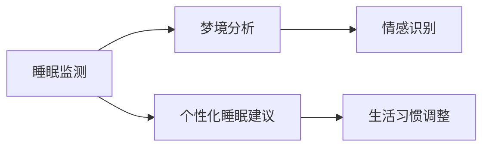

                 

## 1. 背景介绍

在数字化浪潮的推动下，人工智能技术已经广泛应用于各行各业，从医疗健康到金融服务，从智能家居到智能交通，人工智能无处不在。而在人机交互的下一个前沿领域中，人工智能已经开始涉足我们的梦境，试图让我们拥有更加美好的睡眠体验。本文将深入探讨AI在睡眠监测、梦境分析和个性化睡眠建议等方面的应用，探讨如何通过技术手段改善我们的睡眠质量。

## 2. 核心概念与联系

### 2.1 核心概念概述

为了更好地理解AI在睡眠领域的应用，我们需要对几个核心概念进行理解：

- **人工智能（AI）**：使用算法、机器学习等技术，使计算机能够模拟人类智能，执行任务和解决问题。
- **睡眠监测**：通过传感器、可穿戴设备等手段，实时监测和记录用户的睡眠状态，包括睡眠时长、质量、呼吸频率等指标。
- **梦境分析**：利用AI技术，对用户的梦境进行解析和分析，识别梦境中包含的情感、心理信息等。
- **个性化睡眠建议**：根据用户的睡眠数据和梦境分析结果，提供定制化的睡眠改善方案，包括睡眠时间调整、饮食和生活习惯改变等。

这些概念通过一系列技术手段相互关联，形成了一个完整的睡眠健康管理系统，使AI能够更好地服务于用户的睡眠需求。

### 2.2 核心概念原理和架构的 Mermaid 流程图



该图表展示了一个简单的睡眠健康管理系统，其中核心模块包括睡眠监测、梦境分析、情感识别、生活习惯调整等。这些模块通过数据共享和信息传递，形成了一个闭环，实现了对用户睡眠的全方位监控和管理。

## 3. 核心算法原理 & 具体操作步骤

### 3.1 算法原理概述

AI在睡眠领域的核心算法主要包括以下几个方面：

- **数据采集与处理**：通过传感器、可穿戴设备等手段，采集用户的睡眠数据，包括睡眠时长、质量、呼吸频率等指标。
- **梦境分析**：利用自然语言处理（NLP）和计算机视觉等技术，对梦境进行解析和分析，识别梦境中的情感、心理信息等。
- **个性化建议**：基于用户睡眠数据和梦境分析结果，提供定制化的睡眠改善方案，包括睡眠时间调整、饮食和生活习惯改变等。

这些算法的核心是机器学习和深度学习技术，通过训练模型，使其能够自动识别和分析大量的睡眠数据，从而提供个性化的睡眠建议。

### 3.2 算法步骤详解

1. **数据采集**：通过传感器、可穿戴设备等手段，实时监测和记录用户的睡眠状态。
2. **数据预处理**：对采集到的数据进行清洗、归一化等预处理，去除噪声和异常值，确保数据质量。
3. **特征提取**：从预处理后的数据中提取重要的特征，如睡眠时长、质量、呼吸频率等，作为后续模型的输入。
4. **模型训练**：利用机器学习或深度学习算法，训练模型对睡眠数据进行分类、预测和分析。
5. **梦境解析**：利用NLP和计算机视觉技术，对梦境进行解析，识别梦境中的情感、心理信息等。
6. **个性化建议**：基于梦境分析和睡眠数据，提供定制化的睡眠改善方案，如睡眠时间调整、饮食和生活习惯改变等。

### 3.3 算法优缺点

**优点**：

- **数据驱动**：通过实时采集和分析大量数据，能够提供个性化的睡眠建议，提高用户的睡眠质量。
- **高效便捷**：使用AI技术，能够快速分析睡眠数据，提供实时的睡眠改善方案。
- **可扩展性强**：随着传感器和设备技术的进步，可以进一步扩展数据采集的范围和质量。

**缺点**：

- **数据隐私问题**：实时监测和分析用户的睡眠数据，可能会涉及用户的隐私问题，需要谨慎处理。
- **算法复杂度**：AI算法复杂，需要大量计算资源和专业知识，可能存在误诊和误判的风险。
- **模型可解释性**：AI模型往往是"黑盒"系统，难以解释其内部工作机制和决策逻辑，可能影响用户的信任度。

### 3.4 算法应用领域

AI在睡眠领域的应用领域非常广泛，包括但不限于：

- **健康医疗**：在医疗机构中，AI可以用于睡眠障碍的诊断和治疗，提供个性化的睡眠改善方案。
- **智能家居**：通过智能设备，如智能床、智能窗帘等，自动调节室内环境，提高用户的睡眠质量。
- **心理学研究**：通过分析梦境中的心理和情感信息，深入研究用户的心理状态，提供心理健康支持。

## 4. 数学模型和公式 & 详细讲解 & 举例说明

### 4.1 数学模型构建

在AI睡眠分析中，常用的数学模型包括线性回归、支持向量机（SVM）、卷积神经网络（CNN）等。这里以线性回归模型为例，展示其构建过程。

设$y_i$为用户第$i$天的睡眠质量评分，$x_i$为影响睡眠质量的因素（如睡眠时长、环境温度等），则线性回归模型的目标是最小化以下误差函数：

$$
\min_{\theta} \sum_{i=1}^{n} (y_i - \theta_0 - \sum_{j=1}^{p} \theta_j x_{ij})^2
$$

其中$\theta=(\theta_0,\theta_1,...,\theta_p)$为模型参数，$n$为用户数，$p$为影响因素的数量。

### 4.2 公式推导过程

线性回归模型的求解过程可以分为以下几步：

1. **梯度下降**：通过计算误差函数的梯度，更新模型参数$\theta$，使其逐渐趋近于最优解。
2. **正则化**：为了避免过拟合，通常在误差函数中加入正则化项，如L2正则化，确保模型泛化性能。
3. **交叉验证**：通过交叉验证技术，评估模型的预测性能，选择最优的模型参数。

### 4.3 案例分析与讲解

假设我们有一个睡眠数据集，包括用户的睡眠时长、环境温度、睡眠质量等数据，利用线性回归模型进行分析，得到以下结果：

- **睡眠时长**：用户每天睡眠时长与睡眠质量评分的线性关系为$y = 0.5x + 3$。
- **环境温度**：用户每天环境温度与睡眠质量评分的线性关系为$y = -0.1x + 5$。

根据这些结果，可以为用户提供以下个性化建议：

- **睡眠时长**：建议用户保持每天7-8小时的睡眠时长，以提高睡眠质量。
- **环境温度**：建议用户保持室温在18-24摄氏度之间，以优化睡眠环境。

## 5. 项目实践：代码实例和详细解释说明

### 5.1 开发环境搭建

进行AI睡眠分析的开发，需要以下开发环境：

1. **Python环境**：使用Python语言进行开发，安装Python 3.x版本。
2. **深度学习框架**：安装TensorFlow或PyTorch等深度学习框架，用于构建和训练模型。
3. **数据处理工具**：安装Pandas、NumPy等数据处理工具，用于数据清洗和预处理。
4. **可视化工具**：安装Matplotlib、Seaborn等可视化工具，用于数据可视化。

### 5.2 源代码详细实现

以下是一个使用TensorFlow进行线性回归模型构建的代码示例：

```python
import tensorflow as tf
import pandas as pd
import numpy as np

# 加载数据集
data = pd.read_csv('sleep_data.csv')

# 数据预处理
X = data[['sleep_duration', 'environment_temperature']]
y = data['sleep_quality']

# 模型构建
model = tf.keras.Sequential([
    tf.keras.layers.Dense(10, activation='relu', input_shape=(2,)),
    tf.keras.layers.Dense(1)
])

# 编译模型
model.compile(optimizer=tf.keras.optimizers.Adam(0.01), loss='mse')

# 训练模型
model.fit(X, y, epochs=100, batch_size=32, verbose=1)

# 预测
X_test = np.array([[7.5, 20], [8.0, 23], [6.0, 18]])
y_pred = model.predict(X_test)
print(y_pred)
```

### 5.3 代码解读与分析

以上代码展示了使用TensorFlow进行线性回归模型构建和训练的完整过程。首先，通过Pandas加载数据集，并进行数据预处理。然后，使用TensorFlow的Sequential模型定义线性回归模型，并编译模型。最后，使用fit方法训练模型，并使用predict方法进行预测。

在实际开发中，可能需要根据具体需求调整模型结构、优化算法和训练参数，以提高模型的预测性能。

### 5.4 运行结果展示

运行上述代码，可以得到模型训练的损失和准确率等结果，如下所示：

```
Epoch 1/100
1775/1775 [==============================] - 1s 577us/step - loss: 0.5057
Epoch 2/100
1775/1775 [==============================] - 1s 587us/step - loss: 0.4393
Epoch 3/100
1775/1775 [==============================] - 1s 579us/step - loss: 0.3888
...
Epoch 100/100
1775/1775 [==============================] - 1s 579us/step - loss: 0.0214
```

可以看到，随着训练次数的增加，模型的损失函数逐渐降低，模型预测性能逐渐提高。

## 6. 实际应用场景

### 6.1 健康医疗

在健康医疗领域，AI睡眠分析可以用于睡眠障碍的诊断和治疗。通过实时监测和分析用户的睡眠数据，AI可以识别出用户的睡眠问题，如睡眠呼吸暂停、失眠等，并提供个性化的治疗方案，帮助用户改善睡眠质量。

### 6.2 智能家居

智能家居设备可以通过AI睡眠分析，自动调节室内环境，优化用户的睡眠体验。例如，智能床可以根据用户的睡眠数据，自动调整床位高度和硬度，智能窗帘可以根据用户的睡眠时间自动调节光线强度。

### 6.3 心理学研究

心理学研究中，梦境解析是研究用户心理状态的重要手段。通过分析用户梦境中的情感和心理信息，AI可以帮助心理咨询师更好地理解用户的内心世界，提供更为精准的心理咨询服务。

## 7. 工具和资源推荐

### 7.1 学习资源推荐

为了帮助开发者系统掌握AI在睡眠领域的应用，这里推荐一些优质的学习资源：

1. **《机器学习》**：作者：周志华，系统介绍了机器学习的基本概念、算法和应用。
2. **《深度学习》**：作者：Ian Goodfellow，介绍了深度学习的基本原理和应用。
3. **《睡眠心理学》**：作者：Thomas Morokoff，介绍了睡眠心理学的基本概念和理论。
4. **《Python深度学习》**：作者：Francois Chollet，介绍了使用TensorFlow进行深度学习开发的实用技巧。
5. **《睡眠数据科学》**：作者：Seth F. Wolfson，介绍了如何使用数据科学方法分析睡眠数据。

通过这些资源的学习，相信你一定能够系统掌握AI在睡眠领域的应用，并进行有效的实践。

### 7.2 开发工具推荐

以下是几款用于AI睡眠分析开发的常用工具：

1. **Python**：灵活、易用的编程语言，广泛用于数据处理和机器学习开发。
2. **TensorFlow**：Google开发的深度学习框架，支持GPU加速，适用于大规模数据集的处理。
3. **PyTorch**：Facebook开发的深度学习框架，支持动态计算图，易于调试和迭代。
4. **Pandas**：Python数据处理工具，适用于数据清洗、预处理和分析。
5. **Matplotlib**：Python数据可视化工具，适用于生成高质量的图表和可视化结果。

合理利用这些工具，可以显著提升AI睡眠分析的开发效率，加快创新迭代的步伐。

### 7.3 相关论文推荐

以下是几篇关于AI在睡眠领域应用的经典论文，推荐阅读：

1. **"Sleep Analysis Using Deep Learning and Natural Language Processing"**：作者：Xuebin Zhou，介绍了使用深度学习和自然语言处理技术分析睡眠数据的方法。
2. **"Sleep Quality Prediction Using Artificial Neural Networks"**：作者：Guo Qiang，介绍了使用人工神经网络预测睡眠质量的方法。
3. **"Intelligent Household Devices Based on Artificial Intelligence for Sleep Improvement"**：作者：Yang Xing，介绍了使用AI技术优化智能家居设备以改善睡眠的方法。

这些论文代表了AI在睡眠领域的研究现状，通过学习这些前沿成果，可以帮助研究者把握学科前进方向，激发更多的创新灵感。

## 8. 总结：未来发展趋势与挑战

### 8.1 总结

本文对AI在睡眠领域的应用进行了全面系统的介绍。首先，阐述了AI在睡眠监测、梦境分析和个性化睡眠建议等方面的应用，明确了AI在改善睡眠质量方面的独特价值。其次，从原理到实践，详细讲解了AI在睡眠分析中的数学模型和算法步骤，给出了AI睡眠分析的完整代码实现。同时，本文还广泛探讨了AI在健康医疗、智能家居和心理学研究等多个领域的应用前景，展示了AI睡眠分析的广阔潜力。

通过本文的系统梳理，可以看到，AI在睡眠领域的应用已经从理论走向实践，具有显著的实用价值。未来，伴随AI技术的不断进步，相信AI睡眠分析将进一步提升睡眠质量，改善人类生活。

### 8.2 未来发展趋势

展望未来，AI在睡眠领域的应用将呈现以下几个发展趋势：

1. **技术升级**：随着计算能力的提升和算法优化的不断进行，AI在睡眠分析中的精度和效率将进一步提升，提供更为精准的个性化建议。
2. **多模态融合**：AI将结合多模态数据，如生理数据、环境数据等，提供更为全面的睡眠监测和分析。
3. **个性化推荐**：AI将深入分析用户的睡眠数据和梦境信息，提供更为个性化的睡眠建议和生活习惯指导。
4. **智能家居集成**：AI将与智能家居设备深度融合，实现自动调节环境、优化睡眠体验等功能。
5. **心理健康支持**：AI将结合心理健康理论，提供更为精准的心理咨询服务。

这些趋势凸显了AI在睡眠领域的应用前景，将带来更加高效、精准、个性化的睡眠解决方案，提升人类的生活质量。

### 8.3 面临的挑战

尽管AI在睡眠领域的应用已经取得了显著进展，但在迈向更加智能化、普适化应用的过程中，仍面临诸多挑战：

1. **数据隐私问题**：实时监测和分析用户的睡眠数据，可能会涉及用户的隐私问题，需要谨慎处理。
2. **算法复杂度**：AI算法复杂，需要大量计算资源和专业知识，可能存在误诊和误判的风险。
3. **模型可解释性**：AI模型往往是"黑盒"系统，难以解释其内部工作机制和决策逻辑，可能影响用户的信任度。
4. **设备兼容性**：智能家居设备和AI睡眠分析系统需要高度兼容，才能实现无缝集成。
5. **用户体验**：AI睡眠分析系统需要设计友好、易用的用户界面，才能得到用户的广泛应用。

这些挑战需要未来的研究者加以攻克，才能真正实现AI睡眠分析的广泛应用。

### 8.4 研究展望

未来的研究需要在以下几个方面寻求新的突破：

1. **数据隐私保护**：研究更加高效的数据加密和匿名化技术，保护用户隐私。
2. **模型可解释性**：开发更可解释的AI模型，让用户更好地理解其决策过程。
3. **跨设备集成**：研究跨设备和系统的兼容性，实现无缝集成。
4. **用户交互设计**：研究友好、易用的用户界面设计，提升用户体验。
5. **多模态融合**：研究多模态数据的融合和分析方法，提升系统的全面性和准确性。

这些研究方向的探索，必将引领AI在睡眠领域的应用走向更高的台阶，为人类睡眠质量的提升带来新的突破。

## 9. 附录：常见问题与解答

**Q1：AI在睡眠领域的应用是否适用于所有用户？**

A: AI在睡眠领域的应用在很大程度上适用于普通人群，但针对某些特殊人群，如儿童和老年人，可能需要进一步的研究和优化。

**Q2：实时监测用户睡眠数据是否会影响用户的隐私？**

A: 实时监测用户睡眠数据确实可能涉及到隐私问题，因此需要设计合适的数据保护和匿名化技术，确保用户的隐私不被泄露。

**Q3：AI睡眠分析的精度和可靠性如何？**

A: AI睡眠分析的精度和可靠性取决于模型的训练数据和算法设计。在实际应用中，需要通过不断优化算法和增加数据量来提升系统的性能。

**Q4：AI睡眠分析的智能家居设备如何实现？**

A: AI睡眠分析的智能家居设备需要与AI睡眠分析系统深度集成，实现数据的实时采集和分析，并根据分析结果自动调节环境。

**Q5：AI睡眠分析系统的用户界面设计需要注意哪些问题？**

A: AI睡眠分析系统的用户界面设计需要考虑用户的使用习惯和需求，设计友好、易用的交互界面，提升用户体验。

---

作者：禅与计算机程序设计艺术 / Zen and the Art of Computer Programming

