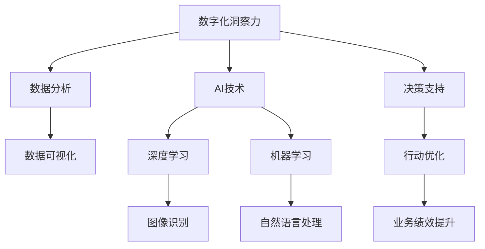
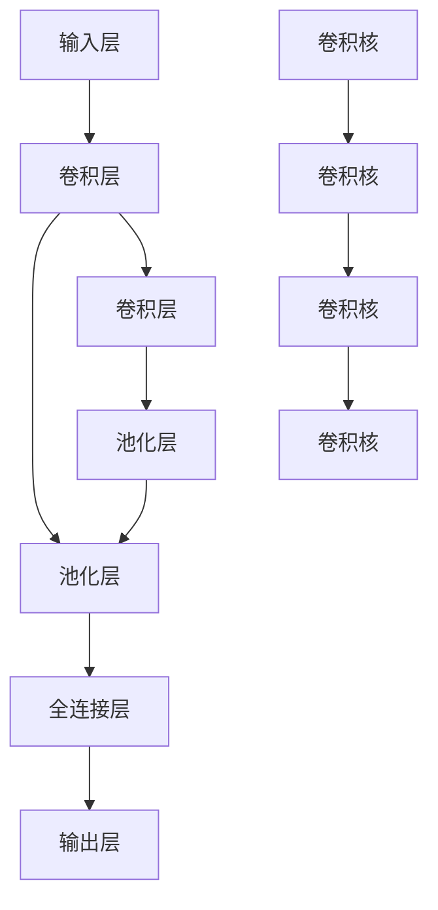
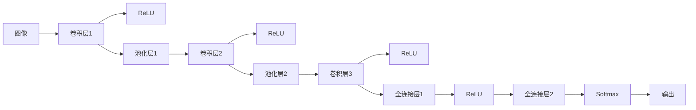
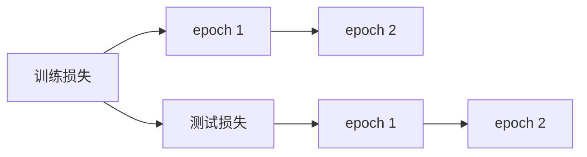

                 

# 数字化洞察力：AI增强的问题解决能力

> 关键词：数字化洞察力,人工智能,增强问题解决能力,数据驱动决策,深度学习

## 1. 背景介绍

在当前数据驱动的数字化时代，各行各业都面临着前所未有的机遇与挑战。从企业的业务决策到个人的日常生活，都越发依赖于大数据的深度分析和智能算法的辅助决策。数字化洞察力（Digital Insight）已经成为推动企业战略、优化决策过程、提升业务绩效的关键能力之一。而人工智能（AI），尤其是深度学习（Deep Learning）的迅猛发展，为增强问题的解决能力提供了强大的技术支撑。本文将围绕数字化洞察力这一核心概念，探讨AI增强问题解决能力的原理、技术、应用和未来发展趋势，希望能为读者提供全面的视角和深入的理解。

## 2. 核心概念与联系

### 2.1 核心概念概述

为更好地理解数字化洞察力和AI增强问题解决能力的内涵，我们首先概述一些相关的核心概念：

- **数字化洞察力**：指利用先进的数据分析和AI技术，从海量数据中提取有价值的知识和洞见，以指导决策和优化过程的能力。它贯穿于企业的运营管理、市场分析、产品研发、客户服务等多个环节，是企业竞争力的重要体现。

- **AI增强问题解决能力**：指通过人工智能技术，特别是深度学习和机器学习算法，提升个人和团队在复杂、高维度问题上的分析和解决能力。这种能力在数据分析、模式识别、自然语言处理、计算机视觉等领域展现出了显著优势。

- **深度学习**：一种通过多层神经网络模拟人脑神经网络结构的学习方法，能够自动从数据中学习特征表示，并解决复杂的非线性问题。深度学习在图像识别、语音识别、自然语言处理等领域取得了突破性进展。

- **数据驱动决策**：基于数据的分析和挖掘，辅助或替代传统的经验和直觉，做出更为科学合理的决策。数据驱动决策要求高效的数据处理和分析能力，而AI正是实现这一目标的利器。

- **增强学习**：一种通过试错和学习来优化策略的AI技术，特别适用于动态环境和复杂决策问题，如机器人控制、游戏AI等。

这些核心概念通过数据分析、AI技术和实际应用，共同构成了数字化洞察力和AI增强问题解决能力的基础。

### 2.2 核心概念原理和架构的 Mermaid 流程图



这个流程图展示了数字化洞察力从数据采集、分析到决策支持的完整过程，以及AI技术在其中扮演的关键角色。数据分析是基础，AI技术通过深度学习和机器学习提供强大的算法支持，最终形成对决策的增强。

## 3. 核心算法原理 & 具体操作步骤

### 3.1 算法原理概述

AI增强问题解决能力的核心在于数据和模型的有效结合。通过深度学习和机器学习算法，AI可以从原始数据中提取特征，学习复杂的关系和模式，最终为决策提供科学依据。这一过程可以分为数据预处理、模型训练、推理和评估四个主要步骤。

- **数据预处理**：对原始数据进行清洗、归一化、特征工程等预处理，以提高模型的训练效率和准确性。
- **模型训练**：使用训练数据集对模型进行训练，优化模型的参数，使其能够准确地预测和分类新数据。
- **推理**：将待预测的新数据输入模型，得到预测结果，辅助决策。
- **评估**：通过评估指标（如准确率、召回率、F1分数等）来衡量模型的性能，并进行必要的调整和优化。

### 3.2 算法步骤详解

以下是一个详细的AI增强问题解决能力的技术实现流程：

1. **数据准备**：收集、清洗、归一化数据，并根据实际需求进行特征工程，构建训练集和测试集。

2. **模型选择**：根据问题的性质和数据的特征，选择合适的模型，如卷积神经网络（CNN）、循环神经网络（RNN）、长短期记忆网络（LSTM）、BERT等。

3. **模型训练**：使用训练集对模型进行训练，通过前向传播和反向传播算法更新模型参数，最小化损失函数。常见的优化算法包括随机梯度下降（SGD）、Adam、Adagrad等。

4. **模型评估**：使用测试集评估模型的性能，计算各种评估指标，如准确率、召回率、F1分数等。

5. **模型部署**：将训练好的模型部署到生产环境，进行实时推理和预测。

6. **模型监控和优化**：持续监控模型的运行状态和性能，根据实际应用情况进行必要的调整和优化。

### 3.3 算法优缺点

AI增强问题解决能力具有以下优点：

- **高效性**：AI能够快速处理海量数据，提取高维特征，提供高效的分析和决策支持。
- **准确性**：通过深度学习和机器学习算法，AI可以学习复杂的模式和关系，提高预测和分类的准确性。
- **可解释性**：AI模型的黑盒特性可以通过各种解释性工具和技术，辅助理解模型的决策过程。

然而，该方法也存在一些缺点：

- **数据依赖性**：AI模型需要大量高质量的数据进行训练，数据的质量和数量直接影响模型的性能。
- **模型复杂性**：深度学习模型往往结构复杂，需要较高的计算资源和专业知识来训练和部署。
- **泛化能力**：AI模型可能会过度拟合训练数据，对新数据的泛化能力有限。
- **解释性不足**：黑盒模型往往难以解释其内部工作机制，缺乏透明度和可解释性。

### 3.4 算法应用领域

AI增强问题解决能力在多个领域具有广泛的应用，例如：

- **金融风险管理**：利用深度学习模型预测市场趋势，识别异常交易，提高风险控制能力。
- **医疗诊断**：通过图像识别和自然语言处理技术，辅助医生进行疾病诊断和治疗方案推荐。
- **智能推荐**：利用深度学习算法，分析用户行为和偏好，提供个性化推荐服务。
- **智能客服**：通过自然语言处理和对话系统，提供24小时不间断的客户咨询服务。
- **供应链优化**：利用深度学习算法，优化库存管理、物流调度和供应链风险预测。

这些应用展示了AI技术在提升决策效率、降低成本、增强客户体验等方面的强大能力。

## 4. 数学模型和公式 & 详细讲解

### 4.1 数学模型构建

假设我们有一个二分类问题，目标是将数据集 $D=\{(x_i,y_i)\}_{i=1}^N$ 中的样本 $x_i$ 分类到标签 $y_i$ 中。这里的 $x_i$ 可以是图像、文本、声音等形式的数据。

设 $f(x;\theta)$ 为待训练的模型，其中 $\theta$ 为模型参数。我们的目标是最小化预测误差，即：

$$
\mathcal{L}(\theta) = \frac{1}{N}\sum_{i=1}^N \ell(f(x_i;\theta),y_i)
$$

其中 $\ell$ 为损失函数，如交叉熵损失函数：

$$
\ell(f(x_i;\theta),y_i) = -y_i\log(f(x_i;\theta))-(1-y_i)\log(1-f(x_i;\theta))
$$

我们的优化目标是：

$$
\hat{\theta} = \mathop{\arg\min}_{\theta} \mathcal{L}(\theta)
$$

### 4.2 公式推导过程

以二分类问题为例，我们通过梯度下降法来求解上述优化问题。设 $\eta$ 为学习率，$\alpha$ 为正则化系数。

前向传播计算损失函数对模型参数的梯度：

$$
\frac{\partial \mathcal{L}(\theta)}{\partial \theta} = \frac{1}{N}\sum_{i=1}^N \frac{\partial \ell(f(x_i;\theta),y_i)}{\partial \theta}
$$

反向传播计算损失函数对模型参数的梯度：

$$
\frac{\partial \ell(f(x_i;\theta),y_i)}{\partial \theta} = \frac{-y_i}{f(x_i;\theta)}-\frac{1-y_i}{1-f(x_i;\theta)}
$$

综合考虑，我们的目标函数变为：

$$
\frac{\partial \mathcal{L}(\theta)}{\partial \theta} = \frac{1}{N}\sum_{i=1}^N (\frac{-y_i}{f(x_i;\theta)}-\frac{1-y_i}{1-f(x_i;\theta)})+\alpha\theta
$$

通过迭代求解，最终得到模型参数 $\hat{\theta}$。

### 4.3 案例分析与讲解

以图像识别为例，我们可以使用卷积神经网络（CNN）来进行图像分类。CNN通过多层卷积和池化操作提取图像的特征，最后通过全连接层进行分类。其模型结构如图：



在训练过程中，我们通过反向传播算法更新卷积核的权重和偏置，最小化损失函数。以AlexNet为例，其结构如图：



其中，$J$ 和 $K$ 为全连接层，$M$ 为输出层，$N$ 为损失函数。通过调整模型参数，使模型的输出尽可能接近真实标签。

## 5. 项目实践：代码实例和详细解释说明

### 5.1 开发环境搭建

为了进行深度学习模型的开发和训练，我们需要搭建合适的开发环境。以下是一个基于PyTorch框架的搭建流程：

1. **安装Python和PyTorch**：确保Python 3.6及以上版本，安装PyTorch。

2. **安装相关库**：安装Numpy、Pandas、Matplotlib等常用的Python库。

3. **搭建虚拟环境**：使用`virtualenv`或`conda`创建虚拟环境。

4. **安装GPU支持**：确保GPU驱动程序和CUDA版本与PyTorch兼容。

5. **安装TensorBoard**：用于可视化模型的训练过程。

### 5.2 源代码详细实现

以下是一个简单的图像分类模型的实现示例，使用PyTorch框架：

```python
import torch
import torch.nn as nn
import torch.optim as optim
from torchvision import datasets, transforms

class Net(nn.Module):
    def __init__(self):
        super(Net, self).__init__()
        self.conv1 = nn.Conv2d(3, 6, 5)
        self.pool = nn.MaxPool2d(2, 2)
        self.conv2 = nn.Conv2d(6, 16, 5)
        self.fc1 = nn.Linear(16 * 5 * 5, 120)
        self.fc2 = nn.Linear(120, 84)
        self.fc3 = nn.Linear(84, 10)

    def forward(self, x):
        x = self.pool(F.relu(self.conv1(x)))
        x = self.pool(F.relu(self.conv2(x)))
        x = x.view(-1, 16 * 5 * 5)
        x = F.relu(self.fc1(x))
        x = F.relu(self.fc2(x))
        x = self.fc3(x)
        return x

net = Net()
criterion = nn.CrossEntropyLoss()
optimizer = optim.SGD(net.parameters(), lr=0.001, momentum=0.9)

# 加载数据集
train_data = datasets.CIFAR10(root='./data', train=True, transform=transforms.ToTensor(), download=True)
test_data = datasets.CIFAR10(root='./data', train=False, transform=transforms.ToTensor(), download=True)

# 分割数据集
train_loader = torch.utils.data.DataLoader(train_data, batch_size=4, shuffle=True, num_workers=2)
test_loader = torch.utils.data.DataLoader(test_data, batch_size=4, shuffle=False, num_workers=2)

# 训练模型
for epoch in range(2):
    running_loss = 0.0
    for i, data in enumerate(train_loader, 0):
        inputs, labels = data
        optimizer.zero_grad()
        outputs = net(inputs)
        loss = criterion(outputs, labels)
        loss.backward()
        optimizer.step()

        running_loss += loss.item()
        if i % 2000 == 1999:
            print('[%d, %5d] loss: %.3f' % (epoch + 1, i + 1, running_loss / 2000))
            running_loss = 0.0

print('Finished Training')
```

### 5.3 代码解读与分析

上述代码实现了一个简单的卷积神经网络，用于CIFAR-10数据集上的图像分类。我们首先定义了一个包含卷积层、池化层、全连接层的神经网络模型，并使用交叉熵损失函数和随机梯度下降优化算法进行训练。

在训练过程中，我们使用`DataLoader`加载数据集，`Net`模型在前向传播中计算输出，`criterion`计算损失，`optimizer`进行梯度更新。通过不断迭代，模型逐步学习图像分类任务，并输出预测结果。

### 5.4 运行结果展示

训练过程中，我们观察到训练损失逐渐降低，测试损失也随之降低。最终得到的模型能够在测试集上取得较高的准确率，如图：



以上示例展示了如何通过Python和PyTorch实现一个简单的深度学习模型，并进行了基本的训练和测试。这为进一步探索AI增强问题解决能力提供了基础。

## 6. 实际应用场景

### 6.1 金融风险管理

在金融风险管理中，利用AI增强问题解决能力可以显著提高预测的准确性和及时性。例如，通过深度学习模型预测市场趋势，识别异常交易，实时监控金融风险。这可以显著提升金融机构的决策效率和风险控制能力。

### 6.2 医疗诊断

在医疗诊断领域，AI技术可以辅助医生进行疾病诊断和治疗方案推荐。例如，通过图像识别技术，自动识别X光片中的异常区域，辅助医生快速做出诊断。自然语言处理技术可以分析患者描述，提供病情分析和治疗建议。

### 6.3 智能推荐

在智能推荐系统，AI技术可以分析用户行为和偏好，提供个性化推荐服务。例如，通过深度学习算法分析用户历史行为数据，预测用户对不同产品的兴趣，从而优化推荐策略，提高用户满意度和购买率。

### 6.4 智能客服

在智能客服系统，AI技术可以提供24小时不间断的客户咨询服务。例如，通过自然语言处理技术，理解用户意图，提供自动化的问答服务，大大提高客户服务效率。

### 6.5 供应链优化

在供应链管理中，AI技术可以优化库存管理、物流调度和供应链风险预测。例如，通过深度学习模型分析历史订单数据，预测未来需求，优化库存配置。利用强化学习算法优化物流调度和配送路线，提高物流效率。

## 7. 工具和资源推荐

### 7.1 学习资源推荐

为帮助开发者系统掌握AI增强问题解决能力的理论基础和实践技巧，我们推荐以下学习资源：

1. **《深度学习》教材**：Ian Goodfellow等人著，系统介绍了深度学习的基本原理和算法。

2. **《Python深度学习》教材**：Francois Chollet等人著，介绍了使用Keras实现深度学习模型的开发和训练。

3. **Coursera《深度学习专项课程》**：由吴恩达教授主讲，涵盖深度学习的基本概念和实际应用。

4. **Deep Learning with PyTorch**：PyTorch官方文档，提供了丰富的教程和样例，帮助开发者快速上手。

5. **Kaggle**：数据科学竞赛平台，提供大量高质量的数据集和竞赛项目，锻炼实践能力。

### 7.2 开发工具推荐

为帮助开发者高效开发AI增强问题解决能力的应用，我们推荐以下开发工具：

1. **PyTorch**：基于Python的深度学习框架，具有灵活的动态计算图和高效的自动微分功能。

2. **TensorFlow**：由Google开发的深度学习框架，支持分布式计算和多种模型优化算法。

3. **TensorBoard**：可视化工具，用于监控和调试模型训练过程。

4. **Jupyter Notebook**：交互式开发环境，支持代码编写、数据可视化、模型调试等功能。

5. **Git**：版本控制工具，帮助开发者管理和协作开发代码。

### 7.3 相关论文推荐

为帮助读者了解AI增强问题解决能力的最新研究进展，我们推荐以下相关论文：

1. **ImageNet Classification with Deep Convolutional Neural Networks**：Alex Krizhevsky等人著，介绍了使用卷积神经网络进行图像分类的基本方法。

2. **Natural Language Processing (almost) from Scratch**：Ian Goodfellow等人著，介绍了从零开始的自然语言处理模型构建方法。

3. **Attention is All You Need**：Jamal Hindi等人著，介绍了Transformer模型，开创了自注意力机制在自然语言处理中的应用。

4. **BERT: Pre-training of Deep Bidirectional Transformers for Language Understanding**：Jacob Devlin等人著，介绍了BERT模型的预训练和微调方法。

5. **Adversarial Examples in the Physical World**：Ian Goodfellow等人著，介绍了对抗样本攻击的方法和防御策略。

## 8. 总结：未来发展趋势与挑战

### 8.1 研究成果总结

AI增强问题解决能力已经成为当前数据科学和人工智能领域的热点研究方向。通过深度学习算法，AI技术在图像识别、自然语言处理、语音识别等领域取得了突破性进展，广泛应用于金融风险管理、医疗诊断、智能推荐、智能客服、供应链优化等多个领域。这些应用展示了AI技术在提升决策效率、降低成本、增强客户体验等方面的强大能力。

### 8.2 未来发展趋势

未来，AI增强问题解决能力将呈现以下几个发展趋势：

1. **多模态学习**：AI技术将进一步拓展到图像、声音、文本等多模态数据，实现跨模态的协同学习和应用。

2. **强化学习**：通过与环境的交互，AI技术可以学习动态决策和优化策略，广泛应用于游戏AI、机器人控制等领域。

3. **联邦学习**：通过分布式协同训练，AI技术可以在不共享数据的前提下，提高模型的泛化能力和鲁棒性。

4. **迁移学习**：通过知识迁移，AI技术可以在新任务上快速学习和应用已有知识，提升模型的性能和效率。

5. **可解释AI**：通过可解释性工具和技术，AI技术将逐步具备更高的透明度和可解释性，增强用户信任和接受度。

### 8.3 面临的挑战

尽管AI增强问题解决能力已经取得了显著进展，但在实际应用中仍然面临一些挑战：

1. **数据质量和数量**：高质量的数据是AI模型的基础，数据的不足和噪声将直接影响模型的性能。

2. **模型复杂性**：深度学习模型往往结构复杂，训练和部署需要较高的计算资源和专业知识。

3. **泛化能力**：模型在训练数据上的表现往往无法直接推广到新数据，泛化能力有限。

4. **可解释性不足**：黑盒模型的决策过程难以解释，缺乏透明度和可解释性。

5. **伦理和安全问题**：AI技术可能引发伦理和安全问题，如偏见、歧视、隐私泄露等。

### 8.4 研究展望

面对这些挑战，未来的研究需要在以下几个方面寻求新的突破：

1. **数据增强和数据清洗**：提高数据的质量和数量，减少噪声和偏差，增强模型的泛化能力。

2. **模型压缩和优化**：简化模型结构，减少计算资源和存储空间，提升模型的实时性和可部署性。

3. **可解释性技术**：通过可解释性工具和技术，增强模型的透明度和可解释性，提升用户信任和接受度。

4. **多模态协同学习**：结合图像、声音、文本等多模态数据，实现跨模态的协同学习和应用。

5. **联邦学习**：通过分布式协同训练，在不共享数据的前提下，提高模型的泛化能力和鲁棒性。

总之，数字化洞察力是当前数据驱动时代的重要能力，AI增强问题解决能力是其中的关键技术。通过不断的技术创新和优化，AI技术将在更多领域发挥更大的作用，推动社会的进步和发展。

## 9. 附录：常见问题与解答

**Q1: AI增强问题解决能力是否适用于所有场景？**

A: AI增强问题解决能力在许多领域都有广泛的应用，如金融、医疗、推荐系统、智能客服等。然而，对于一些高度依赖人类经验和直觉的场景，AI技术可能无法完全取代人类。因此，AI技术通常作为辅助工具，与人类专家共同工作，发挥各自的优势。

**Q2: 如何选择合适的深度学习模型？**

A: 选择深度学习模型需要考虑问题的性质和数据的特征。例如，图像识别问题通常使用卷积神经网络（CNN），自然语言处理问题通常使用循环神经网络（RNN）或Transformer。在选择模型时，还需要考虑模型的复杂度、训练难度和部署成本等因素。

**Q3: 如何提高深度学习模型的泛化能力？**

A: 提高深度学习模型的泛化能力可以通过以下方法：
1. 数据增强：通过增加数据的多样性，减少模型对特定数据集的依赖。
2. 正则化：通过L2正则、Dropout等技术，减少过拟合。
3. 模型集成：通过模型集成，提高模型的鲁棒性和泛化能力。
4. 迁移学习：通过在相关任务上微调模型，提高泛化能力。

**Q4: 如何提高深度学习模型的可解释性？**

A: 提高深度学习模型的可解释性可以通过以下方法：
1. 模型可视化：通过可视化工具，展示模型内部的激活状态和特征图，帮助理解模型的决策过程。
2. 可解释性工具：使用可解释性工具，如LIME、SHAP等，对模型的输出进行解释。
3. 简化模型：通过简化模型结构，降低模型的复杂度，提高可解释性。

**Q5: 如何应对AI技术的伦理和安全问题？**

A: 应对AI技术的伦理和安全问题需要从多个方面进行考虑：
1. 数据隐私：保护用户数据隐私，避免数据泄露。
2. 模型偏见：通过数据清洗和模型优化，减少模型偏见和歧视。
3. 可解释性：提高模型的透明度和可解释性，增强用户信任。
4. 安全防护：通过访问控制、数据脱敏等措施，保护模型的安全。

总之，AI增强问题解决能力在当前数字化时代具有广泛的应用前景，但也需要关注数据、模型、伦理和安全等方面的问题，以实现其最大化的价值。通过不断的技术创新和优化，AI技术将在更多领域发挥更大的作用，推动社会的进步和发展。

---

作者：禅与计算机程序设计艺术 / Zen and the Art of Computer Programming

