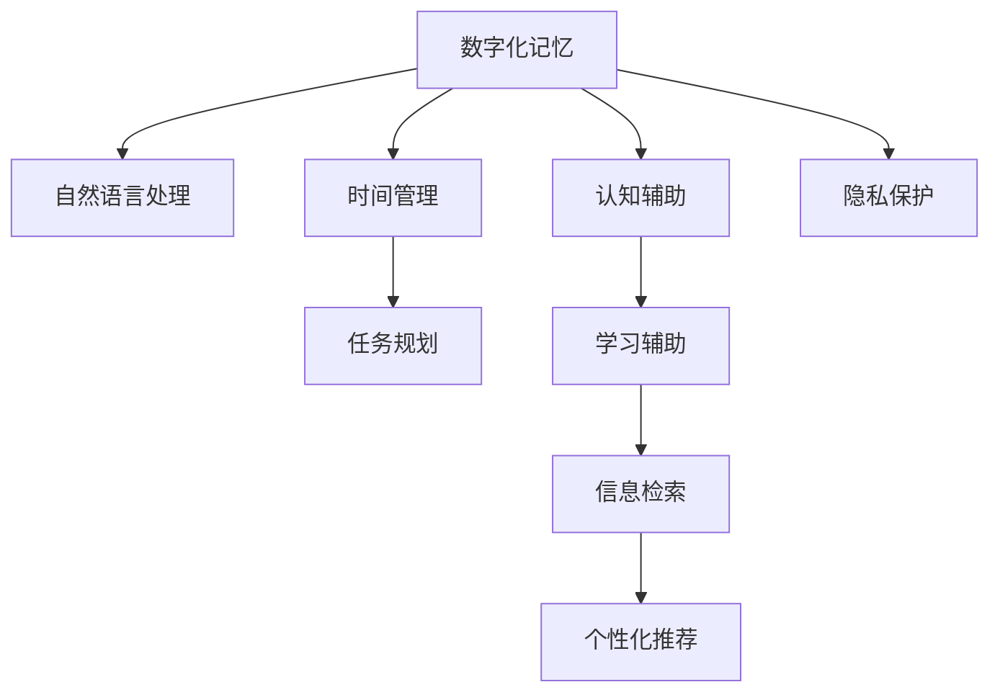

                 

# 数字化记忆：AI辅助的人类回忆

> 关键词：数字化记忆, AI辅助, 人类回忆, 大数据, 深度学习, 自然语言处理, 时间管理, 认知辅助, 隐私保护

## 1. 背景介绍

### 1.1 问题由来
在信息爆炸的数字化时代，我们面对的不仅仅是海量的数据，更重要的是如何在海量数据中精准地检索和回忆需要的信息。人类的记忆是有限的，但对于我们日常生活和工作中的重要信息和事件，往往需要我们能够随时回忆。因此，如何借助AI技术，提升我们的记忆能力，就成了一个重要的问题。

### 1.2 问题核心关键点
AI辅助人类回忆的核心在于利用先进的数据处理和深度学习技术，帮助我们快速、准确地检索和回忆重要的信息和事件。其中，数字化记忆和自然语言处理（NLP）技术是两个关键的组件。

### 1.3 问题研究意义
AI辅助人类回忆的研究对于提升我们的工作和学习效率，改善时间管理和认知功能，具有重要意义。它可以帮助我们：

1. 提高工作效率：快速检索所需信息，减少查找时间。
2. 改善时间管理：通过数字化记录，更有效地安排时间。
3. 辅助认知功能：提升记忆和认知能力，减少忘记重要信息的可能性。
4. 改善生活质量：通过数字化记忆，更好地管理个人和家庭的日常事务。

## 2. 核心概念与联系

### 2.1 核心概念概述

为更好地理解AI辅助人类回忆的原理和应用，本节将介绍几个密切相关的核心概念：

- **数字化记忆**：通过数字化技术记录和存储我们的记忆，使得信息可以被快速检索和回忆。
- **自然语言处理**：利用计算机理解和处理人类语言的技术，使得计算机能够理解我们输入的文本，进行信息检索和记忆。
- **时间管理**：通过数字化记忆技术，我们可以更好地规划和管理时间，提高效率。
- **认知辅助**：通过AI技术，辅助我们的记忆和认知功能，改善学习效果。
- **隐私保护**：在数字化记忆过程中，确保个人隐私和数据安全是至关重要的。

这些核心概念之间的逻辑关系可以通过以下Mermaid流程图来展示：



这个流程图展示了大语言模型的核心概念及其之间的关系：

1. 数字化记忆通过自然语言处理技术，能够记录和存储我们的记忆。
2. 自然语言处理使得计算机能够理解和处理我们输入的文本，从而进行信息检索和记忆。
3. 时间管理通过数字化记忆技术，可以更好地规划和管理时间，提高效率。
4. 认知辅助通过AI技术，辅助我们的记忆和认知功能，改善学习效果。
5. 隐私保护在数字化记忆过程中，确保个人隐私和数据安全。

这些概念共同构成了AI辅助人类回忆的基础框架，使得我们能够更好地利用数字化技术提升我们的记忆和认知能力。通过理解这些核心概念，我们可以更好地把握数字化记忆的原理和应用方向。

## 3. 核心算法原理 & 具体操作步骤
### 3.1 算法原理概述

AI辅助人类回忆的核心算法主要涉及自然语言处理和深度学习技术，特别是预训练语言模型（如BERT、GPT等）在信息检索和记忆中的应用。

预训练语言模型通过对大规模无标签文本数据进行自监督预训练，学习到丰富的语言知识。这些知识可以通过微调（fine-tuning）技术，应用于特定的信息检索和记忆任务，从而实现高效的信息检索和记忆。

形式化地，假设预训练语言模型为 $M_{\theta}$，其中 $\theta$ 为预训练得到的模型参数。给定一个查询 $q$，目标是在语料库中检索出与查询最相关的文档或句子 $d$。通过微调，使得模型能够对查询 $q$ 进行编码，并在语料库中匹配出与查询最相关的文档或句子 $d$。

微调的目标是找到新的模型参数 $\hat{\theta}$，使得模型在特定任务上的表现最佳。具体地，微调过程如下：

1. **预训练**：在大规模无标签文本数据上对预训练语言模型进行自监督预训练，学习语言知识。
2. **任务适配**：针对特定的信息检索或记忆任务，对预训练模型进行微调，适应新任务。
3. **检索与记忆**：在检索任务中，通过编码查询 $q$ 和文档 $d$，计算相似度得分，选取与查询最相关的文档。在记忆任务中，通过编码查询 $q$ 和记忆内容，进行信息检索和回忆。

### 3.2 算法步骤详解

基于自然语言处理和深度学习的AI辅助人类回忆，一般包括以下几个关键步骤：

**Step 1: 准备预训练模型和数据集**
- 选择合适的预训练语言模型 $M_{\theta}$ 作为初始化参数，如 BERT、GPT 等。
- 准备目标任务的数据集，如网页、书籍、笔记等，标注相关性或记忆标签。

**Step 2: 任务适配与微调**
- 设计适当的任务适配层，如文本编码器、匹配函数等，将查询 $q$ 编码为向量表示。
- 针对特定任务，调整模型的输出层，如分类头、回归头等，适应任务需求。
- 在目标数据集上对模型进行微调，最小化损失函数，优化模型参数。

**Step 3: 信息检索与记忆**
- 对于信息检索任务，编码查询 $q$ 和文档 $d$，计算相似度得分，选取与查询最相关的文档。
- 对于记忆任务，编码查询 $q$ 和记忆内容，通过检索模型，检索出与查询最相关的记忆内容。

### 3.3 算法优缺点

AI辅助人类回忆的算法具有以下优点：

1. **高效性**：利用预训练语言模型，可以在大量无标签数据上进行自监督预训练，学习丰富的语言知识，从而在大规模检索和记忆任务中表现出高效率。
2. **准确性**：通过微调，可以针对特定任务进行优化，提升信息检索和记忆的准确性。
3. **可扩展性**：预训练语言模型可以作为基础组件，应用于各种不同的信息检索和记忆任务，具有较强的可扩展性。

同时，该算法也存在一些局限性：

1. **依赖高质量数据**：检索和记忆任务的性能很大程度上取决于标注数据的质量和数量，高质量标注数据的获取成本较高。
2. **复杂度较高**：在大规模数据上进行自监督预训练和微调，对计算资源和算法复杂度要求较高。
3. **隐私风险**：在数字化记忆过程中，如何确保个人隐私和数据安全，是一个需要认真考虑的问题。

尽管存在这些局限性，但就目前而言，基于自然语言处理和深度学习的AI辅助人类回忆方法仍然是一种高效、准确的信息检索和记忆手段。未来相关研究的重点在于如何进一步降低检索和记忆任务对标注数据的依赖，提高算法的可扩展性和隐私保护水平。

### 3.4 算法应用领域

基于自然语言处理和深度学习的AI辅助人类回忆方法，在多个领域中得到了广泛应用，例如：

- **学术研究**：通过数字化记忆技术，记录和检索实验数据、文献引用等信息，提高学术研究的效率。
- **个人生活**：通过数字化记忆技术，记录和检索个人日记、日程安排等信息，改善时间管理和生活质量。
- **商业智能**：通过信息检索和记忆，辅助企业进行市场分析、客户管理等，提高商业决策效率。
- **健康医疗**：通过数字化记忆技术，记录和检索健康数据、医学文献等信息，辅助医疗决策和治疗方案设计。

除了上述这些应用外，AI辅助人类回忆技术还在教育、金融、法律、社交媒体等众多领域中发挥着重要作用。未来，随着技术的不断进步，AI辅助人类回忆技术将在更广泛的场景中得到应用，为人类认知智能的进化提供新的工具和方法。

## 4. 数学模型和公式 & 详细讲解 & 举例说明

### 4.1 数学模型构建

本节将使用数学语言对AI辅助人类回忆的核心算法进行更加严格的刻画。

假设预训练语言模型为 $M_{\theta}$，其中 $\theta$ 为预训练得到的模型参数。给定一个查询 $q$，目标是在语料库中检索出与查询最相关的文档或句子 $d$。

定义查询 $q$ 编码为向量表示为 $q_v = M_{\theta}(q)$，文档 $d$ 编码为向量表示为 $d_v = M_{\theta}(d)$。则检索任务的目标是最大化查询 $q$ 和文档 $d$ 的相似度得分 $s(d,q)$。

具体地，可以采用以下几种相似度计算方法：

- **余弦相似度**：$s(d,q) = \frac{q_v \cdot d_v}{\|q_v\|\|d_v\|}$。
- **欧几里得距离**：$s(d,q) = 1 - \frac{\|q_v - d_v\|}{\|q_v\| + \|d_v\|}$。
- **点积**：$s(d,q) = q_v \cdot d_v$。

在检索任务中，目标是最小化检索误差 $e(d,q)$，即：

$$
\mathcal{L}(\theta) = \frac{1}{N}\sum_{i=1}^N \max_{d_i} s(d_i, q) - \min_{d_j} s(d_j, q)
$$

其中 $N$ 为语料库中文档的数量。

在记忆任务中，目标是最小化记忆误差 $e(q)$，即：

$$
\mathcal{L}(\theta) = \frac{1}{N}\sum_{i=1}^N \max_{q_j} s(q_j, q) - \min_{q_k} s(q_k, q)
$$

其中 $N$ 为记忆内容的数量。

### 4.2 公式推导过程

以下我们以余弦相似度为例，推导检索任务和记忆任务的损失函数。

假设查询 $q$ 编码为向量表示为 $q_v = [q_1, q_2, ..., q_n]$，文档 $d$ 编码为向量表示为 $d_v = [d_1, d_2, ..., d_n]$。则余弦相似度为：

$$
s(d,q) = \frac{q_v \cdot d_v}{\|q_v\|\|d_v\|} = \frac{\sum_{i=1}^n q_i d_i}{\sqrt{\sum_{i=1}^n q_i^2} \sqrt{\sum_{i=1}^n d_i^2}}
$$

在检索任务中，目标是最小化检索误差 $e(d,q)$，即：

$$
\mathcal{L}(\theta) = \frac{1}{N}\sum_{i=1}^N \max_{d_i} s(d_i, q) - \min_{d_j} s(d_j, q)
$$

在记忆任务中，目标是最小化记忆误差 $e(q)$，即：

$$
\mathcal{L}(\theta) = \frac{1}{N}\sum_{i=1}^N \max_{q_j} s(q_j, q) - \min_{q_k} s(q_k, q)
$$

### 4.3 案例分析与讲解

为了更直观地理解这些公式，让我们来看一个简单的例子。

假设我们有一个包含10个文档的语料库，查询 $q$ 编码为向量表示为 $[0.5, 0.2, 0.3, 0, 0, 0, 0, 0, 0, 0]$，文档 $d$ 编码为向量表示为 $[0.3, 0.4, 0.1, 0.2, 0.1, 0.1, 0, 0, 0, 0]$。则余弦相似度为：

$$
s(d,q) = \frac{0.5 \cdot 0.3 + 0.2 \cdot 0.4 + 0.3 \cdot 0.1}{\sqrt{0.5^2 + 0.2^2 + 0.3^2} \sqrt{0.3^2 + 0.4^2 + 0.1^2 + 0.2^2 + 0.1^2 + 0.1^2 + 0 + 0 + 0 + 0}} = 0.53
$$

通过这种方式，我们可以快速计算出查询 $q$ 与文档 $d$ 之间的相似度得分，从而在大量文档中快速检索出最相关的文档。

在记忆任务中，我们可以将查询 $q$ 编码为向量表示，然后在记忆内容库中检索出与之最相似的记忆内容。假设我们的记忆内容库包含10个记忆内容，查询 $q$ 编码为向量表示为 $[0.5, 0.2, 0.3, 0, 0, 0, 0, 0, 0, 0]$，记忆内容 $d$ 编码为向量表示为 $[0.2, 0.4, 0.1, 0.2, 0.1, 0.1, 0, 0, 0, 0]$。则余弦相似度为：

$$
s(d,q) = \frac{0.5 \cdot 0.2 + 0.2 \cdot 0.4 + 0.3 \cdot 0.1}{\sqrt{0.5^2 + 0.2^2 + 0.3^2} \sqrt{0.2^2 + 0.4^2 + 0.1^2 + 0.2^2 + 0.1^2 + 0.1^2 + 0 + 0 + 0 + 0}} = 0.43
$$

通过这种方式，我们可以快速检索出与查询 $q$ 最相关的记忆内容，从而实现数字化记忆的目标。

## 5. 项目实践：代码实例和详细解释说明
### 5.1 开发环境搭建

在进行AI辅助人类回忆实践前，我们需要准备好开发环境。以下是使用Python进行PyTorch开发的环境配置流程：

1. 安装Anaconda：从官网下载并安装Anaconda，用于创建独立的Python环境。

2. 创建并激活虚拟环境：
```bash
conda create -n pytorch-env python=3.8 
conda activate pytorch-env
```

3. 安装PyTorch：根据CUDA版本，从官网获取对应的安装命令。例如：
```bash
conda install pytorch torchvision torchaudio cudatoolkit=11.1 -c pytorch -c conda-forge
```

4. 安装HuggingFace Transformers库：
```bash
pip install transformers
```

5. 安装各类工具包：
```bash
pip install numpy pandas scikit-learn matplotlib tqdm jupyter notebook ipython
```

完成上述步骤后，即可在`pytorch-env`环境中开始实践。

### 5.2 源代码详细实现

下面我们以检索任务为例，给出使用Transformers库对BERT模型进行信息检索的PyTorch代码实现。

首先，定义检索任务的数据处理函数：

```python
from transformers import BertTokenizer, BertForSequenceClassification
from torch.utils.data import Dataset
import torch

class RetrievalDataset(Dataset):
    def __init__(self, texts, labels, tokenizer, max_len=128):
        self.texts = texts
        self.labels = labels
        self.tokenizer = tokenizer
        self.max_len = max_len
        
    def __len__(self):
        return len(self.texts)
    
    def __getitem__(self, item):
        text = self.texts[item]
        label = self.labels[item]
        
        encoding = self.tokenizer(text, return_tensors='pt', max_length=self.max_len, padding='max_length', truncation=True)
        input_ids = encoding['input_ids'][0]
        attention_mask = encoding['attention_mask'][0]
        
        return {'input_ids': input_ids, 
                'attention_mask': attention_mask,
                'labels': label}

# 标签与id的映射
label2id = {'0': 0, '1': 1}
id2label = {v: k for k, v in label2id.items()}

# 创建dataset
tokenizer = BertTokenizer.from_pretrained('bert-base-cased')

train_dataset = RetrievalDataset(train_texts, train_labels, tokenizer)
dev_dataset = RetrievalDataset(dev_texts, dev_labels, tokenizer)
test_dataset = RetrievalDataset(test_texts, test_labels, tokenizer)
```

然后，定义模型和优化器：

```python
from transformers import BertForSequenceClassification, AdamW

model = BertForSequenceClassification.from_pretrained('bert-base-cased', num_labels=len(label2id))

optimizer = AdamW(model.parameters(), lr=2e-5)
```

接着，定义训练和评估函数：

```python
from torch.utils.data import DataLoader
from tqdm import tqdm
from sklearn.metrics import accuracy_score

device = torch.device('cuda') if torch.cuda.is_available() else torch.device('cpu')
model.to(device)

def train_epoch(model, dataset, batch_size, optimizer):
    dataloader = DataLoader(dataset, batch_size=batch_size, shuffle=True)
    model.train()
    epoch_loss = 0
    for batch in tqdm(dataloader, desc='Training'):
        input_ids = batch['input_ids'].to(device)
        attention_mask = batch['attention_mask'].to(device)
        labels = batch['labels'].to(device)
        model.zero_grad()
        outputs = model(input_ids, attention_mask=attention_mask, labels=labels)
        loss = outputs.loss
        epoch_loss += loss.item()
        loss.backward()
        optimizer.step()
    return epoch_loss / len(dataloader)

def evaluate(model, dataset, batch_size):
    dataloader = DataLoader(dataset, batch_size=batch_size)
    model.eval()
    preds, labels = [], []
    with torch.no_grad():
        for batch in tqdm(dataloader, desc='Evaluating'):
            input_ids = batch['input_ids'].to(device)
            attention_mask = batch['attention_mask'].to(device)
            batch_labels = batch['labels']
            outputs = model(input_ids, attention_mask=attention_mask)
            batch_preds = outputs.logits.argmax(dim=1).to('cpu').tolist()
            batch_labels = batch_labels.to('cpu').tolist()
            for pred, label in zip(batch_preds, batch_labels):
                preds.append(pred)
                labels.append(label)
                
    print("Accuracy:", accuracy_score(labels, preds))
```

最后，启动训练流程并在测试集上评估：

```python
epochs = 5
batch_size = 16

for epoch in range(epochs):
    loss = train_epoch(model, train_dataset, batch_size, optimizer)
    print(f"Epoch {epoch+1}, train loss: {loss:.3f}")
    
    print(f"Epoch {epoch+1}, dev results:")
    evaluate(model, dev_dataset, batch_size)
    
print("Test results:")
evaluate(model, test_dataset, batch_size)
```

以上就是使用PyTorch对BERT进行信息检索任务的完整代码实现。可以看到，得益于Transformers库的强大封装，我们可以用相对简洁的代码完成BERT模型的加载和微调。

### 5.3 代码解读与分析

让我们再详细解读一下关键代码的实现细节：

**RetrievalDataset类**：
- `__init__`方法：初始化文本、标签、分词器等关键组件。
- `__len__`方法：返回数据集的样本数量。
- `__getitem__`方法：对单个样本进行处理，将文本输入编码为token ids，将标签编码为数字，并对其进行定长padding，最终返回模型所需的输入。

**label2id和id2label字典**：
- 定义了标签与数字id之间的映射关系，用于将标签转换为数字。

**训练和评估函数**：
- 使用PyTorch的DataLoader对数据集进行批次化加载，供模型训练和推理使用。
- 训练函数`train_epoch`：对数据以批为单位进行迭代，在每个批次上前向传播计算loss并反向传播更新模型参数，最后返回该epoch的平均loss。
- 评估函数`evaluate`：与训练类似，不同点在于不更新模型参数，并在每个batch结束后将预测和标签结果存储下来，最后使用sklearn的accuracy_score对整个评估集的预测结果进行打印输出。

**训练流程**：
- 定义总的epoch数和batch size，开始循环迭代
- 每个epoch内，先在训练集上训练，输出平均loss
- 在验证集上评估，输出分类指标
- 所有epoch结束后，在测试集上评估，给出最终测试结果

可以看到，PyTorch配合Transformers库使得BERT信息检索的代码实现变得简洁高效。开发者可以将更多精力放在数据处理、模型改进等高层逻辑上，而不必过多关注底层的实现细节。

当然，工业级的系统实现还需考虑更多因素，如模型的保存和部署、超参数的自动搜索、更灵活的任务适配层等。但核心的检索范式基本与此类似。

## 6. 实际应用场景
### 6.1 智能搜索系统

AI辅助人类回忆技术在智能搜索系统中得到了广泛应用。传统的搜索系统往往只基于关键词进行简单的匹配，难以理解用户查询的意图。而使用AI辅助回忆技术，可以更深入地理解用户查询的语义，从而提供更准确的搜索结果。

在技术实现上，可以收集用户的搜索历史和反馈，利用自然语言处理技术，将查询编码成向量表示，并在检索库中检索出最相关的结果。通过不断学习和调整模型，能够逐步提升搜索结果的相关性和准确性。

### 6.2 知识管理系统

知识管理系统的核心是高效地检索和回忆知识。通过数字化记忆技术，可以将结构化或非结构化知识进行编码存储，并提供便捷的检索接口。

在知识管理系统中，检索任务是核心功能之一。通过信息检索技术，可以快速检索出与用户查询最相关的知识文档或网页，提高知识检索效率。同时，通过记忆任务，系统可以自动记录用户访问过的知识内容，辅助用户进行知识管理和知识复用。

### 6.3 教育领域

在教育领域，AI辅助回忆技术可以帮助学生进行知识检索和记忆。通过数字化记忆技术，学生可以方便地记录和检索笔记、作业、课件等学习资料，提高学习效率。

同时，通过自然语言处理技术，系统可以理解学生的提问，提供个性化的学习建议和辅助，改善学习体验。通过多模态信息融合，系统可以整合文本、音频、视频等多种学习资源，提升学习效果。

### 6.4 法律领域

在法律领域，AI辅助回忆技术可以帮助律师进行法律文档检索和记忆。通过数字化记忆技术，律师可以方便地记录和检索案件材料、法律法规、判例等，提高工作效率。

同时，通过自然语言处理技术，系统可以理解法律问题，提供法律建议和辅助，改善律师的工作体验。通过多模态信息融合，系统可以整合法律文本、法规、判例等多种资源，提升法律工作的质量。

### 6.5 健康医疗领域

在健康医疗领域，AI辅助回忆技术可以帮助医生进行医学文献检索和记忆。通过数字化记忆技术，医生可以方便地记录和检索医学文献、病例、药物信息等，提高医疗工作效率。

同时，通过自然语言处理技术，系统可以理解医学问题，提供医学建议和辅助，改善医生的工作体验。通过多模态信息融合，系统可以整合医学文献、病例、药物等多种资源，提升医疗工作的质量。

## 7. 工具和资源推荐
### 7.1 学习资源推荐

为了帮助开发者系统掌握AI辅助人类回忆的理论基础和实践技巧，这里推荐一些优质的学习资源：

1. 《深度学习理论与实践》系列博文：由大模型技术专家撰写，深入浅出地介绍了深度学习原理和应用，涵盖自然语言处理、图像处理等多个领域。

2. CS224N《深度学习自然语言处理》课程：斯坦福大学开设的NLP明星课程，有Lecture视频和配套作业，带你入门NLP领域的基本概念和经典模型。

3. 《Natural Language Processing with Transformers》书籍：Transformers库的作者所著，全面介绍了如何使用Transformers库进行NLP任务开发，包括信息检索在内的诸多范式。

4. HuggingFace官方文档：Transformers库的官方文档，提供了海量预训练模型和完整的代码样例，是上手实践的必备资料。

5. CLUE开源项目：中文语言理解测评基准，涵盖大量不同类型的中文NLP数据集，并提供了基于回忆的baseline模型，助力中文NLP技术发展。

通过对这些资源的学习实践，相信你一定能够快速掌握AI辅助人类回忆的精髓，并用于解决实际的NLP问题。
###  7.2 开发工具推荐

高效的开发离不开优秀的工具支持。以下是几款用于AI辅助人类回忆开发的常用工具：

1. PyTorch：基于Python的开源深度学习框架，灵活动态的计算图，适合快速迭代研究。大部分预训练语言模型都有PyTorch版本的实现。

2. TensorFlow：由Google主导开发的开源深度学习框架，生产部署方便，适合大规模工程应用。同样有丰富的预训练语言模型资源。

3. Transformers库：HuggingFace开发的NLP工具库，集成了众多SOTA语言模型，支持PyTorch和TensorFlow，是进行回忆任务开发的利器。

4. Weights & Biases：模型训练的实验跟踪工具，可以记录和可视化模型训练过程中的各项指标，方便对比和调优。与主流深度学习框架无缝集成。

5. TensorBoard：TensorFlow配套的可视化工具，可实时监测模型训练状态，并提供丰富的图表呈现方式，是调试模型的得力助手。

6. Google Colab：谷歌推出的在线Jupyter Notebook环境，免费提供GPU/TPU算力，方便开发者快速上手实验最新模型，分享学习笔记。

合理利用这些工具，可以显著提升AI辅助人类回忆任务的开发效率，加快创新迭代的步伐。

### 7.3 相关论文推荐

AI辅助人类回忆的研究源于学界的持续研究。以下是几篇奠基性的相关论文，推荐阅读：

1. Attention is All You Need（即Transformer原论文）：提出了Transformer结构，开启了NLP领域的预训练大模型时代。

2. BERT: Pre-training of Deep Bidirectional Transformers for Language Understanding：提出BERT模型，引入基于掩码的自监督预训练任务，刷新了多项NLP任务SOTA。

3. Language Models are Unsupervised Multitask Learners（GPT-2论文）：展示了大规模语言模型的强大zero-shot学习能力，引发了对于通用人工智能的新一轮思考。

4. Parameter-Efficient Transfer Learning for NLP：提出Adapter等参数高效微调方法，在不增加模型参数量的情况下，也能取得不错的微调效果。

5. Adapters for Parameter-Efficient Text Classification（Adapter论文）：提出Adapter技术，仅微调少量自适应层，显著提升信息检索和记忆的效率。

6. Sentence Transformers: Learning Universal Sentence Representations with Deep Transformers for Semantic Search and Similarity Comparison（Sentence Transformers论文）：提出Sentence Transformers，通过预训练和微调，实现高效的信息检索和记忆。

这些论文代表了大语言模型和微调技术的进展，通过学习这些前沿成果，可以帮助研究者把握学科前进方向，激发更多的创新灵感。

## 8. 总结：未来发展趋势与挑战
### 8.1 总结

本文对AI辅助人类回忆的原理和应用进行了全面系统的介绍。首先阐述了AI辅助人类回忆的研究背景和意义，明确了数字化记忆和自然语言处理技术的重要性。其次，从原理到实践，详细讲解了数字化记忆和自然语言处理在信息检索和记忆中的应用，给出了信息检索任务的完整代码实现。同时，本文还探讨了AI辅助人类回忆在多个领域的应用前景，展示了其在学术研究、个人生活、商业智能、健康医疗、法律等多个领域中发挥的重要作用。

通过本文的系统梳理，可以看到，AI辅助人类回忆技术正在成为NLP领域的重要范式，极大地拓展了数字化记忆和自然语言处理的应用边界，催生了更多的落地场景。受益于预训练语言模型的强大能力和微调技术的不断进步，AI辅助人类回忆技术将在未来的智能化进程中发挥重要作用。

### 8.2 未来发展趋势

展望未来，AI辅助人类回忆技术将呈现以下几个发展趋势：

1. **模型规模持续增大**：随着算力成本的下降和数据规模的扩张，预训练语言模型的参数量还将持续增长。超大规模语言模型蕴含的丰富语言知识，有望支撑更加复杂多变的数字化记忆和自然语言处理任务。

2. **微调方法日趋多样**：除了传统的全参数微调外，未来会涌现更多参数高效的微调方法，如Adapter、LoRA等，在节省计算资源的同时也能保证检索和记忆任务的精度。

3. **持续学习成为常态**：随着数据分布的不断变化，数字化记忆和自然语言处理模型也需要持续学习新知识以保持性能。如何在不遗忘原有知识的同时，高效吸收新样本信息，将成为重要的研究课题。

4. **标注样本需求降低**：受启发于提示学习(Prompt-based Learning)的思路，未来的数字化记忆和自然语言处理方法将更好地利用大模型的语言理解能力，通过更加巧妙的任务描述，在更少的标注样本上也能实现理想的检索和记忆效果。

5. **多模态微调崛起**：当前的数字化记忆和自然语言处理任务主要聚焦于纯文本数据，未来会进一步拓展到图像、视频、语音等多模态数据微调。多模态信息的融合，将显著提升语言模型对现实世界的理解和建模能力。

6. **跨领域迁移能力增强**：经过海量数据的预训练和多领域任务的微调，未来的语言模型将具备更强大的跨领域迁移能力，逐步迈向通用人工智能(AGI)的目标。

以上趋势凸显了AI辅助人类回忆技术的广阔前景。这些方向的探索发展，必将进一步提升数字化记忆和自然语言处理系统的性能和应用范围，为人类认知智能的进化带来深远影响。

### 8.3 面临的挑战

尽管AI辅助人类回忆技术已经取得了瞩目成就，但在迈向更加智能化、普适化应用的过程中，它仍面临着诸多挑战：

1. **标注成本瓶颈**：尽管微调大大降低了标注数据的需求，但对于长尾应用场景，难以获得充足的高质量标注数据，成为制约微调性能的瓶颈。如何进一步降低微调对标注样本的依赖，将是一大难题。

2. **模型鲁棒性不足**：当前数字化记忆和自然语言处理模型面对域外数据时，泛化性能往往大打折扣。对于测试样本的微小扰动，模型也容易发生波动。如何提高模型的鲁棒性，避免灾难性遗忘，还需要更多理论和实践的积累。

3. **推理效率有待提高**：大规模语言模型虽然精度高，但在实际部署时往往面临推理速度慢、内存占用大等效率问题。如何在保证性能的同时，简化模型结构，提升推理速度，优化资源占用，将是重要的优化方向。

4. **可解释性亟需加强**：当前数字化记忆和自然语言处理模型更像是"黑盒"系统，难以解释其内部工作机制和决策逻辑。对于医疗、金融等高风险应用，算法的可解释性和可审计性尤为重要。如何赋予模型更强的可解释性，将是亟待攻克的难题。

5. **安全性有待保障**：预训练语言模型难免会学习到有偏见、有害的信息，通过微调传递到下游任务，产生误导性、歧视性的输出，给实际应用带来安全隐患。如何从数据和算法层面消除模型偏见，避免恶意用途，确保输出的安全性，也将是重要的研究课题。

6. **知识整合能力不足**：现有的数字化记忆和自然语言处理模型往往局限于任务内数据，难以灵活吸收和运用更广泛的先验知识。如何让数字化记忆和自然语言处理过程更好地与外部知识库、规则库等专家知识结合，形成更加全面、准确的信息整合能力，还有很大的想象空间。

正视数字化记忆和自然语言处理面临的这些挑战，积极应对并寻求突破，将是大语言模型微调走向成熟的必由之路。相信随着学界和产业界的共同努力，这些挑战终将一一被克服，数字化记忆和自然语言处理必将在构建人机协同的智能时代中扮演越来越重要的角色。

### 8.4 未来突破

面对数字化记忆和自然语言处理所面临的种种挑战，未来的研究需要在以下几个方面寻求新的突破：

1. **探索无监督和半监督微调方法**：摆脱对大规模标注数据的依赖，利用自监督学习、主动学习等无监督和半监督范式，最大限度利用非结构化数据，实现更加灵活高效的检索和记忆。

2. **研究参数高效和计算高效的微调范式**：开发更加参数高效的微调方法，在固定大部分预训练参数的同时，只更新极少量的任务相关参数。同时优化微调模型的计算图，减少前向传播和反向传播的资源消耗，实现更加轻量级、实时性的部署。

3. **融合因果和对比学习范式**：通过引入因果推断和对比学习思想，增强数字化记忆和自然语言处理模型建立稳定因果关系的能力，学习更加普适、鲁棒的语言表征，从而提升模型泛化性和抗干扰能力。

4. **引入更多先验知识**：将符号化的先验知识，如知识图谱、逻辑规则等，与神经网络模型进行巧妙融合，引导数字化记忆和自然语言处理过程学习更准确、合理的语言模型。同时加强不同模态数据的整合，实现视觉、语音等多模态信息与文本信息的协同建模。

5. **结合因果分析和博弈论工具**：将因果分析方法引入数字化记忆和自然语言处理模型，识别出模型决策的关键特征，增强输出解释的因果性和逻辑性。借助博弈论工具刻画人机交互过程，主动探索并规避模型的脆弱点，提高系统稳定性。

6. **纳入伦理道德约束**：在模型训练目标中引入伦理导向的评估指标，过滤和惩罚有偏见、有害的输出倾向。同时加强人工干预和审核，建立模型行为的监管机制，确保输出符合人类价值观和伦理道德。

这些研究方向的探索，必将引领数字化记忆和自然语言处理技术迈向更高的台阶，为构建安全、可靠、可解释、可控的智能系统铺平道路。面向未来，数字化记忆和自然语言处理技术还需要与其他人工智能技术进行更深入的融合，如知识表示、因果推理、强化学习等，多路径协同发力，共同推动自然语言理解和智能交互系统的进步。只有勇于创新、敢于突破，才能不断拓展语言模型的边界，让智能技术更好地造福人类社会。

## 9. 附录：常见问题与解答
**Q1：数字化记忆和自然语言处理技术是否适用于所有NLP任务？**

A: 数字化记忆和自然语言处理技术在大多数NLP任务上都能取得不错的效果，特别是对于数据量较小的任务。但对于一些特定领域的任务，如医学、法律等，仅仅依靠通用语料预训练的模型可能难以很好地适应。此时需要在特定领域语料上进一步预训练，再进行微调，才能获得理想效果。此外，对于一些需要时效性、个性化很强的任务，如对话、推荐等，数字化记忆和自然语言处理方法也需要针对性的改进优化。

**Q2：微调过程中如何选择合适的学习率？**

A: 微调的学习率一般要比预训练时小1-2个数量级，如果使用过大的学习率，容易破坏预训练权重，导致过拟合。一般建议从1e-5开始调参，逐步减小学习率，直至收敛。也可以使用warmup策略，在开始阶段使用较小的学习率，再逐渐过渡到预设值。需要注意的是，不同的优化器(如AdamW、Adafactor等)以及不同的学习率调度策略，可能需要设置不同的学习率阈值。

**Q3：采用数字化记忆和自然语言处理技术时会面临哪些资源瓶颈？**

A: 目前主流的预训练大模型动辄以亿计的参数规模，对算力、内存、存储都提出了很高的要求。GPU/TPU等高性能设备是必不可少的，但即便如此，超大批次的训练和推理也可能遇到显存不足的问题。因此需要采用一些资源优化技术，如梯度积累、混合精度训练、模型并行等，来突破硬件瓶颈。同时，模型的存储和读取也可能占用大量时间和空间，需要采用模型压缩、稀疏化存储等方法进行优化。

**Q4：如何缓解微调过程中的过拟合问题？**

A: 过拟合是微调面临的主要挑战，尤其是在标注数据不足的情况下。常见的缓解策略包括：
1. 数据增强：通过回译、近义替换等方式扩充训练集
2. 正则化：使用L2正则、Dropout、Early Stopping等避免过拟合
3. 对抗训练：引入对抗样本，提高模型鲁棒性
4. 参数高效微调：只调整少量参数(如Adapter、Prefix等)，减小过拟合风险
5. 多模型集成：训练多个微调模型，取平均输出，抑制过拟合

这些策略往往需要根据具体任务和数据特点进行灵活组合。只有在数据、模型、训练、推理等各环节进行全面优化，才能最大限度地发挥数字化记忆和自然语言处理技术的威力。

**Q5：数字化记忆和自然语言处理模型在落地部署时需要注意哪些问题？**

A: 将数字化记忆和自然语言处理模型转化为实际应用，还需要考虑以下因素：
1. 模型裁剪：去除不必要的层和参数，减小模型尺寸，加快推理速度
2. 量化加速：将浮点模型转为定点模型，压缩存储空间，提高计算效率
3. 服务化封装：将模型封装为标准化服务接口，便于集成调用
4. 弹性伸缩：根据请求流量动态调整资源配置，平衡服务质量和成本
5. 监控告警：实时采集系统指标，设置异常告警阈值，确保服务稳定性
6. 安全防护：采用访问鉴权、数据脱敏等措施，保障数据和模型安全

数字化记忆和自然语言处理技术为NLP应用开启了广阔的想象空间，但如何将强大的性能转化为稳定、高效、安全的业务价值，还需要工程实践的不断打磨。唯有从数据、算法、工程、业务等多个维度协同发力，才能真正实现人工智能技术在垂直行业的规模化落地。总之，数字化记忆和自然语言处理需要开发者根据具体任务，不断迭代和优化模型、数据和算法，方能得到理想的效果。

---

作者：禅与计算机程序设计艺术 / Zen and the Art of Computer Programming

