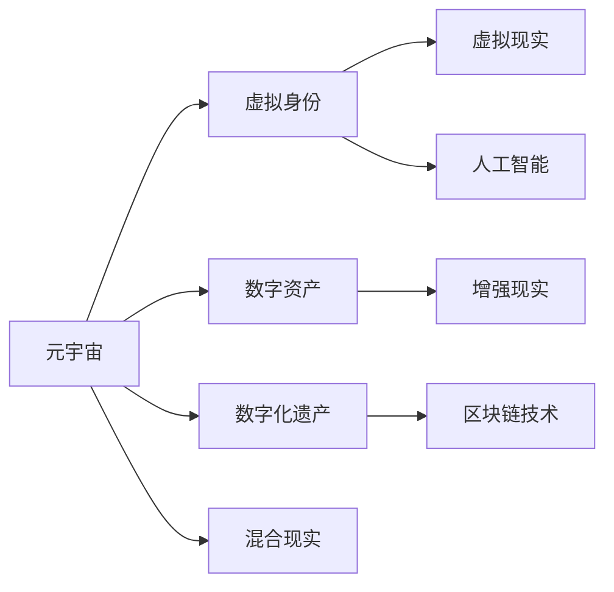

                 

# 数字化遗产：元宇宙中的生命延续

> 关键词：元宇宙、数字化遗产、生命延续、区块链技术、虚拟现实、人工智能、数据安全

## 1. 背景介绍

### 1.1 问题由来
随着数字技术的迅猛发展，人们的生活方式、工作方式甚至认知方式都在发生深刻变革。虚拟现实(VR)、增强现实(AR)、混合现实(MR)、云计算、大数据、物联网、人工智能等前沿技术的涌现，正在逐步构建出一个数字化、虚拟化的“元宇宙”。元宇宙(Meta Universe)，也称为“虚拟宇宙”，是一个由虚拟环境和真实世界相互融合，通过数字技术实现持续连接与交互的全新世界。

元宇宙不仅是一个技术概念，更是人类未来生活的一种理想形态。它包括了数字身份、虚拟资产、虚拟活动等多个维度，代表了数字化的生活、工作、娱乐等方方面面。同时，元宇宙也是人类数字化遗产的重要体现，它不仅是虚拟资产的沉淀，更是个人历史、记忆、知识和创造力的结晶。在元宇宙中，个体不仅能实现身份的数字化延续，还能通过数字形式传承和传递个人价值和智慧。

### 1.2 问题核心关键点
元宇宙中的数字化遗产继承问题，主要涉及以下几个关键点：

1. **身份与数据迁移**：如何确保用户在不同平台间的身份连续性，以及如何将个人的数字身份和数据安全、高效地迁移。
2. **数字资产管理**：如何在元宇宙中管理和继承虚拟资产，如虚拟地产、虚拟货币、虚拟艺术品等，并确保其法律权益。
3. **数字记忆与创造力**：如何将个人的虚拟作品、创作、知识等数字化遗产，以数字形式永久保存并传承。
4. **隐私与安全**：在数字化遗产的继承与传递过程中，如何保障用户数据隐私安全，防止数据泄漏和滥用。
5. **标准与规范**：建立和遵循统一的元宇宙数字化遗产继承标准与规范，确保系统的兼容性和互操作性。

这些问题的解决，将直接影响元宇宙数字化遗产的传递和继承，从而实现人类在虚拟世界的生命延续。本文将从身份与数据迁移、数字资产管理、数字记忆与创造力的传承、隐私与安全以及标准与规范等方面，深入探讨如何构建一个安全、高效、公平的元宇宙数字化遗产继承系统。

## 2. 核心概念与联系

### 2.1 核心概念概述

为更好地理解元宇宙中数字化遗产的继承问题，本节将介绍几个关键概念：

- **元宇宙(Meta Universe)**：由数字技术和现实世界深度融合形成的虚拟世界，是一个开放、互连的数字化生态系统。
- **虚拟身份(Virtual Identity)**：在元宇宙中，每个个体都有唯一的虚拟身份，可以在不同的虚拟空间中进行活动。
- **数字资产(Digital Assets)**：虚拟物品、虚拟货币、虚拟地产等在元宇宙中的财产，具有经济价值和法律意义。
- **数字化遗产(Digital Legacy)**：个人在元宇宙中的虚拟身份、作品、创作、知识等数字化形式的历史记录和传承。
- **区块链技术(Blockchain Technology)**：一种去中心化的分布式账本技术，具有去中心化、不可篡改、透明公开等特点，是元宇宙数字化遗产继承的核心基础。
- **虚拟现实(Virtual Reality, VR)**：通过虚拟现实设备模拟现实世界的体验，提供沉浸式的人机交互方式。
- **增强现实(Enhanced Reality, AR)**：将数字信息叠加在现实世界中，增强用户对现实世界的感知。
- **混合现实(Mixed Reality, MR)**：将虚拟世界和现实世界进行融合，为用户提供全新的交互体验。
- **人工智能(Artificial Intelligence, AI)**：通过算法、数据和计算技术，实现对虚拟世界的智能感知、理解和交互。

这些核心概念之间的联系可以通过以下Mermaid流程图来展示：



这个流程图展示了几组概念之间的关系：

1. 元宇宙通过虚拟身份、数字资产、数字化遗产等概念，实现了对个体在虚拟世界中的身份、财产、历史等多维度的数字化表现。
2. 区块链技术是元宇宙中数字化遗产继承的基础设施，确保了数据的不可篡改和透明性。
3. 虚拟现实、增强现实和混合现实提供了不同的交互方式，增强了用户体验。
4. 人工智能技术则为元宇宙提供了智能感知和理解的能力。

这些概念共同构成了元宇宙数字化遗产继承的基础框架，其核心在于如何通过数字技术和平台，实现个体在虚拟世界中的身份和数据连续性、财产的合法管理、历史的传承和记忆的保存，并确保隐私和安全。

## 3. 核心算法原理 & 具体操作步骤
### 3.1 算法原理概述

元宇宙中数字化遗产的继承，本质上是基于区块链技术去中心化管理和数据安全保护的过程。其核心算法原理包括：

- **去中心化存储与验证**：通过区块链技术，实现去中心化的数据存储和验证，确保数据的不可篡改性和透明性。
- **分布式身份验证**：利用分布式身份认证技术，确保用户在不同平台间的身份连续性和安全性。
- **数字资产加密与合约管理**：通过区块链智能合约，实现数字资产的加密和安全管理，确保资产的合法继承。
- **隐私保护与匿名性**：采用隐私保护技术，如零知识证明、同态加密等，保护用户数据隐私和匿名性。

### 3.2 算法步骤详解

元宇宙数字化遗产继承的算法步骤主要包括以下几个环节：

1. **身份注册与验证**：
    - 用户通过区块链平台注册虚拟身份，并进行身份验证。
    - 验证过程包括生物特征验证、密码验证、多因素认证等。
    - 验证通过后，用户获得相应的数字身份证书。

2. **数据上传与存储**：
    - 用户上传个人在元宇宙中的虚拟作品、创作、知识等数字化遗产。
    - 数据以哈希值形式存储在区块链上，确保数据的完整性和不可篡改性。
    - 使用分布式存储技术，确保数据的高可用性和冗余性。

3. **数字资产管理与继承**：
    - 用户将数字资产登记在区块链上，并设定继承规则。
    - 智能合约根据继承规则，在用户去世后自动执行资产的继承与转移。
    - 通过分布式身份验证，确保资产继承人的合法性。

4. **隐私保护与匿名性**：
    - 采用隐私保护技术，确保用户数据的加密和匿名性。
    - 使用零知识证明等技术，在验证数据真实性的同时，保护用户隐私。
    - 智能合约内置隐私保护机制，限制对数据的访问权限。

5. **系统维护与更新**：
    - 定期更新区块链平台，确保系统的安全性和稳定性。
    - 采用冗余备份和容错机制，防止系统故障和数据丢失。
    - 对用户隐私和数据进行定期审计，确保系统符合隐私保护要求。

### 3.3 算法优缺点

元宇宙数字化遗产继承算法具有以下优点：

- **去中心化与透明性**：区块链技术保证了数据的不可篡改和透明性，避免了单点故障和数据篡改的风险。
- **安全性与隐私保护**：采用加密技术和隐私保护技术，保障了用户数据的安全和隐私。
- **分布式身份验证**：确保了用户在不同平台间的身份连续性和安全性。
- **智能合约管理**：通过智能合约，实现了数字资产的自动管理和继承，降低了管理成本和出错风险。

但该算法也存在以下缺点：

- **技术复杂性**：实现元宇宙数字化遗产继承，需要集成多种前沿技术，技术复杂度较高。
- **资源消耗**：区块链的共识机制和分布式存储需要消耗大量的计算和存储资源。
- **法律合规性**：不同地区的法律法规对数字资产的认定和继承有不同规定，需要考虑合规性问题。
- **用户接受度**：部分用户对区块链和智能合约等新兴技术理解不足，接受度较低。

### 3.4 算法应用领域

元宇宙数字化遗产继承的算法主要应用于以下几个领域：

1. **数字身份管理**：在元宇宙中，通过区块链实现用户的身份认证和管理，确保用户在不同平台间的身份连续性和安全性。
2. **数字资产继承**：通过智能合约实现数字资产的加密、管理与继承，确保数字资产的合法性和安全性。
3. **数字记忆与创造力传承**：将用户的虚拟作品、创作、知识等数字化遗产，以加密形式永久保存并传承。
4. **隐私保护与数据安全**：保护用户的数据隐私和安全，防止数据泄漏和滥用。
5. **标准与规范制定**：建立统一的数字化遗产继承标准与规范，确保系统的兼容性和互操作性。

以上应用领域展示了元宇宙数字化遗产继承算法的广泛适用性，通过合理应用，可以有效解决元宇宙中的身份管理、资产继承、记忆传承等问题，实现个体在虚拟世界的生命延续。

## 4. 数学模型和公式 & 详细讲解 & 举例说明
### 4.1 数学模型构建

元宇宙数字化遗产继承的数学模型主要基于区块链技术，包括分布式账本、共识机制、加密算法、智能合约等。以智能合约为例，智能合约的数学模型可以表示为：

$$
\begin{aligned}
\mathcal{C}(A, P, R, F) &= \{ \\
&\quad V_{\text{contract}} \quad \text{(合同状态)} \\
&\quad F = \{f_1, f_2, ..., f_n\} \quad \text{(函数集合)} \\
&\quad A = \{a_1, a_2, ..., a_m\} \quad \text{(事件集合)} \\
&\quad P = \{p_1, p_2, ..., p_k\} \quad \text{(参数集合)} \\
&\quad R = \{r_1, r_2, ..., r_l\} \quad \text{(规则集合)} \\
&\quad V_{\text{contract}} \xrightarrow{F} \{A, P, R\} \\
\end{aligned}
$$

其中：
- $\mathcal{C}$：智能合约系统
- $A$：合同状态集合
- $F$：函数集合
- $P$：参数集合
- $R$：规则集合

智能合约的执行流程可以表示为：

$$
\begin{aligned}
\mathcal{C}(A, P, R, F) &= \{ \\
&\quad \text{Event}_1 \rightarrow \text{Function}_1 \rightarrow \text{Contract}_1 \\
&\quad \text{Event}_2 \rightarrow \text{Function}_2 \rightarrow \text{Contract}_2 \\
&\quad ... \\
&\quad \text{Event}_n \rightarrow \text{Function}_n \rightarrow \text{Contract}_n \\
\end{aligned}
$$

### 4.2 公式推导过程

智能合约的执行过程可以用伪代码表示：

```python
def execute_contract(event, parameters, rules, functions):
    if parameters['condition']:
        if parameters['logic']:
            functions['function1'](event)
        else:
            functions['function2'](event)
    else:
        functions['function3'](event)

    if rules['rule1'](parameters):
        functions['function4'](event)
    else:
        functions['function5'](event)

    return event
```

其中，`event`表示触发的事件，`parameters`表示事件的相关参数，`rules`表示合同的规则集合，`functions`表示合同的功能集合。

### 4.3 案例分析与讲解

以数字资产继承为例，智能合约的执行过程可以表示为：

1. 用户上传数字资产，并设定继承规则。
2. 智能合约验证上传资产的真实性和完整性。
3. 智能合约根据继承规则，执行数字资产的继承与转移。
4. 智能合约记录继承信息，并确保数据的不可篡改性。

假设某用户在元宇宙中拥有虚拟地产，设定其去世后继承规则为：

- 其法定继承人A和法定继承人B继承50%的虚拟地产。
- 若A先去世，则B继承全部资产。
- 若B先去世，则A的法定继承人C继承全部资产。

智能合约的执行过程如下：

1. 用户上传虚拟地产，并设定继承规则。
2. 智能合约验证上传资产的真实性和完整性。
3. 若用户去世，智能合约根据继承规则执行资产继承与转移。
4. 智能合约记录继承信息，并确保数据的不可篡改性。

## 5. 项目实践：代码实例和详细解释说明
### 5.1 开发环境搭建

在进行数字化遗产继承系统开发前，我们需要准备好开发环境。以下是使用Python进行开发的环境配置流程：

1. 安装Anaconda：从官网下载并安装Anaconda，用于创建独立的Python环境。

2. 创建并激活虚拟环境：
```bash
conda create -n blockchain-env python=3.8 
conda activate blockchain-env
```

3. 安装相关的Python包：
```bash
pip install eth-blockchain
pip install web3
pip install pysha3
pip install pyzmq
pip install requests
pip install flask
pip install py-crypto
```

4. 安装必要的区块链开发工具：
```bash
pip install web3-contract
pip install pyethers
pip install eth-abi
pip install web3.py
```

完成上述步骤后，即可在`blockchain-env`环境中开始项目开发。

### 5.2 源代码详细实现

这里我们以数字资产继承为例，给出使用Python编写智能合约的代码实现。

首先，定义智能合约的基本结构：

```python
from web3 import Web3, HTTPProvider
from web3.eth.account import Account
from pysha3 import keccak_256

# 创建Web3实例，连接本地以太坊节点
web3 = Web3(HTTPProvider('http://127.0.0.1:8545'))

# 创建以太坊账户
from_key = '0x...'  # 用户私钥
account = Account.from_key(from_key)

# 创建智能合约实例
abi = [
    { 'inputs': [{'name': 'owner', 'type': 'address'}], 'outputs': [{'type': 'bool'}], 'name': 'isOwner', 'type': 'function' },
    { 'inputs': [{'name': 'owner', 'type': 'address'}], 'outputs': [{'type': 'bool'}], 'name': 'isInherited', 'type': 'function' },
    { 'inputs': [{'name': 'owner', 'type': 'address'}], 'outputs': [{'type': 'bool'}], 'name': 'isAdopted', 'type': 'function' },
    { 'inputs': [{'name': 'newOwner', 'type': 'address'}], 'outputs': [{'type': 'bool'}], 'name': 'setOwner', 'type': 'function' },
    { 'inputs': [{'name': 'newOwner', 'type': 'address'}], 'outputs': [{'type': 'bool'}], 'name': 'setInherited', 'type': 'function' },
    { 'inputs': [{'name': 'newOwner', 'type': 'address'}], 'outputs': [{'type': 'bool'}], 'name': 'setAdopted', 'type': 'function' }
]

bytecode = '0x60fe47b100000000000000000000000000000000000000000000000000000000000000000000000000000000000000000000000000000000000000000000000000000000000000000000000000000000000000000000000000000000000000000000000000000000000000000000000000000000000000000000000000000000000000000000000000000000000000000000000000000000000000000000000000000000000000000000000000000000000000000000000000000000000000000000000000000000000000000000000000000000000000000000000000000000000000000000000000000000000000000000000000000000000000000000000000000000000000000000000000000000000000000000000000000000000000000000000000000000000000000000000000000000000000000000000000000000000000000000000000000000000000000000000000000000000000000000000000000000000000000000000000000000000000000000000000000000000000000000000000000000000000000000000000000000000000000000000000000000000000000000000000000000000000000000000000000000000000000000000000000000000000000000000000000000000000000000000000000000000000000000000000000000000000000000000000000000000000000000000000000000000000000000000000000000000000000000000000000000000000000000000000000000000000000000000000000000000000000000000000000000000000000000000000000000000000000000000000000000000000000000000000000000000000000000000000000000000000000000000000000000000000000000000000000000000000000000000000000000000000000000000000000000000000000000000000000000000000000000000000000000000000000000000000000000000000000000000000000000000000000000000000000000000000000000000000000000000000000000000000000000000000000000000000000000000000000000000000000000000000000000000000000000000000000000000000000000000000000000000000000000000000000000000000000000000000000000000000000000000000000000000000000000000000000000000000000000000000000000000000000000000000000000000000000000000000000000000000000000000000000000000000000000000000000000000000000000000000000000000000000000000000000000000000000000000000000000000000000000000000000000000000000000000000000000000000000000000000000000000000000000000000000000000000000000000000000000000000000000000000000000000000000000000000000000000000000000000000000000000000000000000000000000000000000000000000000000000000000000000000000000000000000000000000000000000000000000000000000000000000000000000000000000000000000000000000000000000000000000000000000000000000000000000000000000000000000000000000000000000000000000000000000000000000000000000000000000000000000000000000000000000000000000000000000000000000000000000000000000000000000000000000000000000000000000000000000000000000000000000000000000000000000000000000000000000000000000000000000000000000000000000000000000000000000000000000000000000000000000000000000000000000000000000000000000000000000000000000000000000000000000000000000000000000000000000000000000000000000000000000000000000000000000000000000000000000000000000000000000000000000000000000000000000000000000000000000000000000000000000000000000000000000000000000000000000000000000000000000000000000000000000000000000000000000000000000000000000000000000000000000000000000000000000000000000000000000000000000000000000000000000000000000000000000000000000000000000000000000000000000000000000000000000000000000000000000000000000000000000000000000000000000000000000000000000000000000000000000000000000000000000000000000000000000000000000000000000000000000000000000000000000000000000000000000000000000000000000000000000000000000000000000000000000000000000000000000000000000000000000000000000000000000000000000000000000000000000000000000000000000000000000000000000000000000000000000000000000000000000000000000000000000000000000000000000000000000000000000000000000000000000000000000000000000000000000000000000000000000000000000000000000000000000000000000000000000000000000000000000000000000000000000000000000000000000000000000000000000000000000000000000000000000000000000000000000000000000000000000000000000000000000000000000000000000000000000000000000000000000000000000000000000000000000000000000000000000000000000000000000000000000000000000000000000000000000000000000000000000000000000000000000000000000000000000000000000000000000000000000000000000000000000000000000000000000000000000000000000000000000000000000000000000000000000000000000000000000000000000000000000000000000000000000000000000000000000000000000000000000000000000000000000000000000000000000000000000000000000000000000000000000000000000000000000000000000000000000000000000000000000000000000000000000000000000000000000000000000000000000000000000000000000000000000000000000000000000000000000000000000000000000000000000000000000000000000000000000000000000000000000000000000000000000000000000000000000000000000000000000000000000000000000000000000000000000000000000000000000000000000000000000000000000000000000000000000000000000000000000000000000000000000000000000000000000000000000000000000000000000000000000000000000000000000000000000000000000000000000000000000000000000000000000000000000000000000000000000000000000000000000000000000000000000000000000000000000000000000000000000000000000000000000000000000000000000000000000000000000000000000000000000000000000000000000000000000000000000000000000000000000000000000000000000000000000000000000000000000000000000000000000000000000000000000000000000000000000000000000000000000000000000000000000000000000000000000000000000000000000000000000000000000000000000000000000000000000000000000000000000000000000000000000000000000000000000000000000000000000000000000000000000000000000000000000000000000000000000000000000000000000000000000000000000000000000000000000000000000000000000000000000000000000000000000000000000000000000000000000000000000000000000000000000000000000000000000000000000000000000000000000000000000000000000000000000000000000000000000000000000000000000000000000000000000000000000000000000000000000000000000000000000000000000000000000000000000000000000000000000000000000000000000000000000000000000000000000000000000000000000000000000000000000000000000000000000000000000000000000000000000000000000000000000000000000000000000000000000000000000000000000000000000000000000000000000000000000000000000000000000000000000000000000000000000000000000000000000000000000000000000000000000000000000000000000000000000000000000000000000000000000000000000000000000000000000000000000000000000000000000000000000000000000000000000000000000000000000000000000000000000000000000000000000000000000000000000000000000000000000000000000000000000000000000000000000000000000000000000000000000000000000000000000000000000000000000000000000000000000000000000000000000000000000000000000000000000000000000000000000000000000000000000000000000000000000000000000000000000000000000000000000000000000000000000000000000000000000000000000000000000000000000000000000000000000000000000000000000000000000000000000000000000000000000000000000000000000000000000000000000000000000000000000000000000000000000000000000000000000000000000000000000000000000000000000000000000000000000000000000000000000000000000000000000000000000000000000000000000000000000000000000000000000000000000000000000000000000000000000000000000000000000000000000000000000000000000000000000000000000000000000000000000000000000000000000000000000000000000000000000000000000000000000000000000000000000000000000000000000000000000000000000000000000000000000000000000000000000000000000000000000000000000000000000000000000000000000000000000000000000000000000000000000000000000000000000000000000000000000000000000000000000000000000000000000000000000000000000000000000000000000000000000000000000000000000000000000000000000000000000000000000000000000000000000000000000000000000000000000000000000000000000000000000000000000000000000000000000000000000000000000000000000000000000000000000000000000000000000000000000000000000000000000000000000000000000000000000000000000000000000000000000000000000000000000000000000000000000000000000000000000000000000000000000000000000000000000000000000000000000000000000000000000000000000000000000000000000000000000000000000000000000000000000000000000000000000000000000000000000000000000000000000000000000000000000000000000000000000000000000000000000000000000000000000000000000000000000000000000000000000000000000000000000000000000000000000000000000000000000000000000000000000000000000000000000000000000000000000000000000000000000000000000000000000000000000000000000000000000000000000000000000000000000000000000000000000000000000000000000000000000000000000000000000000000000000000000000000000000000000000000000000000000000000000000000000000000000000000000000000000000000000000000000000000000000000000000000000000000000000000000000000000000000000000000000000000000000000000000000000000000000000000000000000000000000000000000000000000000000000000000000000000000000000000000000000000000000000000000000000000000000000000000000000000000000000000000000000000000000000000000000000000000000000000000000000000000000000000000000000000000000000000000000000000000000000000000000000000000000000000000000000000000000000000000000000000000000000000000000000000000000000000000000000000000000000000000000000000000000000000000000000000000000000000000000000000000000000000000000000000000000000000000000000000000000000000000000000000000000000000000000000000000000000000000000000000000000000000000000000000000000000000000000000000000000000000000000000000000000000000000000000000000000000000000000000000000000000000000000000000000000000000000000000000000000000000000000000000000000000000000000000000000000000000000000000000000000000000000000000000000000000000000000000000000000000000000000000000000000000000000000000000000000000000000000000000000000000000000000000000000000000000000000000000000000000000000000000000000000000000000000000000000000000000000000000000000000000000000000000000000000000000000000000000000000000000000000000000000000000000000000000000000000000000000000000000000000000000000000000000000000000000000000000000000000000000000000000000000000000000000000000000000000000000000000000000000000000000000000000000000000000000000000000000000000000000000000000000000000000000000000000000000000000000000000000000000000000000000000000000000000000000000000000000000000000000000000000000000000000000000000000000000000000000000000000000000000000000000000000000000000000000000000000000000000000000000000000000000000000000000000000000000000000000000000000000000000000000000000000000000000000000000000000000000000000000000000000000000000000000000000000000000000000000000000000000000000000000000000000000000000000000000000000000000000000000000000000000000000000000000000000000000000000000000000000000000000000000000000000000000000000000000000000000000000000000000000000000000000000000000000000000000000000000000000000000000000000000000000000000000000000000000000000000000000000000000000000000000000000000000000000000000000000000000000000000000000000000000000000000000000000000000000000000000000000000000000000000000000000000000000000000000000000000000000000000000000000000000000000000000000000000000000000000000000000000000000000000000000000000000000000000000000000000000000000000000000000000000000000000000000000000000000000000000000000000000000000000000000000000000000000000000000000000000000000000000000000000000000000000000000000000000000000000000000000000000000000000000000000000000000000000000000000000000000000000000000000000000000000000000000000000000000000000000000000000000000000000000000000000000000000000000000000000000000000000000000000000000000000000000000000000000000000000000000000000000000000000000000000000000000000000000000000000000000000000000000000000000000000000000000000000000000000000000000000000000000000000000000000000000000000000000000000000000000000000000000000000000000000

