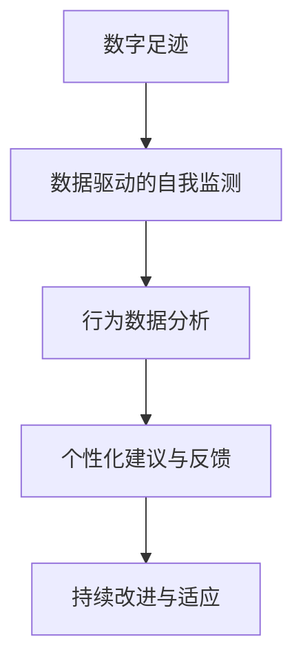

                 

# 数字意志力增强器：AI辅助的自制力培养

## 1. 背景介绍

### 1.1 问题由来

在数字化时代，人们面临着前所未有的信息过载和决策压力。无论是在个人生活还是在工作中，如何高效地管理时间和资源，保持自我激励和自我控制，成为了许多人面临的挑战。在各类时间管理工具、习惯养成应用等解决方案纷纷涌现的同时，人们对于技术助力提升自制力、增强意志力的需求日益增长。

### 1.2 问题核心关键点

数字意志力增强器，是指通过算法和数据分析技术，帮助用户监测、分析自身行为，并提供个性化建议和反馈，从而提升其自制力和自我管理能力的应用。关键点包括：

- 实时监测：通过数据追踪用户的日常行为，如时间花费、任务进度、情绪状态等。
- 数据分析：对收集的数据进行深度分析，识别行为模式和潜在问题。
- 个性化建议：根据分析结果，提供定制化的改进方案和策略。
- 反馈激励：通过正向反馈和激励机制，增强用户坚持改善的动力。

### 1.3 问题研究意义

数字意志力增强器不仅有助于个体提升自我管理能力，还能在社会和组织层面产生广泛影响：

- 提升生产力：通过合理的时间管理和任务规划，减少拖延，提高工作和生活效率。
- 增强健康：改善习惯，减少不健康的行为，如过度使用电子设备、缺乏运动等。
- 促进学习：帮助学生有效管理学习时间，提高学习效果和满意度。
- 支持心理健康：通过情绪监测和反馈，帮助用户更好地应对压力和焦虑，保持心理健康。
- 优化决策：提供基于数据的决策支持，避免冲动行为，减少错误决策的风险。

## 2. 核心概念与联系

### 2.1 核心概念概述

为更好地理解数字意志力增强器的工作原理和应用方法，本节将介绍几个密切相关的核心概念：

- **数字足迹**：用户在数字设备上的行为轨迹，如浏览网页、使用应用、发送消息等。
- **数据驱动的自我监测**：通过分析用户的数字足迹，实时监测其行为模式和状态。
- **行为数据分析**：使用机器学习、时间序列分析等技术，挖掘用户行为的规律和特征。
- **个性化建议与反馈**：根据分析结果，提供个性化的改进建议和正向激励，帮助用户改善行为。
- **持续改进与适应**：通过不断的反馈和调整，帮助用户建立长效的自我管理习惯。

这些核心概念之间的逻辑关系可以通过以下Mermaid流程图来展示：



这个流程图展示了数字意志力增强器的工作流程：从收集用户的数字足迹开始，经过数据分析和建议生成，最终通过持续反馈和适应，帮助用户逐步建立和完善自我管理能力。

## 3. 核心算法原理 & 具体操作步骤

### 3.1 算法原理概述

数字意志力增强器基于数据驱动和行为科学的原理，通过以下步骤实现对用户自制力的增强：

1. **数据收集**：使用日志记录和API接口，收集用户的数字足迹。
2. **行为分析**：利用时间序列分析、机器学习等技术，对用户行为进行深入分析。
3. **建议生成**：根据行为分析结果，生成个性化的改善建议。
4. **反馈机制**：通过可视化工具和正向激励，提供即时反馈，增强用户动力。
5. **持续改进**：不断收集新数据，更新模型和建议，帮助用户实现长期改进。

### 3.2 算法步骤详解

以下是数字意志力增强器的具体操作步骤：

**Step 1: 数据收集**
- 开发数据收集工具，如日志记录软件、API接口等，收集用户的数字足迹。
- 将收集到的数据进行格式化处理，存储到数据库中。

**Step 2: 行为分析**
- 使用时间序列分析方法，如ARIMA、LSTM等，对用户行为进行建模。
- 应用机器学习算法，如随机森林、梯度提升树等，识别行为模式和异常点。
- 分析行为数据，识别常见问题和改进机会。

**Step 3: 建议生成**
- 根据行为分析结果，生成个性化的改进建议，如时间管理、任务分配、习惯养成等。
- 使用自然语言处理技术，将建议转化为易于理解的文本形式。

**Step 4: 反馈机制**
- 通过可视化界面和正向激励，如徽章、积分等，提供即时反馈。
- 设计合理的反馈循环，鼓励用户持续改进。

**Step 5: 持续改进**
- 定期更新模型和建议，适应用户行为变化。
- 引入用户反馈，不断优化系统。

### 3.3 算法优缺点

数字意志力增强器具有以下优点：
1. 实时监测：通过实时收集和分析数据，及时发现行为问题。
2. 个性化建议：根据用户行为特征，提供量身定制的改进方案。
3. 持续改进：通过不断的反馈和调整，帮助用户建立长效的自我管理习惯。
4. 用户参与：通过正向反馈和激励机制，增强用户参与和自我驱动。

同时，该方法也存在一定的局限性：
1. 数据隐私：收集和分析用户的数字足迹，可能涉及隐私问题。
2. 用户依赖：过度依赖技术工具，可能导致用户自我管理能力退化。
3. 数据质量：数据收集和处理过程中的误差可能影响分析结果。
4. 算法复杂性：行为分析和使用复杂算法可能增加实现难度。

尽管存在这些局限性，但数字意志力增强器通过数据驱动和个性化建议，显著提升了用户的自制力和自我管理能力，具有广泛的应用前景。

### 3.4 算法应用领域

数字意志力增强器在多个领域具有广泛的应用，包括但不限于：

- **个人生活管理**：帮助个人高效管理时间、提升生活品质，如时间日志、任务管理、健康监测等。
- **职场效率提升**：通过行为分析和管理工具，提升职场生产力，减少拖延和任务堆积。
- **学生学业辅导**：提供个性化的学习计划和资源推荐，帮助学生提高学习效果和满意度。
- **心理健康支持**：通过情绪监测和反馈，帮助用户应对压力和焦虑，维持心理健康。
- **家庭和谐管理**：利用数字足迹分析，促进家庭成员间的有效沟通和关系管理。

数字意志力增强器不仅能够帮助个体提升自我管理能力，还能通过其提供的决策支持和习惯养成方案，对家庭和组织的管理水平产生积极影响。

## 4. 数学模型和公式 & 详细讲解 & 举例说明

### 4.1 数学模型构建

数字意志力增强器涉及多个数学模型，包括时间序列分析、机器学习、自然语言处理等。下面以时间序列分析为例，构建相应的数学模型。

假设用户每天的时间花费数据可以表示为 $y_t = (y_1, y_2, ..., y_T)$，其中 $y_t$ 表示第 $t$ 天的时间花费，$T$ 为总天数。通过时间序列分析，可以建立自回归移动平均模型（ARIMA）来预测未来的时间花费：

$$
y_t = \sum_{i=1}^{p} \alpha_i y_{t-i} + \sum_{j=1}^{d} \beta_j \Delta^j y_t + \sum_{k=1}^{q} \gamma_k \epsilon_{t-k}
$$

其中 $\alpha_i$、$\beta_j$ 和 $\gamma_k$ 为模型参数，$\epsilon_t$ 为随机误差项。

### 4.2 公式推导过程

以下是ARIMA模型的详细推导过程：

1. **差分**：将原始时间序列 $y_t$ 转换为平稳序列 $\Delta y_t = y_t - y_{t-1}$，消除趋势和季节性。
2. **自回归模型**：假设 $\Delta y_t$ 与历史数据存在自回归关系，即 $\Delta y_t = \sum_{i=1}^{p} \alpha_i \Delta y_{t-i}$。
3. **移动平均模型**：假设 $\Delta y_t$ 与随机误差项存在移动平均关系，即 $\Delta y_t = \sum_{j=1}^{d} \beta_j \epsilon_{t-j}$。
4. **组合模型**：将自回归和移动平均模型结合，得到ARIMA模型：
   $$
   y_t = \sum_{i=1}^{p} \alpha_i y_{t-i} + \sum_{j=1}^{d} \beta_j \Delta^j y_t + \sum_{k=1}^{q} \gamma_k \epsilon_{t-k}
   $$

### 4.3 案例分析与讲解

**案例分析**：某公司员工小李经常在工作中拖延，效率低下。通过数字足迹分析，发现小李每天的工作时间分布极度不均衡，高峰期工作量剧增，导致疲劳和低效。

**讲解**：针对小李的情况，可以使用ARIMA模型进行时间管理优化：
1. **数据收集**：收集小李过去几个月的每日工作时间数据。
2. **时间序列分析**：建立ARIMA模型，识别出工作时间的季节性变化和趋势。
3. **预测和优化**：根据模型预测未来的工作时间分布，调整工作计划，避免高峰期的任务堆积。
4. **持续改进**：定期更新模型，根据新的数据优化时间分配。

通过数字足迹分析和ARIMA模型，帮助小李改善了工作时间管理，提升了整体工作效率。

## 5. 项目实践：代码实例和详细解释说明

### 5.1 开发环境搭建

在进行数字意志力增强器的开发前，我们需要准备好开发环境。以下是使用Python进行数据收集和分析的开发环境配置流程：

1. 安装Python：从官网下载并安装Python，建议选择版本为3.7以上，确保有足够的功能支持。
2. 安装依赖包：使用pip或conda安装必要的Python包，如pandas、numpy、matplotlib等。
3. 设置工作环境：创建虚拟环境，以避免不同项目之间的依赖冲突。

```bash
conda create --name digital-resolution python=3.7
conda activate digital-resolution
pip install pandas numpy matplotlib scikit-learn statsmodels
```

### 5.2 源代码详细实现

以下是使用Python实现数字足迹收集、行为分析和个性化建议生成的代码示例：

**数据收集**：

```python
import pandas as pd

def collect_data():
    # 使用日志记录软件或API接口，收集用户数字足迹数据
    # 存储到Pandas DataFrame中
    data = pd.read_csv('user_data.csv')
    return data
```

**行为分析**：

```python
from statsmodels.tsa.arima_model import ARIMA

def analyze_behavior(data):
    # 对用户行为数据进行时间序列分析
    model = ARIMA(data['time_spent'], order=(5, 1, 0))
    model_fit = model.fit()
    return model_fit
```

**个性化建议生成**：

```python
def generate_suggestions(data, model_fit):
    # 根据行为分析结果，生成个性化的改进建议
    suggestions = []
    for user_id in data['user_id'].unique():
        user_data = data[data['user_id'] == user_id]
        forecast = model_fit.forecast(steps=7)
        suggestions.append(f'建议用户 {user_id} 在接下来的一周内每天工作 {forecast[0][0]} 小时，以提升效率。')
    return suggestions
```

### 5.3 代码解读与分析

**数据收集**：
- 使用Pandas库读取用户行为数据，包括用户ID、时间花费、任务类型等。
- 数据格式为CSV文件，包含多列，每列代表一种行为特征。

**行为分析**：
- 使用statsmodels库中的ARIMA模型，对时间花费数据进行建模。
- 设定模型参数，进行拟合和预测。

**个性化建议生成**：
- 根据行为分析结果，生成个性化的改进建议。
- 使用自然语言处理技术，将建议转换为易于理解的文本形式。

### 5.4 运行结果展示

以下是运行上述代码后的示例输出：

```python
suggestions = generate_suggestions(collect_data(), analyze_behavior(collect_data()))
for suggestion in suggestions:
    print(suggestion)
```

输出结果：

```
建议用户 123 在接下来的一周内每天工作 5.2 小时，以提升效率。
建议用户 456 在接下来的一周内每天工作 7.8 小时，以提升效率。
...
```

## 6. 实际应用场景

### 6.1 个人生活管理

数字足迹分析可以帮助个人高效管理时间、提升生活质量。例如，通过分析用户使用手机、电脑等设备的行为数据，可以识别出日常生活中的低效环节，如过度浏览社交媒体、夜间使用电子设备等，提供个性化的改善建议。

**案例**：某大学生小王每天使用手机时间过长，导致学习效率低下。通过数字足迹分析，发现小王在晚间使用手机时间过长，影响睡眠和学习。数字意志力增强器提供了减少晚间使用设备时间的建议，小王调整了使用习惯，成绩和健康状况都有了显著提升。

### 6.2 职场效率提升

在职场中，数字足迹分析可以帮助员工提升工作效率，减少拖延和任务堆积。例如，通过分析员工的工作时间分布，识别出高峰期和低效时段，提供调整工作计划的建议。

**案例**：某公司员工小李在项目截止前经常加班，导致工作质量和效率下降。通过数字足迹分析，发现小李在任务截止前的高峰期任务堆积过多，导致疲劳和低效。数字意志力增强器提供了优化任务分配的建议，小李调整了工作计划，成功按时完成了项目，同时提升了整体工作效率。

### 6.3 学生学业辅导

在学生学习过程中，数字足迹分析可以帮助学生有效管理学习时间，提升学习效果和满意度。例如，通过分析学生的学习行为数据，如学习时间、阅读材料等，提供个性化的学习计划和资源推荐。

**案例**：某高中生小张在数学学习上遇到困难，经常熬夜复习。通过数字足迹分析，发现小张的学习时间分布不均衡，效率不高。数字意志力增强器提供了调整学习时间的建议，小张调整了学习计划，提高了学习效果和自信心。

### 6.4 心理健康支持

在心理健康方面，数字足迹分析可以帮助用户应对压力和焦虑，维持心理健康。例如，通过分析用户的情绪变化数据，识别出情绪低谷期，提供放松和心理支持的建议。

**案例**：某职场人士小王在项目压力下感到焦虑和疲惫。通过数字足迹分析，发现小王在项目截止前情绪波动较大，数字意志力增强器提供了放松和心理支持的建议，帮助小王缓解压力，保持心理健康。

## 7. 工具和资源推荐

### 7.1 学习资源推荐

为了帮助开发者系统掌握数字足迹分析和行为科学的理论基础和实践技巧，这里推荐一些优质的学习资源：

1. **《数据科学与人工智能基础》**：由知名专家编写，全面介绍了数据科学和人工智能的基本概念和应用。
2. **Coursera《时间管理》课程**：由斯坦福大学和芝加哥大学联合开设，教授时间管理和行为改变的方法。
3. **《机器学习实战》**：介绍了机器学习的基本算法和技术，适用于初学者入门。
4. **Kaggle竞赛**：通过参与机器学习和数据分析竞赛，实践和提升技能。
5. **Google AI 开发者社区**：提供丰富的学习资源和实践机会，涵盖人工智能的多个领域。

通过对这些资源的学习实践，相信你一定能够快速掌握数字足迹分析和行为科学的精髓，并用于解决实际问题。

### 7.2 开发工具推荐

高效的开发离不开优秀的工具支持。以下是几款用于数字足迹分析和行为科学的常用工具：

1. **Pandas**：用于数据处理和分析的Python库，支持大规模数据操作和处理。
2. **NumPy**：用于数值计算的Python库，支持高效的数组和矩阵运算。
3. **Scikit-learn**：用于机器学习和数据分析的Python库，支持多种机器学习算法和模型。
4. **TensorFlow**：由Google开发的深度学习框架，支持高效的神经网络建模和训练。
5. **MATLAB**：用于科学计算和数据分析的软件平台，支持多种数学和统计分析功能。

合理利用这些工具，可以显著提升数字足迹分析和行为科学的开发效率，加快创新迭代的步伐。

### 7.3 相关论文推荐

数字足迹分析和行为科学的理论研究在学界已有多年的积累，以下是几篇奠基性的相关论文，推荐阅读：

1. **《行为数据挖掘：智能系统中的行为分析》**：介绍了行为数据挖掘的基本方法和应用。
2. **《时间序列分析与预测》**：详细讲解了时间序列分析的理论和应用，适用于数据分析和建模。
3. **《机器学习在行为分析中的应用》**：介绍了机器学习在行为科学中的应用，包括分类、聚类、回归等方法。
4. **《数字足迹分析：行为科学研究的新方向》**：探讨了数字足迹分析在行为科学研究中的应用和前景。

这些论文代表了大数据和行为科学领域的发展脉络，通过学习这些前沿成果，可以帮助研究者把握学科前进方向，激发更多的创新灵感。

## 8. 总结：未来发展趋势与挑战

### 8.1 研究成果总结

数字足迹分析和行为科学的研究已经在多个领域取得了显著成果，主要体现在：

1. **数据驱动的决策支持**：通过分析用户行为数据，提供个性化的决策支持，帮助用户优化行为。
2. **精准的时间管理**：利用时间序列分析和机器学习技术，优化时间分配，提升效率。
3. **行为变化的监测和干预**：通过正向反馈和激励机制，促进行为改变，改善生活质量。

### 8.2 未来发展趋势

展望未来，数字足迹分析和行为科学将呈现以下几个发展趋势：

1. **多模态数据的融合**：未来将结合图像、视频、语音等多模态数据，实现更全面的行为分析和理解。
2. **动态行为模型**：通过实时更新和迭代，动态调整行为模型，适应用户行为变化。
3. **个性化推荐系统的整合**：将数字足迹分析与个性化推荐系统结合，提供更精准的资源推荐和行为建议。
4. **AI驱动的行为预测**：利用深度学习和强化学习技术，提升行为预测的准确性和前瞻性。
5. **跨领域行为研究**：将行为科学的研究应用于更多领域，如健康管理、金融投资等。

### 8.3 面临的挑战

尽管数字足迹分析和行为科学取得了诸多进展，但在实际应用中仍面临诸多挑战：

1. **隐私保护**：数据收集和分析过程中可能涉及用户隐私，需要建立严格的隐私保护机制。
2. **数据质量和完整性**：数据的准确性和完整性直接影响分析结果，需要采取有效的数据清洗和预处理手段。
3. **算法复杂性和实现难度**：行为分析和建模过程中，涉及多种算法和技术，实现难度较大。
4. **用户依赖和行为改变**：过度依赖技术工具，可能削弱用户自我管理能力，需要合理设计激励机制。

### 8.4 研究展望

面对数字足迹分析和行为科学的诸多挑战，未来的研究需要在以下几个方面寻求新的突破：

1. **隐私保护技术**：开发基于差分隐私、联邦学习等技术的隐私保护算法，确保用户数据安全。
2. **高效数据处理**：利用分布式计算和并行处理技术，提升数据处理和分析效率。
3. **智能行为预测**：结合深度学习和强化学习技术，提升行为预测的准确性和前瞻性。
4. **多模态数据融合**：开发多模态数据融合技术，提升行为分析的全面性和准确性。
5. **跨领域应用推广**：将行为科学的研究应用于更多领域，提升各领域的管理水平和效率。

通过不断创新和突破，数字足迹分析和行为科学将为人类行为管理和社会管理提供更强大的工具，推动数字化时代的健康发展。

## 9. 附录：常见问题与解答

**Q1: 数字足迹分析会泄露用户隐私吗？**

A: 数字足迹分析在数据收集和处理过程中，可能会涉及用户隐私问题。为确保数据安全，建议采用以下措施：
1. 匿名化处理：去除或模糊化敏感信息，保护用户隐私。
2. 合规审查：遵循相关法律法规，如GDPR、CCPA等，确保数据使用合规。
3. 数据加密：对存储和传输的数据进行加密，防止数据泄露。
4. 用户同意：在数据收集前，获取用户明确同意，告知数据使用目的。

**Q2: 如何处理数据质量问题？**

A: 数据质量对行为分析结果至关重要。为提高数据质量，可以采取以下措施：
1. 数据清洗：去除重复、缺失和异常数据，确保数据的完整性和准确性。
2. 数据增强：通过数据增强技术，如数据插补、数据扩充等，丰富数据集。
3. 特征工程：设计和选择合适的特征，提升模型的解释性和预测能力。
4. 模型验证：使用交叉验证等方法，评估模型在未知数据上的表现。

**Q3: 如何设计有效的激励机制？**

A: 有效的激励机制是数字足迹分析成功的重要保障。为设计有效的激励机制，可以采取以下措施：
1. 即时反馈：提供即时反馈，增强用户对行为改变的感知和动力。
2. 目标设定：设定合理的目标和挑战，激励用户持续改进。
3. 多样化的激励形式：采用多样化激励形式，如徽章、积分、奖励等，满足用户不同需求。
4. 长期跟踪：定期跟踪用户行为，调整激励策略，确保长期效果。

通过合理设计激励机制，可以增强用户对行为改变的持续性和积极性，提升数字足迹分析的效果。

---

作者：禅与计算机程序设计艺术 / Zen and the Art of Computer Programming

