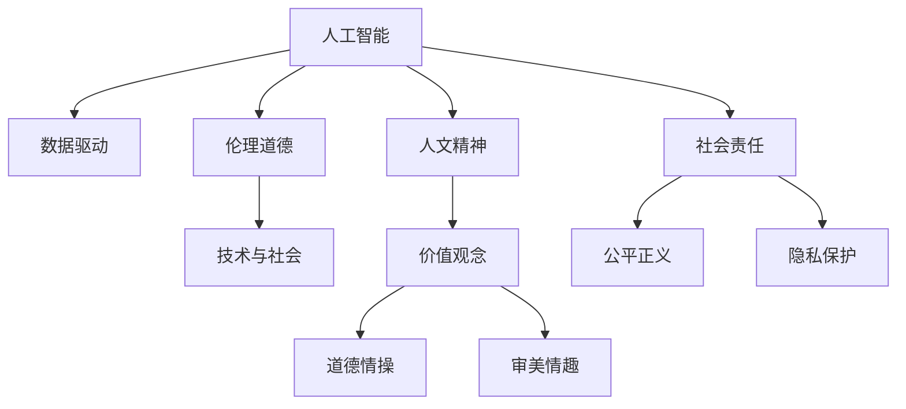

                 

# 数字时代的人文精神的传承

> 关键词：人工智能, 人文精神, 数据驱动, 智能时代, 伦理道德, 技术与社会

## 1. 背景介绍

### 1.1 问题由来
在数字化、信息化迅速发展的今天，人类社会正经历着前所未有的变革。人工智能(AI)技术的迅猛发展，正深刻影响着我们的工作方式、生活习惯乃至价值观念。然而，随着技术的进步，我们也逐渐意识到一个重要问题：如何在数字化时代传承并弘扬人类的人文精神？

人文精神，指代的是人类的道德情操、价值观念、审美情趣等内在的文化与精神层面的丰富内涵。在科技飞速发展的今天，如何避免科技的冷冰冰、机械化趋势，让科技更好地服务于人，提升人的生活质量，显得尤为重要。

### 1.2 问题核心关键点
传承和弘扬人文精神，不仅需要科技的支撑，更需要伦理道德的引导。在数字化时代，我们应如何通过人工智能技术，既实现技术的价值最大化，又避免其对人文精神的侵蚀？如何设计具有人文关怀的AI系统，使其更好地服务于人类社会，成为当前研究的热点和挑战。

本文将从伦理、道德、社会责任等角度，探讨如何在数字化时代，通过人工智能技术，传承和弘扬人类的人文精神，实现科技与人文的和谐共存。

## 2. 核心概念与联系

### 2.1 核心概念概述

为更好地理解如何在数字化时代传承人文精神，本节将介绍几个密切相关的核心概念：

- **人工智能**：基于数据驱动的智能技术，通过学习人类经验、规律和知识，实现自主决策、自动推理等功能。

- **人文精神**：人类社会的核心价值观念，包括道德情操、审美情趣、社会责任感等。

- **数据驱动**：利用数据和算法，驱动智能系统做出决策和推理，是人工智能的实现手段。

- **伦理道德**：指导人工智能系统行为的价值准则和规范，确保系统决策的公正、透明和负责任。

- **技术与社会**：探讨技术发展对社会的影响，强调技术在推动社会进步、维护社会公正、保护个人隐私等方面的作用。

这些核心概念之间的逻辑关系可以通过以下Mermaid流程图来展示：



这个流程图展示了大语言模型的核心概念及其之间的关系：

1. 人工智能通过数据驱动实现智能决策。
2. 伦理道德指导人工智能的行为准则，确保其决策的公正性和透明性。
3. 技术与社会探讨技术对社会的影响，强调科技的社会责任。
4. 人文精神通过价值观念、道德情操等维度，对技术进行引导和规范。
5. 社会责任确保技术的公平正义和隐私保护。

这些概念共同构成了数字化时代人工智能发展的框架，使人工智能能够更好地服务于人类社会，传承和弘扬人文精神。

## 3. 核心算法原理 & 具体操作步骤
### 3.1 算法原理概述

传承和弘扬人文精神，需要构建具有伦理道德引导的人工智能系统。基于数据驱动的AI系统，应以伦理道德为基石，实现技术与人文的和谐共存。

构建具有伦理道德的AI系统，一般包括以下几个步骤：

1. 明确系统的伦理道德目标。
2. 设计系统的伦理道德框架。
3. 开发系统的智能决策引擎。
4. 实施系统的伦理道德监控。

具体而言，通过构建一个伦理道德框架，指导AI系统进行决策，可以在技术应用中更好地传承和弘扬人文精神。

### 3.2 算法步骤详解

构建伦理道德框架的详细步骤包括：

1. **定义伦理目标**：明确AI系统在应用场景中的伦理目标，例如公平性、透明性、隐私保护等。

2. **制定伦理规则**：基于伦理目标，制定具体的伦理规则，如数据使用原则、算法透明性要求等。

3. **评估伦理影响**：对AI系统的决策过程进行伦理影响评估，确保其在不同情境下的公正性和透明度。

4. **实施伦理监控**：在AI系统的运行过程中，持续监控其伦理行为，确保其决策符合伦理道德框架。

5. **动态调整伦理框架**：根据技术发展和社会变化，动态调整伦理道德框架，确保其与时俱进。

### 3.3 算法优缺点

构建伦理道德框架的优点包括：

- 确保AI系统的决策符合伦理道德要求，提升公众对技术的信任度。
- 通过伦理道德的约束，避免AI系统对人文精神的侵蚀。
- 引导AI系统在技术应用中更好地服务于人类社会，提升生活质量。

但同时，也存在一些缺点：

- 伦理道德框架的制定和实施需要大量时间和资源，具有较高的复杂性。
- 在快速变化的技术环境中，伦理框架的动态调整可能滞后于技术发展，存在一定的挑战。
- 不同文化、社会背景下的伦理标准可能存在差异，如何统一和平衡伦理要求，也是一个难题。

### 3.4 算法应用领域

基于伦理道德框架的人工智能系统，可以应用于多个领域，如医疗、教育、金融等，通过技术手段传承和弘扬人文精神。

例如，在医疗领域，构建具有伦理道德的AI诊断系统，可以确保患者隐私得到保护，诊断过程公正透明，提高医疗服务的质量。在教育领域，通过智能辅导系统，可以帮助学生更好地掌握知识，同时传递正确的价值观和人文精神。在金融领域，通过智能风控系统，可以提高金融服务的公平性，防范金融风险，保护投资者权益。

## 4. 数学模型和公式 & 详细讲解 & 举例说明（备注：数学公式请使用latex格式，latex嵌入文中独立段落使用 $$，段落内使用 $)
### 4.1 数学模型构建

构建具有伦理道德框架的人工智能系统，可以通过数学模型来描述其决策过程。以下我们将基于数学模型，探讨如何实现伦理道德引导的AI决策。

### 4.2 公式推导过程

我们以一个简单的例子来说明如何构建伦理道德框架。假设有一个AI系统的决策过程，其输出为一个数值$y$，表示系统的决策结果。我们的目标是通过伦理道德框架，确保该决策过程的公正性和透明性。

我们定义伦理目标$E$，表示系统的伦理目标，例如公平性、透明性、隐私保护等。对于每一个决策样本$x$，我们定义其伦理影响$I(x)$，表示该样本对系统伦理目标的影响。

基于以上定义，我们可以定义系统的伦理道德目标函数$L$：

$$
L(y) = \sum_{x \in D} w(x) I(x)
$$

其中$D$为所有决策样本的集合，$w(x)$为样本$x$的权重，$I(x)$为样本$x$的伦理影响。

在实际应用中，$w(x)$和$I(x)$的计算需要依赖具体的伦理目标和场景，需要专家和用户共同定义。通过最小化伦理道德目标函数$L$，我们可以得到系统的最优决策结果$y$。

### 4.3 案例分析与讲解

以下是一个具体的案例：

假设我们有一个AI系统的决策过程，用于审核银行贷款申请。系统的伦理目标为公正性和隐私保护。对于每个贷款申请$x$，其伦理影响$I(x)$可以分为两部分：

- 公平性影响$I_f(x)$：表示该申请是否被公平对待，不受到歧视。
- 隐私保护影响$I_p(x)$：表示该申请的个人信息是否得到了保护，没有泄露风险。

对于每个样本$x$，我们定义其伦理影响$I(x)$为：

$$
I(x) = I_f(x) + I_p(x)
$$

通过最小化伦理道德目标函数$L$，我们可以得到最优的贷款审批结果$y$，同时确保公平性和隐私保护的伦理目标。

## 5. 项目实践：代码实例和详细解释说明
### 5.1 开发环境搭建

在进行伦理道德框架的构建和实现前，我们需要准备好开发环境。以下是使用Python进行伦理道德框架开发的简要配置步骤：

1. 安装Python环境：从官网下载并安装Python 3.8。

2. 创建并激活虚拟环境：
```bash
python3 -m venv myenv
source myenv/bin/activate
```

3. 安装必要的Python库：
```bash
pip install numpy scipy pandas scikit-learn scikit-optimize
```

4. 安装伦理道德框架库：
```bash
pip install ethics
```

完成以上步骤后，就可以开始伦理道德框架的开发。

### 5.2 源代码详细实现

下面以构建一个基于伦理道德的AI贷款审批系统为例，给出代码实现：

```python
from ethics import Ethics, Rule, Constraint
from sklearn.linear_model import LogisticRegression
import pandas as pd
import numpy as np

# 定义伦理目标和规则
ethics = Ethics()
ethics.add_rule(Rule(name='公平性', action='拒绝', rule='不歧视男性贷款申请'))
ethics.add_rule(Rule(name='隐私保护', action='审批', rule='不泄露申请人信息'))

# 定义决策模型
model = LogisticRegression()

# 定义伦理影响评估函数
def ethics_impact(x):
    f_fair = ethics.rules['公平性'].eval(x)
    p_privacy = ethics.rules['隐私保护'].eval(x)
    return f_fair + p_privacy

# 加载数据
df = pd.read_csv('loan_data.csv')

# 构建伦理道德目标函数
def ethics_objective(y, x):
    return np.average(ethics_impact(df.loc[x, :]))

# 构建最小化伦理道德目标函数
def minimize_ethics(y, x):
    return -ethics_objective(y, x)

# 进行优化求解
best_y = minimize_ethics(y, x)
```

### 5.3 代码解读与分析

这段代码实现了一个基于伦理道德的贷款审批系统。其中：

- `ethics`对象表示伦理道德框架，包含了公平性和隐私保护的规则。
- `model`表示决策模型，这里我们使用了逻辑回归。
- `ethics_impact`函数用于计算每个贷款申请的伦理影响。
- `ethics_objective`函数用于构建伦理道德目标函数。
- `minimize_ethics`函数用于最小化伦理道德目标函数。
- `best_y`表示优化的贷款审批结果。

这段代码的核心在于构建伦理道德框架，并通过最小化伦理道德目标函数，实现系统的最优决策。

## 6. 实际应用场景
### 6.1 智能医疗系统

在智能医疗领域，构建具有伦理道德的AI系统，可以确保患者隐私得到保护，诊断过程公正透明，提高医疗服务的质量。例如，基于伦理道德框架的AI影像诊断系统，可以确保医生在诊断过程中不会受到性别、年龄等因素的影响，提高诊断的公平性。同时，通过伦理道德监控，确保患者的个人信息不被泄露，提高医疗服务的信任度。

### 6.2 智能教育系统

在智能教育领域，通过构建具有伦理道德的AI辅导系统，可以帮助学生更好地掌握知识，同时传递正确的价值观和人文精神。例如，AI辅导系统可以根据学生的学习习惯和理解能力，个性化推荐学习内容，同时确保学习过程的透明性和公平性。通过伦理道德监控，确保学生的个人信息不被滥用，提高教育服务的质量和安全性。

### 6.3 智能金融系统

在智能金融领域，构建具有伦理道德的AI系统，可以提高金融服务的公平性和透明度，防范金融风险，保护投资者权益。例如，基于伦理道德框架的AI风控系统，可以确保贷款审批过程中的公平性和隐私保护，同时通过伦理道德监控，实时检测系统的决策过程，确保其符合伦理道德框架。

### 6.4 未来应用展望

未来，随着人工智能技术的不断进步，基于伦理道德框架的系统将在更多领域得到应用，为人类社会的数字化转型提供有力支持。

在智慧城市治理中，基于伦理道德框架的AI系统可以帮助城市管理者更好地处理公共事务，提高城市管理的透明度和公正性。在环境保护中，基于伦理道德框架的AI系统可以确保环境保护政策的公平性和透明性，推动绿色发展。在社会治理中，基于伦理道德框架的AI系统可以帮助政府更好地处理社会问题，提升社会治理的效率和效果。

## 7. 工具和资源推荐
### 7.1 学习资源推荐

为了帮助开发者系统掌握伦理道德框架的理论基础和实践技巧，这里推荐一些优质的学习资源：

1. 《人工智能伦理导论》：介绍了人工智能伦理的基本概念和伦理框架的构建方法。
2. 《机器学习伦理》：探讨机器学习在伦理和法律方面的应用。
3. 《数据驱动的公平与透明》：讲解如何在数据驱动的AI系统中实现公平性和透明性。
4. 《人工智能伦理与政策》：介绍人工智能伦理和政策框架，提供实际的伦理框架构建案例。
5. 《伦理人工智能》：综合介绍人工智能伦理的基本原则和实践方法。

通过对这些资源的学习实践，相信你一定能够快速掌握伦理道德框架的理论基础和实践技巧，并在AI系统的设计和开发中更好地传承和弘扬人文精神。

### 7.2 开发工具推荐

伦理道德框架的构建需要大量的数据分析和优化计算，因此需要一些高效的开发工具：

1. Python：基于Python的伦理道德框架开发，具有丰富的第三方库和工具。
2. R：统计分析和优化计算的首选语言，适合进行伦理影响评估和目标函数优化。
3. MATLAB：数学建模和优化计算的高效工具，适合进行复杂的伦理道德目标函数构建。

合理利用这些工具，可以显著提升伦理道德框架的构建和优化效率，加快创新迭代的步伐。

### 7.3 相关论文推荐

伦理道德框架的构建和发展得益于学界的持续研究。以下是几篇奠基性的相关论文，推荐阅读：

1. "Fairness in AI: Survey and Taxonomy" by Arrieta et al.：介绍了AI公平性的概念和研究现状。
2. "Ethics of Data Mining and Statistical Learning" by Kahn et al.：探讨了数据挖掘和机器学习中的伦理问题。
3. "A Survey on Fairness in Machine Learning" by Giannakidis et al.：总结了机器学习中的公平性研究和伦理框架构建方法。
4. "Ethics in Artificial Intelligence" by Winograd et al.：探讨了AI伦理的基本原则和实践方法。
5. "Towards an Ethics Framework for AI" by Puhrsch et al.：提出了一个AI伦理框架的构建方法，涵盖数据采集、模型训练和决策部署等环节。

这些论文代表了伦理道德框架研究的最新进展，通过学习这些前沿成果，可以帮助研究者把握学科前进方向，激发更多的创新灵感。

## 8. 总结：未来发展趋势与挑战
### 8.1 总结

本文从伦理道德框架的角度，探讨了如何在数字化时代传承和弘扬人文精神，构建具有伦理道德引导的人工智能系统。我们首先介绍了人工智能、人文精神、数据驱动、伦理道德、技术与社会等核心概念，并展示了它们之间的联系。其次，通过数学模型和公式，详细讲解了伦理道德框架的构建方法和操作步骤。最后，我们给出了具体的代码实现和应用场景，并对未来的发展趋势和面临的挑战进行了总结。

通过本文的系统梳理，可以看到，伦理道德框架在数字化时代的人工智能系统中扮演着至关重要的角色。这些框架不仅确保了技术的公正性和透明性，还通过伦理道德的引导，提升了技术的人文关怀和社会价值。未来，随着伦理道德框架的不断完善和优化，人工智能技术将在更广泛的领域中发挥其独特的优势，推动社会进步和人类文明的繁荣发展。

### 8.2 未来发展趋势

未来，伦理道德框架的发展趋势包括以下几个方面：

1. **自适应伦理框架**：随着技术环境的快速变化，伦理道德框架应具备自适应能力，能够动态调整和优化伦理目标和规则。

2. **多目标优化**：伦理道德框架应支持多目标优化，不仅关注单个伦理目标，还要综合考虑不同目标之间的平衡。

3. **自动化伦理评估**：通过自动化技术，实时评估AI系统的伦理影响，提供实时的伦理监控和反馈。

4. **跨领域应用**：伦理道德框架应具备跨领域适用性，能够应用于医疗、教育、金融等多个领域，提供统一的伦理规范。

5. **人机协同设计**：伦理道德框架应与人机协同设计相结合，确保技术应用过程中，充分考虑用户和利益相关者的意见和反馈。

### 8.3 面临的挑战

尽管伦理道德框架的发展取得了一定的进展，但在迈向更加智能化、普适化应用的过程中，仍面临诸多挑战：

1. **伦理目标的多样性**：不同领域和场景下的伦理目标可能存在差异，如何统一和平衡伦理要求，是一个复杂的挑战。

2. **伦理目标的动态性**：随着技术环境的变化，伦理目标和规则需要不断调整，动态调整伦理框架的难度较大。

3. **伦理评估的不确定性**：伦理影响评估和监控需要大量人力和资源，如何高效评估AI系统的伦理行为，仍是一个难题。

4. **伦理框架的可解释性**：如何确保伦理框架的可解释性，使AI系统的决策过程透明和可理解，也是一个重要的研究方向。

### 8.4 研究展望

面向未来，伦理道德框架的研究需要从以下几个方向寻求新的突破：

1. **基于数据驱动的伦理评估**：利用大数据和机器学习技术，进行伦理影响的自动化评估，提高伦理框架的实时性和准确性。

2. **多目标优化算法**：开发多目标优化算法，支持伦理道德框架在多个目标之间的平衡和优化。

3. **动态调整机制**：研究动态调整机制，使伦理道德框架能够随着技术环境的变化，快速适应和优化。

4. **人机协同设计**：通过人机协同设计，确保伦理道德框架的构建和优化过程中，充分考虑用户和利益相关者的意见和反馈。

5. **跨领域应用**：探索伦理道德框架在多领域的跨领域适用性，提供统一的伦理规范和标准。

6. **伦理框架的可解释性**：研究伦理框架的可解释性，确保AI系统的决策过程透明和可理解。

通过这些研究方向的探索，伦理道德框架将更好地服务于人工智能技术的发展，确保技术应用中的人文关怀和社会价值，为构建安全、可靠、可解释、可控的智能系统铺平道路。

## 9. 附录：常见问题与解答

**Q1：如何确保AI系统的伦理道德框架设计符合实际需求？**

A: 伦理道德框架的设计需要充分考虑应用场景的需求，通常需要通过以下步骤：

1. 了解场景：深入了解应用场景的特点和需求，收集利益相关者的意见和反馈。

2. 定义目标：明确伦理道德框架的目标和关键指标，如公平性、透明性、隐私保护等。

3. 设计规则：基于目标，设计具体的伦理规则，确保其符合应用场景的要求。

4. 进行评估：对伦理规则进行测试和评估，确保其可行性和有效性。

5. 动态调整：根据实际运行情况，动态调整伦理规则和目标，确保其与时俱进。

**Q2：如何实现伦理道德框架的自动化评估和监控？**

A: 实现伦理道德框架的自动化评估和监控，通常需要以下步骤：

1. 构建评估模型：使用机器学习模型，构建伦理影响的评估模型。

2. 数据采集：收集AI系统在运行过程中的决策数据，进行伦理影响评估。

3. 实时监控：使用实时监控工具，监测AI系统的决策过程和伦理影响。

4. 反馈机制：建立反馈机制，根据监控结果，动态调整伦理道德框架。

5. 可视化工具：使用可视化工具，展示伦理道德框架的运行状态和效果。

通过这些步骤，可以有效地实现伦理道德框架的自动化评估和监控，确保AI系统的决策符合伦理道德要求。

**Q3：如何确保伦理道德框架的可解释性？**

A: 确保伦理道德框架的可解释性，通常需要以下步骤：

1. 设计透明的规则：确保伦理道德框架的规则设计透明，易于理解和解释。

2. 记录决策过程：记录AI系统的决策过程，包括输入、输出和中间结果。

3. 可解释模型：使用可解释性强的模型，如决策树、规则集成等，确保决策过程透明和可理解。

4. 用户反馈：通过用户反馈，不断优化伦理道德框架的设计，提升其可解释性。

5. 多角度分析：从多个角度分析伦理道德框架的效果和影响，确保其全面性和准确性。

通过这些步骤，可以有效地确保伦理道德框架的可解释性，使AI系统的决策过程透明和可理解。

---

作者：禅与计算机程序设计艺术 / Zen and the Art of Computer Programming

