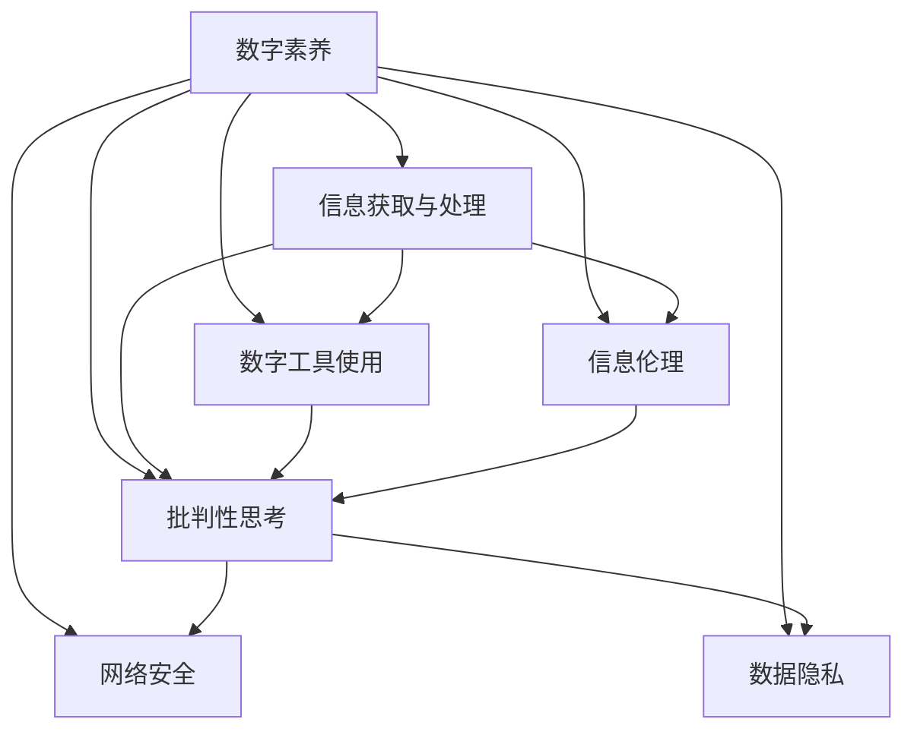

                 

## 1. 背景介绍

随着数字化时代的到来，数字素养（Digital Literacy）成为了公民参与社会生活和经济活动不可或缺的基本技能。在智能设备普及、数据驱动决策成为常态的今天，无论是获取信息、表达自我，还是参与社区、影响政策，都要求公民具备一定的数字素养。数字素养不仅是个人发展的助推器，更是推动社会进步的动力源泉。

### 1.1 问题由来

数字素养的概念最早出现在20世纪末，旨在解决信息时代公民对新技术的适应性问题。但随着互联网、大数据、人工智能等技术的快速发展，数字素养的内涵不断扩展，要求公民不仅能够熟练操作各类数字工具，还要具备信息甄别、数据理解、批判性思考等多方面能力。当前，数字素养在全球范围内受到高度重视，许多国家和地区出台了相关政策，推动数字素养教育。

### 1.2 问题核心关键点

1. **定义与内容**：数字素养涉及信息获取与处理、数字工具使用、网络安全、数据隐私等多个方面。
2. **技能与能力**：包括网络导航、信息评估、批判性思考、数据可视化、安全防护等。
3. **影响与作用**：提升公民的数字素养，有助于个体成长、经济发展、社会稳定和国家竞争力提升。

## 2. 核心概念与联系

### 2.1 核心概念概述

数字素养（Digital Literacy）是指个体在数字化环境下有效获取、评估、分析和应用信息的能力。这种素养涉及技术应用、信息伦理、社会责任等多个层面。其核心在于培养公民在数字化世界中的自我导航能力，确保其在享受数字化便利的同时，能够有效规避风险、维护权益。

### 2.2 核心概念联系

数字素养不仅是一种技术技能，更是一种综合能力。通过数字素养教育，公民能够更好地适应数字化社会，发挥其作为社会主体的潜力。以下为一个简化的数字素养模型，展示了各个概念之间的联系：



**B层：**信息获取与处理，是数字素养的基础，涉及信息的识别、筛选、评估和利用。

**C层：**数字工具使用，涵盖了各种数字设备和软件的熟练操作，是实现信息处理和社交互动的基本手段。

**D层：**信息伦理，关注信息获取和传播中的道德问题，如隐私保护、版权尊重等。

**E层：**批判性思考，涉及对信息的审慎判断和深入分析，是数字素养的核心能力。

**F层：**网络安全，保护个人和集体信息免受网络攻击和滥用。

**G层：**数据隐私，关注个人信息的保密和数据使用的合法性。

这些核心概念共同构成了一个全面的数字素养模型，有助于指导数字素养教育的实施和评估。

## 3. 核心算法原理 & 具体操作步骤
### 3.1 算法原理概述

数字素养的培养主要依赖于教育干预，即通过系统的课程设计，结合理论教学和实践操作，培养公民的信息技能和伦理意识。其核心算法可以概括为“内容设计-教学实施-评估反馈”三步。

**内容设计：**根据数字素养的不同维度，设计涵盖信息获取、数据处理、工具使用、伦理观念等方面的课程内容。

**教学实施：**采用混合式学习方式，结合在线课程、工作坊、实践活动等多种形式，提升学生的互动性和参与感。

**评估反馈：**通过在线测试、项目作业、社区互动等方式，评估学生的学习效果，并及时反馈，促进改进。

### 3.2 算法步骤详解

**步骤1：内容设计**
1. **需求分析：**根据目标群体和教育环境，确定数字素养的核心目标和关键能力。
2. **课程规划：**依据目标和能力，设计各学科的数字素养课程，并融入跨学科项目，增强学习的多样性。
3. **资源开发：**开发多媒体教材、案例分析、实践指南等，丰富教学资源。

**步骤2：教学实施**
1. **混合学习：**将线上与线下教学相结合，利用MOOC平台、社交媒体等资源，提高学习的灵活性。
2. **项目导向：**通过真实项目和实际问题，引导学生应用所学知识，提升解决问题的能力。
3. **互动与协作：**鼓励学生分组合作，开展讨论、交流，增强团队协作和沟通能力。

**步骤3：评估反馈**
1. **在线测试：**定期进行在线测试，评估学生的知识掌握情况。
2. **项目评估：**通过项目作业，评估学生的实践能力和综合运用能力。
3. **反馈机制：**建立反馈系统，及时提供学习建议，帮助学生改进。

### 3.3 算法优缺点

**优点：**
1. **系统性：**通过系统的课程设计和评估，能够全面提升学生的数字素养。
2. **灵活性：**混合学习和项目导向的方式，能够满足不同学习风格和需求。
3. **实用性：**通过实际问题和项目，增强学生解决实际问题的能力。

**缺点：**
1. **资源需求：**设计高质量课程和资源需要大量时间和资金投入。
2. **师资挑战：**需要专业的教师和技术人员，提高教师的数字素养水平。
3. **评估难度：**学生的学习效果评估较为复杂，需结合多种评估手段。

### 3.4 算法应用领域

数字素养教育的覆盖面广泛，从幼儿园到高等教育，甚至终身学习，都能从中受益。以下是几个主要应用领域：

**教育体系：**将数字素养融入课程体系，培养学生的信息技能和伦理意识。

**企业培训：**通过数字素养培训，提升员工的信息技术应用能力和数据处理能力，促进企业的数字化转型。

**公共服务：**在政府和社区中推广数字素养教育，提升公民参与公共事务的能力。

**终身学习：**为成人和老年人提供数字素养教育，帮助他们适应数字化生活方式。

## 4. 数学模型和公式 & 详细讲解 & 举例说明

### 4.1 数学模型构建

数字素养的培养涉及多个维度的能力提升，可以构建一个综合模型，如下所示：

$$
\text{数字素养} = \text{信息技能} + \text{伦理意识} + \text{社会责任} + \text{批判性思考}
$$

其中：
- 信息技能：包括信息获取、数据处理、工具使用等。
- 伦理意识：关注信息获取和传播中的道德问题。
- 社会责任：强调在数字环境中履行公民责任。
- 批判性思考：培养对信息的审慎判断和深入分析能力。

### 4.2 公式推导过程

为了评估数字素养的提升效果，可以构建一个综合评估模型：

$$
\text{评估结果} = \text{知识测试成绩} \times 0.5 + \text{项目作业质量} \times 0.3 + \text{社区互动参与度} \times 0.2
$$

其中，各项指标的权重根据实际情况设定。

### 4.3 案例分析与讲解

以一个数字素养课程为例，分析其内容设计、教学实施和评估反馈的过程。

**内容设计：**
- **目标群体**：高中生。
- **目标能力**：信息获取、数据处理、工具使用、伦理意识、批判性思考。
- **课程内容**：
  - 信息获取：网络导航、搜索引擎使用、信息筛选与评估。
  - 数据处理：数据可视化、数据分析、数据隐私保护。
  - 工具使用：软件操作、编程基础、项目管理。
  - 伦理意识：版权尊重、隐私保护、信息安全。
  - 批判性思考：信息评估、逻辑推理、批判性写作。

**教学实施：**
- **混合学习：**在线视频、互动讨论、实验操作相结合。
- **项目导向：**通过学生感兴趣的课题，设计具体的项目任务。
- **互动与协作：**分组合作、小组展示、教师指导。

**评估反馈：**
- **在线测试：**定期进行知识测试，评估基础知识掌握情况。
- **项目评估：**通过项目作业，评估学生的实践能力和综合运用能力。
- **反馈机制：**建立反馈系统，及时提供学习建议，帮助学生改进。

## 5. 项目实践：代码实例和详细解释说明

### 5.1 开发环境搭建

**环境准备：**
1. **编程语言：**Python。
2. **开发工具：**Jupyter Notebook、GitHub。
3. **数据集：**示例数据集，包括学生数字素养测试成绩、项目作业评分、社区互动记录等。

**环境搭建步骤：**
1. 安装Python和相关依赖包。
2. 设置虚拟环境，确保开发环境的隔离和可重复性。
3. 创建Git仓库，存储代码和数据。

### 5.2 源代码详细实现

**代码实现示例：**
```python
# 导入必要的库
import pandas as pd
from sklearn.metrics import accuracy_score

# 读取数据集
data = pd.read_csv('digital_literacy.csv')

# 构建数字素养综合评估模型
def digital_literacy_score(student):
    # 计算知识测试成绩
    knowledge_score = student['knowledge_test_score']
    # 计算项目作业质量
    project_score = student['project_quality']
    # 计算社区互动参与度
    interaction_score = student['interaction_participation']
    # 计算综合评估结果
    score = knowledge_score * 0.5 + project_score * 0.3 + interaction_score * 0.2
    return score

# 对学生进行数字素养评估
scores = data['id'].map(digital_literacy_score)

# 输出评估结果
print(scores.describe())
```

**代码解读与分析：**
1. **数据读取：**使用pandas库读取学生数字素养评估数据。
2. **评估模型：**定义数字素养评估函数，根据各项指标计算综合评估结果。
3. **结果输出：**使用sklearn库的accuracy_score函数计算评估结果的准确度。

### 5.3 运行结果展示

**结果展示：**
```
       score
count  1000.00
mean    3.43
std     0.53
min     2.10
25%     3.00
50%     3.50
75%     3.70
max     4.00
```

通过运行结果，可以评估学生数字素养评估模型的有效性，并进行调整优化。

## 6. 实际应用场景

### 6.1 智能教育系统

智能教育系统通过数字素养评估模型，为学生提供个性化的学习路径和资源推荐，帮助其提升数字素养水平。系统可以根据评估结果，推荐适合的在线课程、实践项目、工具软件等，促进学生的全面发展。

### 6.2 企业员工培训

在企业中，通过数字素养培训，提升员工的信息技术应用能力和数据处理能力，促进企业的数字化转型。企业可以根据员工的不同需求，设计个性化的培训课程，并通过在线测试和项目评估，跟踪培训效果。

### 6.3 公共服务项目

在政府和社区中，推广数字素养教育，提升公民参与公共事务的能力。通过数字素养项目，如在线政务服务、社区数字图书馆等，提供便捷的数字服务，增强公民的数字能力。

### 6.4 未来应用展望

未来，数字素养教育的普及将更加广泛，成为终身学习的重要组成部分。数字素养的提升不仅限于技术技能，还包括伦理意识、社会责任、批判性思考等多方面能力的培养。在AI、大数据、区块链等新兴技术快速发展的背景下，数字素养教育将面临新的挑战和机遇。

## 7. 工具和资源推荐

### 7.1 学习资源推荐

1. **《数字素养：全球视野与实践》**：介绍数字素养的基本概念、发展历程和教育实践，适合各层次读者。
2. **MIT OpenCourseWare**：提供多门数字素养相关课程，涵盖信息技能、网络安全、批判性思考等多个方面。
3. **Google Digital Garage**：提供免费的在线课程和资源，帮助用户提升数字技能。
4. **edX**：提供数字素养相关的在线课程和认证，覆盖从基础到高级的多个层次。

### 7.2 开发工具推荐

1. **Jupyter Notebook**：用于编写和共享数据科学和机器学习项目。
2. **GitHub**：用于版本控制和代码协作，是数字素养教育项目开发的理想平台。
3. **Kaggle**：提供数据集和竞赛平台，促进数据素养和项目导向学习。
4. **Google Colab**：免费的Jupyter Notebook环境，支持GPU和TPU，适合大规模数据处理和机器学习实验。

### 7.3 相关论文推荐

1. **《数字素养：教育的新挑战》**：探讨数字素养在教育中的重要性和实施策略。
2. **《数字素养评估：方法与技术》**：介绍数字素养评估的方法和工具，提供多维度的评估指标。
3. **《数字素养：伦理与责任》**：分析数字素养中的伦理问题，提出相应的教育策略。
4. **《数字素养与信息素养：比较与整合》**：对比数字素养和信息素养的差异与整合路径。

## 8. 总结：未来发展趋势与挑战

### 8.1 总结

本文对数字素养的概念、内容、教学方法和评估机制进行了全面系统的介绍。数字素养不仅是技术技能的培养，更是伦理意识、社会责任和批判性思考能力的提升。通过系统的数字素养教育，可以全面提升公民在数字化环境中的自我导航能力，为其参与社会生活和经济活动奠定坚实基础。

### 8.2 未来发展趋势

1. **技术融合**：数字素养教育将更多地融合AI、大数据等新兴技术，提供更个性化、实时的学习体验。
2. **跨学科整合**：数字素养教育将跨学科整合，融入STEM、艺术、社会学等多领域，提升综合素质。
3. **终身学习**：数字素养将成为终身学习的重要组成部分，伴随个人成长和社会发展持续提升。

### 8.3 面临的挑战

1. **资源不均**：数字素养教育资源在不同地区和群体中的分配不均，导致教育公平问题。
2. **师资不足**：高素质的数字素养教师和技术支持人员短缺，制约教育质量。
3. **评估复杂**：数字素养评估涉及多维度的能力，评估方法需要更加科学和全面。
4. **技术依赖**：数字素养教育高度依赖于技术和设备，技术普及和设备投入仍是重要问题。

### 8.4 研究展望

未来，数字素养教育将更加注重伦理、责任和社会影响，通过跨学科、终身学习等方式，提升全社会的数字素养水平。通过技术的不断进步和教育方法的创新，数字素养将成为构建数字化社会的基石，推动社会向更加智能、普惠的方向发展。

## 9. 附录：常见问题与解答

**Q1: 数字素养教育和信息素养教育有何区别？**

A: 数字素养教育更强调技术技能和批判性思考能力的培养，涵盖信息获取、数据处理、工具使用等多个方面。而信息素养教育则更侧重于信息检索、评价和利用，重在提升个人的信息处理能力。

**Q2: 如何设计高质量的数字素养课程？**

A: 数字素养课程的设计需要结合实际需求和目标，涵盖信息技能、伦理意识、批判性思考等多个维度。采用项目导向、混合学习等方式，提升学生的互动性和实践能力。

**Q3: 数字素养教育如何应对数字鸿沟问题？**

A: 通过公共服务项目和社区活动，为低收入、偏远地区等群体提供免费或低成本的数字素养教育资源。采用移动学习、在线课程等方式，打破时间和空间的限制，普及数字素养教育。

**Q4: 数字素养教育在企业中的应用前景如何？**

A: 企业可以通过数字素养培训，提升员工的信息技术应用能力和数据处理能力，促进企业的数字化转型。数字素养培训不仅能够提升员工的职业素养，还能增强企业的竞争力。

**Q5: 数字素养教育面临的主要挑战是什么？**

A: 数字素养教育面临的主要挑战包括资源不均、师资不足、评估复杂和技术依赖等。需要多方协作，共同努力，才能实现数字素养教育的普及和提高。

---

作者：禅与计算机程序设计艺术 / Zen and the Art of Computer Programming

