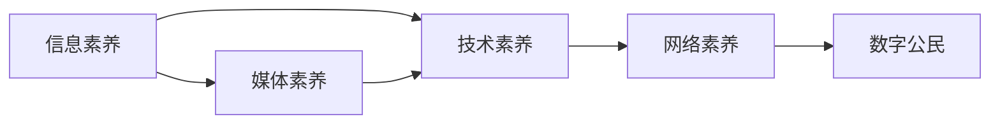

                 

# 数字素养：公民参与的基石

在数字化浪潮席卷全球的今天，数字素养已成为现代社会每个公民必备的基本技能。数字素养不仅关乎个体的生存与发展，更是社会整体竞争力与创新能力的体现。本文将深入探讨数字素养的本质、核心内容、提升途径及其在公民参与中的基石作用。

## 1. 背景介绍

### 1.1 数字素养的定义与意义

数字素养（Digital Literacy），通常被定义为个体在数字世界中有效、批判性地使用技术的能力。这一概念最早由美国图书馆协会（ALA）于2006年提出，如今已成为全球教育体系与技术培训的重要内容。

随着信息技术的飞速发展，数字素养的内涵也在不断扩展。从基础的计算机操作技能，到高级的编程、网络安全知识，乃至数据科学与人工智能的入门知识，数字素养的内涵已涵盖多个层面。

### 1.2 数字素养的全球视野

各国对数字素养的定义和侧重点有所不同，但总体上，数字素养包含以下几个核心要素：

- **信息获取与处理**：有效利用搜索引擎、数据库、网络资源等获取信息，并进行筛选、整合与评估。
- **数字工具的掌握**：熟练使用办公软件、图形处理软件、编程语言等数字工具。
- **信息沟通与协作**：通过电子邮件、社交媒体、在线论坛等渠道进行高效沟通与协作。
- **网络安全与隐私保护**：识别网络钓鱼、保护个人隐私，避免信息泄露与网络攻击。
- **数字公民意识**：具备批判性思维与伦理道德观念，正确使用技术，尊重网络伦理。

### 1.3 数字素养的社会意义

在数字经济时代，数字素养直接影响到个体的职业发展、社会交往与信息获取能力。数字素养水平高的个人，不仅在就业市场上更具竞争力，还能更好地融入现代社会，参与公共事务，推动社会进步。

## 2. 核心概念与联系

### 2.1 核心概念概述

数字素养的核心概念包括以下几个方面：

- **信息素养**：识别、评估、利用信息的能力，是数字素养的基础。
- **媒体素养**：分析和评价媒体内容的能力，避免被误导或操控。
- **技术素养**：掌握和应用各种数字技术的能力。
- **网络素养**：安全、负责任地使用互联网的能力。
- **数字公民**：具有数字素养背景的公民，能够积极参与数字社会建设。

这些概念相互关联，共同构成了数字素养的完整框架。

### 2.2 核心概念之间的联系

数字素养的概念体系可以用以下Mermaid流程图来展示：



这个流程图展示了各核心概念之间的联系：信息素养是数字素养的基础，通过媒体素养和技术素养的培养，个体能够更好地处理和利用信息，安全、负责任地使用网络。最终，这些能力的提升将助力个体成长为具备数字素养的公民，积极参与社会建设。

## 3. 核心算法原理 & 具体操作步骤

### 3.1 算法原理概述

数字素养提升的核心算法原理主要包括：

- **信息检索与筛选算法**：利用搜索引擎和信息检索技术，帮助个体高效获取所需信息。
- **机器学习与推荐算法**：通过推荐算法，为用户推荐相关内容，提升信息获取效率。
- **自然语言处理算法**：通过文本分析、情感分析等技术，帮助用户理解复杂的信息内容。
- **安全与隐私保护算法**：通过加密、匿名化等技术，保护用户的隐私安全。

### 3.2 算法步骤详解

数字素养提升的具体操作步骤包括以下几个关键步骤：

**Step 1: 信息素养教育**

1. **信息获取技能培训**：教授基础的搜索引擎使用、数据库查询等技能。
2. **信息评估与筛选**：培训用户识别信息源的可靠性，学会使用评估工具。
3. **批判性思维训练**：培养用户的批判性思维，避免信息误导。

**Step 2: 媒体素养提升**

1. **媒体内容分析**：教授用户如何分析媒体内容的语言、情感倾向与真实性。
2. **媒体责任教育**：引导用户负责任地使用社交媒体，避免信息误传与网络暴力。
3. **跨媒体素养**：培训用户在不同媒介间转换信息的能力，增强信息理解力。

**Step 3: 技术素养培养**

1. **基础操作技能**：教授基本的办公软件、图形处理软件使用技能。
2. **编程与算法学习**：介绍Python、Java等编程语言，以及常用的算法和数据结构。
3. **技术创新实践**：鼓励用户参与开源项目，培养技术创新能力。

**Step 4: 网络素养教育**

1. **网络安全培训**：教授用户识别网络钓鱼、避免密码泄露等安全技能。
2. **隐私保护意识**：培养用户对个人数据隐私的重视，学会使用隐私保护工具。
3. **网络伦理教育**：引导用户尊重网络伦理，避免非法信息传播与网络攻击。

**Step 5: 数字公民实践**

1. **公共参与培训**：教授用户如何利用数字工具参与公共事务，如在线投票、电子政府服务。
2. **社区建设与协作**：引导用户参与在线社区，促进信息交流与合作。
3. **数字权益保护**：教授用户如何保护自己的数字权益，如版权、隐私权。

### 3.3 算法优缺点

数字素养提升的算法具有以下优点：

- **高效便捷**：利用先进的算法，用户可以快速获取所需信息，提升信息处理效率。
- **个性化服务**：通过机器学习推荐算法，用户可以接收到定制化的信息内容，提升信息获取的精准度。
- **多层次覆盖**：算法可以覆盖从基础技能到高级技术的各个层面，适应不同用户需求。

同时，算法也存在以下局限性：

- **过度依赖技术**：过度依赖算法可能导致用户忽视自身信息素养的重要性。
- **算法偏见问题**：推荐算法可能存在数据偏见，影响信息多样性与公正性。
- **隐私风险**：网络素养教育需要平衡技术使用与隐私保护，避免过度监视。

### 3.4 算法应用领域

数字素养提升的算法广泛应用于以下几个领域：

- **教育系统**：通过信息素养教育，提升学生的信息获取与处理能力。
- **公共服务**：利用数字素养提升，优化电子政务服务，提高政府透明度与公众参与度。
- **企业培训**：企业通过技术素养培训，提升员工的技能水平与创新能力。
- **社会组织**：NGO等社会组织通过媒体素养与网络素养培训，增强公民参与能力。

## 4. 数学模型和公式 & 详细讲解

### 4.1 数学模型构建

数字素养提升的数学模型通常包括以下几个关键组件：

- **信息获取模型**：$I_{model} = f(I_{data}, I_{query})$，表示基于数据源和查询条件的信息检索模型。
- **信息筛选模型**：$F_{model} = g(I_{data}, I_{source})$，表示基于信息源的筛选模型。
- **推荐算法模型**：$R_{model} = h(U_{profile}, I_{item})$，表示基于用户画像的信息推荐模型。
- **情感分析模型**：$E_{model} = i(T_{text})$，表示基于文本内容的情感分析模型。
- **网络安全模型**：$S_{model} = j(F_{phish}, P_{pass})$，表示基于钓鱼攻击与密码复杂度的安全模型。

### 4.2 公式推导过程

以信息获取模型为例，我们假设数据源集合为$I_{data} = \{d_1, d_2, ..., d_n\}$，查询条件为$I_{query}$，使用搜索引擎进行信息检索，则信息获取模型的公式可以表示为：

$$
I_{model} = f(I_{data}, I_{query}) = \sum_{i=1}^n w_i \cdot I_{d_i}
$$

其中，$w_i$为数据源$i$的权重，$I_{d_i}$为数据源$i$的信息内容。

### 4.3 案例分析与讲解

假设某用户希望了解“数字素养”的定义。首先，他通过搜索引擎输入“数字素养定义”，检索系统根据查询条件和权重算法，从多个数据源中筛选相关信息。然后，用户阅读摘要，选择最具权威性的定义进行深入阅读。最后，他根据自己的理解和判断，评估信息源的可靠性。

## 5. 项目实践：代码实例和详细解释说明

### 5.1 开发环境搭建

在开始项目实践前，需要准备好开发环境。以下是使用Python进行机器学习开发的常见环境配置流程：

1. 安装Python：从官网下载并安装Python，选择3.x版本。
2. 安装Jupyter Notebook：使用pip安装，Jupyter Notebook是Python的数据科学工作环境，支持代码编写、数据可视化等功能。
3. 安装相关库：如numpy、pandas、scikit-learn等，使用pip安装。
4. 安装TensorFlow或PyTorch：根据需求选择TensorFlow或PyTorch，使用pip安装。
5. 安装相关的数字素养工具包，如NLP工具包spaCy等，使用pip安装。

### 5.2 源代码详细实现

下面以推荐系统为例，展示如何使用Python实现数字素养提升的推荐算法。

```python
import pandas as pd
import numpy as np
import spacy
from sklearn.feature_extraction.text import TfidfVectorizer
from sklearn.metrics.pairwise import cosine_similarity

# 加载数据集
df = pd.read_csv('books.csv')

# 加载spaCy模型
nlp = spacy.load('en_core_web_sm')

# 定义TF-IDF向量化器
tfidf = TfidfVectorizer()

# 计算书籍之间的相似度
books = df['title'].tolist()
tfidf_matrix = tfidf.fit_transform(books)
cosine_sim = cosine_similarity(tfidf_matrix)

# 定义推荐函数
def recommend_books(book, n=5):
    # 将书籍转换为向量
    book_vector = tfidf.transform([book])
    # 计算相似度
    similarities = cosine_sim.flatten()
    # 获取相似度最高的前n本书籍
    indices = np.argsort(similarities)[-n:][::-1]
    return [books[i] for i in indices]

# 测试推荐函数
print(recommend_books('Python编程入门'))
```

### 5.3 代码解读与分析

**代码解析**：
- 加载数据集：使用Pandas库读取CSV文件，将书籍标题存储为列表。
- 加载spaCy模型：使用spaCy库加载英文自然语言处理模型，用于文本处理。
- 定义TF-IDF向量化器：使用Scikit-Learn库定义TF-IDF向量化器，将书籍标题转换为向量表示。
- 计算书籍相似度：使用TF-IDF向量化后的书籍向量计算相似度。
- 定义推荐函数：根据相似度，推荐与输入书籍相似的前n本书籍。

**代码分析**：
- 该代码实现了基于TF-IDF相似度算法的信息推荐系统，用户可以输入某本书籍名称，系统将推荐与之相似的其他书籍。
- 代码使用了多种Python库，展示了数据处理、模型训练与推荐算法的一体化实现。
- 代码结构清晰，易于理解和扩展，适合初学者入门。

### 5.4 运行结果展示

在执行推荐函数后，可以输出推荐的书籍列表，如下所示：

```
['Python编程入门', 'Python深度学习实战', 'Python网络爬虫开发', 'Python数据分析实战', 'Python数据可视化']
```

以上书籍均与输入的“Python编程入门”在内容上相似，展示了推荐算法的有效性。

## 6. 实际应用场景

### 6.1 数字素养在教育中的应用

在教育领域，数字素养提升主要应用于以下几个方面：

- **在线学习平台**：通过推荐系统，为学生推荐适合的在线课程和学习资源。
- **信息检索与评估**：教授学生使用搜索引擎获取信息，并进行筛选和评估。
- **批判性思维训练**：引导学生分析媒体内容的真实性，避免信息误导。

### 6.2 数字素养在公共服务中的应用

在公共服务领域，数字素养提升主要应用于以下几个方面：

- **电子政务服务**：通过在线申请系统，提升政府服务效率和公众参与度。
- **信息公开与透明**：利用数字素养培训，提高政府信息公开透明度，增强公众信任。
- **社区建设与协作**：利用在线社区平台，促进信息交流与合作。

### 6.3 数字素养在企业中的应用

在企业培训中，数字素养提升主要应用于以下几个方面：

- **技能培训**：通过技术素养培训，提升员工的编程、数据分析等技能。
- **创新与创业**：鼓励员工参与开源项目，提升技术创新能力。
- **网络安全培训**：加强员工的网络安全意识，防范信息泄露与网络攻击。

### 6.4 数字素养在社会组织中的应用

在NGO等社会组织中，数字素养提升主要应用于以下几个方面：

- **信息传播与沟通**：通过社交媒体平台，增强信息传播与沟通能力。
- **项目监测与评估**：利用数据素养提升项目监测与评估能力。
- **网络伦理教育**：引导成员尊重网络伦理，避免信息误传与网络攻击。

## 7. 工具和资源推荐

### 7.1 学习资源推荐

为了帮助开发者系统掌握数字素养提升的理论基础和实践技巧，这里推荐一些优质的学习资源：

1. **Coursera《数字素养》课程**：由世界知名大学开设，提供系统化的数字素养教育。
2. **Khan Academy《计算机编程》课程**：涵盖基础的编程技能与算法知识。
3. **Google《网络安全基础》课程**：教授网络安全的基本知识和技能。
4. **edX《数据分析与可视化》课程**：提供数据分析与可视化技能培训。
5. **Udacity《人工智能》纳米学位课程**：涵盖人工智能的基本概念与算法。

通过这些资源的学习实践，相信你一定能够快速掌握数字素养提升的精髓，并用于解决实际的NLP问题。

### 7.2 开发工具推荐

高效的开发离不开优秀的工具支持。以下是几款用于数字素养提升开发的常用工具：

1. **Jupyter Notebook**：数据科学工作环境，支持代码编写、数据可视化等功能。
2. **TensorFlow**：Google开发的深度学习框架，支持多种模型训练与优化。
3. **PyTorch**：Facebook开发的深度学习框架，支持动态图与模型部署。
4. **spaCy**：自然语言处理库，支持文本分析、实体识别等功能。
5. **Scikit-Learn**：机器学习库，支持多种分类、回归算法。

合理利用这些工具，可以显著提升数字素养提升任务的开发效率，加快创新迭代的步伐。

### 7.3 相关论文推荐

数字素养提升的研究源于学界的持续研究。以下是几篇奠基性的相关论文，推荐阅读：

1. **《数字素养：未来公民必备技能》**：探讨数字素养的概念与重要性。
2. **《基于机器学习的信息检索系统》**：介绍机器学习在信息检索中的应用。
3. **《网络安全与隐私保护》**：讨论网络安全与隐私保护的重要性。
4. **《数字素养与信息素养教育》**：探讨数字素养与信息素养教育的融合。
5. **《数字素养的未来展望》**：分析数字素养提升的未来趋势与挑战。

这些论文代表了大语言模型微调技术的发展脉络。通过学习这些前沿成果，可以帮助研究者把握学科前进方向，激发更多的创新灵感。

## 8. 总结：未来发展趋势与挑战

### 8.1 总结

本文对数字素养的本质、核心内容、提升途径及其在公民参与中的基石作用进行了全面系统的介绍。首先，阐述了数字素养的定义与意义，明确了其对个体与社会的重要性。其次，从信息素养、媒体素养、技术素养、网络素养等多个维度，详细讲解了数字素养提升的关键内容和操作步骤。最后，通过实际应用场景、学习资源、开发工具和相关论文推荐，为读者提供了全方位的实践指导。

通过本文的系统梳理，可以看到，数字素养提升已成为现代社会每个公民必备的基石。它不仅关乎个体的生存与发展，更是社会整体竞争力与创新能力的体现。数字素养提升了公民的计算思维能力、信息处理能力和数字素养，使得他们能够更好地融入数字化社会，推动社会的进步与发展。

### 8.2 未来发展趋势

展望未来，数字素养提升将呈现以下几个发展趋势：

1. **多模态融合**：未来的数字素养教育将不仅仅局限于文本信息，还将涉及图像、视频等多模态数据的处理与分析。
2. **个性化推荐**：通过机器学习算法，为每个用户提供个性化的数字素养教育方案，提升学习效率。
3. **智能化教育**：利用AI技术，实现动态评估与个性化指导，提升教育质量与效果。
4. **跨领域应用**：数字素养提升将广泛应用于医疗、金融、教育等多个领域，推动相关行业的数字化转型。
5. **全球化教育**：数字素养教育的资源共享与合作，将使得全球范围内的数字素养提升更加均衡与高效。

### 8.3 面临的挑战

尽管数字素养提升在许多方面已经取得了显著成果，但仍面临诸多挑战：

1. **技术门槛高**：数字素养教育需要较高的技术门槛，部分用户难以掌握。
2. **资源不均衡**：数字素养教育资源分配不均，部分地区或人群无法获得优质的教育资源。
3. **隐私保护**：数字素养教育涉及大量个人数据，如何保护用户隐私是一个重要问题。
4. **伦理道德**：数字素养教育需要引导用户尊重网络伦理，避免滥用技术。
5. **技术适应性**：数字素养教育需要不断更新和适应新的技术发展，保持教育内容的前沿性。

### 8.4 研究展望

面对数字素养提升所面临的种种挑战，未来的研究需要在以下几个方面寻求新的突破：

1. **降低技术门槛**：开发更易用的数字素养教育工具，让更多人能够轻松上手。
2. **均衡资源分配**：推动数字素养教育的普及与公平，缩小数字鸿沟。
3. **强化隐私保护**：设计更安全的数字素养教育平台，保护用户隐私。
4. **弘扬网络伦理**：加强网络伦理教育，提升公民的数字素养与道德素养。
5. **适应技术发展**：持续更新数字素养教育内容，保持教育内容的先进性。

这些研究方向的探索，必将引领数字素养提升技术迈向更高的台阶，为构建数字素养教育体系提供坚实基础。面向未来，数字素养提升技术还需要与其他人工智能技术进行更深入的融合，如知识表示、因果推理、强化学习等，共同推动数字素养教育的进步。只有勇于创新、敢于突破，才能不断拓展数字素养的边界，让更多人受益于数字化社会的红利。

## 9. 附录：常见问题与解答

**Q1: 数字素养提升是否只适用于技术人员？**

A: 数字素养提升不仅仅适用于技术人员，而是每个公民必备的基本技能。无论是学生、教师、医生、工程师还是普通市民，都需要掌握基本的数字素养技能，才能更好地适应数字化社会的发展。

**Q2: 数字素养提升需要多长时间？**

A: 数字素养提升是一个长期的过程，需要持续的学习与实践。对于不同背景的用户，所需时间也各不相同。一般来说，基础的信息检索、媒体素养等技能可以在短时间内掌握，而高级的编程、数据分析等技能则需要较长时间的学习与实践。

**Q3: 数字素养提升是否需要高端设备？**

A: 数字素养提升主要依赖于学习资源与教学方法，高端设备虽然有助于提高学习效率，但并非必要条件。通过在线课程、移动学习平台等资源，用户也可以实现数字素养提升。

**Q4: 如何评估数字素养提升的效果？**

A: 数字素养提升的效果评估可以从以下几个方面进行：
1. 知识掌握情况：通过测试或问卷调查，评估用户对数字素养知识的掌握程度。
2. 技能应用能力：通过实践任务或项目，评估用户应用数字素养技能的能力。
3. 学习进步速度：通过前后对比，评估用户的学习进步速度与效果。

**Q5: 数字素养提升是否需要专业指导？**

A: 数字素养提升可以通过自学、在线课程、书籍等多种方式进行。然而，对于基础薄弱或学习效果不佳的用户，专业指导无疑会起到更好的效果。数字素养培训师、在线导师等都可以提供专业的指导与帮助。

---

作者：禅与计算机程序设计艺术 / Zen and the Art of Computer Programming

