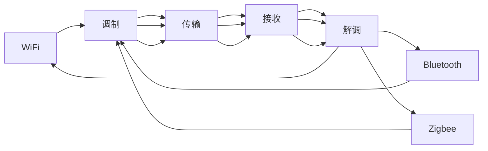

                 

# 无线通信协议：WiFi、Bluetooth 和 Zigbee

> 关键词：无线通信协议，WiFi，Bluetooth，Zigbee，调制解调，信道访问，频率分配，网络拓扑，低功耗，蓝牙，Zigbee，物联网，通信协议，数据传输，标准制定

## 1. 背景介绍

### 1.1 问题由来
随着物联网（IoT）的快速发展，无线通信协议在数据传输和设备互联中的应用越来越广泛。无线通信协议不仅在计算机网络中起到关键作用，也广泛应用于智能家居、医疗健康、工业控制等领域。本文将详细介绍三种常见的无线通信协议：WiFi、Bluetooth 和 Zigbee。首先介绍每种协议的核心概念和架构，然后分析它们之间的联系和区别，最后探讨它们在实际应用场景中的表现和未来发展方向。

## 2. 核心概念与联系

### 2.1 核心概念概述

无线通信协议是指在无线传输过程中，对信号进行调制、解调以及数据传输和控制的技术规范。不同类型的无线通信协议在数据速率、可靠性、功耗等方面有不同的设计目标和应用场景。

- WiFi（Wireless Fidelity）：是一种基于IEEE 802.11标准的无线局域网协议，支持长距离、高速率的数据传输。
- Bluetooth（蓝牙）：是一种低功耗的短距离无线通信协议，支持设备间的低速率数据传输和简单控制。
- Zigbee：是一种低速、低功耗、低复杂度的无线通信协议，适用于物联网中设备间的数据传输和控制。

这三种协议虽然在技术细节上有所差异，但它们都基于无线电波的传输，采用不同的调制技术、信道访问方式和数据编码方式。因此，它们在无线通信系统的架构设计和应用场景选择上存在很多共通点。

### 2.2 核心概念原理和架构的 Mermaid 流程图



## 3. 核心算法原理 & 具体操作步骤

### 3.1 算法原理概述

无线通信协议的算法原理主要涉及信号调制、解调、编码和解码等关键环节。以WiFi、Bluetooth和Zigbee为例，其核心原理包括：

- WiFi：采用正交频分复用（OFDM）调制技术，实现高带宽和长距离传输。
- Bluetooth：采用跳频扩频（FHSS）调制技术，增强信号稳定性和抗干扰能力。
- Zigbee：采用直接序列扩频（DSSS）调制技术，实现低功耗和低误码率传输。

这三种协议的算法原理和调制技术有所不同，但它们的目标都是通过无线方式实现可靠的数据传输。

### 3.2 算法步骤详解

无线通信协议的实现步骤包括以下几个关键环节：

1. **调制和解调**：将数字数据转换为无线电信号进行传输，同时在接收端将信号恢复为数字数据。
2. **编码和解码**：对数据进行编码以增强传输的可靠性和安全性，同时在接收端进行解码以恢复原始数据。
3. **信道访问控制**：在多用户环境中，采用时分复用、码分复用等方式，确保每个用户都能公平地访问信道。
4. **频率分配**：根据无线通信协议的标准，选择合适的频段进行数据传输，避免干扰和其他协议的干扰。
5. **网络拓扑设计**：根据实际应用场景，设计合适的网络拓扑结构，如星形、网状等，优化数据传输路径和网络覆盖范围。

### 3.3 算法优缺点

每种无线通信协议都有其优缺点，下面是它们的主要特点：

- WiFi：优点是传输速率高、覆盖范围广、适合长距离传输；缺点是功耗较大、安全性有待提高。
- Bluetooth：优点是低功耗、易于建立连接、适合短距离传输；缺点是传输速率较低、带宽有限。
- Zigbee：优点是低功耗、低复杂度、适合物联网设备间互联；缺点是传输速率较低、网络规模较小。

### 3.4 算法应用领域

WiFi、Bluetooth和Zigbee广泛应用于各种无线通信系统，具体应用领域包括：

- WiFi：广泛应用于家庭、办公室、公共场所等需要高带宽和长距离传输的场景，如互联网接入、无线网络电视、远程监控等。
- Bluetooth：广泛用于移动设备、医疗设备、智能家居等需要短距离传输和简单控制的应用场景，如蓝牙音箱、智能穿戴设备、医疗设备等。
- Zigbee：主要用于物联网设备间的通信，如智能家居控制、工业控制、环境监测等场景。

## 4. 数学模型和公式 & 详细讲解 & 举例说明

### 4.1 数学模型构建

无线通信协议的数学模型主要涉及信道模型、调制模型、编码模型和信道接入模型。以下以WiFi为例，介绍其主要数学模型：

- **信道模型**：WiFi使用衰减指数模型来描述无线信道的传输特性，其数学模型为：
$$
h(t) = A_0 e^{-\frac{t^2}{\tau^2}}
$$
其中 $A_0$ 为常数，$\tau$ 为衰减常数，$t$ 为时间。
- **调制模型**：WiFi采用OFDM调制技术，其数学模型为：
$$
s(t) = \sum_{k=-N/2}^{N/2} s_k \cos(2\pi f_k t + \phi_k)
$$
其中 $s_k$ 为符号数据，$f_k$ 为子载波频率，$\phi_k$ 为相位偏移。
- **编码模型**：WiFi使用Turbo编码技术，其编码模型为：
$$
E = (G_1,G_2)
$$
其中 $G_1$ 和 $G_2$ 为两个并行的编码器，$E$ 为编码后的数据。
- **信道接入模型**：WiFi采用时分复用（TDMA）和码分复用（CDMA）等方式，确保多个用户能够公平地访问信道，其数学模型为：
$$
T = \sum_{k=1}^{K} t_k
$$
其中 $T$ 为信道总时间，$t_k$ 为每个用户的传输时间。

### 4.2 公式推导过程

以WiFi的OFDM调制模型为例，其推导过程如下：

1. **符号映射**：将数字符号 $s_k$ 映射为时域信号 $s(t)$，数学模型为：
$$
s_k = \sum_{m=-N/2}^{N/2} c_m \cos(2\pi f_m t + \phi_m)
$$
其中 $c_m$ 为符号映射系数，$f_m$ 为子载波频率，$\phi_m$ 为相位偏移。
2. **信道传输**：通过无线信道 $h(t)$ 进行传输，数学模型为：
$$
r(t) = \sum_{k=-N/2}^{N/2} s_k \cos(2\pi f_k t + \phi_k) h(t)
$$
3. **接收端解调**：在接收端进行信号解调，得到符号数据 $r_k$，数学模型为：
$$
r_k = \sum_{m=-N/2}^{N/2} c_m \cos(2\pi f_m t + \phi_m) h(t)
$$
4. **符号解码**：通过Turbo解码器进行符号解码，得到原始数据 $s_k$，数学模型为：
$$
s_k = \frac{r_k}{g_k}
$$
其中 $g_k$ 为解码器增益。

### 4.3 案例分析与讲解

以WiFi的OFDM调制模型为例，分析其数据传输和接收过程：

- **发送端**：将数字符号 $s_k$ 映射为时域信号 $s(t)$，然后通过无线信道 $h(t)$ 进行传输，得到接收信号 $r(t)$。
- **接收端**：对接收信号 $r(t)$ 进行解调，得到符号数据 $r_k$，然后通过Turbo解码器进行符号解码，得到原始数据 $s_k$。

通过OFDM调制技术，WiFi实现了高速率和长距离的数据传输，同时提高了系统的抗干扰能力和频谱效率。

## 5. 项目实践：代码实例和详细解释说明

### 5.1 开发环境搭建

无线通信协议的开发环境通常包括硬件平台和软件工具。以下是搭建开发环境的步骤：

1. **硬件平台**：搭建WiFi、Bluetooth和Zigbee实验板，如Arduino、ESP8266等，用于进行实验和测试。
2. **软件工具**：安装编程环境和调试工具，如Arduino IDE、ESP-IDF等，用于编写和测试代码。

### 5.2 源代码详细实现

以下是一个基于WiFi的简单代码实例，用于实现基本的WiFi连接和数据传输：

```python
import socket

# 创建WiFi socket
WiFi = socket.socket(socket.AF_INET, socket.SOCK_STREAM)

# 连接WiFi服务器
WiFi.connect(('192.168.1.1', 8080))

# 发送数据
data = 'Hello, WiFi!'
WiFi.send(data.encode())

# 接收数据
response = WiFi.recv(1024)
print(response.decode())
```

### 5.3 代码解读与分析

上述代码实例展示了如何使用Python和socket库实现基本的WiFi连接和数据传输：

- 首先，创建WiFi socket对象，并指定连接目标地址和端口号。
- 然后，通过WiFi socket对象的connect方法连接目标地址。
- 接着，使用send方法发送数据到服务器。
- 最后，使用recv方法接收服务器响应，并解码后输出。

### 5.4 运行结果展示

运行上述代码后，如果一切正常，应该在控制台输出服务器响应的数据。例如，假设服务器响应为'Hello, WiFi!'，则控制台输出如下：

```
Hello, WiFi!
```

## 6. 实际应用场景

### 6.1 WiFi

WiFi广泛应用于各种无线通信场景，例如：

- 智能家居：智能灯泡、智能音箱、智能门锁等。
- 公共场所：无线网络电视、无线网络信号覆盖等。
- 办公室：无线网络接入、会议系统等。

### 6.2 Bluetooth

Bluetooth广泛应用于以下场景：

- 移动设备：蓝牙音箱、蓝牙耳机、智能穿戴设备等。
- 医疗设备：无线心电图、无线血压计等。
- 智能家居：蓝牙控制灯光、窗帘、空调等。

### 6.3 Zigbee

Zigbee主要用于物联网设备间的通信，例如：

- 智能家居：智能插座、智能窗帘、智能温控器等。
- 工业控制：智能传感器、自动化生产线等。
- 环境监测：空气质量监测、水质监测等。

## 7. 工具和资源推荐

### 7.1 学习资源推荐

- WiFi：《Wireless Communications: Principles and Practice》书籍，详细介绍了WiFi的原理和应用。
- Bluetooth：《Bluetooth Low Energy for the Internet of Things》书籍，介绍了Bluetooth的低功耗特性和物联网应用。
- Zigbee：《Zigbee: IEEE 802.15.4 Technology for RF and Wireless Networked Devices》书籍，详细介绍了Zigbee的技术原理和网络拓扑。

### 7.2 开发工具推荐

- WiFi：Arduino IDE、ESP-IDF等。
- Bluetooth：nRF5 SDK、BleAppleSDK等。
- Zigbee：Zigbee2RF模块、Zigbee-Modbus模块等。

### 7.3 相关论文推荐

- WiFi：《OFDM for Wireless Communications》论文，介绍了OFDM调制技术的工作原理和性能分析。
- Bluetooth：《A Survey of Bluetooth for the Internet of Things》论文，介绍了Bluetooth在物联网中的应用。
- Zigbee：《Survey of Zigbee for the Internet of Things》论文，介绍了Zigbee在物联网中的应用。

## 8. 总结：未来发展趋势与挑战

### 8.1 研究成果总结

本文详细介绍了无线通信协议的核心概念和应用场景，包括WiFi、Bluetooth和Zigbee。通过对它们的工作原理和架构进行详细分析，帮助读者更好地理解无线通信协议的实现和应用。

### 8.2 未来发展趋势

未来，无线通信协议将朝着以下几个方向发展：

- 更高的数据速率和更长的传输距离：通过技术创新和频段扩展，提升无线通信系统的性能。
- 更低的功耗和更低的成本：采用低功耗技术和芯片设计，降低设备成本和功耗。
- 更强的安全性和更广泛的应用场景：通过增强加密和访问控制，提升无线通信系统的安全性，拓展应用场景。

### 8.3 面临的挑战

当前，无线通信协议仍面临一些挑战：

- 频谱资源有限：现有的频谱资源有限，未来需要进一步优化频谱利用率。
- 网络安全问题：无线通信系统面临网络安全威胁，需要加强加密和认证技术。
- 设备标准化：不同设备间的标准化和互操作性问题，需要统一标准和协议。

### 8.4 研究展望

未来，无线通信协议的研究方向将包括：

- 新的调制技术：如毫米波（mmWave）、激光通信等，提升传输速率和距离。
- 新的网络协议：如5G、Wi-Fi 6等，提升网络效率和可靠性。
- 新的设备设计：如低功耗芯片、灵活的频谱利用技术等，降低成本和功耗。

## 9. 附录：常见问题与解答

**Q1：WiFi、Bluetooth和Zigbee的区别是什么？**

A: WiFi、Bluetooth和Zigbee的主要区别在于传输速率、覆盖范围、功耗和应用场景：

- WiFi：传输速率高、覆盖范围广、适合长距离传输、功耗较高、适用于家庭、办公室等场景。
- Bluetooth：传输速率较低、覆盖范围有限、功耗较低、适合短距离传输、适用于移动设备、智能家居等场景。
- Zigbee：传输速率较低、覆盖范围有限、功耗极低、适用于物联网设备间互联、适用于智能家居、工业控制等场景。

**Q2：如何选择合适的无线通信协议？**

A: 选择合适的无线通信协议需要考虑以下几个因素：

- 传输速率和距离：根据应用场景选择适合的协议。WiFi适合长距离、高带宽传输，Bluetooth适合短距离、低功耗传输，Zigbee适合低功耗、低复杂度传输。
- 数据量：根据数据量和带宽需求选择适合的协议。WiFi适合大数据量传输，Bluetooth适合小数据量传输，Zigbee适合小数据量传输。
- 功耗要求：根据设备功耗要求选择适合的协议。WiFi功耗较高，Bluetooth和Zigbee功耗较低。
- 应用场景：根据应用场景选择适合的协议。WiFi适用于家庭、办公室等场景，Bluetooth适用于移动设备、智能家居等场景，Zigbee适用于物联网设备间互联。

**Q3：如何优化无线通信协议的性能？**

A: 优化无线通信协议的性能可以从以下几个方面入手：

- 提高调制技术：采用高效率的调制技术，如OFDM、MIMO等，提升传输速率和频谱效率。
- 增强网络安全：采用加密技术、访问控制技术等，增强无线通信系统的安全性。
- 优化信道分配：采用智能信道分配算法，优化频谱利用率，避免干扰和其他协议的干扰。
- 采用硬件加速：采用硬件加速技术，如DSP、FPGA等，提升无线通信系统的性能。
- 优化网络拓扑：采用合适的网络拓扑结构，如星形、网状等，优化数据传输路径和网络覆盖范围。

**Q4：无线通信协议的未来发展方向是什么？**

A: 无线通信协议的未来发展方向包括：

- 更高的数据速率和更长的传输距离：通过技术创新和频段扩展，提升无线通信系统的性能。
- 更低的功耗和更低的成本：采用低功耗技术和芯片设计，降低设备成本和功耗。
- 更强的安全性和更广泛的应用场景：通过增强加密和访问控制，提升无线通信系统的安全性，拓展应用场景。

通过不断创新和优化，无线通信协议将在未来继续发挥重要作用，推动物联网和智能设备的普及和发展。

