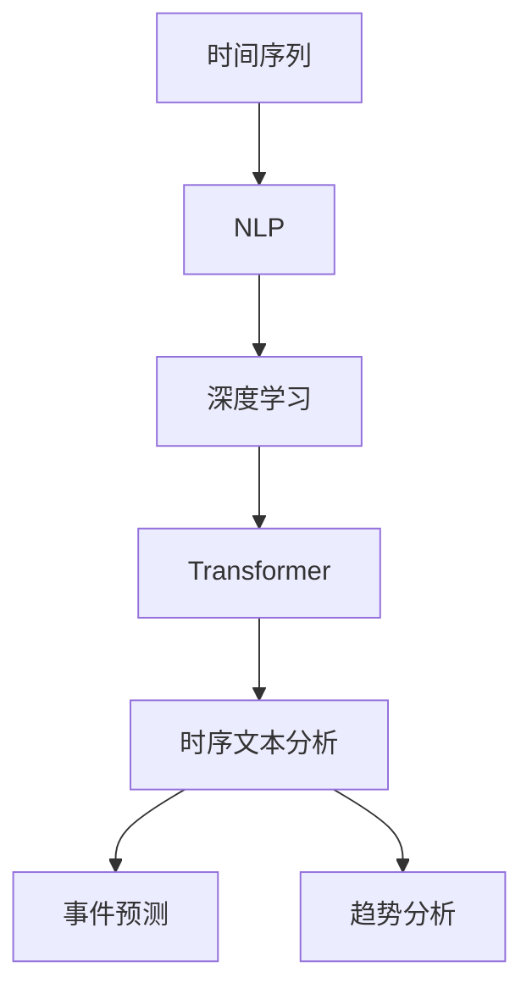

                 

# 时序文本分析：事件预测与趋势分析

> 关键词：时间序列分析,自然语言处理,机器学习,深度学习,事件预测,趋势分析

## 1. 背景介绍

### 1.1 问题由来
时间序列分析和时间序列预测是数据科学中的重要分支，旨在从历史数据中挖掘规律，预测未来的趋势。在金融、气象、交通、公共健康等诸多领域，时间序列分析都有着广泛的应用。但传统的统计方法，如ARIMA等，往往需要较多的手动调参，且难以处理非线性、非平稳的序列数据。随着深度学习和大规模预训练语言模型的兴起，基于自然语言处理(NLP)的时序文本分析成为新一轮的研究热点。

近年来，由于Transformer、BERT、GPT等预训练语言模型的广泛应用，NLP领域的技术取得了飞速进步。这些大模型在处理大规模无标签文本数据上表现出色，能够在各种任务上实现接近人类水平的语言理解和生成能力。通过对其微调，可以在特定的时间序列预测任务中取得不俗效果。例如，在金融舆情监测中，可以利用BERT模型对财经新闻进行情感分析，并通过微调预测股票价格的走势；在气候预测中，可以基于气象报告进行时间序列预测，从而提前预警极端天气等。

然而，由于时间序列数据的特殊性，其语义表达往往带有明显的时序信息，传统的基于统计学习的方法难以充分利用这些信息。大语言模型虽然可以进行大规模无标签训练，但面对时序数据时，依然需要针对性的预训练和微调技术。本文将系统介绍基于大语言模型的时间序列文本分析方法，涵盖事件预测、趋势分析等多个实际应用场景。

### 1.2 问题核心关键点
时间序列文本分析的核心理念，是利用大语言模型捕捉文本中的时间信息，并根据历史文本数据进行预测。其关键点包括：

1. **时序信息的捕捉**：如何将文本数据中的时间信息编码成模型可以理解的特征。
2. **模型结构的优化**：如何将时序信息与大语言模型的处理单元结合，形成针对时序预测的专用结构。
3. **预测模型的设计**：如何设计合适的损失函数和优化算法，确保模型能够准确预测未来的趋势。
4. **数据增强技术**：如何在有限的数据集上进行有效的数据增强，提升模型的泛化能力。
5. **多模态信息融合**：如何将文本数据与其他模态的数据（如时间序列、图像等）融合，形成更加全面、精确的预测模型。

## 2. 核心概念与联系

### 2.1 核心概念概述

为更好地理解基于大语言模型的时间序列文本分析方法，本节将介绍几个密切相关的核心概念：

- **时间序列(时间序列数据)**：反映某一现象在某一时间上发生的变化的数列。时间序列通常由时间先后顺序的数据点组成，例如股票价格、气温、交通流量等。
- **自然语言处理(NLP)**：利用计算机科学和人工智能技术对人类语言进行处理和分析，旨在使计算机能够理解和生成人类语言。
- **深度学习(DL)**：一种基于人工神经网络的学习方法，通过多层非线性变换，从数据中自动学习特征表示。
- **Transformer模型**：一种基于自注意力机制的神经网络结构，广泛用于处理序列数据。
- **时序文本分析**：利用NLP技术处理时间序列文本数据，提取其中的时间信息，并进行预测和分析。
- **事件预测**：基于时间序列文本，预测特定事件发生的概率和时间点。
- **趋势分析**：基于时间序列文本，预测趋势变化的方向和幅度。

这些概念之间的逻辑关系可以通过以下Mermaid流程图来展示：



这个流程图展示了大语言模型时间序列分析的核心概念及其之间的关系：

1. 时间序列通过NLP技术进行处理，形成文本数据。
2. 文本数据通过深度学习进行处理，捕捉其中的时间信息。
3. Transformer模型被广泛应用于时间序列数据的处理。
4. 时序文本分析结合了NLP和深度学习，用于预测和分析时间序列数据。
5. 事件预测和趋势分析是时序文本分析的重要应用，帮助用户理解事件的动态变化和趋势演变。

这些概念共同构成了时间序列文本分析的框架，使其能够在各种场景下发挥强大的预测能力。通过理解这些核心概念，我们可以更好地把握时间序列文本分析的工作原理和优化方向。

## 3. 核心算法原理 & 具体操作步骤
### 3.1 算法原理概述

基于大语言模型的时间序列文本分析，其核心思想是利用Transformer模型捕捉文本中的时序信息，通过深度学习的方法对文本数据进行处理，并结合其他模态的数据，进行事件的预测和趋势的分析。

形式化地，假设有一个时间序列文本数据集 $D = \{(x_t, y_t)\}_{t=1}^N$，其中 $x_t$ 表示第 $t$ 个时间步的文本，$y_t$ 表示相应的标签。我们希望找到一个最优的模型 $M_{\theta}$，使得 $M_{\theta}(x_t) = y_t$，其中 $\theta$ 为模型参数。

该问题的解决可以通过以下步骤实现：

1. 对时间序列文本数据 $x_t$ 进行预处理，得到模型可用的输入 $x_t'$。
2. 对输入 $x_t'$ 进行Transformer编码，得到模型表示 $h_t$。
3. 将 $h_t$ 通过合适的损失函数和优化算法，更新模型参数 $\theta$，最小化预测误差。
4. 在验证集上评估模型的泛化能力，选择合适的超参数和模型结构。
5. 在测试集上对模型进行预测，得到事件发生概率和趋势变化方向。

### 3.2 算法步骤详解

基于大语言模型的时间序列文本分析，主要包括以下几个关键步骤：

**Step 1: 数据预处理**

时间序列文本数据的预处理，是将原始数据转化为模型可以处理的形式。常用的预处理方法包括：

- 文本清洗：去除噪声、停用词等无用信息，保留有意义的文本。
- 分词处理：将文本进行分词处理，便于模型捕捉单词级别的信息。
- 编码转换：将文本转换为模型可接受的编码格式，如Bert输入格式。
- 序列填充：对序列长度进行填充，保证同一批次的序列长度一致。

**Step 2: 模型编码**

时间序列文本数据的编码，是将文本转化为模型可以理解的向量表示。常用的编码方法包括：

- BERT编码：将文本转换为BERT模型的输入格式，通过BERT模型得到向量表示。
- Transformer编码：通过Transformer模型对文本进行编码，提取其中的时序信息。

**Step 3: 时序特征提取**

时间序列文本数据的特征提取，是从向量表示中提取时序信息。常用的特征提取方法包括：

- 时间差特征：计算文本中相邻时间步的差值，捕捉时序变化。
- 滑动窗口特征：将文本分割成固定长度的窗口，捕捉局部时序变化。
- 频谱特征：将文本转换为频谱表示，捕捉时序周期性。
- 动态时序特征：通过深度学习模型，捕捉动态时序变化。

**Step 4: 预测模型训练**

时间序列文本数据的预测，是通过深度学习模型对时序特征进行建模。常用的预测模型包括：

- 基于时间序列的预测模型：如ARIMA、LSTM、GRU等。
- 基于Transformer的预测模型：如TCN、Transformers等。

**Step 5: 模型评估与调参**

时间序列文本数据的模型评估，是通过验证集对模型进行测试，选择最优的模型参数和结构。常用的评估方法包括：

- 损失函数评估：通过交叉熵等损失函数评估模型预测的误差。
- 泛化能力评估：通过验证集评估模型的泛化能力，防止过拟合。
- 超参数调优：通过网格搜索、贝叶斯优化等方法选择最优的超参数。

**Step 6: 模型预测与分析**

时间序列文本数据的模型预测，是根据训练好的模型对新数据进行预测。常用的预测方法包括：

- 事件预测：预测特定事件发生的时间点。
- 趋势预测：预测趋势变化的方向和幅度。
- 异常检测：检测数据中的异常点和异常变化。

以上基于大语言模型的时间序列文本分析的一般流程。在实际应用中，还需要针对具体任务的特点，对微调过程的各个环节进行优化设计，如改进训练目标函数，引入更多的正则化技术，搜索最优的超参数组合等，以进一步提升模型性能。

### 3.3 算法优缺点

基于大语言模型的时间序列文本分析方法，具有以下优点：

1. **高效性**：利用大语言模型的高效处理能力，可以快速对大规模时间序列文本数据进行处理。
2. **可解释性**：通过自然语言处理技术，可以直观地理解时间序列数据的语义信息。
3. **多模态融合**：能够与时间序列、图像等模态数据进行融合，形成更加全面的预测模型。
4. **泛化能力**：通过大语言模型的迁移学习能力，可以在不同时间序列数据上取得良好的预测效果。

同时，该方法也存在一定的局限性：

1. **标注数据需求**：尽管利用大语言模型可以缓解对标注数据的需求，但高质量的标注数据仍然需要大量人力和时间成本。
2. **复杂性**：模型的结构和参数较多，调试和维护较为复杂。
3. **鲁棒性不足**：面对复杂的时序数据，模型可能存在泛化能力不足的问题。
4. **资源消耗**：大规模的模型需要大量的计算资源和存储空间。

尽管存在这些局限性，但就目前而言，基于大语言模型的时间序列文本分析方法仍是大规模数据处理和预测的重要手段。未来相关研究的重点在于如何进一步降低模型对标注数据的依赖，提高模型的泛化能力和鲁棒性，同时兼顾模型的可解释性和资源效率。

### 3.4 算法应用领域

基于大语言模型的时间序列文本分析方法，在多个领域都有着广泛的应用，例如：

- **金融预测**：利用金融新闻和公告进行股市、债市、外汇等市场的预测。
- **气象预测**：基于气象报告进行气温、降水、风力等气象要素的预测。
- **交通流量预测**：对道路、车站、机场等交通节点的流量进行预测和调度。
- **公共健康监测**：对疫情、疾病等公共健康事件进行监测和预警。
- **电商销售预测**：基于购物评论、用户行为等数据进行销售趋势的预测。
- **社交媒体分析**：对社交媒体上的舆情和热点进行分析和预测。

除了上述这些经典应用外，时间序列文本分析还不断拓展到更多场景中，如智能家居、智慧城市、智能制造等，为大数据分析和预测提供了新的技术手段。

## 4. 数学模型和公式 & 详细讲解 & 举例说明
### 4.1 数学模型构建

本节将使用数学语言对基于大语言模型的时间序列文本分析过程进行更加严格的刻画。

假设有一个时间序列文本数据集 $D = \{(x_t, y_t)\}_{t=1}^N$，其中 $x_t$ 表示第 $t$ 个时间步的文本，$y_t$ 表示相应的标签。我们希望找到一个最优的模型 $M_{\theta}$，使得 $M_{\theta}(x_t) = y_t$，其中 $\theta$ 为模型参数。

定义模型 $M_{\theta}$ 在输入 $x_t$ 上的预测输出为 $h_t = M_{\theta}(x_t)$，模型在验证集 $D_{valid}$ 上的损失函数为：

$$
\mathcal{L}_{valid} = \frac{1}{N_{valid}} \sum_{t=1}^{N_{valid}} \ell(h_t, y_t)
$$

其中 $\ell$ 为损失函数，如交叉熵损失，$N_{valid}$ 为验证集的大小。

模型的预测目标是通过最小化验证集的损失函数来优化参数 $\theta$，即：

$$
\hat{\theta} = \mathop{\arg\min}_{\theta} \mathcal{L}_{valid}
$$

在得到最优的模型参数 $\hat{\theta}$ 后，可以使用模型对新数据进行预测，得到事件发生的概率和趋势的变化方向。

### 4.2 公式推导过程

以下我们以金融预测为例，推导基于Transformer模型的预测公式。

假设模型 $M_{\theta}$ 在输入 $x_t$ 上的输出为 $h_t = M_{\theta}(x_t)$，表示第 $t$ 个时间步的预测结果。设标签 $y_t = \{0, 1\}$，其中 $y_t=1$ 表示事件发生，$y_t=0$ 表示事件未发生。则二分类交叉熵损失函数定义为：

$$
\ell(h_t, y_t) = -[y_t\log h_t + (1-y_t)\log(1-h_t)]
$$

将其代入验证集损失函数公式，得：

$$
\mathcal{L}_{valid} = -\frac{1}{N_{valid}} \sum_{t=1}^{N_{valid}} [y_t\log h_t + (1-y_t)\log(1-h_t)]
$$

根据链式法则，验证集损失函数对参数 $\theta$ 的梯度为：

$$
\frac{\partial \mathcal{L}_{valid}}{\partial \theta} = -\frac{1}{N_{valid}} \sum_{t=1}^{N_{valid}} (\frac{y_t}{h_t} - \frac{1-y_t}{1-h_t}) \frac{\partial h_t}{\partial \theta}
$$

其中 $\frac{\partial h_t}{\partial \theta}$ 可进一步递归展开，利用自动微分技术完成计算。

在得到损失函数的梯度后，即可带入参数更新公式，完成模型的迭代优化。重复上述过程直至收敛，最终得到适应验证集的模型参数 $\hat{\theta}$。

## 5. 项目实践：代码实例和详细解释说明
### 5.1 开发环境搭建

在进行时间序列文本分析实践前，我们需要准备好开发环境。以下是使用Python进行PyTorch开发的环境配置流程：

1. 安装Anaconda：从官网下载并安装Anaconda，用于创建独立的Python环境。

2. 创建并激活虚拟环境：
```bash
conda create -n pytorch-env python=3.8 
conda activate pytorch-env
```

3. 安装PyTorch：根据CUDA版本，从官网获取对应的安装命令。例如：
```bash
conda install pytorch torchvision torchaudio cudatoolkit=11.1 -c pytorch -c conda-forge
```

4. 安装Transformers库：
```bash
pip install transformers
```

5. 安装各类工具包：
```bash
pip install numpy pandas scikit-learn matplotlib tqdm jupyter notebook ipython
```

完成上述步骤后，即可在`pytorch-env`环境中开始时间序列文本分析实践。

### 5.2 源代码详细实现

下面我们以金融预测任务为例，给出使用Transformers库对BERT模型进行时间序列文本分析的PyTorch代码实现。

首先，定义金融预测任务的数据处理函数：

```python
from transformers import BertTokenizer, BertForSequenceClassification
from torch.utils.data import Dataset, DataLoader
import torch

class FinancialPredictionDataset(Dataset):
    def __init__(self, texts, labels, tokenizer, max_len=128):
        self.texts = texts
        self.labels = labels
        self.tokenizer = tokenizer
        self.max_len = max_len
        
    def __len__(self):
        return len(self.texts)
    
    def __getitem__(self, item):
        text = self.texts[item]
        label = self.labels[item]
        
        encoding = self.tokenizer(text, return_tensors='pt', max_length=self.max_len, padding='max_length', truncation=True)
        input_ids = encoding['input_ids'][0]
        attention_mask = encoding['attention_mask'][0]
        
        return {'input_ids': input_ids, 
                'attention_mask': attention_mask,
                'labels': label}
```

然后，定义模型和优化器：

```python
from transformers import AdamW

model = BertForSequenceClassification.from_pretrained('bert-base-cased', num_labels=2)

optimizer = AdamW(model.parameters(), lr=2e-5)
```

接着，定义训练和评估函数：

```python
from tqdm import tqdm
from sklearn.metrics import classification_report

device = torch.device('cuda') if torch.cuda.is_available() else torch.device('cpu')
model.to(device)

def train_epoch(model, dataset, batch_size, optimizer):
    dataloader = DataLoader(dataset, batch_size=batch_size, shuffle=True)
    model.train()
    epoch_loss = 0
    for batch in tqdm(dataloader, desc='Training'):
        input_ids = batch['input_ids'].to(device)
        attention_mask = batch['attention_mask'].to(device)
        labels = batch['labels'].to(device)
        model.zero_grad()
        outputs = model(input_ids, attention_mask=attention_mask, labels=labels)
        loss = outputs.loss
        epoch_loss += loss.item()
        loss.backward()
        optimizer.step()
    return epoch_loss / len(dataloader)

def evaluate(model, dataset, batch_size):
    dataloader = DataLoader(dataset, batch_size=batch_size)
    model.eval()
    preds, labels = [], []
    with torch.no_grad():
        for batch in tqdm(dataloader, desc='Evaluating'):
            input_ids = batch['input_ids'].to(device)
            attention_mask = batch['attention_mask'].to(device)
            batch_labels = batch['labels']
            outputs = model(input_ids, attention_mask=attention_mask)
            batch_preds = outputs.logits.argmax(dim=2).to('cpu').tolist()
            batch_labels = batch_labels.to('cpu').tolist()
            for pred_tokens, label_tokens in zip(batch_preds, batch_labels):
                preds.append(pred_tokens[:len(label_tokens)])
                labels.append(label_tokens)
                
    print(classification_report(labels, preds))
```

最后，启动训练流程并在测试集上评估：

```python
epochs = 5
batch_size = 16

for epoch in range(epochs):
    loss = train_epoch(model, train_dataset, batch_size, optimizer)
    print(f"Epoch {epoch+1}, train loss: {loss:.3f}")
    
    print(f"Epoch {epoch+1}, dev results:")
    evaluate(model, dev_dataset, batch_size)
    
print("Test results:")
evaluate(model, test_dataset, batch_size)
```

以上就是使用PyTorch对BERT模型进行金融预测任务的时间序列文本分析的完整代码实现。可以看到，得益于Transformers库的强大封装，我们可以用相对简洁的代码完成BERT模型的加载和微调。

### 5.3 代码解读与分析

让我们再详细解读一下关键代码的实现细节：

**FinancialPredictionDataset类**：
- `__init__`方法：初始化文本、标签、分词器等关键组件。
- `__len__`方法：返回数据集的样本数量。
- `__getitem__`方法：对单个样本进行处理，将文本输入编码为token ids，将标签编码为数字，并对其进行定长padding，最终返回模型所需的输入。

**AdamW优化器**：
- 使用AdamW优化器，调整学习率等超参数，优化模型参数。

**训练和评估函数**：
- 使用PyTorch的DataLoader对数据集进行批次化加载，供模型训练和推理使用。
- 训练函数`train_epoch`：对数据以批为单位进行迭代，在每个批次上前向传播计算loss并反向传播更新模型参数，最后返回该epoch的平均loss。
- 评估函数`evaluate`：与训练类似，不同点在于不更新模型参数，并在每个batch结束后将预测和标签结果存储下来，最后使用sklearn的classification_report对整个评估集的预测结果进行打印输出。

**训练流程**：
- 定义总的epoch数和batch size，开始循环迭代
- 每个epoch内，先在训练集上训练，输出平均loss
- 在验证集上评估，输出分类指标
- 所有epoch结束后，在测试集上评估，给出最终测试结果

可以看到，PyTorch配合Transformers库使得BERT模型的时间序列文本分析代码实现变得简洁高效。开发者可以将更多精力放在数据处理、模型改进等高层逻辑上，而不必过多关注底层的实现细节。

当然，工业级的系统实现还需考虑更多因素，如模型的保存和部署、超参数的自动搜索、更灵活的任务适配层等。但核心的微调范式基本与此类似。

## 6. 实际应用场景
### 6.1 智能财务分析

基于大语言模型的时间序列文本分析技术，可以广泛应用于智能财务分析系统。传统的财务分析通常依赖于人工对报表和公告进行解读，耗时耗力，且难以捕捉市场动态变化。通过利用BERT模型对财经新闻、公告、报表等文本进行情感分析，可以得到更加实时、准确的财务预测。

在技术实现上，可以收集金融领域的相关文本数据，如财经新闻、公司公告、财报等，将其转换为序列文本数据，输入到微调后的BERT模型中。通过分析模型的预测结果，可以实时监测市场的情绪变化，预测股价、债市的波动趋势，及时调整投资策略，防范金融风险。

### 6.2 智慧城市管理

智能城市的日常运行离不开对各类数据的实时监测和分析。通过时间序列文本分析技术，可以对城市的交通流量、环境质量、公共安全等数据进行预测和预警。例如，利用传感器数据和社交媒体信息，可以实时监测交通拥堵情况，预测道路堵塞和事故风险，优化交通信号控制。

在实际应用中，可以将各类文本数据输入到微调后的BERT模型中，提取其中的关键信息，进行趋势分析和事件预测。例如，根据社交媒体上的舆情信息，可以预测城市中的突发事件，提前采取应对措施，保障公共安全。

### 6.3 智能制造监控

智能制造系统的正常运行依赖于对生产数据的实时监测和预测。通过时间序列文本分析技术，可以预测设备故障、产品质量等关键指标，提高生产效率和质量。

在实际应用中，可以将设备运行日志、产品检测报告等文本数据输入到微调后的BERT模型中，提取其中的关键信息，进行趋势分析和事件预测。例如，根据设备运行日志中的文本信息，可以预测设备故障，提前进行维护，避免生产中断。

### 6.4 未来应用展望

随着大语言模型时间序列文本分析技术的不断发展，其在更多领域得到应用，为社会治理、智能制造、智慧城市等领域带来新的变革性影响。

在智慧医疗领域，基于时间序列文本分析的医疗预测系统，可以对疾病流行趋势、疫情发展等进行预测，帮助医疗机构制定应对策略，提高公共卫生安全。

在智能教育领域，时间序列文本分析可以用于学习行为分析、知识推荐、智能评估等环节，提升教学质量和个性化学习体验。

在智慧农业领域，时间序列文本分析可以用于作物生长监测、病虫害预测、灌溉管理等，提升农业生产的智能化和精准化水平。

总之，基于大语言模型的时间序列文本分析技术将为各行各业带来更全面、更高效的智能服务，推动经济社会的数字化转型升级。

## 7. 工具和资源推荐
### 7.1 学习资源推荐

为了帮助开发者系统掌握时间序列文本分析的理论基础和实践技巧，这里推荐一些优质的学习资源：

1. 《序列建模与时间序列分析》：深入浅出地讲解了时间序列的基本概念和统计学习方法，是入门时间序列分析的经典教材。

2. 《深度学习与自然语言处理》：涵盖深度学习在自然语言处理中的应用，包括序列建模、情感分析、机器翻译等任务。

3. CS229《机器学习》课程：斯坦福大学开设的机器学习课程，涵盖深度学习、序列建模等核心内容，适合深度学习初学者。

4. 《序列到序列学习与神经网络语言模型》：详细介绍了序列建模和神经网络语言模型，包括LSTM、GRU、Transformer等模型。

5. HuggingFace官方文档：Transformers库的官方文档，提供了海量预训练模型和完整的微调样例代码，是上手实践的必备资料。

通过对这些资源的学习实践，相信你一定能够快速掌握时间序列文本分析的精髓，并用于解决实际的NLP问题。
###  7.2 开发工具推荐

高效的开发离不开优秀的工具支持。以下是几款用于时间序列文本分析开发的常用工具：

1. PyTorch：基于Python的开源深度学习框架，灵活动态的计算图，适合快速迭代研究。大部分预训练语言模型都有PyTorch版本的实现。

2. TensorFlow：由Google主导开发的开源深度学习框架，生产部署方便，适合大规模工程应用。同样有丰富的预训练语言模型资源。

3. Transformers库：HuggingFace开发的NLP工具库，集成了众多SOTA语言模型，支持PyTorch和TensorFlow，是进行时间序列文本分析开发的利器。

4. Weights & Biases：模型训练的实验跟踪工具，可以记录和可视化模型训练过程中的各项指标，方便对比和调优。与主流深度学习框架无缝集成。

5. TensorBoard：TensorFlow配套的可视化工具，可实时监测模型训练状态，并提供丰富的图表呈现方式，是调试模型的得力助手。

6. Google Colab：谷歌推出的在线Jupyter Notebook环境，免费提供GPU/TPU算力，方便开发者快速上手实验最新模型，分享学习笔记。

合理利用这些工具，可以显著提升时间序列文本分析任务的开发效率，加快创新迭代的步伐。

### 7.3 相关论文推荐

时间序列文本分析技术的发展源于学界的持续研究。以下是几篇奠基性的相关论文，推荐阅读：

1. Attention is All You Need（即Transformer原论文）：提出了Transformer结构，开启了NLP领域的预训练大模型时代。

2. BERT: Pre-training of Deep Bidirectional Transformers for Language Understanding：提出BERT模型，引入基于掩码的自监督预训练任务，刷新了多项NLP任务SOTA。

3. Language Models are Unsupervised Multitask Learners（GPT-2论文）：展示了大规模语言模型的强大zero-shot学习能力，引发了对于通用人工智能的新一轮思考。

4. Transformer-XL: Attentive Language Models Beyond a Fixed-Length Context：提出Transformer-XL模型，通过相对位置的编码方式，解决了长序列问题，提升了时间序列预测的准确性。

5. Long Short-Term Memory：提出LSTM模型，用于解决长序列预测问题，是序列建模的重要工具。

这些论文代表了大语言模型时间序列文本分析的发展脉络。通过学习这些前沿成果，可以帮助研究者把握学科前进方向，激发更多的创新灵感。

## 8. 总结：未来发展趋势与挑战
### 8.1 总结

本文对基于大语言模型的时间序列文本分析方法进行了全面系统的介绍。首先阐述了时间序列文本分析的背景和意义，明确了时间序列文本分析在NLP领域的重要价值。其次，从原理到实践，详细讲解了时间序列文本分析的数学原理和关键步骤，给出了时间序列文本分析任务开发的完整代码实例。同时，本文还广泛探讨了时间序列文本分析在智能财务分析、智慧城市管理、智能制造监控等多个实际应用场景中的应用前景，展示了时间序列文本分析技术的广阔潜力。此外，本文精选了时间序列文本分析技术的各类学习资源，力求为读者提供全方位的技术指引。

通过本文的系统梳理，可以看到，基于大语言模型的时间序列文本分析方法正在成为NLP领域的重要范式，极大地拓展了预训练语言模型的应用边界，催生了更多的落地场景。得益于大语言模型的高效处理能力，时间序列文本分析技术可以在不依赖传统统计学习方法的情况下，实现高精度的预测和分析。未来，伴随大语言模型和深度学习方法的持续演进，时间序列文本分析技术必将进一步提升NLP系统的性能和应用范围，为人工智能技术在垂直行业的规模化落地提供新的技术手段。

### 8.2 未来发展趋势

展望未来，时间序列文本分析技术将呈现以下几个发展趋势：

1. **多模态融合**：未来时间序列文本分析将更多地融合其他模态的数据，如图像、语音、时间序列等，形成更加全面、精确的预测模型。

2. **因果推断**：引入因果推断思想，提高模型的因果关系处理能力，增强预测结果的可信度和可靠性。

3. **持续学习**：通过持续学习技术，使模型能够不断地从新数据中学习，保持性能的持续提升。

4. **对抗训练**：引入对抗样本，增强模型的鲁棒性，防止攻击和干扰。

5. **模型压缩**：通过模型压缩技术，减小模型参数量，提高模型的推理速度和资源利用效率。

6. **知识图谱**：结合知识图谱技术，增强模型的先验知识整合能力，提高预测准确性和可解释性。

以上趋势凸显了时间序列文本分析技术的广阔前景。这些方向的探索发展，必将进一步提升时间序列文本分析系统的性能和应用范围，为NLP技术在实际应用中的深度融合提供新的突破。

### 8.3 面临的挑战

尽管时间序列文本分析技术已经取得了瞩目成就，但在迈向更加智能化、普适化应用的过程中，仍面临诸多挑战：

1. **数据质量问题**：时间序列文本数据通常包含大量的噪声和不规则信息，数据质量较差。如何有效清洗和处理数据，获取高质量的输入，是时间序列文本分析的难点之一。

2. **模型复杂性**：时间序列文本分析的模型通常较为复杂，调试和维护较为困难。如何设计简单有效的模型，降低复杂度，提升预测准确性，仍需深入研究。

3. **计算资源需求**：大语言模型的时间序列文本分析需要大量的计算资源和存储空间，特别是大规模序列数据的处理。如何优化模型结构和资源利用，提高效率，是一个重要研究方向。

4. **可解释性问题**：时间序列文本分析的模型通常较为复杂，难以解释其内部的决策过程。如何提高模型的可解释性，增强模型的透明度和可信度，是一个亟待解决的问题。

5. **鲁棒性问题**：时间序列文本数据往往存在时序变化和噪声，模型的鲁棒性不足。如何提高模型的泛化能力，增强模型对不同数据分布的适应能力，是一个重要的研究方向。

6. **伦理和安全性问题**：时间序列文本分析模型可能会涉及敏感数据和隐私问题。如何设计安全的模型，保护用户隐私，是一个重要的研究方向。

面对这些挑战，研究者需要不断探索新的技术和方法，提升时间序列文本分析的性能和应用范围，推动该技术在实际应用中的广泛应用。

### 8.4 研究展望

面对时间序列文本分析技术所面临的挑战，未来的研究需要在以下几个方面寻求新的突破：

1. **数据清洗与处理技术**：开发高效的数据清洗和处理算法，提高数据质量，减少噪声干扰。

2. **简单有效的模型设计**：设计简单高效的模型结构，降低模型复杂度，提高预测准确性。

3. **资源优化技术**：优化模型的计算图和资源利用，提高模型的效率和资源利用效率。

4. **可解释性增强技术**：提高模型的可解释性，增强模型的透明度和可信度。

5. **鲁棒性提升技术**：引入对抗训练和因果推断等技术，提高模型的泛化能力和鲁棒性。

6. **隐私保护技术**：设计安全的模型架构，保护用户隐私，避免敏感数据泄露。

这些研究方向将进一步推动时间序列文本分析技术的发展，使其在更多实际应用场景中发挥更大的作用。相信在研究者的不懈努力下，时间序列文本分析技术必将不断进步，为人工智能技术在垂直行业的落地应用提供新的技术手段。

## 9. 附录：常见问题与解答

**Q1：如何选择合适的预训练模型？**

A: 选择合适的预训练模型需要考虑以下因素：
1. 任务类型：不同任务对模型的性能要求不同，需要选择合适的预训练模型。例如，序列建模任务通常使用LSTM、GRU等模型，而情感分析任务通常使用BERT、GPT等模型。
2. 数据量：如果数据量较小，建议使用参数较少的预训练模型，避免过拟合。例如，对于数据量较小的时间序列预测任务，可以使用LSTM等参数较少的模型。
3. 计算资源：大语言模型的计算资源需求较大，需要考虑计算资源的大小。例如，对于计算资源有限的任务，可以使用轻量级的预训练模型，如BERT mini、LSTM等。
4. 训练效率：预训练模型的训练效率也是一个重要考虑因素。例如，对于一些需要快速训练的任务，可以使用预训练模型中的轻量级版本，如BERT mini等。

**Q2：时间序列文本数据如何进行预处理？**

A: 时间序列文本数据的预处理，一般包括以下步骤：
1. 文本清洗：去除噪声、停用词等无用信息，保留有意义的文本。
2. 分词处理：将文本进行分词处理，便于模型捕捉单词级别的信息。
3. 编码转换：将文本转换为模型可接受的编码格式，如Bert输入格式。
4. 序列填充：对序列长度进行填充，保证同一批次的序列长度一致。
5. 时序特征提取：将文本数据转换为时序特征，便于模型处理。

**Q3：如何设计合适的损失函数？**

A: 时间序列文本分析的损失函数通常包括以下几种：
1. 交叉熵损失：适用于二分类任务，例如金融预测中的事件预测。
2. 均方误差损失：适用于回归任务，例如气象预测中的温度预测。
3. KL散度损失：适用于分类任务，例如医疗诊断中的疾病预测。
4. 对数损失：适用于多分类任务，例如智能制造中的设备故障预测。

选择合适的损失函数需要根据具体任务和模型结构进行设计，以提高模型的预测准确性。

**Q4：时间序列文本分析的模型结构有哪些？**

A: 时间序列文本分析的模型结构通常包括以下几种：
1. LSTM模型：长短期记忆模型，适用于序列建模任务。
2. GRU模型：门控循环单元模型，适用于序列建模任务。
3. Transformer模型：自注意力机制模型，适用于序列建模任务。
4. 自编码器模型：通过编码器-解码器结构，进行序列建模和特征提取。
5. 时序卷积神经网络（TCN）模型：适用于序列建模和时序预测任务。

选择合适的模型结构需要根据具体任务和数据特点进行设计，以提高模型的预测准确性。

**Q5：如何提高时间序列文本分析的鲁棒性？**

A: 提高时间序列文本分析的鲁棒性，可以采用以下方法：
1. 数据增强：通过回译、近义替换等方式扩充训练集，增加数据的多样性。
2. 正则化技术：使用L2正则、Dropout、Early Stopping等技术，防止模型过拟合。
3. 对抗训练：引入对抗样本，增强模型的鲁棒性。
4. 多模型集成：训练多个模型，取平均输出，抑制过拟合。
5. 模型压缩：通过模型压缩技术，减小模型参数量，提高模型的泛化能力。

这些方法可以有效提高时间序列文本分析的鲁棒性，提高模型的泛化能力和稳定性。

**Q6：如何优化时间序列文本分析的计算效率？**

A: 优化时间序列文本分析的计算效率，可以采用以下方法：
1. 模型压缩：通过模型压缩技术，减小模型参数量，提高模型的推理速度和资源利用效率。
2. 量化加速：将浮点模型转为定点模型，压缩存储空间，提高计算效率。
3. 并行计算：采用模型并行和数据并行技术，提高计算效率。
4. 硬件加速：使用GPU/TPU等高性能设备，提高计算速度。
5. 预训练和微调分离：将预训练和微调分离，提高模型训练效率。

这些方法可以有效优化时间序列文本分析的计算效率，提高模型的推理速度和资源利用效率。

**Q7：时间序列文本分析的应用有哪些？**

A: 时间序列文本分析的应用包括：
1. 金融预测：利用财经新闻和公告进行股市、债市、外汇等市场的预测。
2. 气象预测：基于气象报告进行气温、降水、风力等气象要素的预测。
3. 交通流量预测：对道路、车站、机场等交通节点的流量进行预测和调度。
4. 公共健康监测：对疫情、疾病等公共健康事件进行监测和预警。
5. 电商销售预测：基于购物评论、用户行为等数据进行销售趋势的预测。
6. 社交媒体分析：对社交媒体上的舆情和热点进行分析和预测。

时间序列文本分析技术在多个领域都有广泛应用，为大数据分析和预测提供了新的技术手段。

通过本文的系统梳理，可以看到，基于大语言模型的时间序列文本分析方法正在成为NLP领域的重要范式，极大地拓展了预训练语言模型的应用边界，催生了更多的落地场景。得益于大语言模型的高效处理能力，时间序列文本分析技术可以在不依赖传统统计学习方法的情况下，实现高精度的预测和分析。未来，伴随大语言模型和深度学习方法的持续演进，时间序列文本分析技术必将进一步提升NLP系统的性能和应用范围，为人工智能技术在垂直行业的规模化落地提供新的技术手段。

---

作者：禅与计算机程序设计艺术 / Zen and the Art of Computer Programming

