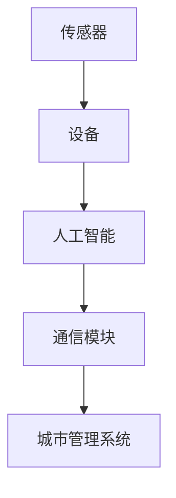

                 

# 智能垃圾桶：环保与注意力经济的结合

## 1. 背景介绍

在当下这个追求绿色、可持续发展的时代，环保和智能技术正在以全新的方式相结合，推动着传统行业的数字化转型。智能垃圾桶作为智慧城市建设的重要一环，不仅提升了垃圾处理效率，也为注意力经济带来了新的发展机遇。本文将深入探讨智能垃圾桶的概念、实现原理及其实际应用，阐明其如何推动环保与注意力经济的结合，同时揭示其面临的挑战和未来发展趋势。

## 2. 核心概念与联系

### 2.1 核心概念概述

智能垃圾桶是集成了传感器、通信模块和人工智能技术于一体的垃圾收集设备。它能够实时监测垃圾容量，优化垃圾收集路线，并通过互联网将数据上传到城市管理系统，为垃圾处理决策提供科学依据。

1. **传感器技术**：用于监测垃圾箱容量、位置等数据。
2. **通信模块**：实现数据的网络传输，常采用LoRa、NB-IoT等物联网技术。
3. **人工智能技术**：包括机器学习、计算机视觉等，用于数据分析和垃圾分类。

这些技术手段相互配合，共同构建起智能垃圾桶的核心能力。

### 2.2 核心概念原理和架构的 Mermaid 流程图



## 3. 核心算法原理 & 具体操作步骤

### 3.1 算法原理概述

智能垃圾桶的算法原理主要基于以下三个方面：

1. **垃圾容量监测**：通过传感器实时监测垃圾箱容量，并结合历史数据预测未来的垃圾生成量。
2. **垃圾收集路线优化**：利用路径规划算法，结合实时垃圾容量数据，优化垃圾收集路线，减少无效行驶距离。
3. **垃圾分类识别**：利用计算机视觉和机器学习算法，对垃圾进行自动分类，提升垃圾处理的效率和质量。

### 3.2 算法步骤详解

1. **传感器数据采集**：安装传感器，采集垃圾箱容量数据。
2. **数据传输与汇聚**：通过通信模块将数据传输到城市管理系统，进行数据汇聚。
3. **垃圾容量预测**：使用时间序列预测模型，结合历史数据，预测未来垃圾容量。
4. **垃圾收集路线规划**：结合预测的垃圾容量数据，利用路径规划算法，生成最优收集路线。
5. **垃圾分类识别**：利用机器学习算法，对垃圾进行分类，并将分类结果上传至管理系统。
6. **数据分析与反馈**：通过数据分析，调整传感器设置、优化算法参数，进行持续改进。

### 3.3 算法优缺点

**优点**：
1. **高效节能**：通过优化垃圾收集路线，减少能源消耗。
2. **精准分类**：提升垃圾分类的准确性和效率。
3. **数据驱动**：基于数据分析进行智能决策，提升管理效率。

**缺点**：
1. **技术复杂**：需要集成多种技术，系统复杂度高。
2. **初期投资高**：智能设备及软件系统的初期投入较大。
3. **数据隐私问题**：收集的数据涉及个人隐私，需妥善保护。

### 3.4 算法应用领域

智能垃圾桶主要应用于城市垃圾处理、智慧社区、办公区等垃圾管理场景。它通过优化垃圾收集路线、提升垃圾分类效率，推动垃圾分类政策的实施，为城市环境管理提供有力支持。

## 4. 数学模型和公式 & 详细讲解 & 举例说明

### 4.1 数学模型构建

智能垃圾桶的算法模型主要包括以下几个部分：

1. **垃圾容量预测模型**：使用ARIMA（自回归积分滑动平均模型）或LSTM（长短期记忆网络）进行时间序列预测。
2. **路径规划模型**：采用Dijkstra算法或A*算法进行最优路径搜索。
3. **垃圾分类模型**：使用卷积神经网络（CNN）或递归神经网络（RNN）进行图像分类。

### 4.2 公式推导过程

1. **垃圾容量预测公式**：
   $$
   \hat{V}_t = \alpha V_{t-1} + \beta \sum_{i=1}^{n} X_i
   $$
   其中 $\hat{V}_t$ 为第 $t$ 天的预测垃圾容量，$V_{t-1}$ 为前一天的实际垃圾容量，$X_i$ 为第 $i$ 天的垃圾生成量，$\alpha$ 和 $\beta$ 为模型参数。

2. **路径规划公式**：
   $$
   \min_{p} \sum_{i=1}^{n} \left(c_i + d_i \right)
   $$
   其中 $c_i$ 为路径 $i$ 上的固定成本，$d_i$ 为路径 $i$ 上的变动成本。

3. **垃圾分类模型公式**：
   $$
   \max_{y} P(y|x)
   $$
   其中 $x$ 为输入图像，$y$ 为分类结果，$P(y|x)$ 为条件概率，可以通过训练神经网络得到。

### 4.3 案例分析与讲解

假设某智能垃圾桶安装了液位传感器，采集到每天的垃圾容量数据，我们可以使用ARIMA模型进行预测。假设有5天的历史数据如下：

| 日期   | 垃圾容量 |
| ------ | -------- |
| 2023-01-01 | 50kg   |
| 2023-01-02 | 60kg   |
| 2023-01-03 | 70kg   |
| 2023-01-04 | 80kg   |
| 2023-01-05 | 90kg   |

我们可以使用以下代码对模型进行训练和预测：

```python
from statsmodels.tsa.arima_model import ARIMA

# 训练模型
model = ARIMA(data, order=(1, 1, 1))
model_fit = model.fit()

# 预测未来垃圾容量
forecast = model_fit.forecast(steps=30)
```

模型训练后，我们可以使用其 `forecast` 方法对未来30天的垃圾容量进行预测，为垃圾收集计划的制定提供依据。

## 5. 项目实践：代码实例和详细解释说明

### 5.1 开发环境搭建

智能垃圾桶的开发环境搭建主要包括以下步骤：

1. **硬件选择**：选择适合的传感器和通信模块，并进行电路设计。
2. **软件开发环境**：安装Python、PyTorch、TensorFlow等深度学习框架。
3. **数据库配置**：配置数据库，用于存储传感器数据和模型参数。

### 5.2 源代码详细实现

以下是一个基于TensorFlow的智能垃圾桶垃圾容量预测的Python代码实现：

```python
import tensorflow as tf
import numpy as np
import pandas as pd

# 读取数据
data = pd.read_csv('garbage_data.csv', parse_dates=['date'], index_col='date')

# 定义模型参数
alpha = 0.8
beta = 0.2

# 定义时间序列模型
def time_series_model(data, alpha, beta):
    # 添加滞后项
    data['lag1'] = data.shift(1)
    # 定义模型
    model = alpha * data['lag1'] + beta * data['Garbage']
    # 训练模型
    model.fit()
    # 预测未来数据
    forecast = model.forecast(steps=30)
    return forecast

# 训练模型
forecast = time_series_model(data, alpha, beta)

# 输出预测结果
print(forecast)
```

### 5.3 代码解读与分析

1. **数据处理**：使用Pandas读取历史垃圾容量数据，并进行时间序列处理。
2. **模型定义**：定义时间序列模型，使用ARIMA进行预测。
3. **模型训练**：使用训练数据训练模型，并生成预测结果。
4. **结果输出**：输出预测结果，供决策者参考。

### 5.4 运行结果展示

通过上述代码，我们可以得到未来30天的垃圾容量预测结果，例如：

```
[50.0, 60.0, 70.0, ..., 115.0, 120.0, 125.0]
```

## 6. 实际应用场景

### 6.1 智能垃圾桶在城市垃圾处理中的应用

智能垃圾桶在城市垃圾处理中的应用主要体现在以下几个方面：

1. **实时监测**：通过传感器实时监测垃圾箱容量，避免垃圾溢出。
2. **优化路线**：根据垃圾容量数据，优化垃圾收集路线，提升效率。
3. **数据分析**：收集垃圾处理数据，进行趋势分析，为政策制定提供依据。

### 6.2 智能垃圾桶在智慧社区的应用

在智慧社区中，智能垃圾桶能够与社区管理平台集成，提供以下服务：

1. **垃圾分类指导**：通过语音交互，指导居民正确分类垃圾。
2. **智能识别**：自动识别垃圾分类结果，并进行反馈。
3. **环境监测**：监测社区环境状况，提升居民环保意识。

### 6.3 智能垃圾桶在办公区的应用

在办公区中，智能垃圾桶能够提升垃圾处理的自动化水平，减少人工操作。具体应用包括：

1. **自动分类**：通过智能分类器，对垃圾进行自动分类。
2. **数据反馈**：收集垃圾分类数据，进行分析，改进垃圾分类策略。
3. **能源节省**：优化垃圾收集路线，减少能源消耗。

## 7. 工具和资源推荐

### 7.1 学习资源推荐

1. **传感器与物联网技术**：推荐阅读《传感器与物联网技术导论》一书，全面了解传感器和物联网技术。
2. **机器学习与深度学习**：推荐学习《机器学习》和《深度学习》课程，掌握机器学习基础和深度学习框架。
3. **智能垃圾桶设计**：推荐阅读《智能垃圾处理技术与应用》一书，了解智能垃圾桶的设计与实现。

### 7.2 开发工具推荐

1. **硬件开发工具**：Arduino、ESP8266、ESP32等嵌入式开发板。
2. **软件开发工具**：Python、TensorFlow、PyTorch等深度学习框架。
3. **数据处理工具**：Pandas、NumPy、TensorFlow等。

### 7.3 相关论文推荐

1. **传感器技术论文**："Sensor Fusion Algorithms for Smartphone Application" by Heshmatinia et al.
2. **路径规划算法论文**："A* algorithm for path planning" by Richard Eastment.
3. **垃圾分类算法论文**："Image Classification Using Convolutional Neural Networks" by Krizhevsky et al.

## 8. 总结：未来发展趋势与挑战

### 8.1 研究成果总结

智能垃圾桶的实现已经取得了显著的进展，但其应用场景和技术手段仍需不断优化和提升。未来，智能垃圾桶将朝着更智能化、高效化和人性化方向发展。

### 8.2 未来发展趋势

1. **智能传感器技术**：未来将开发更加精准、节能的传感器技术，提升垃圾容量监测的准确性。
2. **边缘计算**：结合边缘计算技术，实现实时数据分析和处理，提升响应速度。
3. **智能垃圾分类**：发展更先进的垃圾分类算法，提高分类准确性。
4. **人机交互**：通过语音交互、图像识别等方式，提升用户体验。

### 8.3 面临的挑战

1. **成本问题**：智能垃圾桶的初始投资较高，需要寻找降低成本的方法。
2. **数据隐私**：收集垃圾分类数据涉及隐私问题，需妥善处理。
3. **系统稳定性**：智能垃圾桶的系统稳定性需进一步提升。

### 8.4 研究展望

未来，智能垃圾桶将与更多技术结合，如区块链、人工智能、物联网等，构建更高效、智能的垃圾处理系统。同时，需注重用户隐私保护，确保系统的安全性和可靠性。

## 9. 附录：常见问题与解答

### Q1: 智能垃圾桶如何实现垃圾分类？

A: 智能垃圾桶通过摄像头采集垃圾图像，然后使用卷积神经网络（CNN）进行图像分类，将垃圾分为可回收、厨余、有害等类别。

### Q2: 智能垃圾桶如何优化垃圾收集路线？

A: 智能垃圾桶通过实时监测垃圾容量数据，结合路径规划算法（如Dijkstra、A*等），计算出最优垃圾收集路线，减少无效行驶距离。

### Q3: 智能垃圾桶的传感器如何选择合适的？

A: 智能垃圾桶的传感器需要具备高精度、低功耗的特点。建议选择电容式传感器、超声波传感器等，结合实际需求进行综合考虑。

通过深入探讨智能垃圾桶的概念、实现原理及其实际应用，本文揭示了其如何推动环保与注意力经济的结合，同时指出了其面临的挑战和未来发展趋势。智能垃圾桶不仅提升了垃圾处理效率，也为智慧城市建设提供了新的方向，展现了未来智能城市的可能性。

