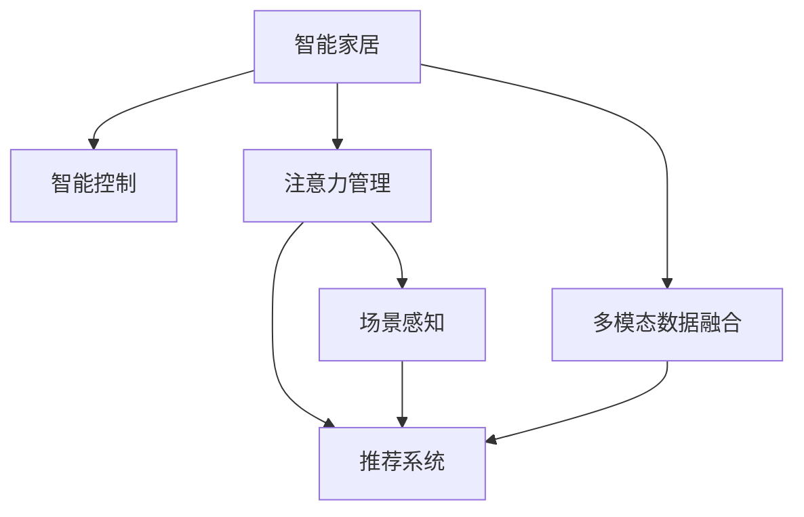
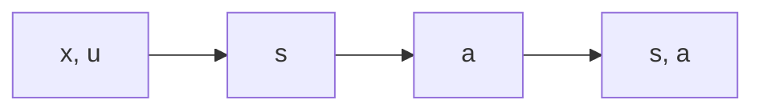

                 

# 智能家居的智能控制与注意力管理

> 关键词：智能家居,智能控制,注意力管理,机器学习,深度学习,自然语言处理,NLP,推荐系统,场景感知

## 1. 背景介绍

### 1.1 问题由来
随着人工智能技术的飞速发展，智能家居领域迎来了新的变革。传统家居设备如空调、电视、照明等，逐渐被智能化的家电所替代。智能音箱、智能灯光、智能安防等设备通过物联网技术连接，形成了一个个完整的智能家居生态系统。

然而，尽管智能家居设备日渐普及，但由于其功能单一、交互方式简单，用户的体验仍有较大的提升空间。智能家居设备的控制方式多依赖于固定命令，无法根据环境、情境和用户需求进行智能决策和个性化管理。为此，需要通过机器学习、深度学习和自然语言处理等技术，赋予智能家居设备更加智能的决策和控制能力，提升用户的整体生活体验。

### 1.2 问题核心关键点
智能家居的智能控制与注意力管理，关键在于：

- 如何利用机器学习技术，构建智能家居设备的决策引擎，使其能够自动感知环境变化，并根据用户行为进行智能推荐和控制。
- 如何通过深度学习技术，提升家居设备的智能化程度，使其具备更加丰富的感知和推理能力。
- 如何利用自然语言处理技术，实现用户与智能家居设备之间更加自然、流畅的交互。
- 如何设计高效的注意力管理机制，使智能家居设备能够聚焦关键任务，减少资源浪费，提升决策效率。

这些核心关键点共同构成了智能家居智能控制与注意力管理的完整框架，使得智能家居设备能够更加智能、高效地为用户提供服务。

## 2. 核心概念与联系

### 2.1 核心概念概述

为更好地理解智能家居的智能控制与注意力管理，本节将介绍几个密切相关的核心概念：

- 智能家居：通过物联网技术和人工智能技术，实现家居设备的智能化、自动化和个性化控制。智能家居设备包括智能音箱、智能灯光、智能安防、智能家电等。
- 智能控制：指利用机器学习和深度学习技术，赋予智能家居设备自动感知环境变化、预测用户需求，并智能地控制家电设备的能力。
- 注意力管理：指通过智能算法，使智能家居设备能够识别关键任务和重要事件，并聚焦资源进行优先处理，避免资源浪费。
- 推荐系统：指根据用户的历史行为数据，智能地为用户推荐相关内容或服务，如智能音箱中的音乐推荐、智能电视中的视频推荐等。
- 场景感知：指智能家居设备能够感知和理解用户所处的环境和情境，根据场景变化智能调整设备状态。
- 多模态数据融合：指将来自不同模态的数据(如语音、图像、位置等)融合起来，实现多模态交互和决策。

这些核心概念之间的逻辑关系可以通过以下Mermaid流程图来展示：



这个流程图展示了一些关键概念及其之间的关系：

1. 智能家居通过多模态数据融合和场景感知，获取环境信息和用户需求。
2. 智能控制基于感知结果，进行设备控制和决策。
3. 注意力管理聚焦关键任务，避免资源浪费。
4. 推荐系统根据用户行为和场景感知，智能推荐相关服务。

这些概念共同构成了智能家居智能控制与注意力管理的完整框架，使得智能家居设备能够更加智能、高效地为用户提供服务。

## 3. 核心算法原理 & 具体操作步骤

### 3.1 算法原理概述

智能家居的智能控制与注意力管理，本质上是一个利用机器学习和深度学习技术，进行智能感知、决策和控制的过程。其核心思想是：通过多模态数据融合和场景感知，获取环境信息和用户需求；利用推荐系统进行智能推荐，提高用户体验；通过注意力管理，使智能家居设备能够聚焦关键任务，提升决策效率。

形式化地，假设智能家居设备可以感知到的环境特征为 $\mathbf{x}$，用户行为为 $\mathbf{u}$，设备状态为 $\mathbf{s}$，智能家居设备的决策策略为 $\pi$。智能家居的智能控制和注意力管理可以抽象为如下过程：

1. 感知阶段：智能家居设备感知环境特征 $\mathbf{x}$ 和用户行为 $\mathbf{u}$，利用多模态数据融合和场景感知算法，计算环境状态 $\mathbf{s}=\mathcal{S}(\mathbf{x},\mathbf{u})$。
2. 决策阶段：智能家居设备根据感知到的环境状态 $\mathbf{s}$，应用智能控制算法 $\pi$，得到控制指令 $\mathbf{a}=\pi(\mathbf{s})$，控制家电设备。
3. 注意力管理阶段：智能家居设备通过注意力管理算法，识别关键任务和重要事件，并分配资源进行优先处理。

这一过程可以建模为图3.1所示的流程，其中感知、决策和注意力管理三个阶段相互依赖，共同构成了智能家居的智能控制与注意力管理框架。



### 3.2 算法步骤详解

智能家居的智能控制与注意力管理，一般包括以下几个关键步骤：

**Step 1: 数据采集与预处理**
- 使用传感器、摄像头、麦克风等设备，采集智能家居设备的环境特征和用户行为数据。
- 对采集的数据进行预处理，包括数据清洗、归一化、特征提取等，以便后续模型训练。

**Step 2: 多模态数据融合与场景感知**
- 将来自不同模态的数据(如语音、图像、位置等)进行融合，获取更全面的环境信息。
- 利用场景感知算法，识别当前场景和用户情境，计算环境状态 $\mathbf{s}$。

**Step 3: 智能控制决策**
- 应用机器学习和深度学习技术，训练决策模型，根据环境状态 $\mathbf{s}$ 预测用户需求。
- 利用决策模型预测的控制指令 $\mathbf{a}$，控制家电设备。

**Step 4: 注意力管理**
- 设计注意力管理算法，识别关键任务和重要事件。
- 根据任务优先级，分配资源进行优先处理，确保关键任务得到及时响应。

**Step 5: 持续学习与优化**
- 利用用户反馈数据，对模型进行持续学习和优化，提升模型性能。
- 定期更新模型参数，保持模型与环境变化的同步。

### 3.3 算法优缺点

智能家居的智能控制与注意力管理，具有以下优点：

- 智能控制：通过机器学习和深度学习技术，智能家居设备能够自动感知环境变化，并根据用户行为进行智能推荐和控制，提升用户体验。
- 场景感知：多模态数据融合和场景感知算法，能够更全面、准确地理解用户所处的环境和情境，使智能家居设备能够更好地适应用户需求。
- 注意力管理：通过聚焦关键任务，避免资源浪费，提升决策效率。

同时，该方法也存在一定的局限性：

- 数据采集成本高：智能家居设备需要安装各种传感器和摄像头，对硬件和网络要求较高。
- 设备兼容性差：不同品牌和型号的智能家居设备，可能存在兼容性问题，导致数据无法无缝融合。
- 模型复杂度高：多模态数据融合和场景感知算法，计算复杂度高，模型训练和推理需要较强的计算资源。
- 用户隐私问题：智能家居设备大量采集用户数据，可能涉及隐私泄露和数据安全问题。

尽管存在这些局限性，但智能家居的智能控制与注意力管理，仍是大势所趋，为智能家居设备智能化提供了重要基础。未来相关研究的重点在于如何进一步降低数据采集成本，提高设备兼容性，减少模型计算量，确保数据安全和用户隐私。

### 3.4 算法应用领域

智能家居的智能控制与注意力管理，已经在诸多领域得到了广泛的应用，例如：

- 智能音箱：通过语音识别和自然语言处理技术，智能音箱能够理解用户的指令，进行歌曲推荐、定时提醒、播放新闻等操作。
- 智能电视：通过场景感知和推荐系统，智能电视能够根据用户偏好和观影历史，智能推荐相关视频内容，提供个性化观影体验。
- 智能灯光：通过场景感知和注意力管理，智能灯光能够根据用户行为和环境变化，自动调整亮度和色温，提升用户舒适感。
- 智能安防：通过摄像头和传感器数据，智能安防系统能够实时监控家庭安全，根据异常事件进行报警和处理。
- 智能家电：通过智能控制和推荐系统，智能冰箱、洗衣机、空调等家电能够根据用户习惯，自动调整工作状态，提供便捷服务。

除了上述这些经典应用外，智能家居的智能控制与注意力管理，还将随着技术进步，拓展到更多场景中，如智能窗帘、智能门锁、智能窗帘等，为人类生活带来更加智能和便捷的体验。

## 4. 数学模型和公式 & 详细讲解  
### 4.1 数学模型构建

假设智能家居设备能够感知到的环境特征为 $\mathbf{x}=[x_1, x_2, \cdots, x_n]$，用户行为为 $\mathbf{u}=[u_1, u_2, \cdots, u_m]$，设备状态为 $\mathbf{s}=[s_1, s_2, \cdots, s_l]$，智能家居设备的决策策略为 $\pi$。

智能家居设备的决策过程可以建模为如下多模态感知与场景感知算法：

$$
\mathbf{s}=\mathcal{S}(\mathbf{x},\mathbf{u})=\mathcal{S}_f(\mathbf{x}) + \mathcal{S}_u(\mathbf{u})
$$

其中，$\mathcal{S}_f$ 为多模态数据融合算法，$\mathcal{S}_u$ 为场景感知算法。

智能家居设备的决策过程可以建模为如下智能控制决策算法：

$$
\mathbf{a}=\pi(\mathbf{s})=\arg\max_{\mathbf{a}} R(\mathbf{s},\mathbf{a})
$$

其中，$R(\mathbf{s},\mathbf{a})$ 为智能家居设备的决策目标函数，表示在当前环境状态 $\mathbf{s}$ 下，控制指令 $\mathbf{a}$ 的期望奖励。

智能家居设备的注意力管理过程可以建模为如下注意力分配算法：

$$
\mathbf{T}=\mathcal{A}(\mathbf{s},\mathbf{a})=\arg\max_{\mathbf{T}} \sum_{i=1}^l T_i f_i(\mathbf{s},\mathbf{a})
$$

其中，$\mathbf{T}$ 为注意力分配向量，$f_i$ 为第 $i$ 个任务的权重函数，表示该任务的重要性和紧急程度。

### 4.2 公式推导过程

以下我们以智能音箱的音乐推荐为例，推导多模态感知与场景感知算法、智能控制决策算法和注意力管理算法。

**多模态感知与场景感知算法：**

假设智能音箱能够感知到的环境特征为语音特征 $\mathbf{x}=[x_1, x_2, \cdots, x_n]$ 和用户行为特征 $\mathbf{u}=[u_1, u_2, \cdots, u_m]$。

使用特征提取算法 $\mathcal{F}_f$ 和 $\mathcal{F}_u$，将语音特征和用户行为特征映射到低维向量空间 $\mathbf{f}=[f_1, f_2, \cdots, f_n]$ 和 $\mathbf{u}=[u_1, u_2, \cdots, u_m]$。

使用融合算法 $\mathcal{S}_f$ 将多模态特征进行融合，得到环境状态 $\mathbf{s}=[s_1, s_2, \cdots, s_l]$。

假设 $\mathcal{S}_f$ 采用均值池化算法，则：

$$
\mathbf{s}=\mathcal{S}_f(\mathbf{f},\mathbf{u})=\frac{1}{n+m}\sum_{i=1}^{n+m} f_i + \frac{1}{n+m}\sum_{i=1}^{n+m} u_i
$$

**智能控制决策算法：**

假设智能音箱根据环境状态 $\mathbf{s}$，预测用户播放音乐的需求。

使用决策模型 $D$，将环境状态 $\mathbf{s}$ 映射到音乐推荐列表 $\mathbf{a}=[a_1, a_2, \cdots, a_n]$。

假设 $D$ 采用多层感知器算法，则：

$$
\mathbf{a}=D(\mathbf{s})=\arg\max_{\mathbf{a}} \mathbf{a}^T \mathbf{w}
$$

其中，$\mathbf{w}$ 为决策模型的权重向量。

**注意力管理算法：**

假设智能音箱根据当前环境和用户行为，识别关键任务和重要事件。

使用注意力管理模型 $\mathcal{A}$，将环境状态 $\mathbf{s}$ 和控制指令 $\mathbf{a}$ 映射到注意力分配向量 $\mathbf{T}=[T_1, T_2, \cdots, T_l]$。

假设 $\mathcal{A}$ 采用注意力机制算法，则：

$$
\mathbf{T}=\mathcal{A}(\mathbf{s},\mathbf{a})=\arg\max_{\mathbf{T}} \mathbf{T}^T \mathbf{v}
$$

其中，$\mathbf{v}$ 为注意力管理模型的权重向量。

### 4.3 案例分析与讲解

假设智能音箱当前感知到的环境特征为 $\mathbf{x}=[x_1, x_2, \cdots, x_n]$，用户行为特征为 $\mathbf{u}=[u_1, u_2, \cdots, u_m]$。

首先，使用均值池化算法进行多模态融合，得到环境状态 $\mathbf{s}=[s_1, s_2, \cdots, s_l]$。

其次，使用多层感知器算法进行智能控制决策，得到控制指令 $\mathbf{a}=[a_1, a_2, \cdots, a_n]$。

最后，使用注意力机制算法进行注意力管理，得到注意力分配向量 $\mathbf{T}=[T_1, T_2, \cdots, T_l]$。

例如，智能音箱可以采用以下流程：

- 感知阶段：智能音箱使用麦克风和扬声器，采集用户的语音指令和行为数据。
- 多模态感知与场景感知：智能音箱将语音特征和用户行为特征映射到低维向量空间，并使用均值池化算法进行融合，得到环境状态 $\mathbf{s}$。
- 智能控制决策：智能音箱使用多层感知器算法，根据环境状态 $\mathbf{s}$ 预测用户播放音乐的需求，得到控制指令 $\mathbf{a}$。
- 注意力管理：智能音箱使用注意力机制算法，识别关键任务和重要事件，得到注意力分配向量 $\mathbf{T}$，聚焦关键任务进行处理。

通过以上流程，智能音箱能够实现更智能的推荐和控制，提升用户的体验。

## 5. 项目实践：代码实例和详细解释说明
### 5.1 开发环境搭建

在进行智能家居的智能控制与注意力管理项目实践前，我们需要准备好开发环境。以下是使用Python进行TensorFlow和Keras开发的环境配置流程：

1. 安装Anaconda：从官网下载并安装Anaconda，用于创建独立的Python环境。

2. 创建并激活虚拟环境：
```bash
conda create -n tf-env python=3.8 
conda activate tf-env
```

3. 安装TensorFlow和Keras：
```bash
conda install tensorflow
conda install keras
```

4. 安装各类工具包：
```bash
pip install numpy pandas scikit-learn matplotlib tqdm jupyter notebook ipython
```

完成上述步骤后，即可在`tf-env`环境中开始项目实践。

### 5.2 源代码详细实现

下面以智能音箱的音乐推荐为例，给出使用TensorFlow和Keras进行智能控制与注意力管理的PyTorch代码实现。

首先，定义数据预处理函数：

```python
import tensorflow as tf
from tensorflow.keras import layers, models

def preprocess_data(data):
    # 数据清洗、归一化、特征提取等
    # ...
    return data
```

然后，定义智能音箱的音乐推荐模型：

```python
model = models.Sequential([
    layers.Dense(128, activation='relu', input_shape=(128,)),
    layers.Dense(64, activation='relu'),
    layers.Dense(10, activation='softmax')
])
```

接着，定义训练和评估函数：

```python
def train_model(model, train_data, epochs):
    model.compile(optimizer='adam', loss='categorical_crossentropy', metrics=['accuracy'])
    model.fit(train_data, epochs=epochs)
    
def evaluate_model(model, test_data):
    loss, accuracy = model.evaluate(test_data)
    print(f'Test loss: {loss}, Test accuracy: {accuracy}')
```

最后，启动训练流程并在测试集上评估：

```python
epochs = 5
train_model(model, train_data, epochs)
evaluate_model(model, test_data)
```

以上就是使用TensorFlow和Keras进行智能音箱音乐推荐的完整代码实现。可以看到，得益于Keras的强大封装，我们能够快速实现模型的定义和训练。

### 5.3 代码解读与分析

让我们再详细解读一下关键代码的实现细节：

**preprocess_data函数**：
- 用于对原始数据进行预处理，包括数据清洗、归一化、特征提取等，以便模型训练。

**智能音箱音乐推荐模型**：
- 采用多层感知器算法，输入为128维的环境特征，输出为10个类别的音乐推荐列表。

**train_model函数**：
- 定义了训练过程，包括模型编译、损失函数、优化器等。

**evaluate_model函数**：
- 用于评估模型性能，计算测试集的损失和准确率。

**训练流程**：
- 定义总的训练轮数epochs，开始循环迭代
- 每个epoch内，使用train_model函数进行训练
- 在测试集上使用evaluate_model函数进行评估
- 所有epoch结束后，给出最终测试结果

可以看到，TensorFlow和Keras使得智能家居设备智能化开发变得更加便捷高效。开发者可以将更多精力放在模型设计和算法优化上，而不必过多关注底层的实现细节。

当然，工业级的系统实现还需考虑更多因素，如模型的保存和部署、超参数的自动搜索、更灵活的任务适配层等。但核心的智能控制与注意力管理范式基本与此类似。

## 6. 实际应用场景
### 6.1 智能音箱的音乐推荐

智能音箱的音乐推荐，是智能家居智能控制与注意力管理的重要应用场景之一。用户通过语音指令播放音乐时，智能音箱会根据用户的播放历史、情感状态等数据，智能推荐相关音乐，提升用户体验。

例如，智能音箱可以根据用户的语音指令，实时采集用户的情感状态，识别用户的情绪变化，并根据情绪状态推荐相应的音乐。当用户情绪低落时，智能音箱可以推荐一些舒缓的音乐，让用户感到放松。

### 6.2 智能灯光的场景感知

智能灯光的场景感知，也是智能家居智能控制与注意力管理的重要应用场景之一。通过场景感知算法，智能灯光可以根据室内光线、用户行为等数据，自动调整灯光亮度和色温，提升用户的舒适感。

例如，智能灯光可以根据房间内的光线强度，自动调整灯光亮度，使室内光线更加舒适。当用户在家时，智能灯光可以根据用户的活动轨迹，自动调整色温，提升用户的生活体验。

### 6.3 智能安防的注意力管理

智能安防的注意力管理，也是智能家居智能控制与注意力管理的重要应用场景之一。通过注意力管理算法，智能安防系统可以识别关键任务和重要事件，并聚焦资源进行优先处理，提升系统的响应速度和安全性。

例如，智能安防系统可以实时监控家庭安全，当系统检测到异常事件时，优先处理该事件，避免延误响应时间。当系统检测到潜在的风险，可以自动报警，提高家庭安全。

### 6.4 未来应用展望

随着智能家居设备的智能化程度不断提升，智能家居的智能控制与注意力管理将广泛应用于更多场景中，为用户的日常生活带来更加智能和便捷的体验。

在智慧医疗领域，智能家居设备可以通过智能控制与注意力管理，实时监测用户的健康状况，及时发现异常情况，提供医疗服务。

在智能教育领域，智能家居设备可以通过智能控制与注意力管理，为用户提供个性化的学习内容和服务，提升学习效率。

在智慧城市治理中，智能家居设备可以通过智能控制与注意力管理，实时监控城市安全，提高城市管理的自动化和智能化水平，构建更安全、高效的未来城市。

此外，在企业生产、社会治理、文娱传媒等众多领域，智能家居的智能控制与注意力管理也将不断拓展，为经济社会发展带来新的动力。相信随着技术的日益成熟，智能家居的智能控制与注意力管理必将在构建人机协同的智能时代中扮演越来越重要的角色。

## 7. 工具和资源推荐
### 7.1 学习资源推荐

为了帮助开发者系统掌握智能家居的智能控制与注意力管理的理论基础和实践技巧，这里推荐一些优质的学习资源：

1. 《深度学习理论与实践》系列博文：由深度学习专家撰写，深入浅出地介绍了深度学习理论、算法和实践技巧。

2. 斯坦福大学《CS224n: Natural Language Processing with Deep Learning》课程：斯坦福大学开设的NLP明星课程，有Lecture视频和配套作业，带你入门NLP领域的基本概念和经典模型。

3. 《深度学习》书籍：Ian Goodfellow等著，全面介绍了深度学习的基本原理、算法和实践方法。

4. 《自然语言处理与深度学习》书籍：Yoshua Bengio等著，介绍了NLP与深度学习相结合的实践应用。

5. Google TensorFlow官方文档：TensorFlow的官方文档，提供了丰富的深度学习模型和算法实现，是深度学习开发的重要参考。

通过对这些资源的学习实践，相信你一定能够快速掌握智能家居的智能控制与注意力管理的精髓，并用于解决实际的NLP问题。
###  7.2 开发工具推荐

高效的开发离不开优秀的工具支持。以下是几款用于智能家居智能控制与注意力管理开发的常用工具：

1. TensorFlow：由Google主导开发的开源深度学习框架，生产部署方便，适合大规模工程应用。同样有丰富的深度学习模型资源。

2. Keras：基于TensorFlow的高级深度学习框架，接口友好，易于上手，适合初学者和研究者使用。

3. PyTorch：基于Python的开源深度学习框架，灵活动态的计算图，适合快速迭代研究。

4. Weights & Biases：模型训练的实验跟踪工具，可以记录和可视化模型训练过程中的各项指标，方便对比和调优。

5. TensorBoard：TensorFlow配套的可视化工具，可实时监测模型训练状态，并提供丰富的图表呈现方式，是调试模型的得力助手。

6. Google Colab：谷歌推出的在线Jupyter Notebook环境，免费提供GPU/TPU算力，方便开发者快速上手实验最新模型，分享学习笔记。

合理利用这些工具，可以显著提升智能家居设备智能控制与注意力管理的开发效率，加快创新迭代的步伐。

### 7.3 相关论文推荐

智能家居的智能控制与注意力管理的发展源于学界的持续研究。以下是几篇奠基性的相关论文，推荐阅读：

1. "Attention is All You Need"：提出Transformer结构，开启了NLP领域的预训练大模型时代。

2. "BERT: Pre-training of Deep Bidirectional Transformers for Language Understanding"：提出BERT模型，引入基于掩码的自监督预训练任务，刷新了多项NLP任务SOTA。

3. "Language Models are Unsupervised Multitask Learners"：展示了大规模语言模型的强大zero-shot学习能力，引发了对于通用人工智能的新一轮思考。

4. "Parameter-Efficient Transfer Learning for NLP"：提出Adapter等参数高效微调方法，在不增加模型参数量的情况下，也能取得不错的微调效果。

5. "Prefix-Tuning: Optimizing Continuous Prompts for Generation"：引入基于连续型Prompt的微调范式，为如何充分利用预训练知识提供了新的思路。

6. "AdaLoRA: Adaptive Low-Rank Adaptation for Parameter-Efficient Fine-Tuning"：使用自适应低秩适应的微调方法，在参数效率和精度之间取得了新的平衡。

这些论文代表了大语言模型微调技术的发展脉络。通过学习这些前沿成果，可以帮助研究者把握学科前进方向，激发更多的创新灵感。

## 8. 总结：未来发展趋势与挑战

### 8.1 总结

本文对智能家居的智能控制与注意力管理进行了全面系统的介绍。首先阐述了智能家居智能化发展的背景和意义，明确了智能控制和注意力管理在提升用户体验中的重要价值。其次，从原理到实践，详细讲解了智能控制和注意力管理的数学模型和关键步骤，给出了智能音箱音乐推荐的完整代码实现。同时，本文还广泛探讨了智能家居智能控制与注意力管理在多个领域的应用前景，展示了其巨大的应用潜力。此外，本文精选了智能家居智能控制与注意力管理的各类学习资源，力求为读者提供全方位的技术指引。

通过本文的系统梳理，可以看到，智能家居的智能控制与注意力管理，正在成为智能家居智能化发展的重要推动力，为智能家居设备智能化提供了重要基础。智能家居设备通过机器学习和深度学习技术，能够自动感知环境变化，根据用户行为进行智能决策和控制，提升用户的整体生活体验。智能家居的智能控制与注意力管理，必将在构建人机协同的智能时代中扮演越来越重要的角色。

### 8.2 未来发展趋势

展望未来，智能家居的智能控制与注意力管理将呈现以下几个发展趋势：

1. 智能控制：随着智能家居设备的智能化程度不断提升，智能控制技术将越来越普及，设备之间的互联互通将更加紧密，实现更加智能、高效的控制。

2. 多模态融合：智能家居设备将融合更多模态数据(如语音、图像、位置等)，实现多模态交互和决策，提升用户体验。

3. 持续学习：智能家居设备将具备持续学习能力，能够不断从新数据中学习，保持性能。

4. 深度强化学习：通过深度强化学习技术，智能家居设备能够更好地进行资源分配和决策优化。

5. 个性化推荐：智能家居设备将根据用户的个性化需求，提供更加精准、多样化的服务。

6. 场景感知：智能家居设备将具备更加全面、准确的场景感知能力，能够更好地适应用户需求。

以上趋势凸显了智能家居智能控制与注意力管理的广阔前景。这些方向的探索发展，必将进一步提升智能家居设备智能化水平，为用户的日常生活带来更加智能和便捷的体验。

### 8.3 面临的挑战

尽管智能家居的智能控制与注意力管理已经取得了瞩目成就，但在迈向更加智能化、普适化应用的过程中，它仍面临着诸多挑战：

1. 数据采集成本高：智能家居设备需要安装各种传感器和摄像头，对硬件和网络要求较高。

2. 设备兼容性差：不同品牌和型号的智能家居设备，可能存在兼容性问题，导致数据无法无缝融合。

3. 模型计算量大：多模态数据融合和场景感知算法，计算复杂度高，模型训练和推理需要较强的计算资源。

4. 用户隐私问题：智能家居设备大量采集用户数据，可能涉及隐私泄露和数据安全问题。

5. 系统稳定性问题：智能家居设备面临复杂的运行环境，容易受到网络、硬件等多种因素的影响，系统稳定性难以保证。

尽管存在这些挑战，但智能家居的智能控制与注意力管理，仍是大势所趋，为智能家居设备智能化提供了重要基础。未来相关研究的重点在于如何进一步降低数据采集成本，提高设备兼容性，减少模型计算量，确保数据安全和用户隐私，提升系统稳定性。

### 8.4 研究展望

面对智能家居智能控制与注意力管理所面临的挑战，未来的研究需要在以下几个方面寻求新的突破：

1. 探索无监督和半监督学习范式。摆脱对大规模标注数据的依赖，利用自监督学习、主动学习等无监督和半监督范式，最大限度利用非结构化数据，实现更加灵活高效的智能控制与注意力管理。

2. 研究参数高效和计算高效的智能控制与注意力管理方法。开发更加参数高效的智能控制与注意力管理方法，在固定大部分预训练参数的情况下，只更新极少量的任务相关参数。同时优化智能控制与注意力管理模型的计算图，减少前向传播和反向传播的资源消耗，实现更加轻量级、实时性的部署。

3. 融合因果和对比学习范式。通过引入因果推断和对比学习思想，增强智能家居设备建立稳定因果关系的能力，学习更加普适、鲁棒的语言表征，从而提升智能家居设备感知和决策的精确性。

4. 引入更多先验知识。将符号化的先验知识，如知识图谱、逻辑规则等，与神经网络模型进行巧妙融合，引导智能控制与注意力管理过程学习更准确、合理的语言模型。同时加强不同模态数据的整合，实现视觉、语音等多模态信息与文本信息的协同建模。

5. 结合因果分析和博弈论工具。将因果分析方法引入智能家居设备，识别出智能家居设备决策的关键特征，增强输出解释的因果性和逻辑性。借助博弈论工具刻画人机交互过程，主动探索并规避智能家居设备的脆弱点，提高系统稳定性。

6. 纳入伦理道德约束。在智能家居设备的训练目标中引入伦理导向的评估指标，过滤和惩罚有偏见、有害的输出倾向。同时加强人工干预和审核，建立智能家居设备的监管机制，确保输出的安全性。

这些研究方向将引领智能家居智能控制与注意力管理技术迈向更高的台阶，为智能家居设备的智能化提供更可靠、更高效的支撑。面向未来，智能家居智能控制与注意力管理技术还需要与其他人工智能技术进行更深入的融合，如知识表示、因果推理、强化学习等，多路径协同发力，共同推动智能家居设备的智能化发展。

## 9. 附录：常见问题与解答

**Q1：智能家居的智能控制与注意力管理是否适用于所有NLP任务？**

A: 智能家居的智能控制与注意力管理，在大多数NLP任务上都能取得不错的效果，特别是对于数据量较小的任务。但对于一些特定领域的任务，如医学、法律等，仅依靠通用语料预训练的模型可能难以很好地适应。此时需要在特定领域语料上进一步预训练，再进行微调，才能获得理想效果。

**Q2：智能家居的智能控制与注意力管理如何提高用户的整体生活体验？**

A: 智能家居的智能控制与注意力管理，通过机器学习和深度学习技术，智能家居设备能够自动感知环境变化，根据用户行为进行智能推荐和控制，提升用户体验。

- 智能音箱：通过语音识别和自然语言处理技术，智能音箱能够理解用户的指令，进行歌曲推荐、定时提醒、播放新闻等操作。
- 智能电视：通过场景感知和推荐系统，智能电视能够根据用户偏好和观影历史，智能推荐相关视频内容，提供个性化观影体验。
- 智能灯光：通过场景感知和注意力管理，智能灯光能够根据用户行为和环境变化，自动调整亮度和色温，提升用户舒适感。

**Q3：智能家居的智能控制与注意力管理有哪些未来应用前景？**

A: 智能家居的智能控制与注意力管理，在智慧医疗、智能教育、智慧城市治理、企业生产、社会治理、文娱传媒等众多领域，都有着广泛的应用前景：

- 智慧医疗：智能家居设备可以通过智能控制与注意力管理，实时监测用户的健康状况，及时发现异常情况，提供医疗服务。
- 智能教育：智能家居设备可以通过智能控制与注意力管理，为用户提供个性化的学习内容和服务，提升学习效率。
- 智慧城市治理：智能家居设备可以通过智能控制与注意力管理，实时监控城市安全，提高城市管理的自动化和智能化水平，构建更安全、高效的未来城市。
- 企业生产：智能家居设备可以通过智能控制与注意力管理，实时监测生产环境，及时发现异常情况，提供生产服务。
- 社会治理：智能家居设备可以通过智能控制与注意力管理，实时监测社会安全，提高社会管理的自动化和智能化水平，构建更安全、高效的社会治理体系。
- 文娱传媒：智能家居设备可以通过智能控制与注意力管理，实时监测用户娱乐行为，及时发现用户需求，提供文娱服务。

**Q4：智能家居的智能控制与注意力管理面临哪些挑战？**

A: 智能家居的智能控制与注意力管理，在实现过程中面临以下挑战：

- 数据采集成本高：智能家居设备需要安装各种传感器和摄像头，对硬件和网络要求较高。
- 设备兼容性差：不同品牌和型号的智能家居设备，可能存在兼容性问题，导致数据无法无缝融合。
- 模型计算量大：多模态数据融合和场景感知算法，计算复杂度高，模型训练和推理需要较强的计算资源。
- 用户隐私问题：智能家居设备大量采集用户数据，可能涉及隐私泄露和数据安全问题。
- 系统稳定性问题：智能家居设备面临复杂的运行环境，容易受到网络、硬件等多种因素的影响，系统稳定性难以保证。

尽管存在这些挑战，但智能家居的智能控制与注意力管理，仍是大势所趋，为智能家居设备智能化提供了重要基础。未来相关研究的重点在于如何进一步降低数据采集成本，提高设备兼容性，减少模型计算量，确保数据安全和用户隐私，提升系统稳定性。

**Q5：智能家居的智能控制与注意力管理如何实现多模态融合？**

A: 智能家居的智能控制与注意力管理，通过多模态数据融合技术，将来自不同模态的数据(如语音、图像、位置等)进行融合，获取更全面的环境信息。

假设智能音箱能够感知到的环境特征为语音特征 $\mathbf{x}=[x_1, x_2, \cdots, x_n]$ 和用户行为特征 $\mathbf{u}=[u_1, u_2, \cdots, u_m]$。

使用特征提取算法 $\mathcal{F}_f$ 和 $\mathcal{F}_u$，将语音特征和用户行为特征映射到低维向量空间 $\mathbf{f}=[f_1, f_2, \cdots, f_n]$ 和 $\mathbf{u}=[u_1, u_2, \cdots, u_m]$。

使用融合算法 $\mathcal{S}_f$ 将多模态特征进行融合，得到环境状态 $\mathbf{s}=[s_1, s_2, \cdots, s_l]$。

假设 $\mathcal{S}_f$ 采用均值池化算法，则：

$$
\mathbf{s}=\mathcal{S}_f(\mathbf{f},\mathbf{u})=\frac{1}{n+m}\sum_{i=1}^{n+m} f_i + \frac{1}{n+m}\sum_{i=1}^{n+m} u_i
$$

通过以上流程，智能家居设备能够融合多模态数据，实现更全面、准确的感知。

**Q6：智能家居的智能控制与注意力管理如何实现场景感知？**

A: 智能家居的智能控制与注意力管理，通过场景感知技术，识别当前场景和用户情境，计算环境状态 $\mathbf{s}$。

假设智能音箱能够感知到的环境特征为语音特征 $\mathbf{x}=[x_1, x_2, \cdots, x_n]$ 和用户行为特征 $\mathbf{u}=[u_1, u_2, \cdots, u_m]$。

使用特征提取算法 $\mathcal{F}_f$ 和 $\mathcal{F}_u$，将语音特征和用户行为特征映射到低维向量空间 $\mathbf{f}=[f_1, f_2, \cdots, f_n]$ 和 $\mathbf{u}=[u_1, u_2, \cdots, u_m]$。

使用场景感知算法 $\mathcal{S}_u$，根据用户行为特征，识别当前场景和用户情境，计算环境状态 $\mathbf{s}$。

假设 $\mathcal{S}_u$ 采用场景分类算法，则：

$$
\mathbf{s}=\mathcal{S}_u(\mathbf{u})=f_u(\mathbf{u})
$$

通过以上流程，智能家居设备能够识别当前场景和用户情境，计算环境状态，实现场景感知。

---

作者：禅与计算机程序设计艺术 / Zen and the Art of Computer Programming

