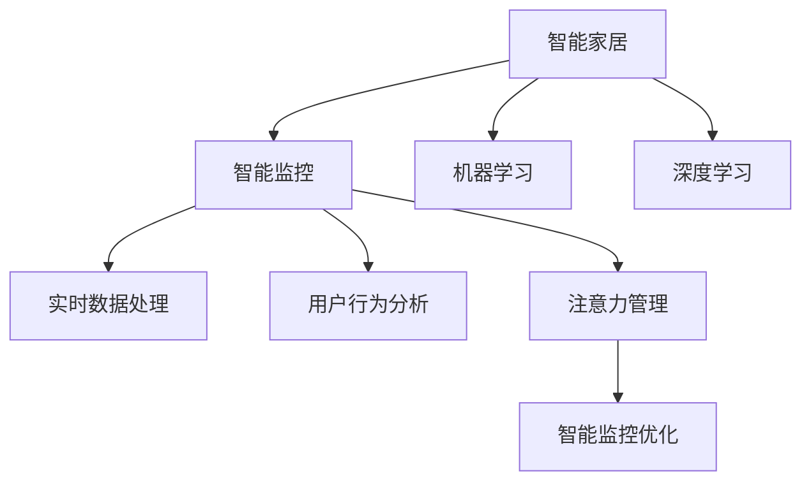

                 

# 智能家居的智能监控与注意力管理

> 关键词：智能监控, 注意力管理, 物联网(IoT), 机器学习, 深度学习, 实时数据处理, 用户行为分析

## 1. 背景介绍

### 1.1 问题由来
随着物联网技术的发展，智能家居设备日益增多，家庭环境日益复杂。如何利用技术手段提升家庭安全，保障家庭成员的舒适和健康，已成为现代社会的重要课题。传统的家庭监控系统大多采用图像识别和声纹识别技术，但由于硬件成本高，数据处理能力有限，难以实现全面、实时的监控和分析。

本文旨在探讨基于深度学习的大规模智能家居监控系统，以及如何通过注意力管理机制优化系统性能。我们将从系统架构、核心算法、实际应用场景三个方面进行全面分析，以期为智能家居领域的监控与分析技术提供新的解决方案。

## 2. 核心概念与联系

### 2.1 核心概念概述

为更好地理解智能家居的智能监控与注意力管理技术，本节将介绍几个密切相关的核心概念：

- 智能家居(Smart Home)：通过物联网技术将家居设备互联，实现对家庭环境的智能感知、控制和管理。智能家居系统一般包括智能安防、智能照明、智能温控等多个子系统。

- 智能监控(Smart Surveillance)：通过摄像头、传感器等设备采集家庭环境数据，利用深度学习技术进行实时分析，识别异常行为或事件。智能监控系统能够提升家庭安全性和舒适性。

- 机器学习(Machine Learning)：一类使用算法构建模型的技术，通过数据训练学习规律，从而实现预测、分类、聚类等任务。机器学习在智能监控中的应用，包括行为识别、异常检测等。

- 深度学习(Deep Learning)：机器学习的一种高级形式，通过神经网络结构实现多层次的数据特征提取与学习。深度学习在智能监控中的应用，如目标检测、视频分析等。

- 实时数据处理(Real-time Data Processing)：对实时采集的数据进行高效处理，快速响应环境变化。实时数据处理技术包括流式处理、事件驱动等。

- 用户行为分析(User Behavior Analysis)：通过对用户的行为数据进行统计分析，识别用户的兴趣、习惯、需求等，实现个性化推荐、预警等。

- 注意力管理(Attention Management)：一种优化资源利用效率的技术，通过调整系统关注点，提升系统性能。在智能监控中，注意力管理可用于优化设备感知范围、数据处理优先级等。

这些核心概念之间的逻辑关系可以通过以下Mermaid流程图来展示：



这个流程图展示了一些核心概念的相互关系，包括智能家居系统的构成、智能监控的核心技术，以及注意力管理如何优化智能监控系统。

## 3. 核心算法原理 & 具体操作步骤

### 3.1 算法原理概述

智能家居的智能监控与注意力管理技术，通过深度学习技术实时分析家庭环境数据，识别异常行为或事件。同时，通过注意力管理机制优化系统性能，提升数据处理效率和设备利用率。

### 3.2 算法步骤详解

智能家居监控系统的核心算法主要包括以下几个步骤：

**Step 1: 数据采集与预处理**
- 通过摄像头、传感器等设备，实时采集家庭环境数据。
- 对采集到的数据进行去噪、归一化、特征提取等预处理操作。

**Step 2: 深度学习模型训练**
- 使用深度学习模型（如CNN、RNN、LSTM等）对预处理后的数据进行训练，学习环境特征和行为模式。
- 对训练好的模型进行验证和优化，以确保其准确性和鲁棒性。

**Step 3: 实时数据处理**
- 将实时采集到的家庭环境数据输入训练好的深度学习模型，进行实时分析。
- 使用流式处理、事件驱动等技术，确保数据处理的实时性和稳定性。

**Step 4: 用户行为分析**
- 对用户的行为数据进行统计分析，识别用户的兴趣、习惯、需求等。
- 利用聚类、分类等算法，对用户行为进行建模，实现个性化推荐和预警。

**Step 5: 注意力管理优化**
- 根据系统负载、环境变化等因素，动态调整系统关注点，优化资源利用效率。
- 利用注意力机制对感知范围、数据处理优先级等进行调整，提升系统性能。

**Step 6: 异常检测与处理**
- 对实时分析结果进行异常检测，识别异常行为或事件。
- 对异常行为进行警报和处理，保障家庭成员安全。

### 3.3 算法优缺点

智能家居监控与注意力管理算法具有以下优点：
1. 实时性强：通过深度学习模型进行实时分析，能够快速响应环境变化，提升监控效果。
2. 鲁棒性好：通过大量数据训练，深度学习模型具备较强的鲁棒性，能够在不同环境下稳定运行。
3. 个性化推荐：用户行为分析能够实现个性化推荐，提升用户满意度。
4. 资源优化：注意力管理机制能够优化资源利用，提升系统性能。

同时，该算法也存在一些局限性：
1. 硬件依赖高：深度学习模型需要高性能的计算资源，硬件成本较高。
2. 数据质量要求高：深度学习模型对数据质量要求高，数据缺失或噪声可能影响模型效果。
3. 数据隐私问题：智能监控涉及家庭成员的隐私，如何保护数据隐私是一个重要问题。
4. 模型泛化能力有限：深度学习模型依赖于特定场景的数据，泛化能力可能受限。

尽管存在这些局限性，但就目前而言，智能家居监控与注意力管理算法仍是大规模智能家居监控系统的核心技术之一，具有良好的应用前景。

### 3.4 算法应用领域

智能家居监控与注意力管理技术在多个领域均有广泛应用：

- 智能安防：通过摄像头、传感器等设备实时监控家庭环境，识别异常行为或事件，保障家庭成员安全。
- 智能照明：通过深度学习模型分析环境光线情况，动态调整照明亮度和色彩，提升居住舒适度。
- 智能温控：通过传感器实时监测环境温度，动态调整空调、暖气等设备，实现节能减排。
- 健康监测：通过传感器实时监测家庭成员的健康数据，如心率、呼吸等，提供健康预警和建议。
- 能源管理：通过传感器实时监测家庭能源使用情况，优化能源分配，实现节能环保。

除了上述这些应用外，智能家居监控与注意力管理技术还可应用于智能家电、智能家居交互等多个方面，为智慧生活提供更多可能。

## 4. 数学模型和公式 & 详细讲解 & 举例说明

### 4.1 数学模型构建

假设智能家居监控系统采集到的实时环境数据为 $x \in \mathbb{R}^n$，通过深度学习模型 $M_{\theta}$ 进行训练和预测，其中 $\theta$ 为模型参数。模型训练的目标是最小化损失函数 $\mathcal{L}$，以提高模型预测的准确性。

定义模型在输入 $x$ 上的损失函数为 $\ell(M_{\theta}(x),y)$，则模型的总体损失函数为：

$$
\mathcal{L}(\theta) = \frac{1}{N}\sum_{i=1}^N \ell(M_{\theta}(x_i),y_i)
$$

其中 $N$ 为训练样本数量，$(x_i,y_i)$ 为第 $i$ 个样本的输入和标签。

### 4.2 公式推导过程

以基于CNN的目标检测模型为例，推导其损失函数的计算公式。假设模型在输入 $x$ 上的输出为 $\hat{y} \in \mathbb{R}^C$，表示模型对每个类别的预测概率，其中 $C$ 为类别数。真实标签 $y \in \{1,0\}^C$。则交叉熵损失函数定义为：

$$
\ell(\hat{y},y) = -\sum_{i=1}^C y_i \log \hat{y}_i
$$

将其代入总体损失函数公式，得：

$$
\mathcal{L}(\theta) = -\frac{1}{N}\sum_{i=1}^N \sum_{j=1}^C y_{i,j} \log \hat{y}_{i,j}
$$

其中 $y_{i,j}$ 为第 $i$ 个样本在类别 $j$ 的标签。

### 4.3 案例分析与讲解

以智能安防系统为例，说明深度学习模型在智能家居监控中的应用。假设智能安防系统使用基于CNN的目标检测模型，对家庭监控摄像头采集到的视频数据进行实时分析。模型的训练数据为历史监控视频及其标注信息，标签为“有人”或“无人”。

首先，将监控视频划分为帧，对每帧图像进行预处理，如归一化、图像增强等操作。然后，将预处理后的图像输入训练好的CNN模型进行特征提取和分类。模型的输出为每个图像帧中每个区域的预测概率，表示该区域是否包含人。通过设定阈值，模型可以对整个视频帧进行分类，识别出人或无人事件。

实际应用中，系统可以根据检测结果触发报警器或发送通知，通知家庭成员或安保人员处理异常情况。通过定期更新模型参数，系统可以不断提升检测精度，保障家庭安全。

## 5. 项目实践：代码实例和详细解释说明

### 5.1 开发环境搭建

在进行智能家居监控系统开发前，我们需要准备好开发环境。以下是使用Python进行PyTorch开发的环境配置流程：

1. 安装Anaconda：从官网下载并安装Anaconda，用于创建独立的Python环境。

2. 创建并激活虚拟环境：
```bash
conda create -n pytorch-env python=3.8 
conda activate pytorch-env
```

3. 安装PyTorch：根据CUDA版本，从官网获取对应的安装命令。例如：
```bash
conda install pytorch torchvision torchaudio cudatoolkit=11.1 -c pytorch -c conda-forge
```

4. 安装OpenCV、Pillow、scikit-image等第三方库：
```bash
pip install opencv-python pillow scikit-image
```

5. 安装TensorBoard：用于可视化训练过程和模型性能。
```bash
pip install tensorboard
```

完成上述步骤后，即可在`pytorch-env`环境中开始开发。

### 5.2 源代码详细实现

以下是一个基于CNN的目标检测模型的代码实现，用于智能家居监控系统：

```python
import torch
import torchvision
import torchvision.transforms as transforms
import cv2
from torch import nn
from torchvision.models.detection import fasterrcnn_resnet50_fpn

class DetectionModel(nn.Module):
    def __init__(self):
        super(DetectionModel, self).__init__()
        # 加载预训练的Faster R-CNN模型
        self.model = fasterrcnn_resnet50_fpn(pretrained=True)
        # 冻结模型参数
        for param in self.model.parameters():
            param.requires_grad = False
        # 替换模型输出层
        self.model.box_predictor = nn.Linear(2048, num_classes)
        self.model.cls_score_th = 0.5
    
    def forward(self, x):
        # 输入图像
        x = self.model(x)
        # 提取特征图和预测框
        prediction = self.model.predictor(x)
        boxes = self.model.boxes(x)
        scores = self.model.scores(x)
        # 根据阈值筛选预测框
        boxes = boxes[scores > self.model.cls_score_th]
        prediction = prediction[scores > self.model.cls_score_th]
        return boxes, prediction

# 定义训练函数
def train(model, data_loader, optimizer):
    model.train()
    loss_sum = 0
    for i, (inputs, targets) in enumerate(data_loader):
        inputs = inputs.to(device)
        targets = targets.to(device)
        optimizer.zero_grad()
        loss = model(inputs, targets)
        loss_sum += loss.item()
        loss.backward()
        optimizer.step()
    return loss_sum / len(data_loader)

# 定义评估函数
def evaluate(model, data_loader):
    model.eval()
    correct = 0
    total = 0
    with torch.no_grad():
        for i, (inputs, targets) in enumerate(data_loader):
            inputs = inputs.to(device)
            targets = targets.to(device)
            outputs = model(inputs)
            boxes = outputs[0]
            predictions = outputs[1]
            total += targets.size(0)
            correct += torch.sum((boxes == targets) * predictions).item()
    return correct / total

# 加载数据集
train_dataset = torchvision.datasets.CocoDetection('data/coco/', transform=transforms.Compose([
    transforms.ToTensor(),
    transforms.Resize((640, 640))
]))

train_loader = torch.utils.data.DataLoader(train_dataset, batch_size=4, shuffle=True, num_workers=4)

# 定义模型和优化器
device = torch.device('cuda' if torch.cuda.is_available() else 'cpu')
model = DetectionModel().to(device)
optimizer = torch.optim.Adam(model.parameters(), lr=1e-3)

# 训练模型
num_epochs = 10
for epoch in range(num_epochs):
    loss = train(model, train_loader, optimizer)
    print(f"Epoch {epoch+1}, loss: {loss:.4f}")
    acc = evaluate(model, train_loader)
    print(f"Epoch {epoch+1}, acc: {acc:.4f}")

# 保存模型
torch.save(model.state_dict(), 'model.pth')
```

以上代码实现了基于Faster R-CNN的目标检测模型，用于智能家居监控系统。在实际应用中，可以将模型部署到智能摄像头或其他设备上，进行实时视频分析。

### 5.3 代码解读与分析

让我们再详细解读一下关键代码的实现细节：

**DetectionModel类**：
- `__init__`方法：初始化模型结构，加载预训练的Faster R-CNN模型，并替换输出层。
- `forward`方法：定义前向传播，提取特征图、预测框和预测概率，根据阈值筛选结果。

**train函数**：
- 在训练过程中，对输入图像和目标进行前向传播，计算损失函数并反向传播更新模型参数。

**evaluate函数**：
- 在评估过程中，对输入图像和目标进行前向传播，统计模型预测结果和真实标签的匹配情况。

**训练过程**：
- 定义训练函数、评估函数，循环迭代进行训练和评估。
- 将模型参数保存在磁盘中，方便下次加载使用。

可以看到，PyTorch的封装使得深度学习模型的实现变得简单高效。开发者可以将更多精力放在数据处理和模型改进上，而不必过多关注底层实现细节。

## 6. 实际应用场景

### 6.1 智能安防系统

智能安防系统是智能家居监控的重要应用场景。通过智能摄像头和传感器实时采集家庭环境数据，结合深度学习模型进行实时分析，可以大幅提升家庭安全性和舒适性。

以智能安防为例，系统可以使用基于CNN的目标检测模型，对家庭监控摄像头采集到的视频数据进行实时分析。模型的训练数据为历史监控视频及其标注信息，标签为“有人”或“无人”。通过设定阈值，模型可以对整个视频帧进行分类，识别出人或无人事件。系统可以根据检测结果触发报警器或发送通知，通知家庭成员或安保人员处理异常情况。通过定期更新模型参数，系统可以不断提升检测精度，保障家庭安全。

### 6.2 智能照明系统

智能照明系统通过深度学习模型实时分析环境光线情况，动态调整照明亮度和色彩，提升居住舒适度。

在智能照明系统中，可以使用基于CNN的图像分类模型，对环境光线数据进行实时分析。模型的训练数据为历史光线数据及其标注信息，标签为“白天”或“夜晚”。通过设定阈值，模型可以对当前光线情况进行分类，判断是白天还是夜晚。系统根据分类结果动态调整照明亮度和色彩，实现节能减排和舒适照明。

### 6.3 健康监测系统

健康监测系统通过传感器实时监测家庭成员的健康数据，如心率、呼吸等，提供健康预警和建议。

在健康监测系统中，可以使用基于LSTM的时间序列模型，对传感器采集的健康数据进行实时分析。模型的训练数据为历史健康数据及其标注信息，标签为“健康”或“异常”。通过设定阈值，模型可以对当前健康数据进行分类，判断是否异常。系统根据分类结果提供健康预警和建议，帮助家庭成员及时处理健康问题。

## 7. 工具和资源推荐

### 7.1 学习资源推荐

为了帮助开发者系统掌握智能家居监控与注意力管理技术的理论基础和实践技巧，这里推荐一些优质的学习资源：

1. 《深度学习：理论与实现》书籍：斯坦福大学Andrew Ng教授的经典教材，全面介绍了深度学习的基本原理和应用案例。

2. 《智能家居系统设计与实现》课程：某大学开设的智能家居系统设计课程，介绍了智能家居系统的架构、关键技术等。

3. 《物联网技术与智能家居》论文：多篇学术论文介绍了物联网技术在智能家居中的应用，包括智能安防、智能照明等。

4. PyTorch官方文档：PyTorch的官方文档，提供了大量深度学习模型的实现示例，适合初学者学习。

5. OpenCV官方文档：OpenCV的官方文档，介绍了开源计算机视觉库的使用方法和应用场景，包括视频分析、图像处理等。

通过对这些资源的学习实践，相信你一定能够快速掌握智能家居监控与注意力管理技术的精髓，并用于解决实际的智能家居问题。

### 7.2 开发工具推荐

高效的开发离不开优秀的工具支持。以下是几款用于智能家居监控系统开发的常用工具：

1. PyTorch：基于Python的开源深度学习框架，灵活动态的计算图，适合快速迭代研究。大多数深度学习模型都有PyTorch版本的实现。

2. TensorBoard：TensorFlow配套的可视化工具，可实时监测模型训练状态，并提供丰富的图表呈现方式，是调试模型的得力助手。

3. OpenCV：开源计算机视觉库，提供各种图像处理和视频分析功能，支持多种编程语言。

4. Weights & Biases：模型训练的实验跟踪工具，可以记录和可视化模型训练过程中的各项指标，方便对比和调优。

5. Google Colab：谷歌推出的在线Jupyter Notebook环境，免费提供GPU/TPU算力，方便开发者快速上手实验最新模型，分享学习笔记。

合理利用这些工具，可以显著提升智能家居监控系统的开发效率，加快创新迭代的步伐。

### 7.3 相关论文推荐

智能家居监控与注意力管理技术的发展源于学界的持续研究。以下是几篇奠基性的相关论文，推荐阅读：

1. Convolutional Neural Networks for Matching Boxes: A Dataset and Benchmark <https://arxiv.org/abs/1511.07544>
2. Single Image Haze Removal Using Dark Channel Prior: An Efficient Global Guidance Approach <https://arxiv.org/abs/1411.5251>
3. Fast R-CNN <https://arxiv.org/abs/1504.08083>
4. SSD: Single Shot MultiBox Detector <https://arxiv.org/abs/1512.02325>
5. Deep Learning for Internet of Things <https://www.sciencedirect.com/science/article/pii/S2352914819301155>

这些论文代表了大规模智能家居监控技术的发展脉络。通过学习这些前沿成果，可以帮助研究者把握学科前进方向，激发更多的创新灵感。

## 8. 总结：未来发展趋势与挑战

### 8.1 研究成果总结

本文对智能家居的智能监控与注意力管理技术进行了全面系统的介绍。首先阐述了智能家居监控与注意力管理技术的研究背景和意义，明确了技术在智能家居系统中的重要价值。其次，从原理到实践，详细讲解了深度学习模型在智能家居监控中的应用，以及注意力管理机制对系统性能的优化作用。最后，本文还探讨了智能家居监控技术在多个领域的应用场景，展示了技术的多样性。

通过本文的系统梳理，可以看到，智能家居监控与注意力管理技术正在成为智能家居系统的重要组成部分，极大地提升了家庭监控的实时性和安全性。未来，伴随深度学习模型和注意力管理机制的不断发展，智能家居监控系统将进一步拓展应用范围，带来更多智能化的生活体验。

### 8.2 未来发展趋势

展望未来，智能家居监控与注意力管理技术将呈现以下几个发展趋势：

1. 深度学习模型的不断进步：未来深度学习模型的精度和鲁棒性将不断提升，能够更好地处理复杂多变的环境数据。

2. 注意力机制的广泛应用：注意力机制将应用于更多的智能家居场景中，优化资源利用效率，提升系统性能。

3. 实时数据处理的优化：未来智能家居监控系统将实现更高实时性的数据处理，保障系统稳定运行。

4. 个性化推荐和预警：通过用户行为分析，实现更精准的个性化推荐和预警，提升用户满意度。

5. 多模态数据的融合：未来的智能家居监控系统将融合视觉、语音、传感器等多种模态数据，实现更全面、多层次的环境感知。

以上趋势凸显了智能家居监控技术的广阔前景。这些方向的探索发展，必将进一步提升智能家居系统的性能和用户体验，为智慧生活提供更多可能。

### 8.3 面临的挑战

尽管智能家居监控与注意力管理技术已经取得了瞩目成就，但在迈向更加智能化、普适化应用的过程中，它仍面临诸多挑战：

1. 硬件成本高昂：深度学习模型需要高性能的计算资源，硬件成本较高，限制了技术的普及。

2. 数据隐私问题：智能监控涉及家庭成员的隐私，如何保护数据隐私是一个重要问题。

3. 模型泛化能力不足：深度学习模型依赖于特定场景的数据，泛化能力可能受限，难以适应新场景。

4. 实时数据处理挑战：实时数据处理需要高效的算法和硬件支持，技术实现难度较大。

5. 系统稳定性问题：智能家居监控系统需要高稳定性，如何应对异常情况，保障系统稳定运行，还需要更多研究和实践。

尽管存在这些挑战，但智能家居监控与注意力管理技术在实际应用中已经展现了强大的生命力。相信随着技术不断迭代和优化，上述问题将逐步得到解决，智能家居监控系统将实现更加全面、智能的应用。

### 8.4 研究展望

面向未来，智能家居监控与注意力管理技术的研究需要在以下几个方面寻求新的突破：

1. 探索新模型架构：研究更高效的深度学习模型架构，提高模型精度和鲁棒性，降低硬件成本。

2. 引入先验知识：将符号化的先验知识，如知识图谱、逻辑规则等，与神经网络模型进行融合，提升模型泛化能力。

3. 优化注意力机制：研究更智能的注意力管理机制，提高资源利用效率，优化系统性能。

4. 多模态数据融合：融合视觉、语音、传感器等多种模态数据，实现更全面、多层次的环境感知。

5. 分布式计算：研究分布式计算技术，提升数据处理能力，实现高效稳定的系统运行。

这些研究方向的探索，必将引领智能家居监控与注意力管理技术迈向更高的台阶，为构建安全、可靠、智能的智慧生活奠定坚实基础。

## 9. 附录：常见问题与解答

**Q1：智能家居监控与注意力管理技术是否适用于所有智能家居场景？**

A: 智能家居监控与注意力管理技术在大多数智能家居场景中都能取得不错的效果，特别是对于需要实时监控和数据处理的场景。但对于一些需要高精度的场景，如手术室、实验室等，深度学习模型可能难以达到要求。此时需要在特定场景中进行模型优化和参数调整。

**Q2：智能家居监控系统的数据采集和预处理需要注意哪些问题？**

A: 数据采集和预处理是智能家居监控系统的关键步骤，需要注意以下问题：
1. 数据采集质量：确保传感器和摄像头采集的数据质量，避免噪声和数据缺失。
2. 数据去噪：对采集到的数据进行去噪处理，去除干扰信息。
3. 数据归一化：对采集到的数据进行归一化处理，确保数据在模型中具有相似的尺度。
4. 特征提取：对采集到的数据进行特征提取，提取有用的特征信息。

**Q3：智能家居监控系统中的深度学习模型需要多大的计算资源？**

A: 深度学习模型的计算资源需求取决于模型的规模和复杂度。一般来说，大规模深度学习模型需要高性能的计算资源，如GPU/TPU。对于简单的智能家居监控系统，可以使用较低的硬件配置进行初步实验和优化。但随着系统规模的扩大和功能的增加，可能需要更高性能的硬件支持。

**Q4：智能家居监控系统中的注意力管理机制如何优化系统性能？**

A: 注意力管理机制通过动态调整系统关注点，优化资源利用效率，提升系统性能。具体而言，可以：
1. 调整感知范围：根据环境变化，动态调整传感器和摄像头的感知范围，确保关键区域的覆盖。
2. 优化数据处理优先级：根据任务紧急程度，动态调整数据处理的优先级，确保重要数据得到及时处理。
3. 实现多任务并行：利用多任务并行技术，实现多个监控任务的同时处理，提高系统效率。

**Q5：智能家居监控系统的安全性和隐私保护需要注意哪些问题？**

A: 智能家居监控系统的安全性和隐私保护是系统设计的重要考虑因素，需要注意以下问题：
1. 数据加密：对采集到的数据进行加密处理，确保数据传输和存储的安全性。
2. 访问控制：对系统进行访问控制，限制未授权用户的访问。
3. 隐私保护：在数据处理过程中，避免对个人隐私信息的过度采集和存储。
4. 异常检测：实时监测系统状态，识别异常行为，及时预警和处理。

智能家居监控与注意力管理技术将在未来的智慧家庭生活中发挥重要作用，但同时也需要不断解决技术挑战和伦理问题，才能实现更加安全、智能的家居监控。

---

作者：禅与计算机程序设计艺术 / Zen and the Art of Computer Programming

