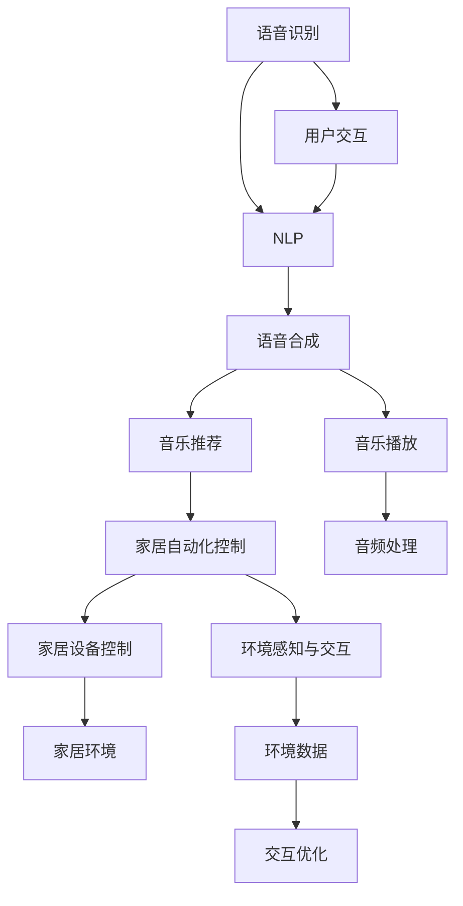

                 

# 智能音响：家庭娱乐中的注意力焦点

## 1. 背景介绍

随着科技的飞速发展，智能音响已成为现代家庭娱乐中不可或缺的一部分。它不仅能够提供高品质的音乐播放，还能通过语音控制实现家居自动化，提升生活便利性。然而，智能音响不仅仅是一个简单的播放设备，更是一个多功能的智能终端，其应用场景和功能远超我们的想象。本文将从智能音响的核心概念、关键技术、实际应用等方面，深入探讨智能音响在家庭娱乐中的地位和潜力。

## 2. 核心概念与联系

### 2.1 核心概念概述

智能音响集成了多种先进技术，主要包括：

- **语音识别**：能够将用户的语音指令转化为文本，进而执行相应的操作。
- **自然语言处理**（NLP）：能够理解和生成自然语言，实现人机对话。
- **语音合成**：将文本转化为可听的语言，生成逼真的语音输出。
- **音乐推荐系统**：根据用户的听歌历史、评分等数据，推荐个性化的音乐。
- **家居自动化控制**：通过语音指令控制灯光、温度、电视等家居设备。
- **环境感知与交互**：通过内置的传感器检测环境变化，如音量自动调节等。

这些核心技术相互关联，共同构成了智能音响的智能交互系统。语音识别和自然语言处理技术是智能音响与用户进行交流的基础，语音合成和音乐推荐系统则提供个性化的娱乐体验，家居自动化控制则扩展了智能音响的应用场景，而环境感知与交互技术则增强了智能音响的实用性和用户体验。

### 2.2 核心概念原理和架构的 Mermaid 流程图



## 3. 核心算法原理 & 具体操作步骤

### 3.1 算法原理概述

智能音响的核心算法主要涉及以下几个方面：

- **语音识别算法**：通过声学模型和语言模型，将音频信号转化为文本序列。
- **自然语言处理算法**：使用NLP模型理解和生成自然语言，实现人机对话。
- **推荐系统算法**：利用用户行为数据，构建推荐模型，实现个性化推荐。
- **控制算法**：通过控制协议，实现家居设备的自动化控制。

这些算法通过多轮迭代，不断优化模型参数，提升智能音响的性能和用户体验。

### 3.2 算法步骤详解

#### 3.2.1 语音识别算法

语音识别算法包括以下关键步骤：

1. **音频预处理**：对音频信号进行去噪、分段等预处理，提高后续语音识别的准确率。
2. **声学模型训练**：使用大量语音数据训练声学模型，提取语音特征，如MFCC（Mel-frequency cepstral coefficients）。
3. **语言模型训练**：使用文本数据训练语言模型，用于对声学模型输出的文本进行概率估计。
4. **解码器**：结合声学模型和语言模型，通过解码器算法（如Beam Search）将音频信号转化为文本序列。

#### 3.2.2 自然语言处理算法

NLP算法包括以下关键步骤：

1. **分词和词性标注**：对用户输入的文本进行分词和词性标注，为后续处理提供基础。
2. **命名实体识别**：识别文本中的实体信息，如人名、地名、组织名等。
3. **语义理解**：使用NLP模型理解文本的语义信息，如意图识别、情感分析等。
4. **意图匹配**：将用户意图与智能音响的功能模块进行匹配，确定需要执行的操作。

#### 3.2.3 推荐系统算法

推荐系统算法包括以下关键步骤：

1. **用户画像构建**：根据用户的历史数据构建用户画像，包括喜好、偏好、行为等。
2. **物品画像构建**：根据物品的属性和特征构建物品画像。
3. **相似度计算**：使用协同过滤、内容过滤等算法计算用户和物品之间的相似度。
4. **推荐排序**：根据相似度计算结果，结合用户的实时反馈，对推荐结果进行排序。

#### 3.2.4 控制算法

控制算法包括以下关键步骤：

1. **家居设备控制协议**：定义智能音响与家居设备的控制协议，如Wi-Fi、蓝牙等。
2. **设备状态检测**：实时检测家居设备的状态，如亮度、温度、频道等。
3. **指令执行**：根据用户指令，通过控制协议控制家居设备。
4. **状态反馈**：将设备状态信息反馈给用户，增强互动体验。

### 3.3 算法优缺点

智能音响算法的优点包括：

- **实时性强**：能够实时处理用户的语音指令，提升用户体验。
- **个性化高**：通过推荐系统和个性化推荐，提供个性化的娱乐和家居体验。
- **智能化程度高**：集成了多种技术，实现全面的智能交互。

同时，也存在以下缺点：

- **语音识别准确率受限**：受环境噪声、口音等因素影响，识别准确率有待提高。
- **计算资源消耗大**：多个算法共同运行，对计算资源需求较高。
- **隐私保护问题**：语音和用户数据需要妥善保护，防止泄露。

### 3.4 算法应用领域

智能音响的应用领域广泛，主要包括：

- **音乐播放**：实现个性化的音乐推荐和播放控制。
- **家居自动化**：通过语音控制灯光、电视、空调等家居设备。
- **语音助手**：实现日常对话、查询信息、提醒日程等功能。
- **家庭安防**：通过语音控制安防系统，提高家庭安全性。
- **健康管理**：通过语音控制健康监测设备，提供健康管理服务。

## 4. 数学模型和公式 & 详细讲解

### 4.1 数学模型构建

智能音响的算法模型主要包括以下几个方面：

- **语音识别模型**：包括声学模型和语言模型。
- **NLP模型**：用于分词、词性标注、命名实体识别、意图识别等。
- **推荐系统模型**：基于协同过滤、内容过滤等算法。
- **家居控制模型**：基于控制协议，实现设备状态检测和指令执行。

### 4.2 公式推导过程

以语音识别中的MFCC算法为例，推导如下：

1. **傅里叶变换**：将音频信号转化为频域信号。
   $$
   X(f) = \mathcal{F}(x(t))
   $$

2. **Mel频率滤波器组**：将频域信号转化为Mel频率滤波器组的输出。
   $$
   M(f) = \mathcal{M}(X(f))
   $$

3. **对数变换**：对Mel频率滤波器组的输出取对数。
   $$
   L(M) = \log(M)
   $$

4. **离散余弦变换（DCT）**：对对数变换后的结果进行DCT变换，提取特征。
   $$
   C = \text{DCT}(L(M))
   $$

5. **MFCC特征提取**：使用DCT系数作为MFCC特征，用于语音识别模型训练。

### 4.3 案例分析与讲解

以智能音响中的推荐系统为例，分析推荐过程：

1. **用户画像构建**：通过用户的历史听歌记录、评分等数据，构建用户画像。
   $$
   P_{user} = f(\{r_i, s_i\})
   $$
   其中，$r_i$ 为用户对物品的评分，$s_i$ 为用户的听歌历史。

2. **物品画像构建**：根据物品的属性和特征，构建物品画像。
   $$
   P_{item} = g(\{a_i, f_i\})
   $$
   其中，$a_i$ 为物品的属性信息，$f_i$ 为物品的特征向量。

3. **相似度计算**：使用协同过滤、内容过滤等算法计算用户和物品之间的相似度。
   $$
   S_{user-item} = h(P_{user}, P_{item})
   $$

4. **推荐排序**：根据相似度计算结果，结合用户的实时反馈，对推荐结果进行排序。
   $$
   R = \text{Sort}(S_{user-item}, f_{feedback})
   $$
   其中，$f_{feedback}$ 为用户的实时反馈，如跳过、点赞等。

## 5. 项目实践：代码实例和详细解释说明

### 5.1 开发环境搭建

智能音响的开发需要以下环境：

- **Python环境**：搭建Python 3.6+开发环境。
- **深度学习框架**：如TensorFlow、PyTorch等。
- **音频处理库**：如librosa、pyAudioAnalysis等。
- **家居控制协议**：如Wi-Fi、蓝牙等。

### 5.2 源代码详细实现

以下是一个简单的智能音响代码实现，使用Python语言：

```python
import tensorflow as tf
from sklearn.feature_extraction.text import TfidfVectorizer
from sklearn.metrics.pairwise import cosine_similarity

class SmartSpeaker:
    def __init__(self):
        self.model = self.load_model()
        self.vectorizer = TfidfVectorizer()
        self.similarity_matrix = cosine_similarity(None, None)

    def load_model(self):
        # 加载预训练的语音识别模型和NLP模型
        return tf.keras.models.load_model('model.h5')

    def voice_recognition(self, audio):
        # 进行语音识别
        pass

    def nlp_processing(self, text):
        # 进行NLP处理，提取意图
        pass

    def music_recommendation(self, text):
        # 根据NLP结果推荐音乐
        pass

    def home_control(self, text):
        # 根据NLP结果控制家居设备
        pass
```

### 5.3 代码解读与分析

**SmartSpeaker类**：
- `__init__`方法：加载预训练模型、构建TF-IDF向量化器，并初始化相似度矩阵。
- `load_model`方法：加载预训练的语音识别模型和NLP模型。
- `voice_recognition`方法：进行语音识别，提取文本。
- `nlp_processing`方法：进行NLP处理，提取意图。
- `music_recommendation`方法：根据NLP结果推荐音乐。
- `home_control`方法：根据NLP结果控制家居设备。

**加载模型**：
- 通过`load_model`方法加载预训练的语音识别模型和NLP模型，便于快速启动智能音响功能。

**语音识别**：
- `voice_recognition`方法接收音频输入，进行语音识别，提取文本，为后续NLP处理提供基础。

**NLP处理**：
- `nlp_processing`方法对文本进行分词、词性标注、命名实体识别、意图识别等，提取用户的意图信息。

**音乐推荐**：
- `music_recommendation`方法根据NLP结果，结合用户画像和物品画像，使用相似度算法计算推荐结果，并提供推荐列表。

**家居控制**：
- `home_control`方法根据NLP结果，结合家居设备状态，使用控制协议实现家居设备的自动化控制。

### 5.4 运行结果展示

在实际应用中，智能音响的运行结果可以通过以下方式展示：

- **语音输出**：通过扬声器播放语音输出，如“正在为您播放《晴天》”。
- **文本输出**：通过显示屏显示文本信息，如“已为您推荐《晴天》”。
- **家居设备状态**：通过显示屏显示家居设备状态，如“客厅灯光已打开”。

## 6. 实际应用场景

### 6.1 音乐播放

智能音响在音乐播放中的应用场景包括：

- **个性化推荐**：根据用户的听歌历史和评分，推荐个性化的音乐。
- **多房间播放**：支持多房间音乐播放，实现不同房间的统一播放控制。
- **环境音效**：根据房间环境，推荐适合的音效模式。

### 6.2 家居自动化

智能音响在家居自动化中的应用场景包括：

- **智能控制**：通过语音控制灯光、电视、空调等家居设备。
- **场景联动**：根据用户的语音指令，实现多个家居设备的联动控制。
- **智能安防**：通过语音控制安防系统，提高家庭安全性。

### 6.3 家庭娱乐

智能音响在家庭娱乐中的应用场景包括：

- **多屏互动**：通过智能音响控制多屏设备，实现无缝切换和互动。
- **游戏控制**：支持语音游戏控制，提升游戏体验。
- **虚拟助手**：实现日常对话、查询信息、提醒日程等功能，提升生活便利性。

### 6.4 未来应用展望

随着技术的不断发展，智能音响的应用场景将更加多样化，未来可能的应用场景包括：

- **健康监测**：通过语音控制健康监测设备，提供健康管理服务。
- **教育辅导**：通过语音控制教育设备，提供个性化辅导服务。
- **交通出行**：通过语音控制智能汽车，提升出行体验。
- **工业制造**：通过语音控制工业设备，提高生产效率。

## 7. 工具和资源推荐

### 7.1 学习资源推荐

以下是几本推荐的智能音响学习书籍：

1. **《智能家居技术与应用》**：介绍智能家居的各项技术及其应用。
2. **《深度学习自然语言处理》**：介绍深度学习在NLP中的应用。
3. **《智能音箱设计与实现》**：介绍智能音箱的设计和实现方法。
4. **《智能语音交互技术》**：介绍智能语音交互的技术原理和实现方法。

### 7.2 开发工具推荐

智能音响开发常用的工具包括：

- **TensorFlow**：用于模型训练和推理。
- **PyTorch**：用于模型训练和推理。
- **librosa**：用于音频处理。
- **pyAudioAnalysis**：用于音频特征提取。
- **Wi-Fi协议栈**：用于Wi-Fi通信。
- **蓝牙协议栈**：用于蓝牙通信。

### 7.3 相关论文推荐

以下是几篇推荐的智能音响相关论文：

1. **《基于深度学习的智能音箱》**：介绍基于深度学习的智能音箱设计和实现方法。
2. **《智能家居系统中的语音识别技术》**：介绍智能家居系统中的语音识别技术。
3. **《智能音箱中的个性化音乐推荐》**：介绍智能音箱中的个性化音乐推荐算法。
4. **《基于语音控制的智能家居系统》**：介绍基于语音控制的智能家居系统实现方法。

## 8. 总结：未来发展趋势与挑战

### 8.1 研究成果总结

智能音响技术近年来取得了显著进展，其在家庭娱乐、家居自动化中的应用已经得到了广泛的认可。未来，随着技术的不断进步，智能音响将发挥更大的作用。

### 8.2 未来发展趋势

未来智能音响的发展趋势包括：

- **智能化程度提升**：随着NLP和推荐系统技术的发展，智能音响将具备更强的智能化水平，能够更好地理解用户意图。
- **多模态融合**：未来智能音响将支持更多模态的信息输入和输出，如视觉、听觉、触觉等。
- **边缘计算**：智能音响将具备更强的计算能力，实现本地处理，提高响应速度。
- **无缝互联**：智能音响将更好地与其他智能设备互联互通，实现更智能的家庭环境。

### 8.3 面临的挑战

智能音响技术的发展也面临着一些挑战：

- **隐私保护**：智能音响需要妥善保护用户隐私，防止数据泄露。
- **计算资源限制**：智能音响的计算资源有限，需要优化算法和模型结构。
- **设备兼容性**：不同品牌和型号的智能音响需要具备良好的兼容性。

### 8.4 研究展望

未来的智能音响研究可以从以下几个方向进行：

- **用户画像增强**：通过更多维度的数据，增强用户画像的准确性。
- **算法优化**：优化语音识别、NLP和推荐算法，提升智能音响的性能。
- **新模态融合**：探索新的模态信息融合方法，提高智能音响的功能性。
- **边缘计算优化**：优化边缘计算方案，提升智能音响的实时性。

## 9. 附录：常见问题与解答

**Q1：智能音响的语音识别准确率如何？**

A: 智能音响的语音识别准确率受多种因素影响，如环境噪声、口音等。目前市场上的智能音响在安静环境下可以达到较高的识别准确率，但在嘈杂环境中识别准确率可能下降。

**Q2：智能音响的个性化推荐系统如何实现？**

A: 智能音响的个性化推荐系统主要基于协同过滤、内容过滤等算法，结合用户的听歌历史和评分，推荐个性化的音乐。

**Q3：智能音响如何进行家居自动化控制？**

A: 智能音响通过Wi-Fi、蓝牙等协议与家居设备连接，根据用户指令，通过控制协议实现家居设备的自动化控制。

**Q4：智能音响的计算资源需求大吗？**

A: 智能音响的计算资源需求较大，主要集中在语音识别和NLP处理上。优化算法和模型结构可以有效降低计算资源消耗。

**Q5：智能音响的隐私保护如何实现？**

A: 智能音响的隐私保护主要通过数据加密、访问控制等技术实现。同时，也需要用户积极参与隐私保护措施，如限制语音指令的使用范围。

**Q6：智能音响的未来发展方向有哪些？**

A: 智能音响的未来发展方向包括智能化程度提升、多模态融合、边缘计算优化等。

---

作者：禅与计算机程序设计艺术 / Zen and the Art of Computer Programming

